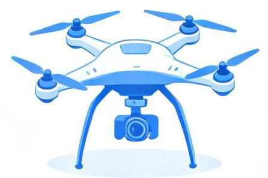
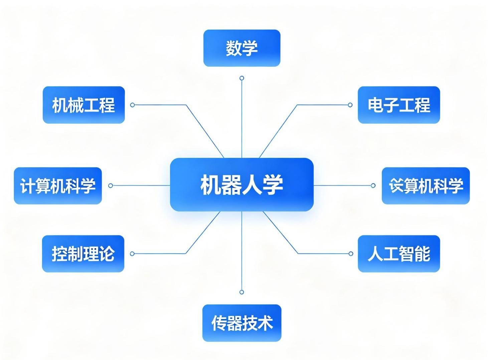
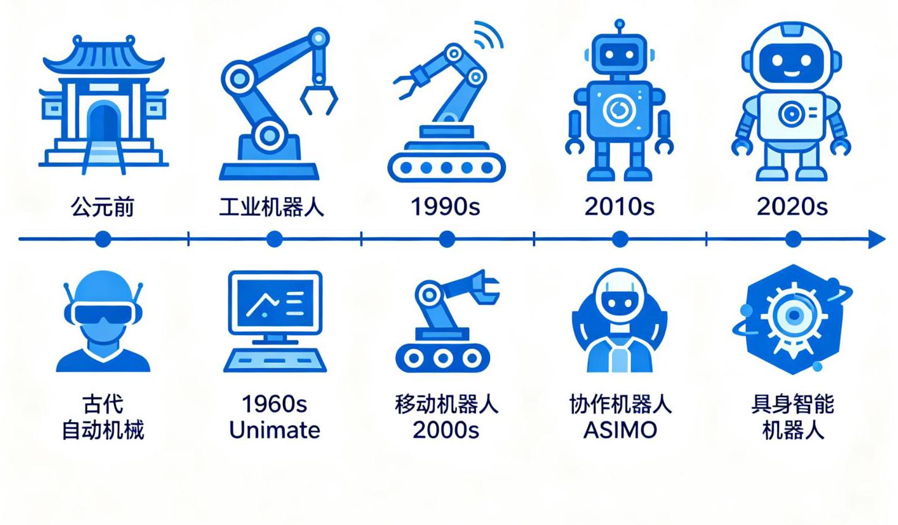

# 第1章 绪论

机器人学

工业机械移动机器人人形机器人

bauaire Mehamot Seaignmidizing Romorgas Mondabelial Ramierus

协作机器人无人机医疗机器人

Conedulum

图1-1 机器人分类与应用领域

图1-2 机器人学学科体系

图1-3 机器人发展历史时间线

## 1.1 机器人学概述

### 1.1.1 什么是机器人学

机器人学是研究机器人的设计、制造、运动和控制的交叉学科。与那些纯理论的自然科学不同，当前机器人学是一门侧重于综合的工程科学。机器人学研究的是怎样综合运用机械、传感器、驱动器和计算机来实现人类某些方面的功能。

在更高层次上，可把机器人学划分为四个主要领域:

1. 机械操作 (Manipulation) : 操作臂的运动学、动力学和控制

2. 移动 (Locomotion) : 移动机器人的运动和导航

3. 计算机视觉 (Computer Vision):环境感知和目标识别

4. 人工智能(Artificial Intelligence):决策和任务规划

本书介绍机械操作的理论和工程知识，这是机器人学的分支学科，建立在力学、控制理论、计算机科学等传统学科基础之上。

### 1.1.2 操作臂的组成

操作臂(Manipulator)是机器人学研究的核心对象。一个典型的操作臂由以下部分组成:

- 连杆(Link):刚性杆件，构成操作臂的骨架。一个拥有N个关节的机械臂有N+1个杆件，编号为0 到N，其中杆件0是操作臂的基座，杆件N携带着末端执行器。

- 关节(Joint):连接相邻连杆的运动副，分为转动关节(Revolute)和移动关节(Prismatic)。关节j连接杆件j-1和杆件j。

- 末端执行器 (End Effector):操作臂末端的工具，如夹爪、焊枪、吸盘

- 驱动器 (Actuator):提供关节运动的动力，如电机、液压、气动

- 传感器 (Sensor):检测关节位置、速度、力矩等状态

### 1.1.3 操作臂控制的核心问题

操作臂的控制涉及三个层次的问题:

1. 运动学(Kinematics):研究关节运动与末端位姿之间的关系，不考虑力和质量

- 正运动学:已知关节角度，求末端位姿

- 逆运动学:已知末端位姿，求关节角度

2. 动力学(Dynamics):研究引起操作臂运动的力和力矩

- 正动力学:已知关节力矩，求关节加速度

- 逆动力学:已知关节运动轨迹，求所需关节力矩

3. 控制 (Control) : 设计控制算法, 使操作臂跟踪期望轨迹

- 位置控制:PID控制、计算力矩控制

- 力控制:阻抗控制、混合力/位置控制

## 1.2 本书的内容安排

根据Craig《机器人学导论》第3版的结构，本书理论篇涵盖以下内容:

<table id="cross-table-1"><tr><td>章节</td><td>主题</td><td>学科基础</td></tr><tr><td>第2章</td><td>空间描述和变换</td><td>线性代数、几何</td></tr><tr><td>第3章</td><td>操作臂运动学</td><td>几何、矩阵运算</td></tr><tr><td>第4章</td><td>操作臂逆运动学</td><td>代数、几何</td></tr><tr><td>第5章</td><td>雅可比:速度和静力</td><td>微积分、线性代数</td></tr><tr><td>第6章</td><td>操作臂动力学</td><td>牛顿力学、拉格朗日力学</td></tr><tr><td>第7章</td><td>轨迹生成</td><td>插值、优化</td></tr><tr><td>第8章</td><td>操作臂的控制</td><td>控制理论</td></tr></table>

每章的最后都有一组习题，习题题号后的方括号中给出难度系数，范围在[00]到[50]之间，[00]是最简单的题目，[50]是尚未被解决的研究性问题。

## 1.3 学习建议与前置知识

本书适用于高年级本科生或低年级研究生课程。选修此课程的学生如果学过静力学和动力学这两门基础课程之一，同时学习过线性代数，并且能够使用计算机高级语言编程，将有助于学习。

特别需要指出的是，虽然本书很多内容源于机械专业，但读者不一定是机械工程师。在斯坦福大学，很多电气工程师、计算机科学家、数学家都认为本书具有很强的可读性。

**推荐视频**

【2025最新】ROS2机器人零基础入门全套教程

涵盖ROS2简介、环境搭建、通信架构等完整入门内容，适合零基础学习者建立机器人系统的整体认知。

[B站观看](https://www.bilibili.com/video/BV1S1n4zFEAG/)

**推荐GitHub项目**

开源机器人学学习指南 (how-to-learn-robotics)

系统的机器人学学习路线，涵盖数学基础、运动学、动力学、控制等模块，附推荐资源和代码示例。

[GitHub仓库](https://github.com/ysu341/how-to-learn-robotics)
