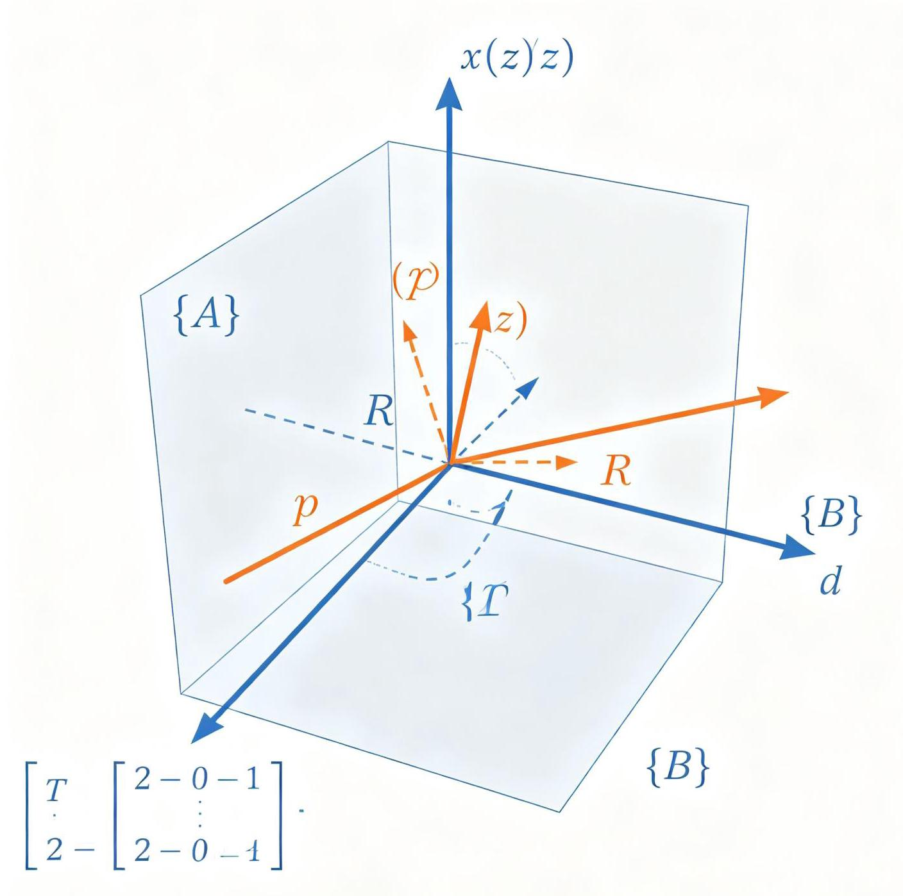
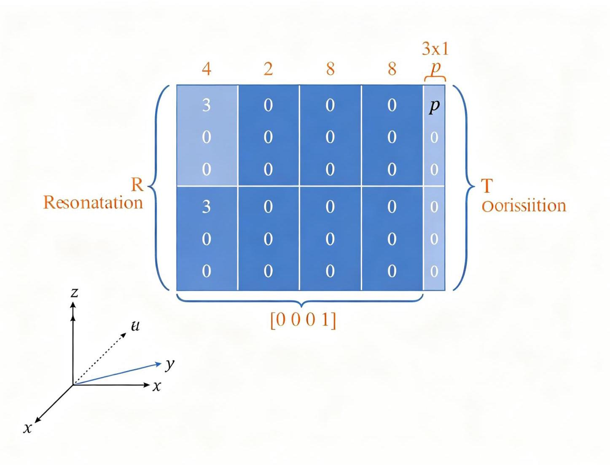
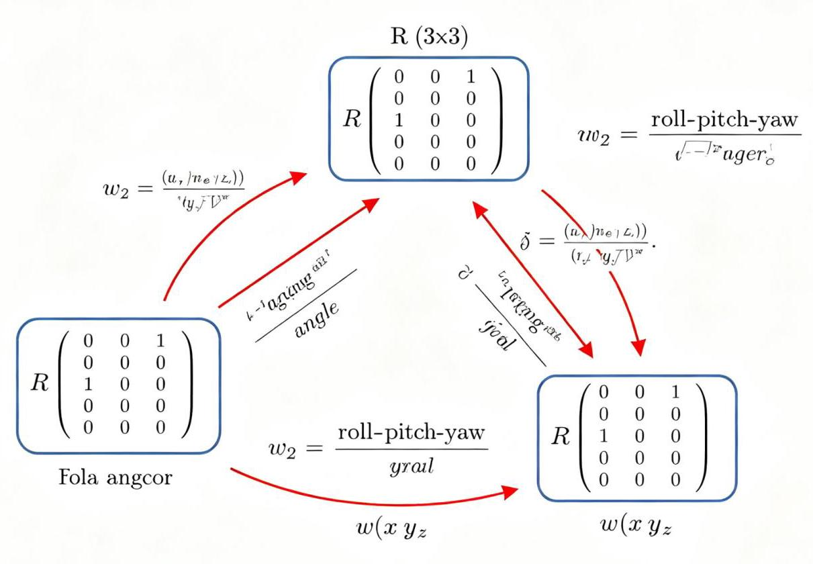

# 第2章 空间描述和变换

图2-1 坐标系空间变换与齐次变换矩阵

图2-2齐次变换矩阵结构

## 2.1 引言

在机器人学中，我们需要用数学语言描述物体在三维空间中的位置和姿态。这是运动学、动力学和控制的基础。本章介绍描述位置、姿态和位姿的方法，以及坐标系之间的映射和变换算子。

---

	E

图片加载失败

---

图2-1:移动机器人在空间中的位姿描述，包含位置向量p和旋转矩阵R组成的齐次变换矩阵T

## 2.2 描述:位置、姿态与位姿

图2-3 旋转表示方法对比(旋转矩阵/欧拉角/四元数)

### 2.2.1 位置的描述

空间中任一点的位置可以用一个3×1的位置矢量表示。设参考坐标系为\{A\}，则点P在\{A\}中的位置表示为:

---

${}^{ \land  }A\;P = {\left\lbrack  p\_ x,\;p\_ y,\;p\_ z\right\rbrack  }^{ \land  }T$

---

其中p_x、p_y、p_z分别是点P沿\{A\}坐标系三个轴的坐标分量。左上角的上标A表示参考坐标系。

### 2.2.2 姿态的描述

刚体的姿态(Orientation)描述了刚体坐标系相对于参考坐标系的旋转。最常用的表示方法是旋转矩阵。

旋转矩阵 (Rotation Matrix) :

设刚体上固连坐标系\{B\}，其三个单位主轴向量为 ${}^{A\mathrm{\;X}\_ \mathrm{B}\text{ 、 }}$ A $\mathrm{Y}\_ \mathrm{B}$ 、 ${}^{A}\mathrm{Y}\_ \mathrm{B}$ 、 ${}^{A}\mathrm{Z}\_ \mathrm{B}$ (在参考系\{A\}中表示)，则旋转矩阵为:

---

	${}^{ \land  }$ A R_B = [^A X_B, ^A Y_B, ^A Z_B] = [r11 r12 r13]

											[r21 r22 r23]

3 											[r31 r32 r33]

---

旅转矩阵是正交矩阵，满足以下性质:

- R^T R = I(正交性)

- $\det \left( \mathrm{R}\right)  = 1$ (行列式为1，保证右手坐标系)

- ${\mathrm{R}}^{\{  - 1\} } = {}^{\mathrm{R}}\mathrm{T}$ (逆等于转置)

旋转矩阵的9个元素中只有3个是独立的，因为满足6个约束条件(3个列向量单位正交 + 行列式=1)。

---

	网

图片加载失败

---

图2-2:坐标系\{B\}相对于\{V\}旋转角度θ，点P在两个坐标系下的坐标通过旋转矩阵联系

**其他姿态表示方法:**

1. 欧拉角(Euler Angles):用三个绕轴旋转的角度描述姿态。常见的ZYX欧拉角(也叫Roll-Pitch– Yaw角):

ZYX欧拉角的旋转矩阵为:R = Rz(ψ) Ry(θ) Rx(φ)

欧拉角的缺点是存在"万向节锁"(Gimbal Lock)问题，当Pitch角为±90°时，Roll和Yaw轴重合，失去一个自由度。

- Roll(滚转角的):绕X轴旋转

- Pitch(俯仰角θ):绕Y轴旋转

- Yaw (偏航角ψ) : 绕Z轴旋转

2. 固定角(Fixed Angles):绕固定坐标系的轴旋转，与欧拉角的旋转顺序相反。XYZ固定角等价于 ZYX欧拉角。

3. 角-轴表示(Angle-Axis):用一个单位向量k(旋转轴)和一个角度θ(绕轴旋转量)描述旋转。

4. 四元数(Quaternion):用四个参数 $\left\lbrack  {\mathrm{w},\mathrm{x},\mathrm{y},\mathrm{z}}\right\rbrack$ 描述旋转，其中 $\mathrm{w}$ 是实部， $\mathrm{x}\text{ 、 }\mathrm{y}\text{ 、 }\mathrm{z}$ 是虚部。四元数避免了万向节锁，计算效率高，是ROS中默认的姿态表示方式。单位四元数满足 ${w}^{2} + {x}^{2} + {y}^{2} + \; {z}^{2} = 1$ 。

### 2.2.3 位姿的描述

位姿(Pose)= 位置 + 姿态，完整描述了刚体在空间中的状态。

齐次变换矩阵(Homogeneous Transform Matrix):

用 $4 \times  4$ 矩阵同时表示位置和姿态:

---

^A T_B = [^A R_B 		^A P_Borg]

	[0 0 0 1 ]

---

其中:

- ^A R_B:3×3旋转矩阵，描述\{B\}相对于\{A\}的姿态

- ^A P_Borg: 3×1位置向量，描述\{B\}原点在\{A\}中的位置

- 最后一行 [0001]: 齐次坐标的标准形式

齐次变换矩阵的优点:可以用矩阵乘法连续表示多次变换，形式简洁统一。在机器人学中，齐次变换矩阵是描述连杆坐标系之间关系的标准工具。

## 2.3 映射: 从一个坐标系到另一个坐标系的变换

### 2.3.1 平移映射

已知点P在坐标系\{B\}中的位置 ${}^{ \land  }$ B P，且\{B\}的原点在\{A\}中的位置为 ${}^{ \land  }$ A P_Borg，两坐标系姿态相同，则 P在\{A\}中的位置为:

---

1 ^A P = ^B P + ^A P_Borg

---

### 2.3.2 旋转映射

已知点P在坐标系\{B\}中的位置 ${}^{ \land  }$ B P，两坐标系原点重合，\{B\}相对于\{A\}的旋转矩阵为 ${}^{ \land  }$ A R_B，则P在\{A\} 中的位置为:

---

${}^{ \land  }A\mathrm{P} = {}^{ \land  }A\mathrm{R}\_ B \times  {}^{ \land  }\mathrm{B}\mathrm{P}$

---

### 2.3.3 一般变换映射

一般情况下，坐标系\{B\}相对于\{A\}既有平移又有旋转，则:

---

1 ^A P = ^A R_B × ^B P + ^A P_Borg

---

用齐次变换矩阵表示为:

---

[^A P] = [^A R_B ^A P_Borg] [^B P]

														[1] [0 0 0 0 1][1]

---

即: ^A P = ^A T_B × ^B P(齐次坐标形式)

## 2.4 算子:平移、旋转和变换

### 2.4.1 平移算子

将点P沿向量Q平移:P' = P + Q。用齐次变换矩阵表示:

---

Trans(Q) = [I Q]

	[0 1]

---

### 2.4.2 旋转算子

将点P绕某轴旋转角度θ。三个基本旋转矩阵:

**绕X轴旋转 $\theta$ :**

---

${Rx}\left( \theta \right)  = \lbrack 1$ 			0

	0 cos(θ) -sin(θ)]

	[0 sin(θ) cos(θ)]

---

**绕Y轴旋转 $\theta$ :**

---

${Ry}\left( \theta \right)  = \left\lbrack  \begin{array}{lll} \cos \left( \theta \right) & 0 & \sin \left( \theta \right)  \end{array}\right\rbrack$

	$\left\lbrack  \begin{array}{llllll}  & 0 & & 1 & & 0 \end{array}\right\rbrack$

	[-sin(θ) 0 cos(θ)]

	网

图片加载失败

---

图2-3:绕Y轴旋转角度β，x轴和z轴在x-z平面内旋转，y轴保持不变

**绕Z轴旋转 $\theta$ :**

---

1 	${Rz}\left( \theta \right)  = \lbrack \cos \left( \theta \right)  - \sin \left( \theta \right) \;$

2 			[sin(θ) cos(θ) 0]

			[ 0 0 1]

---

注意:旋转矩阵的乘法顺序很重要，不满足交换律，即 R1xR2 ≠ R2xR1。

### 2.4.3 变换算子

一般变换是平移和旋转的组合。注意区分两种解释:

- 固定坐标系解释(相对变换):所有旋转都绕固定坐标系的轴进行

- 当前坐标系解释(绝对变换):每次旋转都绕当前(变换后的)坐标系的轴进行

对于相同的角度序列，固定坐标系的旋转矩阵等于当前坐标系旋转矩阵的逆序。

## 2.5 变换的计算与应用

### 2.5.1 变换的复合

已知坐标系\{B\}相对于\{A\}的变换为 ^A T_B，坐标系\{C\}相对于\{B\}的变换为 ^B T_C，则\{C\}相对于\{A\}的变换为:

---

${}^{ \land  }$ A T_C = ^A T_B × ^B T_C

---

这就是变换的复合规则。矩阵乘法的顺序很重要，必须按照坐标系的链式关系依次相乘。

### 2.5.2 逆变换

已知 ${}^{ \land  }$ A T_B，则 ${}^{ \land  }$ B T_A(B到A的逆变换)为:

---

${}^{ \land  }\mathrm{B}\mathrm{T}\_ \mathrm{A} = {\left( {}^{ \land  }\mathrm{A}\mathrm{T}\_ \mathrm{B}\right) }^{ \land  }\left( {-1}\right)  = \left\lbrack  \begin{array}{lll} {\mathrm{R}}^{ \land  }\mathrm{T} &  - {\mathrm{R}}^{ \land  }\mathrm{T} & \mathrm{P} \end{array}\right\rbrack$

	[0 1 ]

---

逆变换的物理意义:从\{B\}看\{A\}的位姿。旋转部分取转置(因为正交矩阵的逆等于转置)，位置部分需要旋转后取负。

### 2.5.3 ROS中的TF变换系统

ROS(机器人操作系统)提供了TF(Transform)库，用于管理和查询坐标系之间的变换关系。TF2是 ROS2中的升级版本。

TF2的核心概念:

- 坐标系(Frame):命名的参考系，如"base_link"、"map"、"odom"、"laser_link"

- 变换 (Transform) : 两个坐标系之间的位姿关系, 包含平移和旋转

- 变换树 (Transform Tree): 所有坐标系通过父子关系连接成树状结构(不能有环)

- 监听者 (Listener) : 查询任意两个坐标系之间的变换，自动处理链式变换

- 广播者 (Broadcaster) : 发布坐标系之间的变换关系

典型的移动机器人TF树:

---

map $\rightarrow$ odom $\rightarrow$ base_link $\rightarrow$ laser_link

	$\rightarrow$ camera_link

	$\rightarrow$ imu_link

	$\rightarrow$ wheel_left_link

	→ wheel_right_link

---

在这个树中:

map 是地图坐标系(固定)

odom 是里程计坐标系(漂移累积)

- base_link 是机器人本体坐标系

- 传感器坐标系都挂在base_link下

查询 laser_link 相对于 map 的变换时，TF2会自动沿树查找并复合变换:^map T_laser = ^map T_odom × ^odom T_base × ^base T_laser

### 2.5.4 Python代码示例

---

	import numpy as np

	def rotate_x(theta):

				"""绕X轴旋转的旋转矩阵"""

				return np.array([

							[1, 0,

							[0, np.cos(theta), -np.sin(theta)],

							[0, np.sin(theta), np.cos(theta)]

				])

- def rotate_y(theta):

				"""绕Y轴旋转的旋转矩阵"""

				return np.array([

							[ np.cos(theta), 0, np.sin(theta)],

							[0, 1, 0],

							[-np.sin(theta), 0, np.cos(theta)]

				])

- def rotate_z(theta):

				"""绕Z轴旋转的旋转矩阵"""

				return np.array([

							[np.cos(theta), -np.sin(theta), 0],

							[np.sin(theta), np.cos(theta), 0],

							[0, 0, 1]

				])

- def homogeneous_transform(R, P):

				"""构建齐次变换矩阵"""

				T = np.eye(4)

				T[:3, :3] = R

				T[:3, 3] = P

				return T

	#示例: ZYX欧拉角 (Roll-Pitch-Yaw) 转旋转矩阵

	roll, pitch, yaw = 0.1, 0.2, 0.3

	R = rotate_z(yaw) @ rotate_y(pitch) @ rotate_x(roll)

	print("ZYX欧拉角对应的旋转矩阵:")

	print(R)

	#构建齐次变换矩阵

	P = np.array([1.0, 2.0, 3.0])

	T = homogeneous_transform(R, P)

	print("\\n齐次变换矩阵 T:")

	print(T)

	#计算逆变换

	T_inv = np.linalg.inv(T)

print("\\n逆变换 T_inv:")

print(T_inv)

---

**推荐视频**

【中英双语】具身智能ROS2机器人开发入门全攻略

包含TF坐标变换系统、URDF建模、Gazebo仿真等核心主题，每期聚焦一个具体问题，强调动手能力。

B B站观看

**推荐GitHub项目**

MATLAB-For-Robotics-concepts

基于Craig《机器人学导论》的MATLAB代码，包含空间变换、运动学、动力学、轨迹规划的交互式脚本和可视化动画。

O GitHub仓库
