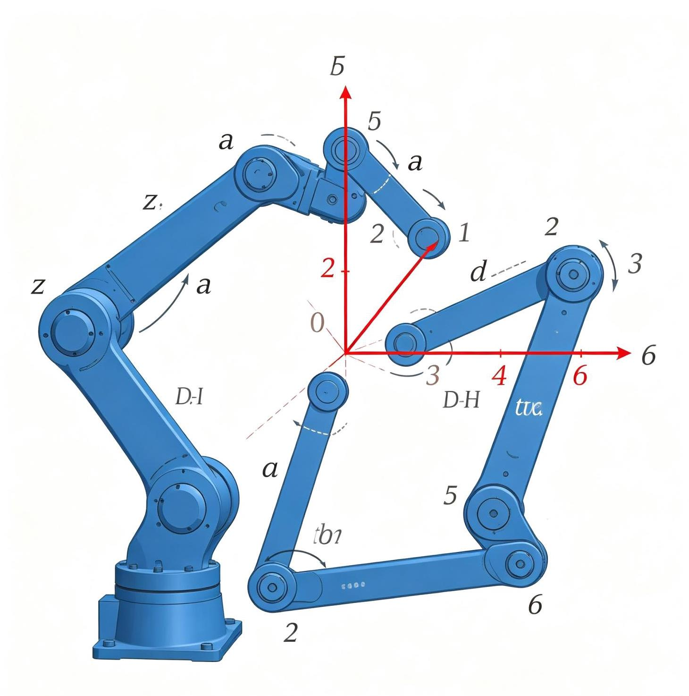
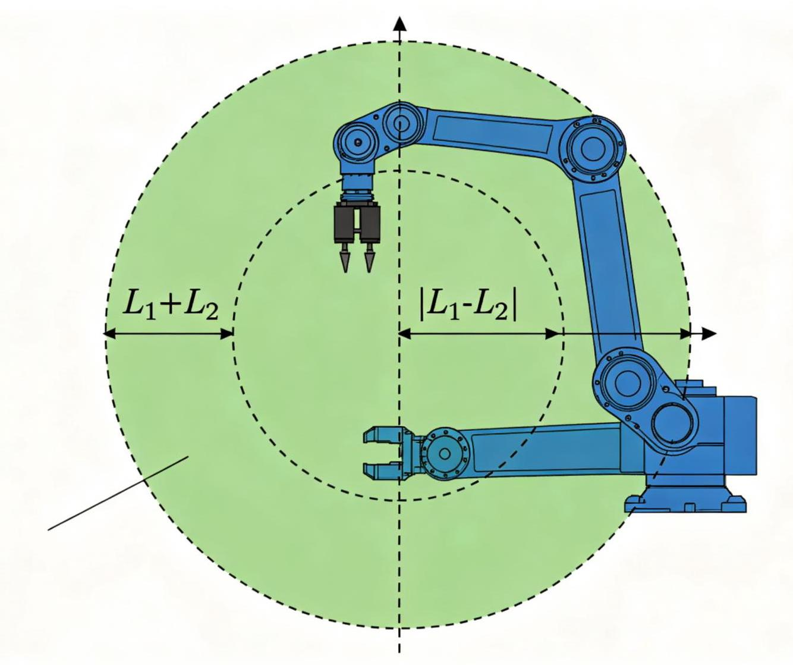
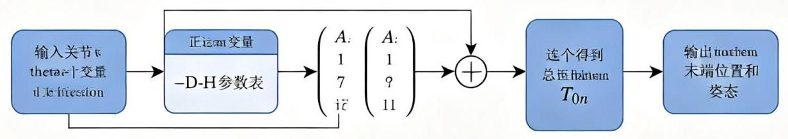

# 第3章 操作臂运动学

3-1 六自由度机械臂D-H参数坐标系

3-2二自由度机械臂工作空间

## 3.1 引言

操作臂运动学(Manipulator Kinematics)研究操作臂的运动，不考虑引起运动的力和力矩。本章介绍如何用连杆参数描述操作臂，以及如何计算末端执行器的位置和姿态(正运动学)。

运动学是机器人学中最基础的内容, 是动力学、轨迹规划和控制的前提。

## 3.2 连杆与关节的描述

### 3.2.1 连杆参数

操作臂由一系列连杆通过关节连接而成。每个连杆有两个关键参数:

- 连杆长度(a_i):相邻两关节轴线之间的公垂线长度。关节i的轴线和关节i+1的轴线之间的最短距离。

- 连杆扭转角(a_i):相邻两关节轴线之间的夹角。绕公垂线a_i旋转，从关节i轴线转到关节i+1轴线的角度。

这两个参数描述了连杆本身的几何特性，与关节变量无关。

### 3.2.2 关节参数

每个关节连接两个连杆(连杆i-1和连杆i)，有两个参数:

- 连杆偏移(d_i):沿关节i轴线，相邻两连杆公垂线(a_\{i-1\}和a_i)之间的距离。

- 关节角(θ_i):绕关节i轴线，从a_\{i-1\}旋转到a_i的角度。

对于转动关节(Revolute)，θ_i是变量，d_i是常数；对于移动关节(Prismatic)，d_i是变量，θ_i是常数。

### 3.2.3 四参数总结

每个关节-连杆组合用四个参数描述:

<table><tr><td>参数</td><td>符号</td><td>描述</td><td>转动关节</td><td>移动关节</td></tr><tr><td>连杆长度</td><td>a_i</td><td>关节轴i和i+1之间的距离</td><td>常数</td><td>常数</td></tr><tr><td>连杆扭转</td><td>a_i</td><td>关节轴i和i+1之间的夹角</td><td>常数</td><td>常数</td></tr><tr><td>连杆偏移</td><td>d_i</td><td>沿关节轴i，两公垂线之间的距离</td><td>常数</td><td>变量</td></tr><tr><td>关节角</td><td>θ_i</td><td>绕关节轴i，两公垂线之间的夹角</td><td>变量</td><td>常数</td></tr></table>

## 3.3 Denavit-Hartenberg参数

### 3.3.1 D-H坐标系建立规则

图3-3 正运动学计算流程

Denavit-Hartenberg(D-H)参数法是描述操作臂连杆坐标系的标准方法，由Denavit和Hartenberg于 1955年提出。通过在每个连杆上建立坐标系，用四个参数(a_i, a_i, d_i, θ_i)确定相邻连杆坐标系之间的变换。

坐标系建立规则(标准D-H):

1. z轴: $z$ _\{i-1\}轴沿关节i的运动轴线方向

2. x轴:x_i轴沿z_\{i-1\}和z_i的公垂线方向，从z_\{i-1\}指向z_i

3. 原点: $\mathrm{O}_\mathrm{i}$ 在z_i轴与x_i轴的交点

4. y轴:由右手定则确定，y_i = z_i × x_i

特殊情况:

- 当z_\{i-1\}和z_i平行时，公垂线不唯一，选择使d_i=0的公垂线

- 当z_\{i-1\}和z_i相交时，a_i=0，x_i轴方向任选(通常选择使其他参数简化的方向)

ECINE

图片加载失败

图3-1:D-H参数连杆坐标系设定，a_j为连杆长度，a_j为连杆扭转角，d_j为连杆偏移，θ_j为关节角

### 3.3.2 D-H变换矩阵

连杆i坐标系\{i\}相对于连杆i-1坐标系\{i-1\}的变换由四个基本变换按顺序组成:

---

$$
{}^{i-1}T_i=\operatorname{Rot}_z(\theta_i)\operatorname{Trans}_z(d_i)\operatorname{Trans}_x(a_i)\operatorname{Rot}_x(\alpha_i)
$$

---

即:先绕z轴旋转θ_i，再沿z轴平移d_i，再沿x轴平移a_i，最后绕x轴旋转α_i。

展开为矩阵形式:

---

$$
{}^{i-1}T_i=\begin{bmatrix}
\cos\theta_i&-\sin\theta_i\cos\alpha_i&\sin\theta_i\sin\alpha_i&a_i\cos\theta_i\\
\sin\theta_i&\cos\theta_i\cos\alpha_i&-\cos\theta_i\sin\alpha_i&a_i\sin\theta_i\\
0&\sin\alpha_i&\cos\alpha_i&d_i\\
0&0&0&1
\end{bmatrix}
$$

---

这个矩阵是机器人运动学中最重要的公式之一，每个元素都有明确的几何意义。

### 3.3.3 D-H参数表示例

以PUMA560机械臂为例，这是一个经典的6自由度工业机械臂，其D-H参数表如下:

| 关节i | a_i (m) | a_i (rad) | d_i (m) | θ_i (rad) | 类型 |
| --- | --- | --- | --- | --- | --- |
| 1 | 0 | $- \pi /2$ | 0.6718 | 0_1 | 转动 |
| 2 | 0.4318 | 0 | 0 | $\theta _2$ | 转动 |
| 3 | 0.0203 | $- \pi /2$ | 0.15005 | $\theta _3$ | 转动 |
| 4 | 0 | π/2 | 0.4318 | $\theta _4$ | 转动 |
| 5 | 0 | - π/2 | 0 | $\theta _5$ | 转动 |
| 6 | 0 | 0 | 0 | $\theta _6$ | 转动 |

PUMA560的后三个关节(4、5、6)轴线交于一点(腕部中心)，满足Pieper准则，因此存在逆运动学封闭解。

图3-2:五自由度机械臂的D-H坐标系建立，每个关节处建立坐标系x_i-y_i-z_i

## 3.4 正运动学求解

### 3.4.1 正运动学问题

正运动学(Forward Kinematics, FK):已知所有关节变量(θ_i或d_i)，求末端执行器相对于基座坐标系的位姿。

对于n自由度操作臂，末端坐标系\{n\}相对于基座坐标系\{0\}的变换为各连杆变换的连乘:

---

1 ^ 0 T_n = ^0 T_1 × ^1 T_2 × ^2 T_3 × ... × ^\{n-1\}T_n

---

这个乘积的结果是一个4×4的齐次变换矩阵，包含末端的位置(最后一列前3个元素)和姿态(左上角 3×3矩阵)。

### 3.4.2 二自由度平面机械臂

最简单的操作臂是二自由度平面机械臂，两个转动关节在平面内运动。

D-H参数表:

| 关节i | a_i | a_i | d_i | $\theta _i$ |
| --- | --- | --- | --- | --- |
| 1 | 11 | 0 | 0 | ${\theta 1}$ |
| 2 | 12 | 0 | 0 | ${\theta 2}$ |

正运动学解:

---

$$
\begin{aligned}
x&=l_1\cos\theta_1+l_2\cos(\theta_1+\theta_2)\\
y&=l_1\sin\theta_1+l_2\sin(\theta_1+\theta_2)\\
\varphi&=\theta_1+\theta_2
\end{aligned}
$$

---

### 3.4.3 三自由度平面机械臂

增加一个关节后，末端可以在平面内到达任意位姿(x, y, φ)。正运动学:

---

$$
\begin{aligned}
x&=l_1\cos\theta_1+l_2\cos(\theta_1+\theta_2)+l_3\cos(\theta_1+\theta_2+\theta_3)\\
y&=l_1\sin\theta_1+l_2\sin(\theta_1+\theta_2)+l_3\sin(\theta_1+\theta_2+\theta_3)\\
\varphi&=\theta_1+\theta_2+\theta_3
\end{aligned}
$$

---

### 3.4.4 Python代码示例

---

	import numpy as np

	def dh_transform(a, alpha, d, theta):

			"""计算单个D-H齐次变换矩阵"""

			return np.array([

					[np.cos(theta), -np.sin(theta)*np.cos(alpha), np.sin(theta)*np.si

	n(alpha), a*np.cos(theta)],

					[np.sin(theta), np.cos(theta)*np.cos(alpha), -np.cos(theta)*np.si

	n(alpha), a*np.sin(theta)],

					[0, 														np.sin(alpha), 																														np.cos(alpha),

							d],

					[0, 														0, 																														0,

								1]

			])

- def forward_kinematics(dh_params):

			"""正运动学求解:连乘所有D-H变换"""

			T = np.eye(4)

			for params in dh_params:

					T = T @ dh_transform(**params)

			return T

	#示例:三自由度平面机械臂

	l1, l2, l3 = 1.0, 1.0, 1.0

	theta1, theta2, theta3 = 0.5, 0.3, -0.2

- dh_params = [

			{'a': 11, 'alpha': 0, 'd': 0, 'theta': theta1},

			{'a': 12, 'alpha': 0, 'd': 0, 'theta': theta2},

			{'a': l3, 'alpha': 0, 'd': 0, 'theta': theta3},

	]

	T = forward_kinematics(dh_params)

	print(f"末端位置: x={T[0,3]:.4f}, y={T[1,3]:.4f}, z={T[2,3]:.4f}")

---

## 3.5 运动学实例分析

### 3.5.1 斯坦福机械臂

斯坦福机械臂(Stanford Manipulator)是经典的6自由度操作臂，前三个关节(两个转动+一个移动) 确定腕部位置，后三个关节(球腕)确定末端姿态。由于腕部三个轴交于一点，满足Pieper准则，存在逆运动学封闭解。

### 3.5.2 工业机械臂的典型构型

<table><tr><td>构型</td><td>关节类型</td><td>工作空间</td><td>典型应用</td></tr><tr><td>笛卡尔(Cartesian)</td><td>3移动</td><td>长方体</td><td>龙门式、3D打印</td></tr><tr><td>圆柱(Cylindrical)</td><td>1转动+2移动</td><td>圆柱体</td><td>搬运、装配</td></tr><tr><td>球坐标(Spherical)</td><td>2转动+1移动</td><td>球体</td><td>焊接、喷涂</td></tr><tr><td>关节型(Articulated)</td><td>3转动</td><td>类球体</td><td>通用工业机械臂</td></tr><tr><td>SCARA</td><td>2转动+1移动</td><td>平面</td><td>电子装配</td></tr></table>

**推荐视频**

别再被MoveIt 2劝退! 手把手搞定ROS 2机械臂规划

从基础环境配置与Gazebo仿真联动起步，逐步深入到C++接口调用、避障规划、笛卡尔路径生成以及逆运动学求解等核心模块。

B B站观看

**推荐GitHub项目**

Pinocchio — 高效刚体动力学库

机器人运动学和动力学的C++/Python库，支持正/逆运动学、雅可比、动力学计算，性能优异，广泛应用于科研和工业领域。

O GitHub仓库
