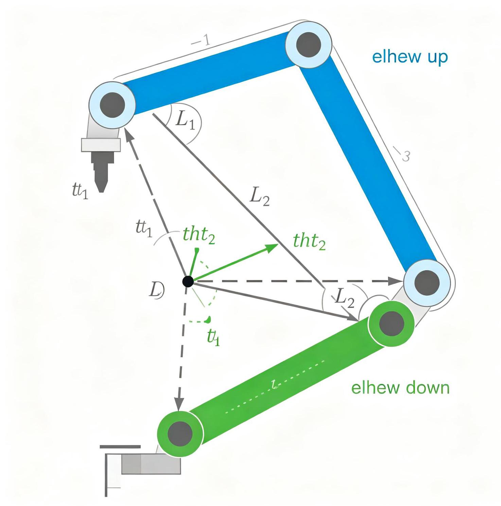
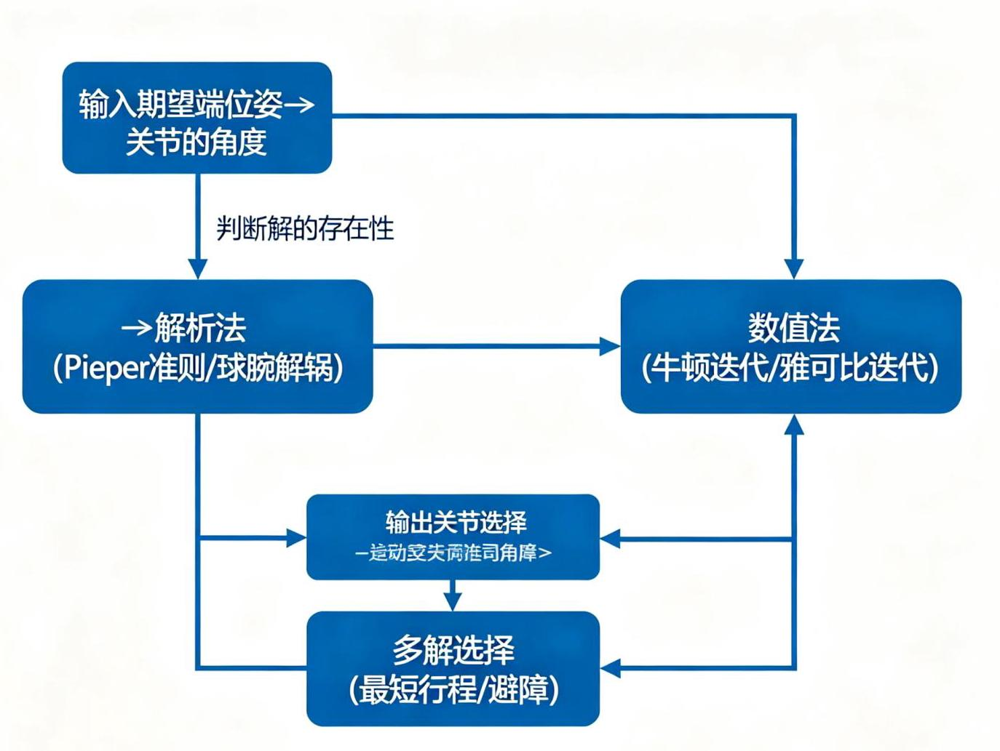
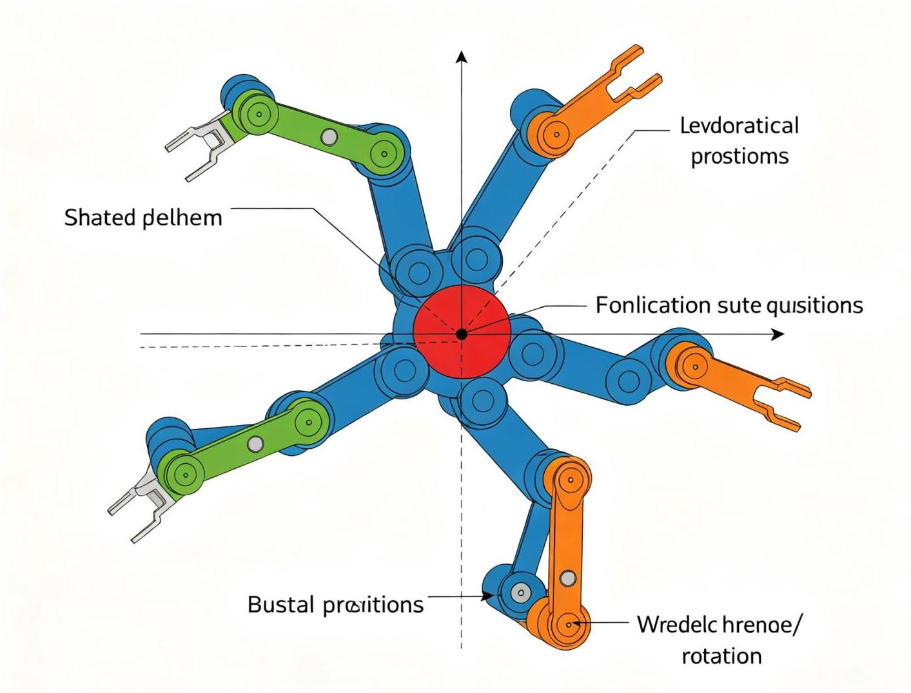

# 第4章 操作臂逆运动学

图4-1 逆运动学多解示意图(肘上/肘下)

## 4.1 逆运动学问题描述

图4-2 逆运动学求解流程

### 4.1.1 什么是逆运动学

逆运动学(Inverse Kinematics, IK):已知末端执行器的期望位姿，求解满足该位姿的关节变量。

与正运动学不同, 逆运动学问题更加复杂, 可能存在以下情况:

1. 多解(Multiple Solutions):多个关节配置可以达到同一位姿。例如二连杆平面臂的"肘向上"和"肘向下"两种构型。6自由度操作臂最多可能有16组解。

2. 无解 (No Solution) : 期望位姿超出操作臂的工作空间，或者末端姿态无法达到。

3. 无限多解(Infinite Solutions):当操作臂的自由度大于6(冗余度机器人)时，同一末端位姿对应无限多组关节变量。

4. 奇异(Singularity):在某些位姿下，雅可比矩阵秩亏，速度映射不可逆。

### 4.1.2 逆运动学的重要性

逆运动学是机器人控制的基础:

- 给定末端期望轨迹，需要通过逆运动学转换为关节轨迹

- 笛卡尔空间的路径规划需要逆运动学实时求解

- 示教再现、视觉伺服等应用都依赖逆运动学

## 4.2 可解性与工作空间

### 4.2.1 工作空间

工作空间 (Workspace) 是操作臂末端能够到达的所有位姿的集合:

- 可达工作空间 (Reachable Workspace) : 末端至少能以一种姿态到达的点的集合

- 灵活工作空间 (Dexterous Workspace) : 末端能以任意姿态到达的点的集合 (灵活工作空间是可达工作空间的子集)

对于6自由度操作臂，如果腕部三轴交于一点(球腕)，则位置和姿态可以解耦:前3个关节确定腕部位置，后3个关节确定末端姿态。

### 4.2.2 逆运动学可解性

- 封闭解(Closed-form Solution):能用解析公式直接求解，计算速度快，适合实时控制

- 代数法:通过变换矩阵元素列方程求解

- 几何法:通过几何关系直观求解

- 数值解(Numerical Solution):通过迭代算法逼近解，通用性强但计算量大，可能不收敛

Pieper准则(Pieper's Criterion):当操作臂的三个相邻关节轴线交于一点时，逆运动学存在封闭解。 大多数工业机械臂(如PUMA、斯坦福臂、ABB、KUKA等)都采用球腕设计，满足这个条件。

### 4.2.3 解的选择

当存在多组解时，需要根据以下条件选择合适的解:

- 避障:选择不与障碍物碰撞的解

- 关节限位:选择在关节限位范围内的解

- 最短行程:选择从当前关节位置移动距离最短的解

- 能耗最小:选择运动能耗最小的解

- 避免奇异:选择远离奇异位形的解

## 4.3 代数解法与几何解法

### 4.3.1 二自由度平面臂的逆运动学

已知末端位置(x, y)，连杆长度l1, l2，求解关节角θ1, θ2。

几何法:

由余弦定理,末端到基座的距离 $r = \sqrt{}\left( {{x}^{2} + {y}^{2}}\right)$ :

---

${r}^{2} = {l1}^{2} + {l2}^{2} - 2{l1}{l2}\cos \left( {\pi  - {\theta 2}}\right)$

	$= l{1}^{2} + l{2}^{2} + {2l1l2}\cos \left( {\theta 2}\right)$

因此:

$\cos \left( {\theta 2}\right)  = \left( {{r}^{2} - l{1}^{2} - l{2}^{2}}\right) /\left( {2l1l2}\right)$

---

θ2有两个解:

---

${\theta 2} =  + \arccos \left( {\cos \left( {\theta 2}\right) }\right)$ 	(肘向上, elbow up)

θ2 = - arccos(cos(θ2)) 	(肘向下, elbow down)

---

01的求解:

---

1 θ1 = atan2(y, x) - atan2(l2 sin(θ2), l1 + l2 cos(θ2))

---

其中atan2(y, x)是四象限反正切函数，返回值范围(−π, π]。

**解的存在条件:**

- $\left| {\cos \left( {\theta 2}\right) }\right|  \leq  1$ ,即 $\left| {{r}^{2} - {11}^{2} - {12}^{2}}\right|  \leq  2\left| {11}\right|$

- 等价于 $\left| \right| 1 - \left| 2\right|  \leq  r \leq  1 + 1/2$

### 4.3.2 三自由度平面臂的逆运动学

三自由度平面臂可以到达任意位姿(x, y, ϕ)。由于多了一个自由度，可以先指定腕部位置，再求解。

一种常用方法:

1. 给定末端位姿 $\left( {x, y,\phi }\right)$ ，指定腕部位置偏移: $\left( {x\_ w, y\_ w}\right)  = \left( {x - {13}\cos \left( \phi \right) , y - {13}\sin \left( \phi \right) }\right)$

2. 对前两个连杆用二连杆逆运动学求解 ${\theta 1},{\theta 2}$

3. ${\theta 3} = \phi  - {\theta 1} - {\theta 2}$

### 4.3.3 6自由度球腕机械臂的逆运动学

图4-3 球腕解耦逆运动学

对于腕部三轴交于一点的6自由度机械臂，逆运动学可以解耦为两部分:

1. 位置逆解:已知腕部中心位置，求解前3个关节( ${\theta 1}$ ， ${\theta 2}$ ， ${\theta 3}$ )

2. 姿态逆解:已知末端期望姿态和前3关节确定的腕部姿态，求解后3个关节(θ4, θ5, θ6)

姿态部分通常转化为求解一个3×3旋转矩阵的ZYZ欧拉角，有两组解(对应腕部翻转)。

## 4.4 迭代数值解法

### 4.4.1 为什么需要数值解法

当操作臂不满足Pieper准则(无封闭解)，或者需要考虑关节限位、避障等约束时，使用数值迭代法求解逆运动学。

### 4.4.2 雅可比转置法(Jacobian Transpose)

基本思想:利用雅可比矩阵的转置将末端误差映射到关节空间修正量。

---

迭代公式:

${\Delta \theta } = \alpha  \times  {J}^{\pi }T\left( q\right)  \times  {\Delta x}$

	q_\{k+1\} = q_k + Δθ

其中:

Δx = x_desired - x_current (末端位置/姿态误差)

	J(q) = 当前雅可比矩阵

	$\alpha  =$ 步长因子(需要适当选择，太大会振荡，太小收敛慢)

---

优点: 简单, 计算量小

缺点:收敛慢，可能在最小值附近振荡

### 4.4.3 牛顿-拉夫逊法(Newton-Raphson)

---

${\Delta \theta } = {J}^{ \land  }\{  - 1\} \left( q\right)  \times  {\Delta x}$

	$q\_ \{ k + 1\}  = q\_ k + {\Delta \theta }$

---

优点:二次收敛，速度快

缺点:需要雅可比可逆，接近奇异时数值不稳定，计算量大(求逆)

### 4.4.4 阻尼最小二乘法(Damped Least Squares, DLS)

在奇异位置附近，雅可比矩阵病态，DLS方法通过添加阻尼项提高数值稳定性:

---

${\Delta \theta } = {J}^{\pi }T{\left( J{J}^{\pi }T + {\lambda }^{2}I\right) }^{\lambda }\{  - 1\} {\Delta x}$

---

其中λ是阻尼系数:

- λ=0时退化为伪逆法(最小范数解)

- λ较大时稳定性好但收敛慢

- 可以根据奇异程度自适应调整 $\lambda$

DLS方法是实际机器人系统中最常用的逆运动学数值解法。

### 4.4.5 Python代码示例

---

		import numpy as np

	def jacobian_2d(q, l1, l2):

						"""二自由度平面臂的雅可比矩阵"""

						theta1, theta2 = q

						J = np.array([

										[-l1*np.sin(theta1) - l2*np.sin(theta1+theta2), -l2*np.sin(theta1+

		theta2)],

										[ l1*np.cos(theta1) + l2*np.cos(theta1+theta2), l2*np.cos(theta1+

		theta2)]

						])

						return $J$

- def forward_2d(q, l1, l2):

						"""二自由度平面臂正运动学"""

						theta1, theta2 = q

						x = l1*np.cos(theta1) + l2*np.cos(theta1+theta2)

						y = l1*np.sin(theta1) + l2*np.sin(theta1+theta2)

						return np.array([x, y])

	def inverse_kinematics_dls(target, q0, l1, l2, max_iter=100, tol=1e-6, lam

		=0.1):

					"""阻尼最小二乘法(DLS)求解逆运动学"""

						q = np.array(q0, dtype=float)

						for i in range(max_iter):

									current = forward_2d(q, l1, l2)

										error = target - current

									if np.linalg.norm(error) < tol:

													print(f"收敛于第\{i\}次迭代")

														return q

										J = jacobian_2d(q, l1, l2)

									dq = J.T @ np.linalg.inv(J @ J.T + lam**2 * np.eye(2)) @ error

									$q \mathrel{\text{ += }} {dq}$

						return q

		#测试

		l1, l2 = 1.0, 1.0

		target = np.array([1.5, 1.0])

	q_solution = inverse_kinematics_dls(target, [0.1, 0.1], l1, l2)

		print(f"解: θ1=\{q_solution[0]:.4f\}, θ2=\{q_solution[1]:.4f\}")

		print(f"验证位置: \{forward_2d(q_solution, l1, l2)\}")

---

## 4.5 逆运动学的实际考虑

### 4.5.1 关节限位

实际机器人的关节都有运动范围限制，逆运动学求解后需要检查解是否在限位范围内。如果不在，需要选择其他解或报告无解。

### 4.5.2 速度级逆运动学

在轨迹跟踪中, 通常不需要每次都求位置级逆运动学, 而是在速度级求解:

---

$\dot{q} = {J}^{ \land  }\{  - 1\} \left( q\right)  \times  \dot{x}$

---

然后积分得到关节位置。这种方法可以自然处理多解问题(通过零空间投影优化次要目标)。

### 4.5.3 冗余度机器人

当自由度n > 6时，逆运动学有无穷多解。可以利用冗余度优化次要目标(避障、关节限位回避、能耗最小、奇异回避)。通过零空间投影实现:

---

$\dot{q} = {J}^{ \frown  } + \dot{x} + \left( {I - {J}^{ \frown  } + J}\right) \dot{q} = 0$

---

其中 ${\mathrm{J}}^{ + }$ 是伪逆， $\mathrm{q}\_ 0$ 是次要目标的关节速度， $\left( {\mathrm{I} - {\mathrm{J}}_{ + }\mathrm{J}}\right)$ 是零空间投影矩阵。

**推荐视频**

ROS2 Movelt 2机械臂控制实战

包含逆运动学求解器(KDL/IKFast/TRAC-IK)配置、四种主流路径规划策略对比、笛卡尔路径生成等核心内容。

B B站观看

**推荐GitHub项目**

ROS-Theory-Practice (ROS理论与实践)

从机器人模型创建、仿真环境搭建，到导航功能实现，再到实体机器人移植的完整教程代码，包含运动学和逆运动学实例。

O GitHub仓库
