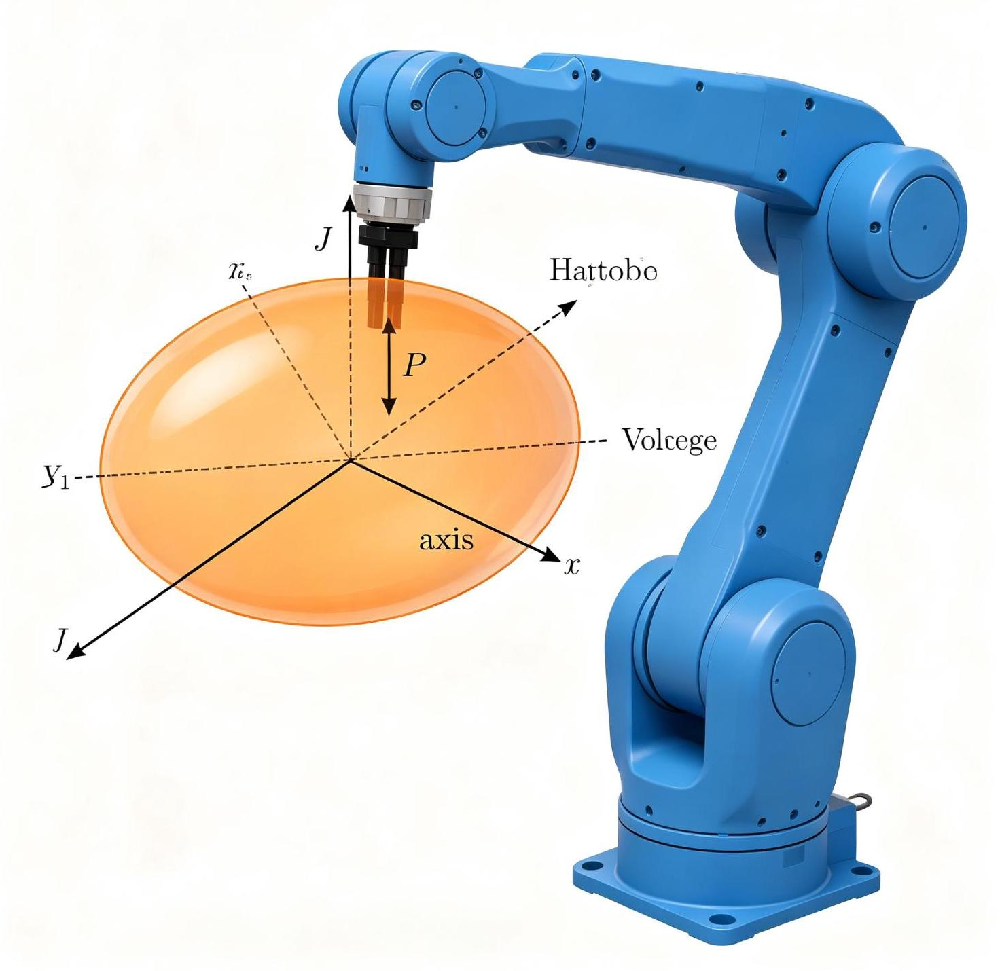
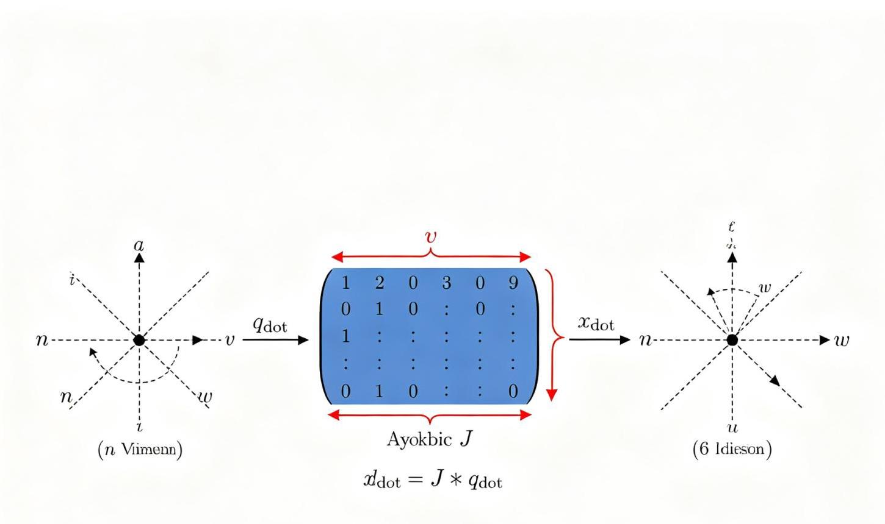
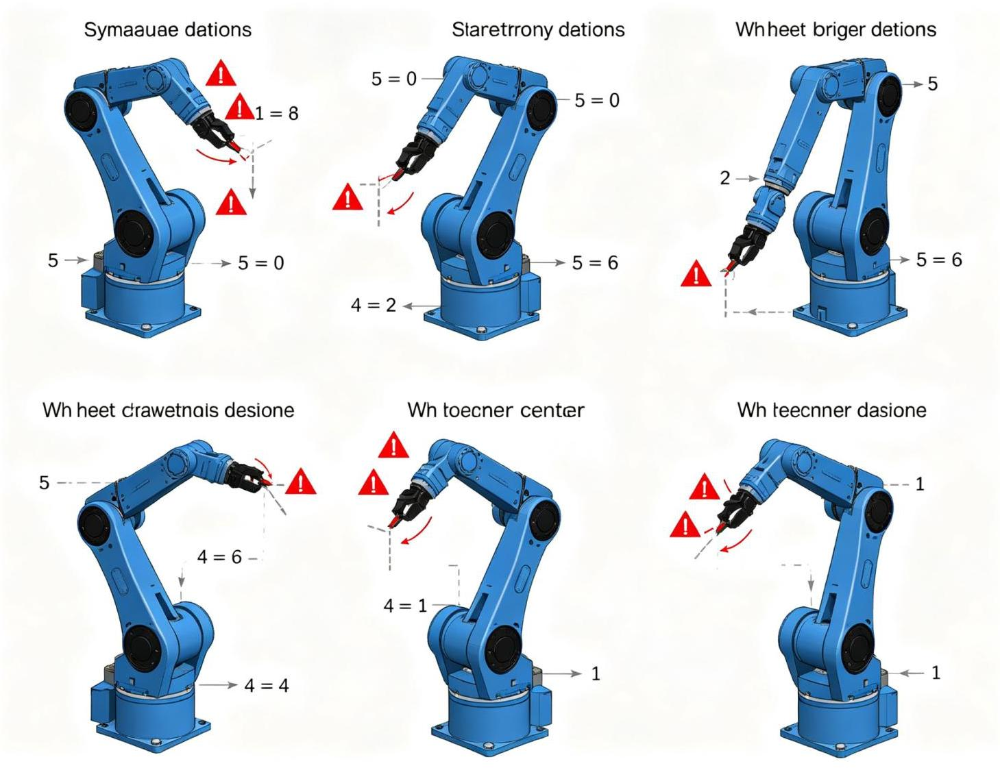

# 第5章 雅可比：速度和静力
<!-- 这是一张图片，ocr 内容为： -->


_图5-1 雅可比可操作性椭球_


## 5.1 引言
第3章和第4章研究了操作臂的静态定位问题，即给定关节角如何确定末端位姿（正运动学），以及给定期望位姿如何求解关节角（逆运动学）。本章将运动学的研究范围扩展到速度和静力方面。

雅可比矩阵（Jacobian Matrix）是机器人学中最重要的工具之一，它建立了关节空间速度与笛卡尔空间速度之间的线性映射关系，同时也建立了关节力矩与末端力之间的映射关系。

## 5.2 时变位置和姿态的符号表示
### 5.2.1 线速度
刚体上一点的线速度是其位置矢量对时间的导数：

```plain
v = dP/dt = Ṗ
```

线速度是一个3×1矢量，描述点在空间中运动的快慢和方向。

### 5.2.2 角速度
刚体的角速度描述了刚体的旋转速率和方向，用矢量ω表示。角速度矢量的方向沿旋转轴（右手定则），大小为旋转速率。

对于绕z轴以角速度θ̇旋转的刚体：ω = [0, 0, θ̇]^T

### 5.2.3 刚体上点的速度
刚体上任意一点P的速度由原点速度和旋转引起的速度组成：

```plain
v_P = v_O + ω × r
```

其中r是P相对于O的位置矢量，×表示叉乘。这个公式是推导雅可比矩阵的基础。

## 5.3 刚体的线速度和角速度
### 5.3.1 角速度的进一步研究
角速度矢量满足以下性质：

+ 角速度可以叠加：ω_total = ω1 + ω2（绕不同轴的旋转速度矢量相加）
+ 角速度矢量在不同坐标系下的表示通过旋转矩阵变换：^A ω = ^A R_B × ^B ω

### 5.3.2 旋转矩阵的导数
旋转矩阵R(t)对时间的导数可以表示为：

```plain
Ṙ = S(ω) × R
```

其中S(ω)是角速度矢量ω的反对称矩阵（skew-symmetric matrix）：

```plain
S(ω) = [  0   -ωz   ωy]
       [  ωz   0   -ωx]
       [-ωy   ωx   0 ]
```

反对称矩阵满足 S(ω) × v = ω × v，即将叉乘运算转化为矩阵乘法。

## 5.4 机器人连杆的运动
### 5.4.1 连杆间的速度传递
<!-- 这是一张图片，ocr 内容为： -->


_图5-2 雅可比矩阵速度传递_

在操作臂中，每个连杆的速度可以通过关节速度和相邻连杆的速度传递得到。

对于转动关节i，连杆i相对于连杆i-1的角速度为θ̇_i × z_{i-1}，因此：

```plain
ω_i = ω_{i-1} + θ̇_i × z_{i-1}  （转动关节）
ω_i = ω_{i-1}                     （移动关节）
```

连杆i原点的线速度：

```plain
v_i = v_{i-1} + ω_{i-1} × p_{i-1,i} + ḋ_i × z_{i-1}  （移动关节）
v_i = v_{i-1} + ω_{i-1} × p_{i-1,i}                     （转动关节）
```

其中p_{i-1,i}是连杆i原点相对于连杆i-1原点的位置矢量。

### 5.4.2 向外递推计算速度
从基座（连杆0，v_0=0, ω_0=0）开始，向外递推计算每个连杆的角速度和线速度，直到末端连杆n。这是牛顿-欧拉动力学算法中速度递推的基础（将在第6章详细讨论）。

## 5.5 雅可比矩阵的构建
### 5.5.1 定义
对于n自由度操作臂，关节速度向量 q̇ = [q̇_1, q̇_2, ..., q̇_n]<sup>T，末端速度向量 v = [v_x, v_y, v_z, ω_x, ω_y, ω_z]</sup>T（6×1，包含线速度和角速度），则：

```plain
v = J(q) × q̇
```

其中J(q)是6×n的雅可比矩阵。雅可比矩阵是关节位置q的函数，随操作臂构型变化而变化。

### 5.5.2 几何构建法
雅可比矩阵的第i列J_i由关节i的运动对末端速度的贡献决定。

对于转动关节i：

```plain
J_i = [z_{i-1} × (p_n - p_{i-1})]
      [z_{i-1}                  ]
```

上半部分（3×1）是关节i转动引起的末端线速度，下半部分（3×1）是关节i转动引起的末端角速度。

对于移动关节i：

```plain
J_i = [z_{i-1}]
      [0      ]
```

移动关节只引起末端线速度（沿关节轴方向），不引起角速度。

其中：

+ z_{i-1}是关节i轴线的单位方向向量（在基座坐标系中表示）
+ p_n是末端位置（在基座坐标系中表示）
+ p_{i-1}是关节i原点位置（在基座坐标系中表示）

### 5.5.3 二自由度平面臂的雅可比
对于二自由度平面机械臂，末端只有x、y方向的线速度和绕z轴的角速度（3×1），雅可比是3×2矩阵：

```plain
J = [-l1 sin(θ1) - l2 sin(θ1+θ2)   -l2 sin(θ1+θ2)]
    [ l1 cos(θ1) + l2 cos(θ1+θ2)    l2 cos(θ1+θ2)]
    [              1                            1     ]
```

前两行对应x、y线速度，第三行对应角速度。

### 5.5.4 Python代码示例
```python
import numpy as np

def jacobian_geometric(dh_params, q):
    """
    几何法构建雅可比矩阵
    dh_params: D-H参数列表（不含theta，theta由q提供）
    q: 关节变量
    返回: 6×n雅可比矩阵
    """
    n = len(q)
    T = np.eye(4)
    p = [np.array([0, 0, 0])]  # 各关节原点位置
    z = [np.array([0, 0, 1])]  # 各关节轴方向
    
    # 正运动学，记录各连杆的位置和z轴
    for i in range(n):
        a, alpha, d = dh_params[i]
        theta = q[i]
        Ti = np.array([
            [np.cos(theta), -np.sin(theta)*np.cos(alpha),  np.sin(theta)*np.sin(alpha), a*np.cos(theta)],
            [np.sin(theta),  np.cos(theta)*np.cos(alpha), -np.cos(theta)*np.sin(alpha), a*np.sin(theta)],
            [0,              np.sin(alpha),                 np.cos(alpha),                d],
            [0, 0, 0, 1]
        ])
        T = T @ Ti
        p.append(T[:3, 3].copy())
        z.append(T[:3, 2].copy())
    
    p_end = p[-1]  # 末端位置
    J = np.zeros((6, n))
    
    for i in range(n):
        zi = z[i]  # 关节i+1的轴（z_i）
        pi = p[i]  # 关节i+1的原点
        J[:3, i] = np.cross(zi, p_end - pi)  # 线速度部分
        J[3:, i] = zi  # 角速度部分
    
    return J

# 测试：二自由度平面臂
dh = [(1.0, 0, 0), (1.0, 0, 0)]  # a, alpha, d
q = [0.5, 0.3]
J = jacobian_geometric(dh, q)
print("雅可比矩阵:")
print(J)
```

## 5.6 奇异性分析
<!-- 这是一张图片，ocr 内容为： -->


_图5-3 机械臂奇异位形_

### 5.6.1 奇异位形
当雅可比矩阵的秩小于其最大可能秩时，操作臂处于奇异位形（Singularity）。在奇异位形处：

+ 操作臂失去一个或多个运动自由度
+ 某些方向的末端速度无法实现（即使关节速度无穷大）
+ 逆运动学的雅可比法失效（J不可逆或病态）
+ 关节速度可能趋于无穷大

### 5.6.2 常见奇异位形
1. **工作空间边界奇异**：操作臂完全伸展或折叠，末端到达工作空间边界
    - 二连杆臂：θ2 = 0（完全伸展）或 θ2 = π（完全折叠）
    - 此时雅可比行列式为0
2. **内部奇异**：在工作空间内部，两个关节轴线共线
    - 腕部奇异：腕部两个轴共线（如PUMA560的θ5=0时，关节4和6轴共线）
    - 肩关节奇异：关节1轴与关节2轴的特殊配置

### 5.6.3 奇异的检测
通过计算雅可比矩阵的行列式或条件数检测奇异：

+ det(J) ≈ 0 → 接近奇异（方阵时）
+ cond(J) 很大 → 接近奇异（条件数越大越接近奇异）
+ 奇异值分解（SVD）：最小奇异值接近0 → 接近奇异

### 5.6.4 奇异的处理
+ 路径规划时避开奇异位形
+ 使用阻尼最小二乘法（DLS）在接近奇异时限制关节速度
+ 利用冗余度回避奇异
+ 在奇异附近降低末端速度要求

## 5.7 作用在操作臂上的静力
### 5.7.1 力域中的雅可比
雅可比矩阵不仅描述速度映射，还描述力的映射。根据虚功原理（Principle of Virtual Work），关节空间和笛卡尔空间的虚功相等：

```plain
τ^T × δθ = F^T × δx
```

由于 δx = J × δθ，代入得：

```plain
τ^T × δθ = F^T × J × δθ
τ^T = F^T × J
τ = J^T(q) × F
```

这就是关节力矩与末端力之间的关系：**关节力矩 = 雅可比转置 × 末端力/力矩**。

其中：

+ τ = [τ_1, τ_2, ..., τ_n]^T：关节力矩向量（n×1）
+ F = [f_x, f_y, f_z, n_x, n_y, n_z]^T：末端力/力矩向量（6×1，前3个是力，后3个是力矩）
+ J^T(q)：雅可比矩阵的转置（n×6）

### 5.7.2 静力分析的应用
1. **重力补偿**：计算平衡重力所需的关节力矩。将各连杆重力等效到末端，通过τ = J^T F计算关节力矩。
2. **力/力矩传感器**：将关节力矩传感器读数转换为末端力。F = J^{-T} τ（雅可比可逆时）。
3. **阻抗控制**：通过控制关节力矩实现末端的期望力学特性（将在第8章详细讨论）。
4. **夹持力分析**：计算抓取物体时各关节所需的力矩。

### 5.7.3 二连杆臂的静力示例
对于二自由度平面臂，末端受力F = [f_x, f_y]^T，关节力矩：

```plain
[τ1] = J^T × [f_x]
[τ2]       [f_y]

其中J^T = [-l1 sin(θ1)-l2 sin(θ1+θ2)   l1 cos(θ1)+l2 cos(θ1+θ2)]
          [-l2 sin(θ1+θ2)               l2 cos(θ1+θ2)              ]
```

物理意义：关节1需要同时平衡两个连杆产生的力矩，关节2只需要平衡连杆2和末端力产生的力矩。

### 📺 推荐视频
> **ROS2机器人开发实战（上集）**  
聚焦ROS2理论知识体系，从设计理念和架构讲起，系统讲解核心通信机制、工程化开发工具和机器人建模可视化技术。  
🔗 [B站观看](https://www.bilibili.com/video/BV1bzSSBCETQ/)
>

### 💻 推荐GitHub项目
> **robotics-practice — 机器人学实践代码**  
包含运动学、雅可比、动力学等章节的代码实现和笔记，使用Pinocchio库进行高效计算，附详细推导过程。  
🔗 [GitHub仓库](https://github.com/alexjunholee/robotics-practice)
>

---
