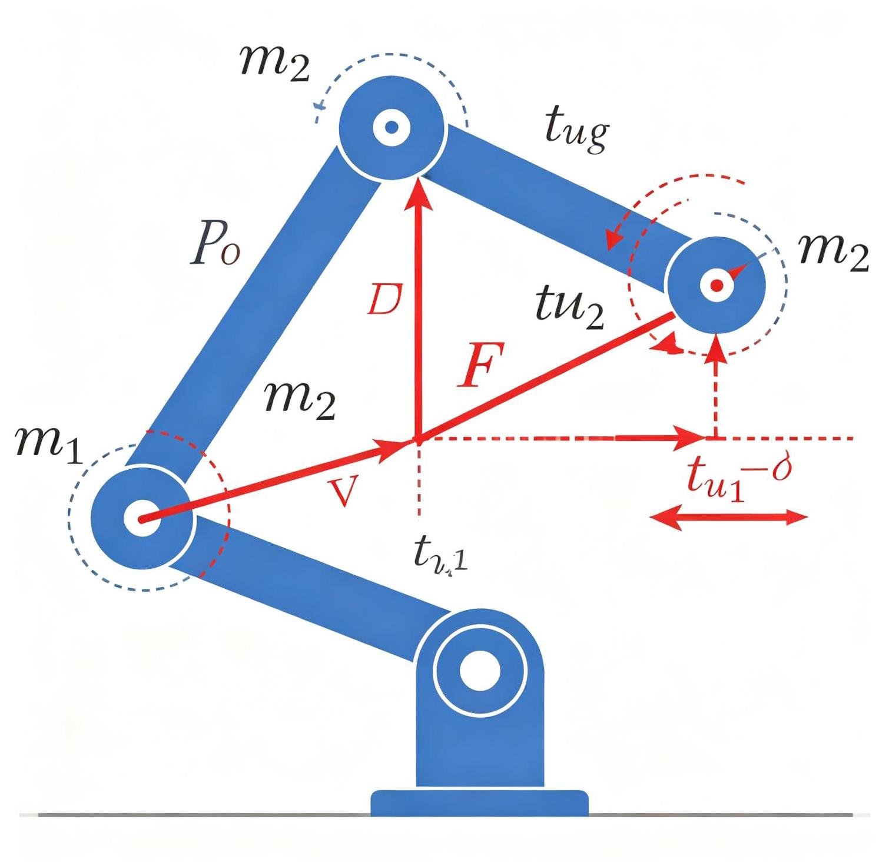
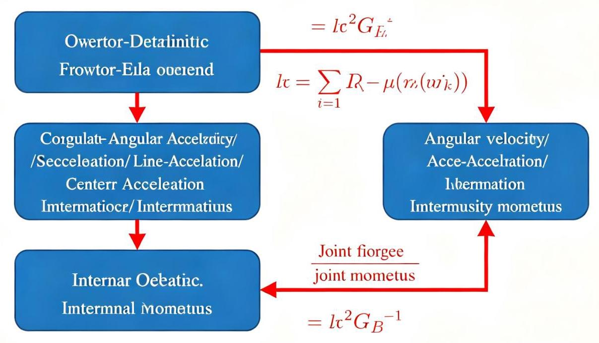
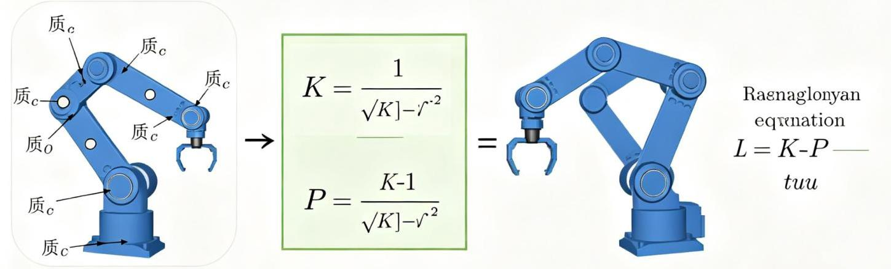

# 第6章 操作臂动力学
<!-- 这是一张图片，ocr 内容为： -->


_图6-1 机械臂动力学受力分析_


## 6.1 引言
前几章讨论了运动学问题，即操作臂的位置和速度与关节变量之间的关系，不考虑引起运动的力和力矩。本章开始研究引起操作臂运动的力和力矩，这就是操作臂动力学（Dynamics）问题。

动力学是机器人控制的基础：为了使操作臂沿期望轨迹运动，需要知道每个关节应该施加多大的力矩。动力学方程建立了关节力矩、关节位置、速度和加速度之间的关系。

<!-- 这是一张图片，ocr 内容为： -->

_图6-1：机器人运动学与动力学核心公式，包含正运动学x=f(θ)、雅可比ẋ=J(θ)θ̇、动力学τ=M(θ)θ̈+C(θ,θ̇)θ̇+G(θ)以及欧拉-拉格朗日方程_

## 6.2 刚体的加速度
### 6.2.1 线加速度
刚体上一点的线加速度是速度对时间的导数：

```plain
a = dv/dt = d²P/dt² = P̈
```

### 6.2.2 角加速度
角加速度是角速度对时间的导数：

```plain
α = dω/dt = ω̇
```

### 6.2.3 刚体上点的加速度
刚体上点P的加速度由三部分组成：

```plain
a_P = a_O + α × r + ω × (ω × r)
```

其中：

+ a_O：原点加速度
+ α × r：角加速度引起的切向加速度（沿切线方向）
+ ω × (ω × r)：向心加速度（指向旋转轴，大小为ω²r）

这个公式是牛顿-欧拉递推动力学中加速度递推的基础。

## 6.3 质量分布与惯性张量
### 6.3.1 质心
刚体的质心（Center of Mass, COM）是质量分布的平均位置：

```plain
r_c = (1/m) ∫ r dm
```

其中m是总质量，r是质量微元dm的位置矢量。

对于均匀密度的简单几何体，质心在几何中心。对于复杂形状，可以通过三维CAD软件计算。

### 6.3.2 惯性张量
惯性张量（Inertia Tensor）描述刚体绕不同轴旋转时的质量分布，是一个3×3对称矩阵：

```plain
I = [I_xx  -I_xy  -I_xz]
    [-I_xy  I_yy  -I_yz]
    [-I_xz -I_yz   I_zz]
```

其中：

+ I_xx = ∫(y²+z²)dm（绕x轴的转动惯量）
+ I_yy = ∫(x²+z²)dm（绕y轴的转动惯量）
+ I_zz = ∫(x²+y²)dm（绕z轴的转动惯量）
+ I_xy = ∫xy dm（惯性积）
+ I_yz = ∫yz dm
+ I_xz = ∫xz dm

惯性张量与参考点（通常是质心）和参考坐标系的方向有关。当坐标系沿刚体主轴方向时，惯性积为0，惯性张量成为对角矩阵。

### 6.3.3 平行轴定理
已知绕质心的惯性张量I_c，绕距离质心为d的平行轴的惯性张量：

```plain
I = I_c + m(d²I - d d^T)
```

其中d是从质心到新原点的矢量，I是3×3单位矩阵。这个定理用于将连杆的惯性张量从质心转换到关节坐标系。

### 6.3.4 常见几何体的惯性张量
对于质量为m的均匀几何体：

+ **长方体（边长a×b×c，绕质心）**：  
I_xx = m(b²+c²)/12, I_yy = m(a²+c²)/12, I_zz = m(a²+b²)/12
+ **圆柱体（半径r，高h，绕质心，轴沿z）**：  
I_xx = I_yy = m(3r²+h²)/12, I_zz = mr²/2
+ **球体（半径r，绕质心）**：  
I_xx = I_yy = I_zz = 2mr²/5

## 6.4 牛顿方程和欧拉方程
### 6.4.1 牛顿方程（平动）
刚体质心的平动遵循牛顿第二定律：

```plain
F = m a_c
```

其中F是合外力，m是总质量，a_c是质心加速度。这是刚体平动的基本方程。

### 6.4.2 欧拉方程（转动）
刚体绕质心的转动遵循欧拉方程：

```plain
N = I_c α + ω × (I_c ω)
```

其中：

+ N是合外力矩（绕质心）
+ I_c是绕质心的惯性张量
+ α是角加速度
+ ω是角速度
+ ω × (I_c ω)是陀螺力矩项（由于惯性积和角速度方向不重合引起）

当ω沿主轴方向时，I_c ω与ω同方向，陀螺力矩项为0，欧拉方程简化为N = I_c α。

## 6.5 牛顿-欧拉迭代动力学方程
<!-- 这是一张图片，ocr 内容为： -->


_图6-2 牛顿-欧拉动力学递推流程_

### 6.5.1 算法概述
牛顿-欧拉（Newton-Euler）递推算法是计算操作臂逆动力学的高效方法，由Luh、Walker和Paul于1980年提出。算法分为两个阶段：

1. **向外递推（Forward Recursion）**：从基座向末端递推，计算每个连杆的角速度、角加速度和质心加速度
2. **向内递推（Backward Recursion）**：从末端向基座递推，计算每个连杆受到的力和力矩，以及关节驱动力矩

### 6.5.2 向外递推（速度和加速度传播）
从基座（连杆0）开始，ω_0 = 0, α_0 = 0, v_0 = 0（基座固定）。

对于转动关节i：

```plain
角速度：ω_i = ω_{i-1} + θ̇_i z_{i-1}
角加速度：α_i = α_{i-1} + ω_{i-1} × θ̇_i z_{i-1} + θ̈_i z_{i-1}
质心加速度：a_ci = a_i + α_i × r_ci + ω_i × (ω_i × r_ci)
```

对于移动关节i：

```plain
角速度：ω_i = ω_{i-1}
角加速度：α_i = α_{i-1}
质心加速度：a_ci = a_{i-1} + ḋ_i z_{i-1} + 2ω_{i-1} × ḋ_i z_{i-1} + α_{i-1} × p_i + ω_{i-1} × (ω_{i-1} × p_i)
```

其中r_ci是连杆i质心相对于关节i原点的位置，p_i是关节i原点相对于关节i-1原点的位置。

### 6.5.3 向内递推（力和力矩传播）
从末端（连杆n）开始，假设末端外力为F_n（通常为0，除非有负载）。

对于连杆i（从n到1）：

```plain
连杆i质心的合力：F_i = m_i a_ci
连杆i质心的合力矩：N_i = I_ci α_i + ω_i × (I_ci ω_i)

关节i对连杆i的作用力：f_i = F_i + f_{i+1}
关节i对连杆i的作用力矩：n_i = N_i + n_{i+1} + r_ci × F_i + (p_{i+1} - r_ci) × f_{i+1}

关节驱动力矩（转动关节）：τ_i = n_i · z_{i-1}
关节驱动力（移动关节）：τ_i = f_i · z_{i-1}
```

其中f_{i+1}和n_{i+1}是连杆i+1对连杆i的反作用力和力矩（牛顿第三定律）。

### 6.5.4 算法复杂度
牛顿-欧拉递推算法的计算复杂度为O(n)（与自由度n成正比），是计算逆动力学最高效的方法之一。对于6自由度操作臂，只需约几百次浮点运算即可完成一次逆动力学计算，适合实时控制。

相比之下，拉格朗日方法的计算复杂度为O(n⁴)（直接展开时），效率较低。

## 6.6 拉格朗日动力学方程
<!-- 这是一张图片，ocr 内容为： -->


_图6-3 拉格朗日动力学方法_

### 6.6.1 拉格朗日函数
拉格朗日（Lagrange）方法从能量角度推导动力学方程，不需要分析连杆间的内力，形式更紧凑，适合理论分析。

拉格朗日函数定义为总动能减去总势能：

```plain
L = K - P
```

其中K是操作臂的总动能，P是总势能。

### 6.6.2 动能计算
操作臂的总动能是各连杆动能之和。每个连杆的动能包括质心平动动能和绕质心转动动能：

```plain
K_i = (1/2) m_i v_ci^T v_ci + (1/2) ω_i^T I_ci ω_i
```

总动能 K = Σ K_i。可以证明，总动能可以写成二次型形式：

```plain
K = (1/2) q̇^T M(q) q̇
```

其中M(q)是n×n的质量矩阵（惯性矩阵），对称正定。

### 6.6.3 势能计算
总势能是各连杆重力势能之和（通常以基座为零势能参考点）：

```plain
P = Σ m_i g^T r_ci(q)
```

其中g是重力加速度矢量，r_ci是连杆i质心位置。势能只与关节位置q有关，与速度无关。

### 6.6.4 拉格朗日方程
拉格朗日方程（第二类拉格朗日方程）为：

```plain
d/dt (∂L/∂q̇_i) - ∂L/∂q_i = τ_i    (i = 1, 2, ..., n)
```

将L = K - P代入，展开后得到操作臂动力学方程的标准形式：

```plain
M(q) q̈ + C(q, q̇) q̇ + G(q) = τ
```

### 6.6.5 操作臂动力学标准形式
```plain
M(q) q̈ + C(q, q̇) q̇ + G(q) = τ
```

其中：

+ **M(q)**：n×n质量矩阵（惯性矩阵），对称正定。M(q) q̈是惯性项，描述关节加速度所需的力矩。
+ **C(q, q̇)**：n×n科氏力和离心力矩阵。C(q, q̇) q̇是速度相关项，包括：
    - 离心力（Centrifugal Force）：关节i高速旋转时产生的径向力，与q̇_i²成正比
    - 科氏力（Coriolis Force）：两个关节同时运动时产生的耦合，与q̇_i q̇_j成正比
+ **G(q)**：n×1重力向量。G(q)是平衡重力所需的关节力矩，只与位置有关。
+ **τ**：n×1关节驱动力矩向量。

### 6.6.6 各项物理意义举例（二连杆平面臂）
对于二自由度平面机械臂，质量矩阵：

```plain
M(q) = [m1 lc1² + m2(l1²+lc2²+2 l1 lc2 cosθ2) + I1+I2   m2(lc2²+l1 lc2 cosθ2)+I2]
       [m2(lc2²+l1 lc2 cosθ2)+I2                          m2 lc2²+I2                 ]
```

科氏力和离心力项：

```plain
C(q,q̇) q̇ = [-m2 l1 lc2 sinθ2 (2 θ̇1 θ̇2 + θ̇2²)]
            [ m2 l1 lc2 sinθ2 θ̇1²                  ]
```

重力项：

```plain
G(q) = [(m1 lc1 + m2 l1) g cosθ1 + m2 lc2 g cos(θ1+θ2)]
       [m2 lc2 g cos(θ1+θ2)                                ]
```

可以看到，质量矩阵包含了连杆间的惯性耦合（M12=M21≠0），科氏力项包含了速度耦合，重力项随关节角度变化。

<!-- 这是一张图片，ocr 内容为： -->

_图6-2：机器人动力学建模方法分类，包括牛顿-欧拉法、拉格朗日法、凯恩方法、高斯最小约束原理等_

## 6.7 动力学的实际考虑
### 6.7.1 摩擦
实际机器人的关节存在摩擦力，摩擦力矩与关节速度和位置有关：

```plain
τ_friction = τ_static + τ_coulomb sign(q̇) + τ_viscous q̇ + ...
```

+ **静摩擦（Static Friction）**：静止时阻碍运动启动的摩擦力
+ **库仑摩擦（Coulomb Friction）**：运动时的恒定摩擦力，与速度方向相反
+ **粘性摩擦（Viscous Friction）**：与速度成正比的摩擦力

摩擦会导致跟踪误差、极限环振荡等问题，需要通过摩擦补偿或鲁棒控制来处理。

### 6.7.2 动力学参数辨识
实际机器人的动力学参数（质量、惯性张量、质心位置、摩擦系数等）往往不精确，需要通过实验辨识：

+ 采集关节轨迹和力矩数据
+ 利用动力学方程的线性化形式（τ = Y(q,q̇,q̈) π，其中π是参数向量）
+ 通过最小二乘法辨识参数

### 6.7.3 柔性效应
高速运动时，连杆和关节的柔性不可忽略：

+ **连杆柔性**：长连杆会发生弹性变形
+ **关节柔性**：减速器（如谐波减速器）存在弹性变形

柔性会导致振动，需要更复杂的柔性机器人动力学模型和控制方法。

### 📺 推荐视频
> **【2026最新】ROS2机器人开发从入门到实践**  
涵盖环境安装、工程结构、通信架构、Navigation、激光雷达、roscpp等全程实战内容，包含动力学控制实战。  
🔗 [B站观看](https://www.bilibili.com/video/BV1tjME6XEeL/)
>

### 💻 推荐GitHub项目
> **ros2_control — ROS2机器人控制框架**  
ROS2官方的机器人控制框架，提供硬件抽象、控制器管理、实时控制等功能，支持位置、速度、力矩、阻抗等多种控制器，是动力学控制的工程实现基础。  
🔗 [GitHub仓库](https://github.com/ros-controls/ros2_control)
>

---
