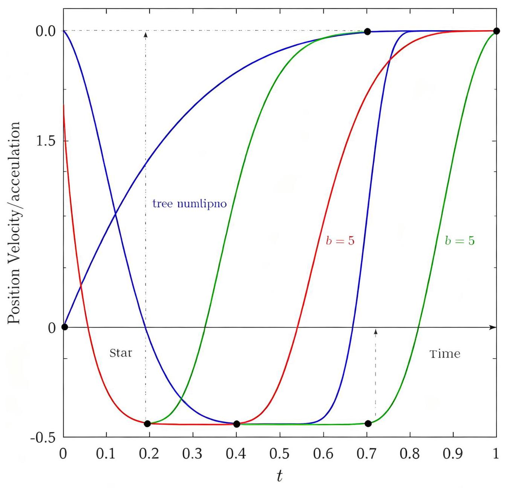
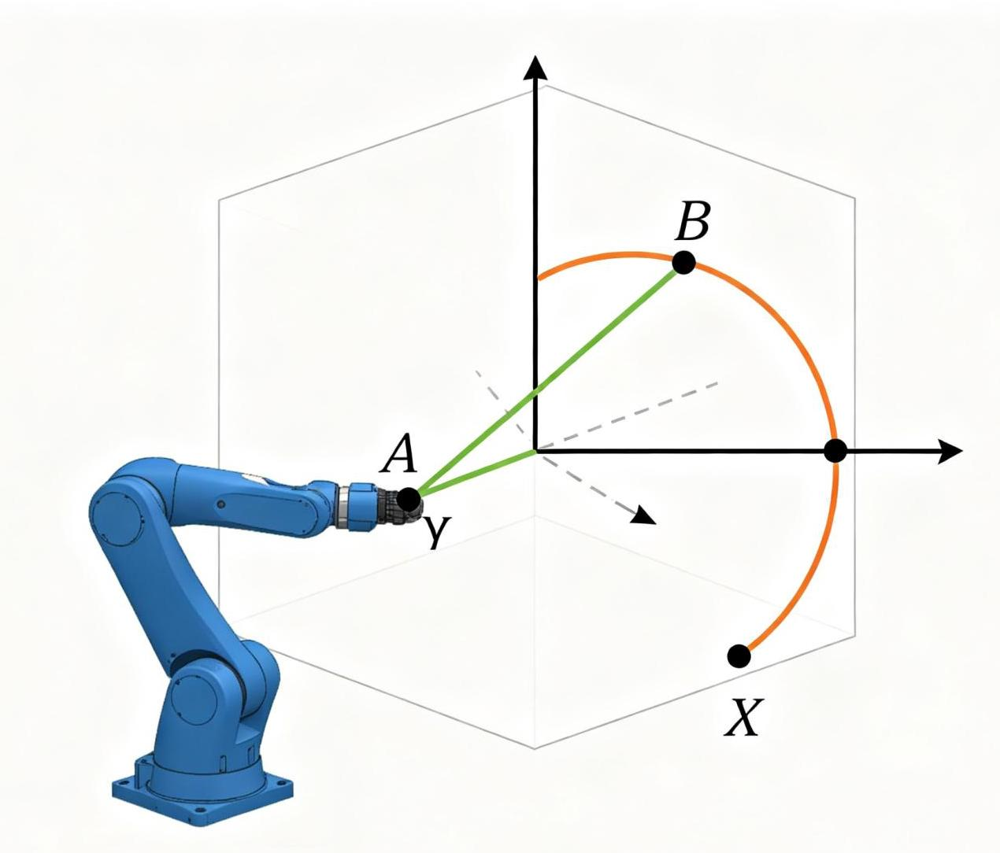
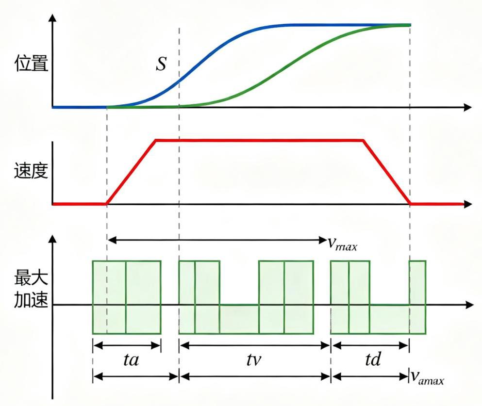
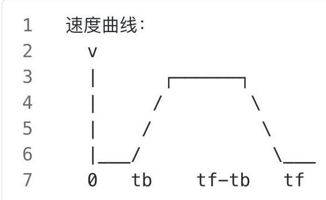

# 第7章 轨迹生成

图7-1 轨迹规划曲线对比(三次/五次多项式)

## 7.1 引言

前面几章讨论了操作臂的运动学和动力学，本章讨论如何生成操作臂的运动轨迹。轨迹生成

(Trajectory Generation)是根据任务要求，生成操作臂关节空间或笛卡尔空间的时间序列，使机器人平滑、高效地从起点运动到终点。

轨迹生成是连接高层任务规划与底层控制的桥梁。高层规划给出目标位姿和路径点，轨迹生成器将其转化为随时间变化的关节位置、速度和加速度指令，然后由控制器跟踪执行。

## 7.2 轨迹规划的基本概念

### 7.2.1 路径与轨迹

- 路径 (Path) : 空间中的几何曲线，描述机器人经过的空间位置，不涉及时间。

- 轨迹 (Trajectory) : 带时间参数的路径，包含位置、速度、加速度随时间的变化。

- 路径点(Waypoint):轨迹经过的中间点，由高层规划指定。

- 插补(Interpolation):在路径点之间生成平滑过渡的轨迹。

### 7.2.2 轨迹规划的约束

- 关节限位:关节角度、速度、加速度的物理限制(由电机和机械结构决定)

- 工作空间约束:末端不能超出可达空间

- 避障约束: 不能与障碍物碰撞

- 时间最优: 在满足约束下最短时间完成运动

- 平滑性:避免速度/加速度突变，减少机械冲击和振动

- 加加速度(Jerk)限制:加速度的变化率也有限制，影响乘坐舒适性和机械寿命

### 7.2.3 关节空间 vs 笛卡尔空间

图7-2笛卡尔空间轨迹规划

轨迹生成可以在两个空间中进行:

<table><tr><td>特性</td><td>关节空间</td><td>笛卡尔空间</td></tr><tr><td>计算量</td><td>小(直接对关节变量插补)</td><td>大(每点需逆运动学求解)</td></tr><tr><td>路径形状</td><td>不可控(关节直线≠末端直线)</td><td>可控(精确控制末端路径)</td></tr><tr><td>奇异性</td><td>不易遇到</td><td>可能遇到奇异位形</td></tr><tr><td>避障</td><td>困难(末端路径不可控)</td><td>较容易</td></tr><tr><td>计算效率</td><td>高, 适合实时</td><td>较低</td></tr></table>

实际应用中通常结合使用:全局路径在笛卡尔空间规划，局部轨迹在关节空间生成。

## 7.3 关节空间轨迹生成

### 7.3.1 三次多项式插值

在起点和终点之间用三次多项式连接, 满足位置和速度边界条件:

---

$\theta \left( t\right)  = {a0} + {a1t} + {a2}{t}^{2} + {a3}{t}^{3}$

---

边界条件(t=0时在起点，t=tf时在终点):

- t=0 : $\theta \left( 0\right)  = {\theta 0}$ , $\dot{\theta }\left( 0\right)  = {v0}$

- t=tf: $\theta \left( \text{ tf }\right)  = {\theta f},\dot{\theta }\left( \text{ tf }\right)  = {vf}$

求解系数:

---

$$
\begin{aligned}
a_0&=\theta_0\\a_1&=v_0\\ a_2&=\frac{3(\theta_f-\theta_0)}{t_f^2}-\frac{2v_0+v_f}{t_f}\\ a_3&=-\frac{2(\theta_f-\theta_0)}{t_f^3}+\frac{v_0+v_f}{t_f^2}
\end{aligned}
$$

---

三次多项式的特点:

- 位置和速度连续

- 加速度不连续 (在起点和终点加速度突变)

- 计算简单, 适合低速、对平滑性要求不高的场景

### 7.3.2 五次多项式插值

三次多项式只约束位置和速度，加速度可能不连续，引起机械冲击。五次多项式额外约束加速度:

---

$1\;\theta \left( t\right)  = {a0} + {a1t} + {a2}{t}^{2} + {a3}{t}^{3} + {a4}{t}^{4} + {a5}{t}^{5}$

---

边界条件增加:

- t=0: θ(0)=a0_acc

- t=tf: θ(tf)=af_acc

五次多项式有6个系数，由6个边界条件(起点/终点的位置、速度、加速度)唯一确定。

五次多项式的特点:

- 位置、速度、加速度均连续

- 运动更平滑, 减少机械冲击

- 是工业机器人常用的轨迹生成方法

- 计算稍复杂

### 7.3.3 抛物线过渡的线性插值(梯形速度)

**图7-3梯形速度轨迹规划**

在起点和终点附近用抛物线加速/减速, 中间匀速运动, 速度曲线呈梯形:

- 0到tb: 抛物线加速(加速度恒定)

- tb到tf-tb: 匀速运动

- tf-tb到tf: 抛物线减速

特点:

- 加速度恒定(抛物线段)，计算简单

- 工业应用广泛(大多数工业控制器支持梯形速度)

- 加速度在过渡点有跳变(加加速度无穷大)，高速时可能引起振动

### 7.3.4 S曲线速度规划(S-Curve)

为了限制加加速度(Jerk)，采用S曲线速度规划，加速度平滑变化:

---

速度曲线呈S形，分为7段:

															1. 加加速度段 (Jerk恒定，加速度线性增加)

															2. 匀加速段(加速度恒定)

															3. 减加速度段 (Jerk恒定,加速度线性减小到0)

																	4. 匀速段

																5. 加减速度段

																6. 匀减速段

												7. 减减速度段

---

S曲线的特点:

- 加加速度有限，运动最平滑

- 减少机械振动和冲击

- 计算最复杂

- 高端机器人和数控机床常用

### 7.3.5 Python代码示例

---

		import numpy as np

def cubic_polynomial(theta0, thetaf, v0, vf, tf, t):

						"""三次多项式轨迹生成"""

						a0 = theta0

						a1 = v0

						a2 = 3*(thetaf-theta0)/tf**2 - (2*v0+vf)/tf

						a3 = -2*(thetaf-theta0)/tf**3 + (v0+vf)/tf**2

						theta = a0 + a1*t + a2*t**2 + a3*t**3

						theta_dot = a1 + 2*a2*t + 3*a3*t**2

						theta_ddot = 2*a2 + 6*a3*t

						return theta, theta_dot, theta_ddot

- def quintic_polynomial(theta0, thetaf, v0, vf, a0_acc, af_acc, tf, t):

					"""五次多项式轨迹生成"""

					T = tf

					#解线性方程组求系数

					A = np.array([

										[0, 0, 0, 0, 0, 1],

										[T**5, T**4, T**3, T**2, T, 1],

										[0, 0, 0, 0, 1, 0],

										[5*T**4, 4*T**3, 3*T**2, 2*T, 1, 0],

										[0, 0, 0, 2, 0, 0],

										[20*T**3, 12*T**2, 6*T, 2, 0, 0]

					])

						b = np.array([theta0, thetaf, v0, vf, a0_acc, af_acc])

						coeffs = np.linalg.solve(A, b)

						a5, a4, a3, a2, a1, a0 = coeffs

						theta = a0 + a1*t + a2*t**2 + a3*t**3 + a4*t**4 + a5*t**5

						theta_dot = a1 + 2*a2*t + 3*a3*t**2 + 4*a4*t**3 + 5*a5*t**4

						theta_ddot = 2*a2 + 6*a3*t + 12*a4*t**2 + 20*a5*t**3

						return theta, theta_dot, theta_ddot

	#生成轨迹

	theta0, thetaf = 0.0, np.pi/2 # 0度到90度

	v0, vf = 0.0, 0.0 																																		#起止速度为0

	a0_acc, af_acc = 0.0, 0.0 																																		#起止加速度为0

	tf = 2.0 																																			#总时间2秒

	t_values = np.linspace(0, tf, 100)

	trajectory = [quintic_polynomial(theta0, thetaf, v0, vf, a0_acc, af_acc, t

	f, t) for t in t_values]

	print("五次多项式轨迹 (前5个点) :")

	for i in range(5):

						theta, v, a = trajectory[i]

	print(f"t={t_values[i]:.2f}s: θ={theta:.4f}rad, v={v:.4f}rad/s, a={a:.

4f\}rad/s2")

---

## 7.4 笛卡尔空间轨迹生成

### 7.4.1 直线轨迹

末端在笛卡尔空间沿直线运动，需要在每个时间点进行逆运动学求解:

---

$X\left( t\right)  = {X0} + s\left( t\right) \left( {{Xf} - {X0}}\right)$

---

其中s(t)是从0到1的平滑函数(如三次/五次多项式、梯形速度等)，X0和Xf是起点和终点的位姿(包含位置和姿态)。

位置部分线性插补，姿态部分可以用球面线性插补(Slerp，四元数插值)。

### 7.4.2 圆弧轨迹

末端沿圆弧运动，需要指定圆心、半径、起始角和终止角。圆弧轨迹在焊接、切割等应用中常用。

### 7.4.3 路径点的平滑过渡(Blending)

当轨迹经过多个路径点时，如果在每个路径点都完全停止，会降低效率。实际应用中采用Blending(融合/圆弧过渡):在路径点附近用圆弧平滑过渡，不完全停在路径点，同时保证精度。

MoveIt等运动规划框架支持路径点的Blending参数配置。

## 7.5 轨迹的实时生成与在线修改

### 7.5.1 实时轨迹生成

在实际系统中，轨迹通常以固定控制周期(如1ms)实时生成:

- 预规划整条轨迹，存储为查找表 (Look-up Table)

- 或在线递推计算每个周期的目标位置 (如梯形速度递推)

实时生成需要保证计算量在控制周期内完成。

### 7.5.2 在线修改

高级轨迹规划支持运动过程中修改目标:

- Look-ahead规划:预读后续路径点，提前加减速，保证经过路径点时速度合理

- 动态修改目标:运动中改变终点位置，保证平滑过渡(需要重新规划剩余轨迹)

- 传感器触发的修改:遇到动态障碍物时实时重新规划

### 7.5.3 时间最优轨迹规划

在满足关节速度、加速度约束下, 求最短时间的轨迹。这是一个优化问题:

- 目标函数:最小化运动时间tf

- 约束: $\left| {q_i}\right|  \leq  v_\max ,\left| {q_i}\right|  \leq  a_\max$ ,关节限位,避障

- 求解方法:数值优化、动态规划、凸优化等

PTP(Point-to-Point)运动中，时间最优轨迹通常是"开关控制"(Bang-Bang Control):加速度取最大值加速，然后取最大值减速。

**推荐视频**

ROS2 Movelt 2机械臂控制:路径规划与轨迹生成

对比OMPL、CHOMP等规划算法，演示笛卡尔路径生成、避障规划、轨迹后处理(时间参数化、速度/ 加速度限制)。

[B站观看](https://www.bilibili.com/video/BV1FPjk6bEjp/)

**推荐GitHub项目**

Movelt 2 — ROS2机械臂运动规划框架

ROS2官方的运动规划框架，集成运动学、碰撞检测、运动规划、轨迹生成(包含时间最优轨迹生成、 速度/加速度限制)、可视化等功能。

[GitHub仓库](https://github.com/moveit/moveit2)
