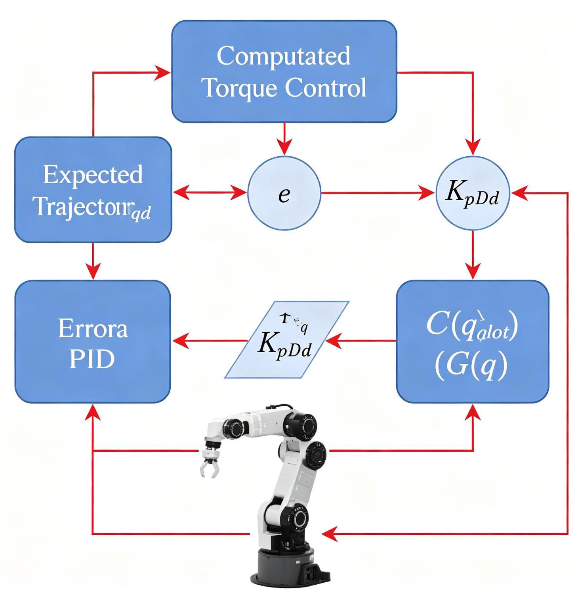
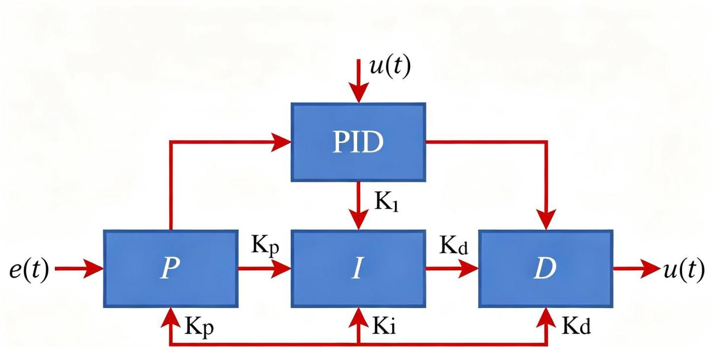
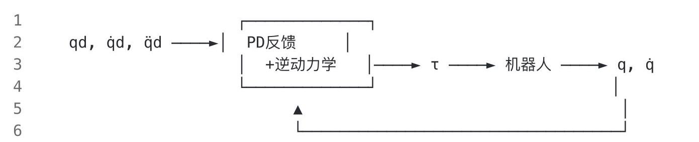
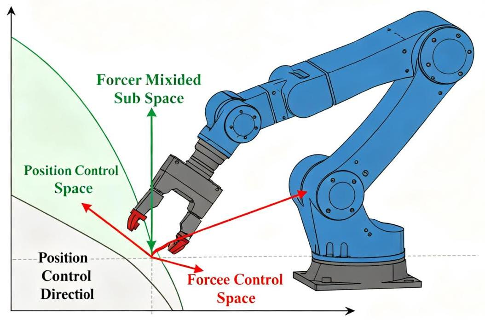

# 第8章 操作臂的控制

图8-1 计算力矩控制框图

## 8.1 引言

前面几章讨论了操作臂的运动学、动力学和轨迹生成，本章讨论如何控制操作臂使其沿期望轨迹运动。 控制是机器人学的核心问题之一，目标是设计控制算法，使操作臂在存在不确定性、扰动和建模误差的情况下，精确、稳定地跟踪期望轨迹。

Craig《机器人学导论》第9-11章分别讨论了线性控制、非线性控制和力控制，本书将这些内容整合为本章。

## 8.2 操作臂的线性控制

### 8.2.1 独立关节PID控制

$$
\rightarrow  {K}_{r}^{t - 1} + \frac{1}{2}{Z}_{t}^{t - 1}\left( {{Z}_{t}^{t - 1}{\left( N\right) }^{2} = \mathop{\sum }\limits_{{t = 1}}^{K} - \bar{K}}\right)  = \frac{T}{4}{Z}_{ip}^{{nl} - 1}{\left( \bar{M}\right) }^{2} = \mathop{\sum }\limits_{{i = 1}}^{K}\bar{M}
$$

$$
\rightarrow  {Z}_{r}^{t - 1} = \frac{T}{2}\left( {K}_{i}\right)  +  - \frac{v}{2}\omega {r}^{h} = \mathop{\sum }\limits_{{t = 1}}^{K} - {K}_{rp}\left( {K}_{i}^{3}\right)  = \frac{1}{2}{H}_{i}^{\delta } + {l}_{t}^{n\delta } + ,
$$

**图8-2 PID控制器结构**

最简单的控制方式是每个关节独立使用PID控制器, 不考虑关节间的动力学耦合:

---

$$
\tau_i=K_{p,i}(\theta_{d,i}-\theta_i)+K_{d,i}(\dot\theta_{d,i}-\dot\theta_i)+K_{i,i}\int(\theta_{d,i}-\theta_i)\,\mathrm dt
$$

---

其中:

- Kp: 比例增益，决定响应速度和稳态误差

- Kd: 微分增益，提供阻尼，抑制超调和振荡

- Ki: 积分增益，消除稳态误差(补偿重力、摩擦等恒定扰动)

### 8.2.2 PID参数整定

- Ziegler-Nichols法:经验整定方法，先增大Kp至系统等幅振荡，再按公式设置Kp、Ki、Kd

- 试凑法:先调P(增大到响应快但不超调)，再调D(增加阻尼)，最后调I(消除稳态误差)

- 模型辨识法:辨识每个关节的二阶模型(等效为质量-弹簧-阻尼系统)，基于模型设计PID参数

### 8.2.3 重力补偿

独立关节PID控制中，重力是一个恒定扰动，积分项可以消除重力引起的稳态误差，但响应较慢。可以加入前馈重力补偿:

---

τ_i = PID_i + G_i(q)

---

其中G_i(q)是第i关节的重力矩(由动力学模型计算)。重力补偿可以显著减小PID的负担，提高响应速度。

### 8.2.4 优缺点

优点:

- 结构简单, 易于实现和调试

- 不依赖精确的动力学模型

- 鲁棒性较好(对模型误差不敏感)

- 工业机器人广泛使用

缺点:

- 忽略关节间的动力学耦合(惯性耦合、科氏力耦合)，高速运动时性能下降

- 难以处理时变的重力和摩擦力

- 无法保证全局稳定性(理论分析困难)

- 高速、高精度任务中性能不足

## 8.3 操作臂的非线性控制

### 8.3.1 计算力矩控制 (Computed Torque Control)

计算力矩控制利用动力学模型进行反馈线性化(Feedback Linearization)，将非线性、耦合的机器人系统转化为线性、解耦的系统。

控制律:

---

$1\;\tau  = M\left( q\right) \left\lbrack  {\ddot{q}d + {Kd}\left( {\dot{q}d - \dot{q}}\right)  + {Kp}\left( {{qd} - q}\right) }\right\rbrack   + C\left( {q,\dot{q}}\right) \dot{q} + G\left( q\right)$

---

代入动力学方程 $M\left( q\right) \ddot{q} + C\left( {q,\dot{q}}\right) \dot{q} + G\left( q\right)  = \tau$ ，两边消去 $C$ 和 $G$ 项，得到:

---

$$
\begin{aligned}
M(q)\ddot q&=M(q)\left[\ddot q_d+K_d\dot e+K_p e\right]\\ \ddot q&=\ddot q_d+K_d\dot e+K_p e\\ \ddot e+K_d\dot e+K_p e&=0
\end{aligned}
$$

---

其中e = qd - q是跟踪误差。这是一个线性二阶系统(解耦的，每个关节独立)，可以通过选择Kp和Kd 配置极点(如临界阻尼)。

### 8.3.2 计算力矩控制的结构

计算力矩控制 $=$ 逆动力学前馈 + PD反馈。逆动力学部分补偿非线性和耦合，PD部分保证稳定性和鲁棒性。

### 8.3.3 鲁棒性问题

计算力矩控制依赖精确的动力学模型M(q)、C(q, q)、G(q)。当模型存在误差时(实际机器人的质量、惯性、摩擦等参数不精确):

- 实际系统不再是线性的

- 可能出现跟踪误差

- 极端情况下可能不稳定

改进方法:

1. 自适应控制(Adaptive Control):在线估计动力学参数，实时更新模型。假设参数线性化( $\tau  =$ Y(q, q, q) $\pi$ )，设计参数自适应律。

2. 鲁棒控制(Robust Control):设计对模型误差不敏感的控制器，保证在一定误差范围内稳定。

3. 滑模控制(Sliding Mode Control):通过切换控制律，使系统状态沿滑动面运动，对模型误差和扰动具有强鲁棒性。缺点是存在抖振(Chattering)。

4. 迭代学习控制(ILC):对于重复运动任务，利用前次运行的误差修正当前控制输入，逐次提高精度。

### 8.3.4 实际应用中的考虑

- 计算力矩控制需要实时计算逆动力学(牛顿-欧拉递推，O(n)复杂度，现代处理器可在1ms内完成)

- 通常采用"计算力矩+PID"的混合结构:用简化的逆动力学(如只补偿重力和科氏力)，PID处理剩余误差

- 工业机器人控制器大多采用这种结构

## 8.4 力控制与阻抗控制

Figun S: Force Exectnecs padiclea Matrix $S$ Eryth ehectcces excanutiore (Direnplec) Whesanple saciadters and sionaa hiive poroattion + Chyicrectloon1 position contro).

图8-3 力位混合控制

### 8.4.1 为什么需要力控制

在装配、打磨、抛光、抓取、擦拭等任务中, 仅控制位置不够:

- 位置误差可能导致过大的接触力 (损坏机器人或工件)

- 需要控制机器人与环境的交互力(如保持恒定的打磨压力)

- 环境位置不确定时，需要通过力反馈来适应

### 8.4.2 阻抗控制(Impedance Control)

阻抗控制由Hogan于1985年提出，不直接控制力，而是控制机器人末端的力学阻抗(质量-弹簧-阻尼系统) :

---

$M_d\ddot{x} + B_d\dot{x} + {K_d}x = {F_{ext}}$

---

其中:

- M_d: 期望惯性(虚拟质量)

- B_d: 期望阻尼(虚拟阻尼)

- K_d: 期望刚度(虚拟弹簧刚度)

- x = x - x_d: 末端位置偏差(相对于期望位置)

- F_ext:外部接触力

通过调节这三个参数, 机器人表现出不同的力学特性:

- 高刚度(K_d大):精确位置控制，类似刚性机器人

- 低刚度 (K_d小) : 柔顺交互, 适应环境, 类似弹簧

- 大阻尼 (B_d大) : 运动平稳，抑制振荡

- 小惯性 (M_d小) : 响应快，易于被外力推动

阻抗控制的优点:同时适用于自由空间运动和约束空间接触，不需要在位置控制和力控制之间切换。

### 8.4.3 导纳控制(Admittance Control)

导纳控制是阻抗控制的对偶形式:

- 阻抗控制:输入是力，输出是位置(力一位置)

- 导纳控制:输入是位置，输出是力(位置→力)

导纳控制通常用于位置控制的机器人(如工业机器人)，通过力传感器测量接触力，修正期望位置。

### 8.4.4 混合力/位置控制(Hybrid Force/Position Control)

由Raibert和Craig于1981年提出，在某些方向上控制力，某些方向上控制位置:

---

例:在桌面上擦桌子

	- 垂直桌面方向(Z):力控制(保持恒定接触力)

- 桌面内方向 (X, Y) : 位置控制 (沿期望轨迹运动)

---

通过选择矩阵S(对角矩阵，对角元素为0或1)在力控制和位置控制之间切换:

- S=1的方向:位置控制

- S=0的方向:力控制

混合控制需要识别自然约束和人工约束:

- 自然约束: 由环境几何决定的约束 (如接触表面限制了法向运动)

- 人工约束:人为指定的控制目标(如法向力、切向位置)

### 8.4.5 力控制的应用

- 装配任务:孔轴装配(Remote Center of Compliance, RCC)

- 打磨/抛光:保持恒定接触力

- 抓取操作:控制夹持力(不损坏物体，不滑落)

- 人机协作:柔顺控制，保证人员安全

- 假肢/康复机器人:适应人体运动

## 8.5 控制算法的实际限制

### 8.5.1 采样时间限制

- 控制周期不能无限小，受计算能力、传感器采样率和通信延迟限制

- 典型工业机器人控制周期:1ms ~ 4ms

- 采样时间过大会导致相位滞后，影响稳定性和性能

- 离散化效应:连续时间控制器离散化后性能会下降，需要考虑零阶保持(ZOH)效应

### 8.5.2 执行器限制

- 电机最大力矩/速度限制(饱和):控制指令超过最大值时被截断，可能导致积分饱和(Windup)

- 力矩变化率限制(不能突变)

- 齿轮间隙(Backlash)、摩擦等非线性

- 电机发热和热保护

### 8.5.3 传感器噪声

- 编码器分辨率限制(位置量化误差)

- 速度/加速度估计噪声(差分放大噪声)

- 力矩传感器漂移和噪声

- 传感器延迟(滤波引入相位滞后)

### 8.5.4 模型不确定性

- 负载质量变化 (抓取不同物体)

- 摩擦参数变化 (温度、磨损)

- 温度引起的参数漂移

- 未建模动态 (连杆柔性、共振)

### 8.5.5 实际控制器的结构

实际工业机器人控制器通常采用分层结构:

---

	上层: 轨迹规划(10ms周期)

2 中层: 模型-based控制 (计算力矩/阻抗控制, 1ms周期)

	底层:电机电流环/速度环(PID，100μs～1ms周期)

---

每层有不同的采样率和控制目标，保证系统的稳定性和实时性。

**推荐视频**

ROS2机器人开发实战:控制理论与ros2_control

讲解ROS2控制框架的架构、控制器配置、硬件接口编写，以及位置/速度/力矩控制、阻抗控制的实际应用和参数调优。

B B站观看

**推荐GitHub项目**

ros2_control - ROS2官方控制框架

提供硬件抽象层、控制器管理器、多种控制器实现(joint_state_controller、position_controller、

velocity_controller、effort_controller、diff_drive_controller、joint_trajectory_controller等)，支持实时控制和力/阻抗控制。

O GitHub仓库
