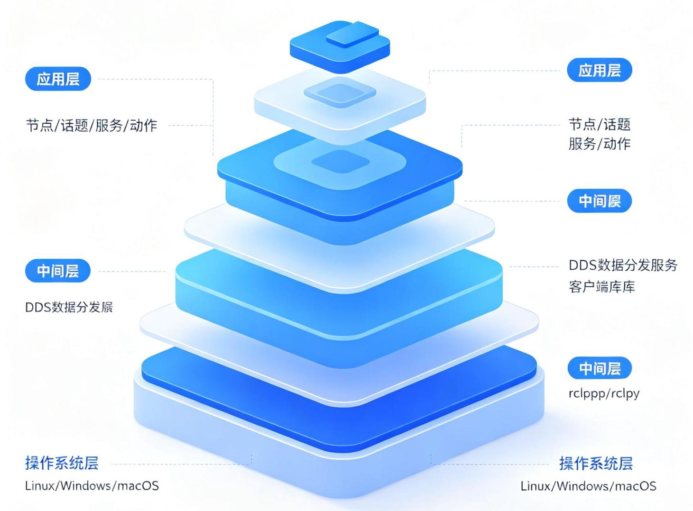
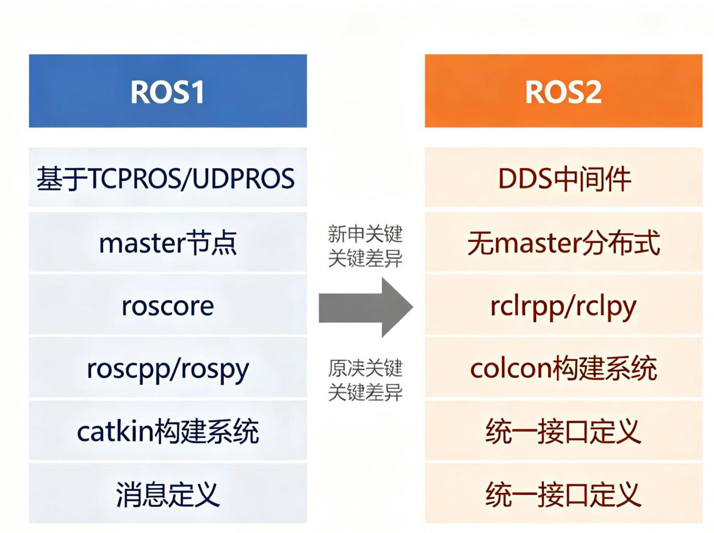
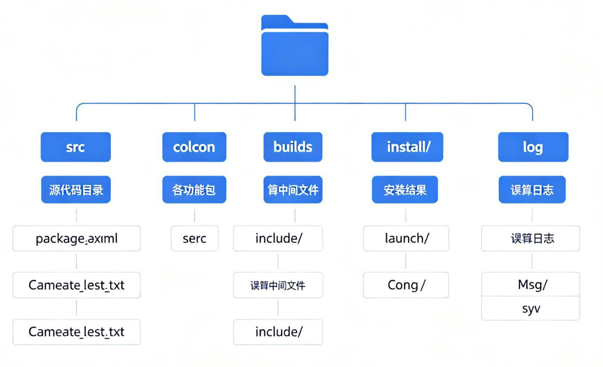

# 第9章 ROS 概述与环境搭建

ROS2

图9-1 ROS2系统分层架构

图9-2 ROS1与ROS2对比

## 9.1 机器人软件平台

### 9.1.1 什么是机器人软件平台

机器人是一个复杂的系统，包含机械、电子、嵌入式、感知、决策、控制等多个技术领域。为了降低开发难度、提高代码复用率，需要一个统一的软件平台来管理机器人的各个组件。

根据《ROS机器人编程》第1章，机器人软件平台应具备以下组件:

- 硬件抽象层:统一的传感器和执行器接口

- 设备驱动:各种硬件的驱动程序

- 通信中间件:进程间/设备间的消息通信

- 常用算法库:SLAM、导航、运动规划、视觉等

- 开发工具:可视化、调试、仿真、日志等

- 包管理系统:功能包的依赖管理和分发

### 9.1.2 机器人软件平台的必要性

- 降低技术壁垒:开发者不需要从零实现所有功能

- 代码复用:通用功能可以共享，避免重复造轮子

- 模块化设计:各个功能模块独立开发、测试和替换

- 社区生态:开源社区贡献大量功能包和工具

- 标准化接口:不同硬件和软件可以通过标准接口集成

## 9.2 ROS简介

### 9.2.1 什么是ROS

ROS(Robot Operating System，机器人操作系统)是一个开源的机器人软件开发框架，提供了操作系统应有的服务，包括硬件抽象、底层设备控制、常用功能实现、进程间消息传递和包管理等。

注意:ROS不是真正的操作系统，而是运行在Linux之上的中间件(Middleware)框架。它不负责进程调度、内存管理等操作系统核心功能，这些由底层Linux负责。

### 9.2.2 ROS的设计原则

根据《ROS机器人编程》第2章，ROS的设计原则包括:

- 点对点设计 (Peer-to-Peer) : 节点之间通过消息总线直接通信, 松耦合, 支持分布式

- 多语言支持 (Multi-Lingual) :支持C++、Python、Lisp等多种语言，语言无关

- 工具集丰富 (Tools-Based) : RViz、Gazebo、rqt、rosbag等可视化和调试工具

- 开源生态 (Open Source) : 大量开源功能包, 覆盖感知、规划、控制等

- 可复用性(Reusable):功能包可以独立开发、测试和复用

- 薄封装(Thin):ROS本身不提供算法实现，而是提供框架和接口，算法由功能包实现

### 9.2.3 ROS的目的

ROS的目的是为机器人研发提供一个通用的、模块化的、开源的软件平台，使研究者和开发者能够专注于自己的研究方向，而不需要重复实现底层功能。

### 9.2.4 ROS的组件

ROS的核心组件包括:

- 节点 (Node) : 执行计算的进程

- 话题 (Topic) : 发布/订阅模式的消息总线

- 服务 (Service) : 请求/响应模式的同步通信

- 动作 (Action) : 带反馈的长时间任务通信

- 参数服务器 (Parameter Server) : 共享配置数据

- 消息 (Message) : 节点间传递的数据结构

- 包 (Package) : 功能组织的基本单元

- 元包 (Metapackage) : 相关功能包的集合

### 9.2.5 ROS的生态系统

ROS拥有庞大的开源生态系统:

- ROS Wiki: 官方文档和教程

- ROS Answers: 问答社区

- ROS Discourse: 讨论论坛

- ROS Index: 功能包索引

- GitHub: 大量开源项目

- ROS Industrial: 工业机器人应用

### 9.2.6 ROS的历史

- 2007年:斯坦福人工智能实验室(SAIL)和Willow Garage公司开始开发ROS

- 2010年:ROS 1.0发布

- 2013年:Willow Garage关闭，ROS由OSRF(Open Source Robotics Foundation)维护

- 2014年:ROS Indigo(首个LTS版本)

- 2017年:ROS 2.0 (Ardent Apalone) 发布

- 2020年:ROS Foxy (ROS2首个LTS)

- 2022年:ROS Humble (ROS2 LTS，广泛使用)

- 2024年:ROS Jazzy(ROS2最新LTS)

### 9.2.7 ROS的版本

ROS1版本(按字母顺序，每年一个版本，偶数年LTS):

- Noetic Ninjemys (2020, ROS1最后一个版本，支持到2025年)

ROS2版本:

- Foxy Fitzroy (2020, LTS)

- Galactic Geochelone (2021)

- Humble Hawksbill (2022, LTS, 推荐)

- Iron Irwini (2023)

- Jazzy Jalisco (2024, LTS, 最新)

**版本选择建议:**

- 新项目推荐使用ROS2 Humble或Jazzy (LTS版本，长期支持)

- ROS1 Noetic仅用于维护旧项目

- 选择与Ubuntu版本匹配的ROS版本(Humble-Ubuntu 22.04, Jazzy-Ubuntu 24.04)

## 9.3 ROS2安装与环境配置

### 9.3.1 系统要求

- 操作系统:Ubuntu 22.04 LTS(对应Humble)或Ubuntu 24.04 LTS(对应Jazzy)

- 内存:至少4GB(推荐8GB以上)

- 磁盘空间:至少10GB(完整安装)

- 网络:需要访问ROS软件源

### 9.3.2 Ubuntu系统安装ROS2 (Humble版本)

---

	#1. 设置locale (确保支持UTF-8)

	sudo apt update && sudo apt install locales

	sudo locale-gen en_US en_US .UTF-8

	sudo update-locale LC_ALL=en_US.UTF-8 LANG=en_US.UTF-8

	export LANG=en_US.UTF-8

	#2. 添加ROS2 apt仓库

	sudo apt install software-properties-common

	sudo add-apt-repository universe

	sudo apt update && sudo apt install curl -y

	sudo curl -sSL https://raw.githubusercontent.com/ros/rosdistro/master/ros.

	key -o /usr/share/keyrings/ros-archive-keyring.gpg

12 - echo "deb [arch=\$(dpkg --print-architecture) signed-by=/usr/share/keyring

	s/ros-archive-keyring.gpg] http://packages.ros.org/ros2/ubuntu $(. /etc/os

	-release && echo $UBUNTU_CODENAME) main" | sudo tee /etc/apt/sources.list.

	d/ros2.list > /dev/null

	#3. 安装R0S2

	sudo apt update

	sudo apt upgrade

	sudo apt install ros-humble-desktop # 桌面完整版 (含RViz、Gazebo、演示等)

	#或 sudo apt install ros-humble-ros-base # 基础版 (仅核心库，无GUI工具)

	#4. 安装开发工具和依赖

	sudo apt install ros-dev-tools python3-colcon-common-extensions python3-ro

	sdep

	sudo rosdep init

	rosdep update

---

### 9.3.3 环境配置

---

#每次打开终端需要source ROS环境

	source /opt/ros/humble/setup.bash

#建议添加到.bashrc自动加载

echo "source /opt/ros/humble/setup.bash" >>> ~/.bashrc

---

### 9.3.4 工作空间创建与编译

ROS2工作空间目录结构

图9-3 ROS2工作空间目录结构

---

#创建工作空间目录结构

	mkdir -p ~/ros2_ws/src

		cd ~/ros2_ws

#编译工作空间(空工作空间也可以编译)

	colcon build

#source工作空间(在基础ROS环境之上叠加)

	source install/setup.bash

	#建议添加到.bashrc (可选, 根据需要)

	echo "source </ros2_ws/install/setup.bash" >> </.bashrc

---

### 9.3.5 集成开发环境(IDE)

推荐使用VS Code作为ROS2开发IDE:

- 安装VS Code

- 安装扩展:C/C++、Python、CMake、ROS、XML

- 配置include路径 (ROS2头文件路径)

- 使用colcon构建任务

- 使用调试器 (gdb/debugpy)

## 9.4 ROS操作测试

### 9.4.1 运行示例节点

安装完成后，可以运行官方示例验证安装:

---

#终端1:运行发布者节点(小海龟示例)

	ros2 run turtlesim turtlesim_node

#终端2:运行键盘控制节点

	ros2 run turtlesim turtle_teleop_key

#使用方向键控制小海龟移动

---

### 9.4.2 检查ROS2环境

---

	#查看ROS2版本

			ros2 --version

#查看已安装的ROS2包

	ros2 pkg list | head -20

#查看当前ROS_DOMAIN_ID

	echo $ROS_DOMAIN_ID

---

### 9.4.3 第一个ROS程序:Hello World

C++版本:

---

#include "rclcpp/rclcpp.hpp"

int main(int argc, char * argv[])

\{

	// 初始化ROS2

	rclcpp::init(argc, argv);

	// 创建节点

	auto node = rclcpp::Node::make_shared("hello_world_node");

	// 打印信息

	RCLCPP_INFO(node->get_logger(), "Hello, ROS2 World!");

	// 自旋 (保持节点运行, 等待回调)

	rclcpp::spin(node);

	// 关闭ROS2

	rclcpp::shutdown();

	return 0;

\}

---

Python版本:

---

	import rclpy

	from rclpy.node import Node

	class HelloWorldNode(Node):

				def __init__(self):

						super()._init__('hello_world_node')

						self.get_logger().info('Hello, ROS2 World!')

- def main(args=None):

				rclpy.init(args=args)

				node = HelloWorldNode()

				rclpy.spin(node)

				node.destroy_node()

				rclpy.shutdown()

- if ___name___ == '_main_':

				main()

---

推荐视频

ROS2 C++开发系列01:在ROS2上编写第一个C++ Hello World

手把手配置ROS2 C++开发环境，从VSCode配置、文件夹创建到编写并运行第一个程序，遵循官方风格指南。

[B站观看](https://www.bilibili.com/video/BV1nx9UBMEEB/)

**推荐GitHub项目**

ros2_for_beginners_code — ROS2初学者代码

配套ROS2入门教程的完整代码，按章节组织，包含C++和Python实现，涵盖话题、服务、动作、参数、TF、导航等主题，是学习ROS2编程的优秀参考。

[GitHub仓库](https://github.com/homalozoa/ros2_for_beginners_code)
