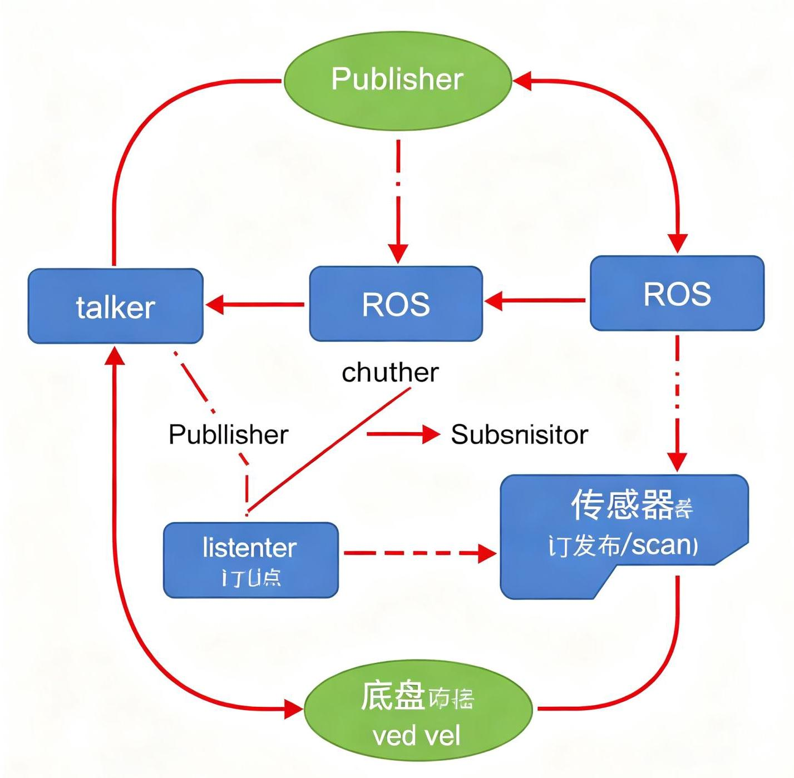
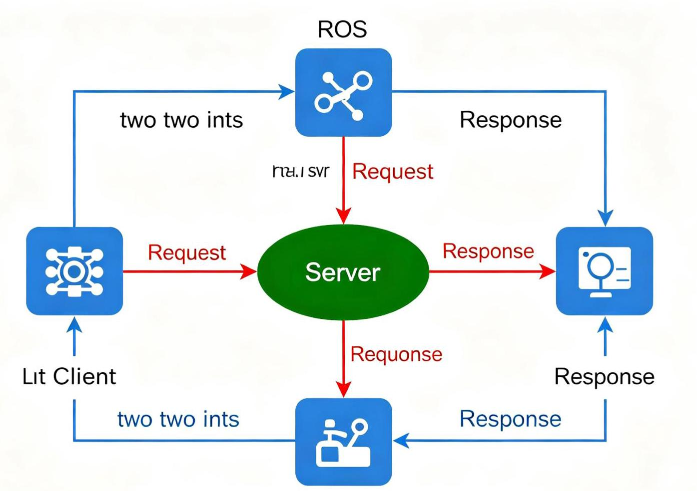
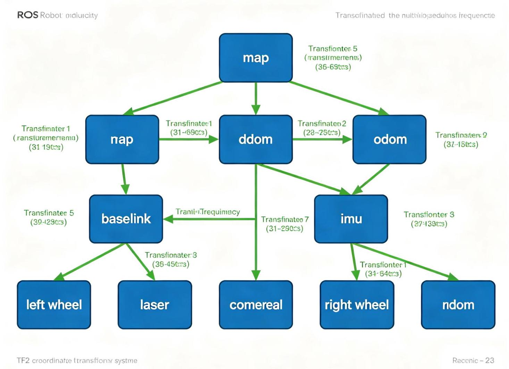

# 第10章 ROS核心概念与通信机制
<!-- 这是一张图片，ocr 内容为： -->


_图10-1 ROS节点与话题通信机制_


## 10.1 ROS术语
### 10.1.1 节点（Node）
节点是ROS2中执行计算的进程。一个机器人系统通常由多个节点组成，每个节点负责一个功能模块：

+ 相机驱动节点（获取图像）
+ 激光雷达驱动节点（获取扫描数据）
+ SLAM建图节点（构建地图）
+ 路径规划节点（规划路径）
+ 电机控制节点（控制底盘运动）
+ 人机交互节点（接收用户指令）

节点之间通过ROS2通信机制交换数据，实现松耦合的分布式系统。每个节点有一个唯一的名称（Node Name），用于识别和寻址。

### 10.1.2 ROS2的发现机制
ROS2使用DDS（Data Distribution Service）的自动发现机制，无需ROS Master：

+ 节点启动后自动广播存在信息（通过UDP多播）
+ 自动发现同一域内的其他节点和话题
+ 自动建立发布者与订阅者之间的连接
+ 支持同一网络内多机通信（通过ROS_DOMAIN_ID隔离不同系统）

这与ROS1不同：ROS1需要roscore作为中心节点管理所有节点，ROS2是去中心化的，没有单点故障。

### 10.1.3 其他核心术语
+ **消息（Message）**：节点间传递的数据结构，用.msg文件定义
+ **话题（Topic）**：命名的消息总线，发布者向话题发消息，订阅者从话题收消息
+ **服务（Service）**：请求/响应模式的同步通信，用.srv文件定义
+ **动作（Action）**：带反馈和可取消的长时间任务通信，用.action文件定义
+ **参数（Parameter）**：节点的配置值，可以在运行时动态修改
+ **功能包（Package）**：ROS2软件组织的基本单元，包含节点代码、消息定义、配置文件等
+ **工作空间（Workspace）**：包含多个功能包的开发目录

## 10.2 消息通信
### 10.2.1 话题（Topic）
话题是ROS2中最常用的通信方式，采用**发布/订阅（Publish/Subscribe）**模式：

+ **发布者（Publisher）**：向话题发送消息
+ **订阅者（Subscriber）**：从话题接收消息
+ 一个话题可以有多个发布者和多个订阅者（多对多）
+ 异步通信：发布者不关心谁在订阅，订阅者不关心谁在发布
+ 适合持续数据流：传感器数据、状态信息、命令等

<!-- 这是一张图片，ocr 内容为： -->

_图10-1：ROS话题通信模型，包含ROS Master（ROS1）、Talker（发布者）和Listener（订阅者），通过注册、匹配、连接、数据传输的流程实现通信_

**常用命令：**

```bash
ros2 topic list                    # 列出所有话题
ros2 topic info /topic_name        # 查看话题信息（类型、发布者、订阅者数量）
ros2 topic echo /topic_name        # 打印话题消息内容
ros2 topic pub /topic_name type "{data}"  # 向话题发布消息
ros2 topic hz /topic_name          # 查看话题发布频率
ros2 topic bw /topic_name          # 查看话题带宽
```

**C++发布者示例：**

```cpp
#include "rclcpp/rclcpp.hpp"
#include "std_msgs/msg/string.hpp"

class MinimalPublisher : public rclcpp::Node {
public:
    MinimalPublisher() : Node("minimal_publisher"), count_(0) {
        // 创建发布者：消息类型、话题名、QoS（队列深度10）
        publisher_ = this->create_publisher<std_msgs::msg::String>("topic", 10);
        // 创建定时器，每500ms触发一次回调
        timer_ = this->create_wall_timer(
            std::chrono::milliseconds(500),
            std::bind(&MinimalPublisher::timer_callback, this));
    }
private:
    void timer_callback() {
        auto message = std_msgs::msg::String();
        message.data = "Hello, ROS2! " + std::to_string(count_++);
        RCLCPP_INFO(this->get_logger(), "Publishing: '%s'", message.data.c_str());
        publisher_->publish(message);
    }
    rclcpp::Publisher<std_msgs::msg::String>::SharedPtr publisher_;
    rclcpp::TimerBase::SharedPtr timer_;
    size_t count_;
};
```

### 10.2.2 服务（Service）
<!-- 这是一张图片，ocr 内容为： -->


_图10-2 ROS服务通信模型_

服务采用**请求/响应（Request/Response）**模式：

+ **客户端（Client）**：发送请求（Request）
+ **服务端（Server）**：接收请求，处理后返回响应（Response）
+ 一对一同步通信：一个服务可以有多个客户端，但同一时刻只能处理一个请求
+ 适合一次性的查询或触发操作：获取参数、触发动作、计算结果等

**常用命令：**

```bash
ros2 service list                 # 列出所有服务
ros2 service type /service_name   # 查看服务类型
ros2 service call /service_name type "{request}"  # 调用服务
```

**话题 vs 服务对比：**

| 特性 | 话题（Topic） | 服务（Service） |
| --- | --- | --- |
| 模式 | 发布/订阅 | 请求/响应 |
| 通信 | 异步 | 同步 |
| 连接 | 多对多 | 一对多（多客户端） |
| 数据 | 持续流 | 一次性 |
| 适用 | 传感器数据、状态 | 查询、触发操作 |
| 反馈 | 无 | 有响应 |


### 10.2.3 动作（Action）
动作是ROS2中较复杂的通信方式，适合**长时间运行的任务**：

+ 由三个部分组成：
    - **目标（Goal）**：客户端发送任务目标
    - **反馈（Feedback）**：服务端持续发送进度反馈
    - **结果（Result）**：任务完成后返回最终结果
+ 支持取消任务（客户端可以中途取消）
+ 适合导航、机械臂运动、长时间操作等任务

## **动作的结构（.action文件）：**  
```  
# 目标部分  
geometry_msgs/PoseStamped target_pose
# 结果部分
## bool reached  
float32 total_distance
# 反馈部分
float32 progress_percent  
geometry_msgs/Pose current_pose

```plain

### 10.2.4 参数（Parameter）

参数是节点的配置值，可以在运行时动态修改：
- 每个节点有自己的参数（参数属于节点，不是全局共享的，这是ROS2与ROS1的区别）
- 支持类型：整数、浮点数、布尔、字符串、字节数组、上述类型的数组
- 可以通过命令行、launch文件、代码或rqt工具设置和修改

**常用命令：**
```bash
ros2 param list /node_name        # 列出节点的所有参数
ros2 param get /node_name param   # 获取参数值
ros2 param set /node_name param value  # 设置参数值
ros2 param dump /node_name        # 导出参数到YAML文件
ros2 param load /node_name file.yaml  # 从YAML文件加载参数
```

### 10.2.5 消息通信的过程（ROS1 vs ROS2）
ROS1的通信过程需要ROS Master：

1. 发布者向Master注册（话题名、类型、RPC地址）
2. 订阅者向Master注册（话题名、类型、RPC地址）
3. Master匹配发布者和订阅者，返回对方的RPC地址
4. 订阅者通过RPC请求与发布者建立TCP连接
5. 发布者通过TCP连接发送数据

ROS2基于DDS，无需Master，自动发现和建立连接，支持多种QoS策略（可靠性、持久性、深度等）。

## 10.3 消息定义
### 10.3.1 msg文件
.msg文件定义话题使用的消息数据结构：

```plain
# 自定义消息示例：RobotStatus.msg
std_msgs/Header header    # 标准消息头（时间戳、坐标系）
float32 battery_level      # 电池电量（0-100）
bool is_charging           # 是否在充电
string error_message       # 错误信息
float32[] motor_temps      # 电机温度数组
```

### 10.3.2 srv文件
.srv文件定义服务的请求和响应数据结构，用`---`分隔：

```plain
# 自定义服务示例：CalculateIK.srv
# 请求部分
geometry_msgs/Pose target_pose
---
# 响应部分
float64[] joint_angles
bool success
string message
```

### 10.3.3 action文件
.action文件定义动作的目标、结果和反馈，用`---`分隔：

```plain
# 自定义动作示例：NavigateToPose.action
# 目标部分
geometry_msgs/PoseStamped target_pose
---
# 结果部分
bool reached
float32 total_distance
duration elapsed_time
---
# 反馈部分
float32 progress_percent
geometry_msgs/Pose current_pose
float32 estimated_time_remaining
```

### 10.3.4 常用标准消息
ROS2提供了大量标准消息类型：

+ **std_msgs**：基础类型（String、Int32、Float64、Bool、Header等）
+ **geometry_msgs**：几何类型（Point、Pose、Twist、Transform、Quaternion等）
+ **sensor_msgs**：传感器类型（Image、LaserScan、PointCloud2、Imu、JointState等）
+ **nav_msgs**：导航类型（Odometry、Path、OccupancyGrid、MapMetaData等）
+ **action_msgs**：动作相关类型
+ **tf2_msgs**：坐标变换相关类型

## 10.4 坐标变换（TF）
<!-- 这是一张图片，ocr 内容为： -->


_图10-3 TF2坐标变换树_

### 10.4.1 TF的概念
TF（Transform）是ROS中管理坐标系变换的系统，用于跟踪和查询多个坐标系之间的关系。TF2是ROS2中的升级版本。

TF2的核心功能：

+ 维护坐标系树（Transform Tree）
+ 实时广播坐标系变换（Broadcaster）
+ 查询任意两个坐标系之间的变换（Listener）
+ 支持时间插值（查询历史某个时刻的变换）
+ 支持多种消息类型的坐标变换

### 10.4.2 TF树
机器人系统中有多个坐标系，通过父子关系连接成树（不能有环）：

```plain
map → odom → base_link → laser_link
                      → camera_link
                      → imu_link
                      → wheel_left_link
                      → wheel_right_link
```

每个变换描述子坐标系相对于父坐标系的位姿（平移+旋转）。

### 10.4.3 TF工具
```bash
# 生成TF树图（PDF）
ros2 run tf2_tools view_frames

# 查看两个坐标系之间的变换
ros2 run tf2_ros tf2_echo frame1 frame2

# 静态变换发布器
ros2 run tf2_ros static_transform_publisher x y z qx qy qz qw parent child

# 查看TF消息
ros2 topic echo /tf
ros2 topic echo /tf_static
```

## 10.5 构建系统与功能包
### 10.5.1 功能包结构
ROS2功能包（Package）是软件组织的基本单元，典型结构：

```plain
my_package/
├── CMakeLists.txt          # 构建配置（ament_cmake）
├── package.xml             # 包元信息（名称、版本、依赖、作者）
├── include/
│   └── my_package/
│       └── my_node.hpp    # 头文件
├── src/
│   └── my_node.cpp        # 源代码
├── msg/                    # 自定义消息（可选）
│   └── MyMessage.msg
├── srv/                    # 自定义服务（可选）
│   └── MyService.srv
├── action/                 # 自定义动作（可选）
│   └── MyAction.action
├── launch/                 # launch文件（可选）
│   └── my_launch.py
├── config/                 # 配置文件（可选）
│   └── params.yaml
└── rviz/                   # RViz配置（可选）
    └── my_config.rviz
```

### 10.5.2 创建功能包
```bash
# 创建C++功能包（ament_cmake）
ros2 pkg create --build-type ament_cmake --node-name my_node my_package

# 创建Python功能包（ament_python）
ros2 pkg create --build-type ament_python --node-name my_node my_package

# 添加依赖
ros2 pkg create --build-type ament_cmake --dependencies rclcpp std_msgs my_package
```

### 10.5.3 colcon构建工具
colcon是ROS2的构建工具（替代ROS1的catkin_make）：

```bash
colcon build                          # 构建工作空间所有包
colcon build --packages-select pkg    # 只构建指定包
colcon build --symlink-install        # 符号链接安装（开发时用，修改Python脚本无需重新编译）
colcon build --cmake-args -DCMAKE_BUILD_TYPE=Debug  # Debug模式
colcon test                           # 运行测试
colcon test-result --verbose         # 查看测试结果
```

### 📺 推荐视频
> **【2026最新】ROS2机器人开发从入门到实践：通信架构详解**  
深入讲解ROS2的话题、服务、动作、参数四大通信机制，包含DDS原理、QoS配置、自定义消息和完整实战代码。  
🔗 [B站观看](https://www.bilibili.com/video/BV1tjME6XEeL/)
>

### 💻 推荐GitHub项目
> **Hands-On-ROS-for-Robotics-Programming**  
《ROS机器人编程实战》配套代码仓库，按章节组织，包含话题、服务、动作、参数、TF、导航、SLAM、机械臂等完整示例，是学习ROS2通信机制的优秀参考。  
🔗 [GitHub仓库](https://github.com/PacktPublishing/Hands-On-ROS-for-Robotics-Programming)
>

---
