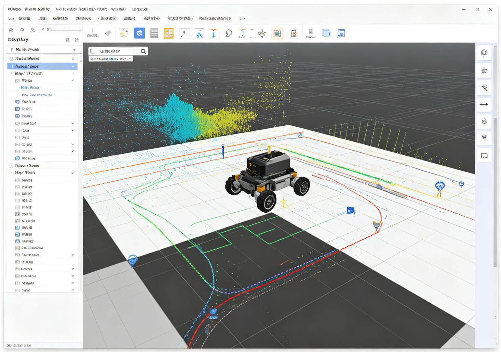
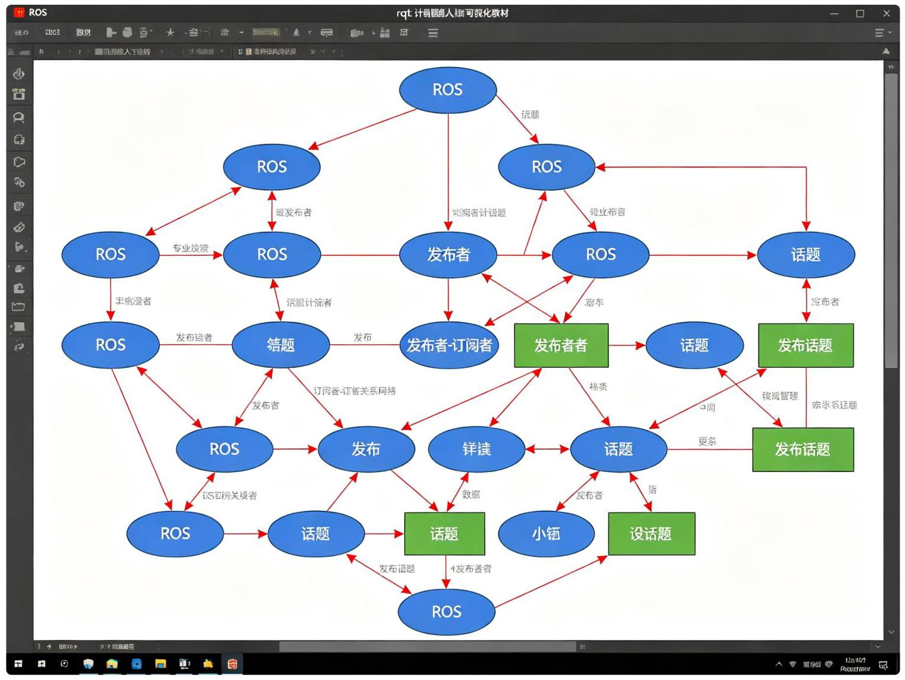
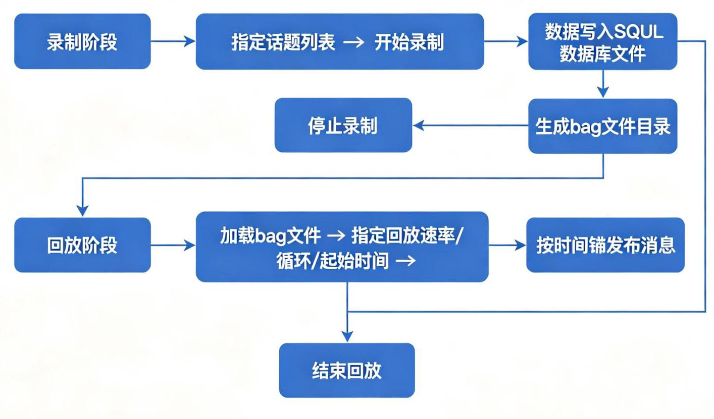

# 第11章 ROS 命令与工具

ROS三机器人操作系统教材

图11-1 RViz三维可视化工具界面

## 11.1 ROS命令概述

ROS2提供了丰富的命令行工具，用于管理节点、话题、服务、参数、功能包等。掌握这些命令是ROS开发和调试的基础。

ROS2命令的基本格式: ros2 <命令组> <子命令> [参数]

主要命令组:

- ros2 node : 节点管理

- ros2 topic : 话题管理

- ros2 service : 服务管理

- ros2 action : 动作管理

- ros2 param:参数管理

- ros2 pkg : 功能包管理

- ros2 run : 运行节点

- ros2 launch : 运行launch文件

- ros2 bag : 数据记录与回放

- ros2 interface : 消息接口查看

- ros2 doctor : 系统诊断

- ros2 wtf : 问题排查

## 11.2 节点管理命令

---

			#列出所有运行中的节点

			ros2 node list

			#查看节点详细信息(发布的话题、订阅的话题、提供的服务、动作等)

			ros2 node info /node_name

			#示例输出:

				/turtlesim

						Subscribers:

							/parameter_events: rcl_interfaces/msg/ParameterEvent

							/turtle1/cmd_vel: geometry_msgs/msg/Twist

						Publishers:

							/parameter_events: rcl_interfaces/msg/ParameterEvent

							/rosout: rcl_interfaces/msg/Log

							/turtle1/color_sensor: turtlesim/msg/Color

							/turtle1/pose: turtlesim/msg/Pose

						Service Servers:

							/clear: std_srvs/srv/Empty

					//kill: turtlesim/srv/Kill

							/reset: std_srvs/srv/Empty

21 # /spawn: turtlesim/srv/Spawn

		#/turtle1/set_pen: turtlesim/srv/SetPen

							/turtle1/teleport_absolute: turtlesim/srv/TeleportAbsolute

							/turtle1/teleport_relative: turtlesim/srv/TeleportRelative

---

## 11.3 话题管理命令

---

																#列出所有话题

																			ros2 topic list

																	#列出所有话题及其类型

																			ros2 topic list -t

																		#查看话题信息(类型、发布者数量、订阅者数量)

																		ros2 topic info /topic_name

																	#查看话题信息 (含详细QoS配置)

																			ros2 topic info -v /topic_name

																	#打印话题消息内容(持续输出)

																		ros2 topic echo /topic_name

																	#只打印一次

																		ros2 topic echo --once /topic_name

																#向话题发布消息

ros2 topic pub /topic_name std_msgs/msg/String "\{data: 'Hello ROS2'\}"

															#以指定频率发布 (1Hz)

		ros2 topic pub -r 1 /topic_name std_msgs/msg/String "\{data: 'Hello'\}"

																#查看话题发布频率

																			ros2 topic hz /topic_name

																	#查看话题带宽

																			ros2 topic bw /topic_name

																	#查找指定类型的话题

																		ros2 topic find std_msgs/msg/String

---

## 11.4 服务管理命令

---

	#列出所有服务

	ros2 service list

	#列出所有服务及其类型

	ros2 service list -t

	#查看服务类型

	ros2 service type /service_name

	#调用服务

	ros2 service call /service_name std_srvs/srv/Empty "\{\}"

	#调用带参数的服务

4 - ros2 service call /spawn turtlesim/srv/Spawn "\{x: 2.0, y: 2.0, theta: 0.

	0, name: 'turtle2'\}"

	#查找指定类型的服务

	ros2 service find std_srvs/srv/Empty

---

## 11.5 动作管理命令

---

				#列出所有动作

					ros2 action list

				#列出所有动作及其类型

					ros2 action list -t

				#查看动作信息

					ros2 action info /action_name

				#发送动作目标

			ros2 action send_goal /action_name action_type "\{goal_field: value\}"

				#发送动作目标并查看反馈

14 - ros2 action send_goal --feedback /action_name action_type "\{...\}"

---

## 11.6 参数管理命令

---

#列出节点的所有参数

	ros2 param list /node_name

#获取参数值

		ros2 param get /node_name param_name

#设置参数值

			ros2 param set /node_name param_name value

#示例:设置背景颜色

		ros2 param set /turtlesim background_r 255

#导出参数到YAML文件

		ros2 param dump /node_name > params.yaml

#从YAML文件加载参数

		ros2 param load /node_name params.yaml

#删除参数(如果允许)

		ros2 param delete /node_name param_name

#描述参数

	ros2 param describe /node_name param_name

---

## 11.7 功能包管理命令

---

#列出所有已安装的功能包

	ros2 pkg list

#查看功能包前缀 (安装路径)

	ros2 pkg prefix package_name

#查看功能包的可执行文件

	ros2 pkg executables package_name

#查看功能包依赖

	ros2 pkg dependencies package_name

#创建C++功能包

		ros2 pkg create --build-type ament_cmake --dependencies rclcpp std_msgs my

		_package

#创建Python功能包

ros2 pkg create --build-type ament_python --dependencies rclpy std_msgs my

	_package

---

## 11.8 运行与构建命令

---

#运行单个节点

		ros2 run package_name node_name

#运行节点并传参

	ros2 run package_name node_name --ros-args -p param_name:=value

#运行launch文件

		ros2 launch package_name launch_file.py

#运行当前目录的launch文件

		ros2 launch ./launch_file.py

#构建工作空间

		colcon build

#构建指定包

			colcon build --packages-select package_name

#符号链接安装 (开发用)

colcon build --symlink-install

#清理构建

rm -rf build/ install/ log/

---

## 11.9 三维可视化工具(RViz)

图11-2 rqt计算图可视化

### 11.9.1 RViz简介

RViz是ROS的三维可视化工具，可以显示机器人模型、传感器数据、地图、路径、TF坐标系等。它是 ROS开发中最重要的调试和可视化工具。

RViz的主要功能:

- 机器人模型 (URDF) 可视化

- 激光雷达数据 (LaserScan) 显示

- 点云(PointCloud2)显示

- 相机图像(Image)显示

- 二维栅格地图(Map)显示

- 路径 (Path) 显示

- TF坐标系树可视化

- 交互式标记 (Interactive Marker)

- 里程计 (Odometry) 轨迹显示

---

	-

图片加载失败

---

图11-1:RViz可视化界面，显示机器人模型、TF坐标系、激光雷达数据、里程计轨迹等

### 11.9.2 RViz基本操作

---

	#启动RViz

	rviz2

	#加载配置文件启动

	rviz2 -d config.rviz

	#通过launch文件启动RViz(推荐)

	#在launch.py中添加:

	#from launch_ros.actions import Node

10 ▼ # Node(package='rviz2', executable='rviz2', arguments=['-d', config_path])

---

### 11.9.3 常用Display插件

在RViz左侧面板点击"Add"添加显示插件:

<table id="cross-table-3"><tr><td>Display</td><td>功能</td><td>常用话题</td></tr><tr><td>RobotModel</td><td>显示机器人URDF模型</td><td>/robot_description(参数)</td></tr><tr><td>LaserScan</td><td>显示二维激光雷达</td><td>/scan</td></tr><tr><td>PointCloud2</td><td>显示三维点云</td><td>/points2</td></tr><tr><td>Image</td><td>显示相机图像</td><td>/camera/image_raw</td></tr><tr><td>Map</td><td>显示二维栅格地图</td><td>/map</td></tr><tr><td>Path</td><td>显示路径</td><td>/path</td></tr><tr><td>TF</td><td>显示坐标系变换</td><td>/tf, /tf_static</td></tr><tr><td>Marker</td><td>显示自定义标记</td><td>/marker</td></tr><tr><td>Odometry</td><td>显示里程计轨迹</td><td>/odom</td></tr><tr><td>PoseArray</td><td>显示位姿数组(粒子滤波)</td><td>/particlecloud</td></tr><tr><td>Polygon</td><td>显示多边形</td><td>/footprint</td></tr></table>

### 11.9.4 RViz配置保存

配置好Display后，可以保存为.rviz配置文件，下次直接加载:

- File $\rightarrow$ Save Config As $\rightarrow$ 选择保存路径

- 建议将配置文件放在功能包的rviz/目录下

- 通过launch文件自动加载配置

## 11.10 GUI开发工具(rqt)

### 11.10.1 rqt简介

rqt是基于Qt的ROS GUI工具框架，提供了多种插件，用于可视化、调试和监控。与RViz不同，rqt专注于2D数据和系统管理。

---

1 # 启动rqt (可在界面中选择插件)

	rqt

---

### 11.10.2 常用rqt插件

<table id="cross-table-4"><tr><td>插件</td><td>命令</td><td>功能</td></tr><tr><td>rqt_graph</td><td>rqt_graph</td><td>显示节点和话题的通信关系图</td></tr><tr><td>rqt_plot</td><td>rqt_plot</td><td>绘制话题数据的实时曲线</td></tr><tr><td>rqt_console</td><td>rqt_console</td><td>日志消息查看器(过滤、分级显示)</td></tr><tr><td>rqt_reconfigure</td><td>rqt_reconfigure</td><td>动态参数配置(实时修改参数)</td></tr><tr><td>rqt_image_view</td><td>rqt_image_view</td><td>图像查看器(选择话题显示图像)</td></tr><tr><td>rqt_bag</td><td>rqt_bag</td><td>rosbag文件查看和编辑</td></tr><tr><td>rqt_tf_tree</td><td>rqt_tf_tree</td><td>TF坐标系树可视化</td></tr><tr><td>rqt_publisher</td><td>rqt_publisher</td><td>图形化消息发布器</td></tr><tr><td>rqt_service_caller</td><td>rqt_service_caller</td><td>图形化服务调用器</td></tr><tr><td>rqt_shell</td><td>rqt_shell</td><td>嵌入式终端</td></tr></table>

### 11.10.3 rqt_graph使用

rqt_graph是最常用的rqt插件，显示系统中节点和话题的通信关系:

---

1 rqt_graph

---

- 椭圆表示节点

- 矩形表示话题

- 箭头表示消息流向

- 可以过滤显示 (按命名空间、隐藏调试话题等)

- 可以刷新查看实时变化

### 11.10.4 rqt_plot使用

rqt_plot用于绘制话题数据的实时曲线，适合调试传感器数据、控制误差等:

---

	rqt_plot /topic/field1 /topic/field2

	#示例:绘制激光雷达前三个距离值

3 - rqt_plot /scan/ranges[0] /scan/ranges[1] /scan/ranges[2]

---

## 11.11 rosbag数据记录与回放

**RoS bag - ros2 bag数据录制与回放流程**

图11-3 ros2 bag数据录制与回放

### 11.11.1 rosbag2简介

rosbag2是ROS2的数据记录工具，可以记录话题消息到文件，后续回放。主要用途:

- 调试和测试 (记录问题场景, 反复回放分析)

- 算法开发 (记录真实传感器数据，离线开发算法)

- 复现实验场景

- 数据共享

### 11.11.2 录制数据

---

#录制所有话题

		ros2 bag record -a

#录制指定话题

			ros2 bag record /scan /odom /camera/image_raw

#录制并指定输出目录名

			ros2 bag record -o my_bag /scan /odom

#录制时压缩 (zstd格式)

		ros2 bag record --compression-mode file --compression-format zstd -a

#录制时排除某些话题

	ros2 bag record -a -e /camera/.*

#限制录制大小 (100MB后分割)

		ros2 bag record -a --max-bag-size 104857600

---

### 11.11.3 回放数据

---

#回放bag文件(目录名)

		ros2 bag play my_bag/

#循环回放

	ros2 bag play -1 my_bag/

#倍速回放(2倍速)

	ros2 bag play -r 2.0 my_bag/

#从指定时间开始回放 (跳过前10秒)

			ros2 bag play --start-offset 10.0 my_bag/

#只回放指定话题

		ros2 bag play my_bag/ --topics /scan /odom

#回放时延迟开始 (等待5秒)

	ros2 bag play my_bag/ --delay 5.0

---

### 11.11.4 查看bag信息

---

		#查看bag文件信息(话题、类型、消息数、时长等)

		ros2 bag info my_bag/

		#示例输出:

		#Files: 																							my_bag_0.db3

		#Bag size: 																							1.2 MiB

		#Storage id: 																							sqlite3

		#Duration: 																							10.5s

		#Start: 																							Aug 29 2024 14:30:00.123 (1234567890.123)

		#End: 																							Aug 29 2024 14:30:10.623 (1234569000.623)

		#Messages: 																							12345

			#Topic information:

#Topic: /scan | Type: sensor_msgs/msg/LaserScan | Count: 105 | QoS: ...

	#Topic: /odom | Type: nav_msgs/msg/Odometry | Count: 525 | QoS: ...

---

## 11.12 系统诊断与问题排查

---

	#系统诊断 (检查ROS2环境、网络、DDS等)

	ros2 doctor

	#详细诊断报告

	ros2 doctor --report

	#问题排查(显示系统状态和潜在问题)

	ros2 wtf

	#检查接口定义

	ros2 interface show std_msgs/msg/String

	ros2 interface list | grep LaserScan

ros2 interface package sensor_msgs # 列出某个包的所有接口

---

**推荐视频**

【中英双语】具身智能ROS2机器人开发入门:可视化与调试工具

详细演示RViz2配置、Gazebo仿真环境搭建、rqt工具箱使用(rqt_graph、rqt_plot、rqt_console)和 rosbag数据录制回放，是ROS2调试必备技能。

B B站观看

推荐GitHub项目

ros_robotics_projects — ROS机器人项目实例

包含人脸识别、聊天机器人、手势控制、目标检测、深度学习、SLAM导航等多个ROS项目完整代码， 每个项目都有详细的RViz配置和调试方法。

O GitHub仓库
