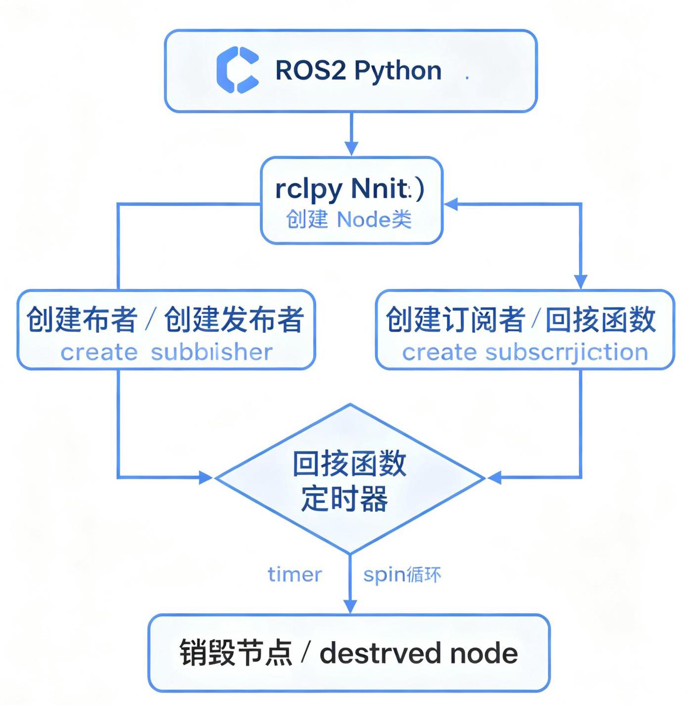
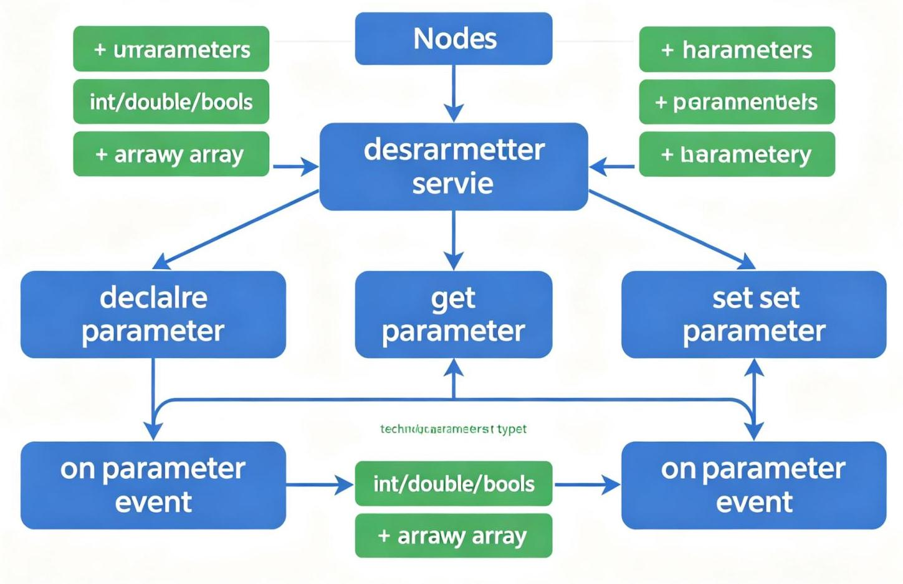
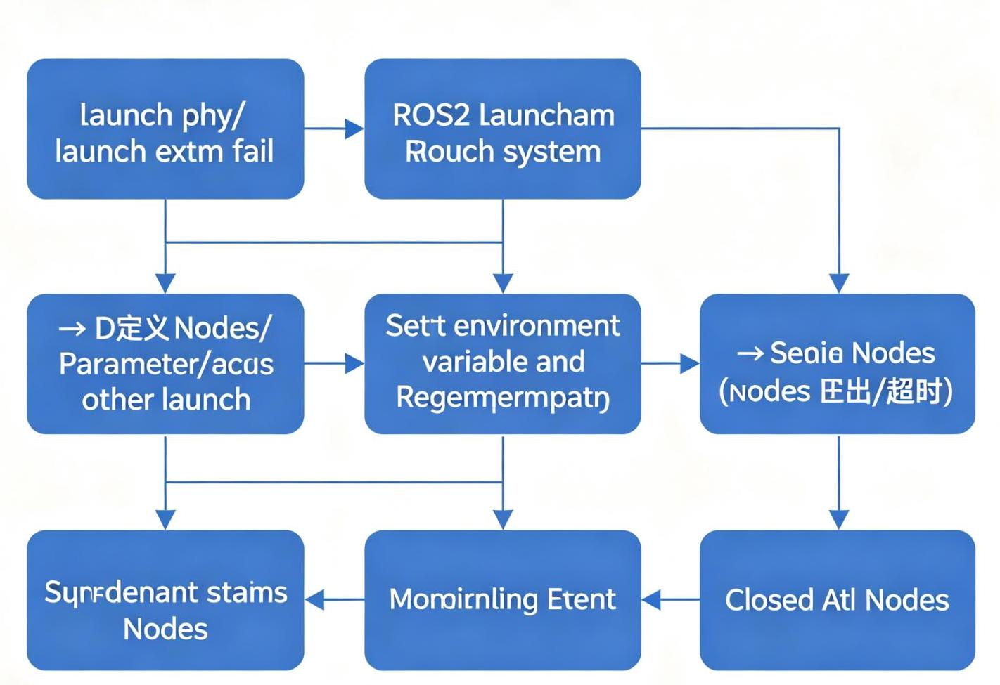

# 第12章 ROS编程基础
<!-- 这是一张图片，ocr 内容为： -->


_图12-1 ROS2节点编程流程_


## 12.1 ROS编程前须知事项
### 12.1.1 标准单位
ROS中使用标准国际单位制（SI）：

+ 长度：米（m）
+ 质量：千克（kg）
+ 时间：秒（s）
+ 角度：弧度（rad）（注意：不是度！）
+ 力：牛顿（N）
+ 力矩：牛顿·米（N·m）
+ 频率：赫兹（Hz）

所有ROS消息都使用这些标准单位，编程时需要注意单位转换（如度转弧度：rad = deg × π / 180）。

### 12.1.2 坐标表现方式
ROS使用右手坐标系（REP-103标准）：

+ X轴：向前
+ Y轴：向左
+ Z轴：向上
+ 旋转：右手定则（拇指沿轴正方向，四指弯曲方向为正旋转）

常用坐标系：

+ `map`：地图坐标系（固定，世界坐标系）
+ `odom`：里程计坐标系（固定，但有漂移）
+ `base_link`：机器人本体坐标系（随机器人运动）
+ `laser_link`：激光雷达坐标系
+ `camera_link`：相机坐标系（光学坐标系Z轴向前，X轴向右，Y轴向下）

### 12.1.3 编程规则
+ 使用ROS2客户端库（rclcpp for C++，rclpy for Python）
+ 节点命名使用小写字母和下划线（snake_case）
+ 话题命名使用斜杠分隔的层级结构（如 /turtle1/cmd_vel）
+ 使用ROS2日志宏（RCLCPP_INFO / get_logger().info）而不是printf/cout
+ 使用智能指针管理节点和对象
+ 遵循ROS2代码风格指南

## 12.2 发布者节点和订阅者节点
### 12.2.1 创建功能包
```bash
cd ~/ros2_ws/src
ros2 pkg create --build-type ament_cmake --dependencies rclcpp std_msgs my_first_package
```

### 12.2.2 发布者节点（C++）
```cpp
#include "rclcpp/rclcpp.hpp"
#include "std_msgs/msg/string.hpp"

using namespace std::chrono_literals;

class PublisherNode : public rclcpp::Node {
public:
    PublisherNode() : Node("publisher_node"), count_(0) {
        // 创建发布者：消息类型、话题名、QoS队列深度
        publisher_ = this->create_publisher<std_msgs::msg::String>("chatter", 10);
        
        // 创建定时器，每500ms发布一次
        timer_ = this->create_wall_timer(
            500ms, std::bind(&PublisherNode::timer_callback, this));
        
        RCLCPP_INFO(this->get_logger(), "发布者节点已启动");
    }

private:
    void timer_callback() {
        auto message = std_msgs::msg::String();
        message.data = "Hello, ROS2! 计数: " + std::to_string(count_++);
        RCLCPP_INFO(this->get_logger(), "发布: '%s'", message.data.c_str());
        publisher_->publish(message);
    }
    
    rclcpp::Publisher<std_msgs::msg::String>::SharedPtr publisher_;
    rclcpp::TimerBase::SharedPtr timer_;
    size_t count_;
};

int main(int argc, char * argv[]) {
    rclcpp::init(argc, argv);
    rclcpp::spin(std::make_shared<PublisherNode>());
    rclcpp::shutdown();
    return 0;
}
```

### 12.2.3 订阅者节点（C++）
```cpp
#include "rclcpp/rclcpp.hpp"
#include "std_msgs/msg/string.hpp"

class SubscriberNode : public rclcpp::Node {
public:
    SubscriberNode() : Node("subscriber_node") {
        // 创建订阅者：话题名、QoS、回调函数（使用std::bind绑定成员函数）
        subscription_ = this->create_subscription<std_msgs::msg::String>(
            "chatter", 10,
            std::bind(&SubscriberNode::topic_callback, this, std::placeholders::_1));
        
        RCLCPP_INFO(this->get_logger(), "订阅者节点已启动");
    }

private:
    void topic_callback(const std_msgs::msg::String::SharedPtr msg) const {
        RCLCPP_INFO(this->get_logger(), "收到: '%s'", msg->data.c_str());
    }
    
    rclcpp::Subscription<std_msgs::msg::String>::SharedPtr subscription_;
};

int main(int argc, char * argv[]) {
    rclcpp::init(argc, argv);
    rclcpp::spin(std::make_shared<SubscriberNode>());
    rclcpp::shutdown();
    return 0;
}
```

### 12.2.4 修改CMakeLists.txt
```cmake
cmake_minimum_required(VERSION 3.8)
project(my_first_package)

if(CMAKE_COMPILER_IS_GNUCXX OR CMAKE_CXX_COMPILER_ID MATCHES "Clang")
  add_compile_options(-Wall -Wextra -Wpedantic)
endif()

find_package(ament_cmake REQUIRED)
find_package(rclcpp REQUIRED)
find_package(std_msgs REQUIRED)

# 发布者节点
add_executable(publisher_node src/publisher_node.cpp)
ament_target_dependencies(publisher_node rclcpp std_msgs)

# 订阅者节点
add_executable(subscriber_node src/subscriber_node.cpp)
ament_target_dependencies(subscriber_node rclcpp std_msgs)

install(TARGETS
  publisher_node
  subscriber_node
  DESTINATION lib/${PROJECT_NAME})

ament_package()
```

### 12.2.5 编译和运行
```bash
cd ~/ros2_ws
colcon build --packages-select my_first_package
source install/setup.bash

# 终端1：运行发布者
ros2 run my_first_package publisher_node

# 终端2：运行订阅者
ros2 run my_first_package subscriber_node

# 终端3：查看话题
ros2 topic echo /chatter
```

## 12.3 服务服务器与客户端
### 12.3.1 创建服务文件
## 在功能包中创建`srv/AddTwoInts.srv`：  
```  
int64 a  
int64 b
int64 sum

```plain

在CMakeLists.txt中添加：
```cmake
find_package(rosidl_default_generators REQUIRED)

rosidl_generate_interfaces(${PROJECT_NAME}
  "srv/AddTwoInts.srv"
)
```

在package.xml中添加：

```xml
<build_depend>rosidl_default_generators</build_depend>

<exec_depend>rosidl_default_runtime</exec_depend>

<member_of_group>rosidl_interface_packages</member_of_group>

```

### 12.3.2 服务服务器（C++）
```cpp
#include "rclcpp/rclcpp.hpp"
#include "my_first_package/srv/add_two_ints.hpp"

class ServiceServer : public rclcpp::Node {
public:
    ServiceServer() : Node("service_server") {
        service_ = this->create_service<my_first_package::srv::AddTwoInts>(
            "add_two_ints",
            std::bind(&ServiceServer::handle_service, this,
                      std::placeholders::_1, std::placeholders::_2));
        RCLCPP_INFO(this->get_logger(), "服务服务器已启动");
    }

private:
    void handle_service(
        const std::shared_ptr<my_first_package::srv::AddTwoInts::Request> request,
        std::shared_ptr<my_first_package::srv::AddTwoInts::Response> response) {
        response->sum = request->a + request->b;
        RCLCPP_INFO(this->get_logger(), "请求: a=%ld, b=%ld, 响应: sum=%ld",
                    request->a, request->b, response->sum);
    }
    
    rclcpp::Service<my_first_package::srv::AddTwoInts>::SharedPtr service_;
};

int main(int argc, char **argv) {
    rclcpp::init(argc, argv);
    rclcpp::spin(std::make_shared<ServiceServer>());
    rclcpp::shutdown();
    return 0;
}
```

### 12.3.3 服务客户端（C++）
```cpp
#include "rclcpp/rclcpp.hpp"
#include "my_first_package/srv/add_two_ints.hpp"

class ServiceClient : public rclcpp::Node {
public:
    ServiceClient() : Node("service_client") {
        client_ = this->create_client<my_first_package::srv::AddTwoInts>("add_two_ints");
    }

    int call_service(int a, int b) {
        // 等待服务可用
        while (!client_->wait_for_service(std::chrono::seconds(1))) {
            if (!rclcpp::ok()) {
                RCLCPP_ERROR(this->get_logger(), "等待服务时被中断");
                return -1;
            }
            RCLCPP_INFO(this->get_logger(), "等待服务可用...");
        }

        auto request = std::make_shared<my_first_package::srv::AddTwoInts::Request>();
        request->a = a;
        request->b = b;

        auto future = client_->async_send_request(request);
        
        // 等待响应
        if (rclcpp::spin_until_future_complete(this->get_node_base_interface(), future) ==
            rclcpp::FutureReturnCode::SUCCESS) {
            RCLCPP_INFO(this->get_logger(), "结果: %ld", future.get()->sum);
            return future.get()->sum;
        } else {
            RCLCPP_ERROR(this->get_logger(), "服务调用失败");
            return -1;
        }
    }

private:
    rclcpp::Client<my_first_package::srv::AddTwoInts>::SharedPtr client_;
};

int main(int argc, char **argv) {
    rclcpp::init(argc, argv);
    auto node = std::make_shared<ServiceClient>();
    node->call_service(3, 5);
    rclcpp::shutdown();
    return 0;
}
```

## 12.4 动作服务器与客户端
动作适合长时间运行的任务（如导航、机械臂运动），支持目标、反馈、结果和取消。

### 12.4.1 创建动作文件
## `action/Fibonacci.action`：  
```  
# 目标  
int32 order
# 结果
## int32[] sequence
# 反馈
int32[] partial_sequence

```plain

### 12.4.2 动作服务器（C++）

```cpp
#include <rclcpp/rclcpp.hpp>
#include <rclcpp_action/rclcpp_action.hpp>
#include "my_first_package/action/fibonacci.hpp"

class ActionServer : public rclcpp::Node {
public:
    using Fibonacci = my_first_package::action::Fibonacci;
    using GoalHandle = rclcpp_action::ServerGoalHandle<Fibonacci>;

    ActionServer() : Node("action_server") {
        action_server_ = rclcpp_action::create_server<Fibonacci>(
            this, "fibonacci",
            std::bind(&ActionServer::handle_goal, this, std::placeholders::_1, std::placeholders::_2),
            std::bind(&ActionServer::handle_cancel, this, std::placeholders::_1),
            std::bind(&ActionServer::handle_accepted, this, std::placeholders::_1));
        RCLCPP_INFO(this->get_logger(), "动作服务器已启动");
    }

private:
    rclcpp_action::GoalResponse handle_goal(
        const rclcpp_action::GoalUUID &, std::shared_ptr<const Fibonacci::Goal> goal) {
        RCLCPP_INFO(this->get_logger(), "收到目标: order=%d", goal->order);
        return rclcpp_action::GoalResponse::ACCEPT_AND_EXECUTE;
    }

    rclcpp_action::CancelResponse handle_cancel(const std::shared_ptr<GoalHandle>) {
        RCLCPP_INFO(this->get_logger(), "收到取消请求");
        return rclcpp_action::CancelResponse::ACCEPT;
    }

    void handle_accepted(const std::shared_ptr<GoalHandle> goal_handle) {
        std::thread{std::bind(&ActionServer::execute, this, std::placeholders::_1), goal_handle}.detach();
    }

    void execute(const std::shared_ptr<GoalHandle> goal_handle) {
        const auto goal = goal_handle->get_goal();
        auto feedback = std::make_shared<Fibonacci::Feedback>();
        auto &sequence = feedback->partial_sequence;
        sequence.push_back(0);
        sequence.push_back(1);

        auto result = std::make_shared<Fibonacci::Result>();
        
        rclcpp::Rate loop_rate(1);
        for (int i = 1; (i < goal->order) && rclcpp::ok(); ++i) {
            if (goal_handle->is_canceling()) {
                result->sequence = sequence;
                goal_handle->canceled(result);
                return;
            }
            sequence.push_back(sequence[i] + sequence[i-1]);
            goal_handle->publish_feedback(feedback);
            loop_rate.sleep();
        }

        if (rclcpp::ok()) {
            result->sequence = sequence;
            goal_handle->succeed(result);
        }
    }

    rclcpp_action::Server<Fibonacci>::SharedPtr action_server_;
};

int main(int argc, char **argv) {
    rclcpp::init(argc, argv);
    rclcpp::spin(std::make_shared<ActionServer>());
    rclcpp::shutdown();
    return 0;
}
```

## 12.5 参数的使用
<!-- 这是一张图片，ocr 内容为： -->


_图12-2 ROS2参数服务器架构_

### 12.5.1 声明和读取参数
```cpp
#include "rclcpp/rclcpp.hpp"

class ParamNode : public rclcpp::Node {
public:
    ParamNode() : Node("param_node") {
        // 声明参数（名称、默认值、描述）
        this->declare_parameter("max_speed", 1.0);
        this->declare_parameter("robot_name", "my_robot");
        this->declare_parameter("enable_logging", true);

        // 读取参数
        double max_speed = this->get_parameter("max_speed").as_double();
        std::string robot_name = this->get_parameter("robot_name").as_string();
        bool enable_logging = this->get_parameter("enable_logging").as_bool();

        RCLCPP_INFO(this->get_logger(), "max_speed: %f", max_speed);
        RCLCPP_INFO(this->get_logger(), "robot_name: %s", robot_name.c_str());
        RCLCPP_INFO(this->get_logger(), "enable_logging: %s", enable_logging ? "true" : "false");

        // 参数变化回调
        param_callback_handle_ = this->add_on_set_parameters_callback(
            std::bind(&ParamNode::param_callback, this, std::placeholders::_1));
    }

private:
    rcl_interfaces::msg::SetParametersResult param_callback(
        const std::vector<rclcpp::Parameter> &parameters) {
        rcl_interfaces::msg::SetParametersResult result;
        result.successful = true;
        for (const auto &param : parameters) {
            if (param.get_name() == "max_speed") {
                RCLCPP_INFO(this->get_logger(), "max_speed 变为: %f", param.as_double());
            }
        }
        return result;
    }
    
    OnSetParametersCallbackHandle::SharedPtr param_callback_handle_;
};

int main(int argc, char **argv) {
    rclcpp::init(argc, argv);
    rclcpp::spin(std::make_shared<ParamNode>());
    rclcpp::shutdown();
    return 0;
}
```

### 12.5.2 命令行设置参数
```bash
# 运行时设置参数
ros2 run my_first_package param_node --ros-args -p max_speed:=2.5 -p robot_name:="turtle"

# 从YAML文件加载参数
ros2 run my_first_package param_node --ros-args --params-file params.yaml
```

## 12.6 roslaunch的使用
<!-- 这是一张图片，ocr 内容为： -->


_图12-3 ROS2 Launch启动流程_

### 12.6.1 Launch文件的作用
launch文件用于同时启动多个节点、设置参数、配置环境等，避免手动在多个终端中逐个启动节点。

ROS2使用Python编写launch文件（.py），比ROS1的XML格式更灵活。

### 12.6.2 简单Launch文件
```python
# my_launch.py
from launch import LaunchDescription
from launch_ros.actions import Node

def generate_launch_description():
    return LaunchDescription([
        # 启动发布者节点
        Node(
            package='my_first_package',
            executable='publisher_node',
            name='my_publisher',  # 覆盖节点名
            output='screen',      # 输出到屏幕
            parameters=[{'max_speed': 2.0}],  # 设置参数
        ),
        # 启动订阅者节点
        Node(
            package='my_first_package',
            executable='subscriber_node',
            output='screen',
        ),
    ])
```

### 12.6.3 运行Launch文件
```bash
# 运行功能包中的launch文件
ros2 launch my_first_package my_launch.py

# 运行当前目录的launch文件
ros2 launch ./my_launch.py

# 列出launch文件中的可配置参数
ros2 launch my_first_package my_launch.py --show-args
```

### 12.6.4 高级Launch功能
```python
from launch import LaunchDescription
from launch.actions import IncludeLaunchDescription, TimerAction, DeclareLaunchArgument
from launch.launch_description_sources import PythonLaunchDescriptionSource
from launch.substitutions import LaunchConfiguration, PythonExpression
from launch_ros.actions import Node
from ament_index_python.packages import get_package_share_directory
import os

def generate_launch_description():
    # 声明可配置参数
    use_sim_time = LaunchConfiguration('use_sim_time', default='true')
    robot_name = LaunchConfiguration('robot_name', default='turtlebot3')
    
    # 包含其他launch文件
    gazebo_launch = IncludeLaunchDescription(
        PythonLaunchDescriptionSource(
            os.path.join(get_package_share_directory('gazebo_ros'), 'launch', 'gazebo.launch.py')
        ),
        launch_arguments={'use_sim_time': use_sim_time}.items()
    )
    
    # 延迟启动节点
    delayed_node = TimerAction(
        period=5.0,
        actions=[
            Node(package='my_first_package', executable='publisher_node', output='screen')
        ]
    )
    
    return LaunchDescription([
        DeclareLaunchArgument('use_sim_time', default_value='true', description='使用仿真时间'),
        DeclareLaunchArgument('robot_name', default_value='turtlebot3', description='机器人名称'),
        gazebo_launch,
        delayed_node,
    ])
```

### 📺 推荐视频
> **ROS2 C++开发系列：发布者/订阅者/服务/动作完整教程**  
从功能包创建、CMake配置，到发布者、订阅者、服务、动作、参数、launch文件的完整C++编程实战，遵循ROS2官方风格指南。  
🔗 [B站观看](https://www.bilibili.com/video/BV1nx9UBMEEB/)
>

### 💻 推荐GitHub项目
> **ros2_for_beginners_code — ROS2初学者完整代码**  
按章节组织的ROS2学习代码，包含C++和Python双版本，覆盖话题、服务、动作、参数、TF、URDF、Gazebo、Nav2、MoveIt2等所有核心主题，每个示例都有详细注释。  
🔗 [GitHub仓库](https://github.com/homalozoa/ros2_for_beginners_code)
>

---
