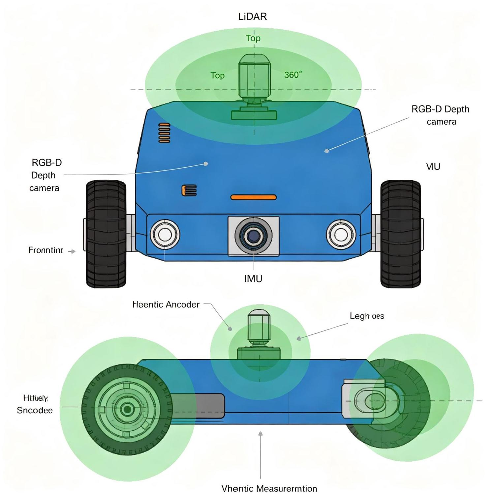
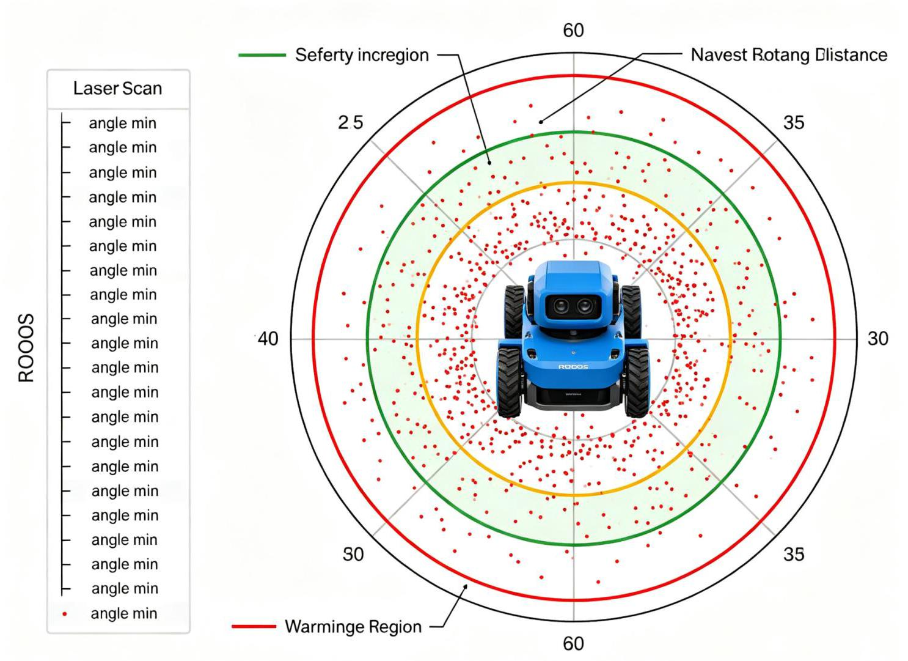
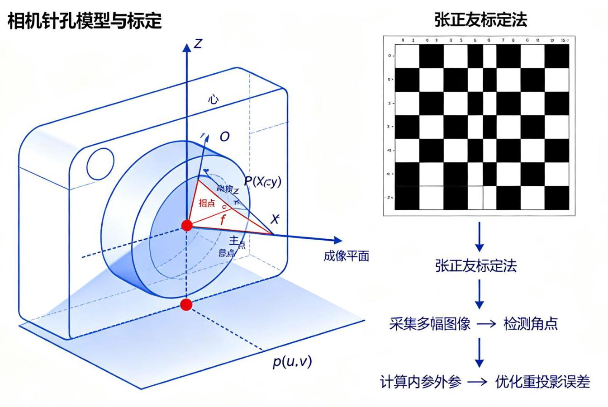

# 第13章 机器人传感器与执行器

图13-1 移动机器人传感器布局

## 13.1 机器人传感器概述

### 13.1.1 传感器的分类

根据《ROS机器人编程》第8章，机器人传感器可以分为以下几类:

- 内部传感器 (Internal Sensors) : 测量机器人自身状态

- 编码器(Encoder):测量关节位置和速度

- IMU(惯性测量单元):测量加速度和角速度

- 电流/电压传感器:测量电机电流和电池电压

- 力矩传感器:测量关节力矩

- 外部传感器 (External Sensors) : 测量外部环境

○ 激光雷达(LiDAR):测量距离和环境轮廓

○ 相机(Camera):获取图像信息

- 深度相机(Depth Camera):获取深度信息

- 超声波传感器:测量近距离距离

- 红外传感器:测量距离或检测障碍物

○ 接触传感器/触觉传感器:检测接触和力

- GPS:全球定位(室外)

### 13.1.2 ROS中的传感器功能包

ROS2为各种传感器提供了驱动功能包:

- 激光雷达:rplidar_ros、hls_lfcd_lds_driver、velodyne

- 相机:usb_cam、cv_camera、realsense-ros、azure_kinect_ros_driver

- IMU: imu_tools、razor_imu_ros、xsens_driver

- 编码器:通过嵌入式板(Arduino、OpenCR)读取并发布

## 13.2 激光雷达(LiDAR)

图13-2 激光雷达扫描数据可视化

### 13.2.1 激光雷达原理

激光雷达(Light Detection and Ranging, LiDAR)通过发射激光束并测量反射时间(飞行时间法， ToF)或相位差(三角测量法)来计算距离。

- 二维激光雷达:旋转扫描平面，输出LaserScan消息，常用于2D SLAM和导航

- 三维激光雷达:多线激光(如16线、32线、64线)，输出PointCloud2消息，用于3D SLAM和环境感知

### 13.2.2 常用激光雷达

<table id="cross-table-5"><tr><td>型号</td><td>类型</td><td>范围</td><td>角度</td><td>频率</td><td>价格</td></tr><tr><td>RPLIDAR A1</td><td>2D</td><td>12m</td><td>360°</td><td>5.5Hz</td><td>低</td></tr><tr><td>RPLIDAR A2</td><td>2D</td><td>18m</td><td>360°</td><td>10Hz</td><td>低</td></tr><tr><td>RPLIDAR S1</td><td>2D</td><td>40m</td><td>360°</td><td>10Hz</td><td>中</td></tr><tr><td>Hokuyo UST- 10LX</td><td>2D</td><td>10m</td><td>270°</td><td>40Hz</td><td>中高</td></tr><tr><td>Hokuyo UTM-30LX</td><td>2D</td><td>30m</td><td>270°</td><td>40Hz</td><td>高</td></tr><tr><td>Velodyne VLP-16</td><td>3D</td><td>100m</td><td>360°</td><td>10Hz</td><td>很高</td></tr><tr><td>Ouster OS1- 64</td><td>3D</td><td>120m</td><td>360°</td><td>10/20Hz</td><td>很高</td></tr><tr><td>RoboSense RS-LiDAR- 16</td><td>3D</td><td>150m</td><td>360°</td><td>10Hz</td><td>高</td></tr></table>

TurtleBot3使用的是HLDS-LDS(Hitachi-LG Data Storage Laser Distance Sensor)，这是一款低成本的2D激光雷达，范围360°，距离0.12m~3.5m。

### 13.2.3 LaserScan消息结构

---

<table><tr><td></td><td>1 std_msgs/Header header   n)</td><td>#时间戳和坐标系 (frame_id通常为laser_link或base_sca</td></tr><tr><td></td><td>float32 angle_min</td><td>#起始角度 (rad, 通常为-π)</td></tr><tr><td></td><td>float32 angle_max</td><td>#结束角度 (rad, 通常为π)</td></tr><tr><td></td><td>4 float32 angle_increment</td><td>#角度增量 (rad, 相邻两束激光的角度差)</td></tr><tr><td></td><td>float32 time_increment</td><td>#测量时间增量 (s, 相邻两束激光的时间差)</td></tr><tr><td></td><td>float32 scan_time</td><td>#扫描时间(s，一整圈扫描的时间)</td></tr><tr><td></td><td>float32 range_min</td><td>#最小测量距离(m)</td></tr><tr><td></td><td>float32 range_max</td><td>#最大测量距离(m)</td></tr><tr><td>9</td><td>float32[] ranges</td><td>#距离数据数组 (长度 = (angle_max-angle_min)/angle</td></tr><tr><td></td><td>_increment + 1)</td><td></td></tr><tr><td>10</td><td>float32[] intensities</td><td>#反射强度数组(可选，部分雷达支持)</td></tr></table>

---

注意:ranges数组中，超出范围的测量值通常设为range_max或inf，无效值设为NaN。

### 13.2.4 激光雷达驱动安装与运行

以RPLIDAR为例:

---

#安装驱动

			sudo apt install ros-humble-rplidar-ros

	#运行激光雷达节点

		ros2 launch rplidar_ros rplidar_a2m12_launch.py

#查看激光数据

			ros2 topic echo /scan

		ros2 topic hz /scan

#在RViz中可视化

rviz2 # 添加LaserScan display, 选择/scan话题

---

## 13.3 相机与深度相机

ROS机器人教材

图13-3 相机针孔模型与标定

### 13.3.1 USB摄像头

普通USB摄像头在ROS中通过usb_cam或v4l2驱动发布图像消息:

---

#安装usb_cam

			sudo apt install ros-humble-usb-cam

#运行摄像头节点

	ros2 run usb_cam usb_cam_node_exe --ros-args -p video_device:=/dev/video0

#查看图像

ros2 topic list # 应该有 /image_raw /camera_info 等话题

				rqt_image_view # 图形化查看图像

---

### 13.3.2 深度相机(Depth Camera)

深度相机同时获取彩色图像(RGB)和深度图像(Depth)，主要有三种技术:

1. 结构光 (Structured Light) : 投射红外点阵图案, 通过图案变形计算深度

- 代表:Microsoft Kinect v1、Intel RealSense D400系列、Orbbec Astra

- 优点:精度高，成本低

- 缺点:室外阳光干扰，距离有限

2. 飞行时间(Time of Flight, ToF):测量光飞行时间计算距离

- 代表:Microsoft Kinect v2、Azure Kinect DK、Intel RealSense L515

- 优点:距离较远，抗干扰

- 缺点:成本较高，分辨率较低

3. 双目立体视觉 (Stereo Vision):通过两个相机的视差计算深度

- 代表:ZED相机、Intel RealSense D400(部分型号)

- 优点:距离远，室外可用

- 缺点:纹理缺失区域失效，计算量大

### 13.3.3 Intel RealSense D435i

RealSense D435i是常用的深度相机，集成了结构光深度传感器、RGB相机和IMU:

- 深度范围: ${0.1}\mathrm{m} \sim  {10}\mathrm{m}$

- RGB分辨率:1920×1080

- 深度分辨率:1280×720

- 内置IMU(加速度计+陀螺仪)

---

	#安装RealSense SDK和ROS2驱动

	sudo apt install ros-humble-realsense2-camera

	#运行相机节点

	ros2 launch realsense2_camera rs_launch.py

	#查看话题

ros2 topic list # /camera/color/image_raw, /camera/depth/image_rect_raw, /

	camera/imu等

---

### 13.3.4 点云数据(PointCloud2)

深度相机和3D激光雷达输出点云数据，PointCloud2消息包含每个点的三维坐标和颜色/强度信息:

---

std_msgs/Header header

uint32 height 	#点云高度(有序点云为行数，无序点云为1)

uint32 width 	#点云宽度 (点数)

sensor_msgs/PointField[ 	[] fields # 字段定义 (x, y, z, rgb, intensity等)

bool is_bigendian 	#字节序

uint32 point_step 	#每个点的字节数

uint32 row_step 	#每行的字节数

uint8[] data 	#点云数据

bool is_dense 	#是否包含无效点

---

点云处理常用库:

- PCL(Point Cloud Library):点云处理的标准库，包含滤波、配准、分割、识别等算法

- Open3D: 现代点云处理库，Python接口友好，支持深度学习

## 13.4 IMU惯性测量单元

### 13.4.1 IMU原理

IMU(Inertial Measurement Unit)测量加速度和角速度:

- 加速度计 (Accelerometer) : 测量三轴加速度 (包括重力加速度),单位 $\mathrm{m}/{\mathrm{s}}^{2}$

- 陀螺仪(Gyroscope):测量三轴角速度，单位rad/s

- 磁力计(Magnetometer):测量三轴磁场，用于航向角修正(9轴IMU/IMU+磁力计)

IMU数据通过积分得到姿态(角度)和位置，但积分会累积漂移，需要与其他传感器融合(如激光里程计、视觉里程计)。

### 13.4.2 IMU消息结构

---

			std_msgs/Header header

			geometry_msgs/Quaternion orientation 																																						#姿态四元数(如果IMU自带姿态估

			计)

3 float64[9] orientation_covariance 																																						#姿态协方差矩阵 (行优先)

		geometry_msgs/Vector3 angular_velocity 																																						#角速度 (rad/s)

	5 float64[9] angular_velocity_covariance 																																						#角速度协方差

6 geometry_msgs/Vector3 linear_acceleration 																																						#线性加速度 $\left( {m/{s}^{2}}\right)$

7 float64[9] linear_acceleration_covariance 																																						#加速度协方差

---

注意:ROS中IMU的坐标系遵循REP-103，X轴向前，Y轴向左，Z轴向上。

### 13.4.3 IMU姿态估计算法

- 互补滤波(Complementary Filter):加速度计修正低频漂移，陀螺仪提供高频响应，简单高效

- 卡尔曼滤波(Kalman Filter):最优状态估计，考虑噪声协方差

- Mahony滤波:基于梯度下降的IMU姿态估计，计算量小，适合嵌入式

- Madgwick滤波:基于四元数的梯度下降算法，精度高，应用广泛

ROS2中常用的IMU滤波包: imu_filter_madgwick 、 imu_tools

## 13.5 编码器与电机驱动

### 13.5.1 编码器原理

编码器(Encoder)测量电机旋转角度和速度:

- 增量式编码器(Incremental Encoder):输出A/B相脉冲(相位差90°)，通过计数和相位判断方向和位置，断电丢失位置

- 绝对式编码器(Absolute Encoder):直接输出绝对角度(格雷码或二进制)，断电不丢失位置， 成本高

分辨率用PPR(Pulses Per Revolution，每转脉冲数)表示，如400PPR、1024PPR。通过四倍频(A/B 相的上升沿和下降沿)，实际分辨率为4xPPR。

### 13.5.2 电机控制

电机控制通常采用三级PID闭环:

---

1 位置环(外环) —— 速度环(中环) —— 电流环(内环) —— 电机

	PID 		PID

---

- 电流环(Current/Torque Loop):控制电机电流(=力矩)，响应最快(kHz级)

- 速度环 (Velocity Loop) : 控制电机转速, 通过编码器反馈, 响应中等 (百Hz级)

- 位置环 (Position Loop) : 控制电机位置, 响应最慢 (几十Hz级)

对于移动机器人底盘，通常只需要速度环(接收cmd_vel速度指令)；对于机械臂，需要位置环或力矩环。

### 13.5.3 里程计计算

根据左右轮编码器数据计算机器人里程计 (Odometry):

---

import math

def calculate_odometry(left_ticks, right_ticks, prev_left, prev_right,

						wheel_radius, wheel_separation, ticks_per_rev,

						x, y, theta):

	"""

	根据左右轮编码器增量计算里程计

	返回更新后的x, y, theta

	11111

	#计算轮速增量

	delta_left = 2 * math.pi * wheel_radius * (left_ticks - prev_left) / t

icks_per_rev

	delta_right = 2 * math.pi * wheel_radius * (right_ticks - prev_right)

/ ticks_per_rev

	#差速机器人运动学

	delta_dist = (delta_left + delta_right) / 2.0 # 中心移动距离

	delta_theta = (delta_right - delta_left) / wheel_separation # 航向角变

化

	#更新位姿(假设小角度近似，或用圆弧模型)

	if abs(delta_theta) > 1e-6:

		#圆弧模型

		radius = delta_dist / delta_theta

		cx = x - radius * math.sin(theta)

		cy = y + radius * math.cos(theta)

		x = cx + radius * math.sin(theta + delta_theta)

		y = cy - radius * math.cos(theta + delta_theta)

	else:

		#小角度近似 (直线模型)

		x += delta_dist * math.cos(theta + delta_theta / 2)

		y += delta_dist * math.sin(theta + delta_theta / 2)

	theta += delta_theta

	#角度归一化到[-π, π]

	theta = math.atan2(math.sin(theta), math.cos(theta))

	return x, y, theta

---

### 13.5.4 Dynamixel舵机

Dynamixel是ROBOTIS公司生产的智能舵机，广泛用于TurtleBot3、OpenManipulator等机器人:

- 内置位置、速度、力矩控制

- 支持菊花链连接(一条总线连接多个舵机)

- 可读取位置、速度、电流、温度等状态

- 通过Dynamixel SDK或dynamixel_workbench控制

TurtleBot3 Burger使用两个Dynamixel XL430-W250-T舵机作为驱动轮。

## 13.6 嵌入式系统与OpenCR

### 13.6.1 嵌入式系统在机器人中的作用

嵌入式系统(如Arduino、OpenCR、STM32)负责:

- 读取编码器数据

- 电机PID控制

- 读取IMU、超声波等低速传感器

- 电池电压监测

- 与上位机(运行ROS的计算机)通信(通过串口或USB)

### 13.6.2 OpenCR控制板

OpenCR (Open-source Control module for ROS) 是ROBOTIS开发的嵌入式控制板，专为ROS机器人设计:

- 处理器:ARM Cortex-M7 (STM32F746)

- 接口:USB、UART、SPI、I2C、GPIO

- 支持Dynamixel舵机直接驱动

- 支持Arduino IDE编程

- 内置IMU (MPU9250, 9轴)

- 支持ROS (通过rosserial或USB串口)

OpenCR用于TurtleBot3的底层控制:读取编码器、控制电机、发布IMU数据、接收速度指令。

### 13.6.3 rosserial

rosserial是ROS与嵌入式设备通信的协议，允许Arduino等微控制器作为ROS节点:

- 嵌入式端运行rosserial客户端

- 上位机运行rosserial_server节点

- 通过串口(UART/USB)通信

- 支持发布/订阅话题、调用服务

---

	#上位机运行rosserial server

2 ros2 run serial_motor_demo driver --ros-args -p serial_port:=/dev/ttyACM0 -

	p baud_rate:=115200

---

**推荐视频**

ROS2传感器集成与数据融合实战

涵盖激光雷达、RGB-D相机、IMU的驱动配置、数据可视化、消息结构详解，以及EKF多传感器融合的参数调优和实战演示。

[B站观看](https://www.bilibili.com/video/BV1tjME6XEeL/)

**推荐GitHub项目**

Mastering-ROS-for-Robotics-Programming-Third-edition

《精通ROS机器人编程(第3版)》配套代码，包含传感器接口(激光雷达、相机、IMU)、执行器控制(Dynamixel)、多传感器融合、机械臂规划等高级主题的完整代码。

[GitHub仓库](https://github.com/PacktPublishing/Mastering-ROS-for-Robotics-Programming-Third-edition)
