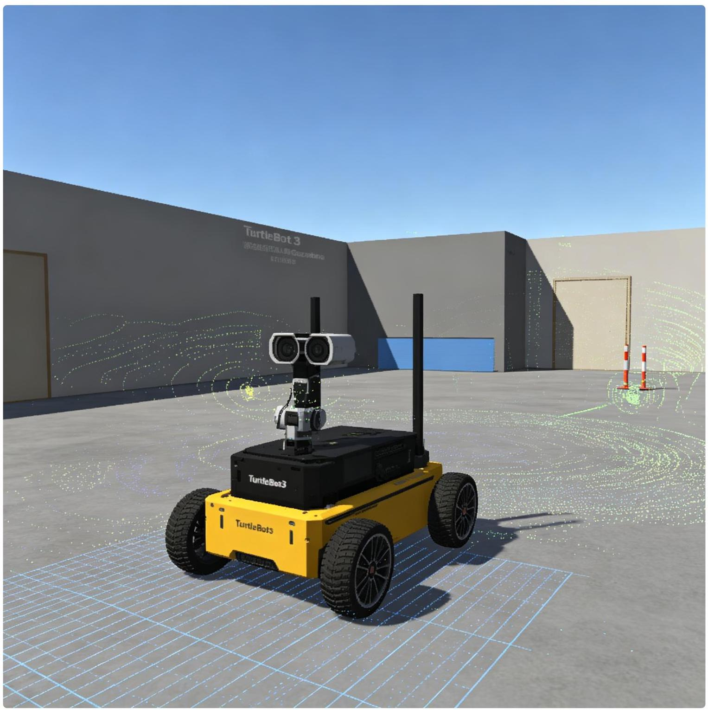
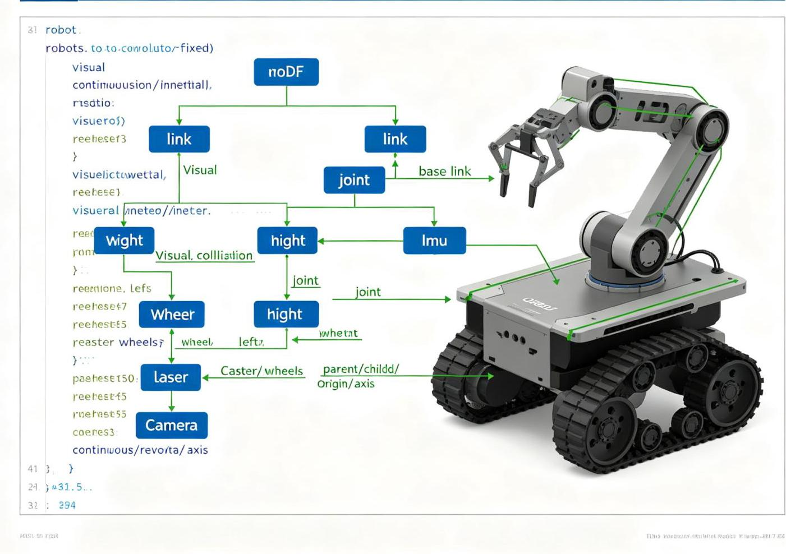
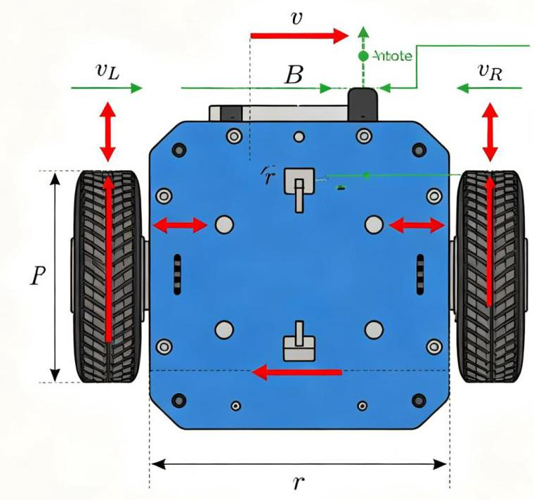

# 第14章 移动机器人与仿真
<!-- 这是一张图片，ocr 内容为： -->


_图14-1 TurtleBot3在Gazebo仿真环境中_


## 14.1 ROS支持的移动机器人
ROS2支持多种移动机器人平台：

+ **TurtleBot3**：ROBOTIS出品的低成本教育机器人，有Burger、Waffle、Waffle Pi三种型号
+ **TurtleBot4**：Clearpath出品的新一代TurtleBot
+ **Husky**：Clearpath出品的户外轮式机器人
+ **Jackal**：Clearpath出品的小型快速移动机器人
+ **AGV/AMR**：工业自动导引车/自主移动机器人
+ **差速机器人**：两轮差速驱动（最常见）
+ **全向机器人**：全向轮/麦克纳姆轮，可横向移动
+ **阿克曼转向**：类似汽车的转向方式（如自动驾驶小车）

## 14.2 TurtleBot3系列机器人
### 14.2.1 TurtleBot3概述
TurtleBot3是ROBOTIS出品的开源移动机器人平台，是ROS社区最流行的教育机器人之一。根据《ROS机器人编程》第10-12章，TurtleBot3有三种型号：

| 型号 | 驱动板 | 激光雷达 | 计算板 | 尺寸 | 重量 |
| --- | --- | --- | --- | --- | --- |
| Burger | OpenCR 1.0 | LDS-01 | Raspberry Pi 3/4 | 138×178×192mm | 1.4kg |
| Waffle | OpenCR 1.0 | LDS-01 | Intel Joule | 209×234×271mm | 2.5kg |
| Waffle Pi | OpenCR 1.0 | LDS-01 | Raspberry Pi 3/4 | 209×234×271mm | 2.5kg |


Burger型号最常用，价格最低，适合入门学习。

### 14.2.2 TurtleBot3硬件组成
TurtleBot3 Burger的主要硬件：

+ **底盘**：两轮差速驱动，两个万向轮辅助平衡
+ **驱动电机**：两个Dynamixel XL430-W250-T舵机
+ **控制板**：OpenCR 1.0（ARM Cortex-M7，内置IMU）
+ **激光雷达**：HLDS-LDS（360°，距离0.12~3.5m）
+ **计算板**：Raspberry Pi 3/4（运行ROS2）
+ **电池**：11.1V 1800mAh锂电池
+ **结构件**：3D打印或铝板

### 14.2.3 TurtleBot3软件架构
TurtleBot3的软件分层：

```plain
上层（Raspberry Pi）：ROS2节点
  ├─ 激光雷达驱动（hls_lfcd_lds_driver）
  ├─ 导航栈（Nav2：SLAM、定位、路径规划）
  ├─ 相机驱动（可选，USB摄像头）
  └─ 应用节点（巡逻、避障等）
       │
       │ 串口通信（USB，/dev/ttyACM0）
       ▼
底层（OpenCR）：嵌入式固件
  ├─ 电机控制（Dynamixel舵机，速度PID）
  ├─ 编码器读取
  ├─ IMU数据读取（MPU9250）
  ├─ 电池电压监测
  └─ 里程计计算与发布
```

### 14.2.4 TurtleBot3话题列表
TurtleBot3运行时的主要话题：

| 话题 | 类型 | 方向 | 说明 |
| --- | --- | --- | --- |
| /scan | sensor_msgs/LaserScan | 传感器→系统 | 激光雷达数据 |
| /odom | nav_msgs/Odometry | 底盘→系统 | 轮式里程计 |
| /imu | sensor_msgs/Imu | 底盘→系统 | IMU数据 |
| /cmd_vel | geometry_msgs/Twist | 系统→底盘 | 速度命令（线速度+角速度） |
| /tf | tf2_msgs/TFMessage | 全系统 | 坐标变换（odom→base_link） |
| /tf_static | tf2_msgs/TFMessage | 全系统 | 静态坐标变换（base_link→laser_link等） |
| /battery_state | sensor_msgs/BatteryState | 底盘→系统 | 电池状态 |
| /wheel_joint_states | sensor_msgs/JointState | 底盘→系统 | 轮子关节状态 |


### 14.2.5 遥控TurtleBot3
```bash
# 键盘遥控
ros2 run turtlebot3_teleop teleop_keyboard

# 控制说明：
#   w/x：增加/减直线速度
#   a/d：增加/减小角速度
#   s：停止
#   方向键：直接控制移动

# 查看速度命令
ros2 topic echo /cmd_vel
```

## 14.3 机器人建模（URDF）
<!-- 这是一张图片，ocr 内容为： -->


_图14-3 URDF机器人模型结构_

### 14.3.1 URDF简介
URDF（Unified Robot Description Format）是ROS中描述机器人模型的XML格式，包含：

+ 连杆（link）：几何形状、视觉、碰撞、惯性参数
+ 关节（joint）：连接连杆，定义运动类型和限制

URDF是RViz可视化和Gazebo仿真的基础。

### 14.3.2 TurtleBot3 URDF示例
TurtleBot3 Burger的简化URDF模型：

```xml
<?xml version="1.0"?>
<robot name="turtlebot3_burger" xmlns:xacro="http://www.ros.org/wiki/xacro">
  <!-- 底盘 -->
  <link name="base_link">
    <visual>
      <geometry><cylinder length="0.01" radius="0.105"/></geometry>

      <material name="yellow"><color rgba="1 0.9 0 1"/></material>

    </visual>

    <collision>
      <geometry><cylinder length="0.01" radius="0.105"/></geometry>

    </collision>

    <inertial>
      <mass value="1.0"/>
      <origin xyz="0 0 0" rpy="0 0 0"/>
      <inertia ixx="0.001" ixy="0" ixz="0" iyy="0.001" iyz="0" izz="0.001"/>
    </inertial>

  </link>

  <!-- 左轮 -->
  <link name="wheel_left_link">
    <visual>
      <geometry><cylinder length="0.018" radius="0.033"/></geometry>

      <material name="black"><color rgba="0 0 0 1"/></material>

    </visual>

    <collision>
      <geometry><cylinder length="0.018" radius="0.033"/></geometry>

    </collision>

  </link>

  <joint name="wheel_left_joint" type="continuous">
    <parent link="base_link"/>
    <child link="wheel_left_link"/>
    <origin xyz="0 0.08 0" rpy="${pi/2} 0 0"/>
    <axis xyz="0 0 1"/>
  </joint>

  <!-- 右轮（类似左轮，y=-0.08） -->
  <link name="wheel_right_link">...</link>

  <joint name="wheel_right_joint" type="continuous">
    <origin xyz="0 -0.08 0" rpy="${pi/2} 0 0"/>
    ...
  </joint>

  <!-- 激光雷达 -->
  <link name="laser_link">
    <visual>
      <geometry><cylinder length="0.04" radius="0.04"/></geometry>

      <material name="white"><color rgba="1 1 1 1"/></material>

    </visual>

  </link>

  <joint name="laser_joint" type="fixed">
    <parent link="base_link"/>
    <child link="laser_link"/>
    <origin xyz="0 0 0.08" rpy="0 0 0"/>
  </joint>

</robot>

```

### 14.3.3 Xacro宏语言
Xacro（XML Macros）是URDF的宏语言，支持变量、宏定义、条件判断、数学运算，减少重复代码：

```xml
<!-- 定义宏 -->
<xacro:macro name="wheel" params="prefix y">
  <link name="${prefix}_wheel_link">
    <visual><geometry><cylinder length="0.018" radius="0.033"/></geometry></visual>

  </link>

  <joint name="${prefix}_wheel_joint" type="continuous">
    <parent link="base_link"/>
    <child link="${prefix}_wheel_link"/>
    <origin xyz="0 ${y} 0" rpy="${pi/2} 0 0"/>
    <axis xyz="0 0 1"/>
  </joint>

</xacro:macro>

<!-- 调用宏 -->
<xacro:wheel prefix="left" y="0.08"/>
<xacro:wheel prefix="right" y="-0.08"/>
```

编译xacro为urdf：

```bash
xacro robot.urdf.xacro > robot.urdf
# 或在launch文件中用xacro包直接处理
```

## 14.4 RViz仿真
### 14.4.1 在RViz中显示机器人模型
```bash
# 发布机器人状态（将URDF发布到robot_description参数，并发布关节状态和TF）
ros2 launch turtlebot3_description display.launch.py

# 或手动启动：
# 1. 启动robot_state_publisher
ros2 run robot_state_publisher robot_state_publisher --ros-args -p robot_description:="$(xacro turtlebot3_burger.urdf.xacro)"
# 2. 启动joint_state_publisher_gui（拖动滑块控制关节）
ros2 run joint_state_publisher_gui joint_state_publisher_gui
# 3. 启动RViz
rviz2
```

在RViz中添加：

+ RobotModel display（显示机器人模型）
+ TF display（显示坐标系）
+ LaserScan display（如果有激光数据）

### 14.4.2 里程计与TF
<!-- 这是一张图片，ocr 内容为： -->


_图14-2 差速驱动运动学模型_

TurtleBot3的TF树：

```plain
odom → base_link → wheel_left_link
                → wheel_right_link
                → laser_link
                → imu_link
```

+ `odom`：里程计坐标系（固定，但有漂移）
+ `base_link`：机器人本体坐标系（随机器人运动）
+ 传感器坐标系固定在base_link上

里程计节点（或OpenCR固件）计算轮式里程计，发布`/odom`话题和`odom→base_link`的TF变换。

## 14.5 Gazebo仿真
### 14.5.1 Gazebo简介
Gazebo是一个强大的三维物理仿真环境，支持：

+ 刚体动力学仿真（ODE、Bullet、DART、SimBody物理引擎）
+ 碰撞检测
+ 传感器仿真（激光雷达、相机、深度相机、IMU、GPS等）
+ 多种模型和世界
+ 与ROS2深度集成

Gazebo的新版本称为Gazebo Sim（原Ignition Gazebo），与经典Gazebo（Gazebo Classic）并行发展。

<!-- 这是一张图片，ocr 内容为： -->

_图14-1：Gazebo物理仿真（上）与RViz可视化（下）联仿，显示PR2机器人和人物模型_

### 14.5.2 启动TurtleBot3 Gazebo仿真
```bash
# 安装TurtleBot3仿真包
sudo apt install ros-humble-turtlebot3-gazebo

# 设置机器人型号
export TURTLEBOT3_MODEL=burger

# 启动空世界仿真
ros2 launch turtlebot3_gazebo empty_world.launch.py

# 或启动有障碍物的世界
ros2 launch turtlebot3_gazebo turtlebot3_world.launch.py

# 或启动房屋世界
ros2 launch turtlebot3_gazebo turtlebot3_house.launch.py
```

启动后会同时打开Gazebo（物理仿真）和RViz（可视化），可以用键盘遥控机器人在仿真环境中移动。

### 14.5.3 Gazebo中的传感器仿真
Gazebo通过插件模拟传感器：

+ **激光雷达插件**：libgazebo_ros_ray_sensor.so，发布LaserScan消息
+ **相机插件**：libgazebo_ros_camera.so，发布Image消息
+ **深度相机插件**：libgazebo_ros_depth_camera.so，发布深度图像和点云
+ **IMU插件**：libgazebo_ros_imu_sensor.so，发布Imu消息
+ **差速驱动插件**：libgazebo_ros_diff_drive.so，接收cmd_vel，更新里程计和TF

这些插件在URDF/SDF文件中通过`<gazebo>`标签配置。

### 14.5.4 创建自定义Gazebo世界
Gazebo世界文件（.world，SDF格式）：

```xml
<?xml version="1.0"?>
<sdf version="1.6">
  <world name="my_world">
    <!-- 物理引擎配置 -->
    <physics type="ode">
      <max_step_size>0.001</max_step_size>

      <real_time_factor>1</real_time_factor>

    </physics>

    <!-- 包含地面和太阳 -->
    <include><uri>model://ground_plane</uri></include>

    <include><uri>model://sun</uri></include>

    <!-- 添加墙壁 -->
    <model name="wall1">
      <static>true</static>

      <pose>3 0 0.5 0 0 0</pose>

      <link name="link">
        <collision name="collision">
          <geometry><box><size>0.2 10 1</size></box></geometry>

        </collision>

        <visual name="visual">
          <geometry><box><size>0.2 10 1</size></box></geometry>

          <material><ambient>0.7 0.7 0.7 1</ambient></material>

        </visual>

      </link>

    </model>

    <!-- 添加圆柱体障碍物 -->
    <model name="cylinder1">
      <static>true</static>

      <pose>1 2 0.25 0 0 0</pose>

      <link name="link">
        <collision><geometry><cylinder><radius>0.2</radius><length>0.5</length></cylinder></geometry></collision>

        <visual><geometry><cylinder><radius>0.2</radius><length>0.5</length></cylinder></geometry></visual>

      </link>

    </model>

  </world>

</sdf>

```

### 14.5.5 仿真中的SLAM和导航
Gazebo仿真环境中可以完整运行SLAM和导航：

```bash
# 终端1：启动仿真
ros2 launch turtlebot3_gazebo turtlebot3_world.launch.py

# 终端2：启动SLAM建图
ros2 launch turtlebot3_cartographer cartographer.launch.py use_sim_time:=True

# 终端3：键盘遥控探索环境
ros2 run turtlebot3_teleop teleop_keyboard

# 建图完成后保存地图
ros2 run nav2_map_server map_saver_cli -f my_map

# 启动导航
ros2 launch turtlebot3_navigation2 navigation2.launch.py use_sim_time:=True map:=my_map.yaml
```

### 📺 推荐视频
> **ROS2 URDF建模与Gazebo仿真完整教程**  
从URDF基础语法、Xacro宏使用、传感器插件配置，到Gazebo世界搭建、控制器加载、TurtleBot3仿真的全流程演示，是移动机器人仿真的必备技能。  
🔗 [B站观看](https://www.bilibili.com/video/BV11oVs67Exd/)
>

### 💻 推荐GitHub项目
> **ROS-Theory-Practice：机器人建模与仿真章节代码**  
包含差速机器人、全向机器人、机械臂的URDF模型、Gazebo仿真配置和控制器配置，可直接运行，附详细说明文档。  
🔗 [GitHub仓库](https://github.com/jingxuanyang/ROS-Theory-Practice)
>

---
