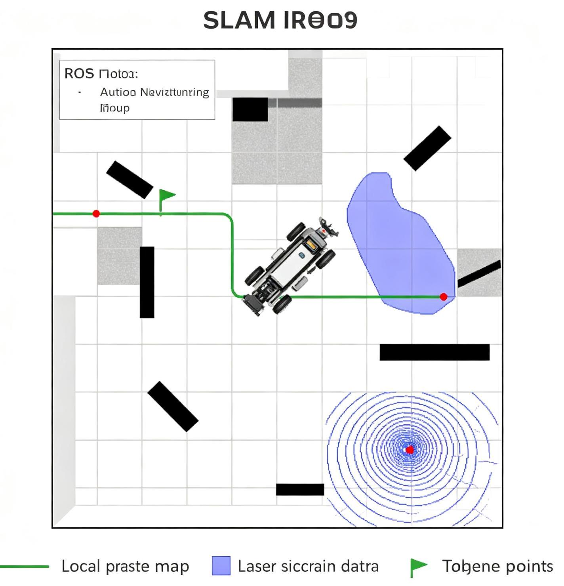
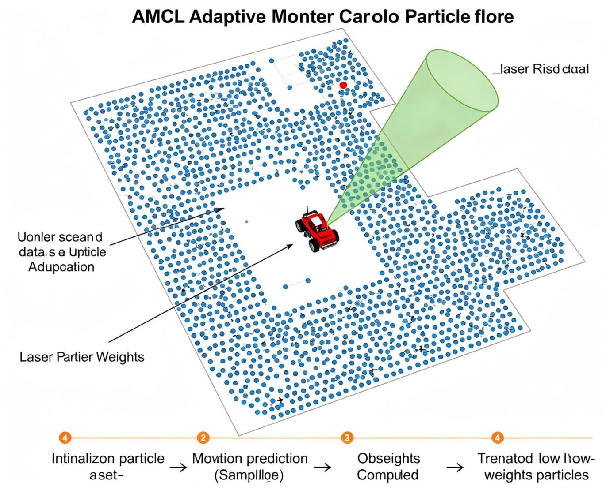
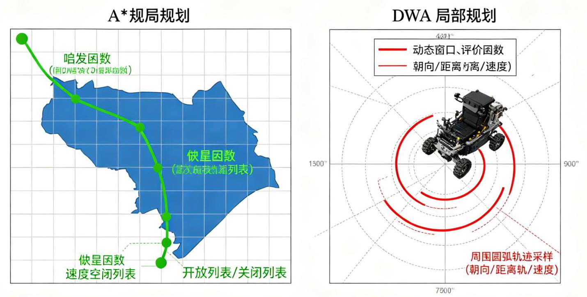

# 第15章 SLAM 与导航

## 15.1 导航概述

### 15.1.1 移动机器人导航的组成

根据《ROS机器人编程》第11章，移动机器人导航(Navigation)需要以下核心功能:

1. 地图(Map):环境的表示，通常是二维栅格地图(Occupancy Grid)

2. 定位(Localization):确定机器人在地图中的位置(AMCL等)

3. 障碍物检测(Obstacle Detection):通过传感器识别墙壁和物体(激光雷达、相机等)

4. 路径规划(Path Planning):计算从当前位置到目标的最优路径(全局规划+局部规划)

5. 运动控制 (Motion Control) : 控制机器人沿路径运动(差速驱动、全向驱动等)

### 15.1.2 导航的层次结构

---

任务层:目标点指定、巡逻任务、行为决策

	v

全局规划层:A* / Dijkstra，在静态地图上规划全局路径

	v

局部规划层:DWA / TEB，考虑动态障碍物和运动学约束，生成速度命令

	v

控制层:电机PID控制，执行速度命令

---

## 15.2 SLAM建图

### 15.2.1 SLAM问题

SLAM(Simultaneous Localization and Mapping，同步定位与建图):机器人在未知环境中，同时建立环境地图并确定自身在地图中的位置。

SLAM是移动机器人导航的基础:先建图，再在已知地图上定位和导航。

SLAM分类:

- 2D SLAM:基于激光雷达，构建二维栅格地图(最常用)

- 3D SLAM: 基于3D激光或视觉，构建三维点云/网格地图

- 视觉SLAM (VSLAM) : 基于相机的SLAM (特征点法、直接法)

- 激光SLAM:基于激光雷达的SLAM(扫描匹配、图优化)

### 15.2.2 常用2D SLAM算法

<table><tr><td>算法</td><td>原理</td><td>特点</td><td>ROS2包</td></tr><tr><td>GMapping</td><td>粒子滤波(Rao-Blackwellized)</td><td>经典算法，适合小环境，计算量较大</td><td>slam_gmapping</td></tr><tr><td>Cartographer</td><td>图优化(Google开源)</td><td>大场景效果好，支持回环检测，计算量中等</td><td>cartographer_ros</td></tr><tr><td>Karto SLAM</td><td>图优化</td><td>计算效率高, 适合中等环境</td><td>slam_karto</td></tr><tr><td>Hector SLAM</td><td>扫描匹配(高斯牛顿)</td><td>无需里程计，高速激光, 适合无人机</td><td>hector_slam</td></tr><tr><td>Slam Toolbox</td><td>图优化+ lifelong mapping</td><td>ROS2推荐，支持地图合并、持续建图</td><td>slam_toolbox</td></tr></table>

TurtleBot3默认使用Cartographer进行SLAM建图。

### 15.2.3 Cartographer建图实战

---

#安装Cartographer

sudo apt install ros-humble-cartographer ros-humble-cartographer-ros

	#TurtleBot3建图 (仿真环境)

				export TURTLEBOT3_MODEL=burger

		ros2 launch turtlebot3_gazebo turtlebot3_world.launch.py

	#另一个终端

ros2 launch turtlebot3_cartographer cartographer.launch.py use_sim_time:=T

		rue

		#另一个终端:键盘遥控探索环境

			ros2 run turtlebot3_teleop teleop_keyboard

#建图完成后保存地图

ros2 run nav2_map_server map_saver_cli -f ~/my_map

#会生成 my_map.pgm (地图图像) 和 my_map.yaml (地图配置)

---

### 15.2.4 栅格地图

SLAM输出的二维栅格地图(Occupancy Grid Map):

- 每个格子(cell)有一个值:0(自由空间)~ 100(完全占用)，-1(未知)

- 分辨率:通常0.05m/格(5cm)

- 格式:PGM图像文件(灰度图，黑色=占用，白色=自由，灰色=未知)+ YAML配置文件 YAML配置文件示例:

---

											image: my_map.pgm

													resolution: 0.050000

origin: [-10.000000, -10.000000, 0.000000]

									negate: 0

										occupied_thresh: 0.65

										free_thresh: 0.196

---

### 15.2.5 SLAM的硬件要求

- 激光雷达:推荐范围≥5m，频率≥5Hz，角度分辨率≤1°

- 里程计:轮式里程计精度影响建图质量(需要校准轮子直径和轮距)

- 计算:SLAM计算量中等，Raspberry Pi 4可以运行Cartographer

- 运动:建图时运动速度不宜过快(建议≤0.2m/s)，避免特征丢失

## 15.3 定位与AMCL

图15-2 AMCL粒子滤波定位

### 15.3.1 定位问题

已知地图，确定机器人在地图中的位置(包括x, y坐标和航向角θ)。

定位方法:

- 里程计定位:通过轮式里程计推算位置，但会累积漂移

- 激光匹配定位:将激光扫描与地图匹配，校正里程计漂移(AMCL)

- 视觉定位:通过视觉特征匹配定位

- GPS定位:室外全球定位(精度低，不适合室内)

### 15.3.2 AMCL算法

AMCL(Adaptive Monte Carlo Localization，自适应蒙特卡洛定位)是ROS中最常用的2D定位算法， 基于粒子滤波:

- 用一组粒子(particle)表示机器人可能的位置，每个粒子有一个权重(表示该位置的可能性)

- 通过激光扫描与地图匹配更新粒子权重

- 重采样(Resampling):高权重粒子被复制，低权重粒子被淘汰，粒子逐渐集中到真实位置附近

- 自适应:粒子数量根据定位不确定性动态调整(不确定时粒子多，确定时粒子少)

AMCL需要初始位姿估计(在RViz中用"2D Pose Estimate"工具指定)，然后通过激光匹配自动校正。

### 15.3.3 AMCL参数配置

---

				amcl:

						ros_parameters:

							use_sim_time: True

							#运动模型噪声参数

							alpha1: 0.2 # 旋转引起的旋转噪声

						alpha2: 0.2 # 平移引起的旋转噪声

				___ alpha3: 0.2 # 来移引起的平移噪声

			___ alpha4: 0.2 # 旋转引起的平移噪声

							alpha5: 0.2 # 平移引起的平移噪声 (全向机器人)

10 # 粒子数量

							min_particles: 500

							max_particles: 2000

							#更新频率

							update_min_d: 0.2 # 平移多少更新一次 (m)

							update_min_a: 0.2 # 旋转多少更新一次 (rad)

							#激光参数

							laser_max_range: 8.0

							laser_min_range: 0.1

							laser_max_beams: 30 # 使用多少束激光 (采样，减少计算量)

							#激光模型

							laser_z_hit: 0.5 # 高斯噪声权重

							laser_z_short: 0.05 # 短距离测量权重

							laser_z_max: 0.05 # 最大距离测量权重

							laser_z_rand: 0.5 # 随机测量权重

							laser_sigma_hit: 0.2 # 高斯噪声标准差

							#恢复行为 ( kidnapped robot问题)

							recovery_alpha_slow: 0.0

							recovery_alpha_fast: 0.0

---

## 15.4 路径规划

RIOS

图15-3 A全局规划与DWA局部规划*

### 15.4.1 全局路径规划

全局路径规划(Global Planner):在已知静态地图上，从起点到终点规划一条无碰撞路径。

常用算法:

- A*(A-Star):启发式搜索，最常用，用启发函数(如欧氏距离)引导搜索方向，效率高

- Dijkstra: A*的特例(启发函数=0)，保证最优但搜索范围大

- RRT(Rapidly-exploring Random Tree):快速随机树，适合高维空间和复杂约束，不保证最优

- D* Lite: 动态环境增量规划，环境变化时增量更新路径

- Thetastar: A*的改进，允许任意角度路径(不是网格对齐)，路径更短更平滑

ROS2 Nav2默认使用NavFn(A的一种实现)或Smac Planner(支持A、Hybrid A*、State Lattice)。

### 15.4.2 局部路径规划

局部路径规划(Local Planner):在全局路径基础上，考虑动态障碍物和机器人运动学约束，生成实时速度命令。

常用算法:

- DWA(Dynamic Window Approach):动态窗口法，在速度空间搜索最优速度，计算简单，最常用

- TEB(Timed Elastic Band):时间弹性带，将轨迹视为弹性带，优化轨迹的时间和形状，轨迹更平滑

- MPPI(Model Predictive Path Integral):模型预测路径积分，基于采样的MPC，适合复杂动力学

- Pure Pursuit: 纯追踪算法, 简单的路径跟踪算法, 适合阿克曼转向

ROS2 Nav2默认使用DWB(DWA的改进版，DWBLocalPlanner)或TEB。

### 15.4.3 DWA算法原理

DWA在速度空间 $\left( {v,\omega }\right)$ 中搜索最优速度:

1. 生成动态窗口:根据当前速度和加速度限制，计算下一时刻可达的速度范围(动态窗口)

2. 模拟前向轨迹:对动态窗口内的每个速度，模拟前向运动一段时间，生成轨迹

3. 评价轨迹:对每条轨迹计算评价分数:

---

1 score $= \alpha  \times$ heading $\left( \theta \right)  + \beta  \times$ dist(obstacle) $+ \gamma  \times$ velocity

---

- heading: 末端朝向与目标方向的偏差 (朝向目标)

- dist: 轨迹与最近障碍物的距离(避障)

- velocity:前进速度(鼓励快速到达)

4. 选择最优速度:选择分数最高的速度，发送给底盘

DWA的参数(a, $\beta$ , $\gamma$ , 速度限制、加速度限制、模拟时间等)需要根据机器人和环境调优。

## 15.5 Navigation2导航栈

### 15.5.1 Nav2架构

Navigation2(Nav2)是ROS2的官方导航框架，是ROS1 Navigation Stack的重写版本，基于行为树 (Behavior Tree) 编排导航流程。

Nav2的主要组件:

- BT Navigator: 行为树导航器，协调导航流程(规划、控制、恢复)

- Planner Server:全局路径规划器(计算从起点到终点的路径)

- Controller Server: 局部控制器 (跟踪路径, 生成速度命令)

- Recovery Server: 恢复行为(旋转、清障、等待等，处理异常情况)

- Waypoint Follower: 航点跟随 (依次导航到多个航点)

- Lifecycle Manager:节点生命周期管理(管理各节点的启动、激活、停用)

- AMCL:定位(通过lifecycle节点管理)

- Map Server: 地图服务器(加载和提供栅格地图)

- Costmap 2D: 代价地图(全局代价地图+局部代价地图，融合静态地图和传感器数据)

图片加载失败

图15-1:RViz中显示的SLAM导航代价地图，灰色为未知，黑色为障碍物，蓝色为膨胀层，红色/绿色为机器人和路径

### 15.5.2 代价地图(Costmap)

代价地图是导航的核心数据结构, 将静态地图和传感器数据融合为带代价的栅格地图:

- 全局代价地图 (Global Costmap) : 用于全局规划, 基于静态地图, 更新频率低

- 局部代价地图(Local Costmap):用于局部规划，基于传感器实时数据，更新频率高，范围小 (以机器人为中心)

代价地图的图层 (Layers) :

- Static Layer:静态地图层(SLAM构建的地图)

- Obstacle Layer:障碍物层(传感器检测到的障碍物，激光雷达/深度相机)

- Inflation Layer:膨胀层(在障碍物周围膨胀，保证机器人不碰撞，膨胀半径=机器人半径+安全距离)

- Voxel Layer:体素层(3D障碍物，可选)

代价地图的代价值:

- 0: 自由空间 (可通行)

- 1~252:有代价(越接近障碍物代价越高，膨胀层)

- 253:内切障碍(机器人内切圆内，必然碰撞)

- 254:致命障碍(实际障碍物，必然碰撞)

- 255:未知空间

图15-2:代价地图膨胀层示意图，距离机器人中心越近代价越高，致命障碍=254，内切障碍=253，膨胀层=128~252，自由空间=0

### 15.5.3 启动Nav2导航

---

		#安装Nav2

		sudo apt install ros-humble-navigation2 ros-humble-nav2-bringup

		#TurtleBot3导航 (仿真)

		export TURTLEBOT3_MODEL=burger

		#终端1:启动仿真

		ros2 launch turtlebot3_gazebo turtlebot3_world.launch.py

》 # 终端2:启动导航 (加载地图)

		ros2 launch turtlebot3_navigation2 navigation2.launch.py use_sim_time:=Tru

		e map:=/path/to/map.yaml

		#在RViz中:

		#1. 用"2D Pose Estimate"工具指定初始位姿(点击并拖动指定位置和朝向)

	#2. 用"Nav2 Goal"工具指定目标点(点击并拖动指定目标位置和朝向)

		#3. 机器人自动规划路径并导航到目标

---

### 15.5.4 Nav2参数配置

Nav2的参数通过YAML文件配置(nav2_params.yaml)，主要参数:

---

#全局代价地图

global_costmap:

	global_costmap:

		ros_parameters:

			update_frequency: 1.0

			publish_frequency: 1.0

			global_frame: map

			robot_base_frame: base_link

			use_sim_time: True

			robot_radius: 0.105 # 机器人半径

			resolution: 0.05

			plugins: ["static_layer", "obstacle_layer", "inflation_layer"]

#局部代价地图

local_costmap:

	local_costmap:

		ros_parameters:

			update_frequency: 5.0

			publish_frequency: 2.0

			global_frame: odom

			robot_base_frame: base_link

			use_sim_time: True

			robot_radius: 0.105

			resolution: 0.05

			rolling_window: true # 滚动窗口 (以机器人为中心)

			width: 3

			height: 3

			plugins: ["obstacle_layer", "inflation_layer"]

#控制器(DWA)

controller_server:

	ros_parameters:

		controller_frequency: 10.0

		FollowPath:

			plugin: "dwb_core::DWBLocalPlanner"

			debug_trajectory_details: True

			min_vel_x: 0.0

			max_vel_x: 0.22

			max_vel_y: 0.0

			max_vel_theta: 1.0

			min_speed_xy: 0.0

			max_speed_txe to.2

			min_speed_theta: 0.0

			acc_lim_x: 2.5

			acc_lim_y: 0.0

			acc_lim_theta: 3.2

			#评价函数权重

	xy_goal_tolerance: 0.25

	yaw_goal_tolerance: 0.25

	critics: ["RotateToGoal", "Oscillation", "BaseObstacle", "GoalAlign"

, "PathAlign", "PathDist", "GoalDist"]

	BaseObstacle.scale: 0.02

	PathAlign.scale: 32.0

	GoalAlign.scale: 24.0

	PathDist.scale: 32.0

	GoalDist.scale: 24.0

	RotateToGoal.scale: 32.0

---

### 15.5.5 Nav2的恢复行为

当导航遇到问题时(如被障碍物包围、路径不可达)，Nav2会触发恢复行为:

- Spin:原地旋转(清除代价地图中的动态障碍物，重新定位)

- Back Up:后退(离开障碍物)

- Wait: 等待 (等待动态障碍物离开)

- Clear Costmap:清除代价地图(清除所有传感器障碍物，重新检测)

恢复行为通过行为树编排，按顺序尝试，直到导航恢复正常。

## 15.6 机械臂与MoveIt2

### 15.6.1 MoveIt2概述

MoveIt2是ROS2中最流行的机械臂运动规划框架，是MoveIt(ROS1)的ROS2版本。MoveIt2提供:

- 运动学求解:正/逆运动学(KDL、IKFast、TRAC-IK等插件)

- 运动规划:避障路径规划(OMPL、CHOMP、STOMP等规划库)

- 碰撞检测:机器人自碰撞、与环境碰撞检测(FCL库)

- 轨迹生成与后处理:时间参数化、速度/加速度限制、轨迹平滑

- 抓取与操作:抓取规划、放置规划

- 可视化与交互:RViz插件(MoveIt2 Setup Assistant、MotionPlanning display)

- 基准测试:规划算法性能评估

OpenManipulator是ROBOTIS出品的开源机械臂，与TurtleBot3配合使用，基于Dynamixel舵机，支持 Movelt2.

### 15.6.2 MoveIt2架构

MoveIt2的核心组件:

- MoveGroup: 核心节点，整合运动学、规划、碰撞检测，提供动作和服务接口

- Planning Scene: 规划场景 (机器人状态、环境障碍物、碰撞矩阵)

- Robot Model: 机器人模型 (URDF/SRDF, 运动学、关节限位)

- Motion Planners:运动规划器插件(OMPL默认)

- Kinematics Solvers: 运动学求解器插件 (KDL默认)

- Collision Detection: 碰撞检测 (FCL库)

- Trajectory Processing: 轨迹后处理 (时间参数化、平滑)

### 15.6.3 MoveIt2配置

使用MoveIt2 Setup Assistant配置机械臂:

---

1 ros2 run moveit_setup_assistant moveit_setup_assistant

---

配置步骤:

1. 加载URDF模型

2. 生成自碰撞矩阵 (Self-Collision Matrix)

3. 定义规划组 (Planning Groups, 如"arm"、"gripper")

4. 定义机器人位姿 (Robot Poses, 如"home"、"ready")

5. 配置末端执行器 (End Effectors)

6. 配置被动关节 (Passive Joints)

7. 配置控制器 (Controllers, ros2_control)

8. 生成配置文件

### 15.6.4 MoveIt2编程接口(Python)

---

	import rclpy

	from rclpy.node import Node

	from moveit.planning import MoveItPy

	from geometry_msgs.msg import PoseStamped

	class MoveIt2Demo(Node):

				def _init_(self):

						super()._init_('moveit2_demo')

						#初始化MoveItPy

						self.moveit = MoveItPy(node_name="moveit2_demo")

						self.arm = self.moveit.get_planning_component("arm")

				def go_to_pose(self, x, y, z, w=1.0):

						"""移动到指定位姿"""

						#设置起始状态为当前状态

						self.arm.set_start_state_to_current_state()

						#设置目标位姿

						pose = PoseStamped()

						pose.header.frame_id = "base_link"

						pose.pose.position.x = x

						pose.pose.position.y = y

						pose.pose.position.z = z

						pose.pose.orientation.w = w

						self.arm.set_goal_state(pose_stamped_msg=pose, pose_link="end_effe

	ctor_link")

						#规划并执行

						result = self.arm.plan()

						if result:

									self.arm.execute()

									self.get_logger().info("运动完成")

							else:

									self.get_logger().error("规划失败")

				def go_to_named_state(self, name):

						"""移动到预定义位姿(如"home")"""

							self.arm.set_start_state_to_current_state()

						self.arm.set_goal_state(configuration_name=name)

						result = self.arm.plan()

						if result:

									self.arm.execute()

- def main(args=None):

				rclpy.init(args=args)

				demo = MoveIt2Demo()

	demo.go_to_pose(0.3, 0.0, 0.3)

	rclpy.shutdown()

if ___name___ == '_main__':

	main()

---

### 15.6.5 MoveIt2笛卡尔路径规划

---

def plan_cartesian_path(self, waypoints):

	"""笛卡尔路径规划(末端沿直线/指定路径运动)"""

	(plan, fraction) = self.arm.compute_cartesian_path(   )

		waypoints, # 路径点列表 (PoseStamped)

		0.01, # 步长 (eef_step, m)

		0.0 # 跳跃阈值 (jump_threshold, 防止关节突变)

	)

	#fraction = 路径完成比例 (1.0=完全完成)

	if fraction == 1.0:

		self.arm.execute(plan)

	else:

		self.get_logger().warn(f"路径只完成了{fraction*100:.1f}%")

---

### 15.6.6 OpenManipulator机械臂

OpenManipulator是ROBOTIS出品的开源4自由度机械臂:

- 4个Dynamixel XL430-W250-T舵机

- 末端可装夹爪(2个舵机)

- 支持MoveIt2运动规划

- 可安装在TurtleBot3上成为移动操作平台

---

	#安装OpenManipulator包

	sudo apt install ros-humble-open-manipulator-x

	#启动MoveIt2仿真

	ros2 launch open_manipulator_x_moveit_config moveit_planning_execution.laun

	ch.py sim:=True

	#启动真实机械臂

ros2 launch open_manipulator_x_controller open_manipulator_x_controller.lau

	nch.py

---

**推荐视频**

【中英双语】ROS2 Navigation零基础学起:概念对比+TurtleBot3演示+巡逻机器人项目

从SLAM建图(Cartographer)、AMCL定位，到全局/局部规划(A*+DWA)、Nav2配置、代价地图调优，完整演示移动机器人导航全流程。

[B站观看](https://www.bilibili.com/video/BV1zwEn6TEvj/)

别再被Movelt 2劝退! 手把手搞定ROS 2机械臂规划

从MoveIt2安装配置、URDF/SRDF准备、规划器调优(OMPL)，到笛卡尔路径、避障规划、抓取操作、Python/C++接口编程的完整实战。

[B站观看](https://www.bilibili.com/video/BV1FPjk6bEjp/)

**推荐GitHub项目**

Navigation2 — ROS2官方导航框架

ROS2导航栈的官方仓库，包含规划器(NavFn/Smac)、控制器(DWB/TEB)、恢复行为、行为树、代价地图等完整组件，支持差速、全向、阿克曼等多种机器人，附详细文档和教程。

[GitHub仓库](https://github.com/ros-navigation/navigation2)

Movelt 2 — ROS2机械臂运动规划框架

MoveIt2官方仓库，包含运动学(KDL/IKFast/TRAC-IK)、运动规划(OMPL/CHOMP/STOMP)、 碰撞检测(FCL)、轨迹处理、抓取规划等完整功能，支持多种机械臂，附Setup Assistant配置工具和 Python/C++ API。

[GitHub仓库](https://github.com/moveit/moveit2)
