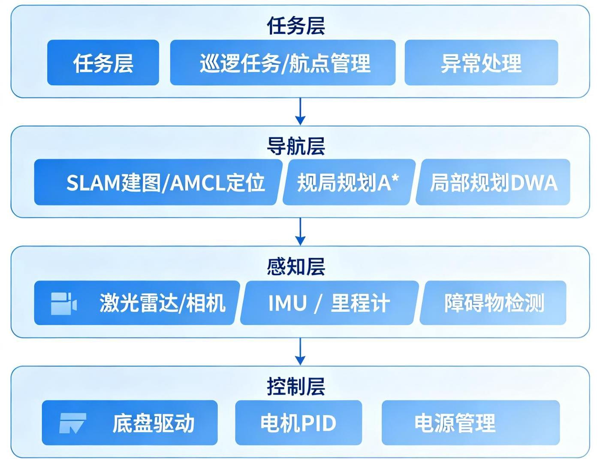
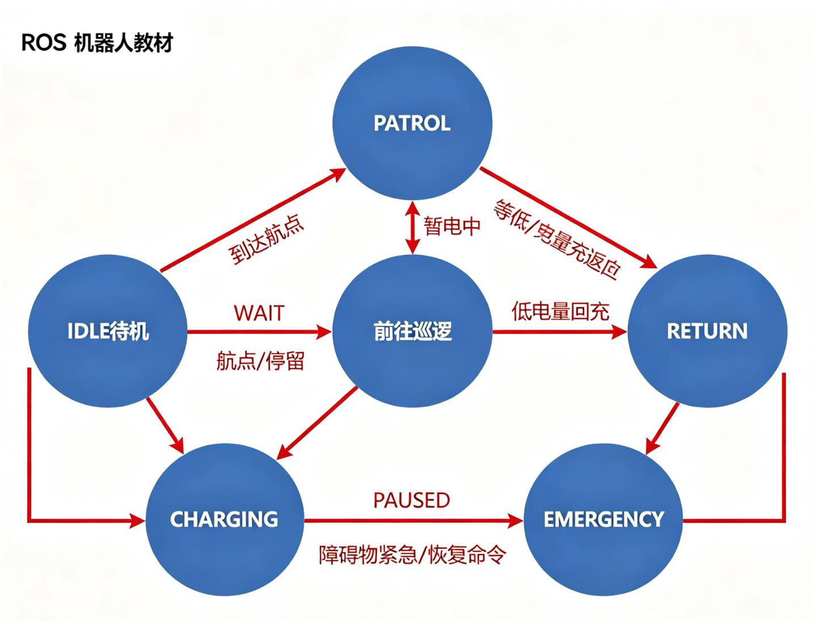
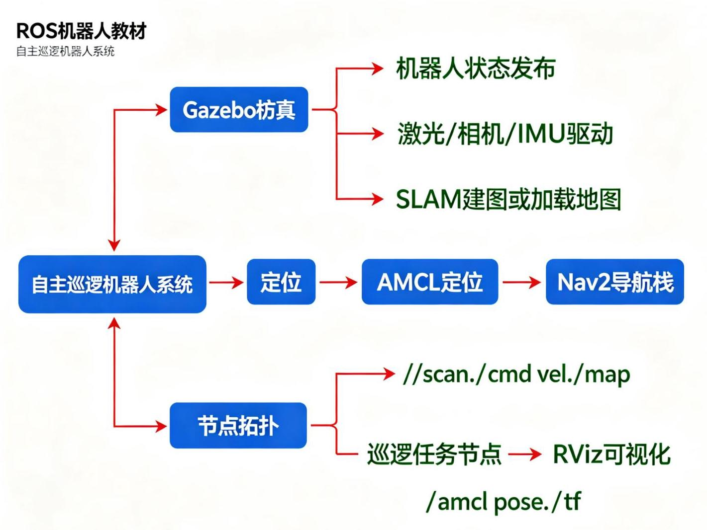
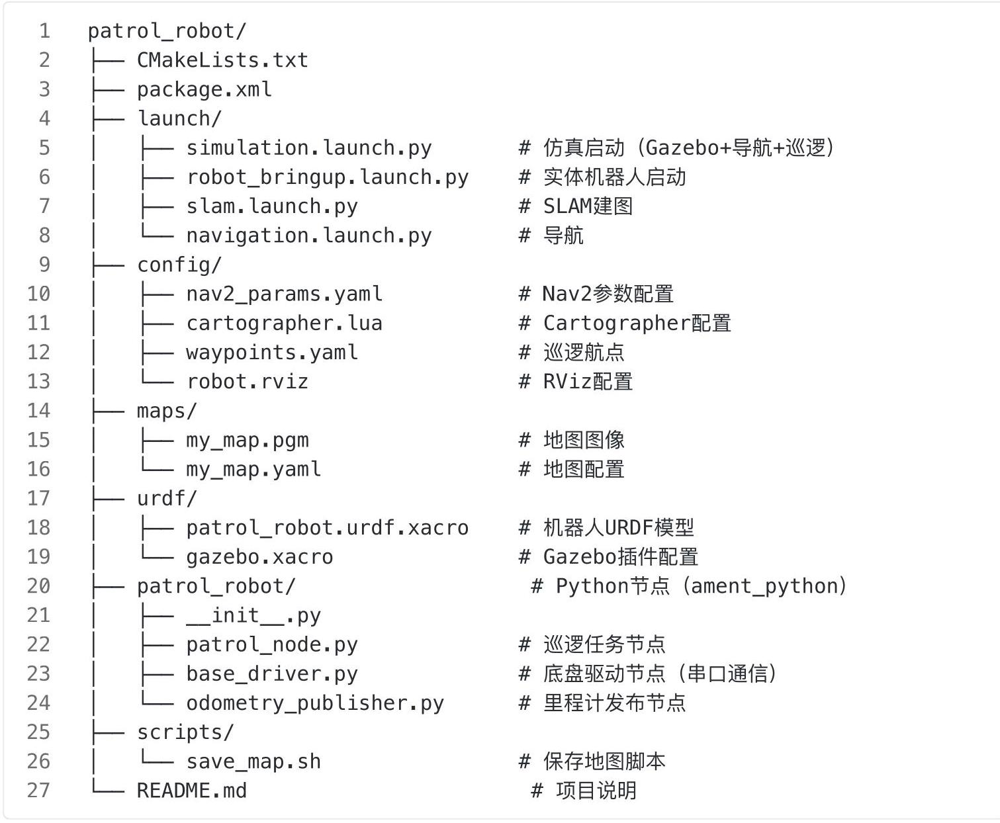

# 第16章 综合项目实战：自主巡逻机器人

ROS机器人

图16-1 自主巡逻机器人系统架构

图16-2 巡逻任务状态机

## 16.1 项目概述

### 16.1.1 项目目标

本项目综合运用前面章节所学的机器人学理论和ROS编程知识，构建一个能够在室内环境自主巡逻的移动机器人。项目目标:

- 自主建图:在未知环境中通过SLAM构建二维栅格地图

- 自主定位:在已知地图中通过AMCL确定机器人位置

- 路径规划与导航:从当前位置自主导航到指定目标点，避障

- 巡逻任务:按预设航点循环巡逻，到达航点后停留观察

- 异常检测:(可选)通过相机检测人员入侵、烟雾等异常

- 远程监控:(可选)通过Web界面或RViz远程监控机器人状态

### 16.1.2 技术栈

- 操作系统:Ubuntu 22.04 LTS + ROS2 Humble Hawksbill

- 硬件平台:差速移动底盘(TurtleBot3 Burger或自制)+ 2D激光雷达 + 可选RGB-D相机 + IMU

- 软件框架:Navigation2(导航栈)+ Cartographer(SLAM)+ OpenCV(视觉，可选)

- 仿真环境:Gazebo Classic 11

- 编程语言:Python 3(主要)+ C++(性能关键部分)

- 开发工具:VS Code + RViz2 + rqt + rosbag2

### 16.1.3 项目参考

本项目参考《ROS机器人编程》第10-12章的TurtleBot3内容，以及《机器人学导论》的运动学和控制理论，将理论与工程实践结合。

## 16.2 系统架构设计

图16-3 系统启动流程与节点拓扑

### 16.2.1 系统模块划分

系统采用分层架构，从下到上分为四层:

任务调度层 (Task Layer)

巡逻任务管理 / 异常处理 / 远程交互 / 航点管理

导航层 (Navigation Layer)

SLAM建图 / AMCL定位 / 全局规划(A*)/ 局部规划(DWA)

感知层 (Perception Layer)

激光雷达 / 相机 / IMU / 轮式里程计 / 目标检测(可选)

控制层 (Control Layer)

电机驱动 / 速度PID控制 / 电源管理 / 传感器读取

### 16.2.2 话题与服务设计

系统中的主要ROS话题和服务:

<table><tr><td>话题/服务</td><td>类型</td><td>方向</td><td>说明</td></tr><tr><td>/scan</td><td>sensor_msgs/LaserS can</td><td>传感器 $\rightarrow$ 系统</td><td>激光雷达扫描数据</td></tr><tr><td>/camera/image_raw</td><td>sensor_msgs/Image</td><td>传感器 $\rightarrow$ 系统</td><td>相机图像(可选)</td></tr><tr><td>/imu/data</td><td>sensor_msgs/Imu</td><td>传感器 $\rightarrow$ 系统</td><td>IMU数据</td></tr><tr><td>/odom</td><td>nav_msgs/Odometry</td><td>底盘 $\rightarrow$ 系统</td><td>轮式里程计</td></tr><tr><td>/cmd_vel</td><td>geometry_msgs/Twis t</td><td>系统 $\rightarrow$ 底盘</td><td>速度命令(线速度+角速度)</td></tr><tr><td>/map</td><td>nav_msgs/Occupanc yGrid</td><td>SLAM $\rightarrow$ 系统</td><td>栅格地图</td></tr><tr><td>/tf</td><td>tf2_msgs/TFMessage</td><td>全系统</td><td>坐标变换 (odom→base_link 等)</td></tr><tr><td>/tf_static</td><td>tf2_msgs/TFMessage</td><td>全系统</td><td>静态坐标变换</td></tr><tr><td>/patrol_waypoints</td><td>自定义</td><td>任务层</td><td>巡逻航点(参数)</td></tr><tr><td>/patrol_state</td><td>std_msgs/String</td><td>任务层→外部</td><td>巡逻状态</td></tr></table>

### 16.2.3 TF树设计

---

map $\rightarrow$ odom $\rightarrow$ base_link $\rightarrow$ laser_link

	$\rightarrow$ camera_link (可选)

	$\rightarrow$ imu_link

	→ wheel_left_link

	$\rightarrow$ wheel_right_link

	$\rightarrow$ caster_front_link

	$\rightarrow$ caster_rear_link

---

- map : 地图坐标系 (固定, 由SLAM/AMCL维护)

- odom : 里程计坐标系 (固定, 但有漂移, 由底盘里程计维护)

- base_link:机器人本体坐标系(随机器人运动)

- 传感器坐标系固定在base_link上(静态TF)

注意:map→odom 的变换由AMCL发布(校正里程计漂移)， odom→base_link 由里程计节点发布，两者不能同时由一个节点发布。

## 16.3 硬件选型与集成

### 16.3.1 硬件清单

<table><tr><td>组件</td><td>型号</td><td>说明</td><td>参考价格</td></tr><tr><td>主控</td><td>Raspberry Pi 4B (4GB) 或 Jetson Nano</td><td>运行ROS2和导航栈</td><td>¥300-800</td></tr><tr><td>底盘</td><td>差速驱动底盘(两轮 +万向轮)</td><td>机械结构，含电机和编码器</td><td>¥200-500</td></tr><tr><td>激光雷达</td><td>RPLIDAR A1/A2 或 HLDS-LDS</td><td>2D激光，360°，范围 5–18m</td><td>¥300-800</td></tr><tr><td>RGB-D相机</td><td>Intel RealSense D435i (可选)</td><td>深度相机+IMU，用于视觉</td><td>¥1500</td></tr><tr><td>电机驱动</td><td>Arduino Mega 或 OpenCR</td><td>电机PID控制，读取编码器</td><td>¥100-300</td></tr><tr><td>电机</td><td>直流减速电机(带编码器)</td><td>驱动轮子，PPR≥400</td><td>¥50×2</td></tr><tr><td>电池</td><td>11.1V 2200mAh锂电池组</td><td>供电，含保护板</td><td>¥100</td></tr><tr><td>降压模块</td><td>5V/3A降压模块</td><td>为树莓派和传感器供电</td><td>¥20</td></tr><tr><td>结构件</td><td>3D打印或铝板</td><td>固定各组件</td><td>￥50-100</td></tr><tr><td>总计</td><td></td><td></td><td>约¥1500-4000</td></tr></table>

也可以直接使用TurtleBot3 Burger(约¥5000)，省去硬件集成的麻烦。

### 16.3.2 硬件连接图

---

激光雷达 ——USB—— 树莓派 (主控)

RGB-D相机 ——USB—— 树莓派

Arduino ——USB—— 树莓派(发送速度命令，接收编码器/IMU数据)

							——PWM $\rightarrow$ 电机驱动板 $\rightarrow$ 左电机

																								右电机

								–GPIO—— 编码器 (左/右)

																IMU (可选, I2C)

电池 - 电机驱动板 (12V)

					Hess 降压模块 (5V) → 树莓派 + 激光雷达 + 相机

---

### 16.3.3 底盘运动学

差速驱动底盘的运动学模型:

---

已知:左轮速度v_l，右轮速度v_r，轮距B，轮半径r

计算:

	线速度 $v = \left( {v - l + v - r}\right) /2$

	角速度 $\omega  = \left( {v\_ r - v\_ l}\right) /B$

逆运动学(已知v，ω，求轮速):

	v_l = v - ω * B / 2

	v_r = v + ω * B / 2

轮速转电机转速(RPM):

	RPM_l = v_l / (2πr) × 60

	RPM_r = v_r / (2πr) × 60

---

里程计计算(编码器增量):

---

$\Delta \mathrm{d}l = {2\pi r} \times  \Delta$ ticks $\mathrm{L}/\mathrm{N}$

	$\Delta \mathrm{d}\_ \mathrm{r} = {2\pi r} \times  \Delta$ ticks $\_ \mathrm{r}/\mathrm{N}$

$\Delta \mathrm{d} = \left( {\Delta \mathrm{d}\_ \mathrm{l} + \Delta \mathrm{d}\_ \mathrm{r}}\right) /2$

	${\Delta \theta } = \left( {\Delta \mathrm{d} - \mathrm{r} - \Delta \mathrm{d} - \mathrm{l}}\right) /\mathrm{B}$

	$x +  = {\Delta d} \times  \cos \left( {\theta  + {\Delta \theta }/2}\right)$

$y +  = {\Delta d} \times  \sin \left( {\theta  + {\Delta \theta }/2}\right)$

	$\theta  \mathrel{\text{ += }} {\Delta \theta }$

---

其中N是编码器每转脉冲数(含四倍频)。

## 16.4 软件系统开发

### 16.4.1 功能包结构

创建巡逻机器人功能包 patrol_robot :

---

---

### 16.4.2 巡逻任务节点(Python)

巡逻节点是任务层的核心，负责管理巡逻航点、调用导航、处理异常:

---

	#!/usr/bin/env python3

	import rclpy

	from rclpy.node import Node

	from geometry_msgs.msg import PoseStamped

from nav2_simple_commander.robot_navigator import BasicNavigator, TaskRes

	ult

	import yaml

	import math

	import time

	class PatrolNode(Node):

			def __init__(self):

					super()._init_('patrol_node')

					#声明参数

					self.declare_parameter('waypoints_file', 'waypoints.yaml')

					self.declare_parameter('wait_time_at_waypoint', 5.0)

					self.declare_parameter('loop', True)

					#加载航点

					waypoints_file = self.get_parameter('waypoints_file').value

					self.waypoints = self.load_waypoints(waypoints_file)

					self.wait_time = self.get_parameter('wait_time_at_waypoint').valu

	e

					self.loop = self.get_parameter('loop').value

					self.navigator = BasicNavigator()

					self.navigator.waitUntilNav2Active()

					self.get_logger().info(f'巡逻节点已启动, 共\{len(self.waypoints)\}个航

	点 1)

			def load_waypoints(self, filename):

					"""从YAML文件加载航点"""

					with open(filename, 'r') as f:

						data = yaml.safe_load(f)

					return data['waypoints']

			def create_pose(self, x, y, theta):

					"""创建PoseStamped消息"""

					pose = PoseStamped()

					pose.header.frame_id = 'map'

					pose.header.stamp = self.get_clock().now().to_msg()

					pose.pose.position.x = x

					pose.pose.position.y = y

					#航向角转四元数 (简化: 绕Z轴旋转theta)

					pose.pose.orientation.z = math.sin(theta / 2.0)

					pose.pose.orientation.w = math.cos(theta / 2.0)

					return pose

			def run(self):

					"""主巡逻循环"""

					current_index = 0

					while rclpy.ok():

							if current_index >= len(self.waypoints):

									if self.loop:

											current_index = 0

									else:

											self.get_logger().info('巡逻完成')

											break

							wp = self.waypoints[current_index]

							self.get_logger().info(f'前往航点 \{current_index+1\}/\{len(self.

	waypoints)\}: '

																		f'(\{wp["x"]::2f\}, \{wp["y"]:.2f\}), 朝

	向\{wp["theta"]:.2f\}rad')

							#创建目标位姿并导航

							goal = self.create_pose(wp['x'], wp['y'], wp['theta'])

							self.navigator.goToPose(goal)

							#等待导航完成

							while not self.navigator.isTaskComplete():

									rclpy.spin_once(self, timeout_sec=0.1)

									#检查取消或异常

									if self.navigator.isTaskCanceled():

											self.get_logger().warn('导航被取消')

											break

							#检查导航结果

							result = self.navigator.getResult()

							if result == TaskResult.SUCCEEDED:

									self.get_logger().info(f'到达航点 \{current_index+1\}, 停留\{s

	elf.wait_time\}秒')

									time.sleep(self.wait_time)

							elif result == TaskResult.CANCELED:

-

									self.get_logger().warn('导航被取消, 跳过此航点')

							elif result == TaskResult.FAILED:

									self.get_logger().error(f'导航到航点\{current_index+1\}失败,

	跳过 1

							current_index += 1

	def main(args=None):

			rclpy.init(args=args)

			node = PatrolNode()

			try:

				node.run()

			except KeyboardInterrupt:

				pass

			finally:

				node.destroy_node()

				rclpy.shutdown()

100

		if ___name___ == '_main__':

		main()

---

### 16.4.3 航点配置文件

waypoints.yaml :

---

1 waypoints:

2 - - \{x: 1.0, y: 0.0, theta: 0.0\} 																																											#航点1:起点

3 - \{x: 3.0, y: 0.0, theta: 1.57\} 																																											#航点2: 右转

4 - \{x: 3.0, y: 2.0, theta: 3.14\} 																																											#航点3:向上

5 - - \{x: 1.0, y: 2.0, theta: -1.57\} 																																											#航点4: 左转

						- \{x: 1.0, y: 0.0, theta: 0.0\} 																																												#航点5:回到起点

---

### 16.4.4 Launch文件

---

simulation.launch.py :

---

---

		import os

		from launch import LaunchDescription

		from launch.actions import IncludeLaunchDescription, TimerAction, DeclareL

		aunchArgument

		from launch.launch_description_sources import PythonLaunchDescriptionSourc

		e

		from launch.substitutions import LaunchConfiguration

		from launch_ros.actions import Node

		from ament_index_python.packages import get_package_share_directory

- def generate_launch_description():

					pkg_patrol = get_package_share_directory('patrol_robot')

					pkg_tb3_gazebo = get_package_share_directory('turtlebot3_gazebo')

					pkg_tb3_nav = get_package_share_directory('turtlebot3_navigation2')

					use_sim_time = LaunchConfiguration('use_sim_time', default='true')

					map_file = LaunchConfiguration('map', default=os.path.join(pkg_patrol,

			'maps', 'my_map.yaml'))

						return LaunchDescription([

									DeclareLaunchArgument('use_sim_time', default_value='true'),

									DeclareLaunchArgument('map', default_value=map_file),

									#1. 启动Gazebo仿真(TurtleBot3世界)

									IncludeLaunchDescription(   )

												PythonLaunchDescriptionSource(   )

																os.path.join(pkg_tb3_gazebo, 'launch', 'turtlebot3_world.l

		aunch.py')

												),

									),

									#2. 延迟5秒后启动导航(等待Gazebo和机器人就绪)

									TimerAction(   )

													period=5.0,

													actions=[

																IncludeLaunchDescription(   )

																				PythonLaunchDescriptionSource(   )

																							os.path.join(pkg_tb3_nav, 'launch', 'navigation2.l

		aunch.py')

																			),

																				launch_arguments=\{'use_sim_time': use_sim_time, 'map'

		: map_file\}.items(),

																),

												],

									),

									#3. 延迟10秒后启动巡逻节点(等待导航就绪)

---

---

		TimerAction(   )

			period=10.0,

			actions=[

				Node(   )

					package='patrol_robot',

					executable='patrol_node',

					name='patrol_node',

					output='screen',

					parameters=[\{

						'waypoints_file': os.path.join(pkg_patrol, 'confi

g', 'waypoints.yaml'),

						'wait_time_at_waypoint': 5.0,

						'loop': True,

					\}],

				),

			],

		),

	])

---

## 16.5 测试与部署

### 16.5.1 仿真测试流程

第一步:Gazebo仿真环境测试

---

#终端1:启动仿真环境

	export TURTLEBOT3_MODEL=burger

		ros2 launch turtlebot3_gazebo turtlebot3_world.launch.py

#终端2:键盘遥控，验证机器人运动

ros2 run turtlebot3_teleop teleop_keyboard

#终端3:检查话题和TF

		ros2 topic list

		ros2 topic echo /odom

			ros2 run tf2_tools view_frames

---

第二步:SLAM建图测试

---

#终端1:仿真

		ros2 launch turtlebot3_gazebo turtlebot3_world.launch.py

		#终端2:启动Cartographer SLAM

	ros2 launch turtlebot3_cartographer cartographer.launch.py use_sim_time:=T

			rue

#终端3:遥控探索环境(缓慢移动，覆盖整个环境)

	ros2 run turtlebot3_teleop teleop_keyboard

#终端4:建图完成后保存地图

ros2 run nav2_map_server map_saver_cli -f ~/ros2_ws/src/patrol_robot/maps/

	my_map

---

**第三步:导航测试**

---

	#终端1:仿真

	ros2 launch turtlebot3_gazebo turtlebot3_world.launch.py

	#终端2:启动导航(加载地图)

	ros2 launch turtlebot3_navigation2 navigation2.launch.py use_sim_time:=Tru

	e map:=maps/my_map.yaml

	#在RViz中:

	#1. 用"2D Pose Estimate"指定初始位姿(在地图上机器人实际位置点击并拖动朝向)

#2. 用"Nav2 Goal"指定目标点，观察机器人是否能自主导航

#3. 在路径中添加动态障碍物(Gazebo中插入物体)，观察避障效果

---

**第四步:巡逻任务测试**

---

	#终端1:仿真+导航(用前面的launch文件)

	#终端2:启动巡逻节点

	ros2 run patrol_robot patrol_node --ros-args -p waypoints_file:=config/wayp

	oints.yaml

#观察机器人是否按航点顺序巡逻，到达后停留，然后继续下一个

---

### 16.5.2 实体机器人部署

第一步:系统镜像制作

- 在Raspberry Pi上安装Ubuntu Server 22.04 (64位)

- 安装ROS2 Humble (基础版ros-base, 不需要桌面工具)

- 安装TurtleBot3或自定义底盘的驱动包

- 配置WiFi自动连接 (netplan)

- 配置SSH远程登录

- 设置主机名 (如patrol-bot)

**第二步:开机自启(systemd服务)**

创建 /etc/systemd/system/patrol_robot.service :

---

- [Unit]

																																			Description=Patrol Robot ROS2 System

																																			After=network.target

																																			Wants=network.target

		- [Service]

																																				Type=simple

																																						User=ubuntu

																																						Environment="ROS_DOMAIN_ID=0"

																										Environment="ROS_AUTOMATIC_DISCOVERY_RANGE=SUBNET"

												ExecStart=/bin/bash -c 'source /opt/ros/humble/setup.bash && source /home/

																																				ubuntu/ros2_ws/install/setup.bash && ros2 launch patrol_robot_bringu

																																					p.launch.py'

																																					Restart=always

																																					RestartSec=5

																																					StandardOutput=journal

																																					StandardError=journal

																																								[Install]

																																		WantedBy=multi-user.target

---

启用服务:

---

		sudo systemctl daemon-reload

		sudo systemctl enable patrol_robot.service

sudo systemctl start patrol_robot.service

sudo systemctl status patrol_robot.service # 查看状态

	journalctl -u patrol_robot.service -f

---

**第三步:远程访问与多机通信**

- 确保机器人和远程电脑在同一WiFi网络

- 设置相同的ROS_DOMAIN_ID(如0)

- 在远程电脑上运行RViz，可视化机器人状态和地图

- 远程电脑不需要运行导航节点, 只需要订阅话题 (话题自动发现)

#远程电脑上运行RViz(可视化机器人状态)

rviz2 -d config/robot.rviz

#远程遥控

ros2 run turtlebot3_teleop teleop_keyboard

### 16.5.3 常见问题与调试

<table><tr><td>问题</td><td>可能原因</td><td>解决方法</td></tr><tr><td>建图漂移严重</td><td>里程计不准、激光雷达安装歪斜、运动过快</td><td>校准轮子直径和轮距、检查TF (laser_link→base_link)、降低建图速度</td></tr><tr><td>导航迷路/定位失败</td><td>AMCL初始位姿不准、地图不匹配、激光数据质量差</td><td>在RViz中重新指定初始位姿、 检查地图分辨率和原点、清洁激光雷达窗口</td></tr><tr><td>撞墙/不避障</td><td>局部规划参数不当、激光盲区、 代价地图更新慢</td><td>调整DWA参数(增大障碍物权重)、检查激光安装高度、提高局部代价地图更新频率</td></tr><tr><td>电机抖动/异响</td><td>PID参数不当、编码器噪声、齿轮间隙</td><td>调整PID(减小P、增大D)、滤波编码器数据、检查机械结构</td></tr><tr><td>通信延迟/丢包</td><td>WiFi信号弱、CPU过载、话题频率过高</td><td>改善WiFi(5GHz/靠近路由器)、降低非关键话题频率、优化代码(减少计算量)</td></tr><tr><td>导航到目标后不停止</td><td>目标容差设置过小、定位抖动</td><td>增大xy_goal_tolerance和 yaw_goal_tolerance</td></tr><tr><td>路径规划失败</td><td>目标在障碍物内、机器人被包围</td><td>检查目标点是否在自由空间、触发恢复行为(旋转/清图)</td></tr></table>

### 16.5.4 性能优化建议

- 计算优化:将SLAM和导航的CPU占用控制在可接受范围，树莓派4上建议降低激光采样数 (laser_max_beams=30)

- 通信优化:非关键话题(如相机图像)降低频率或仅在需要时启动

- 电源优化:使用高效降压模块，避免电压不稳导致重启

- 散热优化:树莓派加装散热片，避免高温降频

- 代码优化:Python节点中避免在回调中做耗时计算，使用多线程或异步处理

## 16.6 项目扩展方向

完成基础巡逻功能后，可以进一步扩展:

1. 视觉异常检测:集成YOLO/OpenCV，检测人员入侵、烟雾、火焰等异常，发现异常时报警并拍照

2. 语音交互:集成语音识别和合成，支持语音指令 ("开始巡逻"、"回充电桩")

3. 自动回充:在电量低时自主导航到充电桩，对接充电

4. 多机器人协作:多台巡逻机器人分工协作，覆盖更大区域

5. 云端监控:将机器人状态和视频流传到云端，远程Web监控

6. 3D SLAM与导航:使用3D激光雷达或深度相机，构建3D地图，实现更复杂的导航

7. 机械臂操作:在移动底盘上加装机械臂(如OpenManipulator)，实现移动操作(移动物体、按电梯按钮)

**推荐视频**

ROS2机器人开发实战:从仿真到实体的完整项目流程

演示自主巡逻机器人从URDF建模、Gazebo仿真、SLAM建图(Cartographer)、Nav2导航调优，到实体部署(systemd自启)和调试的完整项目流程，是移动机器人项目实战的优秀参考。

isolang

**推荐GitHub项目**

Hands-On-ROS-for-Robotics-Programming: 完整项目代码

《ROS机器人编程实战》配套的完整项目，包含GoPiGo3机器人的SLAM、导航、视觉、巡逻等功能实现, 代码结构清晰, 注释详细, 可作为移动机器人项目的参考模板。

O GitHub仓库

turtlebot3 — TurtleBot3官方仓库

TurtleBot3的官方软件仓库，包含固件、驱动、仿真、SLAM、导航、应用等完整代码，是学习移动机器人ROS开发的最佳参考。

O GitHub仓库
