# 1. 数据分析概述与环境搭建

<!-- bilibili-data-playlist:start -->

<strong>本章配套视频 · P001–P005（5 集）</strong>

点击分 P 标题可直接播放对应内容。

- [P001 · 001-课程介绍](https://www.bilibili.com/video/BV1D9GLzyEL6?p=1)
- [P002 · 002-课程导论-anaconda安装](https://www.bilibili.com/video/BV1D9GLzyEL6?p=2)
- [P003 · 003-课程导论-jupyter的使用](https://www.bilibili.com/video/BV1D9GLzyEL6?p=3)
- [P004 · 004-课程导论-pycharm中使用jupyter](https://www.bilibili.com/video/BV1D9GLzyEL6?p=4)
- [P005 · 005-课程导论-本章小结](https://www.bilibili.com/video/BV1D9GLzyEL6?p=5)

<!-- bilibili-data-playlist:end -->

## 1.1 数据分析课程导论

### 1.1.1 为什么要学数据分析？

| 功能 | Excel | Python  (Pandas) |
| --- | --- | --- |
| 数据处理量 | 1万行以内 | 100万行以上 |
| 自动化 | 手动操作 | 代码一键运行 |
| 学习难度 | 简单 | 需基础编程知识 |

- **传统方法**：用Excel手工处理数据

  - 问题：数据量超过1万行会卡顿，复杂计算需要写复杂公式

  - 举例：统计全校1000名学生成绩排名，手动操作需2小时

- **Python数据分析**：

  - 优势：自动处理百万级数据，代码可重复使用

  - 举例：用Pandas代码3分钟完成相同任务

### 1.1.2 学完能做什么？

- **常见应用场景**：

  - 销售分析（哪些商品卖得最好？）

  - 用户行为分析（用户最喜欢点击哪个功能？）

  - 金融预测（股票价格趋势）

### 1.1.3 数据分析的完整流程

1.
**数据收集**

**数据从哪里来？**公司数据库 | 公开数据集（如政府数据） | 手动爬取

2.
**数据清洗（最重要！）**

**典型问题**：

缺失值（如Excel里的空单元格）

错误数据（如年龄填成200岁）

格式混乱（日期写成“2023年1月1日”和“01/01/2023”混用）

3.
**数据分析**

**常用方法**：

统计（平均值、最大值、比例）

分组对比（如男vs女用户的消费差异）

4.
**数据可视化**

**一图胜千言**：折线图（趋势） | 柱状图（对比） | 散点图（相关性）

### 1.1.4 数据分析工具链

**核心三件套**

| 工具 | 作用 | 类比说明 |
| --- | --- | --- |
| **Numpy** | 高性能数值计算（矩阵/向量） | 数据的"发动机" |
| **Pandas** | 表格数据处理（类似高级Excel） | 数据的"手术刀" |
| **Matplotlib** | 数据可视化（绘图库） | 数据的"翻译官" |

**典型工作流**

Numpy处理数字 → Pandas整理表格 → Matplotlib画图展示

**辅助工具**

- **Jupyter Notebook**

  - 交互式编程环境，实时显示代码和结果

  - 优势：适合教学/探索性分析（可保存图文混合笔记）

- **Anaconda**

  - 一键安装所有工具的科学计算发行版

  - 包含：Python解释器 + 常用库 + 环境管理工具

- **Git**

  - 代码版本控制（避免分析脚本丢失）

  - 协作必备：记录每次修改，支持多人合作

## 1.2 Anaconda安装

### 1.2.1 Anaconda介绍

**什么是Anaconda**

Anaconda官网地址：[https://www.anaconda.com/](https://www.anaconda.com/)

简单来说，Anaconda
= Python + 包和环境管理器（Conda）+ 常用库 + 集成工具。它适合那些需要快速搭建数据科学或机器学习开发环境的用户。Anaconda和Python相当于是汽车和发动机的关系，安装Anaconda后，就像买了一台车，无需自己去安装发动机和其他零配件，而Python作为发动机提供Anaconda工作所需的内核。

Anaconda包及其依赖项和环境的管理工具为 conda 命令，与传统的 Python
pip 工具相比Anaconda的conda可以更方便地在不同环境之间进行切换，环境管理较为简单。

为什么选择
Anaconda？

- 方便安装： 安装
Anaconda 就像安装一个应用程序一样简单，它为您预先安装好了许多常用的工具，无需单独配置。

- 包管理器： Anaconda
包含一个名为
Conda 的包管理器，用于安装、更新和管理软件包。Conda
不仅限于
Python，还支持多种其他语言的包管理。

- 环境管理： 使用
Anaconda，您可以轻松地创建和管理多个独立的
Python 环境，比如可以安装
python2 和
python3 环境，然后实现自由切换。这对于在不同项目中使用不同的库和工具版本非常有用，以避免版本冲突。

- 集成工具和库： Anaconda
捆绑了许多用于数据科学、机器学习和科学计算的重要工具和库，如
NumPy、Pandas、Matplotlib、SciPy、Scikit-learn
等。

- Jupyter 笔记本： Jupyter 是一个交互式的计算环境，支持多种编程语言，但在
Anaconda 中主要用于
Python。它允许用户创建和共享包含实时代码、方程式、可视化和叙述文本的文档。

- Spyder 集成开发环境： Anaconda 中集成了
Spyder，这是一个专为科学计算和数据分析而设计的开发环境，具有代码编辑、调试和数据可视化等功能。

- 跨平台性： Anaconda可在Windows、macOS和 Linux等操作系统上运行，使其成为一个跨平台的解决方案。

- 社区支持： Anaconda
拥有庞大的社区，用户可以在社区论坛上获取帮助、分享经验和解决问题。

**核心优势解析**

**1.预装200+数据科学包**

**2.开箱即用**：无需手动安装NumPy/Pandas等库

**3.完整生态**：包含数据分析、机器学习、可视化全套工具

**4.Anaconda一站式vs原生Python+pip**

| 对比维度 | Anaconda方案 | 原生Python+pip方案 |
| --- | --- | --- |
| **安装难度** | ⭐️  一键安装所有工具 | ⭐️⭐️⭐️  需手动装每个库 |
| **依赖管理** | Conda自动解决依赖冲突 | pip可能遇到版本兼容问题 |
| **磁盘占用** | ⚠️  较大（3GB+基础包） | ✅  可按需安装（最小仅几十MB） |
| **适用场景** | 初学者/快速开始数据分析 | 开发者/需要精确控制环境 |
| **典型案例** | 学校教学/个人学习 | 生产服务器部署 |

**建议**：

> "如果你希望像用手机APP一样简单，选Anaconda；如果你像专业厨师需要定制厨房，选原生Python。"

### 1.2.2 下载与安装

进入官网，点击右上角Free
Download

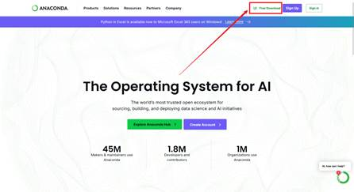

点击右下方[Skip registration](https://www.anaconda.com/download/success)跳过注册

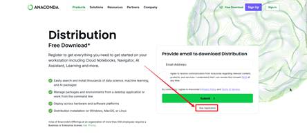

点击Download下载，或选择相应的操作系统和版本进行下载

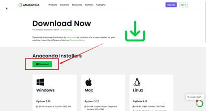

双击安装包进入安装

点击Next

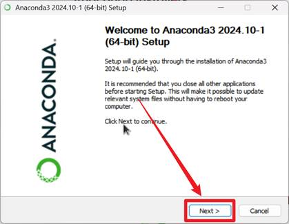

点击I
Agree

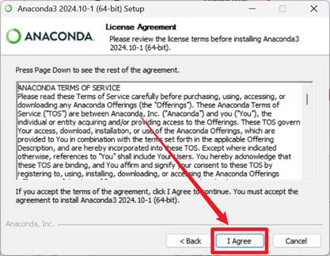

点击Next

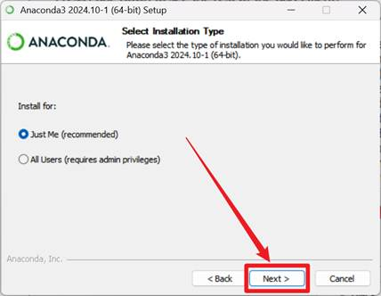

修改安装路径，点击Next

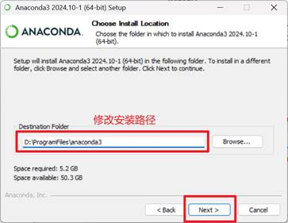

酌情修改安装选项，之后点击Install安装，等待安装完成

安装选项依次为：

- 创建快捷方式-默认选中。为Anaconda
Navigator、Spyder、Jupyter
Notebook和Anaconda
Prompt软件包创建“开始”菜单快捷方式。

- 将Anaconda3添加到我的PATH环境变量，将包含conda二进制文件的路径添加到path环境变量中。Anaconda不建议选择此选项。conda二进制文件路径包含其他包二进制文件，这些二进制文件将添加到path环境变量中，即使当前没有处于活动状态的conda环境也是如此。这使得其他软件可以使用这些软件包文件，这可能会导致错误。可以勾选，也可以在安装后手动添加环境变量。

- 注册Anaconda3作为我的默认Python
3.12-默认选中。将此安装中的Python包注册为VSCode，PyCharm等程序的默认Python。

- 安装完成后清除包缓存。

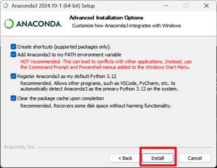

安装完成后，点击Next

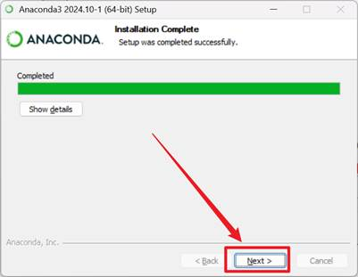

再次点击Next

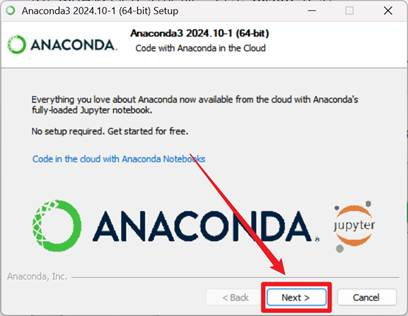

点击Finish，完成安装

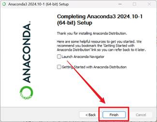

## 1.3 Jupyter笔记本

Jupyter
是一个开源的交互式计算环境，广泛应用于数据科学、机器学习、科学研究等领域，主要组件有Jupyter
Notebook和Jupyter
Lab。JupyterLab作为Jupyter
Notebook 的继承者，提供了更现代化和功能丰富的界面。JupyterLab的多文档界面、内置协作功能和扩展系统使其成为数据科学家和研究人员的首选。

### 1.3.1 使用本地Jupyter

命令提示符中输入jupyter
lab或jupyter
notebook，会弹出浏览器页面直接进入主页面

C:\Users\fuxiaofeng>jupyter
lab

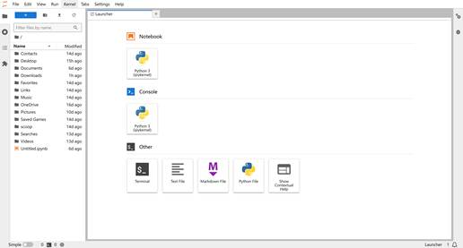

注意：由于网络等原因，可能导致访问时候出现警告，可以忽略。

### 1.3.2 PyCharm中集成Jupyter

Pycharm界面提供了对Jupyter
Notebook的集成

创建Jupyter
Notebook文件

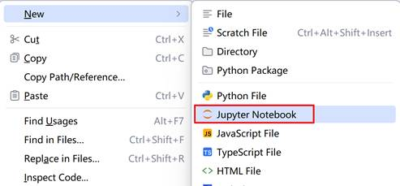

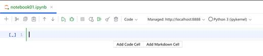

会在当前项目下创建新的conda环境，新的conda环境中没有Jupyter，如果运行的话会自动在当前环境下安装。

### 1.3.3 Jupyter快捷键

| esc | 从输入模式退出到命令模式 |
| --- | --- |
| a | 在当前cell上面创建一个新的cell |
| b | 在当前cell  下面创建一个新的cell |
| dd | 删除当前cell |
| m | 切换到markdown模式 |
| y | 切换到code模式 |
| ctrl+回车 | 运行cell |
| shift  +回车 | 运行当前cell并创建一个新的cell |

## 1.4 章节小结

- **知识总结**

  - **核心三件套**

i. **NumPy**：快速计算数字（如矩阵运算）

ii. **Pandas**：处理表格数据（类似高级Excel）

iii. **Matplotlib**：画图工具

  - **完整流程比喻**

i. **NumPy切菜**：准备好数据（比如切好“销售额”和“成本”数组）。

ii. **Pandas炒菜**：计算利润（销售额 - 成本），分析哪些产品赚钱。

iii. **可视化摆盘**：用柱状图展示利润最高的产品，老板秒懂！

  - **为什么必学？**

    - 如果你想做数据分析：

      - 不会 NumPy
→ 像用水果刀剁骨头，效率低。

      - 不会
Pandas → 像用手抓菜炒，烫还慢。

      - 不会可视化 → 像把菜糊糊端给客人，看不懂。

| 用户类型 | 推荐工具组合 | 原因 |
| --- | --- | --- |
| **初学者** | Anaconda + Jupyter | 免配置，可视化操作 |
| **团队协作** | Anaconda  + Git + VS Code | 环境可复制，代码可追溯 |
| **高级用户** | Miniconda  + PyCharm | 轻量级，自定义程度高 |

| 功能 | 原生Jupyter | PyCharm集成版 |
| --- | --- | --- |
| 代码补全 | 基础 | 智能上下文感知 |
| 版本控制 | 需手动 | Git可视化集成 |
| 调试功能 | 有限 | 完整断点调试 |
