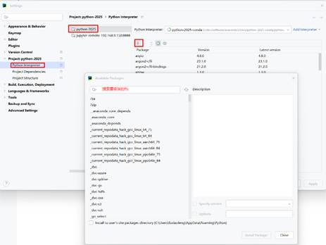
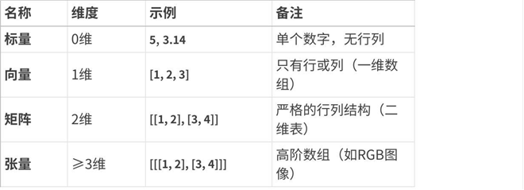
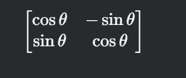
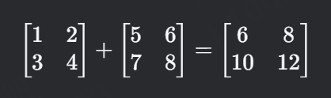
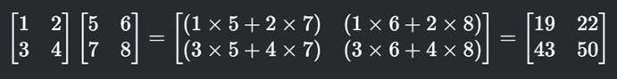
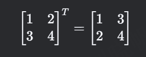
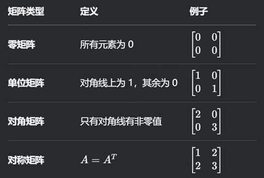
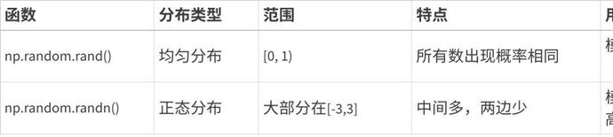

# 2. Numpy科学计算

## 2.1 numpy介绍

numpy是Python中科学计算的基础包。它是一个Python库，提供多维数组对象、各种派生对象（例如掩码数组和矩阵）以及用于对数组进行快速操作的各种方法，包括数学、逻辑、形状操作、排序、选择、I/O
、离散傅里叶变换、基本线性代数、基本统计运算、随机模拟等等。

numpy的部分功能如下：

- ndarray，一个具有矢量算术运算和复杂广播能力的快速且节省空间的多维数组。

- 用于对整组数据进行快速运算的标准数学函数（无需编写循环）。

- 用于读写磁盘数据的工具以及用于操作内存映射文件的工具。

- 线性代数、随机数生成以及傅里叶变换功能。

- 用于集成由C、C++、Fortran等语言编写的代码的API。

**为什么需要Numpy？**

```python
# 原生Python列表 vs NumPy数组性能对比

import time

import numpy as np

py_list = list(range(1000000))

np_arr = np.arange(1000000)

# 计算平方和

start = time.time()

sum([x**2 for x in py_list])

print(f"Python列表耗时:
{time.time()-start:.4f}s")

start = time.time()

np.sum(np_arr**2)

print(f"NumPy数组耗时:
{time.time()-start:.4f}s")
```

**输出示例**：

```text
Python列表耗时:
0.1256s

NumPy数组耗时: 0.0023s
```

**安装numpy包**



**如果在Pycharm中加载不出来，可以通过如下命令安装**

```python
C:\Users\fuxiaofeng>conda activate python-2025-conda

(python-2025-conda) C:\Users\fuxiaofeng>conda install numpy
```

## 2.2 ndarray

### 2.2.1 ndarray 的核心特性

1.
**多维性**：支持 0 维（标量）、1 维（向量）、2 维（矩阵）及更高维数组。

2.
**同质性**：所有元素类型必须一致（通过 dtype 指定）。

3.
**高效性**：基于连续内存块存储，支持向量化运算。

### 2.2.2 ndarray的属性

**核心属性（必须掌握）**

（假设 arr = np.array([[1, 2], [3, 4]])）

| 属性名称 | 通俗解释 | 使用示例 | 输出结果 | 实际用途 |
| --- | --- | --- | --- | --- |
| shape | **数组的形状**：行数和列数（或更高维度的尺寸）。 | arr.shape | (2, 2) | 查看或调整数组结构（如变形）。 |
| ndim | **维度数量**：数组是几维的（1维、2维、3维等）。 | arr.ndim | 2 | 判断数组是向量、矩阵还是高维数据。 |
| size | **总元素个数**：数组中所有元素的总数。 | arr.size | 4 | 快速计算元素总量。 |
| dtype | **元素类型**：数组中元素的类型（整数、浮点数等）。 | arr.dtype | int64（或 int32） | 确保计算时类型一致（如避免整数除法问题）。 |

1.
**shape**：就像问数组“长什么样”。

  - 示例：arr = np.array([[1, 2], [3, 4]])
的 shape 是 (2, 2)，表示2行2列。

  - **变形操作**：arr.reshape(4, 1) 会变成4行1列的数组。

2.
**ndim**：判断数组是“几维空间”。

  - 一维数组（向量）：ndim=1，如 [1, 2, 3]。

  - 二维数组（矩阵）：ndim=2，如表格数据。

  - 三维数组（立体）：ndim=3，如RGB图片数据。

3.
**dtype**：确保所有元素是“同一类型”。

  - 如果数组中有小数，dtype 会自动变成 float64（避免精度丢失）。

  - 强制指定类型：np.array([1, 2], dtype=np.float32)。

```python
import numpy as np

# 创建一个3x2的二维数组

arr = np.array([[1, 2], [3, 4], [5, 6]])

print("形状 shape:",
arr.shape)    # 输出
(3, 2)

print("维度 ndim:", arr.ndim)
# 输出 2

print("总元素 size:",
arr.size)   # 输出 6

print("元素类型 dtype:",
arr.dtype)  # 输出 int64
```

**进阶属性（了解即可）**

| 属性名称 | 通俗解释 | 示例代码 | 输出结果 | 应用场景 |
| --- | --- | --- | --- | --- |
| T | **转置**：行变列，列变行。 | arr.T | [[1, 3], [2, 4]] | 矩阵运算（如矩阵乘法）。 |
| itemsize | **单个元素占用的内存字节数**。 | arr.itemsize | 8（int64<br> 类型占8字节） | 优化内存占用时参考。 |
| nbytes | **数组总内存占用量**：size * itemsize。 | arr.nbytes | 32（4元素 × 8字节） | 处理大数据时监控内存消耗。 |
| flags | **内存存储方式**：是否连续存储（高级优化）。 | arr.flags | C_CONTIGUOUS : True 等 | 高性能计算或底层内存操作。 |

**练习题**

题目 1：观察数组形状

```python
import numpy as np

arr = np.array([[1, 2, 3], [4, 5, 6]])
```

1.
arr.shape
的输出是什么？

2.
arr.ndim
的值是多少？

3.
arr.size
的结果是什么？

**答案**

1.
(2, 3)

2.
2（二维数组）

3.
6（总元素数：2行×3列=6）

题目 2：数据类型推断

以下数组的 dtype 分别是什么？

1.
np.array([1, 2, 3])

2.
np.array([1.0, 2, 3])

3.
np.array(["apple",
"banana"])

**答案**

1.
int64（默认整数类型）

2.
float64（包含浮点数，自动提升为浮点类型）

3.
<U6（Unicode
字符串，长度
6）

题目 3：内存占用计算

```python
arr = np.array([[0, 1], [2, 3]], dtype=np.int32)
```

1.
arr.itemsize
的值是多少？

2.
arr.nbytes
的结果是多少？

**答案**

1.
4（int32 类型占 4 字节）

2.
8（总字节数：4元素×4字节=16 → 注：原题应为 4 元素？需要检查数组大小）

（更正：数组是 2x2，共 4 元素。nbytes = 4 × 4 = 16，原题可能有误）

题目 4：转置操作

```python
arr = np.array([[1, 2], [3, 4], [5, 6]])
```

1.
写出 arr.T 的输出。

2.
转置后的 shape 是什么？

**答案**

```text
[[1 3 5]

[2 4 6]]
```

(2, 3)（原数组是 3x2，转置后为 2x3）。

### 2.2.3 ndarray的创建

| **用途** | **方法** | **语法示例** | **核心作用** | **输出示例** |
| --- | --- | --- | --- | --- |
| **基础构造** |  |  |  |  |
| ▪<br> 从<br> Python 数据结构创建 | np.array() | np.array([[1, 2], [3, 4]]) | 将列表/元组转换为 ndarray | array([[1, 2], [3, 4]]) |
| ▪<br> 复制数组 | np.copy() | np.copy(arr) | 创建独立副本（深拷贝） | 与原数组相同但不共享内存 |
| **预定义形状填充** |  |  |  |  |
| ▪<br> 全0数组 | np.zeros() | np.zeros((2,3)) | 快速初始化全0数组 | [[0., 0., 0.], [0., 0., 0.]] |
| ▪<br> 全1数组 | np.ones() | np.ones((3,2), dtype=int) | 快速初始化全1数组 | [[1, 1], [1, 1], [1, 1]] |
| ▪<br> 未初始化数组 | np.empty() | np.empty((2,2)) | 预分配内存（值随机） | 随机值（如 [[1e-323, 0.], [0., 0.]]） |
| ▪<br> 填充固定值 | np.full() | np.full((2,3), 5) | 用指定值填充数组 | [[5, 5, 5], [5, 5, 5]] |
| **基于数值范围生成** |  |  |  |  |
| ▪<br> 等差序列 | np.arange() | np.arange(0, 10, 2) | 生成步长固定的序列（不含终点） | [0, 2, 4, 6, 8] |
| ▪<br> 等间隔序列 | np.linspace() | np.linspace(0, 1, 5) | 生成指定数量的等间隔值（含终点） | [0.0, 0.25, 0.5, 0.75, 1.0] |
| ▪<br> 对数间隔序列 | np.logspace() | np.logspace(0, 2, 3, base=10) | 生成对数间隔值（如 10^0, 10^1, 10^2） | [1.0, 10.0, 100.0] |
| **特殊矩阵生成** |  |  |  |  |
| ▪<br> 单位矩阵 | np.eye() | np.eye(3) | 生成单位矩阵（对角线为1） | [[1., 0., 0.], [0., 1., 0.], [0., 0., 1.]] |
| ▪<br> 对角矩阵 | np.diag() | np.diag([1, 2, 3]) | 生成以指定值为对角线的矩阵 | [[1, 0, 0], [0, 2, 0], [0, 0, 3]] |
| **随机数组生成** |  |  |  |  |
| ▪<br> 均匀分布随机数 | np.random.rand() | np.random.rand(2,2) | 生成<br> [0,1) 均匀分布的随机数 | [[0.43, 0.89], [0.21, 0.57]] |
| ▪<br> 正态分布随机数 | np.random.randn() | np.random.randn(2,2) | 生成标准正态分布随机数（均值为0，方差为1） | [[-0.5, 1.2], [0.3, -1.8]] |
| ▪<br> 随机整数 | np.random.randint() | np.random.randint(1,10, (2,2)) | 生成指定范围内的随机整数 | [[3, 7], [5, 2]] |
| **高级构造方法** |  |  |  |  |
| ▪<br> 从字符串创建 | np.array() | np.array(['a', 'bc']) | 将字符串转换为字符数组 | array(['a', 'bc'], dtype='<U2') |
| ▪<br> 从文件读取 | np.loadtxt() | np.loadtxt('data.txt') | 从文本文件加载数据 | 依赖文件内容（如 [[1., 2.], [3., 4.]]） |
| ▪<br> 函数生成数组 | np.fromfunction() | np.fromfunction(lambda i,j: i+j, (3,3)) | 根据函数生成数组元素 | [[0., 1., 2.], [1., 2., 3.], [2., 3., 4.]] |

**创建方法汇总**

1.
**基础构造**：
适用于手动构建小规模数组或复制已有数据。

2.
**预定义形状填充**：
用于快速初始化固定形状的数组（如全0占位、全1初始化）。

3.
**基于数值范围生成**：
生成数值序列，常用于模拟时间序列、坐标网格等。

4.
**特殊矩阵生成**：
数学运算专用（如线性代数中的单位矩阵）。

5.
**随机数组生成**：
模拟实验数据、初始化神经网络权重等场景。

6.
**高级构造方法**：
处理非结构化数据（如文件、字符串）或通过函数生成复杂数组。

#### 2.2.3.1 从
Python 数据结构转换

将
Python 列表、元组等转换为 ndarray，是最直接的方式。

**np.array(object,
dtype=None)**

```python
import numpy as np

# 从列表创建一维数组

arr1 = np.array([1, 2, 3])

print(arr1)  # 输出: [1 2 3]

# 从嵌套列表创建二维数组

arr2 = np.array([[1, 2], [3, 4]])

print(arr2)

# 输出:

# [[1 2]

#  [3 4]]

# 指定数据类型

arr3 = np.array([1, 2.5], dtype=np.float32)

print(arr3.dtype)  # 输出: float32
```

**注意事项**

- 混合类型时，NumPy
会统一为最高优先级类型（如 int + float → float，数值 + 字符串 → 字符串）。

- 列表的嵌套层级决定 ndim（维度数）。

#### 2.2.3.2 预定义形状填充

快速初始化固定形状的数组，常用于占位或初始化权重矩阵。

```python
np.zeros(shape, dtype=float)  # 全0  返回给定形状和类型的新数组，用0填充。

np.ones(shape, dtype=float)   # 全1
返回给定形状和类型的新数组，用1填充。
```

```python
# 创建 2x3 全0浮点数组

zeros_arr = np.zeros((2, 3))

print(zeros_arr)

# 输出:

# [[0. 0. 0.]

#  [0. 0. 0.]]

# 创建 3x2 全1整数数组

ones_arr = np.ones((3, 2), dtype=int)

print(ones_arr)

# 输出:

# [[1 1]

#  [1 1]

#  [1 1]]
```

默认数据类型为 float64，需显式指定 dtype
为 int 或其他类型。

**未初始化的数组(**np.empty**)**

np.empty(shape,
dtype=float)

返回给定形状和类型的未初始化的新数组。

创建未初始化的数组（值随机，取决于内存状态），适用于对性能要求极高的场景。

```python
empty_arr = np.empty((2, 2))

print(empty_arr)  # 输出可能为随机值（如
[[1e-323, 0. ], [0., 0. ]]）
```

**不推荐直接使用**：需手动填充数据，否则可能引入不可预测的错误。

需要注意的是，np.empty 并不保证数组元素被初始化为 0，它只是分配内存空间，数组中的元素值是未初始化的，可能是内存中的任意值。

**重复填充数组(**np.full**)**

np.full(shape,
fill_value, dtype)

```python
full_arr = np.full((2, 3), 5)

print(full_arr)

# 输出:

# [[5 5 5]

#  [5 5 5]]
```

**zeros_like()：**返回与给定数组具有相同形状和类型的0新数组。

**ones_like()：**返回与给定数组具有相同形状和类型的1新数组。

**empty_like()：**返回与给定数组具有相同形状和类型的未初始化的新数组。

```text
arr2 = np.ones_like(arr1)
# 创建和arr1形状相同的全1数组

arr4 = np.empty_like(arr3)
# 创建和arr3形状相同的未初始化数组

arr2 = np.full_like(arr1, 5)
```

#### 2.2.3.3 基于数值范围生成

**(1)**np.arange**：等差序列**

np.arange(start,
stop, step)

返回在给定范围内用均匀间隔的值填充的一维数组。

```python
arr = np.arange(0, 10, 2)  # 0 ≤ 值 <10，步长2

print(arr)  # 输出: [0 2 4 6 8]
```

**(2)**np.linspace**：等间隔数组（含终点）**

np.linspace(start,
stop, num=50)

返回指定范围和元素个数的等差数列。数组元素类型为浮点型。

```python
arr = np.linspace(0, 1, 5)  # 0到1之间生成5个等间隔值

print(arr)  # 输出: [0.   0.25
0.5  0.75 1.  ]
```

**(3)**np.logspace**：对数间隔数组**

np.logspace(start,
stop, num=50, base=10)

返回指定指数范围、元素个数、底数的等比数列。

```python
arr = np.logspace(0, 2, 3)  # 10^0, 10^1, 10^2

print(arr)  # 输出: [  1.  10.
100.]
```

#### 2.2.3.4 特殊矩阵

**矩阵补充知识**



矩阵是线性代数的核心概念，可以理解为一个数字的矩形表格，用来表示数据、方程组或线性变换。下面用最直观的方式介绍它的基本概念和应用。

1.
矩阵是什么？

矩阵是一个由 行（row） 和 列（column） 排列成的矩形数组，例如：


- 形状（shape）：这个矩阵有 2 行 3 列，记作
2×32×3 矩阵。

- 元素（entry）：矩阵中的每个数字称为元素，如
A1,2=2*A*1,2=2（第
1 行第
2 列）。

2.
矩阵的用途

(1)
表示线性方程组

例如，方程组：


可以写成矩阵形式：


即 *A***x**=**b**，其中：

- *A* 是系数矩阵，

- **x** 是未知数列向量，

- **b** 是常数项列向量。

(2)
表示线性变换

矩阵可以描述空间中的变换，比如旋转、缩放、投影。

例如，一个
2×22×2 矩阵可以表示二维平面的旋转：



作用在向量 [xy][*xy*]
上，会使其旋转
θ*θ* 角度。

(3)
数据表示（如机器学习）

在机器学习中，数据集通常用矩阵表示：

- 每一行代表一个样本（如一张图片），

- 每一列代表一个特征（如像素值）。

3.
矩阵的基本运算

(1)
矩阵加法

对应位置的元素相加，要求两个矩阵形状相同：



(2)
矩阵数乘

矩阵的每个元素乘以一个标量（数）：


(3)
矩阵乘法

矩阵乘法 不是 对应元素相乘，而是 行 × 列 的点积运算：



注意：矩阵乘法不满足交换律（AB≠BA*AB*=*BA*）。

(4)
转置（Transpose）

行列互换：



4.
特殊矩阵



**(1)单位矩阵(**np.eye/np.identity**)**

```python
np.eye(N)  # NxN 单位矩阵

np.identity(N)
```

```python
eye_arr = np.eye(3)

print(eye_arr)

# 输出:

# [[1. 0. 0.]

#  [0. 1. 0.]

#  [0. 0. 1.]]
```

**(2)对角矩阵(**np.diag**)**

```python
np.diag([a, b, c])  # 对角线为 a, b, c，其余为0
```

```python
diag_arr = np.diag([1, 2, 3])

print(diag_arr)

# 输出:

# [[1 0 0]

#  [0 2 0]

#  [0 0 3]]
```

#### 2.2.3.5 随机数组

**(1)均匀分布随机数(**np.random.rand**)**

返回给定形状的数组，用 [0,
1) 上均匀分布的随机样本填充。

```python
rand_arr = np.random.rand(2, 2)  # [0,1) 均匀分布

# 输出示例: [[0.43, 0.89], [0.21, 0.57]]
```

**(2)正态分布随机数(**np.random.randn**)**

返回给定形状的数组，用标准正态分布(均值为0，标准差为1)的随机样本填充。

```python
randn_arr = np.random.randn(2, 2)  # 均值为0，方差为1

# 输出示例: [[-0.5, 1.2], [0.3, -1.8]]
```



**(3)随机整数(**np.random.randint**)**

返回给定形状的数组，用从低位(包含)到高位(不包含)上均匀分布的随机整数填充。

```python
int_arr = np.random.randint(1, 10, (2, 2))  #
[1,10) 的整数

# 输出示例: [[3, 7], [5, 2]]
```

（4）r**andom.uniform()**

**random.uniform()：**返回给定形状的数组，用从低位(包含)到高位(不包含)上均匀分布的随机浮点数填充。

```python
arr3 = np.random.uniform(3, 6, (2, 3))
# [[5.69275495 3.84857937 3.2899215 ]
#  [5.32035519 3.7460973  3.33859905]]
```

**(5)设置随机种子(**np.random.seed**)**

np.random.seed 是 NumPy
中用于设置**随机数生成器种子**的函数，目的是确保程序的随机操作可以重复生成相同的结果（即保证随机结果的确定性）。这在实验复现、调试和教学场景中非常有用。

```python
import numpy as np

# 设置随机种子

np.random.seed(42)  # 参数可以是任意整数

# 生成随机数

print(np.random.rand(3))  # 输出固定结果
```

每次运行上述代码都会得到相同的随机数序列（例如 [0.37454012, 0.95071431, 0.73199394]）。

关键细节

1.
**种子的一致性**：

  - 相同种子生成的随机数序列完全一致。

  - 不同种子（如 np.random.seed(0) 和 np.random.seed(1)）会产生不同序列。

2.
**作用范围**：

  - 种子对后续所有基于
NumPy 的随机函数生效（如 np.random.rand(), np.random.normal(), np.random.shuffle() 等）。

通过控制种子，你能在“随机”和“可复现”之间灵活切换！

#### 2.2.3.6 高级构造方法

**(1)np.loadtxt**

```python
data = np.loadtxt('data.txt')  # 读取文本文件
```

**(2)np.genfromtxt**

```python
data = np.genfromtxt('data.csv', delimiter=',')  #
支持复杂格式
```

#### 2.2.3.7 创建方法推荐场景

| **场景** | **推荐方法** | **优点** |
| --- | --- | --- |
| 快速初始化全0/全1数组 | np.zeros/np.ones | 内存预分配，明确值 |
| 生成数值序列 | np.arange/np.linspace | 灵活控制范围和步长 |
| 创建单位矩阵或对角矩阵 | np.eye/np.diag | 数学运算专用 |
| 高性能预分配内存 | np.empty | 速度最快（需手动初始化） |
| 随机数据生成 | np.random 模块 | 模拟实验数据 |

### 2.2.4 ndarray的数据类型

| **数据类型** | **类型代码** | **说明** |
| --- | --- | --- |
| **bool** |  | 布尔类型 |
| **int8、uint8**<br> **int16、uint16**<br> **int32、uint32**<br> **int64、uint64** | i1,u1<br> i2,u2<br> i4,u4<br> i8,u8 | 有符号、无符号的8位（1字节）整型<br> 有符号、无符号的16位（2字节）整型<br> 有符号、无符号的32位（4字节）整型<br> 有符号、无符号的64位（8字节）整型 |
| **float16**<br> **float32**<br> **float64** | f2<br> f4或f<br> f8或d | 半精度浮点型<br> 单精度浮点型<br> 双精度浮点型 |
| **complex64**<br> **complex128** | c8<br> c16 | 用两个32位浮点数表示的复数<br> 用两个64位浮点数表示的复数 |

创建数组时可以使用dtype参数指定元素类型：

```python
arr1 = np.array([1, 2, 3], dtype=np.float64)

# [1. 2. 3.]

arr2 = np.array([0.2, 2.5, 4.8], dtype="i8")

# [0 2 4]
```

也可以使用ndarray.astype()方法转换数组的元素类型：

```python
arr1 = np.array([1, 2, 3], dtype=np.float64)

# [1. 2. 3.]

arr2 = arr1.astype(np.int64)

# [1 2 3]
```

**数据类型深度解析**

```python
# 显式指定数据类型

arr = np.array([1, 2, 3], dtype=np.float32)

# 类型转换

int_arr = arr.astype(np.int32)

# 内存优化示例

large_arr = np.ones(1000000, dtype=np.float64)  # 占用8MB

optimized = large_arr.astype(np.float32)
# 优化为4MB
```

### 2.2.5 索引与切片技巧

| **索引/切片类型** | **描述/用法** | **示例代码** | **示例输出** |
| --- | --- | --- | --- |
| **基本索引** | 通过整数索引直接访问元素。索引从0开始。 | arr = np.arange(1, 10).reshape(3,3)<br>print(arr[1, 2]) | 6（第2行第3列的元素） |
| **行/列切片** | 使用冒号 : 切片语法选择行或列的子集。 | print(arr[:, 1])<br>print(arr[::2, ::2]) | [2 5 8]（所有行的第2列）<br>[[1, 3], [7, 9]]（隔行隔列取样） |
| **连续切片** | 从起始索引到结束索引按步长切片。 | arr = np.arange(10)<br>print(arr[2:9:2])<br>print(arr[2:]) | [2 4 6 8]（索引2到8，步长2）<br>[2 3 4 5 6 7 8 9]（索引2到最后） |
| **使用slice函数** | 通过 slice(start, stop, step)<br> 定义切片规则。 | print(arr[slice(2, 9, 2)]) | [2 4 6 8]（等效于 arr[2:9:2]） |
| **布尔索引** | 通过布尔条件筛选满足条件的元素。支持逻辑运算符 &、\|。 | data = np.random.randn(100)<br>print(data[(data > 0.5) & (data <<br> 1.0)]) | 输出满足条件 0.5 < data < 1.0<br> 的元素数组。 |

```python
arr = np.arange(1, 10).reshape(3,3)

print(arr[1, 2])       # 第2行第3列 → 6

print(arr[:, 1])       # 所有行的第2列 → [2 5 8]

print(arr[::2, ::2])   # 隔行隔列取样 →
[[1,3],[7,9]]

# 布尔索引实战

data = np.random.randn(100)

print(data[(data > 0.5) & (data < 1.0)]) # 条件筛选
```

ndarray对象的内容可以通过索引或切片来访问和修改，与
Python 中
list 的切片操作一样。

可以通过内置的slice函数，或者冒号设置start,
stop及step参数进行切片，从原数组中切割出一个新数组。

```python
import numpy as np

arr = np.arange(10)

print(arr)

# [0 1 2 3 4 5 6 7 8 9

#获取索引为2的数据

print(arr[2])

# 2

# 从索引
2开始到索引9(不包含)停止，间隔为2

print(arr[slice(2,9,2)])

# [2 4 6 8]

# 从索引2开始到索引9(不包含)停止，间隔为2

print(arr[2:9:2])

# [2 4 6 8]

# 从索引2开始到最后(不包含)，默认间隔为1

print(arr[2:])

# [2 3 4 5 6 7 8 9]

# 从索引2开始到索引9(不包含)结束，默认间隔为1

print(arr[2:9])

# [2 3 4 5 6 7 8]
```

1.
**切片语法规则**：start:stop:step，左闭右开区间（包含 start，不包含 stop）。

2.
**布尔索引限制**：布尔数组的维度需与原数组匹配。

3.
**内存共享特性**：切片返回的是原数组的视图（共享内存），修改切片会影响原数组。需用 copy() 创建独立副本。

### 2.2.6 基本运算

numpy中的数组不用编写循环即可执行批量运算，称之为矢量化运算。

大小相等的数组之间的任何算术运算都会将运算应用到元素级。

```python
arr1 = np.array([[1, 2, 3], [4, 5, 6]])

arr2 = np.array([[7, 8, 9], [10, 11, 12]])

print(arr1 + arr2)

print(arr1 - arr2)

print(arr1 * arr2)

print(arr1 / arr2)
```

数组与标量的算术运算会将标量值传播到各个元素，不同大小的数组之间的运算叫做广播。

```python
arr1 = np.array([[1, 2, 3], [4, 5, 6]])

print(arr1 + 100)

print(arr1 - 100)

print(arr1 * 100)

print(arr1 / 100)
```

思考：形状不同的ndarray可以进行算术运算吗？

广播机制是 NumPy 中一个强大的特性，它允许在不同形状的数组之间进行元素级运算。广播机制的规则如下：

规则1：如果俩个数组的维度数不相同，那么小维度数组的形状将会在最左边补1。

```python
import numpy as np

# 一维数组

arr1 = np.array([1, 2, 3])  # 形状为 (3,)

# 二维数组

arr2 = np.array([[4],
[5], [6]])  #
形状为 (3, 1)

# 对 arr1 应用规则 1，在其形状最左边补
1，变为 (1, 3)  [[1,2,3]]

# 此时
arr1 形状 (1, 3) 和 arr2 形状 (3, 1) 满足广播条件

result = arr1 + arr2

print("规则 1 示例结果：\n", result)
```

规则2：如果俩个数组的形状在任何一个维度上都不匹配，那么数组的形状会沿着维度大小（元素个数）为1的维度开始扩展 ，（维度必须是1开始）直到所有维度都一样， 以匹配另一个数组的形状。

```python
import numpy as np

# 二维数组

arr3 = np.array([[1, 2, 3]])  # 形状为 (1, 3)

# 二维数组

arr4 = np.array([[4],
[5], [6]])  #
形状为 (3, 1)

# arr3 沿着第0个维度扩展,将原有的一行数据复制成3行,为 (3, 3)=>[[1,2,3],
[1,2,3], [1,2,3]]

# arr4 沿着第1个维度扩展, (3, 3)=>[[4,4,4], [5,5,5], [6,6,6]]

result = arr3 + arr4

print("规则 2 示例结果：\n", result)

规则3：如果俩个数组的形状在任何一个维度上都不匹配，并且没有任何一个维度大小等于1，那么会引发异常。

import numpy as np

# 一维数组

arr5 = np.array([1, 2, 3])  # 形状为 (3,)

# 一维数组

arr6 = np.array([4, 5])  #
形状为 (2,)

try:

result =
arr5 + arr6

print(result)

except ValueError as e:

print(f"规则 3 示例错误信息：{e}")
```

**矢量化运算和广播机制的关系**

矢量化运算和广播机制是 NumPy
中两个密切相关但又有所区别的核心概念，它们共同使得
NumPy 能够高效地处理数组运算。以下是它们的关系和区别：

**矢量化运算（Vectorization）**

**核心思想**：用数组级别的操作替代显式循环，利用底层优化（如
SIMD 指令）加速计算。

**特点**：

- 避免
Python 的 for 循环，直接对整个数组进行数学运算（如 a + b）。

- 要求参与运算的数组**形状完全相同**（否则会报错或触发广播机制）。

**示例**：

```python
import numpy as np

a = np.array([1, 2, 3])

b = np.array([4, 5, 6])

c = a + b  # 矢量化加法 → [5, 7, 9]
```

**广播机制（Broadcasting）**

**核心思想**：当数组形状不完全相同时，NumPy 会尝试自动扩展较小的数组，使其与较大的数组形状兼容。

**特点**：

- 允许不同形状的数组进行运算（如标量与数组、行向量与列向量等）。

- 遵循严格的**广播规则**（见下文）。

**示例**：

```python
a = np.array([1, 2, 3])  # shape (3,)

b =
2
# shape ()，标量

c = a *
b
# 广播：b 被扩展为
[2, 2, 2] → [2, 4, 6]
```

**矢量化运算vs.广播机制的关系**

| 特性 | 矢量化运算 | 广播机制 |
| --- | --- | --- |
| **目标** | 避免显式循环，提升计算效率 | 解决不同形状数组的运算问题 |
| **依赖关系** | 广播机制是矢量化运算的补充 | 广播机制使矢量化运算更灵活 |
| **形状要求** | 通常要求数组形状相同 | 允许形状不同，但需满足广播规则 |
| **底层实现** | 基于优化过的<br> C/Fortran 代码 | 自动扩展数组，不实际复制数据 |

**关键联系**：

- **广播机制扩展了矢量化运算的适用范围**：如果没有广播机制，矢量化运算只能用于形状完全相同的数组。而广播机制让矢量化运算可以处理更多情况（如标量与数组、行向量与列向量等）。

- **广播机制本身也是矢量化实现的**：广播的数组扩展是隐式的（不真正复制数据），底层仍然用优化过的代码计算，因此效率很高。

**典型场景分析**

**纯矢量化运算（形状相同）**

```python
a = np.array([1, 2, 3])

b = np.array([4, 5, 6])

c = a + b  # 直接逐元素相加 → [5, 7, 9]
```

**矢量化+广播（形状不同但可广播）**

```python
a = np.array([[1], [2], [3]])  # shape (3, 1)

b = np.array([10, 20, 30])     # shape (3,)

c = a + b

# 广播步骤：

# 1. a 扩展为 [[1, 1, 1], [2, 2, 2],
[3, 3, 3]]（虚拟扩展，不实际复制）

# 2. b 扩展为 [[10, 20, 30], [10, 20,
30], [10, 20, 30]]

# 结果：

# [[11, 21, 31],

#  [12, 22, 32],

#  [13, 23, 33]]
```

**无法广播的情况**

```python
a = np.array([1, 2, 3])

b = np.array([10, 20])

a + b  # 报错：shapes (3,) and (2,)
cannot be broadcast
```

**总结**

- **矢量化运算**是 NumPy
高效计算的基础，它用数组操作替代循环。

- **广播机制**是矢量化运算的“增强工具”，让不同形状的数组也能参与运算。

- **二者协作**：广播机制使得矢量化运算可以处理更灵活的场景，同时保持高性能。

**简单记忆**：

- 矢量化
→ “不用循环，直接算”。

- 广播
→ “形状不同，自动对齐”。

**矩阵乘法**

通过*运算符和np.multiply()对两个数组相乘进行的是对位乘法而非矩阵乘法运算。

```python
arr1 = np.array([[1, 2, 3], [4, 5, 6]])

arr2 = np.array([[6, 5, 4], [3, 2, 1]])

print(arr1 * arr2)

print(np.multiply(arr1, arr2))
```

使用np.dot()、ndarray.dot()、@可以进行矩阵乘法运算。

```python
arr1 = np.array([[1, 2, 3], [4, 5, 6]])

arr2 = np.array([[6, 5], [4, 3],
[2, 1]])

#对于矩阵乘法来说，要求第一个矩阵的列数等于第二个矩阵的行数

print(arr1)

print(arr2)

print(arr1.shape, arr2.shape)

print(np.dot(arr1, arr2))

print(arr1.dot(arr2))

print(arr1 @ arr2)

# 一个二维数组跟一个大小合适的一维数组的矩阵点积运算之后将会得到一个一维数组

arr3 = np.array([6, 5, 4])

print(arr1 @ arr3)
```

矩阵乘法的规则是：结果矩阵中第 i 行第 j 列的元素等于第一个矩阵的第 i 行与第二个矩阵的第 j 列对应元素乘积之和。

- 结果矩阵第一行第一列的元素：

计算 arr1 的第一行 [1,
2, 3] 与 arr2 的第一列 [6,
4, 2] 对应元素乘积之和，即 1*6
+ 2*4 + 3*2 = 6 + 8 + 6 = 20。

- 结果矩阵第一行第二列的元素：

计算 arr1 的第一行 [1,
2, 3] 与 arr2 的第二列 [5,
3, 1] 对应元素乘积之和，即 1*5
+ 2*3 + 3*1 = 5 + 6 + 3 = 14。

- 结果矩阵第二行第一列的元素：

计算 arr1 的第二行 [4,
5, 6] 与 arr2 的第一列 [6,
4, 2] 对应元素乘积之和，即 4*6
+ 5*4 + 6*2 = 24 + 20 + 12 = 56。

- 结果矩阵第二行第二列的元素：

计算 arr1 的第二行 [4,
5, 6] 与 arr2 的第二列 [5,
3, 1] 对应元素乘积之和，即 4*5
+ 5*3 + 6*1 = 20 + 15 + 6 = 41。

所以，手动计算得到的结果矩阵是 [[20,
14], [56, 41]]。

```python
A = np.array([[1,2],[3,4]])

B = np.array([[5,6],[7,8]])

# 逐元素运算

print(A * B)   # [[5,12],[21,32]]

# 矩阵乘法

print(A @ B)   # [[19,22],[43,50]]

# 广播机制演示

C = np.array([10,20])

print(A + C)   # [[11,22],[13,24]]
```

## 2.3 numpy常用函数

| **分类** | **函数** | **功能说明** |
| --- | --- | --- |
| **基本数学** | np.sqrt(x) | 计算平方根 |
|  | np.exp(x) | 计算指数（e^x） |
|  | np.log(x) | 计算自然对数（ln(x)） |
|  | np.sin(x) | 计算正弦值 |
|  | np.abs(x) | 计算绝对值 |
|  | np.power(a, b) | 计算 a 的 b 次幂 |
|  | np.round(x, n) | 四舍五入（保留 n 位小数） |
| **统计** | np.sum(x) | 求和 |
|  | np.mean(x) | 计算均值 |
|  | np.median(x) | 计算中位数 |
|  | np.std(x) | 计算标准差 |
|  | np.var(x) | 计算方差 |
|  | np.min(x) / np.max(x) | 查找最小值/最大值 |
|  | np.percentile(x, q) | 计算分位数（q:<br> 0~100） |
| **比较** | np.greater(a, b) | 元素级比较 a > b |
|  | np.less(a, b) | 元素级比较 a < b |
|  | np.equal(a, b) | 元素级比较 a == b |
|  | np.logical_and(a, b) | 逻辑与（逐元素） |
|  | np.where(condition, x, y) | 根据条件选择元素 |
| **排序** | np.sort(x) | 返回排序后的副本 |
|  | x.sort() | 原地排序（修改原数组） |
|  | np.argsort(x) | 返回排序后的索引 |
|  | np.lexsort(keys) | 多键排序（按最后一列优先） |
| **去重** | np.unique(x) | 返回唯一值并排序 |
|  | np.in1d(a, b) | 检查 a 的元素是否在 b 中存在 |
| **其他实用** | np.concatenate((a, b)) | 数组拼接 |
|  | np.split(x, indices) | 分割数组 |
|  | np.reshape(x, shape) | 调整数组形状 |
|  | np.copy(x) | 创建数组的深拷贝 |
|  | np.isnan(x) | 检测 NaN<br> 值 |

### 2.3.1 统计基础

| **统计量名称** | **数学定义与解释** | **常见用途** | **图示理解建议（文本）** |
| --- | --- | --- | --- |
| 总和（和） | 所有数值相加的结果 | 总支出、总收入、总分等 | 直方图每列的“高度总和” |
| 计数（非空） | 所有非缺失值的数量 | 数据有效性统计 | 每列或每组的“存在数量” |
| 唯一计数 | 去重后的值的个数 | 用户量、种类、独特答案数等 | 彩色圆点图：每种颜色的数量 |
| 频率统计 | 每个唯一值出现的次数 | 投票结果、偏好选项统计 | 每种值为一柱的频数柱状图 |
| 平均数 | 所有数值的总和 / 个数 | 成绩均值、产品均价 | 数轴上“重心”位置 |
| 中位数 | 将所有值排序后位于中间位置的那个值 | 房价中位数、收入中位数 | 数轴上“居中”点 |
| 众数 | 出现频率最高的值；可能有多个 | 最常见类别、最流行选项 | 柱状图中“最高柱”的位置 |
| 众数个数 | 用于判断是否有多个众数 | 检查分布集中性 | 多个柱一样高 → 多众数 |
| 最大值 | 数据中的最大元素 | 最高温度、最大销量 | 数轴最右端的点 |
| 最小值 | 数据中的最小元素 | 最低成绩、最低价格 | 数轴最左端的点 |
| 分位数 | 把数据分成若干个相同大小的部分，第<br> q 个分位数是从小到大第<br> q 比例处的值 | 算工资等级、考试分数线 | 25%、50%、75%点→形成“箱型图” |
| 方差 | 所有数据与平均值之差的平方和的平均数（度量“离均差”的平方） | 波动性分析、风险评估 | 离平均数越远的点 → 贡献越大 |
| 标准差 | 方差的平方根；表示数据的波动程度 | 正态分布、偏差分析、误差建模 | 平均数±1个标准差 → 约68%数据范围 |
| 协方差 | 两个变量各自与均值之差乘积的平均值，衡量两者的变化趋势是否一致 | 股价、气温等变量共同趋势 | 趋势一致 → 正值，反向 → 负值 |
| 相关系数 | 标准化的协方差，范围为<br> [-1, 1]，衡量两个变量之间的线性相关程度 | 预测模型、特征选择、相关分析 | 趋势完全相同 → 1，完全相反 →<br> -1 |

### 2.3.2 基本数学函数

| **函数** | **功能说明** | **示例代码** | **示例输出** |
| --- | --- | --- | --- |
| np.sqrt(x) | 计算平方根 | np.sqrt([1, 4, 9]) | [1. 2. 3.] |
| np.exp(x) | 计算指数（e^x） | np.exp([0, 1]) | [1. <br> 2.71828183] |
| np.log(x) | 计算自然对数（ln(x)） | np.log([1, np.e]) | [0. 1.] |
| np.sin(x) | 计算正弦值 | np.sin(np.pi/2) | 1.0 |
| np.abs(x) | 计算绝对值 | np.abs([-1, 2.5]) | [1. 2.5] |
| np.power(a, b) | 计算 a 的 b 次幂 | np.power(2, [3, 4]) | [8 16] |
| np.round(x, n) | 四舍五入（保留 n 位小数） | np.round(3.1415, 2) | 3.14 |
| np.ceil(x) | 向上取整（不小于原数的最小整数） | np.ceil([1.2, 3.7, -2.3]) | [ 2. 4. -2.] |
| np.floor(x) | 向下取整（不大于原数的最大整数） | np.floor([1.2, 3.7, -2.3]) | [ 1. 3. -3.] |
| np.rint(x) | 四舍五入到最近的整数；当需要舍入的数字恰好是<br> 5 时，会看<br> 5 前面的数字，如果是偶数则直接舍去<br> 5，如果是奇数则进位。 | np.rint([1.5, 2.3, 3.7]) | [1. 2. 4.] |
| np.multiply(a, b) | 元素级乘法（等价于 a * b） | np.multiply([2, 3], [4, 5]) | [ 8 15] |
| np.divide(a, b) | 元素级除法（等价于 a / b） | np.divide([6, 8], [2, 4]) | [3. 2.] |
| np.isnan(x) | 检测 NaN<br> 值 | np.isnan([1, np.nan, 3]) | [False True False] |

```python
arr1 = np.random.randn(2, 3)

print(arr1)

print(np.abs(arr1))

print(np.ceil(arr1))

print(np.floor(arr1))

print(np.rint(arr1))

print(np.isnan(arr1))

print(np.multiply(arr1, 2))

print(np.divide(arr1, arr1))
```

### 2.3.3 统计函数

| 函数 | 功能说明 | 示例代码 | 示例输出 |
| --- | --- | --- | --- |
| np.sum(x) | 求和 | np.sum([[1, 2], [3, 4]]) | 10 |
| np.mean(x) | 计算均值 | np.mean([1, 2, 3, 4]) | 2.5 |
| np.median(x) | 计算中位数 | np.median([5, 2, 3, 1]) | 2.5 |
| np.std(x) | 计算标准差 | np.std([1, 2, 3]) | 0.81649658 |
| np.var(x) | 计算方差 | np.var([1, 2, 3]) | 0.66666667 |
| np.min(x) | 查找最小值 | np.min([[4, 2], [3, 1]]) | 1 |
| np.max(x) | 查找最大值 | np.max([[4, 2], [3, 1]]) | 4 |
| np.percentile(x, q) | 计算分位数（q:<br> 0~100） | np.percentile([1,2,3,4], 50) | 2.5 |
| np.argmax(x) | 返回最大值的索引 | np.argmax([1, 3, 2]) | 1 |
| np.argmin(x) | 返回最小值的索引 | np.argmin([1, 3, 2]) | 0 |
| np.cumsum(x) | 计算累积和（逐元素累加结果） | np.cumsum([1, 2, 3]) | [1, 3, 6] |
| np.cumprod(x) | 计算累积积（逐元素累乘结果） | np.cumprod([1, 2, 3]) | [1, 2, 6] |

多维数组在计算时默认计算全部维度，可以使用axis参数指定按某一维度为轴心统计，axis=0按列统计、axis=1按行统计。

```python
arr1 = np.random.randint(1, 5, (2, 3))

print(arr1)

print(np.mean(arr1))

print(np.sum(arr1))

print(np.max(arr1))

print(np.min(arr1))

print(np.std(arr1))

print(np.var(arr1))

print(np.argmax(arr1))

print(np.argmin(arr1))

print(np.cumsum(arr1))

print(np.cumprod(arr1))

print(np.cumprod(arr1, axis=1))
```

NumPy统计量表

| 统计量名称 | NumPy方法 | 数学定义与解释 | 常见用途 | 图示理解建议（文本） |
| --- | --- | --- | --- | --- |
| **总和（和）** | np.sum() | 所有数值相加的结果 | 总支出、总收入、总分等 | 直方图每列的"高度总和" |
| **计数** | np.size() | 数组中元素的总个数（包括缺失值需额外处理） | 数据规模统计 | 数组的"总格子数" |
| **非零计数** | np.count_nonzero() | 数组中非零元素的数量 | 稀疏矩阵分析、激活单元统计 | 点亮非零元素的网格图 |
| **平均数** | np.mean() | 所有数值的总和 / 个数 | 成绩均值、产品均价 | 数轴上"重心"位置 |
| **加权平均** | np.average(weights=) | Σ(值×权重)/Σ权重 | 加权评分、指数计算 | 不同权重的砝码平衡点 |
| **中位数** | np.median() | 将所有值排序后位于中间位置的值 | 房价中位数、收入中位数 | 数轴上"居中"点 |
| **众数** | scipy.stats.mode() | 出现频率最高的值（需SciPy支持） | 最常见类别、最流行选项 | 柱状图中"最高柱"的位置 |
| **最大值** | np.max() | 数据中的最大元素 | 最高温度、最大销量 | 数轴最右端的点 |
| **最小值** | np.min() | 数据中的最小元素 | 最低成绩、最低价格 | 数轴最左端的点 |
| **极差** | np.ptp() | 最大值与最小值的差（Peak-to-Peak） | 数据波动范围 | 数轴两端点之间的距离 |
| **方差** | np.var() | Σ(值-均值)²/n<br> （ddof=0为总体方差） | 波动性分析、风险评估 | 离均值越远的点→贡献越大 |
| **标准差** | np.std() | 方差的平方根（ddof=0为总体标准差） | 正态分布、偏差分析 | 均值±1个标准差→约68%数据范围 |
| **分位数** | np.quantile() | 将数据分成q比例处的值（如0.25为下四分位数） | 工资等级、考试分数线 | 25%、50%、75%点→形成"箱型图" |
| **百分位数** | np.percentile() | 分位数的百分数表示（quantile(0.25)=percentile(25)） | 统计分布边界 | 标记特定百分比位置的参考线 |
| **协方差矩阵** | np.cov() | 变量间协方差的矩阵表示（每对变量的协方差） | 多元统计分析、PCA | 热力图显示变量间相关性 |
| **相关系数** | np.corrcoef() | 标准化的协方差矩阵，范围[-1,1] | 特征选择、相关分析 | 颜色深浅表示相关性强弱 |
| **直方图统计** | np.histogram() | 将数据划分到等宽区间并计数 | 分布分析、数据分箱 | 柱状图显示各区间的频数 |
| **累积和** | np.cumsum() | 从第一个元素开始逐步累加的结果数组 | 累计收益、增长曲线 | 阶梯式上升的折线图 |
| **累积积** | np.cumprod() | 从第一个元素开始逐步累乘的结果数组 | 复利计算、连乘效应 | 指数增长的曲线 |
| **唯一值** | np.unique() | 返回排序后的唯一值数组（可附加计数） | 类别统计、去重操作 | 彩色圆点图：每种颜色的数量 |
| **排序统计** | np.sort()+索引 | 排序后通过分位数位置获取统计量 | 非参数统计、排名分析 | 有序数轴上的位置标记 |
| **迹（矩阵）** | np.trace() | 矩阵主对角线元素的和 | 线性代数运算、矩阵特征 | 矩阵对角线上元素的求和 |
| **范数** | np.linalg.norm() | 向量的模（如L2范数为欧几里得距离） | 相似度计算、正则化 | 向量箭头的长度 |

关键说明：

1.
**轴方向控制**：多数函数支持axis参数（如axis=0列统计，axis=1行统计）

2.
**缺失值处理**：需先用np.nan相关函数（如np.nansum()）处理含NaN的数据

3.
**精度控制**：可通过dtype参数指定计算精度（如np.mean(dtype=np.float64)）

4.
**高维扩展**：所有统计量均支持高维数组，通过axis元组指定多轴（如axis=(1,2)）

### 2.3.4 比较函数

| **函数** | **功能说明** | **示例代码** | **示例输出** |
| --- | --- | --- | --- |
| np.greater(a, b) | 元素级比较 a > b | np.greater([3, 1], [2, 2]) | [True, False] |
| np.less(a, b) | 元素级比较 a < b | np.less([3, 1], [2, 2]) | [False, True] |
| np.equal(a, b) | 元素级比较 a == b | np.equal([1, 2], [1, 3]) | [True, False] |
| np.logical_and(a, b) | 逻辑与（逐元素） | np.logical_and([True, False], [True, True]) | [True, False] |
| np.logical_or(a, b) | 逻辑或（逐元素） | np.logical_or([True, False], [False, False]) | [True, False] |
| np.logical_not(a) | 逻辑非（逐元素） | np.logical_not([True, False]) | [False, True] |
| np.any(a) | 检查数组中是否 **至少有一个元素** 为 True | np.any([0, 1, 0]) | True |
| np.all(a) | 检查数组中是否 **所有元素** 为 True | np.all([1, 2, 0]) | False |
| np.where(condition, x, y) | 根据条件选择元素 | np.where([True, False, True], 1, 0) | [1, 0, 1] |

**注意事项**

1.
**默认行为**：

  - np.any()
和 np.all() 默认对整个数组操作，但可通过 axis 参数按轴计算（如 axis=0 按列检查）。

2.
**布尔数组处理**：

  - 非布尔数组会被隐式转换为布尔值（0
为 False，非零为 True）。

3.
**空数组处理**：

  - np.any([])
返回 False（无元素满足条件）。

  - np.all([])
返回 True（所有元素均满足条件，属于逻辑真空情况）。

### 2.3.5 排序函数

| 函数 | 功能说明 | 示例代码 | 示例输出 |
| --- | --- | --- | --- |
| np.sort(x) | 返回排序后的副本 | np.sort([3, 1, 2]) | [1 2 3] |
| x.sort() | 原地排序（修改原数组） | arr = np.array([3,1,2]); arr.sort() | arr 变为 [1, 2, 3] |
| np.argsort(x) | 返回排序后的索引 | np.argsort([3, 1, 2]) | [1, 2, 0] |
| np.lexsort(keys) | 多键排序（按最后一列优先） | np.lexsort(([2,1,3], [3,1,2])) | [1, 0, 2] |

**ndarray.sort()：**就地排序（直接修改原数组）。

axis：指定排序的轴。默认值为 -1，表示沿着最后一个轴进行排序。在二维数组中，axis
= 0 表示按列排序，axis
= 1 表示按行排序。

在 NumPy
中，轴是对数组维度的一种抽象描述。对于多维数组，每个维度都对应一个轴，轴的编号从
0 开始。对于二维数组，它有两个轴：

轴 0：代表垂直方向，也就是行的方向。可以把二维数组想象成一个表格，轴
0 就像是表格中从上到下的行索引方向对列数据排序，所以axis=0表示按列排序。

轴 1：代表水平方向，也就是列的方向。就像是表格中从左到右的列索引方向对行数据进行排序，所以axis=1表示按行排序。

```python
arr1 = np.random.randint(0, 10, (3, 3))

print(arr1)

arr1.sort()

print(arr1)

arr1.sort(axis=0)

print(arr1)

arr1 = np.random.randint(0, 10, (3, 3))

print(arr1)

print(np.sort(arr1))
```

### 2.3.6 去重函数

| 函数 | 功能说明 | 示例代码 | 示例输出 |
| --- | --- | --- | --- |
| np.unique(x) | 返回唯一值并排序 | np.unique([2, 1, 2, 3, 1]) | [1 2 3] |
| np.in1d(a, b) | 检查 a 的元素是否在 b 中存在 | np.in1d([1, 2, 3], [2, 4]) | [False, True, False] |

**np.unique()：**计算唯一值并返回有序结果。

```python
arr1 = np.random.randint(0, 5, (3, 3))

print(arr1)

print(np.unique(arr1))
```

### 2.3.7 其他实用函数

| 函数 | 功能说明 | 示例代码 | 示例输出 |
| --- | --- | --- | --- |
| np.concatenate((a, b)) | 数组拼接 | np.concatenate(([1,2], [3,4])) | [1, 2, 3, 4] |
| np.split(x, indices) | 分割数组 | np.split([1,2,3,4], [2]) | [array([1,2]), array([3,4])] |
| np.reshape(x, shape) | 调整数组形状 | np.reshape([1,2,3,4], (2,2)) | [[1, 2], [3, 4]] |
| np.copy(x) | 创建数组的深拷贝 | b = np.copy(a) | b 与原数组 a 独立 |
| np.isnan(x) | 检测 NaN<br> 值 | np.isnan([1, np.nan, 3]) | [False, True, False] |

### 2.3.8 章节小结

**注意事项**

1.
**原地操作与副本**：

  - x.sort()
直接修改原数组，而 np.sort(x) 返回副本。

2.
**缺失值处理**：

  - 使用 np.isnan() 检测 NaN，但统计函数默认忽略 NaN（需用 np.nanmean() 等专门函数）。

3.
**维度匹配**：

  - 拼接（concatenate）或分割（split）时需确保维度一致。

4.
**广播机制**：

  - 比较函数支持广播（如 np.greater(arr, 5) 判断每个元素是否大于5）。

## 2.4 综合练习

题目**1：温度数据分析**

**题目**：某城市一周的最高气温（℃）为 [28, 30,
29, 31, 32, 30, 29]。

- 计算平均气温、最高气温和最低气温。

- 找出气温超过
30℃ 的天数。

**解析**：

1.
使用 np.mean() 计算平均值。

2.
使用 np.max() 和 np.min() 计算极值。

3.
使用布尔索引 arr[arr > 30] 筛选数据。

**答案**：

```python
import numpy as np

temps = np.array([28, 30, 29, 31, 32, 30, 29])

print("平均气温:",
np.mean(temps))  # 29.857

print("最高气温:",
np.max(temps))   # 32

print("最低气温:",
np.min(temps))   # 28

print("超过30℃的天数:",
len(temps[temps > 30]))  # 2
```

题目**2：学生成绩统计**

**题目**：某班级 5 名学生的数学成绩为 [85, 90, 78, 92, 88]。

- 计算成绩的平均分、中位数和标准差。

- 将成绩转换为百分制（假设满分为
100）。

**解析**：

1.
使用 np.mean()、np.median()
和 np.std() 计算统计量。

2.
百分制无需转换（已经是百分制）。

**答案**：

```python
scores = np.array([85, 90, 78, 92, 88])

print("平均分:",
np.mean(scores))      # 86.6

print("中位数:",
np.median(scores))    # 88

print("标准差:",
np.std(scores))       # 4.98
```

题目**3：矩阵运算**

**题目**：给定矩阵 A
= [[1, 2], [3, 4]] 和 B = [[5,
6], [7, 8]]。

- 计算 A + B 和 A * B（逐元素乘法）。

- 计算 A 和 B 的矩阵乘法（点积）。

**解析**：

1.
A + B
和 A * B 是逐元素运算。

2.
矩阵乘法用 A @ B 或 np.dot(A, B)。

**答案**：

```python
A = np.array([[1, 2], [3, 4]])

B = np.array([[5, 6], [7, 8]])

print("A + B:\n", A + B)  # [[6, 8], [10, 12]]

print("A * B:\n", A * B)  # [[5, 12], [21, 32]]

print("A @ B:\n", A @ B)  # [[19, 22], [43, 50]]
```

题目**4：随机数据生成**

**题目**：生成一个 (3,
4) 的随机整数数组，范围 [0, 10)。

- 计算每列的最大值和每行的最小值。

- 将数组中的所有奇数替换为 -1。

**解析**：

1.
使用 np.random.randint() 生成随机数。

2.
np.max(axis=0)
计算列最大值，np.min(axis=1) 计算行最小值。

3.
使用布尔索引 arr[arr % 2 == 1] = -1 替换奇数。

**答案**：

```python
arr = np.random.randint(0, 10, (3, 4))

print("原数组:\n", arr)

print("每列最大值:", np.max(arr,
axis=0))

print("每行最小值:", np.min(arr,
axis=1))

arr[arr % 2 == 1] = -1  # 奇数替换为-1

print("替换后:\n", arr)
```

题目**5：数组变形**

**题目**：创建一个 1
到 12 的一维数组，并转换为 (3, 4) 的二维数组。

- 计算每行的和与每列的平均值。

- 将数组展平为一维数组。

**解析**：

1.
用 np.arange(1, 13).reshape(3, 4)
创建数组。

2.
np.sum(axis=1)
计算行和，np.mean(axis=0) 计算列均值。

3.
arr.flatten()
展平数组。

**答案**：

```python
arr = np.arange(1, 13).reshape(3, 4)

print("每行和:", np.sum(arr,
axis=1))  # [10, 26, 42]

print("每列均值:", np.mean(arr,
axis=0))  # [5, 6, 7, 8]

print("展平后:",
arr.flatten())  # [1, 2, ..., 12]
```

题目**6：布尔索引**

**题目**：生成一个 (5,
5) 的随机数组，范围 [0, 20)。

- 找出数组中大于 10 的元素。

- 将所有大于 10 的元素替换为 0。

**解析**：

1.
使用 np.random.randint() 生成数组。

2.
用 arr[arr > 10] 筛选元素。

3.
直接赋值 arr[arr > 10] = 0 替换。

**答案**：

```python
arr = np.random.randint(0, 20, (5, 5))

print(">10的元素:", arr[arr > 10])

arr[arr > 10] = 0  # 替换为0

print("替换后:\n", arr)
```

题目**7：统计函数应用**

**题目**：某公司 6 个月的销售额（万元）为 [120, 135, 110, 125, 130, 140]。

- 计算销售额的总和、均值和方差。

- 找出销售额最高的月份和最低的月份。

**解析**：

1.
np.sum()、np.mean()、np.var()
计算统计量。

2.
np.argmax()
和 np.argmin() 返回极值索引。

**答案**：

```python
sales = np.array([120, 135, 110, 125, 130, 140])

print("总和:",
np.sum(sales))        # 760

print("均值:",
np.mean(sales))       # 126.67

print("方差:",
np.var(sales))        # 108.89

print("最高月份:", np.argmax(sales)
+ 1)  # 6

print("最低月份:", np.argmin(sales)
+ 1)  # 3
```

题目**8：数组拼接**

**题目**：给定 A
= [1, 2, 3] 和 B = [4,
5, 6]。

- 水平拼接为 [1, 2, 3, 4, 5, 6]。

- 垂直拼接为 [[1, 2, 3], [4, 5, 6]]。

**解析**：

1.
水平拼接用 np.concatenate((A, B))。

2.
垂直拼接需先转为二维 np.vstack((A, B))。

**答案**：

```python
A, B = np.array([1, 2, 3]), np.array([4, 5, 6])

print("水平拼接:", np.concatenate((A,
B)))  # [1, 2, 3, 4, 5, 6]

print("垂直拼接:\n", np.vstack((A,
B)))    # [[1,2,3], [4,5,6]]
```

题目**9：唯一值与排序**

**题目**：给定数组 [2,
1, 2, 3, 1, 4, 3]。

- 找出唯一值并排序。

- 计算每个唯一值出现的次数。

**解析**：

1.
np.unique()
返回唯一值并排序。

2.
return_counts=True
统计频次。

**答案**：

```python
arr = np.array([2, 1, 2, 3, 1, 4, 3])

unique_values, counts = np.unique(arr, return_counts=True)

print("唯一值:",
unique_values)  # [1, 2, 3, 4]

print("出现次数:",
counts)       # [2, 2, 2, 1]
```

题目**10：缺失值处理**

**题目**：给定数组 [1,
np.nan, 3, np.nan, 5]。

- 计算非缺失值的数量。

- 将缺失值替换为 0。

**解析**：

1.
np.isnan()
检测缺失值。

2.
~np.isnan(arr)
计算非缺失值数量。

3.
arr[np.isnan(arr)] = 0
替换缺失值。

**答案**：

```python
arr = np.array([1, np.nan, 3, np.nan, 5])

print("非缺失值数量:",
np.sum(~np.isnan(arr)))  # 3

arr[np.isnan(arr)] = 0  # 替换为0

print("替换后:", arr)  # [1,
0, 3, 0, 5]
```
