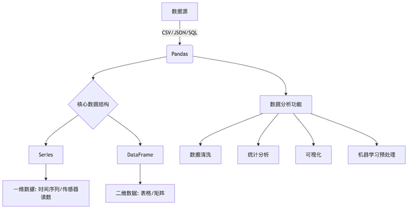
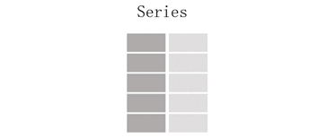
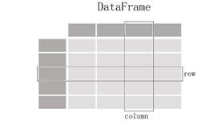
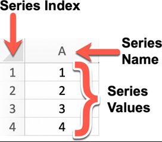
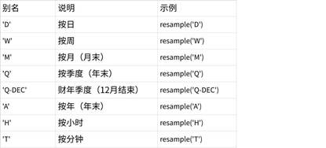
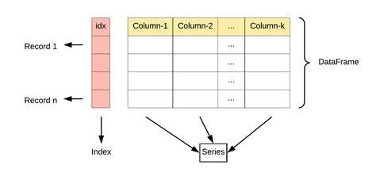
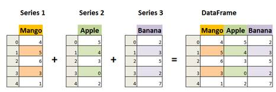
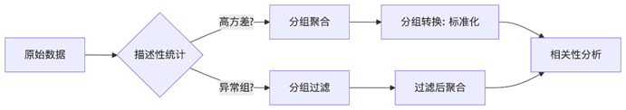

# 3.Pandas数据分析

## 3.1 Pandas 简介

### 3.1.1 Pandas 是什么？

Pandas
是
Python 数据分析工具链中最核心的库，充当数据读取、清洗、分析、统计、输出的高效工具。

Pandas
是一个开源的数据分析和数据处理库，它是基于
Python 编程语言的。

Pandas
提供了易于使用的数据结构和数据分析工具，特别适用于处理结构化数据，如表格型数据（类似于Excel表格）。

Pandas
是数据科学和分析领域中常用的工具之一，它使得用户能够轻松地从各种数据源中导入数据，并对数据进行高效的操作和分析。

Pandas是基于NumPy构建的专门为处理表格和混杂数据设计的Python库，其核心设计理念包括：

- **标签化数据结构**：提供带标签的轴(行索引和列名)

- **灵活处理缺失数据**：内置NaN处理机制

- **智能数据对齐**：自动按标签对齐数据

- **强大IO工具**：支持从CSV、Excel、SQL等20+数据源读写

- **时间序列处理**：原生支持日期时间处理和频率转换

**名称由来**

pandas这个名字源于panel
data（面板数据，这是多维结构化数据集在计量经济学中的术语）以及Python
data analysis（Python数据分析）。

pandas兼具numpy高性能的数组计算功能以及电子表格和关系型数据库（如SQL）灵活的数据处理功能。它提供了复杂精细的索引功能，能更加便捷地完成重塑、切片和切块、聚合以及选取数据子集等操作。

pandas功能：

- 有标签轴的数据结构

在数据结构中，每个轴都被赋予了特定的标签，这些标签用于标识和引用轴上的数据元素，使得数据的组织、访问和操作更加直观和方便

**应用场景**

| **工具** | **功能特色** | **适用场景** |
| --- | --- | --- |
| Excel | 图形界面，简单上手 | 人工分析、小规模数据 |
| SQL | 高效读写，最终数据源 | 数据库查询和联表 |
| Python<br> + Pandas | 算法和分析部署核心 | 数据清洗，统计分析，可视化等 |

1.
**与Excel对比**：

  - 优势：

    - 处理百万级数据不卡顿（Excel约100万行限制）

    - 可复用的分析流程（脚本
vs 手工操作）

    - 支持复杂数据转换（如：分组聚合、时间重采样）

  - 局限：

    - 可视化交互性较弱

    - 学习曲线较陡峭

2.
**与数据库对比**：

  - 优势：

    - 无需SQL知识即可分析

    - 适合探索性分析（即时反馈）

    - 丰富的数据清洗函数

  - 局限：

    - 数据量受内存限制

    - 不适合高并发访问

3.
**与纯Python代码对比**：

  - 优势：

    - 向量化运算比for循环快10-100倍

    - 内置统计分析方法（如：相关系数计算）

    - 丰富的数据透视功能

  - 局限：

    - 需要额外学习Pandas
API



**行业洞见**：根据2023年Kaggle调查，Pandas是数据科学家使用率最高的工具（占比93%），远超第二名Excel（占比32%）

### 3.1.2 了解
Pandas 核心数据结构：Series
和
DataFrame

Pandas
基于
Numpy，并提供了
2 大核心数据结构：

- **Series**：一维带有标签的数组

- **DataFrame**：二维表格结构，可看作多个 Series 的组合

用得最多的pandas对象是Series，一个一维的标签化数组对象，另一个是DataFrame，它是一个面向列的二维表结构。

| 特性 | Series | DataFrame |
| --- | --- | --- |
| **维度** | 一维 | 二维 |
| **索引** | 单索引 | 行索引+列名 |
| **数据存储** | 同质化数据类型 | 各列可不同数据类型 |
| **类比** | Excel单列 | 整张Excel工作表 |
| **创建方式** | pd.Series([1,2,3]) | pd.DataFrame({'col':[1,2,3]}) |

|  |  |
| --- | --- |

Pandas
与
Numpy 的关系与区别

就像学习数学要先掌握算术才能学代数一样，NumPy就是数据分析的"算术基础"。虽然可以直接用计算器（Pandas），但理解底层原理才能走得更远。

## 3.2 核心数据结构：Series

### 3.2.1 创建与访问

**什么是Series**

类似于 NumPy
一维数组，但增加了
"标签"，可以理解为「一维标签化数组」

Series
是
Pandas 中的一个核心数据结构，类似于一个一维的数组，具有数据和索引。

Series
可以存储任何数据类型（整数、浮点数、字符串等），并通过标签（索引）来访问元素。Series
的数据结构是非常有用的，因为它可以处理各种数据类型，同时保持了高效的数据操作能力，比如可以通过标签来快速访问和操作数据。



Series
特点：

- 一维数组：Series
中的每个元素都有一个对应的索引值。

- 索引： 每个数据元素都可以通过标签（索引）来访问，默认情况下索引是从
0 开始的整数，但你也可以自定义索引。

- 数据类型： Series 可以容纳不同数据类型的元素，包括整数、浮点数、字符串、Python
对象等。

- 大小不变性：Series
的大小在创建后是不变的，但可以通过某些操作（如
append 或
delete）来改变。

- 操作：Series
支持各种操作，如数学运算、统计分析、字符串处理等。

- 缺失数据：Series
可以包含缺失数据，Pandas
使用NaN（Not a
Number）来表示缺失或无值。

- 自动对齐：当对多个
Series 进行运算时，Pandas
会自动根据索引对齐数据，这使得数据处理更加高效。

我们可以使用
Pandas 库来创建一个
Series 对象，并且可以为其指定索引（Index）、名称（Name）以及值（Values）：

```python
import pandas as pd

s = pd.Series([10, 20, 30], index=["a", "b",
"c"])
```

**创建Series**

直接通过列表创建Series

```python
import pandas as pd

s = pd.Series([4, 7, -5, 3])

print(s)

# 0    4

# 1    7

# 2   -5

# 3    3

# dtype: int64
```

> Series的字符串表现形式为：索引在左边，值在右边。由于我们没有为数据指定索引，于是会自动创建一个0到N-1（N为数据的长度）的整数型索引。

- 通过列表创建Series时指定索引

```python
s = pd.Series([4, 7, -5, 3],
index=["a", "b", "c", "d"])

print(s)

# a    4

# b    7

# c   -5

# d    3

# dtype: int64
```

- 通过列表创建Series时指定索引和名称

```python
s = pd.Series([4, 7, -5, 3],
index=["a", "b", "c", "d"],name="hello_python")

print(s)

# a    4

# b    7

# c   -5

# d    3

# Name: hello_python, dtype: int6
```

**名称的作用，与变量名的区别**

在
Pandas 的 Series 中，name 参数用于给整个
Series 对象赋予一个名称。这个名称有以下几个用途：

1.
**标识作用**

- name
可以作为
Series 的标识，类似于给数据列取一个名字。

- 当你打印
Series 时，name 会显示在输出的最下方（如你的例子所示）。

2.
**DataFrame列名**

- 如果你将一个 Series 转换成 DataFrame 或与其他 DataFrame 合并，name 会自动成为列名。

- 例如：

```python
df = s.to_frame()  # 转换为 DataFrame，列名就是
"hello_python"

print(df)
```

输出：

```text
hello_python

a             4

b             7

c            -5

d             3
```

3.
**对齐操作**

- 在
Pandas 运算（如 concat、merge
等）时，name 可以帮助对齐数据。

4.
**导出数据**

- 当你将 Series 导出为 CSV 或其他格式时，name 会成为列名。

name 的主要作用是 给
Series 一个标识，方便后续数据处理、合并或导出。如果只是单独使用
Series，name 可能看起来作用不大，但在更复杂的数据操作中（如
DataFrame 整合），它会很有用。

- 直接通过字典创建Series

```python
dic = {"a": 4, "b": 7, "c": -5, "d": 3}

s = pd.Series(dic)

print(s)

# a    4

# b    7

# c   -5

# d    3

# dtype: int64

s1 = pd.Series(dic,index=["a","c"],name="aacc")

print(s1)

# a    4

# c   -5

# Name: aacc, dtype: int64
```

**访问Series数据**

以下是
Pandas 中访问
Series 数据的主要方法汇总表格：

| **方法分类** | **语法示例** | **描述** | **返回值** | **是否支持切片/布尔索引** |
| --- | --- | --- | --- | --- |
| **位置索引** | s.iloc[0] | 通过整数位置访问（从0开始） | 标量值 | 是 |
|  | s.iloc[1:3] | 位置切片（左闭右开） | Series |  |
| **标签索引** | s.loc['a'] | 通过索引标签访问 | 标量值 | 是 |
|  | s.loc[['a','b']] | 通过标签列表访问 | Series |  |
| **直接索引** | s[0] | 类似iloc（当索引非整数时可能混淆） | 标量值/Series | 是 |
|  | s['a'] | 类似loc（优先标签索引） |  |  |
| **布尔索引** | s[s > 3] | 通过布尔条件筛选 | Series | 是 |
|  | s[~(s > 3)] | 取反条件 |  |  |
| **函数访问** | s.at['a'] | 快速访问单个标签（类似loc但效率更高） | 标量值 | 否 |
|  | s.iat[0] | 快速访问单个位置（类似iloc但效率更高） |  |  |
| **头部/尾部** | s.head(3) | 访问前N行（默认5） | Series | 否 |
|  | s.tail(2) | 访问后N行（默认5） |  |  |
| **取唯一值** | s.unique() | 返回唯一值数组 | ndarray | 否 |
| **值计数** | s.value_counts() | 统计各值出现次数 | Series |  |

1.
**优先使用loc/iloc**：直接索引[]的行为可能因索引类型不同而变化，明确场景时建议显式使用loc（标签）或iloc（位置）。

2.
**切片差异**：

  - loc切片为闭区间（包含两端）

  - iloc切片为左闭右开（与Python列表一致）

3.
**布尔索引**：常用于条件过滤，如s[s > 3 & s < 10]。

```python
s = pd.Series([10, 20, 30, 40], index=['a', 'b', 'c',
'd'])

# 位置索引

print(s.iloc[0])  # 10

# 标签访问

s["a"]

# 标签索引

print(s.loc['b'])  # 20

# 布尔索引

print(s[s > 25])  # c:30, d:40

# 花式索引

print(s[['a', 'c']])  # a:10, c:30

#使用布尔索引从Series中筛选满足某些条件的值

bools = s > s.mean()  # 将大于平均值的元素标记为
True

print(bools)

# a    False

# b     True

# c     True

# d    False

# dtype: bool

print(s[bools])

# b    3.5

# c    6.8

# dtype: float64

# 使用where过滤

print(s.where(s > 20, -1))  # 小于等于20的值替换为-1
```

**Series的常用属性**

| **属性** | **说明** |
| --- | --- |
| **index** | Series的索引对象 |
| **values** | Series的值 |
| **dtype或dtypes** | Series的元素类型 |
| **shape** | Series的形状 |
| **ndim** | Series的维度 |
| **size** | Series的元素个数 |
| **name** | Series的名称 |
| **loc[]** | 显式索引，按标签索引或切片 |
| **iloc[]** | 隐式索引，按位置索引或切片 |
| **at[]** | 使用标签访问单个元素 |
| **iat[]** | 使用位置访问单个元素 |

```python
import pandas as pd

arrs = pd.Series([11,22,33,44,55],name="atguigu",index=["a","b","c","d","e"])

# print(arrs)

# index Series的索引对象

print(arrs.index)

for i in arrs.index:

print(i)

print(arrs.values) # values    Series的值

print(arrs.ndim)
# ndim  Series的维度

print(arrs.shape)
# shape Series的形状

print(arrs.size) # size  Series的元素个数

# dtype或dtypes
Series的元素类型

print(arrs.dtype)

print(arrs.dtypes)

# name  Series的名称

print(arrs.name)

# loc[] 显式索引，按标签索引或切片

print(arrs.loc["c"])

print(arrs.loc["c":"d"])

# iloc[]    隐式索引，按位置索引或切片

print(arrs.iloc[0])

print(arrs.iloc[0:3])

# at[]  使用标签访问单个元素

print(arrs.at["a"])

# iat[] 使用位置访问单个元素

print(arrs.iat[3])
```

### 3.2.2 Series的运算

```text
s1 = pd.Series([1, 2, 3, 4])

s2 = pd.Series([10, 20, 30, 40])

# 基本运算

print(s1 + s2)  # 对应位置相加

print(s1 * 2)   # 标量乘法
```

### 3.2.3 常用方法与统计

| **用途分类** | **方法** | **说明** | **示例代码** |
| --- | --- | --- | --- |
| 数据预览 | head() | 查看前 n 行数据，默认 5 行 | s.head(3) |
| 数据预览 | tail() | 查看后 n 行数据，默认 5 行 | s.tail(2) |
| 条件判断 | isin() | 判断元素是否包含在参数集合中 | s.isin([1,<br> 2]) |
| 缺失值处理 | isna() | 判断是否为缺失值（如 NaN<br> 或<br> None） | s.isna() |
| 聚合统计 | sum() | 求和，自动忽略缺失值 | s.sum() |
| 聚合统计 | mean() | 平均值 | s.mean() |
| 聚合统计 | min() | 最小值 | s.min() |
| 聚合统计 | max() | 最大值 | s.max() |
| 聚合统计 | var() | 方差 | s.var() |
| 聚合统计 | std() | 标准差 | s.std() |
| 聚合统计 | median() | 中位数 | s.median() |
| 聚合统计 | mode() | 众数（可返回多个） | s.mode() |
| 聚合统计 | quantile(q) | 分位数，q 取 0~1<br> 之间 | s.quantile(0.25) |
| 聚合统计 | describe() | 常见统计信息（count、mean、std、min、25%、50%、75%、max） | s.describe() |
| 频率统计 | value_counts() | 每个唯一值的出现次数 | s.value_counts() |
| 频率统计 | count() | 非缺失值数量 | s.count() |
| 频率统计 | nunique() | 唯一值个数（去重） | s.nunique() |
| 唯一处理 | unique() | 获取去重后的值数组 | s.unique() |
| 唯一处理 | drop_duplicates() | 去除重复项 | s.drop_duplicates() |
| 抽样分析 | sample() | 随机抽样 | s.sample(2) |
| 排序操作 | sort_index() | 按索引排序 | s.sort_index() |
| 排序操作 | sort_values() | 按值排序 | s.sort_values() |
| 替换值 | replace() | 替换值 | s.replace({1:<br> 100}) |
| 转换结构 | to_frame() | 将<br> Series 转为<br> DataFrame | s.to_frame() |
| 比较判断 | equals() | 判断两个<br> Series 是否完全相等 | s1.equals(s2) |
| 信息提取 | keys() | 返回<br> Series 的索引对象 | s.keys() |
| 统计关系 | corr() | 计算相关系数（默认皮尔逊） | s1.corr(s2) |
| 统计关系 | cov() | 协方差 | s1.cov(s2) |
| 可视化 | hist() | 绘制直方图（需安装<br> matplotlib） | s.hist() |
| 遍历操作 | items() | 返回索引和值的迭代器 | for<br> i, v in s.items(): print(i, v) |

```python
import pandas as pd

import numpy as np

arrs = pd.Series([11,22,np.nan,None,44,22],index=['a','b','c','d','e','f'])

# head()    查看前n行数据，默认5行

print(arrs.head())

# tail()    查看后n行数据，默认5行

print(arrs.tail(3))

# describe()    常见统计信息

print(arrs.describe())

# count()   非缺失值元素的个数

print(arrs.count())

# keys()    返回Series的索引对象

print(arrs.index)

print(arrs.keys())

# isin()    判断数组中的每一个元素是否包含在参数集合中

print(arrs.isin([11]))

# isna()    元素是否为缺失值

print(arrs.isna())

#统计

# sum() 求和，会忽略
Series 中的缺失值

print(arrs.sum())

# mean()    平均值

print(arrs.mean())

# min() 最小值

print(arrs.min())

# max() 最大值

print(arrs.max())

# var() 方差
每个元素与平均值的差 的平方
的和

print(arrs.var())

# std() 标准差
方差的平方根

print(arrs.std())

# print(arrs.var())

# median()  中位数

# 若数据集的元素个数为奇数，中位数就是排序后位于中间位置的数值。

# 若数据集的元素个数为偶数，中位数则是排序后中间两个数的平均值。

# 去除缺失值之后，arrs 就变成了 [11, 22, 44, 22]。

# 对 [11, 22,
44, 22] 进行排序，得到 [11,
22, 22, 44]

print(arrs.median())

# mode()    众数

print(arrs.mode())

# quantile()    指定位置的分位数，如quantile(0.5)

# 分位数：分位数是把一组数据按照从小到大的顺序排列后，分割成若干等份的数值点。

# 0.25 分位数就是将数据从小到大排序后，位于 25% 位置处的数值。

# 插值方法：当计算分位数时，若位置不是整数，就需要借助插值方法来确定分位数值。# "midpoint" 插值方法是指当分位数位置处于两个数据点之间时，取这两个数据点的

# 平均值作为分位数值。

# 对于有
n个数据点的有序数据集，q分位数的位置 i可以通过公式 i=(n−1)q来计

# 算。这里
n=4，q=0.25，则 i=(4−1)×0.25=0.75。这意味着
0.25 分位数处于第一个# 数据点（值为 11）和第二个数据点（值为
22）之间。使用 "midpoint" 插值方法，

# 分位数值就是这两个数据点的平均值，即
(11+22)÷2=16.5

print(arrs.quantile(0.25, interpolation="midpoint"))

print(len(arrs))

# drop_duplicates() 去重  这里可以看出，底层None也作为NaN处理

print(arrs.drop_duplicates())

# unique()  去重后的数组

print(arrs.unique())

# nunique() 去重后非缺失值元素元素个数

print(arrs.nunique())

# sample()  随机采样

print(arrs.sample())

# value_counts()    每个元素的个数

print(arrs.value_counts())

# sort_index()  按索引排序

print(arrs.sort_index())

# sort_values() 按值排序

print(arrs.sort_values())

# replace() 用指定值代替原有值

print(arrs.replace(22,"haha"))

# to_frame()    将Series转换为DataFrame

print(arrs.to_frame())

# equals()  判断两个Series是否相同

arr1 = pd.Series([1,2,3])

arr2 = pd.Series([1,2,3])

print(arr1.equals(arr2))

# corr()    计算与另一个Series的相关系数

# arr1.corr(arr2)：由于
arr1 和 arr2 的值完全相同，它们之间是完全正相关的，

#因此相关系数为
1。

# arr1.corr(arr3)：arr1
的值是递增的，而 arr3 的值是递减的，它们之间是完全

# 负相关的，所以相关系数为
-1。

# arr1.corr(arr4)：arr1
和 arr4 的值都是递增的，且变化趋势一致，它们之间是

# 完全正相关的，相关系数为
1。

# arr5.corr(arr6)：arr5
和 arr6 的值之间没有明显的线性关系，它们的相关系数

# 为 0。

arr3 = pd.Series([3,2,1])

arr4 = pd.Series([6,7,8])

arr5 = pd.Series([1,
-1, 1, -1])

arr6 = pd.Series([1, 1, -1, -1])

print(arr1.corr(arr2))

print(arr1.corr(arr3))

print(arr1.corr(arr4))

print(arr5.corr(arr6))

# cov() 计算与另一个Series的协方差

# 协方差用于衡量两个变量的总体误差，其值的正负表示两个变量的变化方向关系：

# 正值表示同向变化，负值表示反向变化。

print(arr1.cov(arr3))
```

### 3.2.4 统计实例

**学生成绩统计**

创建一个包含10名学生数学成绩的Series，成绩范围在50-100之间。计算平均分、最高分、最低分，并找出高于平均分的学生人数。

```python
import pandas as pd

import numpy as np

# 生成随机成绩

np.random.seed(42)

scores = pd.Series(np.random.randint(50, 101, 10),

index=['学生'+str(i) for i in range(1, 11)])

# 你的代码...
```

```python
import pandas as pd

import numpy as np

# 生成随机成绩

np.random.seed(42)

scores = pd.Series(np.random.randint(50, 101, 10),

index=['学生'+str(i) for i in range(1, 11)])

# 计算统计量

mean_score = scores.mean()

max_score = scores.max()

min_score = scores.min()

above_avg = scores[scores > mean_score].count()

print(f"平均分: {mean_score:.1f}")

print(f"最高分: {max_score}")

print(f"最低分: {min_score}")

print(f"高于平均分的学生人数:
{above_avg}")
```

**温度数据分析**

给定某城市一周每天的最高温度Series，完成以下任务：

找出温度超过30度的天数

计算平均温度

将温度从高到低排序

找出温度变化最大的两天

```python
temperatures = pd.Series([28, 31, 29, 32, 30, 27, 33],

index=['周一', '周二', '周三', '周四', '周五', '周六', '周日'])
```

diff

abs

nlargest()

tolist()

```python
temperatures = pd.Series([28, 31, 29, 32, 30, 27, 33],

index=['周一', '周二', '周三', '周四', '周五', '周六', '周日'])

# 1. 找出温度超过30度的天数

hot_days = temperatures[temperatures > 30].count()

# 2. 计算平均温度

avg_temp = temperatures.mean()

# 3. 将温度从高到低排序

sorted_temp = temperatures.sort_values(ascending=False)

# 4. 找出温度变化最大的两天

temp_diff = temperatures.diff().abs()

max_diff_days = temp_diff.nlargest(2).index.tolist()

print(f"超过30度的天数: {hot_days}")

print(f"平均温度:
{avg_temp:.1f}")

print("温度排序:\n", sorted_temp)

print(f"温度变化最大的两天:
{max_diff_days}")
```

**股票价格分析**

给定某股票连续10个交易日的收盘价Series：

计算每日收益率（当日收盘价/前日收盘价 - 1）

找出收益率最高和最低的日期

计算波动率（收益率的标准差）

```python
prices = pd.Series([102.3, 103.5, 105.1, 104.8, 106.2,
107.0, 106.5, 108.1, 109.3, 110.2],

index=pd.date_range('2023-01-01', periods=10))
```

```python
prices = pd.Series([102.3, 103.5, 105.1, 104.8, 106.2,
107.0, 106.5, 108.1, 109.3, 110.2],

index=pd.date_range('2023-01-01', periods=10))

# 1. 计算每日收益率

returns = prices.pct_change()

# 2. 找出收益率最高和最低的日期

max_return_date = returns.idxmax()

min_return_date = returns.idxmin()

# 3. 计算波动率

volatility = returns.std()

print("每日收益率:\n", returns)

print(f"收益率最高的日期:
{max_return_date}")

print(f"收益率最低的日期:
{min_return_date}")

print(f"波动率: {volatility:.4f}")
```

**销售数据分析**

某产品过去12个月的销售量Series：

计算季度平均销量（每3个月为一个季度）

找出销量最高的月份

计算月环比增长率

找出连续增长超过2个月的月份

```python
sales = pd.Series([120, 135, 145, 160, 155, 170, 180,
175, 190, 200, 210, 220],

index=pd.date_range('2022-01-01', periods=12, freq='M'))
```

resample('Q')

常用频率别名（rule 参数）



```python
sales = pd.Series([120, 135, 145, 160, 155, 170, 180,
175, 190, 200, 210, 220],

index=pd.date_range('2022-01-01', periods=12, freq='M'))

# 1. 计算季度平均销量

quarterly_avg = sales.resample('Q').mean()

# 2. 找出销量最高的月份

max_sales_month = sales.idxmax()

# 3. 计算月环比增长率

mom_growth = sales.pct_change()

# 4. 找出连续增长超过2个月的月份

growth_mask = mom_growth > 0

consecutive_growth = growth_mask.rolling(3).sum() >= 2

growth_months = sales[consecutive_growth].index

print("季度平均销量:\n", quarterly_avg)

print(f"销量最高的月份:
{max_sales_month}")

print("月环比增长率:\n", mom_growth)

print("连续增长超过2个月的月份:", growth_months.tolist())
```

**数据合并与计算**

有两个Series分别记录了某产品在两个城市的日销量：

计算两个城市的总日销量

找出哪个城市的销量更高

计算两个城市销量的相关系数

```python
city_a = pd.Series([120, 135, 140, 130, 145],

index=pd.date_range('2023-01-01', periods=5))

city_b = pd.Series([110, 125, 150, 140, 130],

index=pd.date_range('2023-01-01', periods=5))
```

答案：

```python
city_a = pd.Series([120, 135, 140, 130, 145],

index=pd.date_range('2023-01-01', periods=5))

city_b = pd.Series([110, 125, 150, 140, 130],

index=pd.date_range('2023-01-01', periods=5))

# 1. 计算两个城市的总日销量

total_sales = city_a + city_b

# 2. 找出哪个城市的销量更高

city_a_total = city_a.sum()

city_b_total = city_b.sum()

higher_sales_city = 'A' if city_a_total > city_b_total else 'B'

# 3. 计算两个城市销量的相关系数

correlation = city_a.corr(city_b)

print("总日销量:\n", total_sales)

print(f"总销量更高的城市:
{higher_sales_city}")

print(f"两个城市销量的相关系数:
{correlation:.2f}")
```

## 3.3 核心数据结构：DataFrame

### 3.3.1 创建与访问

**什么是DataFrame？**

DataFrame
是
Pandas 中的核心数据结构之一，多行多列表格数据，类似于 **Excel表格** 或 **SQL查询结果**。<br>
 它是一个 **二维表格结构**，具有行索引（index）和列标签（columns）。

```python
df = pd.DataFrame({

"name": ["Alice", "Bob"],

"score": [90, 80]

})
```



DataFrame中的数据是以一个或多个二维块存放的（而不是列表、字典或别的一维数据结构）。它可以被看做由Series组成的字典（共同用一个索引）。提供了各种功能来进行数据访问、筛选、分割、合并、重塑、聚合以及转换等操作，广泛用于数据分析、清洗、转换、可视化等任务。



**DataFrame的创建**

```python
# 通过series来创建

import pandas as pd

import numpy as np

np.random.seed(42)

s1 = pd.Series(np.random.randint(0,10,6))

np.random.seed(41)

s2 = pd.Series(np.random.randint(0,20,6))

df = pd.DataFrame({"s1":s1,"s2":s2})
```

直接通过字典创建DataFrame

```python
import pandas as pd

df = pd.DataFrame({    "name": ["Alice",
"Bob"],    "score": [90, 80]})

print(df)

df = pd.DataFrame({"id": [101, 102, 103],

"name":
["张三", "李四", "王五"], "age": [20, 30, 40]})

print(df)

#     id name  age

# 0  101   张三   20

# 1  102   李四   30

# 2  103   王五   40
```

通过字典创建时指定列的顺序和行索引

```bash
df = pd.DataFrame(

data={"age": [20, 30, 40],

"name": ["张三", "李四", "王五"]},

columns=["name", "age"], index=[101, 102, 103]

)

print(df)

#     name  age

# 101   张三
20

# 102   李四
30

# 103   王五
40
```

**获取DataFrame数据**

| **方法分类** | **语法示例** | **描述** | **返回值类型** | **是否支持切片/条件索引** |
| --- | --- | --- | --- | --- |
| **列选择** | df['col'] | 选择单列（返回Series） | Series | ❌ |
|  | df[['col1', 'col2']] | 选择多列（返回DataFrame） | DataFrame |  |
| **行选择** | df.loc[row_label] | 通过行标签选择单行（返回Series） | Series | ✅（标签切片） |
|  | df.loc[start:end] | 通过标签切片选择多行（闭区间） | DataFrame |  |
|  | df.iloc[row_index] | 通过行位置选择单行（从0开始） | Series | ✅（位置切片） |
|  | df.iloc[start:end] | 通过位置切片选择多行（左闭右开） | DataFrame |  |
| **行列组合选择** | df.loc[row_labels, col_labels] | 通过标签选择行和列（如df.loc['a':'b', ['col1','col2']]） | Series/DataFrame | ✅ |
|  | df.iloc[row_idx, col_idx] | 通过位置选择行和列（如df.iloc[0:2, [1,3]]） | Series/DataFrame |  |
| **条件筛选** | df[df['col'] > 3] | 通过布尔条件筛选行 | DataFrame | ✅ |
|  | df.query("col1 > 3 & col2 <<br> 10") | 使用表达式筛选（需字符串表达式） | DataFrame |  |
| **快速访问** | df.at[row_label, 'col'] | 快速访问单个值（标签索引，高效） | 标量值 | ❌ |
|  | df.iat[row_idx, col_idx] | 快速访问单个值（位置索引，高效） | 标量值 |  |
| **头部/尾部** | df.head(n) | 返回前n行（默认5） | DataFrame | ❌ |
|  | df.tail(n) | 返回后n行（默认5） | DataFrame |  |
| **样本抽样** | df.sample(n=3) | 随机抽取n行 | DataFrame |  |
| **索引重置** | df.reset_index() | 重置索引（原索引变为列） | DataFrame |  |
| **设置索引** | df.set_index('col') | 指定某列作为新索引 | DataFrame |  |

1.
**loc
vs iloc**

  - loc：基于**标签**（index/column
names），切片为**闭区间**（如df.loc['a':'c']包含'c'）。

  - iloc：基于**整数位置**（从0开始），切片为**左闭右开**（如df.iloc[0:2]不包含索引2）。

2.
**布尔条件筛选**

  - 支持组合条件（需用&、|，并用括号分隔条件）：

```python
df[(df['col1'] > 3) & (df['col2'] == 'A')]
```

3.
**at/iat vs
loc/iloc**

  - at/iat：仅用于**访问单个值**，速度更快。

  - loc/iloc：支持多行/列选择，功能更灵活。

获取一列数据

```python
# 访问数据

print(df['name'])  #访问某列数据

print(df.score)

# df["col"] / df.col

df["name"]       # 返回 Series

df.name

df[["name"]]     # 返回 DataFrame
```

获取多列数据

```python
df[["date", "temp_max", "temp_min"]]  # 获取多列数据

print(df[['name','score']]) # 访问多列数据
```

获取行数据

**loc：**通过行标签获取数据

```python
df.loc[1]
# 获取行标签为1的数据

df.loc[[1, 10, 100]]  # 获取行标签分别为1、10、100的数据
```

**iloc：**通过行位置获取数据

```python
df.iloc[0]
# 获取行位置为0的数据

df.iloc[-1]
# 获取行位置为最后一位的数据
```

获取指定单元格

```python
df.loc[101, "name"]    # 标签访问

df.iloc[0, 1]          # 位置访问

df.loc[1, "precipitation"]
# 获取行标签为1，列标签为precipitation的数据

df.loc[:, "precipitation"]  # 获取所有行，列标签为precipitation的数据

df.iloc[:, [3, 5, -1]]  # 获取所有行，列位置为3，5，最后一位的数据

df.iloc[:10, 2:6]  # 获取前10行，列位置为2、3、4、5的数据

df.loc[:10,
["date", "precipitation", "temp_max", "temp_min"]]  # 通过行列标签获取数据
```

查看部分数据

通过head()、tail()获取前n行或后n行

```python
print(df.head())

print(df.tail(10))
```

使用布尔索引筛选数据

```bash
# 条件筛选

df['score']>70

print(df[df.score>70])

print(df[(df['score']>70) & (df['age']<20)])

# 随机抽样

df.sample(2)
```

**常用属性**

| **属性** | **说明** |
| --- | --- |
| **index** | DataFrame的行索引 |
| **columns** | DataFrame的列标签 |
| **values** | DataFrame的值 |
| **ndim** | DataFrame的维度 |
| **shape** | DataFrame的形状 |
| **size** | DataFrame的元素个数 |
| **dtypes** | DataFrame的元素类型 |
| **T** | 行列转置 |
| **loc[]** | 显式索引，按行列标签索引或切片 |
| **iloc[]** | 隐式索引，按行列位置索引或切片 |
| **at[]** | 使用行列标签访问单个元素 |
| **iat[]** | 使用行列位置访问单个元素 |

```python
import pandas as pd

df = pd.DataFrame(data={"id": [101, 102, 103],
"name":
["张三", "李四", "王五"], "age": [20, 30, 40]},index=["aa", "bb", "cc"])

# index DataFrame的行索引

print(df.index)

# columns   DataFrame的列标签

print(df.columns)

# values    DataFrame的值

print(df.values)

# ndim  DataFrame的维度

print(df.ndim)

# shape DataFrame的形状

print(df.shape)

# size  DataFrame的元素个数

print(df.size)

# dtypes    DataFrame的元素类型

print(df.dtypes)

# T 行列转置

print(df.T)

# loc[] 显式索引，按行列标签索引或切片
逗号前是行切片规则，后是列切片规则

print(df.loc["aa":"cc"])

print(df.loc[:,["id","name"]])

# iloc[]    隐式索引，按行列位置索引或切片

print(df.iloc[0:1])

print(df.iloc[0:3,2])

print("----------")

# at[]  使用行列标签访问单个元素

print(df.at["aa","name"])

# iat[] 使用行列位置访问单个元素

print(df.iat[0,1])
```

### 3.3.2 常用方法与统计

| **方法** | **说明** |
| --- | --- |
| **head()** | 查看前n行数据，默认5行 |
| **tail()** | 查看后n行数据，默认5行 |
| **isin()** | 元素是否包含在参数集合中 |
| **isna()** | 元素是否为缺失值 |
| **sum()** | 求和 |
| **mean()** | 平均值 |
| **min()** | 最小值 |
| **max()** | 最大值 |
| **var()** | 方差 |
| **std()** | 标准差 |
| **median()** | 中位数 |
| **mode()** | 众数 |
| **quantile()** | 指定位置的分位数，如quantile(0.5) |
| **describe()** | 常见统计信息 |
| **info()** | 基本信息 |
| **value_counts()** | 每个元素的个数 |
| **count()** | 非空元素的个数 |
| **drop_duplicates()** | 去重 |
| **sample()** | 随机采样 |
| **replace()** | 用指定值代替原有值 |
| **equals()** | 判断两个DataFrame是否相同 |
| **cummax()** | 累计最大值 |
| **cummin()** | 累计最小值 |
| **cumsum()** | 累计和 |
| **cumprod()** | 累计积 |
| **diff()** | 一阶差分，对序列中的元素进行差分运算，也就是用当前元素减去前一个元素得到差值，默认情况下，它会计算一阶差分，即相邻元素之间的差值。参数：<br> periods：整数，默认为 1。表示要向前或向后移动的周期数，用于计算差值。正数表示向前移动，负数表示向后移动。<br> axis：指定计算的轴方向。0 或 'index' 表示按列计算，1 或 'columns' 表示按行计算，默认值为 0。 |
| **sort_index()** | 按行索引排序 |
| **sort_values()** | 按某列的值排序，可传入列表来按多列排序，并通过ascending参数设置升序或降序 |
| **nlargest()** | 返回某列最大的n条数据 |
| **nsmallest()** | 返回某列最小的n条数据 |

```bash
import pandas as pd

df = pd.DataFrame(data={"id": [101, 102, 103,104,105,106,101], "name": ["张三", "李四", "王五","赵六","冯七","周八","张三"], "age": [10, 20, 30, 40, None, 60,10]},index=["aa", "bb", "cc", "dd", "ee", "ff","aa"])

# head()    查看前n行数据，默认5行

print(df.head())

# tail()    查看后n行数据，默认5行

print(df.tail())

# isin()    元素是否包含在参数集合中

print(df.isin([103,106]))

# isna()    元素是否为缺失值

print(df.isna())

# sum() 求和

print(df["age"].sum())

# mean()    平均值

print(df["age"].mean())

# min() 最小值

print(df["age"].min())

# max() 最大值

print(df["age"].max())

# var() 方差

print(df["age"].var())

# std() 标准差

print(df["age"].std())

# median()  中位数

print(df["age"].median())

# mode()    众数

print(df["age"].mode())

# quantile()    指定位置的分位数，如quantile(0.5)

print(df["age"].quantile(0.5))

# describe()    常见统计信息

print(df.describe())

# info()    基本信息

print(df.info())

# value_counts()    每个元素的个数

print(df.value_counts())

# count()   非空元素的个数

print(df.count())

# drop_duplicates() 去重  duplicated()判断是否为重复行

print(df.duplicated(subset="age"))

# sample()  随机采样

print(df.sample())

# replace() 用指定值代替原有值

print("----------------")

print(df.replace(20,"haha"))

# cummax()  累计最大值

df3 = pd.DataFrame({'A':
[2, 5, 3, 7, 4],'B':
[1, 6, 2, 8, 3]})

# 按列
等价于axis=0 默认

print(df3.cummax(axis="index"))

# 按行
等价于axis=1

print(df3.cummax(axis="columns"))

# cummin()  累计最小值

print(df3.cummin())

# cumsum()  累计和

print(df3.cumsum())

# cumprod() 累计积

print(df3.cumprod())

# diff()    一阶差分

print(df3.diff())

# sort_index()  按行索引排序

print(df.sort_index())

# sort_values() 按某列的值排序，可传入列表来按多列排序，并通过ascending参数设置升序或降序

print(df.sort_values(by="age"))

# nlargest()    返回某列最大的n条数据

print(df.nlargest(n=2,columns="age"))

# nsmallest()   返回某列最小的n条数据

print(df.nsmallest(n=1,columns="age"))
```

在Pandas的 DataFrame 方法里，axis 是一个非常重要的参数，它用于指定操作的方向。

axis 参数可以取两个主要的值，即 0 或 'index'，以及 1 或 'columns' ，其含义如下：

- axis=0 或 axis='index'：表示操作沿着行的方向进行，也就是对每一列的数据进行处理。例如，当计算每列的均值时，就是对每列中的所有行数据进行计算。

- axis=1 或 axis='columns'：表示操作沿着列的方向进行，也就是对每行的数据进行处理。例如，当计算每行的总和时，就是对每行中的所有列数据进行计算。

### 3.3.3 运算

标量运算

标量与每个元素进行计算。

```python
df = pd.DataFrame(data={"age": [20, 30, 40, 10], "name": ["张三", "李四", "王五", "赵六"]},

columns=["name", "age"],

index=[101, 104, 103, 102],

)

print(df * 2)

#      name  age

# 101  张三张三
40

# 104  李四李四
60

# 103  王五王五
80

# 102  赵六赵六
20

df1 = pd.DataFrame(

data={"age": [10, 20, 30, 40], "name": ["张三", "李四", "王五", "赵六"]},

columns=["name", "age"],

index=[101, 102, 103, 104],

)

df2 = pd.DataFrame(

data={"age": [10, 20, 30, 40], "name": ["张三", "李四", "王五", "田七"]},

columns=["name", "age"],

index=[102, 103, 104, 105],

)

print(df1 + df2)

#      name   age

# 101   NaN   NaN

# 102  李四张三
30.0

# 103  王五李四
50.0

# 104  赵六王五
70.0

# 105   NaN   NaN
```

### 3.3.4 案例练习

**案例1：学生成绩分析**

**场景**：某班级的学生成绩数据如下，请完成以下任务：

1.
计算每位学生的总分和平均分。

2.
找出数学成绩高于90分或英语成绩高于85分的学生。

3.
按总分从高到低排序，并输出前3名学生。

```python
import pandas as pd

data = {

'姓名': ['张三', '李四', '王五', '赵六', '钱七'],

'数学': [85, 92, 78, 88, 95],

'英语': [90, 88, 85, 92, 80],

'物理': [75, 80, 88, 85, 90]

}

df = pd.DataFrame(data)

# 1. 计算总分和平均分

df['总分'] = df[['数学', '英语', '物理']].sum(axis=1)

df['平均分'] = df['总分'] / 3

# 2. 找出数学>90或英语>85的学生

high_scores = df[(df['数学'] > 90) | (df['英语'] > 85)]

# 3. 按总分排序并输出前3名

top3 = df.sort_values('总分',
ascending=False).head(3)

print("总分和平均分：\n", df)

print("\n数学>90或英语>85的学生：\n",
high_scores)

print("\n总分前3名学生：\n", top3)
```

**案例2：销售数据分析**

**场景**：某公司销售数据如下，请完成以下任务：

1.
计算每种产品的总销售额（销售额
= 单价
× 销量）。

2.
找出销售额最高的产品。

3.
按销售额从高到低排序，并输出所有产品信息。

```python
import pandas as pd

data = {

'产品名称': ['A', 'B', 'C',
'D'],

'单价': [100, 150, 200, 120],

'销量': [50, 30, 20, 40]

}

df = pd.DataFrame(data)

# 1. 计算总销售额

df['销售额'] = df['单价'] * df['销量']

# 2. 找出销售额最高的产品

max_sales = df[df['销售额'] == df['销售额'].max()]

# 3. 按销售额排序

sorted_df = df.sort_values('销售额', ascending=False)

print("销售额计算：\n", df)

print("\n销售额最高的产品：\n",
max_sales)

print("\n按销售额排序：\n",
sorted_df)
```

**案例3：员工考勤统计**

**场景**：某部门员工考勤数据如下，请完成以下任务：

1.
计算每位员工的出勤率（出勤率
= 出勤天数
/ 工作日总数）。

2.
标记出勤率低于80%的员工。

3.
按出勤率从高到低排序。

```python
import pandas as pd

data = {

'姓名': ['张三', '李四', '王五', '赵六'],

'出勤天数': [20, 15, 18,
22],

'工作日总数': [25, 20, 25, 25]

}

df = pd.DataFrame(data)

# 1. 计算出勤率

df['出勤率'] = (df['出勤天数'] / df['工作日总数']).round(2)

# 2. 标记出勤率<80%的员工

df['需关注'] = df['出勤率'] < 0.8

# 3. 按出勤率排序

sorted_df = df.sort_values('出勤率', ascending=False)

print("出勤率统计：\n", df)

print("\n出勤率排序：\n",
sorted_df)
```

**案例4：电影评分分析**

**场景**：某电影评分数据如下，请完成以下任务：

1.
计算每部电影的平均评分。

2.
找出评分高于8.5的电影。

3.
按平均评分从高到低排序。

```python
import pandas as pd

data = {

'电影名称': ['电影A', '电影B', '电影C', '电影D'],

'评分1': [9.0, 8.5, 8.0, 7.5],

'评分2': [8.5, 9.0, 8.5, 8.0],

'评分3': [9.5, 8.0, 7.5, 7.0]

}

df = pd.DataFrame(data)

# 1. 计算平均评分

df['平均评分'] = df[['评分1', '评分2', '评分3']].mean(axis=1).round(2)

# 2. 找出评分>8.5的电影

high_rated = df[df['平均评分'] > 8.5]

# 3. 按平均评分排序

sorted_df = df.sort_values('平均评分',
ascending=False)

print("平均评分：\n", df)

print("\n评分>8.5的电影：\n", high_rated)

print("\n按评分排序：\n",
sorted_df)
```

**案例5：股票价格分析**

**场景**：某股票价格数据如下，请完成以下任务：

1.
计算每日股价的涨跌幅（涨跌幅
= (当日收盘价
- 前一日收盘价)
/ 前一日收盘价）。

2.
找出涨幅超过5%的日期。

3.
按日期排序，并输出涨跌幅最高的日期。

```python
import pandas as pd

data = {

'日期': ['2023-01-01',
'2023-01-02', '2023-01-03', '2023-01-04'],

'收盘价': [100, 105, 110, 102]

}

df = pd.DataFrame(data)

df['日期'] = pd.to_datetime(df['日期'])

# 1. 计算涨跌幅

df['涨跌幅'] = df['收盘价'].pct_change().round(4)

# 2. 找出涨幅>5%的日期

high_increase = df[df['涨跌幅'] > 0.05]

# 3. 按日期排序并输出最高涨跌幅日期

sorted_df = df.sort_values('日期')

max_increase_date = df.loc[df['涨跌幅'].idxmax(),
'日期']

print("涨跌幅计算：\n", df)

print("\n涨幅>5%的日期：\n", high_increase)

print("\n涨跌幅最高的日期：\n",
max_increase_date)
```

**案例6：电商用户行为分析（基础版）**

**场景**：某电商平台的用户行为数据如下，请完成以下任务：

1.
计算每位用户的**总消费金额**（消费金额 = 商品单价 × 购买数量）

2.
找出**消费金额最高的用户**，并输出其所有信息

3.
计算所有用户的**平均消费金额**（保留2位小数）

4.
统计**电子产品**的总购买数量

```python
import pandas as pd

data = {

'用户ID': [101, 102, 103, 104,
105],

'用户名': ['Alice', 'Bob',
'Charlie', 'David', 'Eve'],

'商品类别': ['电子产品', '服饰', '电子产品', '家居', '服饰'],

'商品单价': [1200, 300, 800,
150, 200],

'购买数量': [1, 3, 2, 5, 4]

}

df = pd.DataFrame(data)
```

参考答案（不使用groupby和apply）

```python
import pandas as pd

data = {

'用户ID': [101, 102, 103, 104,
105],

'用户名': ['Alice', 'Bob',
'Charlie', 'David', 'Eve'],

'商品类别': ['电子产品', '服饰', '电子产品', '家居', '服饰'],

'商品单价': [1200, 300, 800,
150, 200],

'购买数量': [1, 3, 2, 5, 4]

}

df = pd.DataFrame(data)

# 1. 计算总消费金额

df['消费金额'] = df['商品单价'] * df['购买数量']

# 2. 找出消费金额最高的用户

max_spend_user = df[df['消费金额']
== df['消费金额'].max()]

# 3. 计算平均消费金额

avg_spend = round(df['消费金额'].mean(), 2)

# 4. 统计电子产品的总购买数量

electronic_total = df[df['商品类别']
== '电子产品']['购买数量'].sum()

print("用户消费分析：\n", df)

print("\n消费金额最高的用户：\n",
max_spend_user)

print("\n平均消费金额：", avg_spend)

print("电子产品总购买数量：", electronic_total)
```

**输出示例**：

```text
用户消费分析：

用户ID
用户名  商品类别  商品单价  购买数量  消费金额

0   101    Alice  电子产品   1200
1   1200

1   102      Bob     服饰    300
3    900

2   103  Charlie  电子产品
800       2   1600

3   104    David     家居    150
5    750

4   105      Eve     服饰    200
4    800

消费金额最高的用户：

用户ID
用户名  商品类别  商品单价  购买数量  消费金额

2   103  Charlie  电子产品
800       2   1600

平均消费金额： 1050.0

电子产品总购买数量： 3
```

## 3.4 数据的导入与导出

导出数据

| **方法** | **说明** |
| --- | --- |
| **to_csv()** | 将数据保存为csv格式文件，数据之间以逗号分隔，可通过sep参数设置使用其他分隔符，可通过index参数设置是否保存行标签，可通过header参数设置是否保存列标签。 |
| **to_pickle()** | 如要保存的对象是计算的中间结果，或者保存的对象以后会在Python中复用，可把对象保存为.pickle文件。如果保存成pickle文件，只能在python中使用。文件的扩展名可以是.p、.pkl、.pickle。 |
| **to_excel()** | 保存为Excel文件，需安装openpyxl包。 |
| **to_clipboard()** | 保存到剪切板。 |
| **to_dict()** | 保存为字典。 |
| **to_hdf()** | 保存为HDF格式，需安装tables包。 |
| **to_html()** | 保存为HTML格式，需安装lxml、html5lib、beautifulsoup4包。 |
| **to_json()** | 保存为JSON格式。 |
| **to_feather()** | feather是一种文件格式，用于存储二进制对象。feather对象也可以加载到R语言中使用。feather格式的主要优点是在Python和R语言之间的读写速度要比csv文件快。feather数据格式通常只用中间数据格式，用于Python和R之间传递数据，一般不用做保存最终数据。需安装pyarrow包。 |
| **to_sql()** | 保存到数据库。 |

```python
import os

import pandas as pd

os.makedirs("data", exist_ok=True)

df = pd.DataFrame({"age": [20, 30, 40, 10],
"name":
["张三", "李四", "王五", "赵六"], "id": [101, 102, 103, 104]})

df.set_index("id", inplace=True)

df.to_csv("data/df.csv")

df.to_csv("data/df.tsv", sep="\t")  # 设置分隔符为 \t

df.to_csv("data/df_noindex.csv", index=False)  # index=False 不保存行索引

df.to_pickle("data/df.pkl")

df.to_excel("data/df.xlsx")

df.to_clipboard()

df_dict = df.to_dict()

df.to_hdf("data/df.h5", key="df")

df.to_html("data/df.html")

df.to_json("data/df.json")

df.to_feather("data/df.feather")
```

导入数据

| **方法** | **说明** |
| --- | --- |
| **read_csv()** | 加载csv格式的数据。可通过sep参数指定分隔符，可通过index_col参数指定行索引。 |
| **read_pickle()** | 加载pickle格式的数据。 |
| **read_excel()** | 加载Excel格式的数据。 |
| **read_clipboard()** | 加载剪切板中的数据。 |
| **read_hdf()** | 加载HDF格式的数据。 |
| **read_html()** | 加载HTML格式的数据。 |
| **read_json()** | 加载JSON格式的数据。 |
| **read_feather()** | 加载feather格式的数据。 |
| **read_sql()** | 加载数据库中的数据。 |

```python
df_csv = pd.read_csv("data/df.csv", index_col="id")  # 指定行索引

df_tsv = pd.read_csv("data/df.tsv", sep="\t")  # 指定分隔符

df_pkl = pd.read_pickle("data/df.pkl")

df_excel = pd.read_excel("data/df.xlsx", index_col="id")

df_clipboard = pd.read_clipboard(index_col="id")

df_from_dict = pd.DataFrame(df_dict)

df_hdf = pd.read_hdf("data/df.h5", key="df")

df_html = pd.read_html("data/df.html", index_col=0)[0]

df_json = pd.read_json("data/df.json")

df_feather = pd.read_feather("data/df.feather")

print(df_csv)

print(df_tsv)

print(df_pkl)

print(df_excel)

print(df_clipboard)

print(df_from_dict)

print(df_hdf)

print(df_html)

print(df_json)

print(df_feather)
```

## 3.5 数据清洗与预处理

| **章节** | **核心内容** | **关键知识点** |
| --- | --- | --- |
| **1.缺失值处理** | 检测、删除和填充缺失值的方法 | isna(), dropna(), fillna(), 前向/后向填充, 均值/中位数填充 |
| **2.重复数据处理** | 识别和删除重复行 | duplicated(), drop_duplicates(), 按列去重, 保留首次/最后一次出现 |
| **3.数据类型转换** | 强制类型转换、日期/分类数据处理 | astype(), to_datetime(), 分类数据优化, 数值格式化 |
| **4.数据重塑与变形** | 行列转置、宽表长表转换、分列操作 | T转置, melt(), pivot(), str.split()分列 |
| **5.文本数据处理** | 字符串清洗、正则提取、大小写转换 | str.lower(), str.replace(), str.extract(), 空格处理 |
| **6.数据分箱与离散化** | 数值分箱（等宽/等频） | pd.cut(), pd.qcut(), 离散化应用场景 |
| **7.其他常用转换** | 重命名列、索引操作、函数应用、内存优化 | rename(), set_index(), apply(), 类型优化减少内存占用 |

### 1. 缺失值处理

| **方法/操作** | **语法示例** | **描述** |
| --- | --- | --- |
| 检测缺失值 | df.isna() 或 df.isnull() | 返回布尔矩阵，标记缺失值（NaN或None） |
| 统计缺失值 | df.isna().sum() | 每列缺失值数量统计 |
| 删除缺失值 | df.dropna() | 删除包含缺失值的行（默认） |
|  | df.dropna(axis=1) | 删除包含缺失值的列 |
|  | df.dropna(subset=['col1']) | 仅删除指定列的缺失值行 |
| 填充缺失值 | df.fillna(value) | 用固定值填充（如df.fillna(0) |
|  | df.fillna(method='ffill') | 用前一个非缺失值填充（向前填充） |
|  | df.fillna(method='bfill') | 用后一个非缺失值填充（向后填充） |
|  | df.fillna(df.mean()) | 用列均值填充 |

pandas中的缺失值

- NaN (Not a Number) 是缺失值的标志

- 方法：
isna(), notna()

pandas使用浮点值NaN（Not a
Number）表示缺失数据，使用NA（Not
Available）表示缺失值。可以通过isnull()、isna()或notnull()、notna()方法判断某个值是否为缺失值。

Nan通常表示一个无效的或未定义的数字值，是浮点数的一种特殊取值，用于表示那些不能表示为正常数字的情况，如
0/0、∞-∞等数学运算的结果。nan与任何值（包括它自身）进行比较的结果都为False。例如在
Python 中，nan
== nan返回False。

NA一般用于表示数据不可用或缺失的情况，它的含义更侧重于数据在某种上下文中是缺失或不存在的，不一定特指数字类型的缺失。

na和nan都用于表示缺失值，但nan更强调是数值计算中的特殊值，而na更强调数据的可用性或存在性。

```text
s = pd.Series([np.nan, None, pd.NA])

print(s)

# 0     NaN

# 1    None

# 2    <NA>

# dtype: object

print(s.isnull())

# 0    True

# 1    True

# 2    True

# dtype: bool
```

加载数据中包含缺失值

```python
df = pd.read_csv("data/weather_withna.csv")

print(df.tail(5))

#             date
precipitation  temp_max  temp_min  wind weather

# 1456  2015-12-27
NaN       NaN       NaN   NaN
NaN

# 1457  2015-12-28
NaN       NaN       NaN   NaN
NaN

# 1458  2015-12-29
NaN       NaN       NaN   NaN
NaN

# 1459  2015-12-30
NaN       NaN       NaN   NaN
NaN

# 1460  2015-12-31
20.6      12.2       5.0   3.8
rain
```

可以通过keep_default_na参数设置是否将空白值设置为缺失值。

```python
df = pd.read_csv("data/weather_withna.csv", keep_default_na=False)

print(df.tail(5))

#             date
precipitation temp_max temp_min wind weather

# 1456  2015-12-27

# 1457  2015-12-28

# 1458  2015-12-29

# 1459  2015-12-30

# 1460  2015-12-31
20.6     12.2      5.0  3.8
rain
```

可通过na_values参数将指定值设置为缺失值。

```python
df = pd.read_csv("data/weather_withna.csv", na_values=["2015-12-31"])

print(df.tail(5))

#             date
precipitation  temp_max  temp_min  wind weather

# 1456  2015-12-27
NaN       NaN       NaN   NaN
NaN

# 1457  2015-12-28
NaN       NaN       NaN   NaN
NaN

# 1458  2015-12-29
NaN       NaN       NaN   NaN
NaN

# 1459  2015-12-30
NaN       NaN       NaN   NaN
NaN

# 1460         NaN
20.6      12.2       5.0
3.8    rain
```

查看缺失值

通过isnull()查看缺失值数量

```python
df = pd.read_csv("data/weather_withna.csv")

print(df.isnull().sum())

# date
0

# precipitation    303

# temp_max         303

# temp_min         303

# wind             303

# weather          303

# dtype: int64
```

剔除缺失值

通过dropna()方法来剔除缺失值。

Series剔除缺失值

```python
s = pd.Series([1, pd.NA, None])

print(s)

# 0       1

# 1    <NA>

# 2    None

# dtype: object

print(s.dropna())

# 0    1

# dtype: object
```

DataFrame剔除缺失值

无法从DataFrame中单独剔除一个值，只能剔除缺失值所在的整行或整列。默认情况下，dropna()会剔除任何包含缺失值的整行数据。

```python
df = pd.DataFrame([[1, pd.NA, 2],
[2, 3, 5],
[pd.NA, 4, 6]])

print(df)

#       0     1  2

# 0     1  <NA>  2

# 1     2     3  5

# 2  <NA>     4  6

print(df.dropna())

#    0  1  2

# 1  2  3  5
```

可以设置按不同的坐标轴剔除缺失值，比如axis=1（或
axis='columns'）会剔除任何包含缺失值的整列数据。

```python
df = pd.DataFrame([[1, pd.NA, 2], [2, 3, 5], [pd.NA, 4, 6]])
print(df)
#       0     1  2
# 0     1  <NA>  2
# 1     2     3  5
# 2  <NA>     4  6
print(df.dropna(axis=1))
#    2
# 0  2
# 1  5
# 2  6
```

有时只需要剔除全部是缺失值的行或列，或者绝大多数是缺失值的行或列。这些需求可以通过设置how或thresh参数来满足，它们可以设置剔除行或列缺失值的数量阈值。

```python
df = pd.DataFrame([[1, pd.NA, 2], [pd.NA, pd.NA, 5], [pd.NA, pd.NA, pd.NA]])
print(df)
#       0     1     2
# 0     1  <NA>     2
# 1  <NA>  <NA>     5
# 2  <NA>  <NA>  <NA>
print(df.dropna(how="all"))  #
如果所有值都是缺失值,则删除这一行
#       0     1  2
# 0     1  <NA>  2
# 1  <NA>  <NA>  5
print(df.dropna(thresh=2))  # 如果至少有2个值不是缺失值,则保留这一行
#    0     1  2
# 0  1  <NA>  2
```

可以通过设置subset参数来设置某一列有缺失值则进行剔除。

```python
df = pd.DataFrame([[1, pd.NA, 2], [pd.NA, pd.NA, 5], [pd.NA, pd.NA, pd.NA]])
print(df)
#       0     1     2
# 0     1  <NA>     2
# 1  <NA>  <NA>     5
# 2  <NA>  <NA>  <NA>
print(df.dropna(subset=[0]))  # 如果0列有缺失值,则删除这一行
#    0     1  2
# 0  1  <NA>  2
```

填充缺失值

124.
使用固定值填充

通过fillna()方法，传入值或字典进行填充。

```python
df = pd.read_csv("data/weather_withna.csv")
print(df.fillna(0).tail())  # 使用固定值填充
#
print(df.fillna({"temp_max":
60, "temp_min":
-60}).tail())
# 使用字典来填充
#             date
precipitation  temp_max  temp_min  wind weather
# 1456  2015-12-27
NaN      60.0     -60.0   NaN
NaN
# 1457  2015-12-28
NaN      60.0     -60.0   NaN
NaN
# 1458  2015-12-29
NaN      60.0     -60.0   NaN
NaN
# 1459  2015-12-30
NaN      60.0     -60.0   NaN
NaN
# 1460  2015-12-31           20.6
12.2       5.0   3.8    rain
```

125.
使用统计值填充

通过fillna()方法，传入统计后的值进行填充。

```python
print(df.fillna(df[["precipitation", "temp_max", "temp_min",
"wind"]].mean()).tail())  # 使用平均值填充
#             date
precipitation   temp_max  temp_min      wind
weather
# 1456  2015-12-27       3.052332
15.851468  7.877202  3.242055     NaN
# 1457  2015-12-28       3.052332
15.851468  7.877202  3.242055     NaN
# 1458  2015-12-29       3.052332
15.851468  7.877202  3.242055     NaN
# 1459  2015-12-30       3.052332
15.851468  7.877202  3.242055     NaN
# 1460  2015-12-31      20.600000
12.200000  5.000000  3.800000    rain
```

126.
使用前后的有效值填充

通过ffill()或bfill()方法使用前面或后面的有效值填充。

```python
print(df.ffill().tail())
# 使用前面的有效值填充
#             date
precipitation  temp_max  temp_min  wind weather
# 1456  2015-12-27
0.0      11.1       4.4   4.8
sun
# 1457  2015-12-28
0.0      11.1       4.4   4.8
sun
# 1458  2015-12-29
0.0      11.1       4.4   4.8
sun
# 1459  2015-12-30
0.0      11.1       4.4   4.8
sun
# 1460  2015-12-31           20.6
12.2       5.0   3.8    rain
print(df.bfill().tail())
# 使用后面的有效值填充
#             date
precipitation  temp_max  temp_min  wind weather
# 1456  2015-12-27           20.6
12.2       5.0   3.8    rain
# 1457  2015-12-28           20.6
12.2       5.0   3.8    rain
# 1458  2015-12-29           20.6
12.2       5.0   3.8    rain
# 1459  2015-12-30           20.6
12.2       5.0   3.8    rain
# 1460  2015-12-31           20.6
12.2       5.0   3.8    rain
```

通过线性插值填充

通过interpolate()方法进行线性插值填充。线性插值操作，就是用于在已知数据点之间估算未知数据点的值。interpolate 方法支持多种插值方法，可通过 method 参数指定，常见的方法有：

- 'linear'：线性插值，基于两点之间的直线来估算缺失值，适用于数据呈线性变化的情况。

- 'time'：适用于时间序列数据，会考虑时间间隔进行插值。

- 'polynomial'：多项式插值，通过拟合多项式曲线来估算缺失值，可通过 order 参数指定多项式的阶数。

```python
import pandas
as pd
import numpy
as np
```

```python
# 创建包含缺失值的 Series
s = pd.Series([1, np.nan, 3, 4, np.nan, 6])
# 使用默认的线性插值方法填充缺失值
s_interpolated = s.interpolate()
print(s_interpolated)
```

```python
# 0    1.0
# 1    2.0
# 2    3.0
# 3    4.0
# 4    5.0
# 5    6.0
# dtype: float64
```

```bash
# 缺失值

import numpy as np

# 缺失值的类型 nan na

s = pd.Series([np.nan, None, pd.NA,2,4])

df = pd.DataFrame([[1, pd.NA, 2], [2, 3, 5], [pd.NA, 4, 6]])

print(s)

print(s.isnull())  #查看是否是缺失值

print(s.isna()) #查看是否是缺失值

print(s.isna().sum()) # 缺失值的个数

# 剔除缺失值

print(s.dropna())  #series剔除缺失值

print(df.dropna()) #只要有缺失值，就剔除一整条记录

print(df.dropna(how="all")) # 如果所有值都是缺失值,则删除这一行

print(df.dropna(thresh=2)) # 如果至少有2个值不是缺失值,则保留这一行

print(df.dropna(axis=1))  #剔除一列中含缺失值的列

#可以通过设置subset参数来设置某一列有缺失值则进行剔除。

print(df.dropna(subset=[0]))# 如果0列有缺失值,则删除这一行

#填充缺失值

print('********')

df = pd.read_csv("data/weather_withna.csv")

# df = df.fillna({"temp_max": 60, "temp_min": -60}) # 使用字典来填充

print(df['temp_max'].mean())

df.fillna(df[["precipitation", "temp_max",
"temp_min", "wind"]].mean()).tail() # 使用平均值填充

print(df.ffill().tail()) # 使用前面的有效值填充

print(df.bfill().tail()) # 使用后面的有效值填充

df1 = pd.read_csv("data/weather_withna.csv")

df2 = pd.read_csv("data/weather_withna.csv", keep_default_na=False)

print(df1.temp_max.count())

print(df1.isnull().sum())

print(df2.temp_max.count())

print(df2.isnull().sum())

# 将

df = pd.read_csv("data/weather_withna.csv",
na_values=["2015-12-31"])

# print(df.tail(5))

print(df.isnull().sum())
```

### 2. 重复数据处理

| **方法/操作** | **语法示例** | **描述** |
| --- | --- | --- |
| 检测重复行 | df.duplicated() | 返回布尔序列标记重复行（首次出现的行标记为False） |
| 删除重复行 | df.drop_duplicates() | 保留首次出现的行（默认检查所有列） |
|  | df.drop_duplicates(subset=['col1']) | 仅根据指定列去重 |
|  | df.drop_duplicates(keep='last') | 保留最后一次出现的行 |

**1.检测重复行**

```python
import pandas as pd

# 创建包含重复数据的DataFrame

data = {

'Name': ['Alice', 'Bob', 'Alice', 'Charlie', 'Bob'],

'Age': [25, 30, 25, 35, 30],

'City': ['NY', 'LA', 'NY', 'SF', 'LA']

}

df = pd.DataFrame(data)

# 检测重复行（默认检查所有列）

print("重复行标记（False表示首次出现，True表示重复）：")

print(df.duplicated())
```

**输出**：

```text
0    False

1    False

2     True

3    False

4     True

dtype: bool
```

**2.删除重复行**

```python
# 默认保留首次出现的行

df_unique = df.drop_duplicates()

print("去重后的DataFrame：")

print(df_unique)
```

**输出**：

```text
Name  Age City

0    Alice   25   NY

1      Bob   30   LA

3  Charlie   35   SF
```

**3.按指定列去重**

```python
# 仅根据'Name'列去重（保留首次出现）

df_name_unique = df.drop_duplicates(subset=['Name'])

print("按Name列去重：")

print(df_name_unique)
```

**输出**：

```text
Name  Age City

0    Alice   25   NY

1      Bob   30   LA

3  Charlie   35   SF
```

**4.保留最后一次出现的重复行**

```python
# 保留最后一次出现的行

df_last = df.drop_duplicates(keep='last')

print("保留最后一次出现的行：")

print(df_last)
```

**输出**：

```text
Name  Age City

2    Alice   25   NY

4      Bob   30   LA

3  Charlie   35   SF
```

**5.综合案例：处理真实数据**

```python
# 加载包含重复值的数据（示例）

df_sales = pd.read_csv("sales_data.csv")

# 检查重复行数量

print("原始数据重复行数：",
df_sales.duplicated().sum())

# 按'Order_ID'列去重，保留最后一次记录

df_clean = df_sales.drop_duplicates(subset=['Order_ID'], keep='last')

# 验证结果

print("去重后数据行数：", len(df_clean))
```

**注意事项**

1.
**性能优化**：对大数据集去重时，可通过 subset 指定关键列以减少计算量。

2.
**逻辑一致性**：确保 keep='last' 或 keep=False（删除所有重复）符合业务需求。

3.
**多列去重**：subset=['col1', 'col2'] 可联合多列判断重复。

通过以上案例，可以灵活应对实际数据清洗中的重复值问题！

### 3. 数据类型转换

| **方法/操作** | **语法示例** | **描述** |
| --- | --- | --- |
| 查看数据类型 | df.dtypes | 显示每列的数据类型 |
| 强制类型转换 | df['col'].astype('int') | 将列转换为指定类型（如int, float, str, datetime） |
| 转换为日期时间 | pd.to_datetime(df['col']) | 将字符串列转为datetime类型 |
| 转换为分类数据 | df['col'].astype('category') | 将列转为分类类型（节省内存，提高性能） |
| 数值格式化 | df['col'].round(2) | 保留2位小数 |

**核心方法**

| **操作** | **方法/函数** | **描述** |
| --- | --- | --- |
| 查看数据类型 | df.dtypes | 显示每列的数据类型（如int64、float64、object等）。 |
| 强制类型转换 | df['col'].astype('type') | 将列转换为指定类型（如int、float、str、bool等）。 |
| 转换为日期时间 | pd.to_datetime(df['col']) | 将字符串或数值列转为datetime类型（支持自定义格式）。 |
| 转换为分类数据 | df['col'].astype('category') | 将列转为分类类型（节省内存，提高性能，适用于有限取值的列如性别、省份）。 |
| 数值格式化 | df['col'].round(2) | 保留指定小数位数（如2位）。 |

**代码案例讲解**

**1.查看数据类型**

```python
import pandas as pd

# 加载数据（以sleep.csv为例）

df = pd.read_csv("sleep.csv")

print(df.dtypes)
```

**输出示例**：

```text
person_id
int64

gender
object

age
int64

occupation
object

sleep_duration
float64

sleep_quality
float64

...
...
```

> 说明：object通常为字符串或混合类型，需检查是否需要转换。

**2.强制类型转换**

将数值列转换为整数或字符串：

```python
# 将sleep_duration从float转为int（丢失小数部分）

df['sleep_duration_int'] = df['sleep_duration'].astype('int32')

# 将gender转为字符串

df['gender_str'] = df['gender'].astype('str')

print(df[['sleep_duration', 'sleep_duration_int', 'gender_str']].head())
```

**输出**：

```text
sleep_duration  sleep_duration_int
gender_str

0
7.4
7       Male

1
4.2
4     Female

2
6.1
6       Male
```

**3.转换为日期时间**

处理时间数据（假设employees.csv有日期列）：

```python
# 示例：创建临时日期列（实际数据可能为hire_date）

df_employees = pd.read_csv("employees.csv")

df_employees['fake_date'] = '2023-01-' +
df_employees['employee_id'].astype(str).str[:2]

# 转换为datetime

df_employees['fake_date'] = pd.to_datetime(df_employees['fake_date'])

print(df_employees[['employee_id', 'fake_date']].head())
```

**输出**：

```text
employee_id  fake_date

0          100 2023-01-10

1          101 2023-01-10

2          102 2023-01-10
```

> 注意：若原始格式非标准，需指定格式参数，如：
>
> pd.to_datetime(df['date'],
> format='%Y/%m/%d')

**4.转换为分类数据**

优化内存和性能（适用于低基数列）：

```python
# 将gender列转为分类类型

df['gender'] = df['gender'].astype('category')

print(df['gender'].dtypes)
```

**输出**：

```text
category
```

> 优势：
>
> •
> 减少内存占用（尤其对重复值多的列）。
>
> •
> 加速groupby、sort等操作。

**5.数值格式化**

控制小数位数：

```python
# 保留sleep_quality的2位小数

df['sleep_quality_rounded'] = df['sleep_quality'].round(2)

print(df[['sleep_quality', 'sleep_quality_rounded']].head())
```

**输出**：

```text
sleep_quality  sleep_quality_rounded

0
7.0
7.00

1
4.9
4.90

2
6.0
6.00
```

**常见问题与技巧**

1.
**处理转换错误**：使用errors='coerce'将无效值转为NaN，避免报错：

```python
df['age'] = pd.to_numeric(df['age'], errors='coerce')
```

2.
**内存优化**：将数值列从int64转为int32或float32：

```python
df['age'] = df['age'].astype('int32')
```

3.
**布尔类型转换**：将字符串（如"Yes"/"No"）转为布尔值：

```python
df['is_active'] = df['active_flag'].map({'Yes': True,
'No': False})
```

4.
**自定义格式化**：使用apply实现复杂转换（如百分比）：

```python
df['score_percent'] = df['score'].apply(lambda x:
f"{x*100:.1f}%")
```

**实战案例：处理penguins.csv**

```python
df_penguins = pd.read_csv("penguins.csv")

# 1. 转换sex为分类类型

df_penguins['sex'] = df_penguins['sex'].astype('category')

# 2. 补全缺失值后转换bill_length_mm为float32

df_penguins['bill_length_mm'] =
df_penguins['bill_length_mm'].fillna(0).astype('float32')

# 3. 检查并输出结果

print(df_penguins[['species', 'sex', 'bill_length_mm']].dtypes)
```

**输出**：

```text
species
object

sex
category

bill_length_mm    float32
```

### 4. 数据重塑与变形

| **方法/操作** | **语法示例** | **描述** |
| --- | --- | --- |
| 行列转置 | df.T | 转置DataFrame（行变列，列变行） |
| 宽表转长表 | pd.melt(df, id_vars=['id']) | 将多列合并为键值对形式（variable和value列） |
| 长表转宽表 | df.pivot(index='id', columns='var',<br> values='val') | 将长表转换为宽表（类似Excel数据透视） |
| 分列操作 | df['col'].str.split(',', expand=True) | 按分隔符拆分字符串为多列 |

**1.行列转置（df.T）**

将DataFrame的行列互换，适用于需要横向展示数据的场景。

```python
import pandas as pd

# 示例数据

data = {

'Name': ['Alice', 'Bob', 'Charlie'],

'Age': [25, 30, 35],

'City': ['NY', 'LA', 'SF']

}

df = pd.DataFrame(data)

# 行列转置

df_transposed = df.T

print("原始数据:\n", df)

print("\n转置后数据:\n",
df_transposed)
```

**输出**：

```text
原始数据:

Name  Age City

0    Alice   25   NY

1      Bob   30   LA

2  Charlie   35   SF

转置后数据:

0     1       2

Name   Alice   Bob  Charlie

Age       25
30       35

City     NY
LA       SF
```

**2.宽表转长表（**pd.melt()**）**

将多列合并为键值对形式，适合分析多指标数据。

```python

```

**输出**：

```text
原始数据:

ID  Math  English  Science

0   1    90
88       95

1   2    85
92       89

转换后数据:

ID  Subject  Score

0   1     Math     90

1   2     Math     85

2   1  English     88

3   2  English     92

4   1  Science     95

5   2  Science     89
```

**3.长表转宽表（**df.pivot()**）**

将长表转换为宽表，类似Excel的数据透视表。

```python
# 示例数据（长表）

data = {

'ID': [1, 1, 1, 2, 2, 2],

'Subject': ['Math', 'English', 'Science', 'Math',
'English', 'Science'],

'Score': [90, 88, 95, 85, 92, 89]

}

df = pd.DataFrame(data)

# 长表转宽表（以ID为索引，Subject为列，Score为值）

df_pivoted = df.pivot(index='ID', columns='Subject', values='Score')

print("原始数据:\n", df)

print("\n转换后数据:\n",
df_pivoted)
```

**输出**：

```text
原始数据:

ID  Subject  Score

0   1     Math     90

1   1  English     88

2   1  Science     95

3   2     Math     85

4   2  English     92

5   2  Science     89

转换后数据:

Subject  English  Math  Science

ID

1
88    90       95

2
92    85       89
```

**4.分列操作（**str.split()**）**

按分隔符拆分字符串列，生成多列。

```python
# 示例数据

data = {

'Full_Name': ['Alice Smith', 'Bob Johnson', 'Charlie
Brown']

}

df = pd.DataFrame(data)

# 拆分Full_Name为FirstName和LastName

df[['First_Name', 'Last_Name']] = df['Full_Name'].str.split(' ', expand=True)

print("原始数据:\n",
df[['Full_Name']])

print("\n拆分后数据:\n",
df[['First_Name', 'Last_Name']])
```

**输出**：

```text
原始数据:

Full_Name

0    Alice Smith

1   Bob Johnson

2  Charlie Brown

拆分后数据:

First_Name Last_Name

0      Alice     Smith

1        Bob   Johnson

2    Charlie     Brown
```

**注意事项**

1.
**pivot与pivot_table的区别**：

  - pivot要求索引和列的组合唯一，否则报错。

  - pivot_table支持聚合（如均值、求和），适合非唯一组合。

2.
**分列操作**：

  - 使用expand=True将拆分结果转为多列。

  - 若分隔符数量不一致，需预处理数据（如填充缺失值）。

3.
**内存管理**：

  - 宽表转长表可能增加行数，需注意内存占用。

```bash
#数据变形

import pandas as pd

data = {

'ID': [1, 2],

'name':['alice','bob'],

'Math': [90, 85],

'English': [88, 92],

'Science': [95, 89]

}

df = pd.DataFrame(data)

df

df.T

#宽表转长表

df2= pd.melt(df, id_vars=['ID','name'], var_name='科目', value_name='分数')

df2.sort_values(by=['name','科目'])

#长表转宽表

df3=pd.pivot(df2,index=['ID','name'],columns=['科目'],values='分数')

#分列

data = {

'ID': [1, 2],

'name':['alice smith','bob jack'],

'Math': [90, 85],

'English': [88, 92],

'Science': [95, 89]

}

df = pd.DataFrame(data)

df[['first name','last name']] = df['name'].str.split(' ',expand=True)

# 加载数据

df = pd.read_csv("data/sleep.csv")

df=df[['person_id','blood_pressure']]

df[['high','low']]=df['blood_pressure'].str.split('/',expand=True)

df
```

### 5. 文本数据处理

| **方法/操作** | **语法示例** | **描述** |
| --- | --- | --- |
| 字符串大小写转换 | df['col'].str.lower() | 转为小写 |
| 去除空格 | df['col'].str.strip() | 去除两端空格 |
| 字符串替换 | df['col'].str.replace('old', 'new') | 替换文本 |
| 正则表达式提取 | df['col'].str.extract(r'(\d+)') | 提取匹配正则的文本（如数字） |
| 字符串包含检测 | df['col'].str.contains('abc') | 返回布尔序列，判断是否包含子串 |

**1.字符串大小写转换**

统一文本格式，便于后续分析（如姓名、地址等）。

```python
import pandas as pd

# 示例数据

data = {'Name': ['ALICE', 'Bob', 'CHARLIE']}

df = pd.DataFrame(data)

# 转为小写

df['Name_lower'] = df['Name'].str.lower()

# 转为大写

df['Name_upper'] = df['Name'].str.upper()

print(df)
```

**输出**：

```text
Name Name_lower
Name_upper

0    ALICE
alice      ALICE

1      Bob
bob        BOB

2  CHARLIE    charlie    CHARLIE
```

**2.去除空格**

处理用户输入或爬取数据中的多余空格。

```python
# 示例数据（含前后空格）

data = {'Text': ['  Hello  ', '  Pandas  ', '
Data  ']}

df = pd.DataFrame(data)

# 去除两端空格

df['Text_stripped'] = df['Text'].str.strip()

print(df)
```

**输出**：

```text
Text
Text_stripped

0    Hello
Hello

1   Pandas        Pandas

2
Data          Data
```

**3.字符串替换**

替换文本中的特定字符或模式（如清理脏数据）。

```python
# 示例数据（含特殊字符）

data = {'Comment': ['Good!', 'Bad?', 'Okay...']}

df = pd.DataFrame(data)

# 替换标点符号为空字符串

df['Comment_clean'] = df['Comment'].str.replace(r'[!?.]', '', regex=True)

print(df)
```

**输出**：

```text
Comment Comment_clean

0
Good!          Good

1
Bad?           Bad

2  Okay...          Okay
```

**4.正则表达式提取**

从文本中提取结构化信息（如电话号码、日期）。

```python
# 示例数据（含混合文本）

data = {'Info': ['Age:25', 'Height:170cm', 'Weight:65kg']}

df = pd.DataFrame(data)

# 提取数字

df['Value'] = df['Info'].str.extract(r'(\d+)')

print(df)
```

**输出**：

```text
Info Value

0       Age:25    25

1  Height:170cm   170

2   Weight:65kg    65
```

**5.字符串包含检测**

筛选包含特定关键词的记录。

```python
# 示例数据（产品评论）

data = {'Review': ['Great product', 'Not good', 'Excellent service']}

df = pd.DataFrame(data)

# 检测是否包含"good"（不区分大小写）

df['Is_Positive'] = df['Review'].str.contains('good', case=False)

print(df)
```

**输出**：

```text
Review  Is_Positive

0    Great
product         True

1         Not
good         True

2  Excellent service        False
```

**实战案例：处理employees.csv**

清理员工姓名和邮箱数据：

```python
# 加载数据

df_employees = pd.read_csv("employees.csv")

# 1. 将first_name首字母大写，其余小写

df_employees['first_name'] = df_employees['first_name'].str.capitalize()

# 2. 提取邮箱域名（@后部分）

df_employees['email_domain'] = df_employees['email'].str.extract(r'@(.+)')

print(df_employees[['first_name', 'email', 'email_domain']].head())
```

**输出**：

```text
first_name
email email_domain

0     Steven
SKING@abc.com      abc.com

1      N_ann
NKOCHHAR@abc.com    abc.com

2        Lex
LDEHAAN@abc.com    abc.com
```

### 6. 数据分箱与离散化

| **方法/操作** | **语法示例** | **描述** |
| --- | --- | --- |
| 等宽分箱 | pd.cut(df['col'], bins=3) | 将数值列分为等宽区间（如分为低/中/高） |
| 等频分箱 | pd.qcut(df['col'], q=4) | 将数值列分为等频区间（每箱数据量相同） |

cut()

pandas.cut()用于将连续数据（如数值型数据）分割成离散的区间。可以使用cut()来将数据划分为不同的类别或范围，通常用于数据的分箱处理。

cut()部分参数说明：

| **参数** | **说明** |
| --- | --- |
| **x** | 要分箱的数组或Series，通常是数值型数据。 |
| **bins** | 切分区间的数值列表或者整数。如果是整数，则表示将数据均匀地分成多少个区间。如果是列表，则需要指定每个区间的边界。 |
| **right** | 默认True，表示每个区间的右端点是闭区间，即包含右端点。如果设置为False，则左端点为闭区间。 |
| **labels** | 传入一个列表指定每个区间的标签。 |

```bash
df = pd.read_csv("data/employees.csv")# 加载员工数据

df1 = df.iloc[:10]

print(df1["salary"])

salary = pd.cut(df.iloc[9:16]["salary"], 3)

print(salary)

salary = pd.cut(df1["salary"], [0, 10000, 20000])

print(salary)

df['salary_level'] = pd.cut(df["salary"], bins=3,
labels=["low", "medium", "high"])

print(df['salary_level'])

df['salary_level'] = pd.cut(df["salary"], bins=[0, 10000,
20000,300000], labels=["low", "medium",
"high"])

print(df['salary_level'])

df = pd.read_csv("data/employees.csv")# 加载员工数据

salary = pd.cut(df["salary"], 3)

print(salary.value_counts())

salary2 = pd.qcut(df["salary"], 3)

print(salary2.value_counts())

#睡眠数据分箱

df_sleep = pd.read_csv("data/sleep.csv")

# 将睡眠质量分为3组：差(0-4)、中(4-7)、好(7-10)

bins = [0, 4, 7, 10]

labels = ['差', '中',
'好']

df_sleep['quality_level'] = pd.cut(

df_sleep['sleep_quality'],

bins=bins,

labels=labels

)

print(df_sleep[ 'quality_level'])

print(df_sleep[ 'quality_level'].value_counts())
```

### 7. 其他常用转换

- df.rename(columns={"score": "成绩"})

- df.set_index("name")

- df.reset_index()

```python
df = pd.DataFrame({"age": [20, 30, 40, 10],
"name":
["张三", "李四", "王五", "赵六"], "id": [101, 102, 103, 104]})

print(df)

#    age name   id

# 0   20   张三  101

# 1   30   李四  102

# 2   40   王五  103

# 3   10   赵六  104

#通过set_index()设置行索引

# inplace=True：这是一个布尔类型的参数。当设为 True 时，会直接在原

# DataFrame上进行修改；若设为 False（默认值），则会返回一个新的

# DataFrame，原DataFrame
保持不变

df.set_index("id", inplace=True)  # 设置行索引

print(df)

df.reset_index(inplace=True)  # 重置索引

print(df)

#修改行索引名和列名  个别修改

df.rename(index={101: "一", 102: "二", 103: "三", 104: "四"}, columns={"age": "年龄", "name": "姓名"}, inplace=True)

print(df)

#重新赋值  批量修改

df.index = ["Ⅰ", "Ⅱ", "Ⅲ", "Ⅳ"]

df.columns = ["年齡", "名稱"]

#添加列

通过 df[“列名”] 添加列。

df["phone"] = ["13333333333", "14444444444", "15555555555", "16666666666"]

#删除列

# 通过 df.drop(“列名”, axis=1) 删除，也可是删除行
axis=0

df.drop("phone", axis=1, inplace=True)
# 删除phone，按列删除，inplace=True表示直接在原对象上修改

print(df)

#通过 del df[“列名”] 删除

del df["phone"]

print(df)

#插入列 通过
insert(loc, column, value) 插入。该方法没有inplace参数，直接在原数据上修改。

df.insert(loc=0, column="phone", value=df["age"] * df.index)

print(df)
```

**3.4数据的导入与导出**

导出数据

| **方法** | **说明** |
| --- | --- |
| **to_csv()** | 将数据保存为csv格式文件，数据之间以逗号分隔，可通过sep参数设置使用其他分隔符，可通过index参数设置是否保存行标签，可通过header参数设置是否保存列标签。 |
| **to_pickle()** | 如要保存的对象是计算的中间结果，或者保存的对象以后会在Python中复用，可把对象保存为.pickle文件。如果保存成pickle文件，只能在python中使用。文件的扩展名可以是.p、.pkl、.pickle。 |
| **to_excel()** | 保存为Excel文件，需安装openpyxl包。 |
| **to_clipboard()** | 保存到剪切板。 |
| **to_dict()** | 保存为字典。 |
| **to_hdf()** | 保存为HDF格式，需安装tables包。 |
| **to_html()** | 保存为HTML格式，需安装lxml、html5lib、beautifulsoup4包。 |
| **to_json()** | 保存为JSON格式。 |
| **to_feather()** | feather是一种文件格式，用于存储二进制对象。feather对象也可以加载到R语言中使用。feather格式的主要优点是在Python和R语言之间的读写速度要比csv文件快。feather数据格式通常只用中间数据格式，用于Python和R之间传递数据，一般不用做保存最终数据。需安装pyarrow包。 |
| **to_sql()** | 保存到数据库。 |

```python
import os

import pandas as pd

os.makedirs("data", exist_ok=True)

df = pd.DataFrame({"age": [20, 30, 40, 10],
"name":
["张三", "李四", "王五", "赵六"], "id": [101, 102, 103, 104]})

df.set_index("id", inplace=True)

df.to_csv("data/df.csv")

df.to_csv("data/df.tsv", sep="\t")  # 设置分隔符为 \t

df.to_csv("data/df_noindex.csv", index=False)  # index=False 不保存行索引

df.to_pickle("data/df.pkl")

df.to_excel("data/df.xlsx")

df.to_clipboard()

df_dict = df.to_dict()

df.to_hdf("data/df.h5", key="df")

df.to_html("data/df.html")

df.to_json("data/df.json")

df.to_feather("data/df.feather")
```

导入数据

| **方法** | **说明** |
| --- | --- |
| **read_csv()** | 加载csv格式的数据。可通过sep参数指定分隔符，可通过index_col参数指定行索引。 |
| **read_pickle()** | 加载pickle格式的数据。 |
| **read_excel()** | 加载Excel格式的数据。 |
| **read_clipboard()** | 加载剪切板中的数据。 |
| **read_hdf()** | 加载HDF格式的数据。 |
| **read_html()** | 加载HTML格式的数据。 |
| **read_json()** | 加载JSON格式的数据。 |
| **read_feather()** | 加载feather格式的数据。 |
| **read_sql()** | 加载数据库中的数据。 |

```python
df_csv = pd.read_csv("data/df.csv", index_col="id")  # 指定行索引

df_tsv = pd.read_csv("data/df.tsv", sep="\t")  # 指定分隔符

df_pkl = pd.read_pickle("data/df.pkl")

df_excel = pd.read_excel("data/df.xlsx", index_col="id")

df_clipboard = pd.read_clipboard(index_col="id")

df_from_dict = pd.DataFrame(df_dict)

df_hdf = pd.read_hdf("data/df.h5", key="df")

df_html = pd.read_html("data/df.html", index_col=0)[0]

df_json = pd.read_json("data/df.json")

df_feather = pd.read_feather("data/df.feather")

print(df_csv)

print(df_tsv)

print(df_pkl)

print(df_excel)

print(df_clipboard)

print(df_from_dict)

print(df_hdf)

print(df_html)

print(df_json)

print(df_feather)
```

## 3.6 时间数据的处理

Timestamp
是
pandas 对
datetime64 数据类型的一个封装。datetime64
是
NumPy 中的一种数据类型，用于表示日期和时间，而
pandas 基于
datetime64 构建了
Timestamp 类，以便更方便地在
pandas 的数据结构（如
DataFrame 和
Series）中处理日期时间数据。当
pd.to_datetime 接收单个日期时间值时，会返回
Timestamp 对象

### 1. 时间戳timestamp

```python
d = pd.Timestamp( "2015-05-01
09:08:07.123456" )

# 属性

print('年：',d.year)

print('月：',d.month)

print('日：',d.day)

print('小时：',d.hour)

print('分钟：',d.minute)

print('秒：',d.second)

print('微秒：',d.microsecond)

print('季度：',d.quarter)

print('是否是月底：',d.is_month_end)

print('是否是月初：',d.is_month_start)

print('是否是年底：',d.is_year_end)

print('是否是年初：',d.is_year_start)

# 方法

print('星期几：',d.day_name())

print('转换为年度：',d.to_period("Y"))

print('转换为季度：',d.to_period("Q"))

print('转换为月度：',d.to_period("M"))

print('转换为季度：',d.to_period("Q"))

print('转换为周维度：',d.to_period("W"))
```

to_period()获取统计周期

freq：这是 to_period() 方法最重要的参数，用于指定要转换的时间周期频率

常见的取值如下：

- "D"：按天周期，例如 2024-01-01 会转换为 2024-01-01 这个天的周期。

- "W"：按周周期，通常以周日作为一周的结束，比如日期落在某一周内，就会转换为该周的周期表示。

- "M"：按月周期，像 2024-05-15 会转换为 2024-05。

- "Q"：按季度周期，一年分为四个季度，日期会转换到对应的季度周期，例如 2024Q2 。

- "A" 或 "Y"：按年周期，如 2024-07-20 会转换为 2024 。

### 2. 日期数据转换

```bash
# 字符串字段转换为日期类型

a = pd.to_datetime('2025-07-01')

a = pd.to_datetime('20250409')

a = pd.to_datetime('2025/04/13')

a = pd.to_datetime('2025-07')

print(a)

print(type(a))

# dateFrame中的日期转换

df = pd.DataFrame({

'sales':[100,50,40],

'date':['2025-01-01','2023-03-02','2025-03-09']

})

df['datetime'] = pd.to_datetime(df['date'])

print(type(df['datetime'].dt))

df['datetime'].dt.day_name()
```

```bash
# 导入数据日期的处理

df
=   pd
.  read_csv
(  "data/weather.csv"  )

print  (  df  [  "date"
].  tail
())

# 1456    2015-12-27

# 1457    2015-12-28

# 1458    2015-12-29

# 1459    2015-12-30

# 1460    2015-12-31

# Name: date, dtype: object

print  (  pd  .  to_datetime  (  df  [  "date"
]).  tail
())

# 1456   2015-12-27

# 1457   2015-12-28

# 1458   2015-12-29

# 1459   2015-12-30

# 1460   2015-12-31

# Name: date, dtype: datetime64[ns]

# 在加载数据时也可以通过parse_dates参数将指定列解析为datetime64。

df
=   pd
.  read_csv
(  "data/weather.csv"  ,   parse_dates  =[  0  ])

print  (  df  [  "date"
].  tail
())
```

### 3. 将日期数据作为索引

将datetime64类型的数据设置为索引，得到的就是DatetimeIndex。

```bash
df = pd.read_csv("data/weather.csv")

df["date"] = pd.to_datetime(df["date"])  # 将date列转换为datetime64类型

df.set_index("date", inplace=True)  # 将date列设置为索引，inplace=true直接修改原对象

df.info()

# <class 'pandas.core.frame.DataFrame'>

# DatetimeIndex: 1461 entries, 2012-01-01 to
2015-12-31
```

将时间作为索引后可以直接使用时间进行切片取值。

```text
print(df.loc["2013-01":"2013-06"])  # 获取2013年1~6月的数据

#
precipitation  temp_max  temp_min  wind weather

# date

# 2013-01-01
0.0       5.0      -2.8   2.7
sun

# 2013-01-02
0.0       6.1      -1.1   3.2
sun

# ...
...       ...       ...
...     ...

# 2013-06-29
0.0      30.0      18.3   1.7
sun

# 2013-06-30
0.0      33.9      17.2   2.5
sun

print  (  df  .  loc  [  "2015"
])    # 获取2015年所有数据

#
precipitation  temp_max  temp_min  wind weather

# date

# 2015-01-01
0.0       5.6      -3.2   1.2
sun

# 2015-01-02
1.5       5.6       0.0   2.3
rain

# ...
...       ...       ...
...     ...

# 2015-12-30
0.0       5.6      -1.0   3.4
sun

# 2015-12-31
0.0       5.6      -2.1   3.5
sun
```

也可以通过between_time()和at_time()获取某些时刻的数据。

```text
df.between_time("9:00", "11:00")  # 获取9:00到11:00之间的数据

df.at_time("3:33")  # 获取3:33的数据
```

### 4. 时间间隔timedelta

当用一个日期减去另一个日期，返回的结果是timedelta64类型。

```text
d1 = pd.Timestamp( "2015-05-01
09:08:07.123456" )

d2 = pd.Timestamp( "2015-05-31 09:23:07.123456" )

print(d2-d1)

print(type(d1))

print(type(d2-d1))
```

TimedeltaIndex

将timedelta64类型的数据设置为索引，得到的就是TimedeltaIndex。

```text
df = pd.read_csv("data/weather.csv", parse_dates=[0])

df_date   =   pd  .  to_datetime  (  df  [  "date"
])

df  [  "timedelta"
] =   df_date     -     df_date  [  0  ]    # 得到timedelta64类型的数据

df  .  set_index  (  "timedelta"
,   inplace  =  True  )    # 将timedelta列设置为索引

df  .  info  ()

# <class 'pandas.core.frame.DataFrame'>

# TimedeltaIndex: 1461 entries, 0 days to 1460 days
```

将时间作为索引后可以直接使用时间进行切片取值。

```text
print(df.loc["0 days":"5 days"])

#
date  precipitation  temp_max  temp_min  wind
weather

# timedelta

# 0 days    2012-01-01
0.0      12.8       5.0
4.7  drizzle

# 1 days    2012-01-02
10.9      10.6       2.8
4.5     rain

# 2 days    2012-01-03
0.8      11.7       7.2
2.3     rain

# 3 days    2012-01-04
20.3      12.2       5.6
4.7     rain

# 4 days    2012-01-05
1.3       8.9       2.8
6.1     rain

# 5 days    2012-01-06
2.5       4.4       2.2
2.2     rain
```

### 5. 时间序列

生成时间序列

为了能更简便地创建有规律的时间序列，pandas提供了date_range()方法。

date_range()通过开始日期、结束日期和频率代码（可选）创建一个有规律的日期序列，默认的频率是天。

```python
print(pd.date_range("2015-07-03", "2015-07-10"))

# DatetimeIndex(['2015-07-03', '2015-07-04',
'2015-07-05', '2015-07-06',

#
'2015-07-07', '2015-07-08', '2015-07-09', '2015-07-10'],

#
dtype='datetime64[ns]', freq='D')
```

此外，日期范围不一定非是开始时间与结束时间，也可以是开始时间与周期数periods。

```text
print(pd.date_range("2015-07-03", periods=5))

# DatetimeIndex(['2015-07-03', '2015-07-04',
'2015-07-05', '2015-07-06',

#
'2015-07-07'],

#
dtype='datetime64[ns]', freq='D')
```

可以通过freq参数设置时间频率，默认值是D。此处改为h，按小时变化的时间戳。

```text
print(pd.date_range("2015-07-03", periods=5, freq="h"))

# DatetimeIndex(['2015-07-03 00:00:00',
'2015-07-03 01:00:00',

#
'2015-07-03 02:00:00', '2015-07-03 03:00:00',

#
'2015-07-03 04:00:00'],

#
dtype='datetime64[ns]', freq='h')
```

下表为常见时间频率代码与说明：

| **代码** | **说明** |
| --- | --- |
| **D** | 天（calendar<br> day，按日历算，含双休日） |
| **B** | 天（business<br> day，仅含工作日） |
| **W** | 周（weekly） |
| **ME<br> / M** | 月末（month<br> end） |
| **BME** | 月末（business<br> month end，仅含工作日） |
| **MS** | 月初（month<br> start） |
| **BMS** | 月初（business<br> month start，仅含工作日） |
| **QE<br> / Q** | 季末（quarter<br> end） |
| **BQE** | 季末（business<br> quarter end，仅含工作日） |
| **QS** | 季初（quarter<br> start） |
| **BQS** | 季初（business<br> quarter start，仅含工作日） |
| **YE<br> / Y** | 年末（year<br> end） |
| **BYE** | 年末（business<br> year end，仅含工作日） |
| **YS** | 年初（year<br> start） |
| **BYS** | 年初（business<br> year start，仅含工作日） |
| **h** | 小时（hours） |
| **bh** | 小时（business<br> hours，工作时间） |
| **min** | 分钟（minutes） |
| **s** | 秒（seconds） |
| **ms** | 毫秒（milliseonds） |
| **us** | 微秒（microseconds） |
| **ns** | 纳秒（nanoseconds） |

偏移量

可以在频率代码后面加三位月份缩写字母来改变季、年频率的开始时间。

- QE-JAN、BQE-FEB、QS-MAR、BQS-APR等

- YE-JAN、BYE-FEB、YS-MAR、BYS-APR等

```shell
print  (  pd  .  date_range  (  "2015-07-03"
,   periods  =  10  ,   freq  =
"QE-JAN"  ))    # 设置1月为季度末

# DatetimeIndex(['2015-07-31', '2015-10-31',
'2016-01-31', '2016-04-30',

#
'2016-07-31', '2016-10-31', '2017-01-31', '2017-04-30',

#
'2017-07-31', '2017-10-31'],

#
dtype='datetime64[ns]', freq='QE-JAN')
```

同理，也可以在后面加三位星期缩写字母来改变一周的开始时间。

- W-SUN、W-MON、W-TUE、W-WED等

```shell
print  (  pd  .  date_range  (  "2015-07-03"
,   periods  =  10  ,   freq  =  "W-WED"  ))    # 设置周三为一周的第一天

# DatetimeIndex(['2015-07-08', '2015-07-15',
'2015-07-22', '2015-07-29',

#
'2015-08-05', '2015-08-12', '2015-08-19', '2015-08-26',

#
'2015-09-02', '2015-09-09'],

#
dtype='datetime64[ns]', freq='W-WED')
```

在这些代码的基础上，还可以将频率组合起来创建的新的周期。例如，可以用小时（h）和分钟（min）的组合来实现2小时30分钟。

```shell
print  (  pd  .  date_range  (  "2015-07-03"
,   periods  =  10  ,   freq  =
"2h30min"  ))

# DatetimeIndex(['2015-07-03 00:00:00',
'2015-07-03 02:30:00',

#
'2015-07-03 05:00:00', '2015-07-03 07:30:00',

#
'2015-07-03 10:00:00', '2015-07-03 12:30:00',

#
'2015-07-03 15:00:00', '2015-07-03 17:30:00',

#
'2015-07-03 20:00:00', '2015-07-03 22:30:00'],

#
dtype='datetime64[ns]', freq='150min')
```

### 6. 重新采样

处理时间序列数据时，经常需要按照新的频率（更高频率、更低频率）对数据进行重新采样。可以通过resample()方法解决这个问题。resample()方法以数据累计为基础，会将数据按指定的时间周期进行分组，之后可以对其使用聚合函数。

```bash
df   =   pd  .  read_csv  (  "data/weather.csv"
)

df  [  "date"
] =   pd
.  to_datetime
(  df  [  "date"
])

df  .  set_index  (  "date"
,   inplace  =  True  )

print  (  df  [[  "temp_max"
,   "temp_min"  ]].  resample  (  "YE"  ).  mean  ())    # 将数据按年分组,并计算每年的平均最高最低温度

#
temp_max  temp_min

# date

# 2012-12-31  15.276776  7.289617

# 2013-12-31  16.058904  8.153973

# 2014-12-31  16.995890  8.662466

# 2015-12-31  17.427945  8.835616
```

## 3.7 数据分析与统计

| **分类** | **依赖关系** | **协同应用场景** | **示例** |
| --- | --- | --- | --- |
| **描述性统计** | 所有分析的基础 | 初步了解数据分布，指导后续分组策略 | df.describe() 发现某列标准差大 → 触发分组过滤 |
| **分组聚合** | 基于描述性统计或分组过滤结果 | 按维度拆分后计算指标（如各品类销售额总和） | df.groupby('category')['sales'].sum() |
| **分组转换** | 依赖分组聚合结构 | 在保留原始行数的前提下，添加组内计算列（如标准化、排名） | df.groupby('group')['value'].transform(lambda<br> x: x/x.max()) |
| **分组过滤** | 依赖描述性统计或分组聚合结果 | 根据组级条件筛选数据（如剔除样本量不足的组） | df.groupby('group').filter(lambda x: len(x)<br> > 5) |
| **相关性分析** | 可结合分组聚合结果 | 分析不同分组下变量的关联性（如各地区的价格-销量相关性） | df.groupby('region')[['price','sales']].corr() |

**关键交互逻辑**

1.
**从宏观到微观**

  - **描述性统计**（宏观） → 分组聚合（细分维度） → 分组转换/过滤（微观调整）

2.
**数据流闭环**

```python
# 示例：分析高波动品类（闭环流程）

grouped = df.groupby('category')

# 1. 描述性统计 → 2. 分组过滤 → 3. 分组转换

result = (grouped.filter(lambda x: x['price'].std() > 2)

.groupby('category')['price']

.transform(lambda x:
(x - x.mean())/x.std()))
```

3.
**功能互补性**

  - **聚合**
vs 转换：聚合减少行数，转换保持行数。

  - **过滤**
vs 转*：过滤删除整组，转换修改组内值。

**可视化应用场景**



通过以上关系图和表格，可清晰理解如何组合这些方法解决实际问题，例如：

1.
**数据清洗**：描述统计 → 发现异常 → 分组过滤

2.
**特征工程**：分组聚合 → 分组转换（如生成占比特征）

3.
**业务分析**：分组聚合 → 相关性分析（如用户分群行为关联）

### 1. 常用聚合函数

| **方法** | **说明** |
| --- | --- |
| **sum()** | 求和 |
| **mean()** | 平均值 |
| **min()** | 最小值 |
| **max()** | 最大值 |
| **var()** | 方差 |
| **std()** | 标准差 |
| **median()** | 中位数 |
| **quantile()** | 指定位置的分位数，如quantile(0.5) |
| **describe()** | 常见统计信息 |
| **size()** | 所有元素的个数 |
| **count()** | 非空元素的个数 |
| **first** | 第一行 |
| **last** | 最后一行 |
| **nth** | 第n行 |

### 2. 分组聚合

```python
df.groupby("分组字段")["要聚合的字段"].聚合函数()
df.groupby(["分组字段",
"分组字段2",
...])[["要聚合的字段", "要聚合的字段2", ...]].聚合函数()
```

**DataFrameGroupBy对象**

对DataFrame对象调用groupby()方法后，会返回DataFrameGroupBy对象。

```python
df = pd.read_csv("data/employees.csv")  # 读取员工数据

print(df.groupby("department_id"))
# 按department_id分组，返回DataFrameGroupBy对象

# <pandas.core.groupby.generic.DataFrameGroupBy
object at 0x0000024FCBAFD700>
```

这个对象可以看成是一种特殊形式的
DataFrame，里面隐藏着若干组数据，但是在没有应用累计函数之前不会计算。GroupBy对象是一种非常灵活的抽象类型。在大多数场景中，可以将它看成是DataFrame的集合。

查看分组

通过groups属性查看分组结果，返回一个字典，字典的键是分组的标签，值是属于该组的所有索引的列表。

```python
print(df.groupby("department_id").groups)  # 查看分组结果

# {10.0: [100], 20.0: [101, 102], 30.0: [14, 15, 16,
17, 18, 19]...
```

通过get_group()方法获取分组。

```python
print(df.groupby("department_id").get_group(50))  # 获取分组为50的数据

#     employee_id first_name
last_name     email...

# 20          120
Matthew        Weiss    MWEISS...

# 21          121
Adam        Fripp    AFRIPP...

# 22          122
Payam     Kaufling  PKAUFLIN...
```

按列取值

```python
print(df.groupby("department_id")["salary"])  # 按department_id分组，取salary列

# <pandas.core.groupby.generic.SeriesGroupBy
object at 0x0000022456D6F2F0>
```

这里从原来的DataFrame中取某个列名作为一个Series组。与GroupBy对象一样，直到我们运行累计函数，才会开始计算。

```python
print(df.groupby("department_id")["salary"].mean())  # 计算每个部门平均薪资

# department_id

# 10.0      4400.000000

# 20.0      9500.000000

# 30.0      4150.000000
```

按组迭代

GroupBy对象支持直接按组进行迭代，返回的每一组都是Series或DataFrame。

```python
for dept_id,group in df.groupby("department_id"):

print(f"当前组为{dept_id}，组里的数据情况{group.shape}:")

print(group.iloc[:,0:3])

print("-------------------")

# 当前组为10.0，组里的数据情况(1, 10):

#      employee_id first_name
last_name

# 100          200
Jennifer    Whalen

# -------------------

# 当前组为20.0，组里的数据情况(2, 10):

#      employee_id first_name
last_name

# 101          201
Michael  Hartstein

# 102          202
Pat        Fay
```

...

按多字段分组

```python
salary_mean = df.groupby(["department_id", "job_id"])[

["salary", "commission_pct"]

].mean()
# 按department_id和job_id分组

print(salary_mean.index)
# 查看分组后的索引

# MultiIndex([( 10.0,    'AD_ASST'),

#             ( 20.0,
'MK_MAN'),

#             ( 20.0,
'MK_REP'),

#             ( 30.0,
'PU_CLERK'),

#             ( 30.0,
'PU_MAN'),

#             ...

print(salary_mean.columns)
# 查看分组后的列

# Index(['salary', 'commission_pct'], dtype='object')
```

按多个字段分组后得到的索引为复合索引。

可通过reset_index()方法重置索引。

```python
print(salary_mean.reset_index())

#     department_id
job_id        salary  commission_pct

# 0            10.0
AD_ASST   4400.000000
NaN

# 1            20.0
MK_MAN  13000.000000
NaN

# 2            20.0
MK_REP   6000.000000
NaN

# 3            30.0
PU_CLERK   2780.000000
NaN

# 4            30.0
PU_MAN  11000.000000
NaN
```

也可以在分组的时候通过as_index
= False参数（默认是True）重置索引。

```python
salary_mean = df.groupby(["department_id", "job_id"], as_index=False)[

["salary", "commission_pct"]

].mean()
# 按department_id和job_id分组

print(salary_mean)

#     department_id
job_id        salary  commission_pct

# 0            10.0
AD_ASST   4400.000000
NaN

# 1            20.0
MK_MAN  13000.000000
NaN

# 2            20.0
MK_REP   6000.000000
NaN

# 3            30.0
PU_CLERK   2780.000000
NaN

# 4            30.0
PU_MAN  11000.000000
NaN
```

将数据按月分组，并统计最大温度和最小温度的平均值

```python
df["month"] = pd.to_datetime(df["date"]).dt.to_period("M").astype(str)  #
将date转换为
年-月
的格式

df_groupby_date =
df.groupby("month")  # 按month分组，返回一个分组对象(DataFrameGroupBy)

month_temp = df_groupby_date[["temp_max", "temp_min"]]  # 从分组对象中选择特定的列

month_temp_mean =
month_temp.mean()  # 对每个列求平均值

# 以上代码可以写在一起

month_temp_mean =
df.groupby("month")[["temp_max", "temp_min"]].mean()

#           temp_max
temp_min

# month

# 2012-01   7.054839   1.541935

# 2012-02   9.275862   3.203448

# 2012-03   9.554839   2.838710

# 2012-04  14.873333   5.993333

# 2012-05  17.661290   8.190323
```

分组后默认会将分组字段作为行索引。如果分组字段有多个，得到的是复合索引。

分组频数计算

统计每个月不同天气状况的数量。

```python
df.groupby("month")["weather"].nunique()

# date

# 2012-01    4

# 2012-02    4

# 2012-03    4

# 2012-04    4

# 2012-05    3
```

### 3. 一次计算多个统计值

可以通过agg()或aggregate()进行更复杂的操作，如一次计算多个统计值。

```python
df = pd.read_csv("data/employees.csv")  # 读取员工数据

# 按department_id分组，计算salary的最小值，中位数，最大值

print(df.groupby("department_id")["salary"].agg(["min", "median", "max"]))

#
min   median      max

# department_id

# 10.0
4400.0   4400.0   4400.0

# 20.0
6000.0   9500.0  13000.0

# 30.0
2500.0   2850.0  11000.0

# 40.0
6500.0   6500.0   6500.0

# 50.0
2100.0   3100.0   8200.0
```

多个列计算不同的统计值

也可以在agg()中传入字典，对多个列计算不同的统计值。

```python
df = pd.read_csv("data/employees.csv")  # 读取员工数据

# 按department_id分组，统计job_id的种类数，commission_pct的平均值

print(df.groupby("department_id").agg({"job_id": "nunique", "commission_pct": "mean"}))

#
job_id  commission_pct

# department_id

# 10.0
1             NaN

# 20.0
2             NaN

# 30.0
2             NaN

# 40.0
1             NaN

# 50.0
3             NaN
```

重命名统计值

可以在agg()后通过rename()对统计后的列重命名。

```python
df = pd.read_csv("data/employees.csv")  # 读取员工数据

# 按department_id分组，统计job_id的种类数，commission_pct的平均值

print(

df.groupby("department_id")

.agg(

{"job_id": "nunique", "commission_pct": "mean"},

)

.rename(

columns={"job_id": "工种数", "commission_pct": "佣金比例平均值"},

)

)

#
工种数  佣金比例平均值

# department_id

# 10.0             1
NaN

# 20.0             2
NaN

# 30.0             2
NaN

# 40.0             1
NaN

# 50.0             3
NaN
```

自定义函数

可以向agg()中传入自定义函数进行计算。

```python
df = pd.read_csv("data/employees.csv")  # 读取员工数据

def f(x):

"""统计每个部门员工last_name的首字母"""

result =
set()

for i in x:

result.add(i[0])

return result

print(df.groupby("department_id")["last_name"].agg(f))

# department_id

# 10.0

{W}

# 20.0

{F, H}

# 30.0

{B, T, R, C, K, H}

# 40.0

{M}

# 50.0     {O, E, K, S, W, L, P, D, C, V,
B, T, M, J, F, ...
```

### 4. 分组转换

聚合操作返回的是对组内全量数据缩减过的结果，而转换操作会返回一个新的全量数据。数据经过转换之后，其形状与原来的输入数据是一样的。

通过transform()将每一组的样本数据减去各组的均值，实现数据标准化

```python
df = pd.read_csv("data/employees.csv")
# 读取员工数据
print(df.groupby("department_id")["salary"].transform(lambda x: x - x.mean()))
```

通过transform()按分组使用平均值填充缺失值

```python
df = pd.read_csv("data/employees.csv")  # 读取员工数据

na_index = pd.Series(df.index.tolist()).sample(30)  #
随机挑选30条数据

df.loc[na_index, "salary"] = pd.NA  # 将这30条数据的salary设置为缺失值

print(df.groupby("department_id")["salary"].agg(["size", "count"]))  # 查看每组数据总数与非空数据数

def fill_missing(x):

# 使用平均值填充，如果平均值也为NaN，用0填充

if np.isnan(x.mean()):

return 0

return x.fillna(x.mean())

df["salary"] = df.groupby("department_id")["salary"].transform(fill_missing)

print(df.groupby("department_id")["salary"].agg(["size", "count"]))  # 查看每组数据总数与非空数据数
```

### 5. 分组过滤

过滤操作可以让我们按照分组的属性丢弃若干数据。

例如，我们可能只需要保留commission_pct不包含空值的分组的数据。

```python
commission_pct_filter =
df.groupby("department_id").filter(

lambda x: x["commission_pct"].notnull().all()

)  # 按department_id分组，过滤掉commission_pct包含空值的分组

print(commission_pct_filter)
```

## 3.8 案例讲解

```python
# 导入必要的库

import pandas as pd

import numpy as np

# 1. 数据加载与初步探索

# 读取企鹅数据集，注意解析日期列（虽然这个数据集没有日期列，但展示parse_dates参数的用法）

penguins = pd.read_csv('data/penguins.csv')

print("数据集前5行：")

display(penguins.head())

print("\n数据集信息：")

display(penguins.info())

# 2. 数据清洗

# 检查缺失值

print("\n每列的缺失值数量：")

print(penguins.isnull().sum())

# 处理缺失值 - 删除含有缺失值的行

penguins_clean = penguins.dropna()

print("\n清洗后数据集形状：",
penguins_clean.shape)

# 3. 数据转换与特征工程

# 将性别列转换为类别类型

penguins_clean['sex'] = penguins_clean['sex'].astype('category')

print("\n性别列数据类型：",
penguins_clean['sex'].dtype)

# 创建新特征：喙长与喙深的比值

penguins_clean['bill_ratio'] = penguins_clean['bill_length_mm'] /
penguins_clean['bill_depth_mm']

# 4. 数据分析

# 按物种分组计算平均特征值

species_stats = penguins_clean.groupby('species').agg({

'bill_length_mm': 'mean',

'bill_depth_mm': 'mean',

'flipper_length_mm': 'mean',

'body_mass_g': 'mean',

'bill_ratio': 'mean'

}).round(2)

print("\n不同物种的平均特征值：")

display(species_stats)

# 5. 数据分箱 -
将体重分为低、中、高三个等级

labels = ['低', '中',
'高']

penguins_clean['mass_category'] = pd.cut(penguins_clean['body_mass_g'],
bins=3, labels=labels)

print("\n体重分箱结果：")

display(penguins_clean['mass_category'].value_counts())

# 6. 按岛屿和性别分组分析

island_sex_stats = penguins_clean.groupby(['sex']).agg({

'body_mass_g': ['mean', 'count']

})

print("\n按性别分组的统计数据：")

print(island_sex_stats)
```

```python
# 导入必要的库

import pandas as pd

import numpy as np

import matplotlib.pyplot as plt

import seaborn as sns

# 设置可视化风格

plt.style.use('seaborn')

sns.set_palette("husl")

# 1. 数据加载与初步探索

# 读取睡眠数据集

sleep_data = pd.read_csv('sleep.csv')

# 显示前5行数据

print("数据集前5行：")

print(sleep_data.head())

# 显示数据集基本信息

print("\n数据集信息：")

print(sleep_data.info())

# 2. 数据清洗与预处理

# 检查缺失值

print("\n每列的缺失值数量：")

print(sleep_data.isnull().sum())

# 如果有缺失值，可以删除或填充

# 这里假设数据已经完整，直接复制

sleep_clean = sleep_data.copy()

# 3. 数据转换与特征工程

# 将性别列转换为类别类型

sleep_clean['gender'] = sleep_clean['gender'].astype('category')

# 分离血压为收缩压和舒张压

sleep_clean[['systolic_bp', 'diastolic_bp']] =
sleep_clean['blood_pressure'].str.split('/', expand=True).astype(int)

# 创建睡眠质量分类列

bins = [0, 4, 7, 10]

labels = ['差', '中',
'优']

sleep_clean['sleep_quality_category'] = pd.cut(sleep_clean['sleep_quality'],
bins=bins, labels=labels)

# 创建年龄分段列

age_bins = [0, 30, 45, 60, 100]

age_labels = ['18-30', '31-45', '46-60', '60+']

sleep_clean['age_group'] = pd.cut(sleep_clean['age'], bins=age_bins,
labels=age_labels)

# 4. 基本统计分析

# 描述性统计

print("\n数值变量的描述性统计：")

print(sleep_clean.describe())

# 分类变量统计

print("\n分类变量统计：")

print(sleep_clean['gender'].value_counts())

print("\nBMI类别分布：")

print(sleep_clean['bmi_category'].value_counts())

print("\n睡眠障碍分布：")

print(sleep_clean['sleep_disorder'].value_counts())

# 5. 睡眠质量分析

# 按性别分析平均睡眠时间和质量

gender_stats = sleep_clean.groupby('gender').agg({

'sleep_duration': 'mean',

'sleep_quality': 'mean',

'stress_level': 'mean'

}).round(2)

print("\n按性别分组的睡眠统计：")

print(gender_stats)

# 按BMI类别分析

bmi_stats = sleep_clean.groupby('bmi_category').agg({

'sleep_duration': 'mean',

'sleep_quality': 'mean',

'physical_activity_level': 'mean'

}).round(2)

print("\n按BMI类别分组的睡眠统计：")

print(bmi_stats)

# 6. 睡眠障碍分析

# 有睡眠障碍和无睡眠障碍的比较

disorder_stats = sleep_clean.groupby('sleep_disorder').agg({

'sleep_duration': ['mean', 'count'],

'sleep_quality': 'mean',

'age': 'mean',

'stress_level': 'mean'

}).round(2)

print("\n按睡眠障碍分组的统计：")

print(disorder_stats)

# 7. 相关性分析

# 计算数值变量之间的相关性

correlation = sleep_clean[['sleep_duration', 'sleep_quality', 'age',
'physical_activity_level',

'stress_level', 'heart_rate', 'daily_steps', 'systolic_bp',
'diastolic_bp']].corr()

print("\n变量间相关性矩阵：")

print(correlation)

# 8. 高级分析 - 多因素分组

# 按性别和年龄组分析

gender_age_stats = sleep_clean.groupby(['gender', 'age_group']).agg({

'sleep_duration': 'mean',

'sleep_quality': 'mean',

'stress_level': 'mean'

}).round(2)

print("\n按性别和年龄组分组的统计：")

print(gender_age_stats)

# 按职业和BMI类别分析

occupation_bmi_stats = sleep_clean.groupby(['occupation',
'bmi_category']).agg({

'sleep_duration': 'mean',

'sleep_quality': 'mean'

}).round(2)

print("\n按职业和BMI类别分组的统计：")

print(occupation_bmi_stats)

# 9. 数据可视化

# 设置图形大小

plt.figure(figsize=(15, 10))

# 睡眠质量分布

plt.subplot(2, 2, 1)

sns.histplot(sleep_clean['sleep_quality'], bins=10, kde=True)

plt.title('睡眠质量分布')

plt.xlabel('睡眠质量评分')

plt.ylabel('人数')

# 睡眠持续时间分布

plt.subplot(2, 2, 2)

sns.histplot(sleep_clean['sleep_duration'], bins=10, kde=True)

plt.title('睡眠持续时间分布')

plt.xlabel('睡眠时间(小时)')

plt.ylabel('人数')

# 睡眠质量与压力水平的关系

plt.subplot(2, 2, 3)

sns.scatterplot(x='stress_level', y='sleep_quality', hue='gender',
data=sleep_clean)

plt.title('睡眠质量与压力水平的关系')

plt.xlabel('压力水平')

plt.ylabel('睡眠质量')

# 不同BMI类别的平均睡眠质量

plt.subplot(2, 2, 4)

sns.barplot(x='bmi_category', y='sleep_quality', data=sleep_clean, ci=None)

plt.title('不同BMI类别的平均睡眠质量')

plt.xlabel('BMI类别')

plt.ylabel('平均睡眠质量')

plt.tight_layout()

plt.show()

# 10. 更多可视化

plt.figure(figsize=(15, 5))

# 按年龄组的睡眠质量

plt.subplot(1, 2, 1)

sns.boxplot(x='age_group', y='sleep_quality', hue='gender', data=sleep_clean)

plt.title('不同年龄组的睡眠质量')

plt.xlabel('年龄组')

plt.ylabel('睡眠质量')

# 睡眠障碍与睡眠质量的关系

plt.subplot(1, 2, 2)

sns.boxplot(x='sleep_disorder', y='sleep_quality', data=sleep_clean)

plt.title('睡眠障碍与睡眠质量的关系')

plt.xlabel('睡眠障碍类型')

plt.ylabel('睡眠质量')

plt.tight_layout()

plt.show()

# 11. 保存处理后的数据

sleep_clean.to_csv('cleaned_sleep_data.csv', index=False)

print("\n处理后的数据已保存为
cleaned_sleep_data.csv")
```
