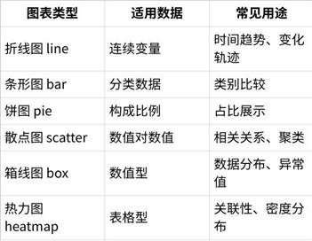
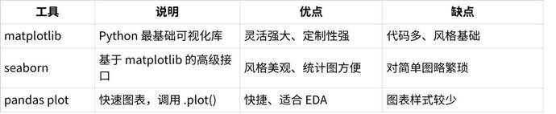
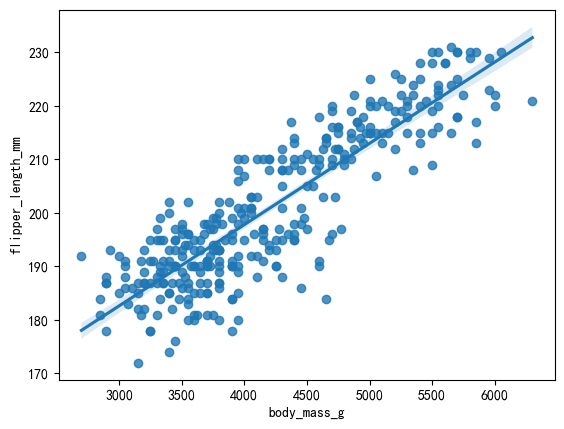
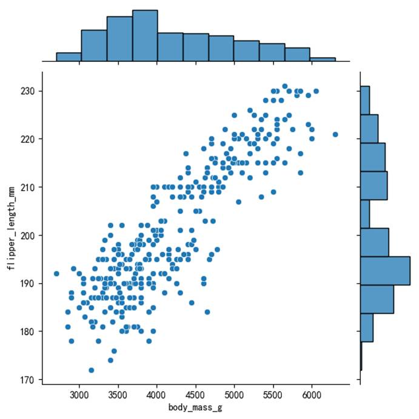
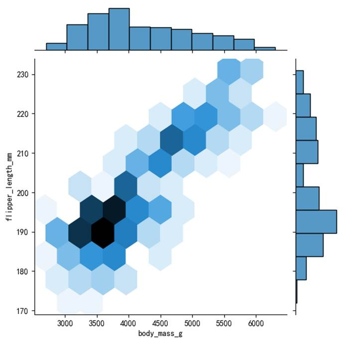
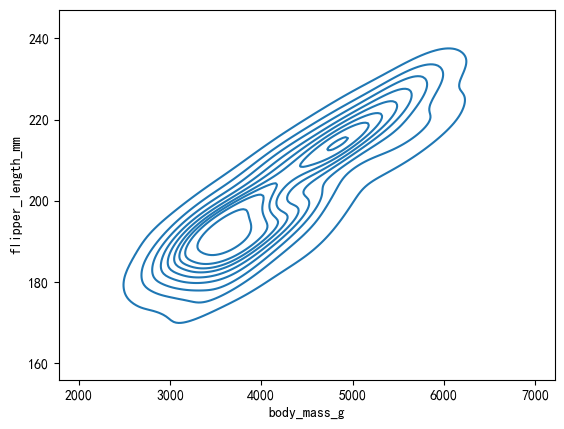
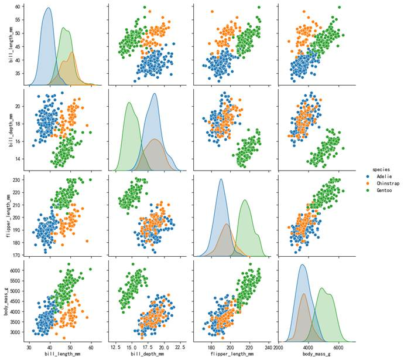
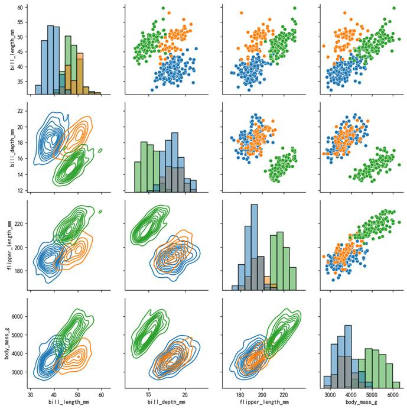
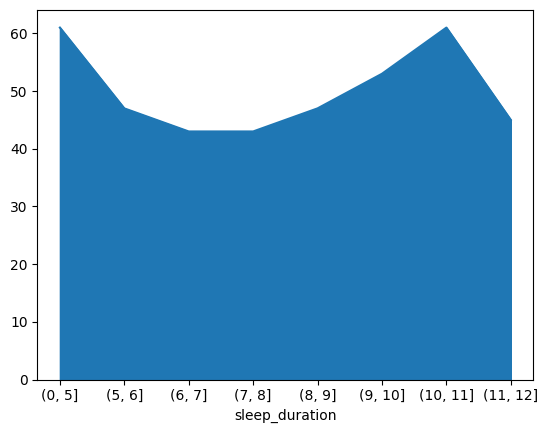
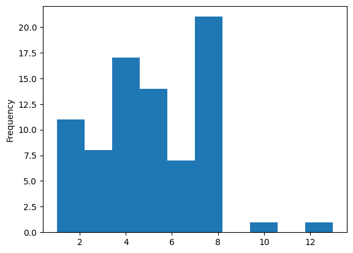

# 4. 数据可视化

<!-- bilibili-data-playlist:start -->
<details class="chapter-videos" markdown="1">
<summary><strong>本章配套视频 · P053–P069（17 集）</strong></summary>

点击分 P 标题可直接播放对应内容。

- [P053 · 053-数据可视化-可视化介绍](https://www.bilibili.com/video/BV1D9GLzyEL6?p=53)
- [P054 · 054-matplotlib-折线图](https://www.bilibili.com/video/BV1D9GLzyEL6?p=54)
- [P055 · 055-matplotlib-条形图](https://www.bilibili.com/video/BV1D9GLzyEL6?p=55)
- [P056 · 056-matplotlib-饼图](https://www.bilibili.com/video/BV1D9GLzyEL6?p=56)
- [P057 · 057-matplotlib-散点图](https://www.bilibili.com/video/BV1D9GLzyEL6?p=57)
- [P058 · 058-matplotlib-箱线图](https://www.bilibili.com/video/BV1D9GLzyEL6?p=58)
- [P059 · 059-matplotlib-多个图表的绘制](https://www.bilibili.com/video/BV1D9GLzyEL6?p=59)
- [P060 · 060-matplotlib-综合案例讲解](https://www.bilibili.com/video/BV1D9GLzyEL6?p=60)
- [P061 · 061-seaborn学习](https://www.bilibili.com/video/BV1D9GLzyEL6?p=61)
- [P062 · 062-项目实战-项目介绍](https://www.bilibili.com/video/BV1D9GLzyEL6?p=62)
- [P063 · 063-项目实战-数据导入](https://www.bilibili.com/video/BV1D9GLzyEL6?p=63)
- [P064 · 064-项目实战-数据类型转换](https://www.bilibili.com/video/BV1D9GLzyEL6?p=64)
- [P065 · 065-项目实战-异常值处理](https://www.bilibili.com/video/BV1D9GLzyEL6?p=65)
- [P066 · 066-项目实战-数据特征构造](https://www.bilibili.com/video/BV1D9GLzyEL6?p=66)
- [P067 · 067-项目实战-特征相关性](https://www.bilibili.com/video/BV1D9GLzyEL6?p=67)
- [P068 · 068-项目实战-房价分布直方图](https://www.bilibili.com/video/BV1D9GLzyEL6?p=68)
- [P069 · 069-项目实战-朝向分析](https://www.bilibili.com/video/BV1D9GLzyEL6?p=69)

</details>
<!-- bilibili-data-playlist:end -->

## 4.1 可视化介绍

**为什么要进行数据可视化？**

- 数据可视化
= 把抽象的数据“看得见”

- 目的是让数据背后的**规律、异常、趋势**一目了然

场景举例：


**常见图表类型及使用场景**



**好图的标准是什么？**

错误案例举例：

- 饼图太多分块
→ 看不出比例

- 柱状图颜色混乱
→ 无法聚焦

- 图表标题模糊不清
→ 不知图中所指

**Python 可视化工具对比**



## 4.2 Matplotlib可视化

### 4.2.1 Matplotlib简介

什么是Matplotlib

Matplotlib是一个Python绘图库，广泛用于创建各种类型的静态、动态和交互式图表。它是数据科学、机器学习、工程和科学计算领域中常用的绘图工具之一。

- 支持多种图表类型：折线图（Line
plots）、散点图（Scatter
plots）、柱状图（Bar
charts）、直方图（Histograms）、饼图（Pie
charts）、热图（Heatmaps）、箱型图（Box
plots）、极坐标图（Polar
plots）、3D图（3D
plots，配合
mpl_toolkits.mplot3d）。

- 高度自定义：允许用户自定义图表的每个部分，包括标题、轴标签、刻度、图例等。
支持多种颜色、字体和线条样式。提供精确的图形渲染控制，如坐标轴范围、图形大小、字体大小等。

- 兼容性：与NumPy、Pandas等库紧密集成，特别适用于绘制基于数据框和数组的数据可视化。可以输出到多种格式（如PNG、PDF、SVG、EPS等）。

- 交互式绘图：在Jupyter
Notebook 中，Matplotlib支持交互式绘图，可以动态更新图表。支持图形缩放、平移等交互操作。

- 动态图表：可以生成动画（使用FuncAnimation类），为用户提供动态数据的可视化。

不同开发环境下显示图形

- 在一个脚本文件中使用Matplotlib，那么显示图形的时候必须使用plt.show()。

- 在Notebook中使用Matplotlib，运行命令之后在每一个Notebook的单元中就会直接将PNG格式图形文件嵌入在单元中。

### 4.2.2 两种画图接口

Matplotlib有两种画图接口：一个是便捷的MATLAB风格的有状态的接口，另一个是功能更强大的面向对象接口。

**状态接口**

**折线图**

```python
import matplotlib.pyplot as plt

from matplotlib import rcParams

rcParams["font.sans-serif"] = ["SimHei"] #指定中文字体

rcParams["font.sans-serif"] = ['STHeiti']  #mac

month = ['1月','2月','3月','4月']

sales = [100,150,80,130]

# 创建图表，并设置大小

plt.figure(figsize=(10,6))

# 绘制折线图

plt.plot(month, sales,

label='产品A',

color='orange',

linewidth=2,

linestyle='--',

marker='o',)

# 添加标题

plt.title("2025年销售趋势",fontsize=16,color='red')

# 添加坐标轴的标签

plt.xlabel('月份',fontsize=12)

plt.ylabel('销售额（万元）',fontsize=12)

# 添加图例

plt.legend(loc='upper left')

# 添加网格线

plt.grid(True,alpha=0.1,color='blue',linestyle='--')

# grid（axis='x' axis='y'

# 自定义刻度字体大小

plt.xticks(rotation=0,fontsize=10)

plt.yticks(rotation=0,fontsize=10)

# 自定义y轴范围

plt.ylim(0,200)

# 在每个数据点上方添加数值标签

for xi, yi in zip(month, sales):

plt.text(xi, yi + 1.5, str(yi),
ha='center',fontsize=10)  # ha: 水平对齐方式

# 自动优化排版

plt.tight_layout()

# 显示图表

plt.show()
```

**条形图（Bar
Chart）**

适用场景：

- 对比不同类别的数据大小（如科目成绩、地区销量）

完整代码：

```python
import matplotlib.pyplot as plt

# 类别与对应数值

subjects = ['语文', '数学', '英语', '科学']

scores = [85, 92, 78, 88]

# 创建条形图

plt.figure(figsize=(8, 5))

plt.bar(subjects, scores, color='skyblue', width=0.6)

# 添加图表元素

plt.title("学生各科成绩对比",
fontsize=14)

plt.xlabel("科目")

plt.ylabel("分数")

plt.ylim(0, 100)  # 设置y轴范围

plt.grid(axis='y', linestyle='--', alpha=0.6)

# 为每个柱形添加数值标签

for i, score in enumerate(scores):

plt.text(i, score + 1, str(score), ha='center',
fontsize=10)

plt.tight_layout()

plt.show()
```

```python
plt.barh(month,sales,

label='AI眼镜',

color='orange',

)

# 长标签场景（条形图更合适）

countries = ['United States', 'China', 'Japan', 'Germany', 'India']

gdp = [25, 18, 5, 4, 3]

plt.barh(countries, gdp, color='lightgreen')

plt.title('各国GDP对比（单位：万亿美元）')

# plt.tight_layout()  # 自动调整标签间距

plt.show()
```

**饼图（Pie
Chart）**

适用场景：

- 显示整体构成比例（时间分配、市场份额）

完整代码：

```python
import matplotlib.pyplot as plt

labels = ['学习', '娱乐', '运动', '睡觉']

time_spent = [4, 2, 1, 8]

# 创建饼图

plt.figure(figsize=(6, 6))

plt.pie(time_spent,

labels=labels,

autopct='%.1f%%',         # 显示百分比

startangle=90,
# 起始角度

colors=['#66b3ff','#99ff99','#ffcc99','#ff9999'])

plt.title("一天的时间分配",
fontsize=14)

plt.show()
```

环形图

```python
import matplotlib.pyplot as plt

# 数据

labels = ['学习', '娱乐', '运动', '睡觉']

time_spent = [4, 2, 1, 8]

colors = ['#ff9999', '#66b3ff', '#99ff99', '#ffcc99']

# 绘制环形图

plt.figure(figsize=(8, 6))

plt.pie(time_spent, labels=labels, colors=colors,

wedgeprops={'width': 0.5},  #
控制环的宽度（0.3~0.7）

autopct='%.1f%%',
pctdistance=0.85)  # pctdistance调整百分比位置

plt.title('环形图', fontsize=15)

# 在中心添加文字

plt.text(0, 0, "总计\n100%", ha='center',
va='center', fontsize=12)

plt.show()
```

爆炸式饼图

```python
import matplotlib.pyplot as plt

# 数据

labels = ['学习', '娱乐', '运动', '睡觉']

time_spent = [4, 2, 1, 8]

colors = ['#ff9999', '#66b3ff', '#99ff99', '#ffcc99']

explode = (0.1, 0, 0, 0)  # 仅突出第一块

# 绘制爆炸式饼图

plt.figure(figsize=(6, 6))

plt.pie(time_spent, explode=explode, labels=labels, colors=colors,

autopct='%.1f%%', shadow=True,
startangle=90)

plt.title('爆炸式饼图', fontsize=15)

plt.show()
```

**散点图（Scatter
Plot）**

适用场景：

- 展示两个数值变量之间的关系（相关性）

完整代码：

```python
import matplotlib.pyplot as plt

# 模拟数据：学习时间与成绩

study_hours = [1, 2, 3, 4, 5, 6, 7]

scores = [50, 55, 65, 70, 78, 85, 90]

plt.figure(figsize=(7, 5))

plt.scatter(study_hours, scores, color='green', s=60)

plt.title("学习时间与成绩的关系")

plt.xlabel("每天学习小时数")

plt.ylabel("成绩")

plt.grid(True)

# 添加数据点注释（可选）

for i in range(len(study_hours)):

plt.text(study_hours[i]+0.1, scores[i],
f"{scores[i]}", fontsize=9)

plt.show()
```

```python
import matplotlib.pyplot as plt

import random  # 仅用Python内置库生成随机数

# 1. 生成1000个随机点（模拟正相关数据）

random.seed(42)

x = [random.uniform(0, 10) for _ in range(1000)]  # X值：0~10均匀分布

y = [xi * 2 + random.gauss(0, 2) for xi in x]     # Y值：2倍X值 + 高斯噪声

# 2. 绘制散点图

plt.figure(figsize=(10, 6))

plt.scatter(

x,
# X轴坐标数据

y,
# Y轴坐标数据

color='blue',
# 点的填充颜色为蓝色

alpha=0.5,
# 透明度为50%（半透明）

s=20,
# 点的大小为20平方磅

edgecolors='none',   # 点边缘无颜色（无边框）

label='数据点'
# 图例中显示的标签文本

)

#绘制回归线

plt.plot([0, 10],

[0,20],

color='red', linestyle='--',
linewidth=2,

label=f'回归线: y = {slope:.2f}x + {intercept:.2f}')

# 4. 美化图表

plt.title('1000个随机点的散点图', fontsize=14)

plt.xlabel('X轴：自变量', fontsize=12)

plt.ylabel('Y轴：因变量', fontsize=12)

plt.grid(True, linestyle='--', alpha=0.3)

plt.legend()

plt.tight_layout()

plt.show()
```

**箱线图（Boxplot）**

适用场景：

- 展示数据的**分布、极值、中位数、异常值**

完整代码：

```python
import matplotlib.pyplot as plt

# 模拟 3 门课的成绩

data = {

'语文': [82, 85, 88, 70, 90,
76, 84, 83, 95],

'数学': [75, 80, 79, 93, 88,
82, 87, 89, 92],

'英语': [70, 72, 68, 65, 78,
80, 85, 90, 95]

}

plt.figure(figsize=(8, 6))

plt.boxplot(data.values(), labels=data.keys())

plt.title("各科成绩分布（箱线图）")

plt.ylabel("分数")

plt.grid(True, axis='y', linestyle='--', alpha=0.5)

plt.show()
```

- 中位数：盒子中间的线

- 上/下四分位数：盒子上下边缘

- 离群值：落在“胡须”外的点

1.
数学成绩

  - 中位数最高（约88分），且箱体较短 → 学生成绩集中且整体较好。

  - 无异常值
→ 无极端高分或低分。

2.
语文成绩

  - 箱体较长
→ 成绩分布较分散（从70分到95分）。

  - 上方有一个异常值（95分）→ 可能存在个别高分学生。

3.
英语成绩

  - 中位数最低（约78分），但箱须向上延伸较长 → 部分学生成绩较高（90+分）。

  - 下方无异常值
→ 无极端低分。

**总结**


**面向对象接口**

多个图表的绘制

```python
import numpy as np

import matplotlib.pyplot as plt # 导入matplotlib

month = ['1月','2月','3月','4月']

sales = [100,150,80,130]

fig, ax = plt.subplots(2,2, figsize=(10, 10)) # 创建画布，并指定画布大小

# 绘制柱状图

ax[0][0].bar(month,sales,

label='AI眼镜0',

color='orange',

width=0.6,)

ax[0][1].plot(month,sales,

label='AI眼镜1',

color='orange',

)

ax[1][0].bar(month,sales,

label='AI眼镜2',

color='orange',

width=0.6,)

ax[1][1].bar(month,sales,

label='AI眼镜3',

color='orange',

width=0.6,)

# 添加标题

ax[0][0].set_title("2025年销售趋势",fontsize=16,color='red')

ax[1][0].set_title("2025年销售趋势",fontsize=16,color='red')

# 添加坐标轴的标签

ax[0][0].set_xlabel('月份',fontsize=12)

ax[0][0].set_ylabel('销售额（万元）',fontsize=12)

# 添加图例

ax[0][0].legend(loc='upper left')

# 添加网格线

ax[0][0].grid(True,alpha=0.1,color='blue',linestyle='--')

# grid（axis='x'
axis='y'

# 自定义y轴范围

ax[0][0].set_ylim(0,200)

plt.show()
```

## 4.3 Seaborn可视化

### 4.3.1 什么是Seaborn

Seaborn是一个基于Matplotlib的Python可视化库，旨在简化数据可视化的过程。它提供了更高级的接口，用于生成漂亮和复杂的统计图表，同时也能保持与Pandas数据结构的良好兼容性。

### 4.3.2 单变量可视化

使用penguins（企鹅）数据集，其中包含7个字段：

- species：企鹅种类（Adelie、Gentoo、Chinstrap）。

- island：观测岛屿（Torgersen, Biscoe, Dream）。

- bill_length_mm：喙（嘴）长度（毫米）。

- bill_depth_mm：喙深度（毫米）。

- flipper_length_mm：脚蹼长度（毫米）。

- body_mass_g：体重（克）。

- sex：性别（Male、Female）。

加载数据：

```python
import pandas as pd

import seaborn as sns

import matplotlib.pyplot as plt

plt.rcParams["font.sans-serif"] = ["KaiTi"]

penguins = pd.read_csv("data/penguins.csv")

penguins.dropna(inplace=True)

penguins.info()

# <class 'pandas.core.frame.DataFrame'>

# Index: 333 entries, 0 to 343

# Data columns (total 7 columns):

#  #   Column
Non-Null Count  Dtype

# ---  ------
--------------  -----

#  0   species
333 non-null    object

#  1   island
333 non-null    object

#  2   bill_length_mm     333
non-null    float64

#  3   bill_depth_mm
333 non-null    float64

#  4   flipper_length_mm  333 non-null
float64

#  5   body_mass_g
333 non-null    float64

#  6   sex
333 non-null    object

# dtypes: float64(4), object(3)

# memory usage: 20.8+ KB
```

直方图

绘制不同种类企鹅数量的直方图。

```python
sns.histplot(data=penguins, x="species")
```


核密度估计图

核密度估计图（KDE，Kernel
Density Estimate Plot）是一种用于显示数据分布的统计图表，它通过平滑直方图的方法来估计数据的概率密度函数，使得分布图看起来更加连续和平滑。核密度估计是一种非参数方法，用于估计随机变量的概率密度函数。其基本思想是，将每个数据点视为一个“核”（通常是高斯分布），然后将这些核的贡献相加以形成平滑的密度曲线。

绘制喙长度的核密度估计图。

```python
sns.kdeplot(data=penguins, x="bill_length_mm")
```


在histplot()中设置kde=True也可以得到核密度估计图。

```python
sns.histplot(data=penguins, x="bill_length_mm",
kde=True)
```


计数图

计数图用于绘制分类变量的计数分布图，显示每个类别在数据集中出现的次数，是分析分类数据非常直观的工具，可以快速了解类别的分布情况。

绘制不同岛屿企鹅数量的计数图。

```python
sns.countplot(data=penguins, x="island")
```


### 4.3.3 双变量可视化

散点图

绘制横轴为体重，纵轴为脚蹼长度的散点图。可通过hue参数设置不同组别进行对比。

```python
sns.scatterplot(data=penguins, x="body_mass_g",
y="flipper_length_mm",
hue="sex")
```


也可以通过regplot()函数绘制散点图，同时会拟合回归曲线。可以通过fit_reg=False关闭拟合。

```python
sns.regplot(data=penguins, x="body_mass_g",
y="flipper_length_mm")
```



也可以通过lmplot()函数绘制基于hue参数的分组回归图。

```python
sns.lmplot(data=penguins, x="body_mass_g",
y="flipper_length_mm",
hue="sex")
```


也可以通过jointplot()函数绘制在每个轴上包含单个变量的散点图。

```python
sns.jointplot(data=penguins, x="body_mass_g",
y="flipper_length_mm")
```



蜂窝图

通过jointplot()函数，设置kind="hex"来绘制蜂窝图。

```python
sns.jointplot(data=penguins, x="body_mass_g",
y="flipper_length_mm",
kind="hex")
```



二维核密度估计图

通过kdeplot()函数，同时设置x参数和y参数来绘制二维核密度估计图。

```python
sns.kdeplot(data=penguins, x="body_mass_g",
y="flipper_length_mm")
```



通过fill=True设置为填充，通过cbar=True设置显示颜色示意条。

```python
sns.kdeplot(data=penguins, x="body_mass_g",
y="flipper_length_mm",
fill=True,
cbar=True)
```


条形图

条形图会按x分组对y进行聚合，通过estimator参数设置聚合函数，并通过errorbar设置误差条，误差条默认会显示。可以通过误差条显示抽样数据统计结果的可能统计范围，如果数据不是抽样数据,
可以设置为None来关闭误差条。

```python
sns.barplot(data=penguins, x="species",
y="bill_length_mm",
estimator="mean",
errorbar=None)
```


箱线图

箱线图是一种用于展示数据分布、集中趋势、散布情况以及异常值的统计图表。它通过五个关键的统计量（最小值、第一四分位数、中位数、第三四分位数、最大值）来展示数据的分布情况。

箱线图通过箱体和须来表现数据的分布，能够有效地显示数据的偏斜、分散性以及异常值。箱线图的组成部分：

- 箱体（Box）：

  - 下四分位数（Q1）：数据集下 25% 的位置，箱体的下边缘。

  - 上四分位数（Q3）：数据集下 75% 的位置，箱体的上边缘。

  - 四分位间距（IQR,
Interquartile Range）：Q3
和
Q1 之间的距离，用来衡量数据的离散程度。

  - 中位数（Median）：箱体内部的水平线，表示数据集的中位数。

- 须（Whiskers）：

  - 下须：从
Q1 向下延伸，通常是数据集中最小值与
Q1 的距离，直到没有超过1.5倍 IQR 的数据点为止。

  - 上须：从
Q3 向上延伸，通常是数据集中最大值与
Q3 的距离，直到没有超过1.5倍 IQR 的数据点为止。

- 异常值（Outliers）：

  - 超过1.5倍 IQR 的数据被认为是异常值，通常用点标记出来。异常值是数据中相对于其他数据点而言“非常大”或“非常小”的值。

```python
sns.boxplot(data=penguins, x="species",
y="bill_length_mm")
```


小提琴图

小提琴图（Violin
Plot） 是一种结合了箱线图和核密度估计图（KDE）的可视化图表，用于展示数据的分布情况、集中趋势、散布情况以及异常值。小提琴图不仅可以显示数据的基本统计量（如中位数和四分位数），还可以展示数据的概率密度，提供比箱线图更丰富的信息。

```python
sns.violinplot(data=penguins, x="species",
y="bill_length_mm")
```


成对关系图

成对关系图是一种用于显示多个变量之间关系的可视化工具。它可以展示各个变量之间的成对关系，并且通过不同的图表形式帮助我们理解数据中各个变量之间的相互作用。

对角线上的图通常显示每个变量的分布（如直方图或核密度估计图），帮助观察每个变量的单变量特性。其他位置展示所有变量的两两关系，用散点图表示。

```python
sns.pairplot(data=penguins, hue="species")
```



通常情况下成对关系图左上和右下对应位置的图的信息是相同的，可以通过PairGrid()为每个区域设置不同的图类型。

```python
pair_grid = sns.PairGrid(data=penguins, hue="species")
```

```python
# 通过 map 方法在网格上绘制不同的图形
pair_grid.map_upper(sns.scatterplot)
# 上三角部分使用散点图
pair_grid.map_lower(sns.kdeplot)
# 下三角部分使用核密度估计图
pair_grid.map_diag(sns.histplot)
# 对角线部分使用直方图
```



### 4.3.4 多变量可视化

多数绘图函数都支持使用hue参数设置一个类别变量，统计时按此类别分组统计并在绘图时使用颜色区分。

例如对小提琴图设置hue参数添加性别类别：

```python
sns.violinplot(data=penguins, x="species",
y="bill_length_mm",
hue="sex",
split=True)
```


### 4.3.5 Seaborn样式

在Seaborn中，样式（style）控制了图表的整体外观，包括背景色、网格线、刻度线等元素。Seaborn提供了一些内置的样式选项，可以通过seaborn.set_style()来设置当前图表的样式。常见的样式有以下几种：

- white：纯白背景，没有网格线。

- dark：深色背景，带有网格线。

- whitegrid：白色背景，带有网格线。

- darkgrid：深色背景，带有网格线（默认样式）。

```python
sns.set_style("darkgrid")
sns.histplot(data=penguins, x="island",
kde=True)
```


## 4.4 Pandas可视化

pandas提供了非常方便的绘图功能，可以直接在DataFrame或Series上调用plot()方法来生成各种类型的图表。底层实现依赖于Matplotlib，pandas的绘图功能集成了许多常见的图形类型，易于使用。

### 4.4.1 单变量可视化

使用sleep（睡眠健康和生活方式）数据集，其中包含13个字段：

- person_id：每个人的唯一标识符。

- gender：个人的性别（男/女）。

- age：个人的年龄（以岁为单位）。

- occupation：个人的职业或就业状况（例如办公室职员、体力劳动者、学生）。

- sleep_duration：每天的睡眠总小时数。

- sleep_quality：睡眠质量的主观评分，范围从 1（差）到 10（极好）。

- physical_activity_level：每天花费在体力活动上的时间（以分钟为单位）。

- stress_level：压力水平的主观评级，范围从 1（低）到 10（高）。

- bmi_category：个人的 BMI 分类（体重过轻、正常、超重、肥胖）。

- blood_pressure：血压测量，显示为收缩压与舒张压的数值。

- heart_rate：静息心率，以每分钟心跳次数为单位。

- daily_steps：个人每天行走的步数。

- sleep_disorder：存在睡眠障碍（无、失眠、睡眠呼吸暂停）。

加载数据：

```python
import pandas
as pd
```

```python
df = pd.read_csv("data/sleep.csv")
df.info()
# 查看数据集信息
# RangeIndex: 400 entries, 0 to 399
# Data columns (total 13 columns):
#  #   Column
Non-Null Count  Dtype
# ---  ------
--------------  -----
#  0   person_id
400 non-null    int64
#  1   gender
400 non-null    object
#  2   age
400 non-null    int64
#  3   occupation
400 non-null    object
#  4   sleep_duration
400 non-null    float64
#  5   sleep_quality
400 non-null    float64
#  6   physical_activity_level  400 non-null
int64
#  7   stress_level
400 non-null    int64
#  8   bmi_category
400 non-null    object
#  9   blood_pressure
400 non-null    object
#  10  heart_rate
400 non-null    int64
#  11  daily_steps
400 non-null    int64
#  12  sleep_disorder
110 non-null    object
# dtypes: float64(2), int64(6), object(5)
# memory usage: 40.8+ KB
```

柱状图

柱状图用于展示类别数据的分布情况。它通过一系列矩形的高度（或长度）来展示数据值，适合对比不同类别之间的数量或频率。简单直观，容易理解和比较各类别数据。

使用柱状图展示不同睡眠时长的数量。

```python
pd.cut(df["sleep_duration"],
[0, 5, 6, 7, 8, 9, 10, 11, 12]).value_counts().plot.bar(
color=["red",
"green", "blue",
"yellow", "cyan",
"magenta", "black", "purple"]
```

)


折线图

折线图通常用于展示连续数据的变化趋势。它通过一系列数据点连接成的线段来表示数据的变化。能够清晰地展示数据的趋势和波动。

使用折线图展示不同睡眠时长的数量。

```python
pd.cut(df["sleep_duration"],
[0, 5, 6, 7, 8, 9, 10, 11, 12]).value_counts().sort_index().plot()
```


面积图

面积图是折线图的一种变体，线下的区域被填充颜色，用于强调数据的总量或变化。可以更直观地展示数据量的变化，适合用来展示多个分类的累计趋势。

使用面积图展示不同睡眠时长的数量。

```python
pd.cut(df["sleep_duration"],
[0, 5, 6, 7, 8, 9, 10, 11, 12]).value_counts().sort_index().plot.area()
```



直方图

直方图用于展示数据的分布情况。它将数据范围分成多个区间，并通过矩形的高度显示每个区间内数据的频率或数量。可以揭示数据分布的模式，如偏态、峰度等。

使用直方图展示不同睡眠时长的数量。

```python
df["sleep_duration"].value_counts().plot.hist()
```



饼状图

饼状图用于展示一个整体中各个部分所占的比例。它通过一个圆形图形分割成不同的扇形，每个扇形的角度与各部分的比例成正比。能够快速展示各部分之间的比例关系，但不适合用于展示过多的类别或比较数值差异较小的部分。

使用饼状图展示不同睡眠时长的占比。

```python
pd.cut(df["sleep_duration"],
[0, 5, 6, 7, 8, 9, 10, 11, 12]).value_counts().sort_index().plot.pie()
```


### 4.4.2 双变量可视化

散点图

散点图通过在二维坐标系中绘制数据点来展示两组数值数据之间的关系。能够揭示两个变量之间的相关性和趋势。

绘制睡眠时间与睡眠质量的散点图。

```python
df.plot.scatter(x="sleep_duration", y="sleep_quality")
```


蜂窝图

蜂窝图是散点图的扩展，通常用于表示大量数据点之间的关系。它通过将数据点分布在一个六边形网格中，每个六边形的颜色代表其中的数据密度。适合展示大量数据点，避免了散点图中的过度重叠问题。

绘制睡眠时间与睡眠质量的蜂窝图。

```python
df.plot.hexbin(x="sleep_duration", y="sleep_quality",
gridsize=10)
```


堆叠图

堆叠图用于展示多个数据系列的累积变化。常见的堆叠图包括堆叠柱状图、堆叠面积图等。它通过将每个数据系列堆叠在前一个系列之上，展示数据的累积情况。能够清晰地展示不同部分的相对贡献，适合多个数据系列的比较。

绘制睡眠时间与睡眠质量的堆叠图。

```python
df["sleep_quality_stage"]
= pd.cut(df["sleep_quality"],
range(11))
df["sleep_duration_stage"]
= pd.cut(df["sleep_duration"],
[0, 5, 6, 7, 8, 9, 10, 11, 12])
df_pivot_table = df.pivot_table(
values="person_id",
index="sleep_quality_stage",
columns="sleep_duration_stage",
aggfunc="count"
```

)

```python
df_pivot_table.plot.bar()
```


设置stacked=True，会将柱体堆叠。

```python
df_pivot_table.plot.bar(stacked=True)
```


折线图

```python
df_pivot_table.plot.line()
```


**第5章项目实战：房地产市场洞察与价值评估**

**数据分析流程**

采集数据→确定分析方向→导入数据→数据清洗→数据分析→数据可视化

**数据源介绍**

| 字段名 | 含义 | 说明 |
| --- | --- | --- |
| city | 城市 | 房屋所在的城市名称，例如“合肥”、“重庆”等。 |
| address | 详细地址 | 房屋的具体位置，包含街道、交叉口等信息。 |
| area | 面积 | 房屋的面积，单位为平方米（㎡）。 |
| floor | 楼层 | 房屋所在的楼层信息，例如“中层（共18层）”。 |
| name | 小区名称 | 房屋所在的小区或楼盘名称。 |
| price | 价格 | 房屋的总价，单位为“万”或“元”。 |
| province | 省份 | 房屋所在的省份或直辖市名称。 |
| rooms | 户型 | 房屋的户型结构，例如“3室2厅”。 |
| toward | 朝向 | 房屋的朝向，例如“南北向”、“南向”等。 |
| unit | 单价 | 房屋的单价，单位为“元/㎡”。 |
| year | 建造年份 | 房屋的建造年份，例如“2013年建”。 |
| origin_url | 原始链接 | 房屋信息的来源网页链接。 |

**分析及统计问题**

| 编号 | 问题 | 分析主题 | 分析目标 | 分组字段 | 指标/方法 |
| --- | --- | --- | --- | --- | --- |
| A1 | 哪些变量最影响房价？面积、楼层、房间数哪个影响更大？ | 特征相关性 | 了解房屋各特征对房价的线性影响 | 无 | 皮尔逊相关系数 |
| A2 | 全国房价总体分布是怎样的？是否存在极端值？ | 描述性统计 | 概览数值型字段的分布特征 | 无 | 平均数/中位数/四分位数/标准差 |
| A3 | 哪些城市房价最高？直辖市与非直辖市差异如何？ | 城市对比 | 比较不同城市房价水平 | city | 均价/单价中位数/箱线图 |
| A4 | 高价房在面积、楼层等方面有什么特征？ | 价格分层 | 识别不同价位房屋特征差异 | 价格分段(低中高) | 列联表/卡方检验 |
| A5 | 哪种户型最受欢迎？三室比两室贵多少？ | 户型分析 | 分析不同户型的市场表现 | rooms | 占比/平均单价/溢价率 |
| A6 | 南北向是否真比单一朝向贵？贵多少？ | 朝向溢价 | 评估不同朝向的价格差异 | toward | 方差分析/多重比较 |
| A7 | 新房比10年老房贵多少？折旧规律如何？ | 楼龄效应 | 研究建筑年份对房价的影响 | year分段(5年间隔) | 趋势线/回归分析 |
| A8 | 哪些区域交易最活跃？新区和老城区哪个更贵？ | 区域热度 | 识别各城市热门交易区域 | address(提取区域关键词) | 交易量/价格增长率 |
| A9 | 哪个面积段的性价比最高？超大户型有溢价吗？ | 面积区间 | 分析不同面积段的价格特征 | area分段(50㎡间隔) | 密度图/价格梯度 |
| A10 | 中层真的比高层贵吗？差价是多少？ | 楼层差异 | 比较不同楼层的价格表现 | floor(高中低层) | Kruskal-Wallis检验 |
| A11 | 直辖市房价是否显著更高？单价和总价差异如何？ | 直辖市vs非直辖市 | 对比直辖市与非直辖市的房价差异 | province | 独立样本t检验/曼-惠特尼U检验 |

**代码实现**

```python
# 1. 导入库

import numpy as np

import pandas as pd

import matplotlib.pyplot as plt

import seaborn as sns

plt.rcParams['font.sans-serif'] = ['STHeiti']  # 显示中文

# 2. 导入数据

df = pd.read_csv('data/house_sales.csv')

df.info()

len(df)

# 3. 数据概览

print('数据概览')

print('总记录数：',len(df))

print('字段数量：',len(df.columns))

print('前5行数据：')

df.head(5)

# 4. 数据清洗

# 删除无用的数据列

df.drop(columns='origin_url',inplace=True)

# 缺失值检查

print(df.isnull().sum())

# 删除缺失值数据

df.dropna(inplace=True)

# 缺失值检查

print(df.isnull().sum())

# 处理重复值

print(df.duplicated().sum())

df.drop_duplicates(inplace=True)

print(df.duplicated().sum())

print(len(df))

# 数据类型的转换

# 价格处理（示例："128万" "$128"-> 1280000）

df['price'] = df['price'].astype(str).str.replace('万', '')

df['price'] = df['price'].astype(str).str.replace('$',
'').astype(float).round(1) * 10000

# 面积处理（示例："90㎡" -> 90）

df['area'] = df['area'].astype(str).str.replace('㎡','').astype(float).round(1)

# 单价处理

df['unit'] = df['unit'].astype(str).str.replace('元/㎡','').astype(float).round(1)

# year处理

df['year'] = df['year'].astype(str).str.replace('年建','').astype(int)

#朝向处理

df['toward'] = df['toward'].astype('category')

df.head(10)

# 异常数据处理

q1 = df['price'].quantile(0.25)

q3 = df['price'].quantile(0.75)

iqr=q3-q1

low=q1-1.5*iqr

high=q3+1.5*iqr

df = df[(df['price'] > low) & (df['price'] < high)]

print(len(df))

print(f"价格异常值处理后记录数:
{len(df)}")

# 面积合理性检查

df = df[(df['area'] > 20) & (df['area'] < 500)]

print(f"面积异常值处理后记录数:
{len(df)}")

# 5. 新数据特征构造

df['district'] = df['address'].str.split('-').str[0]

df['building_age'] = 2025 - df['year']  # 计算楼龄

df['bedroom'] = df['rooms'].str.split('室').str[0].astype(int)

df['livingroom'] = df['rooms'].str.split('室').str[1].str.split('厅').str[0].astype(int)

df['livingroom2'] = df['rooms'].str.extract(r'(\d+)厅').astype(int)

# 楼层分类

def classify_floor(floor_str):

if pd.isna(floor_str):

return '未知'

if '低层' in floor_str:

return '低层'

elif '中层' in floor_str:

return '中层'

elif '高层' in floor_str:

return '高层'

else:

return '未知'

df['floor_type'] = df['floor'].apply(classify_floor)

municipalities = ['北京', '上海', '天津', '重庆']

df['is_municipality'] = df['city'].apply(lambda x: 1 if x in municipalities
else 0)

df.is_municipality.value_counts()

# 价格分段

bins = [0, 1000000, 2000000, 3000000, float('inf')]

labels = ['低价', '中价', '高价', '奢侈']

df['price_level'] = pd.cut(df['price'], bins=bins, labels=labels)

df.sample(5)

'''

问题编号: A1

问题: 哪些变量最影响房价？面积、楼层、房间数哪个影响更大？

分析主题: 特征相关性

分析目标: 了解房屋各特征对房价的线性影响

分组字段: 无

指标/方法: 皮尔逊相关系数

'''

# 选择数值型特征

num_features = ['price', 'area', 'unit', 'building_age']

corr_matrix = df[num_features].corr()

# 找出与价格最相关的特征

price_corr = corr_matrix['price'].sort_values(ascending=False)

print("\n与房价相关性最高的特征:")

price_corr[1:4] # 排除price自身

# 可视化：相关性热力图

plt.figure(figsize=(10, 8))

sns.heatmap(corr_matrix, annot=True, cmap='coolwarm', center=0,
fmt=".2f")

plt.title("房屋特征相关性矩阵",
fontsize=14)

plt.xticks(rotation=45)

plt.tight_layout()

# plt.show()

'''

问题编号: A2

问题: 全国房价总体分布是怎样的？是否存在极端值？

分析主题: 描述性统计

分析目标: 概览数值型字段的分布特征

分组字段: 无

指标/方法: 平均数/中位数/四分位数/标准差

'''

data[numeric_cols].describe()

# 房价分布直方图

plt.subplot()  # 1行2列的第2个图

plt.hist(df['price'], bins=30, color='skyblue')

plt.title('房价分布直方图')

plt.xlabel('价格(元)')

plt.ylabel('房屋数量')

plt.tight_layout()  # 避免标题重叠

plt.show()

'''

问题编号: A3

问题: 哪些城市房价最高？直辖市与非直辖市差异如何？

分析主题: 城市对比

分析目标: 比较不同城市房价水平

分组字段: city

指标/方法: 均价/单价中位数/箱线图

'''

# 按城市统计

city_stats = df.groupby('city').agg({

'price': ['mean', 'median', 'count'],

'unit': ['mean', 'median']

})

print("\n各城市房价统计:")

display(city_stats.sort_values(('unit', 'mean'), ascending=False).head(10))

# 可视化前10城市

top_cities = city_stats.sort_values(('unit', 'mean'),
ascending=False).head(10).index

df_top = df[df['city'].isin(top_cities)]

plt.figure(figsize=(12, 6))

sns.boxplot(x='city', y='price', data=df_top, order=top_cities)

plt.title('TOP10城市房价分布对比', fontsize=14)

plt.xlabel('城市')

plt.ylabel('价格(元)')

plt.xticks(rotation=45)

plt.tight_layout()

plt.show()

'''

问题编号: A4

问题: 高价房在面积、楼层等方面有什么特征？

分析主题: 价格分层

分析目标: 识别不同价位房屋特征差异

分组字段: 价格分段(低中高)

指标/方法: 列联表/卡方检验

'''

'''

问题编号: A5

问题: 哪种户型最受欢迎？三室比两室贵多少？

分析主题: 户型分析

分析目标: 分析不同户型的市场表现

分组字段: rooms

指标/方法: 占比/平均单价/溢价率

'''

'''

问题编号: A6

问题: 南北向是否真比单一朝向贵？贵多少？

分析主题: 朝向溢价

分析目标: 评估不同朝向的价格差异

分组字段: toward

指标/方法: 方差分析/多重比较

'''

'''

问题编号: A6

问题: 南北向是否真比单一朝向贵？贵多少？

分析主题: 朝向溢价

分析目标: 评估不同朝向的价格差异

分组字段: toward

指标/方法: 方差分析/多重比较

'''

# 筛选主要朝向（出现次数>50次）

toward_counts = df['toward'].value_counts()

main_towards = toward_counts[toward_counts > 50].index

df_toward = df[df['toward'].isin(main_towards)]

# 朝向统计

toward_stats = df_toward.groupby('toward').agg({

'price': ['mean', 'median'],

'unit': 'median',

'building_age': 'mean'

}).sort_values(('unit', 'median'), ascending=False)

print("\n各朝向价格表现:")

display(toward_stats)

# 方差分析

groups = [group['unit'].values for name, group in
df_toward.groupby('toward')]

# 可视化

plt.figure(figsize=(12, 6))

sns.boxplot(x='toward', y='unit', data=df_toward,

order=toward_stats.index)

plt.title('不同朝向单价分布', fontsize=14)

plt.xticks(rotation=45)

plt.tight_layout()

plt.show()

'''

问题编号: A7

问题: 新房比10年老房贵多少？折旧规律如何？

分析主题: 楼龄效应

分析目标: 研究建筑年份对房价的影响

分组字段: year分段(5年间隔)

指标/方法: 趋势线/回归分析

'''

'''

问题编号: A8

问题: 哪些区域交易最活跃？新区和老城区哪个更贵？

分析主题: 区域热度

分析目标: 识别各城市热门交易区域

分组字段: address(提取区域关键词)

指标/方法: 交易量/价格增长率

'''

'''

问题编号: A9

问题: 哪个面积段的性价比最高？超大户型有溢价吗？

分析主题: 面积区间

分析目标: 分析不同面积段的价格特征

分组字段: area分段(50㎡间隔)

指标/方法: 密度图/价格梯度

'''

'''

问题编号: A10

问题: 中层真的比高层贵吗？差价是多少？

分析主题: 楼层差异

分析目标: 比较不同楼层的价格表现

分组字段: floor(高中低层)

指标/方法:
Kruskal-Wallis检验

'''

'''

问题编号: A11

问题: 直辖市房价是否显著更高？单价和总价差异如何？

分析主题: 直辖市vs非直辖市

分析目标: 对比直辖市与非直辖市的房价差异

分组字段: province（直辖市/安徽）

指标/方法: 独立样本t检验/曼-惠特尼U检验

'''
```
