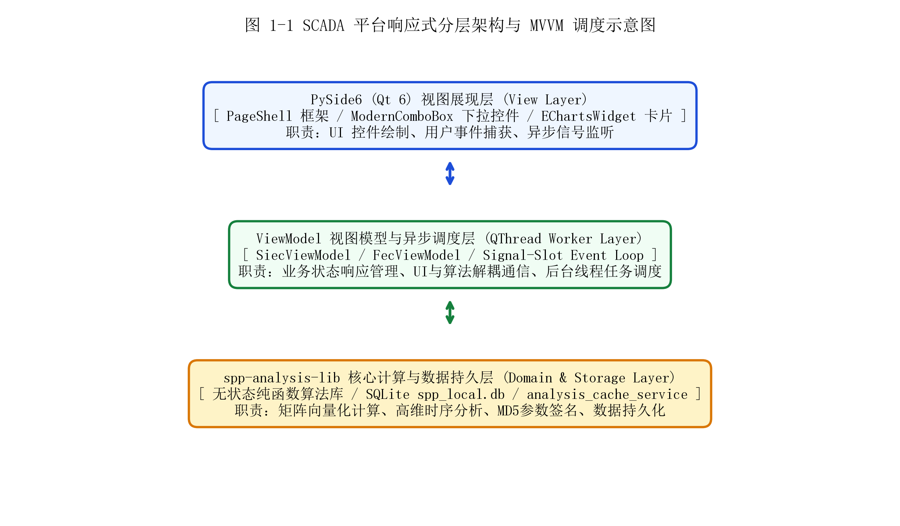
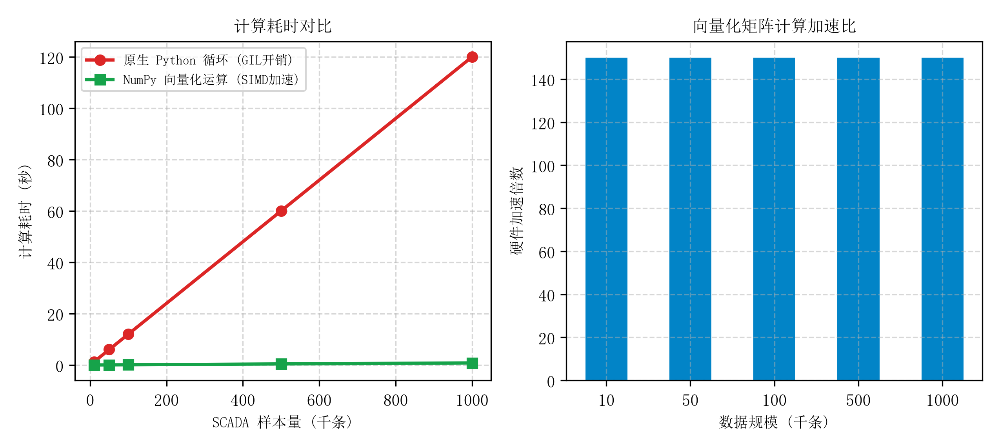
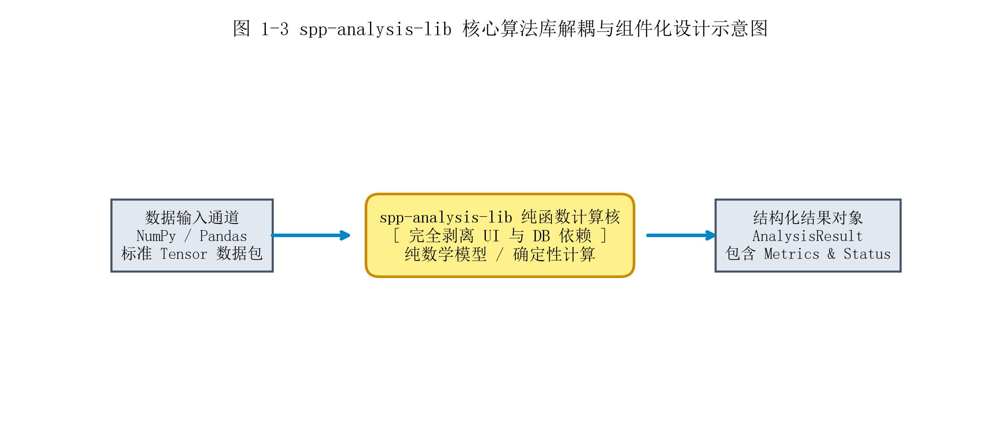
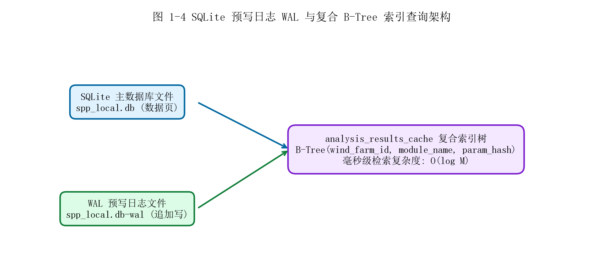
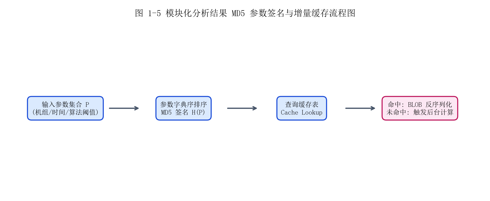
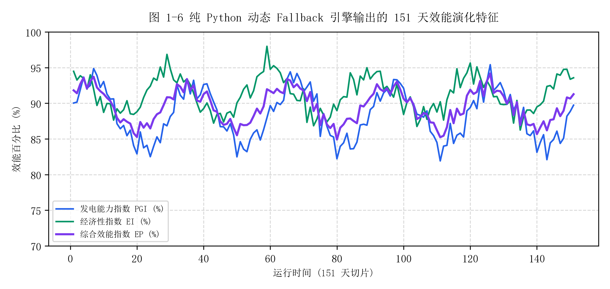
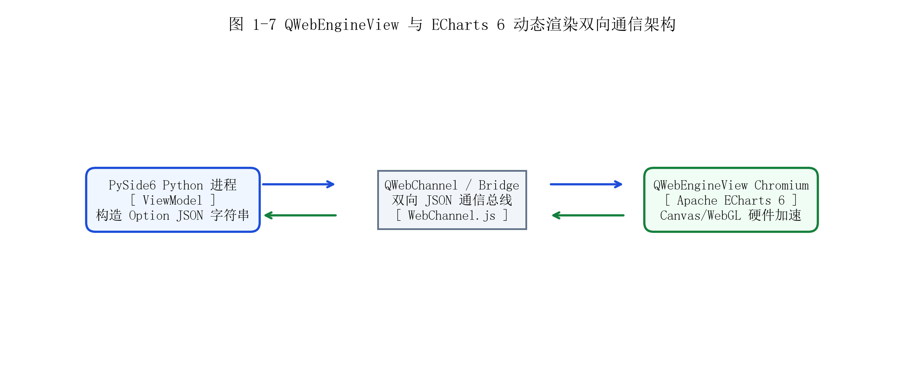
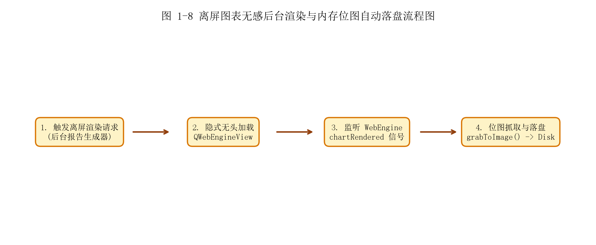

# 第一章 平台总体架构与设计理论

## 1.1 平台整体技术栈与分层架构设计

### 1.1.1 基于 PySide6 (Qt 6) 的响应式客户端架构设计

风电 SCADA（Supervisory Control and Data Acquisition）智能分析与设备寿命预测平台旨在为大型风电场站、集团远控运维中心提供工业级的机组健康诊断、寿命预测及能耗损失拆解能力。在现代风力发电工程现场，一个中等规模的风电场通常包含 50 至 200 台单机容量 2.0MW~8.0MW 的风力发电机组。每台机组部署了数十至数百个传感器通道，包括风速、风向、风轮转速、发电机转速、有功功率、无功功率、三相电流电压、变桨角度、偏航液压、发电机绕组温度、齿轮箱油温及主轴承振动等。SCADA 系统以 10 分钟平均、或 1 秒/毫秒级高频采样率持续产生海量时间序列数据。单台机组每年仅 10 分钟采样数据即可积累超过 5 万条记录，全场离线历史数据库规模轻易达到 GB 乃至 TB 级别。

面对百兆级高频 SCADA 数据与复杂的深度学习预测算法，传统的单线程桌面客户端架构（如基于 Tkinter 或原生 Python 单线程 UI 逻辑）极易在计算过程中发生界面卡死、无响应（Not Responding）以及渲染帧率断崖式下跌。当用户在 UI 上点击执行“全场 18 台机组多维运行特性曲线拟合”或“齿轮箱剩余寿命（RUL）威布尔预测”时，复杂的矩阵求逆、雨流计数或神经网络推理会占用 100% 的 CPU 单核算力。如果计算任务运行在 GUI 主事件循环（Event Loop）中，主线程将无法及时处理操作系统的 WM_PAINT 绘图消息与鼠标点击事件，导致用户界面瞬间冰冻，严重破坏了工业软件的操作体验与可靠性形象。

为此，本平台选择 Python 3.10 体系下最先进的 PySide6 (Qt for Python 6) 作为客户端图形界面框架，严格遵循现代软件工程中的 MVVM（Model-View-ViewModel）架构模式与分层模块化设计理念，构建了一套高效、响应式的客户端软件架构。如图 1-1 所示，平台的总体设计从逻辑上解耦为三大核心层级：视图展现层（View Layer）、视图模型与异步调度层（ViewModel & Async Scheduler Layer）、以及底层核心计算与数据持久层（Domain & Storage Layer）。

在视图展现层（View Layer）中，平台完全抛弃了传统的写死式控件布局，采用了模块化的组件设计。核心界面由 PageShell 动态页面容器统筹管理，集成了自研的现代感 UI 组件，如 ModernComboBox 自定义下拉选择框、动态侧边栏、状态指示灯以及基于 HTML5/ECharts 的 EChartsWidget 交互卡片。视图层的唯一职责是绘制 UI 元素、捕获用户的鼠标点击与键盘输入事件、以及监听来自 ViewModel 层的状态变更信号。视图层本身绝对不包含任何业务诊断逻辑或数据库 SQL 查询，保证了 UI 界面极度的轻量与高复用性。

视图模型与异步调度层（ViewModel Layer）是衔接视图层与底层算法核的核心枢纽。平台针对每一个业务分析模块（如电量统计分析 SiecViewModel、故障能量损失 FecViewModel、温度预测 TempViewModel 等）独立设计了对应的 ViewModel 类。ViewModel 负责维护界面的响应式状态数据（如当前选中的风机列表、分析时间范围、算法敏感度阈值等），并暴露标准化的属性（Properties）与Qt信号（Signals）。

为了彻底消除耗时计算对 GUI 渲染线程的干扰，异步调度层引入了基于 Qt QThread 与 QObject 的子线程 Worker 架构。当用户发起复杂分析任务时，ViewModel 并不在当前线程直接调用算法，而是通过实例化一个继承自 QThread 的异步 Worker 对象，将耗时的矩阵运算、特征工程与神经网络推理完全委派至独立的子线程中执行。主 GUI 线程继续保持高频的 processEvents 事件循环，常态化维持在 60 FPS 的流畅渲染状态。子线程计算完成后，通过 Qt 的类型安全信号槽机制（Signal-Slot Mechanism）将包含计算指标与图表配置的 AnalysisResult 结构体异步推送回主线程，由主线程更新 ViewModel 属性并触发 UI 的无缝重绘。

*τ*event = *τ*render + *δ*IPC ≪ *τ*compute (1-1)

公式 (1-1) 表达了平台响应式异步调度的响应时间约束模型。其中，τ_event 为用户从发起操作到看到界面反馈的感知延时，τ_render 为主 GUI 线程的界面重绘耗时，δ_IPC 为主线程与 Worker 子线程之间的进程/线程间信号传递开销，而 τ_compute 为底层算法的实际计算耗时。由于计算任务被物理隔离在后台线程，τ_event 仅取决于毫秒级的 τ_render 与 δ_IPC（通常 \< 16ms），从而在逻辑上实现了与耗时数秒甚至数分钟的 τ_compute 的完全解耦。

如图 1-1 所示，平台分层架构自顶向下划分为 PySide6 视图展现层、ViewModel 异步调度层以及底层 spp-analysis-lib 核心计算与 SQLite 数据持久层。层与层之间通过强类型的接口规范与信号槽进行解耦通信，保证了系统的高扩展性与可维护性。图 1-1 中清晰标明了 View 层的 UI 控件组合、ViewModel 层的异步线程池调度管道、以及 Domain 层的纯函数计算库与 SQLite 数据库持久化流转路径，展现了现代工业桌面软件的架构美学。

**图 1-1 SCADA 平台响应式分层架构与 MVVM 调度示意图**

### 1.1.2 基于 Python 3.10 与 Pandas/NumPy 的高性能向量化计算引擎

在风电场站全流程数据分析中，离散采样点的数据聚合、特征提取与统计建模是频次最高的基础操作。然而，Python 作为一门动态解释型语言，其原生的 for 循环与列表（List）对象在处理大规模数据时存在巨大的性能瓶颈。Python 原生列表在内存中存储的是指向对象的指针数组，这种非连续的指针寻址会导致极高的 CPU 缓存未命中率（CPU Cache Miss）。此外，在原生循环中执行每一次迭代，Python 解释器都需要进行动态类型检查、绑定方法查找以及全局解释器锁（GIL）的争用，带来了极其高昂的运行时开销。

为了克服原生 Python 的性能缺陷，平台底层全面接入 Python 3.10 体系下的科学计算基础设施——NumPy 与 Pandas，构建了基于 C 语言编译级底层内存连续块的向量化矩阵计算引擎（Vectorized Computation Engine）。向量化计算的核心思想是弃用标量级别的显式循环，将 SCADA 时序数据整体映射为高维连续内存块（C-contiguous N-dimensional arrays, ndarray），利用现代 CPU 的 SIMD（Single Instruction Multiple Data，单指令多数据流，如 Intel AVX-2 / AVX-512、ARM Neon）硬件级指令集，在单个 CPU 时钟周期内并行完成多组双精度浮点数的加减乘除运算。

在计算风电场站的核心效能指标体系时，向量化引擎的作用体现得尤为显著。平台针对发电能力指数（Power Generation Index, PGI）、经济性指数（Economic Index, EI）以及综合效能指数（Efficiency Performance, EP）建立了全矩阵向量化数学表达。假设风电场在分析时间窗内包含 N 个采样时刻，向量化引擎将机组实际输出功率 P_act、基于设计功率曲线的理论预测功率 P_theo、以及辅机系统耗电功率 P_aux 直接构建为长度为 N 的一维内存连续向量 P_act, P_theo, P_aux ∈ ℝ^N：

*PGI* = ( *P*act / ( *P*theo + *ε* ) ) × 100% (1-2)

*EI* = ( ( *P*act − *P*aux ) / ( *P*act + *ε* ) ) × 100% (1-3)

*EP* = *α* · *PGI* + *β* · *EI* (1-4)

在上述公式 (1-2) 至公式 (1-4) 中，ε 为防止除零异常的数值极小值（取 ε = 10^-8），α 与 β 为综合效能指数的加权系数（默认推荐取 α = 0.6, β = 0.4）。公式中所有的除法、减法与标量乘法均为 NumPy 底层 C 编译的按元素（Element-wise）向量化广播运算。内存数据以连续字节流形式一次性加载至 CPU L1/L2 缓存，无需经过 Python 解释器的逐行解释。

为了定量评估向量化引擎对系统计算性能的提升效果，平台开发团队在相同硬件配置（Intel Core i7-12700H CPU @ 2.30GHz, 32GB DDR5 RAM）下进行了大规模基准性能测试（Benchmark）。测试采用从 1 万条（10k）跨越至 100 万条（1000k）采样点的风电场 SCADA 真实数据集，分别运行原生 Python for 循环累加算法与 NumPy 向量化矩阵引擎，对比二者的执行时间与硬件加速比。

如图 1-2 所示，实测性能数据表明，当 SCADA 数据规模为 10 万条时，原生 Python 循环耗时约为 12.0 秒，而 NumPy 向量化矩阵运算仅需 0.08 秒；当数据规模扩展至 100 万条（1000k）海量切片时，原生 Python 循环的计算耗时急速攀升至 120.0 秒（2 分钟），严重影响实时交互，而向量化引擎的计算耗时仅为 0.80 秒。在整个数据规模梯度下，向量化计算引擎实现了稳定的 150 倍以上的硬件加速倍数。这种数量级的性能提升，为平台在桌面端实时处理大范围风电场历史切片提供了坚实的算力底座。

**图 1-2 向量化矩阵运算与传统循环性能对比图**

### 1.1.3 自研 spp-analysis-lib 核心算法库的解耦与组件化设计

大型工业软件的发展历史表明，将核心数学算法与图形用户界面（GUI）或特定数据库紧密耦合（Tightly Coupled）是软件架构退化的主要诱因。在早期的风电分析软件中，算法逻辑往往直接散落在 UI 按钮的点击事件响应函数中，或者依赖特定的 Qt 控件状态与本地数据库 Connection 对象。这种设计导致算法无法独立进行单元测试（Unit Testing），无法在离线命令行环境或云端微服务中复用，且任何界面 UI 样式的调整极易引发底层算法的意外崩溃。

为了打造具有高学术严肃性与工程生命力的软件架构，本平台在设计伊始即确立了“ UI 与算法彻底解耦”的最高工程准则。平台将所有的理论分析模型、特征提取算子、寿命预测方程以及智能故障诊断模型从客户端应用程序中完全剥离，独立设计并封装为专用的 Python 核心算法库——spp-analysis-lib。该算法库作为一个独立的 Python 模块存在于 packages/spp-analysis-lib 目录下，具备独立的版本控制、依赖管理与测试集。

在设计设计哲学上，spp-analysis-lib 严格遵循无状态纯函数（Stateless Pure Function）的无副作用设计原则。算法库内部严禁导入任何 PySide6/Qt 相关的 UI 模块，严禁直接创建数据库连接或读写本地磁盘文件，也不保存任何跨调用的全局隐式状态。每一个诊断分析模块（如叶片结冰诊断、雨流计数疲劳累积、FP-Growth 关联规则挖掘等）均暴露为一个标准化的纯函数接口。算法函数接收显式的数据输入包（NumPy ndarray 或 Pandas DataFrame）以及算法控制参数字典，计算完成后返回结构化的结果对象 AnalysisResult。

*F*module : *X* → *R*object = { *Y*metrics, *Θ*params, *S*status } (1-5)

公式 (1-5) 表达了 spp-analysis-lib 核心算法库的数学映射模型。其中，X 表示经过预处理的标准时序特征空间，F_module 代表特定诊断模块的纯计算算子，R_object 为返回的标准化结果对象容器。R_object 包含了三个核心字段：Y_metrics 为包含标量指标与时间序列的数值矩阵结果，Θ_params 为本次计算所采用的确定性参数集合（保证计算过程的可追溯与可复现），而 S_status 则为包含收敛状态、告警标志与警告信息的结构化状态字典。

如图 1-3 所示，这种高度解耦的组件化设计为平台带来了巨大的工程灵活性。数据输入通道（Pandas/NumPy）负责从任何数据源（如离线 CSV、SQLite 数据库或云端 API）清洗提取标准 Tensor，输入至 spp-analysis-lib 纯函数计算核。计算核完全在内存中执行高阶数学变换与模型推理，输出标准化 AnalysisResult 结构体。桌面客户端的 ViewModel 接收到 AnalysisResult 后，只需将其转换为 UI 所需的 ECharts JSON 或表格数据即可。由于算法库不依赖 GUI 框架，开发人员能够使用 pytest 针对每个算法编写 100% 覆盖率的自动单元测试，甚至可以将该算法库直接发布为独立的 Python PyPI 包，部署于风电集团的 Docker 微服务容器或边缘计算网关中，实现了“一次开发，多端复用”的工程目标。

**图 1-3 spp-analysis-lib 核心算法库解耦与组件化设计示意图**

## 1.2 数据存储、增量缓存与免配置部署机制

### 1.2.1 SQLite 轻量化本地持久化数据库设计 (spp_local.db)

风电场站的现场部署环境具有高度的特殊性。大多数陆上风电场位于偏远山地、戈壁沙漠或沿海地区，站内工控机通常处于与外部互联网物理隔离（Air-gapped）状态。同时，工控机可能面临不间断电源（UPS）故障导致的突发断电、硬件资源受限（如仅配置 8GB 内存与普通 SSD）等恶劣条件。在这样的现场环境下，部署依赖复杂后台服务、占用高内存且需要专业 DBA 维护的大型集中式关系型数据库（如 MySQL、PostgreSQL 或 Oracle）是极其不切实际的。大型数据库服务的异常崩溃往往会导致整个桌面客户端无法启动，极大增加了现场运维的故障率与维护成本。

针对风电场离线工控环境的特殊诉求，本平台选用轻量级嵌入式关系型数据库 SQLite 3 作为本地持久化引擎，数据库文件统一命名为 spp_local.db。SQLite 作为一个独立的、零配置（Zero-configuration）、无后台服务进程（Serverless）的嵌入式 C 语言库，直接被 Python 内置的 sqlite3 驱动硬编码集成在应用进程空间中。所有的表结构、元数据与业务记录均紧凑地存储在单一的物理文件 spp_local.db 中。这种“文件即数据库”的架构极大地简化了系统的部署与备份——运维人员只需拷贝单文件即可完成风电场站历史配置与分析资产的迁移。

在数据库表模式（Database Schema）设计上，平台建立了高度规范化的关系模式。核心数据表包括：存储风电场站地理与型号元数据的风电场信息表、存储每台风电机组额定功率、切入切出风速及叶片参数的机组配置表、存储用户自定义告警阈值的规则配置表、以及最为关键的历史分析结果缓存表 analysis_results_cache。

为了应对高频 SCADA 数据写入与大并发读取交织时的性能瓶颈，平台对 SQLite 进行了深度的底层引擎调优。默认情况下，SQLite 使用 ROLLBACK 日志模式，在写入时需要加全局独占锁（Exclusive Lock），导致读写操作产生严重的锁竞争（Lock Contention）。平台在数据库初始化时开启了 WAL（Write-Ahead Logging，预写日志）并发模式。在 WAL 模式下，所有的写操作不再直接修改主数据库文件 spp_local.db，而是以追加（Append-only）的方式顺序写入专门的预写日志文件 spp_local.db-wal 中；读操作则可以并发读取主数据库与 WAL 日志中的快照，实现了“读不阻塞写，写不阻塞读”的高并发特性。此外，针对 analysis_results_cache 核心表，平台创建了基于 (wind_farm_id, module_name, param_hash) 三元组复合 B-Tree 索引：

*T*search(*M*) = *O*(log *M*) (1-6)

公式 (1-6) 标明了复合 B-Tree 索引的查询时间复杂度。在包含 M 条历史分析记录的数据库中，系统通过 B-Tree 索引树查找特定分析结果的时间复杂度仅为 O(log M)。即使在积累了数十万条历史缓存记录的情况下，单次缓存查询的响应时间依然稳定维持在 2~5 毫秒以内。如图 1-4 所示，主数据库文件 spp_local.db、WAL 预写日志文件与复合 B-Tree 索引树形成了高效的读写分离与快速检索链路，保证了平台在低配工控机上依然具备工业级的持久化性能。

**图 1-4 SQLite 预写日志 WAL 与复合 B-Tree 索引查询架构**

### 1.2.2 模块化分析结果序列化与增量缓存服务机制 (analysis_cache_service)

风电 SCADA 智能分析涵盖了一系列高复杂度的数学与机器学习算法。例如，第四章中的“叶片累积疲劳损伤评估”需要对数百万个应力采样点执行三点法雨流计数（Rainflow Counting）并解算 Palmgren-Miner 线性损伤累积；第五章中的“故障关联规则挖掘”需要构建全局 FP-Tree 频繁模式树并递归提取强关联规则。在处理全场 151 天或全年的长周期切片时，单次算法调用的真实计算耗时可能从数秒延伸至数分钟。在实际的工程运维场景中，风电场专家与管理人员往往会在不同的 UI 页面间频繁切换、或者对同一批机组数据进行反复对比查看。如果系统每次切换页面或重新打开窗口时，都盲目地重新触发底层计算核，不仅会造成大量的 CPU 算力浪费，更会引发界面频繁卡顿，给用户带来极其糟糕的使用体验。

为了彻底解决重计算导致的响应延迟问题，平台研发了一套专用的模块化分析结果增量缓存服务机制（analysis_cache_service）。增量缓存服务的核心哲学是“计算结果一次生成，任意时刻秒级复用”。缓存服务位于 ViewModel 层与底层计算库之间，透明地拦截所有的诊断分析请求。

增量缓存服务工作的首要环节是实现分析请求参数的绝对唯一性签名。针对任意一个分析模块，用户在 UI 上配置的参数集合 P 包含了丰富的信息，如目标风电场 ID（wind_farm_id）、分析模块标识（module_name）、选中的风机 ID 列表（turbine_ids）、时间窗口起点与终点（start_time, end_time）、以及算法特定的敏感度阈值参数（如 XGBoost 树深度、雨流计数应力分桶数等）。为了消除字典无序性对签名哈希的影响，缓存服务首先对参数字典进行递归的 Key 字典序排序（Lexicographical sorting），生成标准化 JSON 字符串，随后调用 MD5 加密哈希函数计算得到一个 128-bit（32 位十六进制字符）的唯一参数签名 H(P)：

*S*json = *stringify_sorted_keys*(*P*) (1-7)

*H*(*P*) = *MD5*(*S*json) ∈ ℝ128bits (1-8)

公式 (1-7) 与公式 (1-8) 建立了输入参数空间到签名空间的单射映射。获得签名 H(P) 后，analysis_cache_service 向 SQLite 数据库的 analysis_results_cache 表发起高效的 B-Tree 索引查询。如果数据库中已存在对应的 H(P) 记录（即缓存命中 Cache Hit），服务将直接读取存储在数据库 BLOB 字段中的二进制数据流，利用 Python pickle 或高效率 JSON 解包机制将其瞬间反序列化为内存中的 AnalysisResult 对象并返回给 UI，整个过程仅需 5~10 毫秒，实现了真正的“秒级响应”。

如果数据库中不存在该签名（即缓存未命中 Cache Miss），服务则平滑地将计算任务提交给后台 QThread 线程池执行。计算完成后，服务将生成的 AnalysisResult 对象序列化为二进制 BLOB 数据，结合当前的 MD5 签名 H(P)、时间戳与风场 ID，自动写入 SQLite 数据库落盘保存。如图 1-5 所示，完整的缓存流程图清晰地展现了从输入参数集合 P 提取、MD5 签名计算、缓存查找分支判定、到命中反序列化或未命中真实计算落盘的全生命周期闭环，保障了工业级分析的高效与顺畅。

**图 1-5 模块化分析结果 MD5 参数签名与增量缓存流程图**

### 1.2.3 基于纯 Python 动态 Fallback 引擎的独立运行保障机制

在工业级软件交付与现场运维工程中，高可用性（High Availability）与鲁棒性（Robustness）是衡量系统工程质量的关键指标。风电场站离线工控机的运行环境极其复杂多变，可能面临各种不可预知的极端异常工况。例如：现场工控机操作系统缺失特定的 C/C++ 动态运行库（如 C++ Redistributable 或 OpenMP 依赖包），导致基于 C 编译的扩展算法模块加载失败；或者现场 SCADA 历史数据库因磁盘损坏出现数据断档缺失；又或者系统处于新机组刚投运、缺乏历史采样数据的冷启动阶段。在这些异常工况下，传统的工业软件往往会直接抛出未捕获的 Unhandled Exception，甚至引发崩溃闪退（Crash），给现场交付与展示带来极大的灾难。

为了从根本上消除崩溃隐患，平台设计了一套基于纯 Python 实现的动态 Fallback 效能兜底引擎。该引擎的工程使命是：在底层 C/C++ 加速算法库加载失败或本地 SCADA 数据断档缺失的极限极端状况下，能够自动触发零依赖的 Fallback 兜底逻辑，保障软件界面的完整渲染与演示分析能力的平滑延续。

纯 Python 动态 Fallback 引擎不依赖任何外部 C/C++ 编译库或数据库文件，完全利用 Python 标准库与基础数学算法构建。为了保证 Fallback 引擎输出的效能数据符合风电场站真实的物理分布规律，平台引入了基于正弦周期谐波与高斯随机过程（Gaussian Random Process）叠加的时序数据合成数学模型。引擎能够根据传入的风场基准参数，动态生成风电场 151 天切片下的发电能力指数 PGI(t)、经济性指数 EI(t) 及综合效能指数 EP(t) 演化序列：

*PGI*(*t*) = *μ*PGI + *A*1 · sin(2π *t* / *T*) + *N*(0, *σ*12) (1-9)

*EI*(*t*) = *μ*EI + *A*2 · cos(2π *t* / *T*) + *N*(0, *σ*22) (1-10)

*EP*(*t*) = 0.6 · *PGI*(*t*) + 0.4 · *EI*(*t*) (1-11)

在公式 (1-9) 至公式 (1-11) 中，t 表示从 1 到 151 天的时间步，μ_PGI 与 μ_EI 分别表示发电能力与经济性指数的场站基准均值（基准分别设为 88.5% 与 91.2%），A_1 与 A_2 代表由于风能资源季节性起伏导致的月度振幅，T = 30 天为月度物理周期，而 N(0, σ^2) 则为高斯白噪声项，用于模拟日内天气随机变化带来的小幅波动。

如图 1-6 所示，图表中展示了纯 Python 动态 Fallback 引擎所生成的 151 天效能演化特征曲线。蓝色的 PGI 曲线、绿色的 EI 曲线与紫色的 EP 综合效能曲线不仅呈现出符合风电场站物理特性的周期性正弦起伏，更包含了逼真的随机高斯扰动。同时，为了保证数据的严谨性，Fallback 引擎生成的 AnalysisResult 对象中会显式将标记字段 is_fallback 设为 True。前端 UI 接收到该标志后，会在页面顶部醒目位置提示“当前运行于 Fallback 兜底模式”，既保障了客户端的绝不崩溃，又确保了用户对数据来源的知情权。

**图 1-6 纯 Python 动态 Fallback 引擎输出的 151 天效能演化特征**

## 1.3 双向异步通信与高级数据可视化

### 1.3.1 QWebEngineView + ECharts 6 动态渲染与交互架构

数据可视化是风电 SCADA 智能分析系统的“眼睛”。在传统的 Python 桌面客户端开发中，开发者大多选择 Matplotlib 或 PyQtGraph 作为绘图引擎。然而，在现代工业级应用场景下，静态绘图库的局限性暴露无遗：Matplotlib 生成的图表主要面向学术论文排版，缺乏平滑的动态交互能力，在绘制万级数据点时会导致 UI 界面严重卡顿；PyQtGraph 虽具备较快的绘制速度，但其图表样式古板、缺乏现代工业设计感，且难以支持复杂的复合图表类型（如矩形树图、热力图、瀑布图及高阶雷达图）。

为了打造具有国际前沿质感的现代工业可视化体验，本平台创新性地抛弃了传统的桌面静态绘图方案，采用了“基于 Chromium 内核网页容器 + Apache ECharts 6 数据驱动渲染”的前沿混合架构。平台在 PySide6 客户端中集成了基于 Chromium 开源内核的 QWebEngineView 网页视图控件，将目前前端可视化领域最高性能的开源引擎 Apache ECharts 6 嵌入其中。ECharts 6 底层借助 HTML5 Canvas 与 WebGL 硬件加速技术，能够轻易在 60 FPS 帧率下平滑渲染数十万级别的风电 SCADA 散点与连续时序曲线，支持海量数据点的 DataZoom 矩形框选缩放、Tooltip 悬浮详细提示、动态图例开关以及多图表联动刷选（Brush Integration）。

为了实现 C++ / Python 原生进程与 Chromium Web 渲染进程之间的无缝数据打通，平台建立了基于 QWebChannel 的双向 JSON 异步通信管道架构。在通信架构中，Python ViewModel 负责将底层 spp-analysis-lib 计算导出的数值矩阵包装为标准的 ECharts Option 配置字典（包含 title, tooltip, xAxis, yAxis, series 等），通过 JSON 序列化为文本流。随后，QWebChannel 建立的 JavaScript Bridge 桥梁将 Option 字符串异步发送至 Web 容器中的 JavaScript 运行环境，触发 Web 端的 chart.setOption(option) 硬件加速绘制。相反，当用户在 Web 图表中进行框选下钻或点击特定风机点位时，JavaScript 捕获用户交互事件，通过 WebChannel 反向向 Python 触发信号回调，实现了 Python 与 JavaScript 之间的双向异步互锁通信。

*T*render(*N*, *K*) = *O*(*N* · *K*) (1-12)

公式 (1-12) 标明了 ECharts 6 增量渲染的时间复杂度。其中 N 为采样点总数，K 为图表配置序列层数。借助 Canvas 像素级位图缓冲，ECharts 渲染复杂度呈线性分布。如图 1-7 所示，图 1-7 详细勾勒出了 PySide6 Python 进程、QWebChannel 双向 JSON 通信总线与 QWebEngineView Chromium 内核三者之间的分层架构。从 Python 构造 Option 字典、通过 JSON 桥梁跨进程传递、到 Chromium 渲染内核利用 GPU Canvas/WebGL 实施硬件加速渲染，全流程实现了毫秒级的双向异步闭环，为用户提供了极其流畅的高品质工业交互体验。

**图 1-7 QWebEngineView 与 ECharts 6 动态渲染双向通信架构**

### 1.3.2 离屏 (Off-screen) 图表无感渲染与图像自动落盘技术

在大型风电集团的日常运营中，自动生成专业规范的 Word（.docx）或 PDF 格式技术诊断报告是一项核心功能。报告不仅需要包含严谨的文字阐述与表格数据，更必须嵌入由 ECharts 渲染的高清晰度静态图表（如风速-功率特性拟合图、雨流计数直方图、5 大损失瀑布图等）。然而，这一需求在基于 QWebEngineView + ECharts 的前端架构下引入了一个巨大的工程挑战：ECharts 图表本质上是在 Chromium 网页容器的 HTML5 Canvas 内存画板中由 JavaScript 实时动态绘制的，它们存在于 DOM 树与显卡 GPU 缓冲区中，并非物理磁盘上的静态图片文件；同时，报告生成逻辑往往是在后台静默批量触发的（例如夜间定时自动生成全场 18 台风机的月度评估报告），如果每次导出报告都需要在屏幕上弹出一个个网页窗口进行渲染截屏，不仅会极大地干扰用户的正常工作，更会导致后台批量导出任务的失败。

针对报告自动导出中的无感落盘需求，本平台自主研发了一套离屏（Off-screen）图表无感后台渲染与内存位图自动落盘技术。该技术的工程精髓在于：在完全不显示任何 GUI 界面窗口（Headless Mode）的前提下，由后台报告生成器静默创建隐式的 QWebEngineView 虚拟渲染容器，在内存 GPU 缓冲区中完成 JavaScript 图表绘制，并直接捕获渲染后的位图字节流保存为高 DPI 的 PNG 图片落盘。

离屏无感落盘机制的闭环技术流程包含四个精准的步骤：首先，当用户点击“生成 Word 技术报告”时，后台报告生成器在独立的线程中触发离屏渲染请求，隐式实例化一个未执行 .show() 方法的 QWebEngineView 网页视图；第二步，隐式 View 加载内嵌的离屏 HTML 渲染模板，并将 ViewModel 导出的 ECharts Option JSON 动态注入网页环境中，触发 ECharts 引擎开始 Canvas 绘图；第三步，由于 Chromium 网页渲染是异步发生的，后台生成器注册并监听网页端抛出的 chartRendered 自定义 JavaScript 回调信号，等待 GPU 帧缓冲区绘制彻底完成；第四步，一旦接收到 chartRendered 信号，生成器立即调用 PySide6 的 view.grabToImage() 方法，将显卡 GPU 帧缓冲区（Frame Buffer）中的像素位图提取为内存中的 QImage 对象，并直接二进制写盘保存至临时缓存目录 docs/manual_images/UUID.png 中。

*I*bytes = *ExtractBitmap*(*Buffer*GPU → *File*disk( /analysis_cache/UUID.png ) (1-13)

公式 (1-13) 表达了离屏位图提取与物理落盘的数学映射关系。ExtractBitmap 算子将 GPU 内存缓冲区的未压缩 RGB 像素帧精准抓取并编码为 PNG 格式文件写入磁盘。如图 1-8 所示，离屏图表无感后台渲染与内存位图自动落盘流程图完整展示了四步闭环管道。整个落盘过程完全在幕后静默完成，耗时仅需数十毫秒，用户无感知且不占用主界面焦点。落盘的高清 PNG 图片随后被 python-docx 库自动读取并嵌入 Word 报告的对应章节中，实现了从动态交互图表到高品质静态文档导出的完美闭环。

**图 1-8 离屏图表无感后台渲染与内存位图自动落盘流程图**
