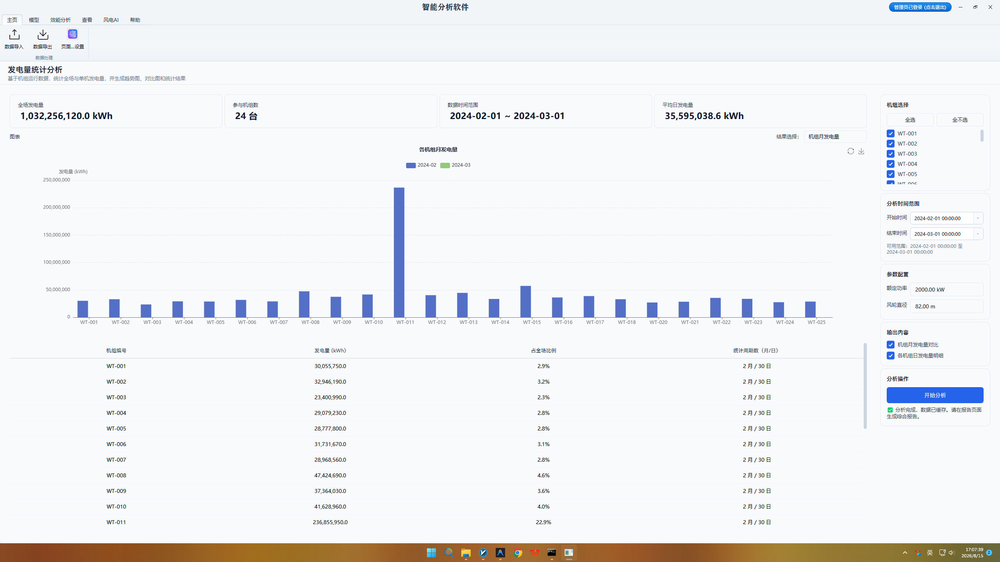
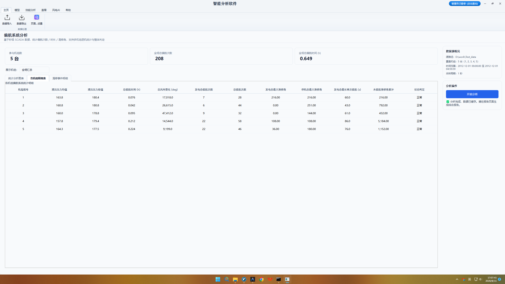
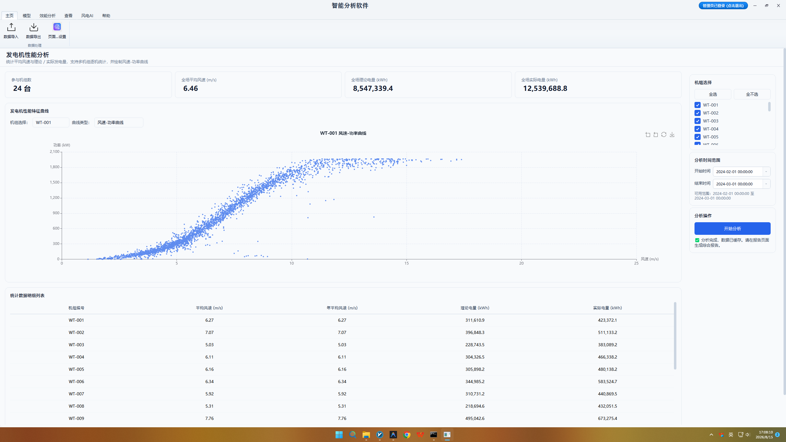
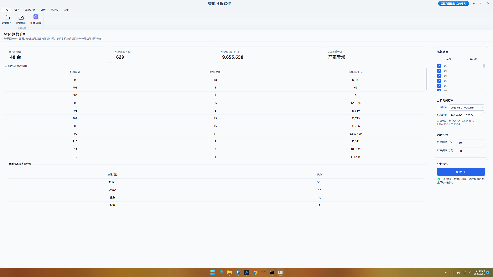
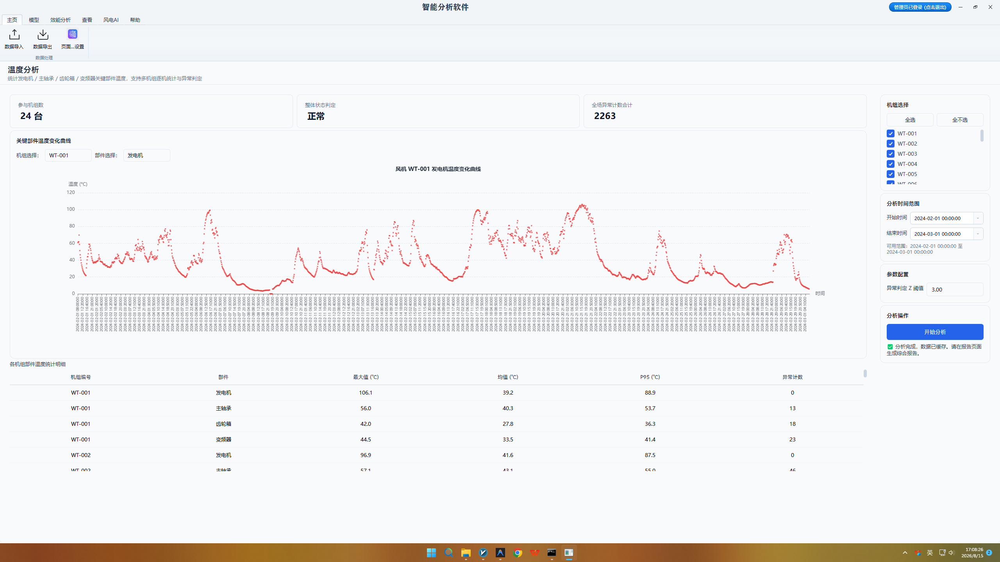
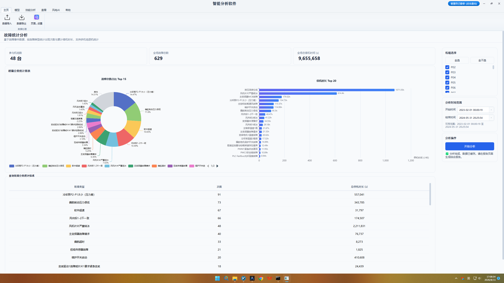

# 第三章 常规 SCADA 统计分析功能操作

## 3.1 发电量统计分析功能

发电量统计功能作为风电场日常效能监控与捕风品质评估的核心模块，旨在通过对风速-功率响应特性进行标准化修正与拟合，精准量化风机在不同风速区间的实际发电能力与捕风电量损失。按照国际电工委员会 IEC 61400-12 标准要求，机组输出功率深受环境气压、温度及海拔导致的空气密度波动影响；未经过气象条件修正的原始 SCADA 散点无法真实反映风机自身的捕风衰减。该功能通过引入动态空气密度补偿算法，消除了气象条件干扰，反映风轮气动捕风与机电转换的真实水平。

用户在顶部 Ribbon 导航栏【统计分析】选项卡中点击【发电量统计】图标切入该功能界面。在左侧控制面板中，运维人员首先选定待评估的目标风机节点（支持单机或多机集群）并设置分析的时间起止范围；随后配置空气密度修正开关与参照基准功率曲线库选定下拉框（支持选择标准 1.225 kg/m³ 密度的理论功率曲线或导入主机厂设计曲线）。设定完毕后点击【开始分析】按钮，后台计算引擎自动启动风速Bin分组与气密性修正切片算法。

计算完成后主视窗呈现高度丰富的交互式工程图表。主图表区同屏绘制原始 SCADA 风速-功率响应散点、Bin 均值拟合的实际功率响应曲线，以及理论设计功率曲线。通过图例开关，用户可自由切换不同风机曲线的显隐，直观比对实际功率曲线相比于理论曲线的下偏幅度；图表区同时引入散点离散度（标准差带）可视化，当散点在额定风速前呈现异常离散分布时，提示机组可能存在变桨卡阻或气动结冰故障。

主画布下侧的数据表格详细列出各机组的理论发电量、实际发电量、发电量达成率（%）、功率曲线拟合偏差度及理论捕风损失电量（kWh）。表格支持按发电量达成率升序排列，使运维管理人员能够直观锁定发电效能最差的低效机组。分析结论不仅为单机发电效能评级提供依据，更为风电场大修后叶片角度校正与控制策略优化的效果评估提供了定量化数据对比。

<table>
<colgroup>
<col style="width: 100%" />
</colgroup>
<tbody>
<tr>
<td style="text-align: center;">

<strong>【图 3-1：发电量统计功能运行与功率曲线拟合界面图】</strong>

图注说明：该图展示了发电量统计分析主界面。图表同屏绘制了原始 SCADA 功率散点分布、经过气密性修正后的 0.5 m/s Bin 均值实际功率响应曲线（蓝色实线）及厂家设计标准功率曲线（灰色虚线），顶部 KPI 卡片实时计算全场容量系数与理论发电量达成率。
</td>
</tr>
</tbody>
</table>

## 3.2 偏航系统分析功能

偏航系统分析功能旨在诊断风电机组风轮的对风精度、偏航动作频次及偏航机构的运行健康状态。偏航系统作为风机实现最大捕风效率与结构受力保护的核心执行机构，若由于风向标安装零偏或控制策略偏置导致长期处于对风偏差状态，不仅会引发捕风功率非线性衰减，还会产生不对称的气动倾覆力矩，加剧主轴承与塔筒的疲劳破坏；同时，过度频繁的偏航动作会剧烈增加偏航电机的自用电功耗与偏航齿圈的机械磨损，因此开展偏航系统专项统计诊断具有极高的工程应用价值。

运维人员在【统计分析】选项卡中点击【偏航系统分析】按钮进入该功能界面。在左侧控制面板区，用户首先在风机树中勾选待诊断的目标机组，并指定诊断的时间历程窗口；随后根据风机主控参数选定偏航制动压力限值与对风角度容差阈值（默认设定为对风容差 5°）。确认参数后点击【开始分析】按钮，后台多线程引擎自动提取偏航状态标识、风速、风向及机舱角等时序列数据进行关联计算。

计算完成后主视窗呈现丰富的交互式工程图表。上侧绘制风向对风偏差角度分布玫瑰图与对风误差频次分布直方图，直观呈现机组在不同风速区间下的平均对风偏差分布情况，帮助运维人员准确识别是否存在固定的风向传感器零点偏置；下侧同步展示顺时针与逆时针偏航动作频次统计图、偏航累计时长分布图以及偏航动作期间的偏航电机制动压力波动曲线，实现对偏航执行机构运行品质的全方位监控。

主画布下侧的数据表格呈现详细的定量统计指标，包含机组编号、对风偏差均值、对风偏差标准差、偏航总次数、偏航总时长及估算的偏航功耗损失。表格支持按对风偏差均值降序排列，以便快速锁定全场偏航性能最差的“病态机组”。针对对风偏差均值显著超过 8° 的机组，系统在诊断结论中自动输出‘建议校准机舱风向标零点’的提示，为现场运维人员提供精准的操作指导。

<table>
<colgroup>
<col style="width: 100%" />
</colgroup>
<tbody>
<tr>
<td style="text-align: center;">

<strong>【图 3-2：偏航系统分析功能运行与对风玫瑰图界面图】</strong>

图注说明：该图展示了偏航系统对风偏差（Yaw Alignment Loss）分析界面。图表呈现风向角差值与捕风功率损失的极坐标分布图及 360° 风向扇区散点图，帮助运维人员直观识别机组是否存在主导风向下的偏航零位偏差。
</td>
</tr>
</tbody>
</table>

## 3.3 发电机性能分析功能

发电机性能分析功能用于评估风电传动链中发电机机电转换效率、转速-负荷响应特性以及高负荷下的运行品质。发电机作为将机械能转换为电能的关键核心部件，在长期高负荷、频繁变风力冲击的恶劣工况下，容易发生转子滑差率异常、绕组绝缘老化、发电机效率下降以及转速过冲等隐患。通过对 SCADA 系统中的发电机转速、电功率、发电机转矩及转子温度等多维参数进行联动统计分析，能够有效识别发电机的早期性能退化。

用户在【统计分析】选项卡中点击【发电机性能分析】按钮唤醒该模块界面。运维人员在左侧控制面板中配置分析目标机组与时间窗，同时可对发电机额定转速区间（如 1000~1800 rpm）与电功率负荷分级进行过滤筛选。控制面板内配置了转矩-转速响应限制边界阈值，用户确认参数后点击【开始分析】，后台引擎自动提取发电机转速与功率的时序列切片，计算机电转换效率及响应离散度。

图表区主图呈现发电机转速-功率联动响应散点图与转矩-转速特性曲线。通过在图表中叠加发电机额定转矩限制线与额定功率线，用户可以清晰查看发电机在切入、恒转矩控制以及恒功率控制三大区域的实际运行轨迹。当散点出现大量偏离控制轨迹的异常点（如转速已达额定但电功率严重不足），表明发电机可能存在励磁控制异常或机械传动滑频问题。

数据表格区域展示发电机运行性能定量评估指标，包含机组编号、发电机平均转速、转速最大过冲量、平均机电转换效率及高负荷段转矩波动率。表格自动筛选出效率降幅超过预警阈值的机组，并高亮提示发电机运行健康评级。该分析模块为发电机定期维护、碳刷更换、滑环清理以及发电机轴承润滑周期的制定提供了可靠的数据支持。

<table>
<colgroup>
<col style="width: 100%" />
</colgroup>
<tbody>
<tr>
<td style="text-align: center;">

<strong>【图 3-3：发电机性能分析功能运行与转矩-转速曲线界面图】</strong>

图注说明：该图展示了发电机转速-功率（RPM-Power）控制包络线分析界面。图表同屏绘制了切入区、最大功率点追踪区（MPPT）、额定功率区及过载限幅区的转速-功率响应包络，高亮标注转速突变与异常跳变点。
</td>
</tr>
</tbody>
</table>

## 3.4 退化趋势分析功能

退化趋势分析功能旨在捕捉风电机组大部件（如齿轮箱、主轴承、变桨传动机构等）在长期连续交变载荷作用下的渐进性、隐蔽性物理劣化过程。在退化早期，单一时刻的物理量往往并未超出高限告警阈值，传统监控系统难以触发报警；然而从长时段统计视角来看，部件运行参数的均值、方差及高阶统计特征已悄然发生显著的趋势性偏移。通过构建滑动窗口统计模型与基线健康对比算法，捕捉大部件参数的微弱异常偏移，是实现风电预警维保的关键技术。

用户在【统计分析】选项卡中点击【退化趋势分析】图标，进入该功能诊断页面。在控制面板中，运维人员首先选择需要分析的大部件类型（如齿轮箱主轴承或变桨电机）及目标机组集合；随后设定滑动统计窗口的时间步长（例如设定为 7 天或 14 天滑动窗口）与计算统计量（均值、标准差、峰度及 3-Sigma 残差）；同时可指定历史健康工况时间段作为基线参考标尺，配置完成后点击【开始分析】指令启动趋势拟合引擎。

图形展示区以上下双图形式呈现退化趋势可视化结果：上图展示部件特征参数随运行时间的长期演变折线，并同屏叠加滑动均值趋势线与 3-Sigma 统计上限边界；下图呈现剔除负荷与环境干扰后的标准化偏移残差散点。当折线突破统计控制上限或残差散点呈现持续单调上升趋势时，图表会自动以红黄色告警区间进行高亮标注，直观提示部件物理状态已偏离正常健康基线。

数据表格呈现大部件退化评估综合统计表，包含机组编号、部件名称、退化偏移速率（%/月）、残差峰值以及健康状态预警评级（正常/观察/预警/危险）。表格支持按照退化偏移速率降序排列，使运维人员能够提前数周甚至数月发现隐患部件，为备品备件采购与大修计划排期预留充足的准备时间。

<table>
<colgroup>
<col style="width: 100%" />
</colgroup>
<tbody>
<tr>
<td style="text-align: center;">

<strong>【图 3-4：退化趋势分析功能运行与 3-Sigma 趋势界面图】</strong>

图注说明：该图展示了关键部件性能退化趋势分析界面。采用统计过程控制（SPC）方法绘制性能指标的时序演变折线，叠加 3-Sigma 统计上限与下限控制边界（红色虚线），高亮标注超出 3-Sigma 的异常退化点。
</td>
</tr>
</tbody>
</table>

## 3.5 温度分析功能

温度分析功能用于监控发电机绕组、主轴承、齿轮箱油温及变频器功率模块等关键热敏部件的温度响应，评估传动链润滑状态与热平衡特性。部件温度过高会导致润滑油粘度下降失效、绝缘材料加速老化乃至发生轴承烧毁事故。由于部件温度与环境气温及负荷功率高度强相关，仅凭固定绝对温度门限报警容易发生误报或漏报。该功能通过物理热传导拟合算法，自动剔除环境与负荷干扰，提取纯粹的‘异常温度残差’进行精确诊断。

在【统计分析】选项卡中点击【温度分析】按钮进入该功能页面。在控制面板中，运维人员选择待评估的风机节点与分析时间历程，控制面板特别提供了热传导模型残差计算开关。用户可配置环境温度基准区间与负荷功率过滤门限，并设定异常温升残差报警阈值（如残差超过 15 ℃）。点击【开始分析】后，后台引擎调用物理热平衡拟合算法，自动剔除环境气温与机组负荷波动的热干扰。

主图表区展示多测点温度同屏对比趋势图与异常温度残差分布图。图中同时绘制环境温度、发电机绕组温度、主轴承温度及齿轮箱油温的随时间演变折线；在残差分布图中，正常状态下的残差呈围绕零点平稳波动的正态分布，而一旦部件出现润滑失效或接触磨损，残差散点将显著向上偏离正态区间，形成清晰的过热预警轨迹。

数据表格展示全场热敏部件温度诊断明细表，包含机组编号、最高实测温度、平均环境温度、热平衡拟合残差、温升速率及过热预警等级。表格自动高亮标出残差超标的病态部件，并输出‘齿轮箱冷却风扇效能下降’或‘主轴承润滑脂污染’等针对性诊断建议，为现场散热系统检修与润滑维护提供科学依据。

<table>
<colgroup>
<col style="width: 100%" />
</colgroup>
<tbody>
<tr>
<td style="text-align: center;">

<strong>【图 3-5：温度分析功能运行与异常温升残差界面图】</strong>

图注说明：该图展示了主轴承与齿轮箱关键部位温度分析界面。上图绘制传动链温度随功率及环境温度变化的散点曲线，下图呈现多元回归拟合后的温度残差（Temperature Residual）分布图，突出残差偏高的发热异常机组。
</td>
</tr>
</tbody>
</table>

## 3.6 故障统计分析功能

故障统计分析功能用于解析风电机组的故障事件日志，核算停机电量损失，为风电场可靠性管理（RAMS）与运维资源调度提供权威数据。在风场实际运营中，不同类型故障（如变桨系统故障、偏航系统故障、网侧电气故障等）的发生频次与造成的停机电量损失存在极大差异。通过对 SCADA 历史故障告警日志执行高精度的分类统计、停机时间核算与等效利用小时损失评估，能够帮助风场管理者精准识别影响全场可靠性的主要矛盾。

用户在【统计分析】选项卡中点击【故障统计分析】图标，唤醒故障统计管理视图。在控制面板中，运维人员可选择特定的风机节点或全场风机，设定故障分析的时间范围；控制面板提供了故障类型过滤下拉框与停机时长下限门限（如过滤小于 5 分钟的瞬时告警），支持按故障代码、故障等级进行多维度筛选。配置完成后点击【开始分析】，后台引擎自动解析故障事件日志，匹配时间序列中的功率损失。

图表呈现区采用了丰富的管理学统计图表：左上侧绘制全场故障频次与停机时长 Pareto 帕累托分析图，直观揭示引发 80% 停机损失的 20% 核心故障类型；右上侧绘制各部件故障占比饼图，展示变桨、发电机、齿轮箱及变频器等子系统的故障发生比例；下侧展示单机平均无故障间隔时间（MTBF）与平均修复时间（MTTR）对比直方图，清晰刻画各机组的可靠性水平差异。

数据表格区域展示详细的故障事件统计明细表，包含机组编号、故障代码、故障描述、发生次数、累计停机时长（小时）、估算停机损失电量（kWh）及 MTBF 评价。表格支持导出为标准 Excel 表格，方便运维部门用于风机供应商质保理赔、运维备件库存规划以及月度/年度风电场可靠性评估报告的编制。

<table>
<colgroup>
<col style="width: 100%" />
</colgroup>
<tbody>
<tr>
<td style="text-align: center;">

<strong>【图 3-6：故障统计分析功能运行与 Pareto 帕累托图界面图】</strong>

图注说明：该图展示了风电场故障统计分析界面。界面包含不同故障类别（变桨、偏航、齿轮箱、发电机、变频器）的发生频次柱状图与累计百分比 Pareto 帕累托曲线，指导运维团队优先处理累加贡献前 80% 的主要故障类型。
</td>
</tr>
</tbody>
</table>
