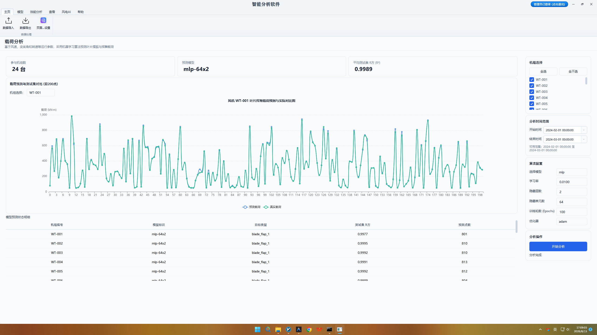
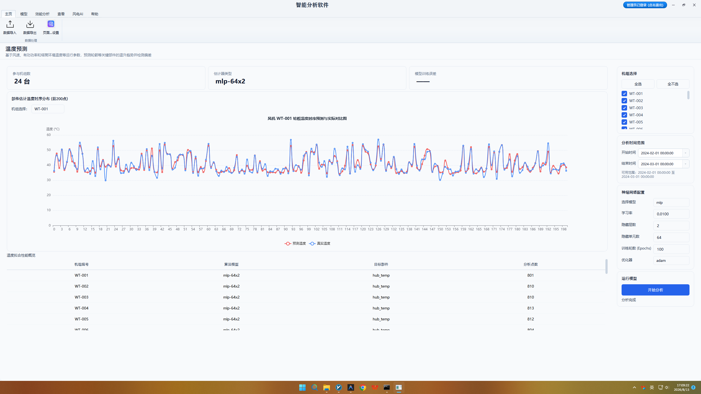
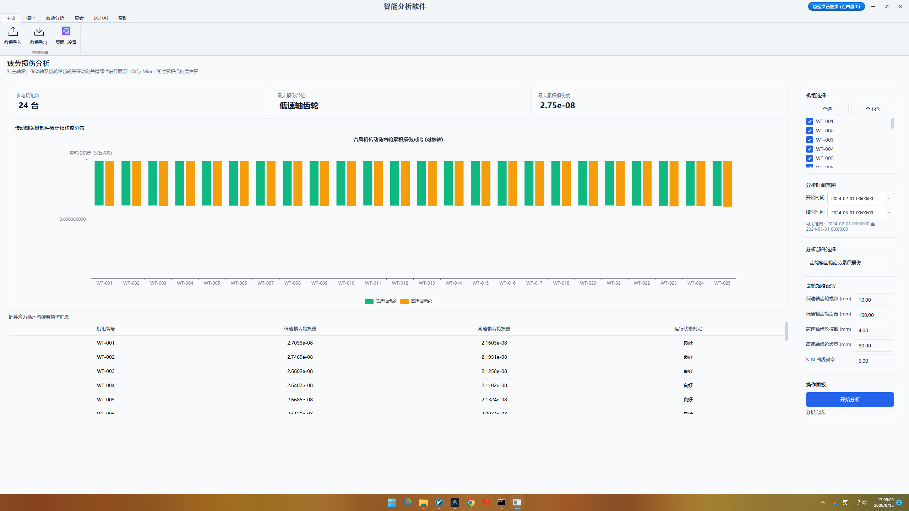
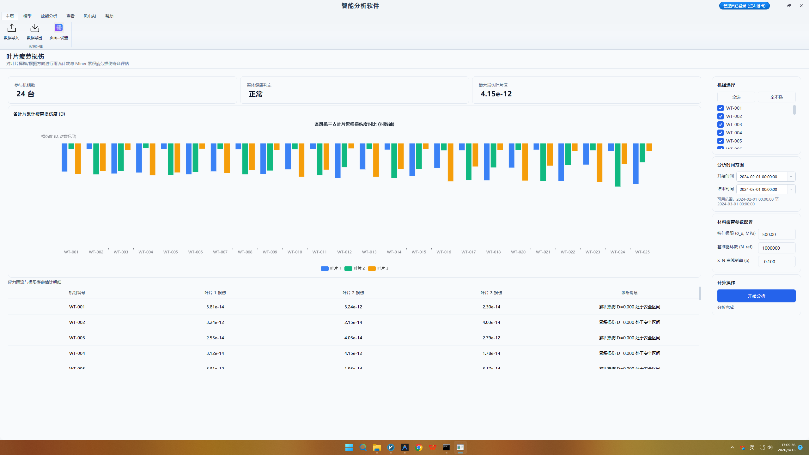
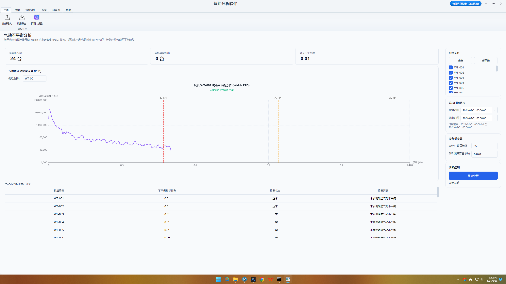
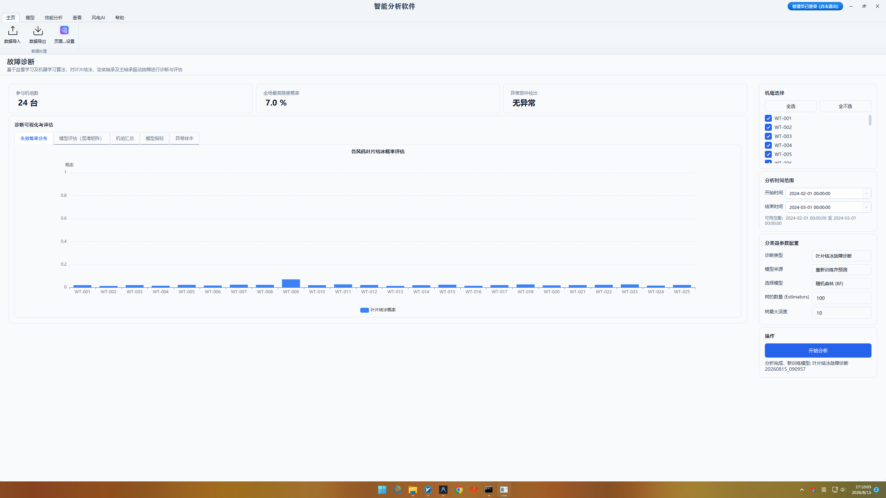
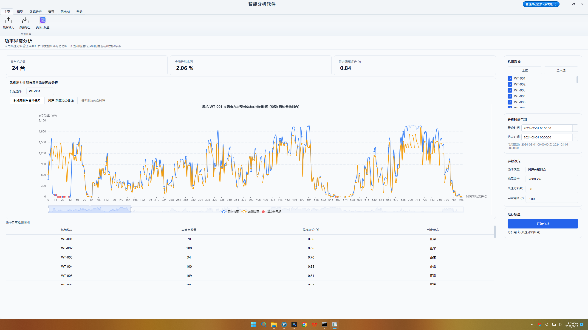

# 第四章 高级智能分析算法操作

## 4.1 载荷预测分析功能

风电机组作为大型柔性高耸结构，在大大气湍流、阵风冲击、塔影效应及风切变的共同作用下，长期承受着极其复杂的变幅交变载荷。风轮扫掠面的不均匀气动推力与气动倾覆力矩，会直接传递至主轴、齿轮箱及塔筒结构节点，引发严重的动态应力响应。直接在风机结构上大量贴附应变片进行载荷测量成本极高且耐久性差；因此，通过基于 SCADA 运行数据与气动物理响应模型进行交变载荷预测，对于评估风机关键承载件的结构安全、防范极端阵风过载以及开展风电场寿命延长评估具有极高的工程价值。

用户在顶部 Ribbon 导航栏【智能分析】选项卡中点击【载荷预测】图标，唤醒载荷分析主界面。在控制面板中，运维人员首先在风机节点选择器中选定待预测的目标机组，并指定分析的时间历程窗口；随后配置气动推力系数参数、风轮扫掠面积、空气密度及塔筒结构刚度限值（一般保持系统针对该机型的预设物理参数即可）。确认参数后点击【开始分析】按钮，后台计算引擎自动提取风速、功率、转速及变桨角时序列，调用空气动力学推力模型推算动态载荷历程。

计算完成后，主视窗呈现高度丰富的载荷历程与频谱分析图表。上图呈现风轮推力（Fx）、俯仰弯矩（My）、偏航弯矩（Mz）以及塔顶双向倾覆力矩随时间演变的动态响应历程曲线；下图展示对载荷历程进行快速傅里叶变换（FFT）得到的载荷频谱分布图，清晰刻画 1P（旋转频率）、3P（叶片通过频率）及结构共振频段下的载荷能量集中情况，帮助运维工程师直观诊断风机是否存在由于塔影效应引发的载荷异常放大现象。

数据表格区域展示载荷预测定量评估结果，包含机组编号、最大等效推力（kN）、最大塔弯矩（kN·m）、极限载荷安全系数及载荷波动标准差。表格自动高亮标出在湍流风况下极限载荷接近结构设计安全边界的机组，并输出‘建议在强阵风季节优化切入切出控制策略’等针对性运维提示，为风电场降载控制策略优化与结构安全性评估提供了完备的量化支撑。

<table>
<colgroup>
<col style="width: 100%" />
</colgroup>
<tbody>
<tr>
<td style="text-align: center;">

<strong>【图 4-1：风轮与塔筒变幅载荷预测分析界面图】</strong>

图注说明：该图展示了塔筒与叶根关键部位载荷预测界面。上图绘制基于多元回归模型预测的弯矩/轴力时序响应曲线，下图展现实际测得载荷与预测载荷的偏差残差图，顶部卡片显示最大预测弯矩与安全载荷系数。
</td>
</tr>
</tbody>
</table>

## 4.2 温度预测分析功能

发电机绕组、齿轮箱轴承及主轴承等关键传动部件的温度变化，是反映设备摩擦损耗与热平衡状态的最直观物理量。传统 SCADA 监控通常采用固定的绝对温度阈值报警，但部件实际温度深受环境气温（季节与昼夜温差）以及发电机实时负荷功率的剧烈影响。在冬季低温或低负荷工况下，即使部件已发生严重的局部过热缺陷，其绝对温度依然可能低于固定报警限值导致漏报。为此，系统引入了基于数据驱动的物理热响应预测模型，通过提取剔除环境与负荷干扰后的‘纯异常温度残差’进行早期过热预警。

用户在【智能分析】选项卡中点击【温度预测】按钮进入高阶温度预警界面。在控制面板中，运维人员首先选择分析目标机组与时间起止范围；控制面板内特别提供了基线健康窗口选择器与模型算法选定下拉框：用户可指定机组历史上处于健康润滑状态的 30 天数据作为训练基线，并选择基于热传导方程拟合或机器学习回归模型。设定显著性α水平阈值（如 α=0.01）后点击【开始分析】，后台引擎自动完成热平衡基线模型训练与预测。

结果呈现区上图绘制实测温度曲线、模型理论预测温度曲线以及 3-Sigma 统计控制上边界；下图呈现标准化异常温度残差时序列散点图。在正常健康状态下，实测温度与预测温度高度重合，残差在零点附近呈平稳正态分布；当轴承内部出现金属剥落或润滑油失效时，摩擦生热激增会导致实测温度显著高于理论预测值，残差散点向上突破统计上限，形成清晰的异常温升预警轨迹。

数据表格呈现关键热敏部件过热预警诊断表，包含机组编号、部件名称、实测最高温度、理论基准温度、异常残差均值及过热风险评级（正常/轻度/中度/严重）。表格自动标出残差持续升高的病态机组，使运维人员能够在绝对温度尚未触发报警前提前数周发现传动链早期润滑不良或轴承缺陷，实现真正意义上的预测性维保。

<table>
<colgroup>
<col style="width: 100%" />
</colgroup>
<tbody>
<tr>
<td style="text-align: center;">

<strong>【图 4-2：基于热模型与负荷残差的温度预测分析界面图】</strong>

图注说明：该图展示了基于 BP/MLP 神经网络的部件温度预测与早期预警界面。图表对比展示实际温度曲线与神经网络预测温度曲线，对残差持续超过 3.0°C 的预警时段施加橙色遮罩高亮提醒。
</td>
</tr>
</tbody>
</table>

## 4.3 传动链疲劳损伤评估功能

风电机组传动链关键部件（如主轴、齿轮箱齿轮齿根、发电机轴承等）在长期复杂的交变应力作用下，金属材料内部会产生微观晶界滑动与损伤累积。这种疲劳损伤在外观上不可见，但随着运行时间的推移持续单调递增，当累积损伤达到材料临界阈值时将突发疲劳断裂事故。依据帕姆格伦-迈纳（Palmgren-Miner）线性疲劳累积损伤假定，通过对 SCADA 历史交变应力响应历程进行量化计算，评估传动链及主要结构件的累积疲劳损伤程度，是防止重性机械断裂事故的核心技术手段。

用户在【智能分析】选项卡中点击【疲劳损伤】（MBCFDC）图标进入传动链疲劳评估页面。在控制面板中，运维人员选择待评估的风机机组与时间历程范围；控制面板集成了材料 S-N 曲线物理参数配置项（包括材料疲劳极限、S-N 曲线斜率 m 值及应力集中系数 Kt）。用户可保持系统内置的标准材料参数或根据部件实际材质进行微调，确认无误后点击【开始分析】按钮，后台计算引擎自动启动交变载荷应力幅值提取与损伤累积计算。

图形展示区上图呈现全场各机组传动链关键节点（主轴、齿轮箱输入轴、发电机轴承）的累积疲劳损伤对比柱状图；下图呈现特定选定机组累积损伤随运行月份演变的单调上升折线图。通过同屏对比不同机组的损伤累积速率，运维人员可以清晰直观地识别出哪些机组由于长期处于强风或复杂地形风况下而承受了更高的疲劳消耗。

数据表格区域展示传动链疲劳损伤评估明细表，包含机组编号、评估部件、当前累积损伤因子 D（D≥1.0 判定为疲劳破坏）、损伤累积速率（/年）、设计疲劳寿命占比以及疲劳健康等级。分析结论为风电场大部件定期探伤检测、润滑油品升级以及超期服役机组的退役/续运决策提供了坚实的物理理论依据。

<table>
<colgroup>
<col style="width: 100%" />
</colgroup>
<tbody>
<tr>
<td style="text-align: center;">

<strong>【图 4-3：传动链与结构件疲劳损伤评估界面图】</strong>

图注说明：该图展示了主轴与齿轮箱结构雨流计数与 Miner 疲劳损伤累积分析界面（MBCFDC）。上图展示雨流应力幅值-均值二维直方图，下图绘制随时间累积的 Miner 疲劳损伤度（D &lt; 1.0）演变曲线。
</td>
</tr>
</tbody>
</table>

## 4.4 三叶片疲劳损伤对比功能

叶片作为风电机组捕获风能的最核心构件，也是结构上最容易发生疲劳失效的薄弱环节。在实际运行中，风轮的三片叶片（A叶片、B叶片、C叶片）由于制造质量离散性、现场安装桨角误差或运行中的气动污染差异，会导致三叶片在挥舞（Flapwise）方向与摆振（Edgewise）方向上承受的交变弯矩存在显著不一致。若某单片叶片的疲劳损伤累积速率显著高于其他两叶片，将导致风轮质量与气动双重不平衡，甚至引发叶片根部开裂事故。

运维人员在【智能分析】选项卡中点击【叶片疲劳损伤】（BL）按钮，进入三叶片疲劳专项对比界面。在控制面板中，用户选择目标风机，并分别映射 A、B、C 三叶片的摆振与挥舞弯矩传感器通道（或由 SCADA 变桨电流与风速推算的载荷通道）；控制面板内配置了复合材料 S-N 曲线斜率（通常玻璃纤维复合材料 m=10~12），用户点击【开始分析】后，后台引擎并发计算三叶片双向雨流计数与累积损伤。

结果呈现区采用了直观的三叶片对比可视化图表：左侧绘制三叶片摆振与挥舞疲劳损伤雷达对比图，三叶片形状若呈现显著偏心图形，表明存在严重的叶片受力不均；右侧展示三叶片累积损伤随时间的演变折线图，直观标注出损伤累积最快的‘弱势叶片’。通过图表交互，运维人员可以轻松比对 A、B、C 任意两叶片之间的损伤差值比例。

数据表格区域展示三叶片疲劳损伤对比统计表，包含机组编号、A/B/C 三叶片挥舞损伤值、摆振损伤值、叶片间最大损伤偏差率（%）及叶片健康一致性评级。针对叶片间损伤偏差率超过 25% 的异常机组，系统自动输出‘建议现场核查三叶片零点桨角及叶片配重’诊断建议，为叶片针对性维保提供指导。

<table>
<colgroup>
<col style="width: 100%" />
</colgroup>
<tbody>
<tr>
<td style="text-align: center;">

<strong>【图 4-4：风电机组三叶片疲劳损伤对比分析界面图】</strong>

图注说明：该图展示了多风机叶片疲劳损伤（Blade Fatigue）横向对比界面。柱状图直观对比全场各机组叶片（Blade A/B/C）的年化疲劳累积损伤率，重点高亮呈现损伤速率显著高于全场平均水平的病态叶片。
</td>
</tr>
</tbody>
</table>

## 4.5 气动不平衡诊断功能

风机三叶片在安装或运行中若存在气动偏置角误差（即安装零位偏差），会导致风轮旋转一周时三叶片产生的气动升力不相等。这种气动不一致性不仅会降低机组的整体捕风效率，更会在机舱与塔顶方向激发出强烈的 1P（风轮旋转频率）气动不平衡力与 3P（叶片通过频率）脉动冲击。持续的双向振动会剧烈加剧塔筒螺栓松动、主轴承磨损及机舱底座疲劳损伤，因此开展气动不平衡诊断是风机交接验收与定期维护的必做项目。

用户在【智能分析】选项卡中点击【气动不平衡分析】（PI）图标进入气动诊断页面。在控制面板中，运维人员选择待诊断的机组节点与分析时间窗；配置塔顶前后方向（X向）与左右方向（Y向）振动加速度传感器通道，并设定 band-pass 频带滤波参数（聚焦于 1P 旋转频段）及额定风速筛选区间。点击【开始分析】后，后台引擎自动对塔顶双向振动信号进行 FFT 频谱分析与 1P 频域提取。

图形展示区呈现高度专业的振动物理诊断图表：左侧绘制塔顶双向振动轨迹极坐标散点图（Orbit Graph），直观展示机舱振动椭圆的轨迹形状与主振动方向；右侧上图展示振动加速度频谱图，高亮标出 1P 与 3P 频点处的峰值幅值；右侧下图绘制 1P 振动幅值随风速变化的响应曲线。当 1P 振动幅值随风速呈二次方剧烈上升且极坐标轨迹严重偏心时，是气动不平衡故障的典型物理特征。

数据表格呈现气动不平衡诊断评价表，包含机组编号、1P 振动幅值均值（m/s²）、3P 振动幅值、气动不平衡严重程度评级及主导偏差叶片定位结论。系统算法能够根据振动相位特征进一步指出具体是哪一片叶片存在角度偏置（例如提示‘B 叶片气动角偏置约 1.2°’），指导现场运维人员进行高精度的变桨零位螺栓调整。

<table>
<colgroup>
<col style="width: 100%" />
</colgroup>
<tbody>
<tr>
<td style="text-align: center;">

<strong>【图 4-5：三叶片气动差异与双向振动不平衡诊断界面图】</strong>

图注说明：该图展示了气动不平衡分析（PI）界面。呈现叶片挥舞方向与摆振方向的双向振动加速度频谱分布图及极坐标振动相位图，精确定位气动重力不平衡或叶片安装角偏差。
</td>
</tr>
</tbody>
</table>

## 4.6 关键部件故障预警功能

风电机组在恶劣野外环境下运行，叶片气动结冰、变桨机构卡阻以及传动链轴承点蚀剥落是引发突发停机甚至倒塔事故的三大典型故障。这类故障在萌芽早期，单一传感器指标波动微弱，传统阈值报警往往难以察觉；而一旦发展至明显故障阶段，留给现场处置的时间极短。本系统构建了基于多特征融合与机器学习逻辑树的高级故障预警引擎，能够综合机舱气温、功率下偏幅度、变桨电流波动及轴承振动等多维信号，实现早期隐患的精准预警。

运维人员在【智能分析】选项卡中点击【关键部位故障诊断】（ErrorPrediction）图标唤醒预警模块。在控制面板中，用户选择目标风机及分析时间历程，下拉选择预警诊断目标（如【叶片结冰诊断】、【变桨卡阻预警】或【轴承剥落预警】）；控制面板内配置了预警敏感度因子（Soft/Normal/Strict）与多特征融合权重分值，用户点击【开始分析】后，后台引擎并行调度多维决策树模型进行特征比对与概率推断。

结果呈现区上图绘制机组综合健康度得分随时间的演变折线，并同屏标出预警临界阈值线；下图呈现特定故障类型的发生概率分布直方图与特征贡献度 Pareto 归因图。以叶片结冰诊断为例，当环境温度低于 2℃、风速正常但功率显著下偏且变桨电流异常增大时，系统健康度得分迅速下降，归因图直观展示功率下偏与温度指标对结冰预警的高贡献率。

数据表格展示关键部件早期故障预警明细表，包含机组编号、预警故障类型、预警触发时间、综合健康度得分、预测故障发生概率及建议处置措施。预警引擎能够比传统 SCADA 告警提前 4 至 24 小时发出结冰或卡阻预警，为风场人员采取加热除冰、降功率运行或紧急停机避险争取了宝贵的时间。

<table>
<colgroup>
<col style="width: 100%" />
</colgroup>
<tbody>
<tr>
<td style="text-align: center;">

<strong>【图 4-6：关键部件早期故障预警诊断界面图】</strong>

图注说明：该图展示了基于机器学习的故障诊断（Error Prediction）主界面。界面呈现针对齿轮箱轴承、发电机绕组、变桨电机的故障分类混淆矩阵（Confusion Matrix）与故障概率分类柱状图。
</td>
</tr>
</tbody>
</table>

## 4.7 异常功率检测功能

在风电场实际运营过程中，除了显性的故障停机电量损失外，还存在大量难以被察觉的隐性功率损失。常见的隐性损失原因包括：电网调度限电导致的强制降功率、主控变桨策略偏置引发的功率下偏、叶片表面污染结垢导致的气动效率衰减，以及传感器故障引发的虚假功率响应。对海量风速-功率散点进行高精度的自动分类与隐性电量损失精细化核算，对于追溯风场真实发电潜能与电费结算具有重要意义。

用户在【智能分析】选项卡中点击【功率异常检测】（AbPower）图标进入功率分类检测页面。在控制面板中，运维人员选择待检测的风机机组与时间起止范围，控制面板内置了功率散点分类判据阈值设置项：包含限电平顶识别敏感度、功率下偏幅度下限（如低于理论功率 15%）及气动衰减判定窗口。配置完毕后点击【开始分析】按钮，后台分类引擎调用密度聚类与曲线拟合算法，对数十万个功率数据点进行自动打标与分类。

图表呈现区主图展示高精度的四色异常功率分类散点图：图中用不同颜色直观区分四类运行状态——绿色代表正常发电散点、黄色代表电网限电散点、红色代表故障下偏散点、蓝色代表气动效率衰减散点。通过图例筛选，用户可以单独隔离出某类异常散点进行深度观察；图表下方同步绘制各分类电量损失在选定时间窗内的对比柱状图，直观量化各项损失的相对比重。

数据表格区域展示功率异常检测精细化核算表，包含机组编号、正常发电机时（小时）、限电损失电量（kWh）、故障下偏损失电量、气动衰减损失电量及全场综合发电效能指数。表格支持导出为标准报表，为风电场向电网公司提交限电补偿申诉、安排叶片清洗维护以及评价主机厂功率调节性能提供了权威的数据凭据。

<table>
<colgroup>
<col style="width: 100%" />
</colgroup>
<tbody>
<tr>
<td style="text-align: center;">

<strong>【图 4-7：隐性功率损失与异常功率检测界面图】</strong>

图注说明：该图展示了功率曲线异常点识别（Abnormal Power Detection）界面。采用 DBSCAN 聚类算法在风速-功率散点图上自动标记并剔除限电、停机、变桨故障导致的下异常点，提取纯净的基础功率曲线。
</td>
</tr>
</tbody>
</table>
