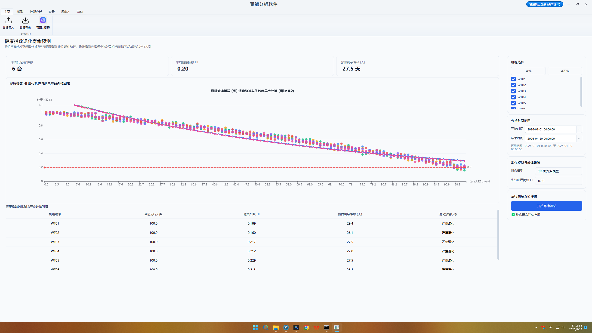
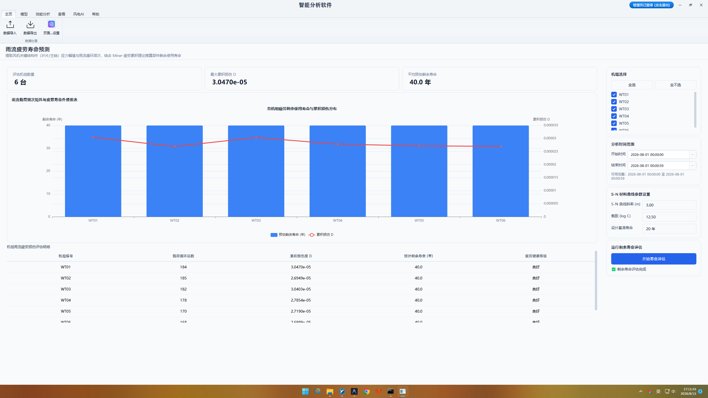
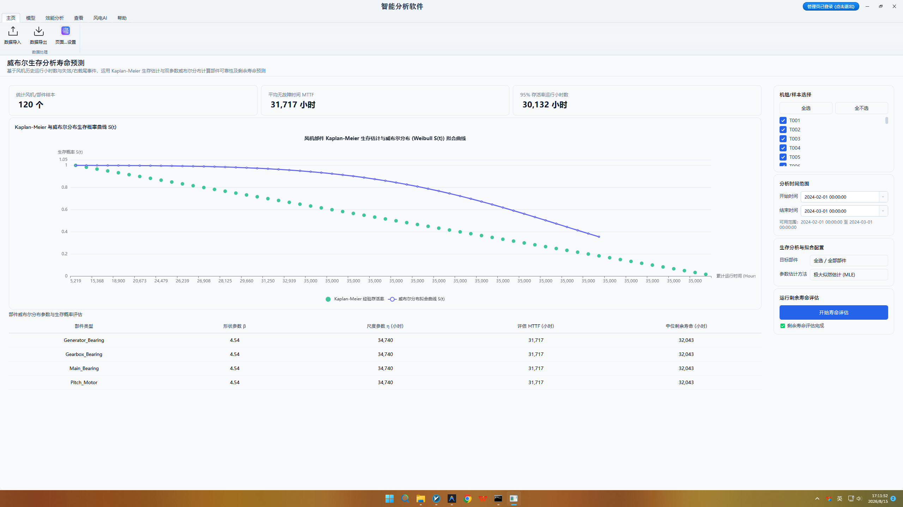

# 第六章 剩余寿命预测（RUL）专项操作

## 6.1 主轴承健康退化与剩余寿命预测操作

主轴承作为风电机组传动链中支撑风轮旋转并承受巨大风载荷的核心低速部件，其运行状态直接决定了整机的结构安全。主轴承一旦发生滚道点蚀剥落或保持架断裂，将引发严重的抱轴事故，造成巨大的吊装维修成本与停机电量损失。由于主轴承转速低（通常在 8~20 rpm）、载荷波动剧烈，传统振动监控信噪比极低；通过结合 SCADA 系统中的长时段温度、润滑油温、转速及交变载荷数据，构建基于概率退化过程的剩余寿命预测（Remaining Useful Life, RUL）模型，是实现主轴承预测性维保与防范重大恶性事故的工程关键。

用户在顶部 Ribbon 导航栏【智能分析】选项卡中点击【主轴承 RUL 预测】图标进入主轴承寿命评估界面。在控制面板中，运维人员首先在风机树中选定目标机组，并指定长跨度的历史分析窗口（建议选择至少 6 个月数据）；随后配置主轴承额定疲劳寿命 L10h 标尺、轴承结构几何参数，以及退化失效临界阈值 D_critical（如设定健康指数阈值 HI=0.2）。选定预测算法（支持随机过程退化模型或粒子滤波算法）后点击【开始分析】，后台引擎自动提取时序列特征并外推剩余寿命。

主视窗图形呈现区上图绘制主轴承健康退化指数（Health Index, HI）随运行时间的历史演变折线与未来退化外推轨迹；下图呈现预测剩余寿命的概率密度函数（PDF）分布曲线图。图中清晰标示出中位剩余寿命（50% 分位数）以及 95% 置信区间上下限（如 \[1.2年, 2.1年\]），直观展示了退化趋势的确定性与不确定性界限，使用户能够全面把控主轴承寿命衰减的物理演变过程。

数据表格区域展示主轴承 RUL 预测定量评估表，包含机组编号、当前 HI 健康指数、预测剩余寿命（天/年）、95% 置信区间及建议维保节点。对预测寿命低于 1 年的危急机组，系统自动标注高等级红框预警，并建议‘立即安排润滑油品金属磨粒光谱分析与内窥镜检查’，为大修排期提供科学指引。

<table>
<colgroup>
<col style="width: 100%" />
</colgroup>
<tbody>
<tr>
<td style="text-align: center;">

<strong>【图 6-1：主轴承健康退化与剩余寿命预测界面图】</strong>

图注说明：该图展示了基于指数退化模型（Exponential Degradation）的部件剩余寿命（RUL）预测界面。图表绘制关键健康指标（HI）随时间拟合的指数衰减曲线，同屏画出失效阈值线（Failure Threshold）与 95% 置信区间包络带，预测剩余可用寿命天数。
</td>
</tr>
</tbody>
</table>

## 6.2 变桨轴承疲劳退化与剩余寿命预测操作

变桨轴承位于风轮叶根与轮毂之间，其运行工况极具特殊性：变桨轴承并非连续旋转，而是在微风与阵风调节下进行频繁的微幅往复摆动。这种高接触应力下的微幅摆动极易引发滚道与滚珠之间的‘压痕磨损’（False Brinelling）与微动磨损，进而导致变桨卡阻或叶片失控事故。由于风轮三叶片受力存在不一致性，三套变桨轴承的疲劳退化速率往往不同；因此开展三叶片变桨轴承的 RUL 专项评估与寿命对比非常必要。

运维人员在【智能分析】选项卡中点击【变桨轴承 RUL 预测】按钮，切入变桨轴承寿命评估工作区。在控制面板中，用户选定分析机组，并映射 A、B、C 三叶片变桨系统的力矩与摆动角传感器通道；控制面板内置了微动磨损损伤累积模型参数（包括接触应力指数与摆动行程权重），用户点击【开始分析】后，后台引擎自动对三叶片的往复摆动历程进行雨流计数与应力谱提取，并行运行三叶片变桨轴承退化外推算法。

结果呈现区上图绘制 A、B、C 三叶片变桨轴承健康退化轨迹同屏对比折线图，同屏标出三轴承的退化临界告警线；下图呈现各变桨轴承剩余寿命的概率密度分布图与累积微动磨损损伤演变图。通过图形对比，运维人员可以直观查看三叶片变桨轴承的退化差异，迅速识别出寿命衰减最快的‘薄弱轴承’。

数据表格区域展示三叶片变桨轴承 RUL 预测评估明细表，包含机组编号、A/B/C 轴承当前退化指数、各轴承预测剩余寿命（年）及轴承寿命离散度。对预测寿命剩余不足 6 个月的变桨轴承，系统给出‘加注特种抗微动磨损润滑脂或安排叶片吊装换轴承’的操作建议，有效防范变桨卡阻导致的甩叶片风险。

<table>
<colgroup>
<col style="width: 100%" />
</colgroup>
<tbody>
<tr>
<td style="text-align: center;">

<strong>【图 6-2：变桨轴承疲劳退化与剩余寿命预测界面图】</strong>

图注说明：该图展示了基于雨流计数与 S-N 疲劳损伤曲线的变桨齿轮/轴承 RUL 预测界面。图表展示应力循环谱分布与累积疲劳损伤 S-N 衰减历程，预测在当前风况载荷下的剩余疲劳寿命。
</td>
</tr>
</tbody>
</table>

## 6.3 变桨齿轮与传动齿圈剩余寿命预测操作

变桨驱动小齿轮与轮毂内侧的变桨大齿圈构成开式齿轮传动副，是控制叶片桨角旋转的最终执行机构。在阵风冲击与紧急顺桨过程中，齿轮接触面承受巨大的瞬态冲击载荷；加之开式齿轮润滑条件恶劣，齿面极易发生胶合、点蚀剥落乃至齿根疲劳断裂。变桨齿圈一旦发生断齿，将导致该叶片瞬间失去变桨控制能力，引发严重的风轮飞车隐患；因此对变桨齿轮副进行 RUL 剩余寿命预测是确保风机控制安全的核心闭环。

用户在【智能分析】选项卡中点击【变桨齿圈 RUL 预测】图标，唤醒齿轮寿命评估工作区。在控制面板中，运维人员选择待评估的风机，并配置变桨齿轮模数、齿数、齿面硬度及材料 S-N 疲劳曲线参数；控制面板提供了冲击载荷计数下限阈值设置项，确认参数后点击【开始分析】按钮，后台引擎自动对历史变桨力矩与冲击电流数据进行频域响应解算与疲劳外推。

图形展示区上图呈现变桨齿面接触应力幅值频谱图与齿根弯矩交变历程图；下图绘制变桨小齿轮与大齿圈的齿根疲劳累积损伤演变折线，并同屏外推齿轮剥落与断齿风险概率曲线。当折线急剧上升且断齿风险概率超过 15% 时，图表区域会以醒目的黄色或红色预警区间进行高亮提示，直观量化齿轮传动副的物理劣化程度。

数据表格区域展示变桨齿轮副 RUL 定量评估明细表，包含机组编号、齿轮部件名称、齿面剥落风险评级、预测剩余寿命（天/年）及最大容许冲击次数。评估结论为风场运维团队进行变桨小齿轮调头使用、变桨大齿圈换齿段维修以及备件计划排期提供了权威的数据支持，显著降低了突发断齿引发的重大故障概率。

<table>
<colgroup>
<col style="width: 100%" />
</colgroup>
<tbody>
<tr>
<td style="text-align: center;">

<strong>【图 6-3：变桨齿轮与传动齿圈剩余寿命预测界面图】</strong>

图注说明：该图展示了基于威布尔分布（Weibull Distribution）的可靠性与生存分析（Survival Analysis）界面。图表绘制累积失效概率曲线（CDF）与无故障生存概率曲线（SF），计算平均无故障时间（MTBF）及当前运行年龄下的概率寿命。
</td>
</tr>
</tbody>
</table>

## 6.4 变频器 IGBT 模块热疲劳与剩余寿命预测操作

全功率变频器与双馈变频器中的绝缘栅双极型晶体管（IGBT）功率模块，是风电机组实现高质量电能变换与并网控制的心脏。IGBT 模块在频繁变风速引发的电功率剧烈交变下，芯片结温（Junction Temperature, Tj）发生高频大幅度热循环；热膨胀系数不匹配引发的热应力会导致 IGBT 芯片与基板之间的键合线脱落、焊层空洞以及热阻剧增，最终导致变频器发生爆炸或击穿毁坏事故。通过物理热阻退化模型进行 IGBT 模块热疲劳与 RUL 预测，是风电电气设备预警维保的前沿技术。

运维人员在【智能分析】选项卡中点击【IGBT RUL 预测】按钮进入电气寿命评估界面。在控制面板中，用户选择目标风机，并分别映射发电机网侧变频器与机侧变频器的 IGBT 结温、相电流及散热器温度通道；控制面板内置了基于 Coffin-Manson 模型的热疲劳累积算法，用户设置结温循环 ΔTj 提取阀值（如 ΔTj ≥ 20 ℃）后点击【开始分析】，后台引擎自动运行结温雨流提取与热阻外推。

结果呈现区上图绘制 IGBT 芯片结温循环 ΔTj 深度与均值 Tj_mean 的三维雨流计数直方图，直观展现热循环应力的分布特征；下图呈现 IGBT 模块键合线损伤累积折线图与剩余寿命概率分布曲线。当键合线累积损伤接近临界点时，残余寿命概率分布明显向左平移，提示 IGBT 模块已进入加速热退化阶段。

数据表格区域展示 IGBT 模块 RUL 评估明细表，包含机组编号、变频器位置（机侧/网侧）、最高结温、热阻退化比例（%）、预测剩余可运行周期（天）及更换建议。评估结论使运维人员能够提前在风机大修节点预先更换高风险 IGBT 功率板，有效避免变频器突然击穿引发的全场停电损失。

<table>
<colgroup>
<col style="width: 100%" />
</colgroup>
<tbody>
<tr>
<td style="text-align: center;">

<strong>【图 6-4：变频器 IGBT 模块热疲劳与剩余寿命预测界面图】</strong>

图注说明：该图展示了双馈变频器 IGBT 功率模块电热疲劳与结温循环 RUL 预测界面。上图呈现 IGBT 结温（ΔTj）波动历程，下图绘制基于 Coffin-Manson 模型的键合线剥落与热疲劳寿命衰减预测曲线。
</td>
</tr>
</tbody>
</table>
