# 前置内容

戴巨川 赵前程 刘德顺 著

**  **

## 内容简介

本书以风电SCADA数据分析与智能建模为主线，系统梳理总结作者团队在风电SCADA数据特点、数据分析模式、数据预处理和风电机组运行参数特征、行为规律、性能预测和状态监测等方面取得的研究成果。全书共9章，第1章介绍风电SCADA系统数据特点、分析模式、研究现状与面临的挑问题，第2章介绍SCADA数据预处理方法；第3~6章以数理统计、知识发现为主，侧重介绍基于物理机制的数据建模与分析；第7~9章以智能建模、辅助决策为主，侧重介绍基于智能算法的数据建模与分析。

本书适合从事风电装备设计、制造、运维等方面的科研人员和工程技术人员研读，也可作为机械工程、电气工程、自动化工程、软件工程等学科本科生、研究生相关课程教学参考用书。

**  **

## 序

工业SCADA系统作为一种自动化系统，在20世纪60年代就开始应用于电力系统。随着风电技术的发展，SCADA系统在上世纪末期逐渐应用于风电场。风力发电作为一种清洁、可持续的能源，在世界各地得到了广泛的应用，并在本世纪得到迅速发展。大型风力发电装备是一个体积庞大、组成复杂的机电流系统，其中SCADA系统被称为风电场及其风电机组的千里眼、顺风耳和中枢大脑，实时采集、处理、分析和存储风电场中风电机组各处环境与运行数据，对风电机组进行监视和控制，形成各种报表和图形，为风电场的现场管理提供决策依据，确保风电场及其风电机组安全高效地运行。

进入大数据时代，风电SCADA数据蕴含的价值远远超出了服务于风电场现场运行管理的价值，风电SCADA数据挖掘分析被普遍认为是风电场提升发电性能、降低运维成本最有效的途径。通过风电SCADA数据挖掘分析，为风电场风资源评估、选址、规划与建设和风电机组设计、制造、运维等提供理论与技术支撑，因而成为了风电技术与装备领域重要的研究方向。这对于促进风电技术与装备产业发展具有重要价值，特别是对于风电装机总量、风电发展速度居世界首位的中国更加具有积极意义。

本书作者团队是国内风电技术与装备领域的重要研究力量，在大型风电装备结构优化、控制与运维关键技术方面取得了系列成果，许多成果已成功应用于风电企业的风电机组设计、制造与运维中，创办的“风电装备国际学术前沿与产业技术发展论坛”已经成为行业两年一度的学术交流盛会。风电SCADA数据挖掘分析作为最富特色的研究方向，作者团队在数据预处理、参数特征、行为规律、性能预测、状态评估和故障诊断等方面取得了重要研究进展，并发表了一系列高水平学术论文。本书从工业SCADA系统角度出发，系统梳理总结作者团队风电SCADA数据分析与建模研究成果，这对于推动风电技术装备和工业SCADA系统智能化发展具有重要意义。本书中揭示的风电机组这种复杂机、电、流系统能量转换机制新规律，丰富了机械工程、电气与控制工程等多学科知识融合内容；提出的风电机组这种复杂工业系统SCADA数据分析与建模方法，为工业大数据分析技术和数据科学与知识工程发展提供了挖掘工具和实际案例，值得机械工程、电气工程、自动化工程、软件工程和数据科学与大数据技术等学科专业人员参考借鉴。

**  **

## 前言

新世纪以来，由于石化燃料引起的温室效应和全球灾难性气候变化，减少碳排放已从世界共识变为国际行动计划，使风电作为一种全球性丰富的、清洁的可再生能源迎来了真正的发展春天。特别地，中国风电技术与风电产业在此时期得到了迅猛的发展，目前已经成为风电总装机容量和新增装机容量最大的国家，并且随着“双碳”战略目标引领，中国也将从风电大国迈向风电强国。风电技术与装备的快速发展吸引了企业界、学术界越来越浓厚的兴趣，特别是随着大数据时代的到来，为无人值守、生产调度和运行维护等现场管理提供决策依据的风电机组监控与数据采集（SCADA）系统所记录储存的数据引起了广泛关注，其蕴藏的风电机组全寿命周期的信息、知识和价值远远超出其作为日常生产管理工具的价值。通过分享风电数据、数据挖掘来优化风电机组设计和运维，将有效提高风力发电效率和降低风力发电成本，这不仅有利于风电机组制造商，也有利于风电场运营商和能源公司，促进世界可循环清洁能源利用。

数据虽然当下并未能像2011年瑞士达沃斯世界经济论坛上的预测那样成为一种新的经济资产类别，就像货币或黄金一样，但是，数据是世界上最宝贵的资源、数据是未来的石油这一观点已经被普遍接受，许多国家更是把大数据上升到国家战略的层面。然而，无论数据是作为一种资产还是作为一种资源，其价值源于隐藏在数据之中的新知识；无论是因果关系知识还是关联关系知识的发现、创造与应用，都需要人们使用计算机去处理、分析与挖掘，才能获得其中的新知识和价值。

本书作者是国际上较早开展风电SCADA数据挖掘分析研究的团队之一。十余年来，在国家重点研发计划、国家自然科学基金支持下，围绕风电SCADA数据挖掘分析与建模开展科学研究，与风电企业协同创新，从SCADA数据中获取新知识，应用SCADA数据发展新方法，在数据预处理、参数特征、行为规律、性能预测、状态评估和故障诊断等方面取得了系列成果。总结和梳理风电SCADA数据挖掘分析与建模研究成果，其学术价值和意义在于：揭示风电机组这种复杂机、电、液系统能量转换机制新规律，丰富机械工程、电气与控制工程学科知识融合体系；发展风电机组这种复杂工业系统SCADA数据挖掘分析与建模方法，为工业数据分析技术和数据科学与知识工程发展提供方法和工具启示；最为重要的是，为风电机组研发和运行维护决策提供理论和技术支撑，提升风电机组性能、降低风电机组维护成本，促进“双碳”背景下风电技术与装备产业和绿色可再生能源事业发展，这对于风电装机总量居世界首位的中国更加具有积极意义。

本书以风电机组SCADA数据分析与智能建模为主线，系统梳理总结团队相关研究成果而成。全书首先从工业SCADA系统角度出发，分析风电SCADA系统数据特点，提出风电SCADA数据分析模式，研究现状与面临的挑战；然后，统计分析和智能建模并举，SCADA数据获取知识与辅助决策并重，依次介绍数据预处理方法、参数特征分析、部件行为特性分析、运行状态分析和数据智能识别、运行参数智能预测、运行状态智能监测等方面的研究成果。全书共计九章：第1章介绍风电SCADA系统数据特点、分析模式、研究现状与面临的挑战，第2章介绍SCADA数据预处理方法；第3章到第6章以数理统计、知识发现为主，侧重基于物理机制的数据建模与分析；第7章到第9章以智能建模、辅助决策为主，侧重基于智能算法的数据建模与分析；以期为风电机组设计制造研发、运行维护决策提供理论知识、方法工具和数据支撑。全书主要内容都以学术论文形式公开发表，各章节内容既具有相对独立性，又保持连贯性和系统性，每章附有参考文献便于延伸阅读相关论文。本书的出版得到国家自然科学基金和湖南科技大学出版基金的资助。王宪博士、肖小聪博士、肖钊博士、张帆博士、凌启辉博士、周凌博士等参与了相关章节的撰写，朱岸峰、曾辉藩、李密密等研究生参与了相关工作，特致谢意！

## 符号表

*A*——风轮扫掠面积

**——**轴向诱导因子

**——**切向诱导因子

——支路对数

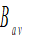——平均气隙磁通密度

——弦长

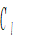——升力系数

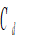——阻力系数

*CP*——风能利用系数

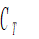**——**推力系数/转矩常数

*E*——样本期望

*FN*——叶片上的推力

*I*——电枢电流/指标函数

——额定电流

——定子电流*d*轴分量

——定子电流*q*轴分量

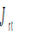——风轮转动惯量

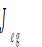——发电机转子转动惯量

*l*——导体有效长度

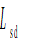——定子*d*轴电感

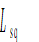——定子*q*轴电感

*P——*功率

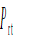**——**风轮轴功率

*Pa*——气压

*Pw*——水气压

——电机极对数

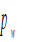——湿空气全压力

——空气中水蒸气分压力

*R——*风轮半径

*T——*转矩/采样周期

*T*C*——*温度

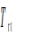——风轮机械转矩

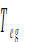——发电机电磁转矩

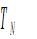——电机额定转矩

*v*——风速

*v*0——叶素上轴向风速

*v*1——风轮前方风速

*v*2——风速计风速

*v*(*t*)——瞬时风速

**——**平均风速

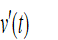**——**脉动风速

$`W`$——总发电量

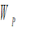——风功率

*Za*——电枢绕组的总导体数

——桨距角/一致性参数

$`\theta`$——偏航误差角

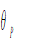——综合影响因子相位

——最大似然估计参数

*μ*——均值

*σ*——标准差

——劣化指标

——偏航角

**——**偏斜角

——效率

——极距/风轮惯性时间常数

*Ф*——气隙磁通量

——来流角

——空气相对湿度

——风向角度绝对值

——风轮轴线空间绝对值

——转子永磁体磁链

——空气密度

——干空气密度

*——*叶尖速比

*——*转速/权重

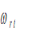——风轮转速

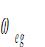——发电机转子转速

*χ*——偏斜角

——风向角度绝对值

——风轮轴线空间绝对值
