# 第2章 风电机组SCADA数据预处理

数据预处理是指在数据挖掘分析之前对数据进行的一些预备性处理。一般现实数据都存在不完整、不一致问题，而导致无法直接进行数据挖掘，或者数据挖掘分析结论不正确。数据预处理工作贯穿于数据挖掘分析全过程，因而必须基于数据理解、结合数据探究、数据挖掘目标要求来展开。数据预处理虽然只是数据挖掘分析的预备性工作，但是它不仅直接影响数据挖掘分析质量，而且占用60%~80%的数据挖掘分析时间。所以，为了提高数据挖掘的质量，根据数据产生实际场景和数据挖掘分析目的，提出各种数据预处理技术，数据预处理已然成为数据分析领域中一个热门的研究方向。由于风电机组能量转换过程多工况、多物理场耦合，风电机组服役环境复杂特别是风电场风速、风向随机性强，自然随机因素和所接电网、风电机组自身、传感器以及数据传输等设备随机因素，这些随机噪声在整个能量转换过程中叠加和传递，并且隐含在风电SCADA数据之中，出现一些与常理和经验相矛盾的异常数据，甚至因传感器失效、通信故障、网络丢包等因素而导致数据丢失。因此，数据预处理是风电SCADA数据分析、建模过程中非常重要的环节。

SCADA数据预处理归纳起来主要有数理统计和机器学习两个方向，本章介绍基于数理统计的数据预处理方法与应用。基于数据样本分布特点，通过采用数理统计的方法来对异常数据进行预处理，首先介绍数据准备和四分位法、3*σ*法则、核密度法等判断方法检测异常数据并予以剔除\[1-3\]；然后论述数据分箱法，提出基于分箱原理的噪声数据平滑单值处理方法；最后开展常见的数据滤波、数据单值处理方法分析评价，提出多阶段数据预处理组合方法\[4-12\]。

## 2.1 数据准备

风电场SCADA数据存放在多个数据文件中，一般每一台风电机组存放一个数据文件中，甚至每一台风电机组的主要运行参数数据存放在一个文件中，而其运行中事件记录又存放在另一个文件中，所以，即使是研究单台风电机组，也需要将两个文件进行集成；如果要将风电机组的SCADA数据与PLC、CMS、视频等系统的数据集成，甚至还需要将地理、气象信息系统的数据集成，将涉及结构化、半结构化、非结构化数据多源信息融合集成，如图2.1所示。因为SCADA数据是时序数据，文件集成的关键就是保持时间的一致性。

将数据集成导入后，首先就要观察数据。一方面，抽取一部分数据查看，对数据本身有一个直观的了解；另一方面，应用可视化工具，观察数据及其数据之间的关系，从中发现数据缺失、异常、噪声等问题，为后续数据充填、剔除异常和平滑噪声等预处理做准备。

> 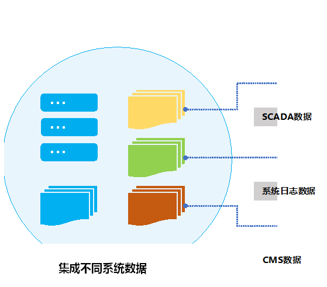

图2.1 多源SCADA数据文件集成

数据填充是为了尽可能保留已有数据所包含的信息、满足后续数据挖掘分析数据完整性要求而开展的预处理，主要面对如下两种情形：一是样本中某个或者多个参数（属性）数据缺失，时序数据中某个时刻或者某些时刻样本缺失，需要填充；二是样本中某个或者多个参数（属性）数据因为异常而删除，时序数据中某个时刻或者某些时刻样本因为异常而删除，需要填充。虽然删除含有缺失值的样本是一种简单的数据处理方法，但这样也损失了样本中其他参数数据所包含的信息，而且因为删除了某个时刻样本而影响整个时序数据的完整性，所以，当数据缺失涉及样本非常少、对时序数据完整性和数据样本规模影响可以忽略时，可以考虑去除存在数据缺失的样本。当数据缺失涉及样本较多时，需要考虑采用填充方法以保持这类时序数据的连续性和数据样本规模。

数据填充有人工和自动填充两种方法。人工填充就是人工补充样本的缺失值，因此非常费时，不适于大规模数据集预处理，风电SCADA数据通常采用计算机编程自动处理方式。填充数据主要有如下几种方法：一是通过观察时序数据取值范围确定一个全局常量填充缺失值，二是应用参数数据在缺失数据时间段的统计均值、中位数、众数等统计值填充缺失值，三是应用回归、插值、决策树等数学建模方法确定最优或者最可能的值来填充缺失数据。针对不同的数据类型，可采用不同的数据填充方法，如对于总发电量、偏航次数这类前后关联性较强的数据，可采用观察进行填充；对于风速、风向这类随机性数据可采用统计法进行填充；对于功率、转速、转矩这类具有确定物理关系的数据可采用数学建模的方法进行填充。显然，从方法的操作性来说，观察法填充最简单，数学建模法填充最复杂。由于SCADA数据海量，原始数据可能出现各种数据缺失、噪声、异常等问题，然而也正是由于数据量庞大，个别样本删除、数据异常等不一定对数据挖掘分析结果产生影响。

## 2.2 异常数据剔除

### 2.2.1 异常数据

异常是一个复杂概念，至今为止还没有一个统一定义。美国学者Hawkins\[13\]于1980年提出的异常数据定义已被广泛接受：异常数据与数据集中其他数据偏差明显，令人怀疑它是由不同的机制产生的。异常数据是指数据集中与大部分数据不一致或者偏离正常行为模式的数据：一是数据来源中的异常，这类异常中可能隐藏着重要的知识和规律；二是数据固有变化异常；三是数据测量误差，应该被消除。可以说，对异常数据识别有时会比正常数据更有价值。

异常数据识别与剔除是数据预处理中一项重要任务。在风电机组SCADA数据中，所谓异常包括两种情况：一是不是研究对象产生、与研究目的不相关的数据和数据样本，例如，研究风电机组运行状态，那么停机不发电阶段的数据就是异常数据应当加以剔除；研究风电机组故障状态时数据建模，就要剔除风电机组正常状态的数据或者数据样本，反之研究风电机组正常状态数据建模，也就要剔除故障异常状态的数据或者数据样本。二是与常规物理机制相悖，通过简单逻辑推理就可以直接发现问题的数据，例如，温度值数据1000°C，如果是温度太高早就停机了，而且风电机组在没有出现火灾情况下是不会出现1000°C高温数据的；当转速超过额定值，风电机组输出功率却几乎为0kW，这些数据都是有悖常理的而应该剔除。前面一种实质上也就是不需要，后面一种实际上就是不可能、离群和不寻常的，因此都要剔除。然而，无论是不需要还是不可能，都包含了研究者的主观判断，存在出现误判的可能性，这将导致需要的、可能的数据被剔除，而不需要、不可能的数据被留下来的情况。所以，异常数据剔除需要非常谨慎，每次剔除前都进行数据备份。图2.2为某风电机组一整年的风速与功率原始数据散点图。

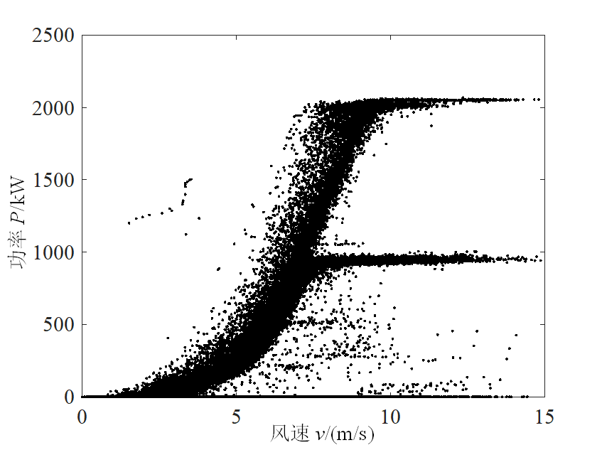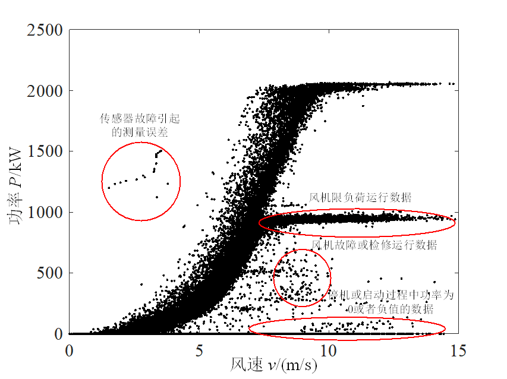

图2.2 风速-功率散点图 图2.3 标明异常数据的风速-功率散点图

从图2.2风速功率散点图中可以看到原始数据存在许多异常值。这些异常数据通常由以下几种情况引起：①风电机组故障或检修运行数据，在这些情况下，虽然风速可以正确记录，但是机组故障导致产生的功率值和转速值极小，甚至为零；②传感器本身发生故障，无法测量正确的数据或远程监控记录错误；③风电机组停机或启动过程中的功率为零或为负数。这些情况通常记录在风电机组的事件日志文件中。这样，结合风电机组的事件日志，可将图2.2中异常数据筛选出来，如图2.3所示。

图2.4是某风电机组在某年度3月上旬中一天的风速-功率时序图。图中，在1~450min时，风速的平均值位于4.5m/s之上，对应风电机组的输出功率*P*=0kW；根据制造商所提供的该型号机组的设计功率曲线，在4.5m/s的风速条件下，风电机组的输出功率约为153kW，说明这段时间风电机组处于停机状态（未出力）。在1240~1440min时，这段时间风速的平均值约为9.6m/s，根据该型号机组设计功率曲线，风速在9.5m/s时的功率值约为1435kW，而风电机组的实际功率被限制在925kW左右，此时风电机组处于降功率（或降出力）运行状态，这都是风电机组运行时发生的弃风现象，这些弃风现象将会导致机组运行时产生异常数据。

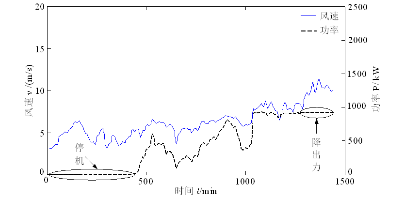

图2.4 风速-功率时序图

### 2.2.2 四分位法

四分位法（Quartile）是统计学中的一种分析方法\[8\]（图2.5）。简单地说，就是将全部数据从小到大排列，正好排列在前 1/4 位置上的数（也就是25%位置上的数）称为第一四分位数，排在后 1/4 位置上的数（也就是75%位置上的数）称为第三四分位数，第三四分位数与第一四分位数的差距又称四分位距；排列在中间位置的数（也就是50%位置上的数）称为第二四分位数，也就是中位数值，寻找数据样本集中位数也可以作为后面将要介绍单值处理中一种简便方法。四分位法就是找出第一、第二、第三四分位数，也即处于三个分割点位置的数值，然后将远离第一、第三分割点的样本视为异常数据样本予以剔除。

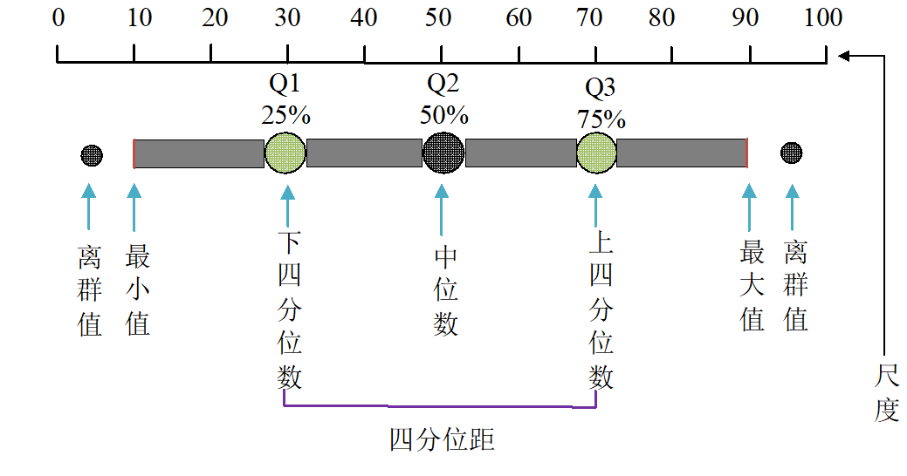

图2.5 四分位数

一般地，将全部样本集中的*N*个样本按照样本数据从小到大排列，形成如下集合：

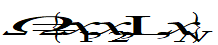 (2.1)

可分别求解出3个四分位数\[8\]：

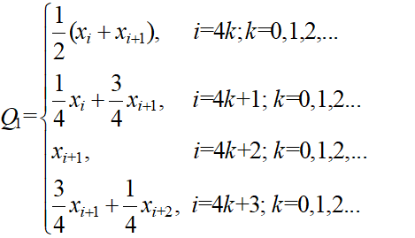 (2.2)

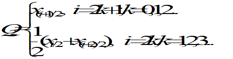 (2.3)

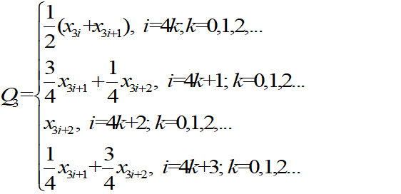 (2.4)

式中，*Q*1、*Q*2、*Q*3分别为第一、第二、第三四分位数。

由此求得四分位距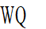为

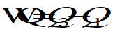 (2.5)

对于样本集中的第*j*个数据样本，其数据值*xj*满足下式：

 (2.6)

则认为该样本为异常数据样本予以剔除，从而获得正常数据样本集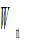为

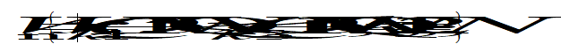 (2.7)

### 2.2.3 拉依达准则

拉依达准则（PauTa Criteron）是基于正态分布理论和概率统计原理逐步发展形成的一种经验规则，其核心思想是：在正态分布中，数据落在均值±3倍标准差（μ±3σ）范围内的概率约为99.73%，超出此范围的数据点被视为异常值。

根据正态分布规律，如果样本数据服从正态分布，即

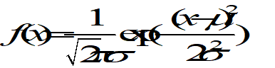 (2.8)

那么，大于*μ*-*σ*小于*μ*+*σ*区间的数据样本数超过68%；大于*μ*-2*σ*小于*μ*+2*σ*区间的数据样本数超过95%；大于*μ*-3*σ*小于*μ*+3*σ*区间的数据样本数超过99%，如图2.6所示。拉依达准则，也称为3*σ*准则，就是指大于*μ*+3*σ*或小于*μ*-3*σ*区间的数据不属于随机误差而是粗大误差，其对应数据样本应作为离群样本予以剔除。

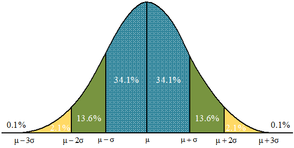

图2.6 拉依达准则

根据统计学中定义，样本集数据的均值和标准差为：

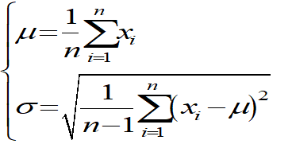 (2.9)

如果样本集中的第个数据样本，其数据值满足下式：

 (2.10)

或者

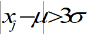 (2.11)

则将该数据样本作为异常样本剔除，从而获得正常数据样本集为

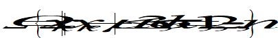 (2.12)

此类判别处理的原理与方法，主要适用于正态分布或近似正态分布的样本数据处理，其有效性的前提是测量次数足够多。当测量次数较少时，运用该方法剔除粗大误差的可靠性会大幅降低，此时应审慎采用拉依达准则。

上述方法是以样本集统计均值为基础的，也有提出根据最小二乘法进行异常数据样本剔除的。具体方法是在以上统计计算基础上，由如下求得估计值*x*，使下式成立：

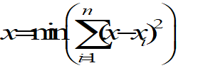 (2.13)

那么，如果样本集中的第*j*个数据样本，其数据值满足下式：

 (2.14)

或者

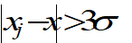 (2.15)

则将该数据样本作为异常样本剔除，从而获得正常数据样本集为

 (2.16)

### 2.2.4 核密度法

在概率统计学中，由样本估计总体概率分布密度的常用方法有参数法和非参数法，参数法认为密度函数的形式是已知的，由样本确定其具体参数。但密度函数并无先验知识，采用非参数密度估计法更好，核密度估计是常用方法之一。核密度估计（kernel density estimation，KDE）方法首先是基于核函数求得总体密度函数，然后将数据密度函数值较低的样本视为异常数据样本予以剔除。核密度估计一般定义为\[9\]

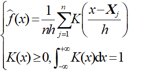 (2.17)

式中，*Xj *(*j*=1, 2,, *n*)为一元连续总体的样本，*n*为样本集大小；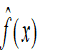为在任意点*x*处的总体密度函数*f*(*x*)的核密度估计；*K*( )称为核函数；*h*为窗宽。

常用的核函数有Uniform、Triangle、Gaussian等类型，如选择Gaussian核函数：

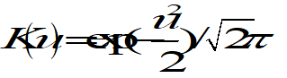 (2.18)

采用高斯Gaussian核函数，即将式（2.18）代入式（2.17），可得

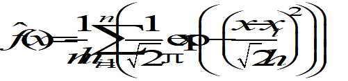 (2.19)

在式(2.19)中，窗宽*h*是一个对估算结果有很大影响的自由变量。无论窗宽过大还是过小，都可能带来估计密度与真实密度之间的巨大偏差。通常采用均值积分平方差(mean integrated squared error, MISE)作为窗宽的选择标准，即窗宽*h*由下式求得：

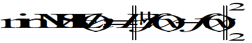 (2.20)

因为真实密度估计表达式未知，所以式(2.20)无法直接求解出窗宽。为了解决这个问题，可以采用常模参照法(normal reference, NR)、插入法(plug-in, PI)、解方程法(solve-the-equation, SEQ)、交叉验证法(cross-validated, CV)以及引导法(bootstrap, BT)等窗宽挑选方法。这里，采用一个广泛应用的窗宽计算公式，即

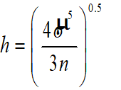 (2.21)

获得密度函数后，对于某个样本的数据密度函数值较低时，即出现概率较小时，就被视为异常数据样本予以剔除。这样，原始数据样本集剔除异常样本后得到一个新的集合，即正常数据样本集，就可以表示为

 (2.22)

式中，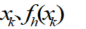分别为第个样本的功率值及其密度函数值；*ε*为判断系数；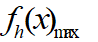为密度函数最大值。

例如，当*ε*为0.1时，就是把密度函数值小于密度函数最大值十分之一的样本视为异常数据样本予以剔除，如图2.7所示。

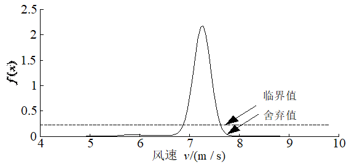

图2.7 核密度估计法

以上各类异常数据样本识别与剔除方法，事实上都是将离开大多数群体的另类剔除出来。这在很多情况下，就涉及样本分布问题，样本分布集中的地方就是中心区域，离开中心区域较远的样本就是异常样本。如果是正态分布，四分位法中位数就是*μ*，第一四分位数为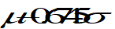，第三四分位数为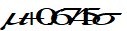，四分位距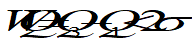，对比式(2.7)和式(2.12)就知，这时四分位法与拉依达法的结果是基本一致。显然，异常数据样本识别与剔除方法效果取决于数据样本实际的分布情况，就此而言，核密度法因为没有预设样本分布、而是根据分布实际求得密度函数，虽然其计算更为复杂，但是其效果可能会更加精准一些。

## 2.3 噪声数据平滑

### 2.3.1 数据分箱法

数据分箱法(binning)是指通过考察周围的值(邻居)来平滑存储[数据](https://baike.so.com/doc/5387430-5623960.html)的值，用“箱的深度”表示不同的箱里有相同个数的数据，用“箱的宽度”来表示每个箱值的取值区间。分箱法分为等深分箱(样本量一致)、等宽分箱(取值区间一致)两种类型。分箱法首先对数据样本依据一定规则进行排序，然后将排序后的样本按照等深或者等宽原则设置分箱，最后用箱内数据的均值、中值、边值等代替原来数据值进行存储或者分析。分箱法用于平滑或者去噪，由于分箱方法只考虑了相邻数据的值，因此是一种局部平滑方法。分箱法通过平滑去噪既为后续数据挖掘分析增加粒度、增强了稳定性并避免过拟合，又为数据理解、观察提供了更加清晰的数据变化和数据关系图景，已成为SCADA数据挖掘分析普遍采用的预处理方法之一。

在风电SCADA数据挖掘分析中，因为是时序数据，而且数据通常都是表征风电机组运行状态连续变化的物理量或者性能参数，通常采用等宽分箱、依时间排序或者参数值大小排序。风电SCADA系统采样频率目前高达1Hz，即每一秒就采集、记录了一条数据样本，但是现场为了减小数据文件规模，实际文件中的数据样本相隔时间可能为10min，这时其中的参数数据就是依时间排序等宽分箱数据的均值或者中值。在研究风电机组运行状态参数的关联性时，大多数采用依数据参数值大小排序等宽分箱方法，例如按照风电机组风速参数取值范围分箱，分别统计风速、功率、风轮转速等箱内数据均值、中值等代替原来数据值进行存储或者后续分析。实质上，分箱方法就是为了获得更加简单、清晰的参数关系，而忽略了参数在小区间变化的影响。分箱方法常应用于大数据问题，因为即使在小区间内仍然有足够的数据样本数以保证统计分析可信度，区间划分越小越精确。

在风电SCADA数据分箱处理时，可能会有多种分箱处理策略与模式用于选择。首先，选择进行数据分箱所依据的特征参数。对于风速-功率关系，可以根据风速或功率进行数据分箱；对于风速-转速关系，可以根据风速或转速进行数据分箱。图2.8以风电功率曲线为例，给出了两种不同数据分箱模式。图2.8(a)为基于风速的数据分箱；图2.8(b)显示了基于功率的数据分箱。其次，选择进行数据分箱的箱子之间联系或者滑动方式，即滑模的选择，可以选择离散滑动分箱或等宽(肩对肩)滑动分箱。以处理风速-功率曲线和风速-转速曲线为例，数据分箱可以有两种不同的滑动分箱模式，如图2.9所示。图2.9(a)和(b)分别为相对于风速-功率关系、风速-转速关系的离散滑动数据分箱，图2.9(c)和(d)分别为相对于风速-功率关系、风速-转速关系的等宽(肩对肩)滑动数据分箱。

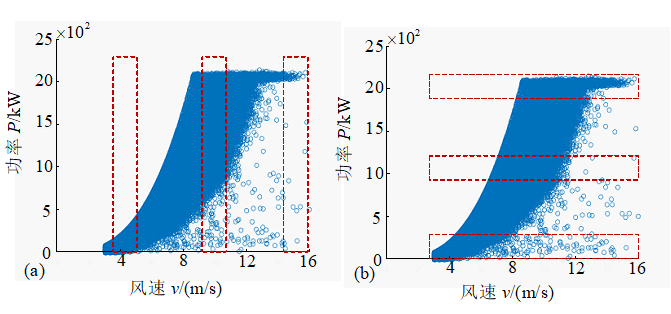

\(a\) 以风速为依据分箱 (b) 以功率为依据分箱

图2.8 不同分箱策略

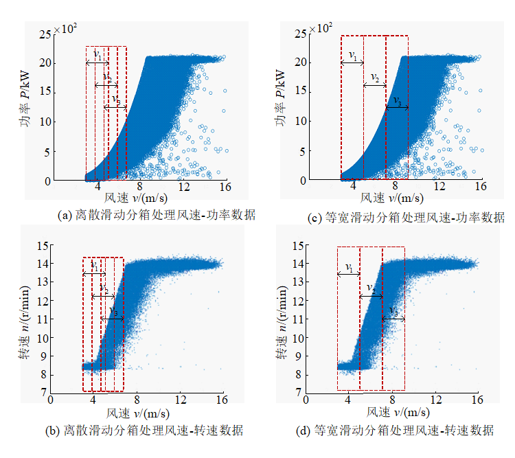

图2.9 不同滑动窗口模式

在SCADA数据挖掘分析特征参数之间关系时，作为分箱依据的特征参数非常重要。因为不同的数据分箱方法，每一个分箱的数据样本不同，无论采用何种模型、所获得的分箱特征参数值就可能不同。分箱特征参数相当于挖掘分析问题的视角，不同的分箱特征参数可能导致挖掘分析结果各异。在一定的特征参数分箱背景下，既可以分析分箱特征参数与其他特征参数之间关系，也可以分析研究其他特征参数之间的关系，但这时分析结果与分箱的特征参数选择相关联，不同的分箱特征参数背景下，挖掘分析结果不同。一般来说，在SCADA数据挖掘分析中，选择重要因素或者参数、自变量作为分箱特征参数，如风速，以便分析研究风速对风电机组运行参数的影响。

风电机组SCADA数据样本数庞大，其中包含了大量的噪声数据，从原始数据散点图往往难以观察出特征参数之间的关系。图2.10是从SCADA数据获得的变桨电机力矩与风速关系散点图，由图可见，变桨电机力矩变化非常复杂，同一个风速值对应多个变桨电机力矩。在SCADA数据分析中，可以采用分箱方法进行噪声数据平滑和单值处理，以更加清晰地观察并获得参数之间的关系。

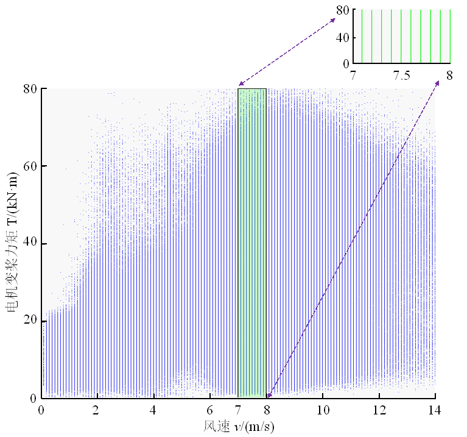

图2.10 风速对变桨电机转矩的影响

以风速与变桨电机转矩关系为例，风速为自变量，电机转矩为因变量。从SCADA数据中获得风速分布范围或者值域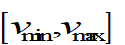。采用数据分箱方法，将风速值域分为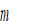个小箱，分箱宽度为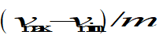；第个小箱样本数为，对处于此箱中的样本进行统计，获得该区间风速、电机转矩平均值，并以此作为新样本，即

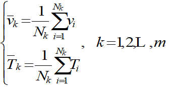 (2.23)

为了获得更加稳定的结果，还可以根据拉依达准则剔除其中的异常样本后，再采用式(2.23)重新计算新样本参数的平均值。实质上，分箱方法就是一种消除噪声、平均滤波平滑处理方法，而忽略了参数在小区间变化的影响。如果用于挖掘分析的SCADA数据样本足够大，个别异常样本对统计均值影响甚小，有时不进行异常样本剔除。而且，由于数据样本非常庞大，假定每一个小区间内的风速近似于均匀分布。这样，式(2.23)就变化为

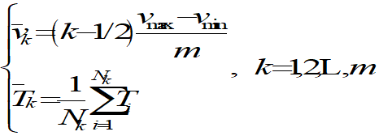 (2.24)

风电机组SCADA数据包含的特征参数较多，这需要将上面分析单参数影响的分箱方法扩展到多维空间，即应用多维分箱方法分析多参数复杂影响的问题（图2.11）。具体办法是：首先，将这些参数在其值域内按照一定的间隔划分为小箱，在每一个小箱内忽略参数影响；然后，对关注的参数在其区间展开小箱分箱方法统计分析，此时其他参数都相应在固定箱内，即意味着其他参数不变；最后，依次对所有参数在其区间展开小箱分箱方法统计分析，从而获得这些参数的影响规律。形象地说，这就是从一个庞大的多参数构成的多维数据样本空间中，挖掘出其中的一个小的多维空间，对存在于这个小的多维空间中数据样本，进行统计分析；还可以根据研究目的，依次对关注的参数展开分箱方法处理。

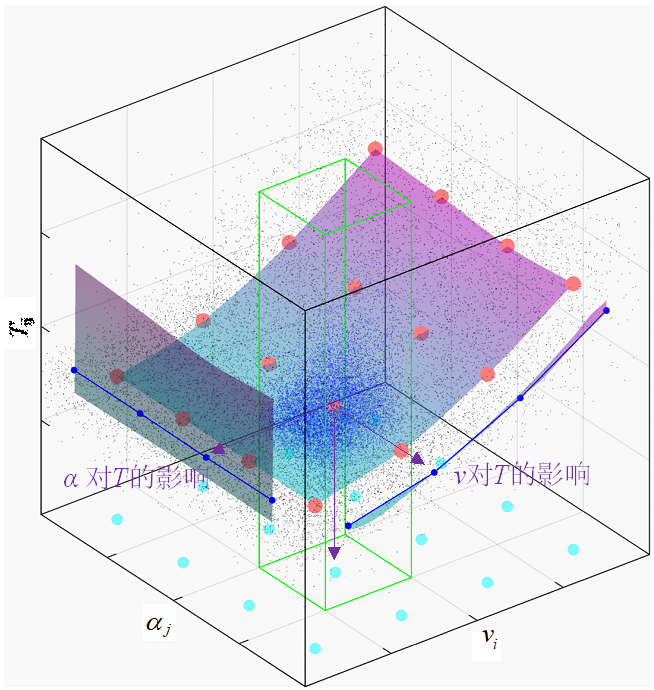

图2.11 多维分箱方法直观图

按上述方法，对风速、方位角参数进行分箱处理。按风速的第个分箱和方位角的第个分箱构成空间区域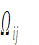，其中包含样本数为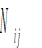，变桨电机转矩统计平均值为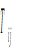，可表示为

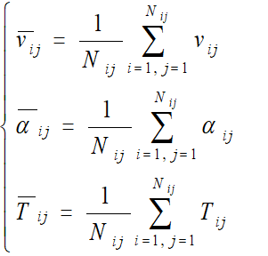 (2.25)

分箱数据样本不同，无论采用何种模型，所获得的分箱特征参数值就可能不同。考虑一个特征参数影响可以采用一维分箱方法，如果需要考虑多个特征参数影响就需要采用多维分箱方法。例如，以风速为分箱特征参数，分析风速对功率的影响，同时考虑转速对功率的影响（图2.12）。首先从SCADA系统中提取数据样本，获得的数据样本分别为转速8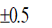r/min、10r/min、12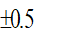r/min、14r/min（图2.12a）；然后分别对这些数据样本依据风速进行分箱处理，获得不同转速下功率与风速的关系（图2.12b）。图中结果容易造成转速随风速增加而增加，功率似乎与风速没有关系的假象，而风电机组运行理论和实际表明在最大风能利用区域功率与风速三次方成正比，在恒功率区域通过调节桨距角保持功率恒定。由于多种随机因素影响，风速、转速、功率并非一一对应，而是有一个随机变化范围，这是由于风速的随机性掩盖了风速与功率之间的本质关系。在这种情况下，不宜采用一维分箱方法来进行数据处理和可视化展示，有必要采用二维分箱方法和三维空间坐标系来展示。相较于一维分箱方法处理结果（图2.12），采用二维分箱方法处理的结果（图2.13）可揭示风速、转速、功率之间更深层次的关系。

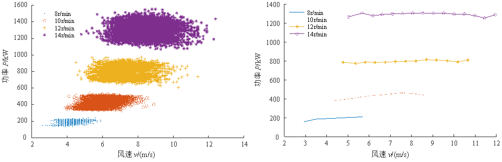

\(a\) 不同转速下风速与功率散点关系 (b) 不同转速下风速与功率单值关系

图2.12 分箱方法对SCADA原始数据处理结果

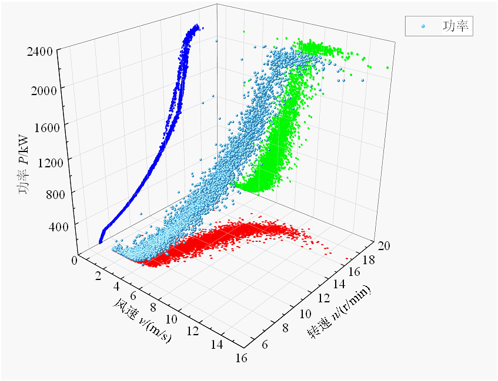

图2.13 二维分箱方法对SCADA原始数据处理结果

### 2.3.2 数据单值处理

1\. 数值单值处理方法

一般地，设SCADA数据特征参数为*x*，值域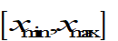。采用分箱方法，将其值域分为*m*个小箱，分箱宽度为；第*k*个小区间样本数为。这里归纳一些常见的单值处理方法，也就是，某一个小箱的特征参数值由以下方法求取。

平均法（average method，AVE）。算术平均法是应用最广泛的方法，其最大的优点是简单易计算，计算方法如下：

 (2.26)

最小二乘法（least square method，LSM）。最小二乘法是一种将特征参数值求解变换为一个优化问题的方法，它根据给定数据集的偏差平方和的最小值得到特征参数值，计算方法如下：

 (2.27)

或者表示为

 (2.28)

最大似然估计(maximum likelihood estimation，MLE)。最大似然估计法是分布类型已知时使用的一种参数估计方法。Likelihood（似然）和Probability（概率）都可以表示事件发生的概率，但它们是非常不同的。概率是参数已知时观测结果出现的概率，似然是根据观测结果计算某一参数为某一值的可能性，计算方法如下：

 (2.29)

式中，为参数似然函数；为参数最大似然估计；为特征参数的密度函数值。

核密度估计（kernel density estimation，KDE）。核密度估计单值处理方法首先是基于核函数求得总体密度函数式（2.17），然后将密度函数值最大的数据值作为该分箱的特征参数值，即

 (2.30)

应用数据分箱方法，可以采用不同的单值法来计算分箱的特征参数（估计）值。不同的单值法获得的计算结果会有一定差异。从原理来看，平均法计算简单，但没有考虑样本分布，而考虑样本分布的单值法，往往计算相对复杂，诸如核密度估计等非参数密度估计法，由于分布密度函数未知，计算就更为复杂一些。评价这些计算方法，既要从数据产生的物理原理出发，也要从数据分析的计算原理角度来评价，下面介绍两种从数据采样角度出发的评价方法：一是采样时间变化稳健性；二是采样频率变化稳健性。

2\. 数据单值处理评价

> 1）基于采样时间变化稳健性评价

大自然的风是随机变化的，在不同采样时段风速、功率、转速等特征参数变化情况不同，单值处理应对采样时间的变化具有较好的稳健性。具体过程是：①选取两个不同时段风况相近的某2MW风电机组SCADA数据中风速、功率、转速数据进行分析，按风速进行数据样本分箱，得到待单值处理数据（图2.14）。②将这些数据分别用平均数法、最小二乘法进行数据单值处理，处理后的转速、功率值如表2.1和表2.2所示。③比较各个分箱数据单值处理结果两个不同时段的偏差平方和。

 

\(a\) 前段时间的待预处理数据 (b) 后段时间的待预处理数据

图2.14 不同采样时间段的待预处理数据

表2.1 不同采样时间段数据预处理后的转速、功率值（前段时间）

<table>
<colgroup>
<col style="width: 7%" />
<col style="width: 15%" />
<col style="width: 17%" />
<col style="width: 20%" />
<col style="width: 17%" />
<col style="width: 20%" />
</colgroup>
<thead>
<tr>
<th rowspan="2" style="text-align: center;">序号</th>
<th rowspan="2" style="text-align: center;">风速/</th>
<th colspan="2" style="text-align: center;">轮毂转速/(r/min)</th>
<th colspan="2" style="text-align: center;">发电机输出功率/kW</th>
</tr>
<tr>
<th style="text-align: center;">平均数法</th>
<th style="text-align: center;">最小二乘法</th>
<th style="text-align: center;">平均数法</th>
<th style="text-align: center;">最小二乘法</th>
</tr>
</thead>
<tbody>
<tr>
<td style="text-align: center;">1</td>
<td style="text-align: center;">4.2</td>
<td style="text-align: center;">8.61</td>
<td style="text-align: center;">8.61</td>
<td style="text-align: center;">208.84</td>
<td style="text-align: center;">209</td>
</tr>
<tr>
<td style="text-align: center;">2</td>
<td style="text-align: center;">4.5</td>
<td style="text-align: center;">8.83</td>
<td style="text-align: center;">8.84</td>
<td style="text-align: center;">225.45</td>
<td style="text-align: center;">225</td>
</tr>
<tr>
<td style="text-align: center;">3</td>
<td style="text-align: center;">4.8</td>
<td style="text-align: center;">9.19</td>
<td style="text-align: center;">9.19</td>
<td style="text-align: center;">255.88</td>
<td style="text-align: center;">256</td>
</tr>
<tr>
<td style="text-align: center;">4</td>
<td style="text-align: center;">5.1</td>
<td style="text-align: center;">9.62</td>
<td style="text-align: center;">9.63</td>
<td style="text-align: center;">294.17</td>
<td style="text-align: center;">294</td>
</tr>
<tr>
<td style="text-align: center;">5</td>
<td style="text-align: center;">5.4</td>
<td style="text-align: center;">10.00</td>
<td style="text-align: center;">10.01</td>
<td style="text-align: center;">329.98</td>
<td style="text-align: center;">330</td>
</tr>
<tr>
<td style="text-align: center;">6</td>
<td style="text-align: center;">5.7</td>
<td style="text-align: center;">10.23</td>
<td style="text-align: center;">10.23</td>
<td style="text-align: center;">352.63</td>
<td style="text-align: center;">353</td>
</tr>
<tr>
<td style="text-align: center;">7</td>
<td style="text-align: center;">6.0</td>
<td style="text-align: center;">10.62</td>
<td style="text-align: center;">10.60</td>
<td style="text-align: center;">392.64</td>
<td style="text-align: center;">393</td>
</tr>
<tr>
<td style="text-align: center;">8</td>
<td style="text-align: center;">6.3</td>
<td style="text-align: center;">10.88</td>
<td style="text-align: center;">10.88</td>
<td style="text-align: center;">421.50</td>
<td style="text-align: center;">422</td>
</tr>
<tr>
<td style="text-align: center;">9</td>
<td style="text-align: center;">6.6</td>
<td style="text-align: center;">11.23</td>
<td style="text-align: center;">11.25</td>
<td style="text-align: center;">462.52</td>
<td style="text-align: center;">466</td>
</tr>
<tr>
<td style="text-align: center;">10</td>
<td style="text-align: center;">6.9</td>
<td style="text-align: center;">11.35</td>
<td style="text-align: center;">11.20</td>
<td style="text-align: center;">173.96</td>
<td style="text-align: center;">457</td>
</tr>
</tbody>
</table>

表2.2 不同采样时间段数据预处理后的转速、功率值（后段时间）

<table style="width:100%;">
<colgroup>
<col style="width: 8%" />
<col style="width: 13%" />
<col style="width: 17%" />
<col style="width: 21%" />
<col style="width: 18%" />
<col style="width: 21%" />
</colgroup>
<thead>
<tr>
<th rowspan="2" style="text-align: center;">序号</th>
<th rowspan="2" style="text-align: center;">风速/(m/s)</th>
<th colspan="2" style="text-align: center;">轮毂转速/(r/min)</th>
<th colspan="2" style="text-align: center;">发电机输出功率/kW</th>
</tr>
<tr>
<th style="text-align: center;">平均数法</th>
<th style="text-align: center;">最小二乘法</th>
<th style="text-align: center;">平均数法</th>
<th style="text-align: center;">最小二乘法</th>
</tr>
</thead>
<tbody>
<tr>
<td style="text-align: center;">1</td>
<td style="text-align: center;">4.2</td>
<td style="text-align: center;">8.78</td>
<td style="text-align: center;">8.76</td>
<td style="text-align: center;">221.88</td>
<td style="text-align: center;">220</td>
</tr>
<tr>
<td style="text-align: center;">2</td>
<td style="text-align: center;">4.5</td>
<td style="text-align: center;">9.38</td>
<td style="text-align: center;">9.38</td>
<td style="text-align: center;">270.52</td>
<td style="text-align: center;">271</td>
</tr>
<tr>
<td style="text-align: center;">3</td>
<td style="text-align: center;">4.8</td>
<td style="text-align: center;">9.81</td>
<td style="text-align: center;">9.81</td>
<td style="text-align: center;">308.73</td>
<td style="text-align: center;">309</td>
</tr>
<tr>
<td style="text-align: center;">4</td>
<td style="text-align: center;">5.1</td>
<td style="text-align: center;">10.25</td>
<td style="text-align: center;">10.24</td>
<td style="text-align: center;">352.13</td>
<td style="text-align: center;">352</td>
</tr>
<tr>
<td style="text-align: center;">5</td>
<td style="text-align: center;">5.4</td>
<td style="text-align: center;">10.72</td>
<td style="text-align: center;">10.71</td>
<td style="text-align: center;">403.72</td>
<td style="text-align: center;">404</td>
</tr>
<tr>
<td style="text-align: center;">6</td>
<td style="text-align: center;">5.7</td>
<td style="text-align: center;">11.26</td>
<td style="text-align: center;">11.25</td>
<td style="text-align: center;">483.60</td>
<td style="text-align: center;">469</td>
</tr>
<tr>
<td style="text-align: center;">7</td>
<td style="text-align: center;">6.0</td>
<td style="text-align: center;">11.70</td>
<td style="text-align: center;">11.70</td>
<td style="text-align: center;">523.52</td>
<td style="text-align: center;">524</td>
</tr>
<tr>
<td style="text-align: center;">8</td>
<td style="text-align: center;">6.3</td>
<td style="text-align: center;">11.96</td>
<td style="text-align: center;">11.95</td>
<td style="text-align: center;">557.63</td>
<td style="text-align: center;">558</td>
</tr>
<tr>
<td style="text-align: center;">9</td>
<td style="text-align: center;">6.6</td>
<td style="text-align: center;">12.28</td>
<td style="text-align: center;">12.28</td>
<td style="text-align: center;">601.78</td>
<td style="text-align: center;">602</td>
</tr>
<tr>
<td style="text-align: center;">10</td>
<td style="text-align: center;">6.9</td>
<td style="text-align: center;">12.36</td>
<td style="text-align: center;">12.33</td>
<td style="text-align: center;">612.15</td>
<td style="text-align: center;">610</td>
</tr>
</tbody>
</table>

为了获得采样时间变化稳健性的定量指标，设计评价计算公式如下：

 (2.31)

式中，分别为功率、转速用两种数据单值处理的前后取样时间段偏差平方和； 分别为前、后取样时间段用两种数据单值处理的功率值；分别为前、后取样时间段用两种数据单值处理的转速值。

由式(2.31)可以计算得到：，；，。毫无疑问，就采样时间变化稳健性而言，无论是从功率还是转速来看，平均数法和最小二乘法都较为接近。

> 2）基于采样频率变化稳健性评价

风电机组SCADA数据的采样频率为1Hz，不同采样频率的SCADA特征参数数据单值处理结果可能不同，数据单值处理应该对采样频率的变化具有良好的稳健性。这里将现有SCADA数据按照时间顺序，间隔5s(0.2Hz)选取数据，以模拟不同的采样频率。具体处理过程与前面类似，采样频率为1Hz和0.2Hz两组数据分别运用上述两种方法进行数据单值处理，处理后的转速、功率结果如表2.3和表2.4所示。

表2.3 不同采样频率条件下风电机组转速、功率值（1Hz采样频率）

<table>
<colgroup>
<col style="width: 8%" />
<col style="width: 13%" />
<col style="width: 18%" />
<col style="width: 21%" />
<col style="width: 13%" />
<col style="width: 24%" />
</colgroup>
<thead>
<tr>
<th rowspan="2" style="text-align: center;">序号</th>
<th rowspan="2" style="text-align: center;">风速/(m/s)</th>
<th colspan="2" style="text-align: center;">轮毂转速/(r/min)</th>
<th colspan="2" style="text-align: center;">发电机输出功率/kW</th>
</tr>
<tr>
<th style="text-align: center;">平均数法</th>
<th style="text-align: center;">最小二乘法</th>
<th style="text-align: center;">平均数法</th>
<th style="text-align: center;">最小二乘法</th>
</tr>
</thead>
<tbody>
<tr>
<td style="text-align: center;">1</td>
<td style="text-align: center;">3.0</td>
<td style="text-align: center;">7.22</td>
<td style="text-align: center;">7.22</td>
<td style="text-align: center;">64.99</td>
<td style="text-align: center;">65</td>
</tr>
<tr>
<td style="text-align: center;">2</td>
<td style="text-align: center;">3.9</td>
<td style="text-align: center;">7.75</td>
<td style="text-align: center;">7.74</td>
<td style="text-align: center;">142.70</td>
<td style="text-align: center;">143</td>
</tr>
<tr>
<td style="text-align: center;">3</td>
<td style="text-align: center;">4.8</td>
<td style="text-align: center;">9.36</td>
<td style="text-align: center;">9.36</td>
<td style="text-align: center;">273.50</td>
<td style="text-align: center;">273</td>
</tr>
<tr>
<td style="text-align: center;">4</td>
<td style="text-align: center;">5.7</td>
<td style="text-align: center;">11.08</td>
<td style="text-align: center;">11.09</td>
<td style="text-align: center;">455.81</td>
<td style="text-align: center;">456</td>
</tr>
<tr>
<td style="text-align: center;">5</td>
<td style="text-align: center;">6.6</td>
<td style="text-align: center;">13.07</td>
<td style="text-align: center;">13.06</td>
<td style="text-align: center;">746.85</td>
<td style="text-align: center;">747</td>
</tr>
<tr>
<td style="text-align: center;">6</td>
<td style="text-align: center;">7.5</td>
<td style="text-align: center;">14.41</td>
<td style="text-align: center;">14.41</td>
<td style="text-align: center;">1015.17</td>
<td style="text-align: center;">1015</td>
</tr>
<tr>
<td style="text-align: center;">7</td>
<td style="text-align: center;">8.4</td>
<td style="text-align: center;">15.14</td>
<td style="text-align: center;">15.15</td>
<td style="text-align: center;">1286.68</td>
<td style="text-align: center;">1287</td>
</tr>
<tr>
<td style="text-align: center;">8</td>
<td style="text-align: center;">9.3</td>
<td style="text-align: center;">15.67</td>
<td style="text-align: center;">15.66</td>
<td style="text-align: center;">1565.60</td>
<td style="text-align: center;">1566</td>
</tr>
<tr>
<td style="text-align: center;">9</td>
<td style="text-align: center;">9.9</td>
<td style="text-align: center;">15.99</td>
<td style="text-align: center;">15.99</td>
<td style="text-align: center;">1720.35</td>
<td style="text-align: center;">1720</td>
</tr>
</tbody>
</table>

表2.4 不同采样频率条件下风电机组转速、功率值（0.2Hz采样频率）

<table>
<colgroup>
<col style="width: 8%" />
<col style="width: 13%" />
<col style="width: 17%" />
<col style="width: 21%" />
<col style="width: 17%" />
<col style="width: 21%" />
</colgroup>
<thead>
<tr>
<th rowspan="2" style="text-align: center;">序号</th>
<th rowspan="2" style="text-align: center;">风速/(m/s)</th>
<th colspan="2" style="text-align: center;">轮毂转速/(r/min)</th>
<th colspan="2" style="text-align: center;">发电机输出功率/kW</th>
</tr>
<tr>
<th style="text-align: center;">平均数法</th>
<th style="text-align: center;">最小二乘法</th>
<th style="text-align: center;">平均数法</th>
<th style="text-align: center;">最小二乘法</th>
</tr>
</thead>
<tbody>
<tr>
<td style="text-align: center;">1</td>
<td style="text-align: center;">3.0</td>
<td style="text-align: center;">7.23</td>
<td style="text-align: center;">7.23</td>
<td style="text-align: center;">66.08</td>
<td style="text-align: center;">66</td>
</tr>
<tr>
<td style="text-align: center;">2</td>
<td style="text-align: center;">3.9</td>
<td style="text-align: center;">7.75</td>
<td style="text-align: center;">7.76</td>
<td style="text-align: center;">143.25</td>
<td style="text-align: center;">143</td>
</tr>
<tr>
<td style="text-align: center;">3</td>
<td style="text-align: center;">4.8</td>
<td style="text-align: center;">9.38</td>
<td style="text-align: center;">9.38</td>
<td style="text-align: center;">274.76</td>
<td style="text-align: center;">274</td>
</tr>
<tr>
<td style="text-align: center;">4</td>
<td style="text-align: center;">5.7</td>
<td style="text-align: center;">11.05</td>
<td style="text-align: center;">11.06</td>
<td style="text-align: center;">451.21</td>
<td style="text-align: center;">451</td>
</tr>
<tr>
<td style="text-align: center;">5</td>
<td style="text-align: center;">6.6</td>
<td style="text-align: center;">12.89</td>
<td style="text-align: center;">12.89</td>
<td style="text-align: center;">718.23</td>
<td style="text-align: center;">718</td>
</tr>
<tr>
<td style="text-align: center;">6</td>
<td style="text-align: center;">7.5</td>
<td style="text-align: center;">14.44</td>
<td style="text-align: center;">14.44</td>
<td style="text-align: center;">1011.73</td>
<td style="text-align: center;">1011</td>
</tr>
<tr>
<td style="text-align: center;">7</td>
<td style="text-align: center;">8.4</td>
<td style="text-align: center;">15.14</td>
<td style="text-align: center;">15.14</td>
<td style="text-align: center;">1274.89</td>
<td style="text-align: center;">1273</td>
</tr>
<tr>
<td style="text-align: center;">8</td>
<td style="text-align: center;">9.3</td>
<td style="text-align: center;">15.66</td>
<td style="text-align: center;">15.65</td>
<td style="text-align: center;">1554.13</td>
<td style="text-align: center;">1563</td>
</tr>
<tr>
<td style="text-align: center;">9</td>
<td style="text-align: center;">9.9</td>
<td style="text-align: center;">16.02</td>
<td style="text-align: center;">16.02</td>
<td style="text-align: center;">1721.49</td>
<td style="text-align: center;">1707</td>
</tr>
</tbody>
</table>

数据单值处理稳健性以不同采样频率同一风速分箱的特征参数值偏差平方和来度量，计算公式如下：

 (2.32)

式中，分别为功率、转速用两种数据单值处理的两种采样频率的偏差平方和； 分别为采样频率为1Hz和0.2Hz用两种数据单值处理的功率值；分别为采样频率为1Hz和0.2Hz用两种数据单值处理的转速值。

由式(2.32)可以计算得到：，；，。毫无疑问，就采样频率变化稳健性而言，无论是从功率还是从转速来看，平均数法和最小二乘法较为接近，前者略优于后者。

## 2.4 数据多阶段处理

### 2.4.1 数据三阶段处理

数据预处理根据数据质量和数据挖掘分析要求展开，可以分为多个阶段、采用不同的处理方法。为了建立风电机组功率曲线，将数据预处理分为三个阶段，即数据预处理与补偿、基于分箱的二次数据剔除和基于分箱的数据单值处理，如表2.5所示。数据预处理主要用于剔除一些明显的异常数据。例如，删除功率为零或负的数据集，删除转速为负的数据集，删除小于切入风速的数据集，删除大于切出风速的数据集。需要注意的是，机舱风速计的风速低于实际入流风速，因此在剔除低于切入风速的数据集之前，需要对其进行补偿。数据预处理的具体策略可以写成：

其中，。

表2.5 数据预处理方法

<table style="width:100%;">
<colgroup>
<col style="width: 13%" />
<col style="width: 16%" />
<col style="width: 13%" />
<col style="width: 21%" />
<col style="width: 16%" />
<col style="width: 17%" />
</colgroup>
<thead>
<tr>
<th colspan="2" style="text-align: center;">数据预处理与补偿</th>
<th colspan="2" style="text-align: center;">基于分箱的数据二次剔除</th>
<th colspan="2" style="text-align: center;">基于分箱的单值化处理</th>
</tr>
</thead>
<tbody>
<tr>
<td rowspan="2" style="text-align: center;">数据预处理</td>
<td rowspan="2" style="text-align: left;"></td>
<td style="text-align: center;">四分位法</td>
<td style="text-align: left;"></td>
<td style="text-align: center;">均值法</td>
<td style="text-align: left;"></td>
</tr>
<tr>
<td style="text-align: center;">拉依达准则</td>
<td style="text-align: left;"></td>
<td style="text-align: center;">最小二乘法</td>
<td style="text-align: left;"></td>
</tr>
<tr>
<td style="text-align: center;">风速数据补偿</td>
<td style="text-align: center;"></td>
<td style="text-align: center;">核密度法</td>
<td style="text-align: left;"></td>
<td style="text-align: center;">极大似然估计法</td>
<td style="text-align: left;"></td>
</tr>
</tbody>
</table>

所谓基于分箱的二次数据剔除，就是首先将数据样本集进行分箱，然后分别对每一个分箱中的子样本集进行数据剔除。就风速-功率关系而言，理论上可以有两种分箱模式：一是依据风速进行分箱，进而剔除相应的功率数据异常的样本；二是依据功率进行分箱，进而剔除相应的异常风速数据的样本。这里采用依据风速分箱处理，并且为了对比，采用表2.5中四分位数法、拉依达准则和核密度估计方法，进行异常数据样本识别，结果如图2.15所示。经过二次数据过滤，可以剔除更多的异常数据样本，如表2.6所示。

\(a\) 四分位法 (b) 拉依达准则 (c) 核密度法

图2.15 二次剔除异常样本

表2.6 数据预处理结果

| 原始数据散点关系 | 预处理和补偿后的数据关系 | 分箱二次剔除后的数据关系 |
|:--:|:--:|:--:|

|  |  |  |

|  |  |  |

依据风速将数据样本集进行分箱，分别标注*M*个分箱的风速值为

依据风速将数据样本集进行分箱，分别标注*M*个分箱的风速值为

 (2.33)

这时，第*k*个分箱样本子集的功率值设为

 (2.34)

其中设样本子集样本数为*Nk*。如此这般，风速与功率之间就形成了如下关系：

图2.16 数据分箱与单值处理

所谓基于分箱的单值处理，就是在前面分箱异常数据样本剔除基础上，平滑噪声数据，形成两个特征参数之间单值映射，如图2.16所示。所谓二次数据过滤，首先将数据样本集进行分箱，然后分别对每一个分箱中的子样本集进行数据过滤。这里应用平均法(average variance extracted, AVE)、最小二乘法(least square method，LSM)、最大似然估计(maximum likelihood estimation，MLE)等三种方法来进行单值计算。这样，将二次数据滤波与数据单值处理相结合，得到Quartile-AVE法、Quartile-LSM法、Quartile-MLE法、PauTa-AVE法、PauTa-LSM法、PauTa-MLE法、KDE-AVE法、KDE-LSM法和KDE-MLE法等九种组合方法，如图2.17所示。

图2.17 数据预处理方法组合

综上所述，就构成了SCADA数据预处理与评价全过程，如图2.18所示。

图2.18 数据预处理方法与评价过程

### 2.4.2 数据处理结果评价

1\. 能量特性一致性评价

风电机组是一种复杂的能量转换装置，它将空气动能转化为机械能，然后再转化为电能。随着风电机组直径的增大，其造价也越来越高，性能也有望更好、更稳定。在风力发电机组的设计和运行中，获取空气动能的行为特性是人们非常关注的问题。通常有三种曲线来描述这种能量特征，即风速-功率曲线、风速-转速曲线和转速-功率曲线，其中，风速与功率的关系为

 (2.35)

在描述风速-功率曲线的方程中，风速和功率系数为自变量。风速是自然界中气流速度的描述，具有时变和随机性特点；功率系数是反映风能捕获能力的关键参数，它与风电机组的气动结构相关联，也与风电机组的控制方式相关。从另一种角度来看，如果风电机组结构和控制方式确定，功率系数实际上就取决于风速。如果引入叶尖速比，则在最大风能利用区风速与风轮转速的关系为

 (2.36)

将(2.36)代入式(2.35)可得

 (2.37)

这样，由以上三式就可以分别对应获得风电机组的风速-功率曲线、风速-转速曲线、转速-功率曲线。从这些曲线中的任意两条，都可以得到第三条曲线。在图2.19中，三条性能曲线分别在*o*-*xyz*三维坐标系下投影到三个平面上：将风速-功率曲线投影到*xoz*平面，将风速-转速曲线投影到*xoy*平面，将转速-功率曲线投影到*yoz*平面。对于图2.19中三条性能曲线中任意两条曲线上的对应点，可以通过空间映射得到第三条曲线上的对应点。例如，如果确定了*yoz*平面点和*xoz*平面点，则可以提取并重构两点的水平坐标，形成 *xoy* 平面点。

图2.19 风电机组及其性能曲线

将风电机组的三条性能曲线之间的特殊关系称为能量特性一致性(energy characteristic consistency, ECC)，因为它们从不同的角度描述了风电机组相同的能量特性，并且可以相互转换\[10\]。换句话说，从任意两条曲线重构出第三条曲线的特性称为ECC。风电机组的能量特性一致性也可以用图2.20来表示。

图2.20 风电机组能量特性一致性ECC

需要指出的是，在上述风电机组风速与功率关系方程中，风速是指作用在风轮上转换成机械能的风速。然而，SCADA系统中风速数据是由机舱上的风速计测量而获得的，如图2.21所示。直接采用SCADA系统中风速数据来计算风电机组功率会出现误差，因为两处的风速存在明显差别。经过理论推导，风电机组风速计、风轮两处风速的关系可以表示为

 (2.38)

将风轮前方风速*v*1表达式（2.38）代入式（2.35），可得

 (2.39)

求解式（2.39）可得如下两式：

 (2.40)

 (2.41)

式中，。

因为考虑了风轮前面风速与SCADA系统中机舱风速计测得风速差别，虽然从式(2.41)可见，风电机组功率与机舱风速计测得的风速在理论上仍然是立方关系，但这时能量利用系数和功率计算更为复杂。显然，采用风轮前方风速与功率的曲线，更能反映风电机组设计思想和运行实际，也更能精准描述风电机组能量特性一致性，如图2.21所示。

图2.21 不同风速对应的功率曲线

2\. 处理结果评价分析

1）数据分箱策略评价

不同的数据分箱模式可能对异常数据识别与剔除、单值处理结果都会产生影响。这里基于SCADA数据，以风速-功率曲线和风速-转速曲线的建模为例，分别依据风速、功率、转速进行数据分箱，考察分箱模式对建模的影响。在数据预处理过程中，异常数据识别与剔除、单值处理两个阶段分箱依据是相同的。为了更好地对比不同方法的效果，分析前面构建的9种数据处理方法，再提出如下四个指标进行深度比较分析。

指标1为最大功率偏差，表示相同风速下不同数据处理方法之间的最大功率偏差。根据最大功率偏差的定义，其计算表达式为

 (2.42)

式中，为最大功率偏差；和分别为相同风速下不同数据处理方法获得的最大和最小功率值；*m* 为风速范围中功率曲线离散数据点的数量，也就是数据分箱数量。

指标2为额定风速以上的功率波动幅度。该区域为恒功率控制，理论上功率是一条水平线，但实际数据处理后的功率曲线是波动的。根据功率波动幅度的定义，其计算表达式为

 (2.43)

式中，为风速为时采用第*n*（）个数据处理方法的功率值；*k* 为额定风速以上（恒功率区）功率曲线离散数据点的数量；为恒功率区采用第*n*个数据处理方法获得的功率平均值。

指标3为最大转速偏差，表示相同风速下不同数据处理方法之间的最大转速偏差。根据最大转速偏差的定义，其计算表达式为

 (2.44)

式中，和分别为相同风速下不同数据处理方法获得的最大和最小转速值。

指标4为额定风速以上的转速波动幅度。该区域实行恒转速控制，理论上转速是一条水平线，但实际数据处理后的转速曲线是波动的。根据转速波动幅度的定义，其计算表达式为

 (2.45)

式中，为风速为时采用第*n*（）个数据处理方法的转速值；*k* 为额定风速以上（恒功率区）转速曲线离散数据点的数量；为恒功率区采用第*n*个数据处理方法获得的转速平均值。

首先，考察分箱依据不同对风电机组功率的影响，上述9种数据处理方法得到的9条风速-功率曲线，如图2.22所示。其中，图2.22(a)~(c)为采用风速数据分箱得到的风速-功率曲线，图2.22(d)~(f)为采用功率数据分箱得到的风速-功率曲线。从图中各条曲线可以看出，不同数据处理方法得到的额定风速基本相同，功率曲线总体上趋于一致。在风速为11.25m/s时，KDE-MLE方法和Quartile-LSM方法的功率偏差最大，偏差为236.93 kW；在风速为10.75m/s时，KDE-MLE法和Quartile-LSM法的功率偏差最大，为120.70kW。总体来说，无论采用哪一种具体的数据处理方法，使用功率数据分箱的最大功率偏差都小于使用风速数据分箱的最大功率偏差。采用风速数据分箱的最大功率波动幅值出现在PauTa-LSM方法，为13.8%；KDE-AVE法功率波动幅度最小，为0.9%。采用功率数据分箱的最大功率波动幅值也出现在PauTa-LSM方法，为17.2%；KDE-MLE方法功率波动幅度最小，为9.3%；无论数据分箱模式，PauTa-LSM都是9种方法中功率波动幅度最大的。总体来说，无论采用哪种具体的数据处理方法，使用风速数据分箱的功率波动幅度都优于使用功率数据分箱的功率波动幅度。不同分箱策略下各项评价指标的数值如表2.7所示。

图2.22 分箱依据对风速-功率曲线影响

然后，考察分箱依据不同对风电机组转速的影响，上述9种数据处理方法得到的9条风速-转速曲线，如图2.23所示。其中，图2.23(a)~(c)为采用风速数据分箱的风速-转速曲线，图2.23(d)~(f)为采用功率数据分箱的风速-转速曲线。从图可见，不同数据处理方法得到的转速曲线趋于一致，额定转速基本相同。风速数据分箱的最大转速偏差出现风速在5.25m/s时，介于PauTa-MLE法和KDE-LSM法之间，最大转速偏差为1.04r/min；在风速为6.25m/s时，KDE-MLE方法和Quartile-LSM方法的转速偏差最大，偏差为0.99r/min。可以看出，最大转速偏差发生在最大风能跟踪阶段。总体来说，无论采用哪一种方法，采用功率数据分箱的最大转速偏差都小于采用风速数据分箱的最大转速偏差。风速数据分箱的最大转速波动幅值出现在KDE-MLE方法，其值为1.5%；转速波动幅度最小出现在Quartile-LSM方法，其值为0.9%。功率数据集的最大转速波动幅值也出现在KDE-MLE方法，为2.1%；Quartile-LSM方法的转速波动幅度也最小，为1.6%。总体来说，无论采用哪一种方法，风速数据分箱的转速波动幅值均优于功率数据分箱。

图2.23 分箱依据对风速-转速曲线影响

表2.7 两种分箱依据指标对比

| 分箱策略 | /kW | /% | /% | /(rad/s) | /% | /% |
|:--:|:--:|:--:|:--:|:--:|:--:|:--:|
| 基于风速分箱 | 236.93 | 13.8 | 0.9 | 1.04 | 1.5 | 0.9 |
| 基于功率分箱 | 120.70 | 17.2 | 9.3 | 0.99 | 2.1 | 1.6 |

再次，考察不同滑动模式对风电机组功率的影响，上述9种数据处理方法得到的9条风速-功率曲线，如图2.24所示。其中，图2.24(a)~(c)为选择离散滑动得到的风速-功率曲线，图2.24(d)~(f)为选择等宽(肩对肩)滑动得到的风速-功率曲线。等宽(肩对肩)滑动数据分箱的宽度设置为0.5m/s；离散滑动数据分箱的宽度也设置为0.5m/s，滑动间隔设置为0.1m/s；都采用了依据风速进行数据分箱。表2.8显示了不同滑动数据分箱模式下各项指标的数值。从图2.24中曲线可以看出，不同数据处理方法得到的额定功率与额定风速非常接近，功率曲线趋于一致。在三种单值方法中，LSM方法获得的功率值相对较小，MLE方法获得的功率值相对较大。当风速为9.25m/s时，离散滑动的最大功率偏差在KDE-MLE法和Quartile-LSM法之间，最大偏差为290.59kW；当风速为10.25m/s时，等宽(肩对肩)滑动的最大功率偏差出现在KDE-MLE法和Quartile-LSM法之间，最大偏差为275.90kW。总体来说，无论采用哪种方法，采用等宽(肩对肩)滑动的最大功率偏差小于采用离散滑动的最大功率偏差。采用离散滑动的最大功率波动幅值出现在PuaTa-LSM方法，为1.28%；最小转速波动幅度出现在Quartile-MLE方法，值为0.29%。PuaTa-LSM方法采用等宽(肩对肩)滑动时功率波动幅度最大，为1.30%；Quartile-MLE方法的功率波动幅度最小，为0.28%。在不同的滑动数据分箱模式下，采用相同的数据处理方法得到的功率波动幅度没有明显变化。不同滑动模式下各项评价指标的数值如表2.8所示。

图2.24 滑动模式对风速-功率曲线影响

最后，考察不同滑动模式对风电机组转速的影响，上述9种数据处理方法得到的9条风速-转速曲线，如图2.25所示。其中，图2.25(a)~(c)为选择离散滑动数据分箱得到的风速-转速曲线，图2.25(d)~(f)为选择等宽(肩对肩)滑动数据分箱得到的风速-转速曲线。不同数据处理方法得到的转速曲线趋于一致，额定转速基本相同。在三种单值方法中，LSM方法获得的转速值相对较小，MLE方法获得的转速值相对较大。当风速为5.25m/s时，离散滑动的最大转速偏差在KDE-MLE方法和Quartile-LSM方法之间，最大偏差为1.24r/min；当风速为5.75m/s时，等宽(肩对肩)滑动的最大转速偏差出现在KDE-MLE方法与Quartile-LSM方法之间，最大偏差为0.84 r/min。总体来说，无论采用哪种方法，采用等宽(肩对肩)滑动的最大转速偏差都小于采用离散滑动的最大转速偏差。采用离散滑动的最大转速波动幅值出现在PuaTa-LSM方法，为2.84%；KDE-MLE方法转速波动幅度最小，为2.07%。采用等宽(肩对肩)滑动的最大转速波动幅值也出现在PuaTa-LSM方法，为2.48%；KDE-LSM方法转速波动幅度最小，为2.10%。这再次验证了在9种数据处理方法中，PuaTa-LSM方法获得的转速波动幅值性能最差。在三种单值方法中，KDE数据滤波方法在恒转速阶段表现最好。在不同的滑动数据分箱模式下，采用相同的数据处理方法得到的转速波动幅度没有明显变化。

图2.25 滑动模式对风速-转速曲线影响

表2.8 两种滑动模式指标对比

| 滑动模式 |  |  |  |  |  |  |
|:--:|:--:|:--:|:--:|:--:|:--:|:--:|
| 离散滑动 | 290.59 | 1.30% | 0.28% | 1.24 | 2.84% | 2.07% |
| 等宽滑动 | 275.90 | 1.28% | 0.29% | 0.84 | 2.48% | 2.10% |

> 2）预处理方法ECC分析

如上所述，转速-功率曲线可以由风速-功率曲线和风速-转速曲线重构。然后，将重构的转速-功率曲线与SCADA系统中转速数据和功率数据得到的转速-功率曲线进行比较，以此分析评估能量特性一致性ECC。这里提出一种基于风电机组能量特性一致性(ECC)的评价方法，具体步骤与评价指标如下：

（1）通过单值处理得到风速-功率、风速-转速曲线。

（2）选取离散的风速值，分别对应从风速-功率曲线中提取相应的功率值和从风速-转速曲线中提取相应的转速值。

（3）利用相同风速提取的离散功率值和转速值，重构转速-功率曲线。

（4）从SCADA数据中得到实际的转速-功率曲线，依据转速进行分箱处理。

（5）将重构的转速-功率曲线与实际的转速-功率曲线进行比较，定义评价指标为

 (2.46)

式中，为重构的转速-功率曲线中相对于的功率值；为实际的转速-功率曲线中相对于的功率值；为相对于转速分箱的功率样本数量。对于某个，重构的转速-功率曲线唯一对应一个功率值，而在实际的转速-功率曲线是一个分箱区间、其中对应有个功率值，因此，也需要进行单值处理。

从评价指标计算公式来看，指标值越小，重建的转速-功率曲线越接近真实转速-功率数据，数据预处理方法越好；指标值越大，重建的转速-功率曲线越偏离真实转速-功率数据，数据预处理方法越差。这里需要说明的是，SCADA系统中的转速数据和功率数据都是实测值，是比较准确的实测值，可以认为直接由SCADA数据构建的转速-功率曲线就是风电机组的实际性能曲线。

由SCADA数据直接形成的转速-功率曲线如图2.26(a)所示，除少数异常值外，大部分数据符合转速-功率曲线的理论趋势。图2.26(b)为最大风能跟踪区局部的散点数据，图中也给出了拟合曲线和置信区间。之所以选择最大风能跟踪区，是因为风电机组在启动阶段和恒转速阶段，功率增加(减少)而转速不变。如果将这些阶段纳入比较范围，则会造成较大的误差。由于功率和转速之间的关系是三次函数，图中的拟合函数形式为三次多项式。此外，考虑到已有的干扰数据，设置置信区间，滤除远离主数据带的离群值，提高数据可靠性。

(a)全工况转速-功率关系 (b) 最大风能捕获阶段转速-功率关系

图2.26 直接从SCADA数据构建的转速-功率曲线

选取同一风电场4台相同型号（WT1、WT2、WT3、WT4）的2MW风电机组SCADA数据，分析上述9种数据处理方法的优缺点，如图2.27所示。其中，图2.27(a)为WT1的转速-功率曲线，图2.27(b)~(d)分别为WT2、WT3、WT4的转速-功率曲线。从图中可以看出，9种数据预处理方法得到的转速-功率曲线总体趋于一致，但局部存在差异。在相同风速下，三种噪声平滑单值方法中，MLE方法获得的转速和功率值相对较高；在三种离群值滤波方法中，KDE方法获得的功率值相对较大。

图2.27 四台风电机组转速-功率曲线

WT1的额定转速为13.42r/min。达到额定转速的最小风速为9.25m/s，出现在KDE-AVE、KDE-LSM和KDE-MLE三种组合方法下；最大风速为10.25m/s，出现在PuaTa-AVE组合方式下；其他方法达到额定转速的风速为9.75m/s。WT1的额定功率为2071.04kW。达到额定功率的最小风速为11.75m/s，出现在有KDE的三种组合方法(KDE-AVE、KDE-LSM和KDE-MLE)；最大风速为12.75m/s，在PuaTa-AVE、PuaTa-LSM和PuaTa-MLE三种组合方式下均出现；其他方式达到额定功率的风速为12.25m/s。WT2的额定转速为13.48r/min。使用Quartile-LSM和PuaTa-AVE方法达到额定转速的风速为9.75m/s，其他方法达到的风速为10.25m/s。WT2的额定功率为2062.72kW。KDE三种组合方式达到额定功率的风速为11.75m/s，其他方法达到额定功率的风速为12.25m/s。WT3的额定转速为13.50r/min。KDE三种组合方法达到额定转速的风速为9.25m/s，其他方法达到额定转速的风速为8.75m/s。WT3的额定功率为2070.83kW。达到额定功率的最小风速为10.25m/s，在KDE的三种组合方法下均出现；达到额定功率的最大风速为12.25m/s，在PuaTa准则的三种组合方法下均可达到。WT4的额定转速为13.50r/min。采用Quartile-LSM、PuaTa-AVE和PuaTa-LSM方法达到额定转速的风速为8.75m/s，其他方法风速为8.25m/s。WT4的额定功率为2014.55kW。达到额定功率的最小风速为10.75m/s，出现在KDE-LSM方法；达到额定功率的最大风速为12.25 m/s，发生在PuaTa-LSM方法。

就能量特性一致性ECC评价指标而言，上述9种数据处理方法的计算结果如表2.9所示。对于WT1，PuaTa-LSM方法表现最佳，为6.13kW；而PuaTa-AVE方法表现最差，为15.36kW。对于WT2，Quartile-LSM方法表现最佳，其值为5.07kW；PuaTa-AVE方法表现最差，其值为9.27kW。对于WT3，PuaTa-MLE方法表现最佳，为8.50kW；而PuaTa-LSM方法表现最差，为12.02kW。对于WT4，KDE-AVE方法表现最佳，为8.88kW；PuaTa-LSM方法最差，为11.08kW。就4台风电机组而言，上述九种数据预处理各有千秋：从表现最佳的4种方法中，不但列出的PuaTa、Quartile、KDE三种滤波处理方法都有，而且列出的LSM、MLE、AVE三种单值处理方法也都有；从表现最差的4种方法中，滤波处理方法全部是PuaTa方法，而单值处理中AVE、LSM方法各有两次。虽然就某一台风电机组来说KDE-LSM方法并不都是最佳的，但从统计学角度，其均值和标准差最小，是上述9种数据处理方法中偏差最小、稳定性最好的数据预处理方法。

表2.9 ECC评价指标

| 机组号 | Quartile-AVE | Quartile-LSM | Quartile-MLE | PauTa-AVE | PauTa-LSM | PauTa-MLE | KDE-AVE | KDE-LSM | KDE-MLE |
|:--:|:--:|:--:|:--:|:--:|:--:|:--:|:--:|:--:|:--:|
| WT1 | 7.44 | 10.37 | 10.35 | 15.36 | 6.13 | 10.18 | 7.47 | 6.51 | 7.81 |
| WT2 | 5.38 | 5.07 | 7.33 | 9.27 | 5.21 | 7.18 | 5.76 | 5.53 | 6.49 |
| WT3 | 11.13 | 9.42 | 9.15 | 9.47 | 12.02 | 8.5 | 10.45 | 9.23 | 9.76 |
| WT4 | 9.65 | 8.91 | 9.65 | 11.05 | 11.08 | 11.07 | 8.88 | 8.96 | 9.98 |

应用核密度-最小二乘法（KDE-LSM）对包括最大风能利用区和恒功率区的全工况下风电机组现场SCADA数据进行单值处理，处理后的风电机组发电机输出功率、变频器电网侧有功功率和转速、风能利用率与风速的关系如图2.28所示。从图2.28(a)可见，在额定风速以下，随着风速的增加输出功率快速增加；在超过额定风速以后，输出功率被控制在额定功率2MW附近；发电机输出功率与变频器电网侧功率变化趋势一致，但发电机输出功率略大于变频器电网侧功率，这是因为经过全功率变流器后，功率有一定损失。从图2.28(b)中可以看出，在额定风速以下，随着风速的增加风轮转速上升，该阶段主要是通过控制转速与风速之间的关系获得最佳叶尖速比，提高风能利用率；在额定风速以上，风轮转速基本保持在设定值附近，通过变桨距实现功率控制；风电机组风能利用系数总体的趋势是，在额定风速以下风能利用系数较高，在额定风速以上，风能利用系数逐步降低，风能利用系数最大达到了0.55。必须指出，SCADA系统存储的风速数据来自机舱上的风速计，由于叶片转动的影响，这一检测数据比风轮前沿的风速要低。因此，若以风轮前沿风速为计算基准，风能利用系数值会低一些。

\(a\) 风速与电网侧功率、发电机功率的关系 (b) 风速与轮毂转速、风能利用系数的关系

图2.28 风电机组现场运行特性图

## 2.5 参考文献

1.  戴巨川, 曹俊伟, 张帆,等. 风电场SCADA数据预处理方法及评价策略\[J\]. 太阳能学报, 2017, 38(9): 2597-2604.

2.  Zheng L, Hu W, Min Y. Raw wind data preprocessing: A data-mining approach\[J\]. IEEE Transactions on Sustainable Energy, 2014, 6(1): 11-19.

3.  Long H, Xu S, Gu W. An abnormal wind turbine data cleaning algorithm based on color space conversion and image feature detection\[J\]. Applied Energy, 2022, 311: 118594.

4.  Yao Q, Zhu H, Xiang L, et al. A novel composed method of cleaning anomy data for improving state prediction of wind turbine\[J\]. Renewable Energy, 2023, 204: 131-140.

5.  Marti-Puig P, Blanco-M A, Cárdenas J J, et al. Effects of the pre-processing algorithms in fault diagnosis of wind turbines\[J\]. Environmental modelling & software, 2018, 110: 119-128.

6.  Guan J, Lin J, Guan J, Mokaramian E. A novel probabilistic short-term wind energy forecasting model based on an improved kernel density estimation\[J\].International Journal of Hydrogen Energy, 2020, 45, 23791-23808.

7.  Wang Y, Wang J, Li Z, et al. Design of a combined system based on two-stage data preprocessing and multi-objective optimization for wind speed prediction\[J\]. Energy, 2021, 231: 121125.

8.  Zhao Y, Ye L, Wang W, et al. Data-driven correction approach to refine power curve of wind farm under wind curtailment\[J\]. IEEE Transactions on Sustainable Energy, 2017, 9(1):95-105.

9.  Sheather S J, Jones M C. A reliable data-based bandwidth selection method for kernel density estimation\[J\]. Journal of the Royal Statistical Society, Series B: Methodological, 1991, 53(3): 683-690.

10. Dai J, Liu D, Wen L, et al. Research on power coefficient of wind turbines based on SCADA data\[J\]. Renewable Energy, 2016, 86: 206-215.

11. Ouyang T, Kusiak A, He Y. Modeling wind-turbine power curve: A data partitioning and mining approach\[J\]. Renewable Energy, 2017, 102: 1-8.

12. Zuo C, Dai J, Li G, et al. Investigation of data pre-processing algorithms for power curve modeling of wind turbines based on ECC\[J\]. Energies, 2023, 16(6): 2679.

13. Hawkins D M. Identification of Outliers\[M\]. London: Chapman and Hall, 1980.
