# 第4章 风电机组变桨行为特性SCADA数据分析

变桨距系统是风电机组实现变桨距控制，获得稳定的电能输出和安全运行的重要保证之一，在2009年以后世界上新安装的大型风电机组中，95%以上采用变桨距控制方式。有关统计表明，变桨距系统故障在陆地风电场风电机组所有故障中占比高达40%以上，变桨距系统故障导致的停机时间在风电机组总停机时间中占比在30%以上\[1,2\]。围绕变桨距系统，在理论分析、仿真计算、实验测试、控制策略与算法等方面开展了大量的研究工作\[3-14\]，但是，这些研究都是基于理论推导、数值仿真和实验室试验而展开的，缺乏现场试验数据的支撑，而基于振动、应变测量的现场状态监测都会因为经济和技术原因受到限制。所以，基于风电机组现场SCADA数据，应用数理统计和智能算法，开展风电机组及其变桨距系统行为与控制研究因为经济快捷而吸引了众多学者的兴趣\[15-20\]。

本章主要介绍应用数理统计方法，基于风电SCADA数据分析风电机组变桨距系统的行为规律、载荷特征与控制策略。

## 4.1 变桨距系统及其SCADA数据

### 4.1.1 变桨距系统结构组成

变桨距系统功能就是依据风速变化调节叶片桨距角。在风速低于额定风速时，变桨距控制器通过接收风电机组主控制器的控制指令，保持桨距角不变，使风电机组可以稳定的吸收对应风况下的最大风能，最大限度地保证风电机组将风能转换为风轮的动能并最终通过发电机转换为电能。当风速达到额定风速时，通过变桨距系统控制变桨距来限制风能捕获，保证风电机组输出功率在额定功率附近，当风速达到切出风速时，变桨距系统控制器接收风电机组主控器指令控制叶片进行收桨，避免风轮转速超速，保证风电机组的安全性。

对于某2MW直驱式风电机组，其变桨距系统由变桨电机、三级行星减速器、驱动齿轮*、*叶片等组成，如图4.1所示，图中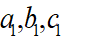、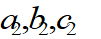、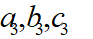分别为第一至第三级行星齿轮组各齿轮齿数。变桨电机通过一个三级行星减速器与变桨驱动齿轮*b*4相连，当变桨距控制器发出变桨距控制指令后，驱动电机输出转矩，经过传动轴和减速机构，最后经驱动齿轮*b*4传递至叶片叶根内齿圈*c*4上，从而带动回转支承的内环与叶片一起旋转，改变叶片桨距角。

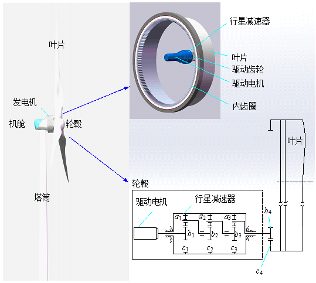

图4.1 风电机组变桨距系统

### 4.1.2 变桨距系统SCADA数据

在风电机组SCADA原始数据中，包含了风速、风轮转速、功率、变桨电机电流和桨距角等众多的风电机组状态数据。这里称风速、风轮转速、功率、变桨电机电流和桨距角为风电机组特征参数，假设特征参数个数为*m*，一次采样记录就构成一个数据样本，表示如下：

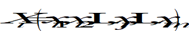 (4.1)

由于采样记录数据是固定频率，每一次也就对应了某一个时刻。如果设采样周期为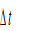，那么第*i*个采样记录就是采样开始后的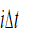时刻。设风电机组SCADA数据总样本数为*n*，那么这些数据就可以用矩阵形式来表示：

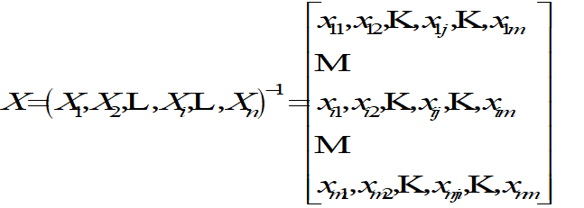 (4.2)

就一个具体研究对象而言，并不需要考虑所有的特征参数，也不一定需要所有的数据样本，而只需要从中提取若干特征参数及其一定时间的数据。就变桨距系统而言，风电机组SCADA数据中与其直接相关的数据特征参数只有桨距角和变桨电机电流，桨距角和变桨电机电流又与风电机组风速、风轮转速、叶片方位角和功率相关联。所以，这里提取风速、转速、方位角、桨距角、电流和功率等特征参数，表示如下：

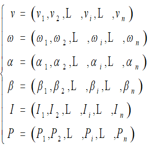 (4.3)

由此构成新的数据矩阵，表示为

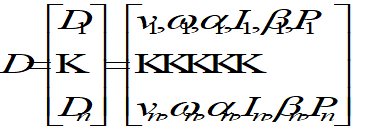 (4.4)

根据变桨电机电流，就可以计算出变桨电机的转矩。对于图4.1所示的直流变桨电机，其电磁转矩可采用下式进行计算：

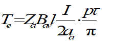 (4.5)

令*CT*=*pZa*/2*πaa*，*Ф*=*Bavlτ*，式(4.5)可化为

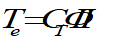 (4.6)

当电机额定转矩、额定电流已知时，可以由下式求得：

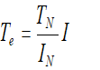 (4.7)

考察从电机到减速器再到叶片整个变桨距系统，忽略电机自身的空载阻力转矩，那么电机驱动齿轮作用在叶片上转矩为

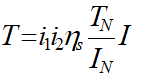 (4.8)

式中，*i*1为行星齿轮减速器的减速比；*i*2为叶根内齿圈*c*4与驱动齿轮*b*4的齿数比；*ηs*为传动系统机械效率。

将SCADA系统中每一时刻的变桨电机电流数据代入式(4.8)，就可以计算出作用在叶片上的转矩*T*为

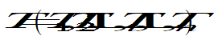 (4.9)

利用各个时刻的桨距角数据，可以分别计算出各个时刻的叶片桨距平均角速度和平均角加速度为

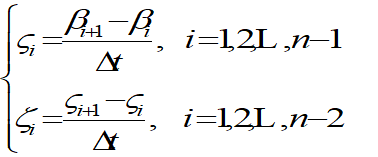 (4.10)

考虑到变桨电机转矩、变桨距平均角速度、变桨距平均角加速度在变桨距系统行为特性分析中非常重要，故对矩阵*D*作相应扩充，增加变桨电机转矩、变桨距平均角速度、变桨距平均角加速度三列，最后一行缺项补0。

提取SCADA系统中一段时间的桨距角数据，如图4.2所示。从图可见，实际的SCADA数据中，受制造和装配误差等因素影响，即使是非变桨状态下叶片的桨距角并非为0，而存在一定的偏移量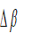。因为风速变化、时而超过额定风速时而小于额定风速的缘故，变桨距角总是在变化（将桨距角逐渐增大称之为开桨，桨距角逐渐减小称之为收桨）；当风速超过额定风速但基本不变，桨距角大于0且停顿静止。所以，根据风速的变化，叶片在非变桨、开桨、收桨、停顿等状态之间切换。从叶片桨距角速度角度来看，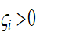时叶片处于开桨状态，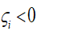时时叶片处于收桨状态，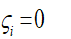时说明变桨距系统处于停顿状态，如图4.3所示。

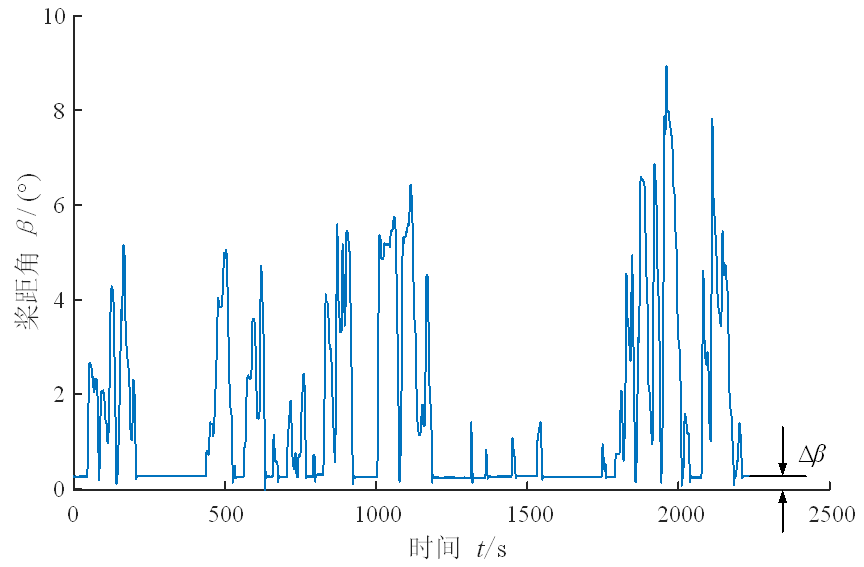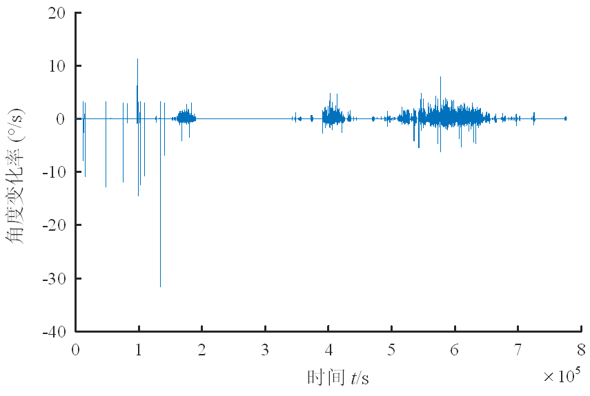

图4.2 叶片桨距角随时间变化 图4.3 叶片变桨距平均角速度随时间变化

对于某2MW直驱式风电机组，从表1.1可知，风电机组变桨电机额定电流38A，额定扭矩为37.5N·m；经过计算可得，行星齿轮减速器的传动比为194.1，驱动齿轮*b*4与叶根内齿圈*c*4的传动比为10.1，变桨距传动系统机械效率为94%，且风电机组SCADA系统采样频率为1Hz。

## 4.2 变桨距系统行为统计特性分析

### 4.2.1 变桨距系统运行状态统计分析

把变桨距系统从不驱动叶片变桨、到变桨、再到不变桨视为一个变桨周期，那么，根据SCADA数据，一个变桨周期就是叶片桨距角由初始值开始变化、最后回到初始值所经历的时间。图4.4展示了一个变桨周期内叶片桨距角随着时间的变化情况。

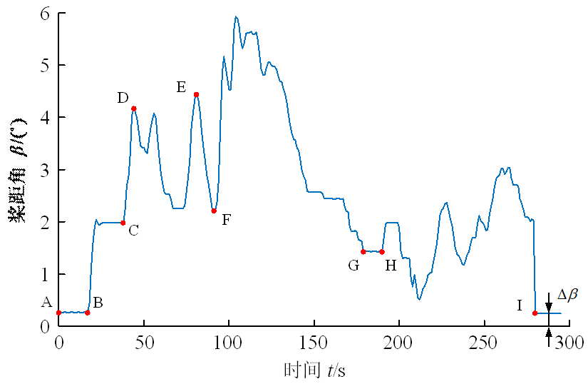

图4.4 一个变桨周期内叶片桨距角随时间变化

从图4.4可见，图中*AB*段，变桨距系统处于不启动、非变桨状态，可以看出此时叶片的桨距角并不为0，而是存在一定的偏移量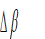。影响偏移量的因素很多，主要包括两个方面：一是变桨距系统零部件以及叶片的加工精度，装配间隙均会对其产生影响，不同型号的风电机组，甚至是同型号的不同风电机组偏移量不一定相同；二是变桨距系统刚度和受到的载荷，由此引起的变形及其测量误差对偏移量有影响，并且随着风电机组运行而波动。图中*BI*段，叶片处于变桨状态，由图中可以看出桨距角的大小随时间不断波动，并且桨距角随时间的变化具有如下三个状态：①桨距角增加，称为开桨，如图中*CD*段所示；②桨距角减小，称为收桨，如图中*EF*段所示；③叶片处于变桨状态但桨距角保持不变，称为停顿，如图中*GH*段所示。根据风速的变化，变桨距系统在上述几种状态之间切换。

为了分析变桨距系统的四种状态，考虑到变桨距系统运行过程中动态变形和误差等因素，在前面叶片桨距平均角速度基础上，定义某个时刻的叶片变桨距角度变化率：

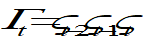 (4.11)

这样就相对于考虑3个时刻变桨距角变化，分类判断更加稳健。由式(4.11)就可以将风电机组正常运行中SCADA数据集进行分类处理，得到变桨距系统处于四种状态的数据子集：非变桨的数据子集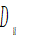(且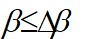)，开桨的数据子集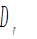(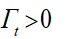)，收桨的数据子集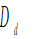(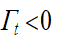)，停顿的数据子集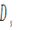(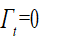且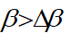)，分别记四个数据集的样本数为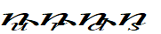。

对2MW风电机组一年的SCADA数据进行分类处理后，得到图4.5所示的变桨距系统不同状态下风速与变桨电机转矩之间的关系。

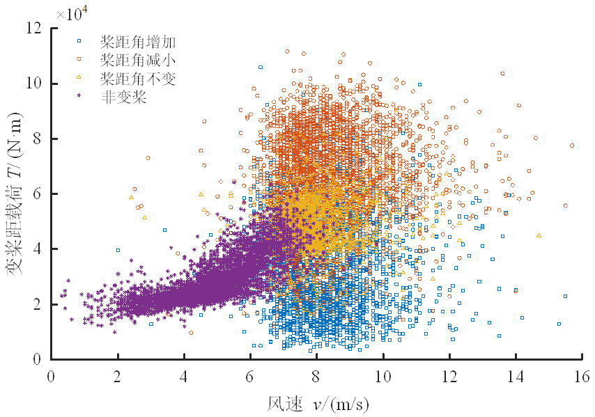

图4.5 不同状态下变桨距系统电机转矩随风速变化

从图4.5可见，风速在约6m/s以下时，变桨距系统基本处于非变桨状态；风速在约6~12m/s时，变桨距系统可能处于非变桨状态、也可能处于变桨状态，变桨频率随着风速增加而增加；风速在约12m/s以上时，变桨距系统基本处于变桨状态。出现这种某个时刻的风速相同而变桨距系统状态不同的主要原因是：①风速测量滞后性，测量风速的气象站一般设置在机舱尾部，而风流先经过叶片、后到达气象站；②变桨距系统控制策略，考虑到风速突变性与随机性等因素，变桨距系统控制不是由某一时刻风速决定的，一般是由某一段时间的平均风速决定的，如5s时间段的风速平均值；③变桨距系统较大质量，引起较大惯性力，变桨距系统状态不仅仅与该时刻风速有关，还与前一时刻变桨距状态有关。所以，仅仅采用某个时刻的风速是否到达风电机组额定风速来判断变桨距系统所处的状态并不合适，风电机组标注的额定风速只是意味着风速超过它时变桨距系统一般都处于变桨状态。

采用上述方法对全年SCADA数据进行统计分析，可以发现：①风电机组全年正常运行状态数据样本量共计19886741组，这意味着风电机组全年正常运行时间为5524.09h，占全年时间的63.06%。②正常运行状态下，非变桨状态所处时间占比为85.80%，变桨状态所处时间占比为14.20%，全年变桨次数为48875次。③在变桨状态所处时间占比中，开桨状态所处时间占比为5.97%，收桨状态所处时间占比为6.78%，停顿状态所处时间占比为1.45%。从图4.5还可见，相同风速下的开桨状态时变桨距系统电机转矩小于收桨状态时变桨距系统电机转矩，这是因为：开桨状态时，气动载荷与开桨方向相同而提供动力矩；收桨状态时气动载荷与收桨方向相反，变为了阻力矩。这也是收桨状态所占的时间比例高于开桨状态所占的时间比例的原因。

### 4.2.2 变桨距系统运行历程统计分析

在风电机组在实际运行过程中，变桨距系统经历着频繁的状态切换过程，表现出复杂的变桨距角度变化历程。从一个非变桨状态到下一个非变桨状态这样一个变桨周期中，变桨周期有长有短、每个周期中的最大桨距角不同，为了获得变桨频率的大小、变桨周期的长短和最大变桨角度，这里提出一种前后差分法来处理SCADA桨距角数据，具体实施步骤如下。

(1)在前面状态分类基础上，剔除叶片非变桨状态数据子集(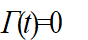且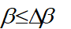)，得到叶片变桨状态数据集，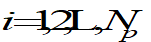，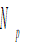为中数据记录长度。

(2)分别对中的桨距角数据求前向差分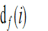与后向差分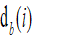：

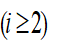 (4.12)

 (4.13)

(3)令前向差分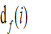与后向差分之积为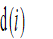：

 (4.14)

若求得的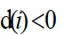，则对应的第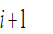个桨距角为桨距角增加或减小的数据点；若求得的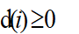，则对应的第个桨距角为极值点，即为该变桨周期中的最大桨距角。

(4)通过判断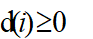且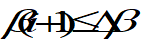，可提取得到叶片变桨周期的起点与终点位置数据向量。需要注意的是上述方法忽略了数据集中的端点值，而与分别对应的是第一个变桨周期的起点以及最后一个变桨周期的终点的数据向量，因此还需将端点两个数据分别补充至数据向量的两端得到，，为中总数据量，则叶片总变桨周期数为，即总变桨次数。

(5)通过变桨周期起点与终点位置数据向量可求得变桨周期，即

,  (4.15)

对风电机组变桨距系统变桨状态进行分析，全年最长变桨周期为936s，最短变桨周期为2s；统计可以得到变桨周期均值为37.19s，标准差为63.69s。变桨周期频率分布如图4.6所示，这是一个典型的时间间隔概率问题，其分布规律一般为指数分布，采用指数分布对变桨周期概率分布进行拟合得到：

 (4.16)

在每一个变桨周期中，变桨距角由小变大，然后由大变小，从开桨到收桨，其中经历的最大桨距角是一个重要指标。统计表明，变桨周期内最大桨距角均值1.87°，标准差2.26°，其频率分布见图4.7所示。采用指数分布对最大桨距角分布进行拟合得到

 (4.17)

图4.6 变桨周期分布规律 图4.7 最大桨距角分布规律

从图4.7可见，研究的风电机组运行过程中，全年叶片最大桨距角没有超过25°，最大桨距角在2°位置附近分布较为集中，这意味着在叶片叶根内齿圈的0°~2°位置承受了非常频繁的交变载荷。

### 4.2.3 变桨距系统电机转矩统计分析

在风电机组运行过程中，变桨距系统电机转矩受叶片重力、离心力、气动力、惯性力和摩擦力矩等综合影响，随着风速变化而变化，转矩幅值有大有小、变化周期有长有短，如图4.6、图4.7所示。风电机组即使处于非变桨状态时，变桨距系统不会驱动叶片转动，但是，变桨距系统必须输出转矩与作用于叶片上的载荷相平衡才能保持不转动。所以，在风电机组运行过程中，变桨距系统电机始终承受着转矩载荷，并且转矩随着风速变化而变化，只是在变桨状态下更为复杂，因为变桨距系统桨距角的变化，开桨、停顿、收桨等状态都将对变桨距系统电机承受的转矩载荷产生影响。

这里采用最常用的雨流计数法，对变桨距系统电机转矩进行处理，采用循环计数法编制变桨电机转矩载荷谱，如图4.8所示。雨流计数法原理是：根据电机转矩载荷历程得到全部的载荷循环，分别计算出全循环的幅值，并根据这些幅值得到不同幅值区间内所具有的频次，绘制出频次直方图。雨流计数法计数规则：

(1)重新安排载荷历程，以最高峰值或最低谷值为雨流的起点(视二者的绝对值哪一个更大而定)；

(2)雨流依次从每个峰值或谷值的内侧往下流，在下一个峰值或谷值处落下，直到对面有一个比开始时的峰值更大或谷值更小的值时停止；

(3)当雨流遇到来自上面屋顶流下的雨流时即行停止；

(4)取出所有的全循环，并记录下各自的幅值和均值。

图4.8 雨流计数法

雨流计数法除了计取幅值变化外，还可同时计取均值的变化，以幅值和均值两个参数来描述变桨距载荷历程，这样更能全面反映变桨距载荷变化规律。

对雨流计数法结果利用数理统计的方法进行处理，可得到所需变桨电机转矩载荷谱，而频率直方图和概率密度函数被广泛应用，可根据需要选取。将循环得到的一系列峰值或幅值数据分组，一般分12组左右，求出第*i*组中峰值或幅值出现的频次、累积频次，就可以计算出相应的频率、累计频率：

 (4.18)

 (4.19)

式中，*Ns*为第*i*组转矩值范围的样本数量；*N*为计数得到的总样本数量，即的和。

表4.1所示为采用雨流计数法统计分析得到的变桨电机转矩载荷历程的循环计数统计表，表中将转矩均分为12组，分别列出频次、累积频次、频率和累积频率。

表4.1 变桨距载荷循环计数统计表

| 序号 | 转矩范围/(N·m) | 频次 | 累积频次 | 频率 | 累积频率 |
|:--:|:--:|:--:|:--:|:--:|:--:|
| 1 | 0-10000 | 24955 | 9706209 | 0.002571 | 1.000000 |
| 2 | 10000-20000 | 1849189 | 9681254 | 0.190516 | 0.997429 |
| 3 | 20000-30000 | 4810880 | 7832065 | 0.495650 | 0.806913 |
| 4 | 30000-40000 | 1461087 | 3021185 | 0.150531 | 0.311263 |
| 5 | 40000-50000 | 912146 | 1560098 | 0.093976 | 0.160732 |
| 6 | 50000-60000 | 298598 | 647952 | 0.030764 | 0.066756 |
| 7 | 60000-70000 | 154629 | 349354 | 0.015931 | 0.035992 |
| 8 | 70000-80000 | 137016 | 194725 | 0.014116 | 0.020061 |
| 9 | 80000-90000 | 49628 | 57709 | 0.005113 | 0.005945 |
| 10 | 90000-100000 | 7511 | 8081 | 0.000774 | 0.000832 |
| 11 | 100000-110000 | 545 | 570 | 0.000056 | 0.000058 |
| 12 | 110000-120000 | 25 | 25 | 0.000002 | 0.000002 |

根据表4.1可以绘制出频率直方图和累积频次曲线，如图4.9、图4.10所示。采用对数正态分布函数进行拟合，可以得到该风电机组变桨电机转矩近似的概率密度函数：

 (4.20)

图4.9 变桨距载荷分布特性 图4.10 变桨距载荷累积频次曲线

由图4.10可知，在低周疲劳区（循环次数少于105）对应的变桨电机转矩载荷范围为\[7.58N·m, 1.61N·m\]，高周疲劳区（循环次数高于105）对应的变桨电机转矩载荷范围为\[5.23N·m, 7.58N·m\]，这对于变桨距系统疲劳强度设计有着参考价值。必须指出：采用雨流计数法分析，共计获得9706209个变桨电机转矩载荷循环，对于风电机组全年正常运行状态数据样本量共计19886741组，相当于2 s一个载荷循环；由于SCADA系统采样频率为1Hz，一些高频的动态载荷SCADA数据是不可能体现出来的，或者说SCADA数据已经是经过平滑处理的结果，也就是说，风电机组实际运行过程中，变桨电机转矩载荷变化更为频繁和复杂。

### 4.2.4 风速对变桨距系统行为特性的影响

1\. 风速的时间分布

一般认为，天气变化具有年周期变化规律，即所谓年复一年；春夏秋冬，天气每一个月变化差异显著。对全年和每一个月份的风速进行统计，发现就考察的风电场而言，风速更加接近于对数正态分布，相对于常用的威布尔分布更能描述频率密度较高的部分，两种不同分布密度函数拟合情况如图4.11所示。

\(a\) 对数正态分布 (b) 威布尔分布

图4.11 风速统计分布图

统计分析12个月的风速，按月份分布如图4.12所示，每一个月风速均值、标准差是不同的，结果如表4.2所示。从表4.2可以看出，风电场在夏季风速较低，其中5、6月风速在4.0m/s以下为最低；而冬季风速较高，其中1、12月在5.0m/s以上为最高；春秋两季居中，一般在4.5m/s左右。

表4.2 不同月份风速统计值

<table style="width:100%;">
<colgroup>
<col style="width: 15%" />
<col style="width: 10%" />
<col style="width: 6%" />
<col style="width: 6%" />
<col style="width: 6%" />
<col style="width: 6%" />
<col style="width: 6%" />
<col style="width: 6%" />
<col style="width: 6%" />
<col style="width: 6%" />
<col style="width: 6%" />
<col style="width: 6%" />
<col style="width: 10%" />
</colgroup>
<thead>
<tr>
<th rowspan="2" style="text-align: center;">统计项目</th>
<th colspan="12" style="text-align: center;">月份</th>
</tr>
<tr>
<th style="text-align: center;">1</th>
<th style="text-align: center;">2</th>
<th style="text-align: center;">3</th>
<th style="text-align: center;">4</th>
<th style="text-align: center;">5</th>
<th style="text-align: center;">6</th>
<th style="text-align: center;">7</th>
<th style="text-align: center;">8</th>
<th style="text-align: center;">9</th>
<th style="text-align: center;">10</th>
<th style="text-align: center;">11</th>
<th style="text-align: center;">12</th>
</tr>
</thead>
<tbody>
<tr>
<td style="text-align: center;">均值(m/s)</td>
<td style="text-align: center;">5.27</td>
<td style="text-align: center;">5.04</td>
<td style="text-align: center;">4.80</td>
<td style="text-align: center;">4.47</td>
<td style="text-align: center;">3.99</td>
<td style="text-align: center;">3.42</td>
<td style="text-align: center;">4.73</td>
<td style="text-align: center;">4.33</td>
<td style="text-align: center;">4.51</td>
<td style="text-align: center;">4.95</td>
<td style="text-align: center;">4.98</td>
<td style="text-align: center;">5.53</td>
</tr>
<tr>
<td style="text-align: center;">标准差(m/s)</td>
<td style="text-align: center;">1.72</td>
<td style="text-align: center;">1.95</td>
<td style="text-align: center;">1.79</td>
<td style="text-align: center;">1.85</td>
<td style="text-align: center;">1.60</td>
<td style="text-align: center;">1.27</td>
<td style="text-align: center;">1.92</td>
<td style="text-align: center;">1.49</td>
<td style="text-align: center;">1.59</td>
<td style="text-align: center;">1.63</td>
<td style="text-align: center;">2.04</td>
<td style="text-align: center;">1.78</td>
</tr>
</tbody>
</table>

图4.12 风速分布规律

对前述变桨数据集、、和统计分析容易得到，变桨距系统处于不同状态的时间占比如表4.3所示。从表中可以看出，风电机组在5、6、8月处于变桨距状态的时间占比均在10%以下，其中6月处于变桨距状态的时间占比最低，只有5.41%。结合风场风速统计值可知，5、6、8月的风速均值也是较低的三个月，其中6月的风速均值最低，只有3.42m/s。而12月的风速均值最大，为5.53m/s，相应的风电机组处于变桨距状态的时间占比最高，达到21.93%，这与风电机组处于变桨距状态的时间占比规律是一致的，即风电机组每个月处于变桨距状态的时间占比随着当月风速均值的增加而增加。这也提醒风场运行维护人员在变桨距状态所处时间占比较高的月份应对风电机组的变桨距系统维护引起更高的关注。结合表4.3和图4.11，就变桨距系统处于变桨状态时间占比来看，相当于风电场风速大于7m/s持续时间所占比。

表4.3 不同月份叶片各运行状态所处时间占比(%)

<table style="width:100%;">
<colgroup>
<col style="width: 6%" />
<col style="width: 11%" />
<col style="width: 6%" />
<col style="width: 6%" />
<col style="width: 6%" />
<col style="width: 6%" />
<col style="width: 6%" />
<col style="width: 6%" />
<col style="width: 6%" />
<col style="width: 6%" />
<col style="width: 6%" />
<col style="width: 6%" />
<col style="width: 6%" />
<col style="width: 6%" />
</colgroup>
<thead>
<tr>
<th colspan="2" rowspan="2" style="text-align: center;">叶片变桨状态</th>
<th colspan="12" style="text-align: center;">月份</th>
</tr>
<tr>
<th style="text-align: center;">1</th>
<th style="text-align: center;">2</th>
<th style="text-align: center;">3</th>
<th style="text-align: center;">4</th>
<th style="text-align: center;">5</th>
<th style="text-align: center;">6</th>
<th style="text-align: center;">7</th>
<th style="text-align: center;">8</th>
<th style="text-align: center;">9</th>
<th style="text-align: center;">10</th>
<th style="text-align: center;">11</th>
<th style="text-align: center;">12</th>
</tr>
</thead>
<tbody>
<tr>
<td colspan="2" style="text-align: center;">非变桨</td>
<td style="text-align: center;">82.06</td>
<td style="text-align: center;">84.23</td>
<td style="text-align: center;">85.81</td>
<td style="text-align: center;">87.01</td>
<td style="text-align: center;">92.64</td>
<td style="text-align: center;">94.59</td>
<td style="text-align: center;">80.81</td>
<td style="text-align: center;">92.21</td>
<td style="text-align: center;">89.69</td>
<td style="text-align: center;">84.67</td>
<td style="text-align: center;">82.95</td>
<td style="text-align: center;">78.07</td>
</tr>
<tr>
<td rowspan="3" style="text-align: center;">变桨</td>
<td style="text-align: center;">桨距角增加</td>
<td style="text-align: center;">7.82</td>
<td style="text-align: center;">6.57</td>
<td style="text-align: center;">6.00</td>
<td style="text-align: center;">5.39</td>
<td style="text-align: center;">3.12</td>
<td style="text-align: center;">2.53</td>
<td style="text-align: center;">8.05</td>
<td style="text-align: center;">3.35</td>
<td style="text-align: center;">4.33</td>
<td style="text-align: center;">6.43</td>
<td style="text-align: center;">7.03</td>
<td style="text-align: center;">9.13</td>
</tr>
<tr>
<td style="text-align: center;">桨距角不变</td>
<td style="text-align: center;">1.48</td>
<td style="text-align: center;">1.41</td>
<td style="text-align: center;">1.40</td>
<td style="text-align: center;">1.27</td>
<td style="text-align: center;">0.67</td>
<td style="text-align: center;">0.27</td>
<td style="text-align: center;">2.09</td>
<td style="text-align: center;">0.84</td>
<td style="text-align: center;">1.19</td>
<td style="text-align: center;">1.83</td>
<td style="text-align: center;">1.51</td>
<td style="text-align: center;">2.44</td>
</tr>
<tr>
<td style="text-align: center;">桨距角减小</td>
<td style="text-align: center;">8.65</td>
<td style="text-align: center;">7.79</td>
<td style="text-align: center;">6.79</td>
<td style="text-align: center;">6.33</td>
<td style="text-align: center;">3.56</td>
<td style="text-align: center;">2.62</td>
<td style="text-align: center;">9.05</td>
<td style="text-align: center;">3.60</td>
<td style="text-align: center;">4.79</td>
<td style="text-align: center;">7.07</td>
<td style="text-align: center;">8.52</td>
<td style="text-align: center;">10.36</td>
</tr>
</tbody>
</table>

2\. 风速对变桨距系统运行历程的影响

当风速增加、某一段时间的平均风速超过设定风速，变桨距系统就会启动，处于变桨状态，统计12个月变桨距系统变桨周期、最大桨距角等行为参数，如表4.4所示，变桨周期的分布规律如图4.13所示。从表4.4可见，每一个月变桨周期、最大桨距角等统计量均值与标准差都不相同：变桨次数最多的在12月达到8553次，最少的在6月仅有729次，不到12月份的十分之一；变桨周期的均值、标准差最长的都在11月分别达到50.78s、92.38s，变桨周期的均值、标准差最短的都在8月分别为25.40s、34.07s；最大桨距角均值最大在11月份达到2.44°而标准差最大在5月达到3.06°，最大桨距角均值、标准差最小都在8月分别仅为1.37°、1.51°。

表4.4 不同月份变桨距系统变桨行为参数

<table>
<colgroup>
<col style="width: 6%" />
<col style="width: 13%" />
<col style="width: 6%" />
<col style="width: 6%" />
<col style="width: 6%" />
<col style="width: 6%" />
<col style="width: 6%" />
<col style="width: 6%" />
<col style="width: 6%" />
<col style="width: 6%" />
<col style="width: 6%" />
<col style="width: 6%" />
<col style="width: 6%" />
<col style="width: 6%" />
</colgroup>
<thead>
<tr>
<th rowspan="2" style="text-align: center;">统计变量</th>
<th rowspan="2" style="text-align: center;">统计项目</th>
<th colspan="12" style="text-align: center;">月份</th>
</tr>
<tr>
<th style="text-align: center;">1</th>
<th style="text-align: center;">2</th>
<th style="text-align: center;">3</th>
<th style="text-align: center;">4</th>
<th style="text-align: center;">5</th>
<th style="text-align: center;">6</th>
<th style="text-align: center;">7</th>
<th style="text-align: center;">8</th>
<th style="text-align: center;">9</th>
<th style="text-align: center;">10</th>
<th style="text-align: center;">11</th>
<th style="text-align: center;">12</th>
</tr>
</thead>
<tbody>
<tr>
<td rowspan="3" style="text-align: center;">变桨周期</td>
<td style="text-align: center;">
周期数

(变桨次数)
</td>
<td style="text-align: center;">5900</td>
<td style="text-align: center;">3963</td>
<td style="text-align: center;">4275</td>
<td style="text-align: center;">3442</td>
<td style="text-align: center;">1582</td>
<td style="text-align: center;">729</td>
<td style="text-align: center;">6350</td>
<td style="text-align: center;">2101</td>
<td style="text-align: center;">2780</td>
<td style="text-align: center;">5453</td>
<td style="text-align: center;">3747</td>
<td style="text-align: center;">8553</td>
</tr>
<tr>
<td style="text-align: center;">均值(s)</td>
<td style="text-align: center;">35.11</td>
<td style="text-align: center;">40.71</td>
<td style="text-align: center;">36.98</td>
<td style="text-align: center;">42.67</td>
<td style="text-align: center;">36.28</td>
<td style="text-align: center;">27.34</td>
<td style="text-align: center;">34.33</td>
<td style="text-align: center;">25.40</td>
<td style="text-align: center;">35.55</td>
<td style="text-align: center;">31.34</td>
<td style="text-align: center;">50.78</td>
<td style="text-align: center;">39.17</td>
</tr>
<tr>
<td style="text-align: center;">标准差(s)</td>
<td style="text-align: center;">55.73</td>
<td style="text-align: center;">78.48</td>
<td style="text-align: center;">66.76</td>
<td style="text-align: center;">75.90</td>
<td style="text-align: center;">77.95</td>
<td style="text-align: center;">46.62</td>
<td style="text-align: center;">50.90</td>
<td style="text-align: center;">34.07</td>
<td style="text-align: center;">55.52</td>
<td style="text-align: center;">46.50</td>
<td style="text-align: center;">92.38</td>
<td style="text-align: center;">61.59</td>
</tr>
<tr>
<td rowspan="2" style="text-align: center;">最大桨距角</td>
<td style="text-align: center;">均值(°)</td>
<td style="text-align: center;">1.76</td>
<td style="text-align: center;">2.07</td>
<td style="text-align: center;">1.86</td>
<td style="text-align: center;">2.15</td>
<td style="text-align: center;">1.89</td>
<td style="text-align: center;">1.46</td>
<td style="text-align: center;">1.93</td>
<td style="text-align: center;">1.37</td>
<td style="text-align: center;">1.73</td>
<td style="text-align: center;">1.54</td>
<td style="text-align: center;">2.44</td>
<td style="text-align: center;">1.86</td>
</tr>
<tr>
<td style="text-align: center;">标准差(°)</td>
<td style="text-align: center;">1.95</td>
<td style="text-align: center;">2.87</td>
<td style="text-align: center;">2.41</td>
<td style="text-align: center;">2.61</td>
<td style="text-align: center;">3.06</td>
<td style="text-align: center;">1.89</td>
<td style="text-align: center;">2.22</td>
<td style="text-align: center;">1.51</td>
<td style="text-align: center;">1.86</td>
<td style="text-align: center;">1.57</td>
<td style="text-align: center;">3.04</td>
<td style="text-align: center;">1.91</td>
</tr>
</tbody>
</table>

图4.13 变桨周期分布规律

受风速变化影响，各月份变桨状态历经时间有长有短，变桨周期均值最大的是11月份，为50.78s，对比变桨周期均值与风速标准差，发现变桨周期均值与风速标准差有较强的对应关系，结合风速分布规律与变桨周期分布规律可知，风速标准差越大则变桨周期均值越大，风速标准差越小，则变桨周期越小，这也与变桨状态所处时间占比相对应。最大桨距角的分布如图4.14所示。从图可知，叶片变桨过程中，叶片最大桨距角没有超过25°，最大桨距角在1°位置附近分布较为集中。

图4.14 最大桨距角分布规律

对变桨距系统变桨周期、最大桨距角等变桨行为参数与风速相关性进行定量分析，可以获得相关系数如表4.5所示。从表可知，变桨周期、最大桨距角等参数均值及其标准差与风速均值相关系数较小，均小于0.5；最低是最大桨距角标准差与风速均值的相关系数仅为-0.0082。相对而言，变桨周期、最大桨距角等参数均值及其标准差与风速标准差的相关系数较高，均大于0.5；特别是变桨周期均值和最大桨距角均值与风速标准差相关系数都超过0.8；最高时大桨距角均值与风速标准差相关系数达到0.8663。这些表明，当风速较大超过了额定风速、变桨距系统处于变桨状态时，具体风速的大小变化对变桨距系统变桨行为的影响不大，而风速的分散程度却对变桨行为有着明显影响。这可能是因为当风速达到较高水平、变桨距系统已经处于变桨状态，系统行为就由变桨距系统控制策略和变桨距系统惯性力等因素所主导。

表4.5 风速与变桨距系统变桨行为参数的相关系数

|     统计项目     | 风速均值 | 风速标准差 |
|:----------------:|:--------:|:----------:|
|   变桨周期均值   |  0.4704  |   0.8273   |
|  变桨周期标准差  |  0.2380  |   0.6897   |
|  最大桨距角均值  |  0.3790  |   0.8663   |
| 最大桨距角标准差 | -0.0082  |   0.5918   |

根据表4.5的统计结果，可以得到不同风速标准差与变桨周期均值与标准差、最大桨距角均值与标准差的关系如图4.15所示。由图可见，它们都呈现出直线关系，即随着风速标准差增加，变桨周期均值与标准差、最大桨距角均值与标准差都近似直线增加。这就是说，风速越分散，变桨距系统变桨变桨周期、最大桨距角等行为参数变化幅度就越大，并且变化也越分散。这是因为正是风速的变化，才会频繁变桨，如果风速不变化，变桨周期就会无限长，并且最大桨距角就是定值。

\(a\) 风速标准差与变桨周期均值关系 (b) 风速标准差与变桨周期标准差关系

(c)风速标准差与最大桨距角均值关系 (d)风速标准差与最大桨距角标准差关系

图4.15 风速标准差对变桨周期、最大桨距角的影响

3\. 风速对变桨电机转矩分布的影响

当风电机组正常运行时，变桨距系统无论是处于非变桨状态还是变桨状态，变桨电机都要承受一定的转矩载荷，统计12个月变桨电机转矩，如表4.6所示。从表4.6可见，变桨电机转矩最大均值、标准差都出现在12月，分别为3.39×104N·m、1.42×104N·m；变桨电机转矩最小均值、标准差都出现在6月，分别为2.11×104N·m、0.64×104N·m，这是因为冬季风速高、夏季风速低的缘故。

表4.6 不同月份变桨电机转矩

<table>
<colgroup>
<col style="width: 17%" />
<col style="width: 6%" />
<col style="width: 6%" />
<col style="width: 6%" />
<col style="width: 6%" />
<col style="width: 6%" />
<col style="width: 6%" />
<col style="width: 6%" />
<col style="width: 6%" />
<col style="width: 6%" />
<col style="width: 6%" />
<col style="width: 6%" />
<col style="width: 7%" />
</colgroup>
<thead>
<tr>
<th rowspan="2" style="text-align: center;">
统计

项目
</th>
<th colspan="12" style="text-align: center;">月份</th>
</tr>
<tr>
<th style="text-align: center;">1</th>
<th style="text-align: center;">2</th>
<th style="text-align: center;">3</th>
<th style="text-align: center;">4</th>
<th style="text-align: center;">5</th>
<th style="text-align: center;">6</th>
<th style="text-align: center;">7</th>
<th style="text-align: center;">8</th>
<th style="text-align: center;">9</th>
<th style="text-align: center;">10</th>
<th style="text-align: center;">11</th>
<th style="text-align: center;">12</th>
</tr>
</thead>
<tbody>
<tr>
<td style="text-align: center;">
均值

(N·m)×104
</td>
<td style="text-align: center;">3.14</td>
<td style="text-align: center;">3.13</td>
<td style="text-align: center;">2.97</td>
<td style="text-align: center;">2.71</td>
<td style="text-align: center;">2.40</td>
<td style="text-align: center;">2.11</td>
<td style="text-align: center;">2.84</td>
<td style="text-align: center;">2.57</td>
<td style="text-align: center;">2.62</td>
<td style="text-align: center;">2.90</td>
<td style="text-align: center;">3.01</td>
<td style="text-align: center;">3.39</td>
</tr>
<tr>
<td style="text-align: center;">
标准差

(N·m)×104
</td>
<td style="text-align: center;">1.28</td>
<td style="text-align: center;">1.33</td>
<td style="text-align: center;">1.26</td>
<td style="text-align: center;">1.23</td>
<td style="text-align: center;">0.91</td>
<td style="text-align: center;">0.64</td>
<td style="text-align: center;">1.32</td>
<td style="text-align: center;">0.88</td>
<td style="text-align: center;">1.02</td>
<td style="text-align: center;">1.20</td>
<td style="text-align: center;">1.37</td>
<td style="text-align: center;">1.42</td>
</tr>
</tbody>
</table>

对变桨电机转矩与风速相关性进行分析，可以获得转矩均值与标准差和风速均值与标准差之间的相关系数，如表4.7所示。从表可见，它们之间的相关性都非常强，相关系数都超过0.7，特别是转矩均值与标准差和风速均值、转矩标准差与风速标准差之间的相关系数高达0.9以上。这意味着风速的均值与标准差对变桨电机转矩均值与标准差有着显著影响。

表4.7 风速与变桨电机转矩相关系数

|    统计项目    | 风速均值 | 风速标准差 |
|:--------------:|:--------:|:----------:|
|  电机转矩均值  |  0.9858  |   0.7262   |
| 电机转矩标准差 |  0.9123  |   0.9002   |

根据表4.7的统计结果，可以得到不同风速均值与标准差与变桨距系统载荷均值与标准差的两两关系如图4.16所示。由图可见，它们都呈现出直线关系，即随着风速均值与标准差增加，变桨距系统载荷均值与标准差近似直线增加。风速越高，变桨距系统载荷越大，变桨距系统载荷越分散，如图4.16(a)、(b)所示；风速越分散，变桨距系统载荷就越大，变桨距系统载荷越分散，如图4.16(c)、(d)所示。图4.16(a)所示的风速均值越大、风速越高，变桨距系统载荷(均值)就越大，这已经被普遍认同。但是，其他三种情况可能与变桨距系统变桨行为密切相关。首先，风速越高，变桨可能性越大，变桨发生后又必然存在开桨和收桨两种状态，同一变桨距角度的两种状态对应两种不同的电机转矩，从而导致变桨电机转矩分散。其次，风速越分散，变桨越频繁，即在开桨和收桨状态之间切换越频繁，从而导致变桨电机转矩越大、而且越分散。

(a)风速均值与电机转矩均值关系 (b) 风速均值与电机转矩标准差关系

\(c\) 风速标准差与电机转矩均值关系 (d) 风速标准差与电机转矩标准差关系

图4.16 风速均值与标准差对变桨电机转矩均值与标准差的影响

叶片不同变桨状态下其风速分布均值和方差以及对应的电机转矩均值与方差如表4.8所示，风速与变桨电机转矩统计直方图如图4.17所示。

图4.17 不同状态下风速与变桨电机转矩统计直方图

表4.8 不同状态下风速与变桨电机转矩统计结果

<table>
<colgroup>
<col style="width: 11%" />
<col style="width: 22%" />
<col style="width: 11%" />
<col style="width: 15%" />
<col style="width: 19%" />
<col style="width: 19%" />
</colgroup>
<thead>
<tr>
<th colspan="2" rowspan="2" style="text-align: center;">叶片变桨状态</th>
<th colspan="2" style="text-align: center;">风速/(m/s)</th>
<th colspan="2" style="text-align: center;">电机转矩/(N·m)</th>
</tr>
<tr>
<th style="text-align: center;">均值</th>
<th style="text-align: center;">标准差</th>
<th style="text-align: center;">均值</th>
<th style="text-align: center;">标准差</th>
</tr>
</thead>
<tbody>
<tr>
<td colspan="2" style="text-align: center;">非变桨</td>
<td style="text-align: center;">4.31</td>
<td style="text-align: center;">1.38</td>
<td style="text-align: center;">2.59</td>
<td style="text-align: center;">8.18</td>
</tr>
<tr>
<td rowspan="3" style="text-align: center;">变桨</td>
<td style="text-align: center;">桨距角增加</td>
<td style="text-align: center;">7.01</td>
<td style="text-align: center;">2.21</td>
<td style="text-align: center;">3.25</td>
<td style="text-align: center;">1.44</td>
</tr>
<tr>
<td style="text-align: center;">桨距角减小</td>
<td style="text-align: center;">7.26</td>
<td style="text-align: center;">2.25</td>
<td style="text-align: center;">5.38</td>
<td style="text-align: center;">2.03</td>
</tr>
<tr>
<td style="text-align: center;">桨距角不变</td>
<td style="text-align: center;">7.95</td>
<td style="text-align: center;">1.17</td>
<td style="text-align: center;">4.77</td>
<td style="text-align: center;">9.30</td>
</tr>
</tbody>
</table>

结合表4.8与图4.17可知，叶片非变桨状态下的平均风速最小，其值为4.31m/s，相应的电机转矩均值也最小，为2.59N·m。桨距角不变状态下风速均值最大，为7.95m/s，且此时风速的标准差最小，为1.17 m/s，这说明此时的风速波动较小。桨距角减小时的电机转矩均值为5.38N·m，其值要大于桨距角增加时的电机转矩均值3.25N·m。这是由于桨距角增加时，气动载荷为动力；桨距角减小时，气动载荷为阻力，桨距角减小时变桨电机需要克服的阻力更大。

## 4.3 变桨距系统力学特性分析

### 4.3.1 变桨距系统力学建模

1\. 变桨距系统受力分析

风电机组变桨距系统受力可以归纳为变桨电机驱动叶片转动的转矩、叶片变桨载荷和叶片转动时轴承摩擦力矩\[19\]。叶片变桨载荷是关键，影响其他两个方面力矩，一般认为叶片变桨载荷来源于如下三个方面：叶片自身重力、风轮旋转引起的叶片离心力和叶片上的气动力。其中，叶片重力大小取决于叶片质量，方向向下；离心力大小与叶片质量分布、风轮转速有关，方向为风轮径向，取决于叶片所处方位角；气动力大小和方向与风速大小与方向、叶片翼型与尺寸、叶片桨距角等因素有关，当其他因素一定时，气动力与风速平方成正比。显然，三个方面力都是分布力，其力的大小和作用点也很复杂，重力、离心力与叶片质量分布和叶片方位角有关，而气动力与叶片翼型与尺寸、叶片桨距角有关。特别需要指出，由于三个分布力都作用在叶片上，叶片的空间方位角随着风轮旋转而周期性变化，从而叶片变桨载荷随着风轮转动、叶片方位角（风轮轮毂角度）变化而呈周期性变化。

风电机组运行中大多数时间处于非变桨状态，也就是叶片不转动，变桨电机转矩与叶片变桨载荷平衡；风电机组运行处于变桨状态中，考虑到叶片是一个巨大的惯性体，变桨启动和停止过程时叶片转动加速度和减速度值都设计控制在0.01rad/s2以下，以免造成较大的系统动载荷；而且，SCADA数据采样频率为秒级也不可能真实反映动载荷，由此计算获得的变桨距角加速度也较小，所以，基于风电机组SCADA数据进行受力分析许多时候也不计入惯性力影响。这样，风电机组处于变桨状态下的受力变为变桨电机转矩、叶片变桨载荷和叶片轴承摩擦力矩三者之间的平衡关系。因为变桨电机转矩可以通过SCADA系统中变桨电机电流数据获得，通过三者平衡关系就可以计算变桨载荷和摩擦力矩。

2\. 叶片受力平衡方程

风电机组在最大风能利用区运行时，风速处于切入风速与额定风速之间时，风电机组向电网输电。变桨电机施加于叶片根部的转矩和叶片受到叶片变桨载荷相互作用，在风速变化时保持动态平衡而不使叶片转动，即

 （4.21）

由上式可知，在风电机组最大风能利用运行区，变桨电机转矩此时等于叶片变桨载荷。

风电机组在恒功率输出区运行时，风速达到或者超过额定风速，通过反馈控制叶片桨距角。风速不变时，桨距角度值不变，力学平衡方程为

 （4.22）

当风速有减小趋势时，叶片桨距角向变小方向转动，增大迎风面积，此时称为开桨。变桨电机的转矩克服叶片变桨载荷、轴承摩擦力矩使叶片转动，叶片受力可描述为

 （4.23）

当风速有增大趋势时，叶片桨距角将向增大方向转动，减少迎风面积，此时称为顺桨。叶片变桨载荷将克服电机变桨转矩、轴承摩擦力矩使叶片转动，叶片力学方程变为

 （4.24）

在风电机组恒功率输出区域运行时，因为叶片旋转方向不同，即处于开桨和顺桨状态，受到的电机转矩不同；而只要叶片迎风面相同、气动力相等，无论旋转方向，叶片变桨载荷和轴承摩擦力矩就相同。所以，由式（4.22）就容易得到风电机组恒功率输出运行区叶片停顿状态时的叶片变桨载荷；联立式（4.23）和式（4.24），就可以由电机转矩求得叶片开桨、顺桨状态时的叶片变桨载荷和轴承摩擦力矩。也就是说，从风电机组恒功率输出运行区的电机转矩可以计算出叶片变桨载荷和轴承摩擦力矩。

从以上分析可知，对于一定的风电机组及其变桨距系统而言，其风轮轮毂结构、叶片几何结构及其质量分布、叶片气动力学特性是不变的，若不考虑风向、偏航等因素影响，叶片变桨载荷取决于风速、风轮转速、叶片方位角和桨距角等。当风电机组运行处于最大风能利用区时，风速低于额定风速，叶片不变桨，其桨距角不变；通过控制风轮转速，使其叶尖速比接近最佳值，从而风能利用系数*C*p和输出功率达到最大值，即处于最大风能利用区。当风电机组运行处于恒功率输出区时，风速达到或者超过额定风速，风轮转速保持为额定转速；此时，为了抑制风速变化对输出功率的影响，控制系统将发出变桨距指令，即通过控制叶片桨距角，即风速增大，叶片顺桨增加桨距角；风速减小，叶片开桨减小桨距角，保持输出功率不变，实现风电机组恒功率输出。所以，变桨距系统受力实际上就只取决于风速、叶片方位角等两个独立参数，这为选择数据分箱方法提供了依据。

### 4.3.2 变桨距系统受力估算

风电机组发电过程包括最大风能利用运行区域和恒功率输出等两个运行区域，相应地，变桨距系统存在不变桨和变桨两个阶段。而且，随着风速变化，在变桨阶段又有顺桨、停顿和开桨三种状态。所以，对应风电机组发电过程，变桨距系统存在不变桨、顺桨、停顿和开桨等四个不同状态下，如前所述，每种状态的叶片受力平衡方程不同。因此，基于现场SCADA数据的变桨距系统受力分析首先要获得四种状态所对应的数据子集，即要对SCADA数据集进行分解。

变桨距系统运行状态实质上就是叶片转动状态，根据叶片桨距角大小和变化方向可以识别变桨距系统运行状态。因为风电机组安装、测试误差和风能与风电机组动态特性引起的扰动等缘故，在SCADA数据中，即使在风速较低、变桨距系统没有发生变桨时，桨距角度也并非为0°，而是有一定的初始值；并且，变桨过程中叶片受到风力作用还会发生摆动时，这些因素需要在判断变桨距系统运行状态时予以考虑。为了方便起见，这里设定桨距角门槛值和变桨距角速度门槛值分别为和，定义为不变桨状态，为变桨状态；定义为顺桨状态，为开桨状态，为停顿状态。

设、、、为风电机组及其变桨距系统运行处于不变桨、顺桨、停顿、开桨四种状态的样本子集，即

 （4.25）

如此，就将数据样本集分解为四个状态数据子集。根据这四个状态数据子集，应用前述的二维分箱方法，基于前面受力平衡方程就可以分别求得变桨距系统四种状态的叶片变桨载荷、轴承摩擦力矩和电机变桨转矩。

在变桨距系统不变桨状态，对应风电机组运行处于最大风能利用区域。应用二维分箱方法，根据风速、方位角各自的值域，分别划分为*m*、*n*个小区间，这时样本集就被分割为*mn*个子集，即

 （4.26）

此时，对应

 （4.27）

根据叶片平衡方程式（4.21），就可以从式（4.9）的电机转矩求得相应的叶片变桨载荷：

 （4.28）

在变桨距系统变桨状态，对应风电机组运行处于恒功率输出区域。根据风速、方位角各自的值域，分别划分为*m*、*n*个小区间，从而将、、数据集分割为*mn*个子集。

在变桨距系统处于停顿状态，由数据集，根据平衡方程式（4.22），可以从式（4.9）的电机变桨转矩求得该状态下的叶片变桨载荷：

 （4.29）

 （4.30）

 （4.31）

在变桨距系统处于顺桨或者开桨状态时，叶片处于转动阶段，此时必须考虑轴承摩擦力矩。从变桨距系统受力分析可知，电机变桨力矩取决于叶片变桨载荷、轴承摩擦力矩和叶片转动方向；叶片变桨载荷、轴承摩擦力矩取决于风速、叶片方位角。当风速、叶片方位角相同时，无论是顺桨状态还是开桨状态，此时叶片变桨载荷和轴承摩擦力矩就相同。所以，由数据集和可以得到相应状态的电机变桨力矩：

 （4.32）

 （4.33）

 （4.34）

再根据式（4.23）和式（4.24），就可以获得相应的叶片变桨载荷和轴承摩擦力矩为

 （4.35）

这样，就由式（4.9）得到的电机变桨转矩估算出了变桨距系统在风电机组运行时受到的叶片变桨载荷和轴承摩擦力矩，由此也容易分析风速、叶片方位角对电机转矩、叶片变桨载荷和轴承摩擦力矩的影响规律。

进行变桨距系统受力估算分析时，首先，需要明确研究对象，建立风电机组及其变桨距系统各种运行状态的力矩平衡方程；然后，应用二维分箱方法，基于现场SCADA数据，估算出相应时刻的变桨距系统叶片变桨载荷、轴承摩擦力矩和变桨电机转矩等；最后，以风速、方位角作为影响因子，分析变桨距系统在最大风能利用区不变桨，恒功率输出区顺桨、停顿、开桨等四个状态的叶片变桨载荷、轴承摩擦力矩和变桨电机转矩变化规律。由上可知，当风电机组运行处于恒功率输出区时，叶片变桨载荷实际上就只取决于风速、叶片方位角等两个独立参数，因此，数据单值处理可以采用二维分箱方法，相关计算如式（2.22）所示。

### 4.3.3 变桨距系统受力数据分析

> 1\. 数据观察与参数设定

选取某风电场2MW风电机组一年的SCADA系统数据。考虑到该风电机组对称分布三个相同叶片及其变桨距系统，取其中一个叶片的变桨距系统运行状态进行分析计算。现场SCADA桨距角数据是由安装在叶片根部内部附近的角度传感器测试获得，这里选取图4.18所示的四个典型时间段，来观察分析桨距角随风速变化等情况。

图4.18 四个时间段数据

从图可见：①在风速低于额定风速时，风电机组运行处于最大风能利用区域，叶片不发生变桨，但是由于安装、测试等方面误差和系统动态特性影响，桨距角并不为0。考察如图4.18(a)所示的一段原始数据记录，此时风速3~6m/s，桨距角大致在0.24°左右。②在风速较高、超过额定风速时，风电机组运行在恒功率区域，此时输出功率达到额定功率2 MW，随着风速变化，变桨距系统驱动叶片变桨调整桨距角增大或者减小，使输出功率稳定于额定功率，如图4.18(b)和(c)所示。考察两图所示的两段记录发现，风速大于8m/s，输出功率都大于额定功率，桨距角大于4°，桨距角速度绝对值大于0.1(°)/s。必须指出，由于桨距角控制不是基于某一时刻风速值而是基于某一时段输出功率平均值进行的，而且风轮具有巨大的惯性，所以风速、桨距角、输出功能等参数变化在某一时刻并非一一对应。③在风电机组恒功率区域运行时，当风速变化较小、处于稳定状态时，变桨距系统不会驱动叶片变桨而处于停顿状态，由于受到多种干扰，桨距角记录数据产生细微变化，如图4.18(d)所示，这时对应的桨距角速度在-0.02~0.02(°)/s之间。

通过对SCADA数据的观察分析，设定变桨距角门槛阈值，变桨距角速度门槛值(°)/s。综合考虑风电机组技术性能参数和SCADA数据样本的分布，在变桨距系统不变桨状态的数据集中，选取数据样本风速值域为；在变桨距系统变桨阶段数据集中，选取数据样本风速值域为；数据样本叶片方位角均为\[0,360\]。风速区间划分间隔大小都为0.2m/s，方位角区间划分间隔为4°。

2\. 叶片变桨载荷分析

叶片变桨载荷是由气动力、离心力和重力联合作用的结果，主导叶片受到的力矩。为了分析风电机组风速、叶片方位角对叶片变桨载荷的影响，分别选取方位角为0°、90°、180°、270°附近的样本数据，考察风速影响；同时，分别选取风速4m/s、7m/s、9m/s、12m/s附近的样本数据，考察叶片方位角影响。应用提出的变桨距系统受力估算方法，可以得到不同风速、方位角下叶片变桨载荷如图4.19所示。

图4.19 叶片变桨载荷与风速、方位角的关系

由上图可知，风速较低时，变桨载荷先是随着风速缓慢增加，然后是随着风速迅速增加；风速达到约7m/s后，变桨载荷随着风速增加缓慢。达到额定风速后，变桨距系统进入状态切换阶段，变桨载荷计算数据出现了跳跃变化；超过额定风速后，变桨载荷随着风速没有明显变化。造成上述现象的原因主要是因为风电机组在最大风能利用区域运行时，叶片不变桨，叶片迎风面最大，作用在叶片上气动力随着风速增加而增加，风轮转速也随着风速增加而增加，气动力和离心力两方面因素都导致叶片变桨载荷增加；风电机组在恒功率输出区域运行时，风轮转速稳定于额定转速离心力不变，叶片桨距角随着风速增加而增大，叶片迎风面随着风速增加而减小。

变桨载荷随叶片方位角呈周期性变化，以风速7m/s为例，0°~90°，变桨载荷随着方位角增加而减小；90°~180°，变桨载荷随着方位角增加缓慢减小再增大；180°~270°，变桨载荷随着方位角增加而增加；270°到360°，变桨载荷先增加后减小。风轮每旋转一周，变桨载荷经历了由大变小再到由小变大（或者由小变大再到由大变小）的周期性变化过程。变桨载荷随着方位角变化特性与风速高低密切相关，风速较低时，如4m/s，周期性不明显；风速达到7m/s以上，变桨载荷随方位角变化呈现明显的周期性特性。比较风速7m/s、9m/s、12m/s三种情况可见，幅值周期性变化存在差异。风速7m/s时，载荷周期性变化范围约为30~32kN·m，幅值比为；风速9m/s时，载荷周期性变化范围约为33~40kN·m，幅值比为；风速12m/s时，载荷周期性变化范围约为28~41kN·m，幅值比为。特别指出，变桨载荷周期性变化最大值（最小值）对应的方位角会随着风速变化而变化。风速7m/s时，变桨载荷最小值出现在方位角120°附近，最大值在300°附近；风速9m/s时，变桨载荷最小值出现在方位角60°附近，最大值在240°附近；风速12m/s时，变桨载荷最小值出现在方位角300°附近，最大值在90°附近。变桨载荷随叶片方位角呈周期性变化，周期性变化幅值随着风速增加而增大，这主要是因为作用在叶片上的气动力、离心力和重力都是分布力，其合力作用点和方向不但与叶片形状、桨距角有关，还与叶片方位角有关，因此叶片变桨载荷随着风轮旋转、方位角变化而周期性变化。

3\. 变桨轴承摩擦力矩分析

叶片变桨轴承摩擦力矩阻止叶片转动，在恒功率阶段叶片处于运动状态，变桨距系统处于顺桨和开桨状态时，其轴承摩擦力矩可估算出来。为了分析变桨轴承摩擦力矩，分别选取方位角为、、、附近的样本数据，考察其与风速的关系；同时，分别选取风速4m/s、7m/s、9m/s、12m/s附近的样本数据，考察与方位角的关系，估算结果如图4.20所示。

图4.20 轴承摩擦力矩与风速、方位角的关系

图中，风速为12m/s时变桨轴承摩擦力矩波动要大于风速为9m/s时的波动。在恒功率输出区，变桨轴承摩擦力矩在12kN·m左右波动。这是因为变桨轴承摩擦力矩取决于轴承负荷和摩擦系数，而摩擦系数只与轴承类型、配合间隙和润滑状态有关。所以，对于具体轴承来说，摩擦力矩大小取决于负荷大小。轴承负荷也是由作用在叶片上的气动力、离心力和重力等载荷产生的，叶片重力一定，当离心力不变（风轮以额定转速旋转），气动力不变（叶片桨距角随风速增加而增加，叶片迎风面面积减少，气动力基本不变）时，轴承负荷基本不变，若桨距角变化只是载荷作用在轴承部位不同而已。利用SCADA数据可以由上述方法估算出轴承摩擦力矩；一旦摩擦系数确定，由轴承摩擦力矩还可以估算出轴承负荷。某2MW风电机组变桨轴承直径为2110mm，采用圆柱滚子负游隙，摩擦系数接近于滑动摩擦，取为0.01，这样，该变桨轴承可能承受着的负荷。

4\. 变桨电机转矩分析

变桨电机转矩是变桨电机驱动叶片转动或者保持叶片不动的主动力，其大小取决于叶片受到的变桨载荷和轴承摩擦力矩，同时还与叶片转动方向关联。分别选取方位角为、、、附近的样本数据，考察变桨电机转矩与风速的关系，同时分别选取风速4m/s、7 m/s、9m/s、12m/s附近的样本数据，分析方位角对电机转矩的影响，如图4.21和图4.22所示，其中图(b)、(c)、(d)分别指风电机组恒功率输出区中顺桨、停顿、开桨状态。

图4.21 电机变桨转矩与风速的关系

图4.22 变桨电机转矩与方位角的关系

风电机组在最大风能利用区运行时，由于桨距角不变，叶片受力比较平稳。变桨载荷随着风速增加而增加，随着风轮旋转、方位角变化而呈现周期性变化。对SCADA数据进行回归拟合可以得到：。如果不考虑风速影响，变桨载荷可算出为11.53kN·m，这可视为叶片重力产生的变桨载荷。叶片变桨载荷（气动部分）与风速平方成正比，这与风电机组功率与风速立方成正比是一致的。周期函数部分占比很小，所以在风速较低时，周期性变化不明显。变桨载荷周期性变化存在初始相位角，这与叶片形状及其在风轮上空间位置有关。

风电机组在恒功率输出区域运行时，变桨距系统处于工作状态，风速变化引发桨距角相应变化，既实现了输出功率基本稳定，也使得变桨载荷、轴承摩擦力矩、电机转矩保持基本不变，但是会造成载荷力矩波动随风速增加越来越剧烈。由叶片受力平衡方程可知，开桨状态下，变桨电机转矩为变桨载荷与轴承摩擦力矩相加，约为48kN·m（36kN·m +12kN·m）；顺桨状态下，变桨电机转矩为变桨载荷减去轴承摩擦力矩，约为24kN·m（36kN·m -12kN·m）；停顿状态下，变桨电机转矩等于变桨载荷，约为36kN·m。风电机组在开桨、顺桨、停顿三种状态下，变桨电机转矩均随着叶片旋转、方位角变化而呈期性变化，变化幅值各不相同（图4.21、图4.22）。由图可见，风速9m/s时，最大波动幅度约为8.3kN·m；风速12m/s时，最大波动幅度约为22kN·m。需要说明的是，这些都是基于数据均值化处理的分析结果，实际中的瞬态值会更大一些。

综上所述，该机组在恒功率输出区运行时，变桨载荷约为36kN·m，其中重力引起的变桨载荷约11kN·m，占比30.6%；在风轮旋转、方位角变化过程中，产生的周期性变桨载荷幅值约13kN·m，占比36.1%；变桨过程中产生的轴承摩擦力矩约为12kN·m，占比33.3%。在风电场，风速随机变化引起变桨载荷随之变化，导致变桨电机转矩相应变化。变桨电机转矩呈现交变特性主要源于三个方面原因：一是风场风速的交变性，这取决于风场气流突变性，是自然不可避免的；二是变桨载荷随风轮旋转产生的交变性，这是由风轮旋转轴线和叶片变桨轴线的空间关系决定的；三是叶片顺桨、开桨状态的切换，桨距角从0°变大再变小回归为0°，这是叶片正反两个方向转动造成的，可见变桨电机转矩变化非常复杂。风电机组变桨电机转矩交变性是影响变桨距系统零部件疲劳失效、引发变桨距系统故障的重要原因。

## 4.4 参考文献

1.  Bi R, Qian K, Zhou C, et al. A survey of failures in wind turbine generator systems with focus on a wind farm in China\[J\]. International Journal of Smart Grid and Clean Energy, 2014, 3(4): 366-373.

2.  Marathe N, Swift A, Hirth B, et al. Characterizing power performance and wake of a wind turbine under yaw and blade pitch\[J\]. Wind Energy, 2016, 19(5): 963-978.

3.  Dai J, Hu Y, Liu D, Long X. Calculation and characteristics analysis of blade pitch loads for large scale wind turbines\[J\]. Science China: Technological Sciences, 2010, 53(5):1356-1363.

4.  Dai J, Hu Y, Liu D, Long X. Aerodynamic loads calculation and analysis for large scale wind turbine based on combining BEM modified theory with dynamic stall model\[J\]. Renewable Energy. 2011, 36(3):1095-1104.

5.  Dai J, Hu W, Shen X. Load and dynamic characteristic analysis of wind turbine flexible blades\[J\]. Journal of Mechanical Science and Technology, 2017, 31(4): 1569-1580.

6.  Dai J, Li M, Chen H, He T, Zhang F. Progress and challenges on blade load research of large-scale wind turbines\[J\]. Renewable Energy, 2022, 196: 482-96.

7.  Li J, Wang S. Dual multivariable model-free adaptive individual pitch control for load reduction in wind turbines with actuator faults\[J\]. Renewable Energy, 2021, 174: 293-304.

8.  He L, Hao L, Qiao W. Remote monitoring and diagnostics of pitch-bearing defects in an MW-Scale wind turbine using pitch symmetrical-component analysis\[J\]. IEEE Transactions on Industry Applications, 2021:57(4): 3252-61.

9.  Trujillo J J, Seifert J K, Wrth I, et al. Full field assessment of wind turbine near wake deviation in relation to yaw misalignment\[J\]. Wind Energy Science, 2016(1): 41-53

10. Kress C, Chokani N, Abhari R. Downwind wind turbine yaw stability and performance\[J\]. Renewable Energy, 2015, 83: 1157-1165.

11. Hansen A, Butterfield C, Cui X. Yaw loads and motions of a horizontal axis wind turbine\[J\]. Journal of Solar Energy Engineering, 1990, 112(4): 310-314.

12. Bassett K, Carriveau R, Ting D S K. Vibration response of a 2.3MW wind turbine to yaw motion and shut down events\[J\]. Wind Energy, 2011, 14(8): 939-952

13. Dai J, He T, Li M, et al. Performance study of multi-source driving yaw system for aiding yaw control of wind turbines\[J\]. Renewable Energy, 2021, 163:154-171.

14. Yesilbudak M, Sagiroglu S, Colak I. A novel intelligent approach for yaw position forecasting in wind energy systems\[J\]. International Journal of Electrical Power & Energy Systems, 2015, 69: 406-413.

15. Chen B, Matthews P C, Tavner P J. Wind turbine pitch faults prognosis using a-priori knowledge-based ANFIS\[J\]. Expert Systems with Applications, 2013, 40(17): 6863-6876.

16. Liu D, Zhang F, Dai J, et al. Study of the pitch behaviour of large-scale wind turbines based on statistic evaluation\[J\]. IET Renewable Power Generation, 2021, 15(11): 2315-24.

17. Zhang F, Dai J, Liu D, et al. Investigation of the pitch load of large-scale wind turbines using field SCADA data\[J\]. Energies, 2019, 12(3): 509.

18. Li M, Dai J, Zhang F, et al. Research on force model and characteristics of large wind turbine pitch system based on SCADA data\[J\]. Frontiers in Energy Research, 2023, 11: 1203158.

19. Korkos P, Linjama M, Kleemola J, et al. Data annotation and feature extraction in fault detection in a wind turbine hydraulic pitch system\[J\]. Renewable Energy, 2022, 185: 692-703.

20. Wei L, Qian Z, Zareipour H. Wind turbine pitch system condition monitoring and fault detection based on optimized relevance vector machine regression\[J\]. IEEE Transactions on Sustainable Energy, 2020: 11(4): 2326-2336.
