# 第5章 风电机组偏航行为特性SCADA数据分析

偏航系统是风电机组的重要组成部分，其主要功能是调整风轮机舱迎风角以便有效地跟踪风向。一方面，偏航系统性能是影响风电机组发电效率的关键因素，如果偏航系统能够准确、快速地响应任何风向的变化，有利于提高风电机组发电效率。另一方面，偏航系统对风电机组的寿命和安全产生重要影响，偏航系统频繁启动会产生高负荷，这可能导致齿轮断裂、回转轴承故障、偏航计数器与传感器故障等故障，导致电能损失和增加运行和维护成本。国内外学者围绕风电机组偏航系统，在理论分析、仿真计算、实验测试、控制策略与算法等方面开展了大量的研究工作\[1-14\]，但是，这些研究许多都是基于理论推导、数值仿真和实验室试验而展开的，缺乏现场试验数据的支撑。为此，一些研究者应用风电机组现场SCADA数据，从数理统计建模和智能算法建模两个方面，开展了风电机组及其偏航系统的物理力学机制与控制策略研究工作\[15-18\]。

本章应用数理统计方法，基于风电SCADA数据分析风电机组偏航系统的行为特性、控制策略、机舱振动及其影响规律。

## 5.1 偏航状态下风能捕获特性分析

### 5.1.1 偏航状态下能量捕获机制理论分析

> 1\. 偏航系统结构组成

在风电机组实际运行过程中，风向的时变性不可忽视。当风向与风轮轴线不平行时，风电机组处于偏航状态，偏航影响风电机组能量捕获，因此大型风电机组都配置了偏航对风装置，如图5.1所示。偏航系统由电机、减速器、轴承、制动器、小齿轮和大齿轮组成。偏航电机受偏航角(风向与风轮轴线方向的夹角)控制，启动后经过减速器减速带动小齿轮转动，然后与大齿轮啮合产生相对运动。由于大齿轮与塔架固连、小齿轮安装在机舱上，机舱及其上的发电机、风轮相对于塔架运动实现偏航。在风电机组SCADA数据中包括偏航对风平均值、风向绝对值、机舱振动值等直接与机舱偏航系统相关的数据，这为机舱偏航系统运行特性分析提供了数据支撑。

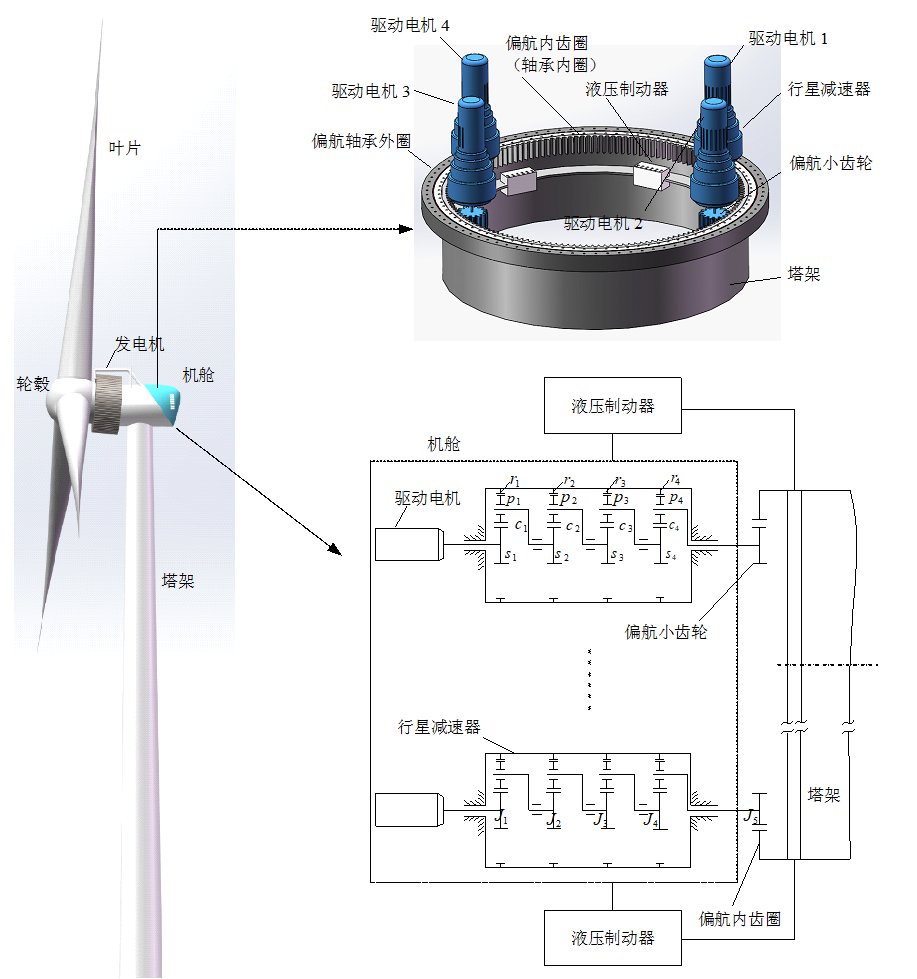

图5.1 风电机组偏航系统结构

> 2\. 偏航角与偏航系数

当作用在风轮上的风速方向与风轮轴线不平行时，风电机组呈现偏航运行状态。偏航改变了风与风轮相互作用的理想状态，对风电机组运行必然产生影响。根据图5.2，可得风电机组偏航角的基本定义为

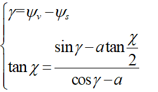 (5.1)

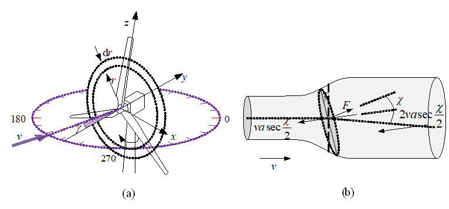

图5.2 风电机组偏航状态

在风电SCADA数据中，收集了偏航角度的实时变化状态，其中风电机组运行参数采样频率为1Hz，而偏航角度给出的是5s或者10s偏航对风平均值。为后续分析的方便，提出偏航系数表达式，将其定义为当前偏航角度与偏航角度基值之比：

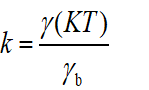 (5.2)

式中，*k*为偏航系数；为采样周期；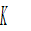为采样数；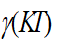为当前偏航角度；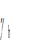为偏航角度基值。

> 3\. 偏航状态下能量捕获机制

从本质上讲，偏航改变了作用在风轮上有效风速，从而影响风电机组对空气动能的捕获效率。根据风电机组相关理论，通常采用风能利用系数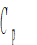来描述作用在风轮上的风能与风轮捕获的风能之间的关系，通常认为风能利用系数是叶尖速比 和叶片的桨距角*β*的函数，即：

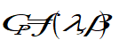 (5.3)

例如，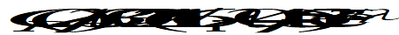，其中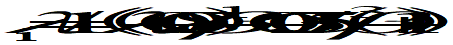。

然而，风电机组在实际运行过程中，偏航总是存在的，偏航角对风能利用系数的影响不应该被忽略；而且，进入风轮的风能变化率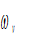也会对风能利用系数产生影响。因此，式(5.3)变为

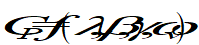 (5.4)

Albert Betz理论推导出风电机组风能利用系数极限值为0.593，导致空气动能不完全捕获的原因有两个方面：一方面，风轮叶片翼型(结构)的气动特性引起的不完全风能捕获；另一方面，风轮惯性对能量变化的频率响应特性引起的不完全风能捕获，当风能量变化频率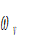过高，因为惯性风轮对其响应输出趋近于0，也即是对高频能量输入无响应输出。这里，用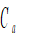表示气动损失因子，即气动特性引起的不完全风能捕获；用表示惯性损失因子，即风轮频率响应特性引起的不完全风能捕获。两者的表达式可写为

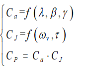 (5.5)

根据惯性环节特性，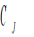又可以表达为

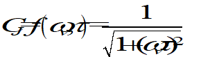 (5.6)

这样，可得风电机组捕获风能的功率表达式为

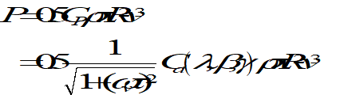 (5.7)

### 5.1.2 偏航角度数据滤波

由式(5.7)可知，如果输入风能变化频率太快，风轮对高频能量输入无响应输出。从SCADA数据提取的一段时间内偏航角度变化曲线，如图5.3所示，从中可以看出偏航角是动态变化中包含了高频分量。因此，在分析偏航角度对风轮能量特性影响时，应通过滤波算法滤除偏航角度高频变化分量。

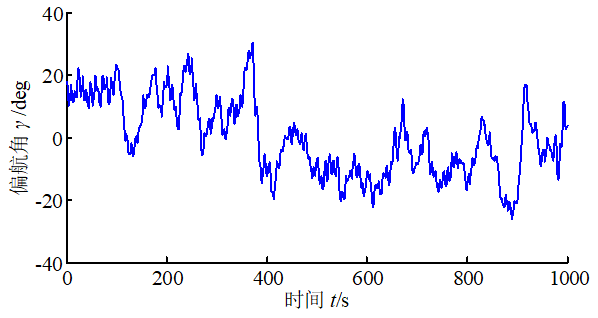

图5.3 风电机组偏航角时变曲线

为了滤除偏航角度的高频变化分量，采用离散二阶低通滤波器对其进行处理，滤波器状态方程为

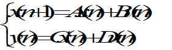 (5.8)

式中，*u*为滤波器输入；*y*为滤波器输出；*x*为状态变量；*A*、*B*、*C*、*D*均为矩阵系数。

式（5.8）中矩阵系数*A*、*B*、*C*、*D*的取值取决于滤波器截止频率，因此，滤波算法的关键是寻找滤波器的低通截止频率。通过对惯性衰减系数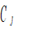的分析可知，影响风电机组功率、转矩和偏航系统偏航角度既有风轮-发电机转子系统动态特性，又有风电机组偏航系统转子系统动态特性，可以考虑取两者惯性时间常数的最大值进行分析。若取截止频率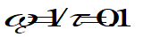，则有

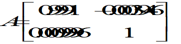，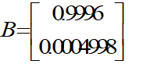，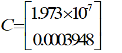，D=9.865×10-8

根据上述分析，得到风电机组偏航系数计算流程，如图5.4所示。

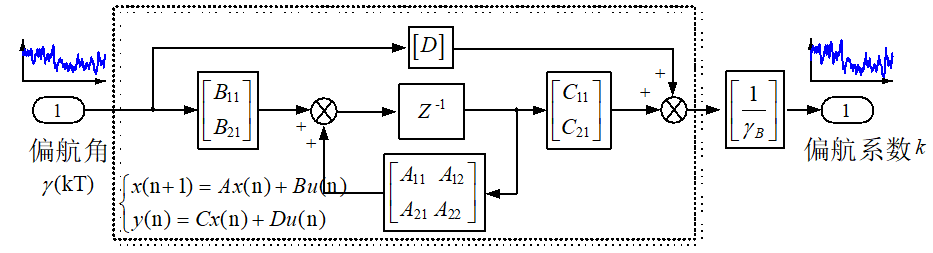

图5.4 风电机组偏航系数计算框图

### 5.1.3 偏航状态下功率和转矩特性

> 1\. 偏航状态下功率特性分析

为了分析风向偏航对风电机组能量输出的影响，提取SCADA数据某年度9月部分来研究偏航条件下的能量输出性能。对数据进行预处理后，将偏航系数划分为\[0, 0.3\]、\[0.3, 0.6\]和\[0.6, 1\]三个区域，分别提取偏航系数在\[0, 0.3\]、\[0.3, 0.6\]和\[0.6, 1\]范围内的数据。某风电机组风速与功率的散点关系如图5.5 (a)所示，采用非参数核密度估计（KDE）方法对数据进行单值处理。当风速为6 m/s (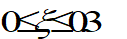)时，功率概率分布如图5.5 (b)所示。

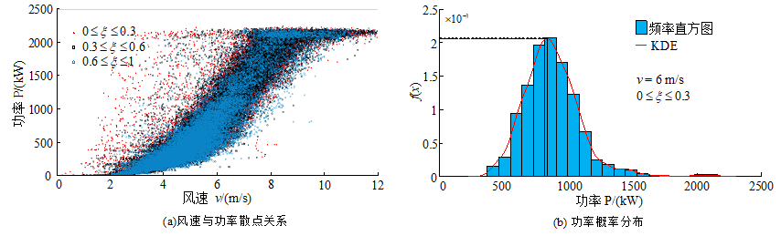图5.5 偏航状态能量输出

偏航系数三个区域内的风电机组风速与功率关系散点图，如图5.6所示。图中风速数据是经过3.1.2节类似方法进行了滤波处理的，以消除高频分量。从图5.6(a)、(b)和(c)中可以看出，风速与功率关系点主要分布在低风速阶段，这是因为风电机组主要在额定风速以下运行(取决风场风资源特性)。三个偏航系数区域中，偏航系数最小的区域散点数最多(测试时间段内)，偏航系数最大的区域散点数最少，这也说明风电机组主要运行在低偏航系数区域。经过单值化处理后的风速-功率关系如图5.6(d)所示。从图中可以看出，在额定风速以下，风电机组整体上输出功率随偏航系数的增加而减小，例如，在风速为6m/s时，在偏航系数为\[0, 0.3\]，\[0.3, 0.6\]和\[0.6, 1\]三个区域中的功率值分别为550kW、511kW和345kW；在8m/s时，分别为1180kW、1120kW和1038kW。在额定风速以上，偏航系数的变化对功率的影响不明显，因为这一区域变桨距控制对功率输出具有主导作用。

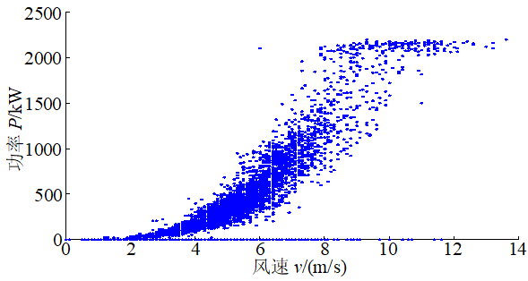

\(a\) 风速与功率散点关系(0\<*ξ*\<0.3)

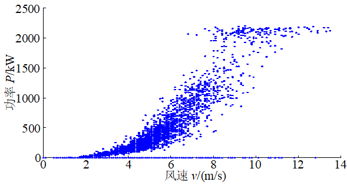

\(b\) 风速与功率散点关系(0.3≤*ξ*\<0.6)

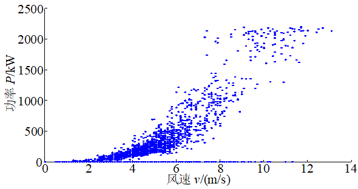

\(c\) 风速与功率散点关系(0.6\<*ξ*≤1)

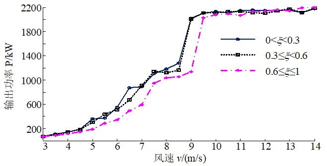

\(d\) 单值化处理后的风速与功率关系

图5.6 偏航对风速-功率关系影响

利用核密度估计（KDE）方法，获得4台风电机组不同偏航系数下风速与功率之间的单值关系曲线如图5.7所示。从图5.7(a)~(d)可见，在相同的风速下，不同的偏航系数会导致功率输出有一些差异，但在大多数运行区域，差异并不明显，这说明风电机组偏航对输出功率的影响是随机的、没有明显的规律性。从图还可以发现另一个现象：对于WT2和WT4，当风速接近10m/s时，两台风电机组开始有满功率输出；但对于WT1来说，当风速接近8.5m/s时，风电机组开始有满功率输出；对于WT3，当风速接近10.5m/s时，风电机组开始有满功率输出。额定风速定义为风电机组达到额定输出功率式的（最小）风速，是风电机组关键的设计依据。从理论上说，相同机型的风电机组额定风速是相同，制造商给出的额定风速是名义上的，所以实际额定风速小于名义上的就可以理解。这也说明，风电机组能量输出不但与风能资源、风电机组控制策略有关，而且还可能和风电机组控制策略与此处风能资源风速、风向变化规律吻合程度相关，这也就是说，即使是结构完全相同的风电机组，也需要根据风电机组所处位置风资源来优化调整控制策略，以便获得更多的能量输出。当然，风电场不同位置的相同风电机组额定功率输出所对应的风速差异还有待深入研究。

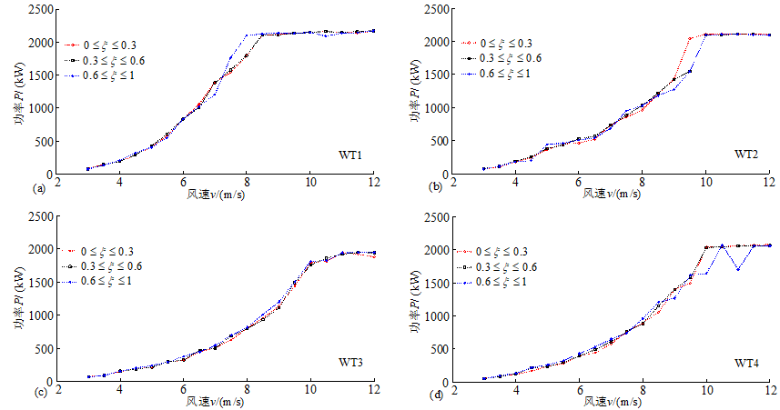图5.7 偏航状态能量输出

为了考察风电机组不同时期的风速与功率关系曲线变化，提取了同一风电机组间隔三年的部分SCADA数据。图5.7(c)和图5.8(b)的差异在于风速（横坐标），后者的离散度为0.5m/s。从图5.8可以看出，不同时期的风速与功率关系曲线接近，两者均具有风速 8.5m/s 的全功率输出。对于相同的风速，不同时期风电机组的功率输出可能存在偏差。例如，当风速为7m/s时，根据三年前的SCADA数据，发电机功率为1403~1521kW；根据三年后的SCADA数据，发电机功率为1355~1381kW，这似乎为风电机组老化效应提供了佐证。

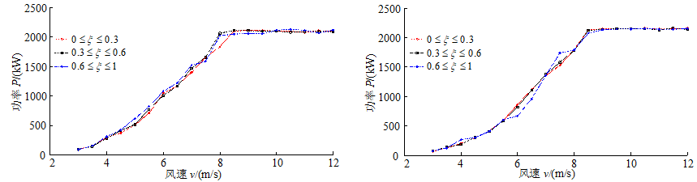

\(a\) 3年前数据 (b) 3年后数据

图5.8 不同时期的能量输出与风速关系

> 2\. 偏航状态下转矩特性分析

在外部气流的作用下，因为风电机组气动特性，会在叶片上产生一个轴向力和切向力。轴向力形成弯矩使得叶片及塔架弯曲；切向力形成机械转矩，使得风轮旋转发电。SCADA数据中，与气动特性相关的数据是发电机转矩测量值，因为对直驱式风电机组，稳态下机械转矩与发电机电磁转矩接近。在分析偏航对风电机组风轮转矩影响时，除了提取相同风速数据外，还需要在相同的风轮转速数据下进行，因为从图5.4来看，风轮转速与转矩同属中间(内部)变量，风轮转速的变化对转矩也会产生直接的影响。

由于偏航在本质上改变了作用在风电机组风轮叶片上的有效风速，因此从理论上讲，偏航系数的变化对风轮转矩会产生影响。然而，从相同的风速和转速条件下由SCADA数据得到的偏航系数与风轮转矩关系图（如图5.9所示）来看，偏航系数的变化对风轮转矩几乎没有影响。这是因为：在实际的风电机组控制策略中，功率跟踪控制的判断依据并非基于风速大小及其变化，而是采用“转速-功率”曲线跟踪控制，也就是说，通过对转速和功率的测量并判断两者关系是否满足设定的“转速-功率”曲线，并以此为依据实时调节风电机组转速。这样一来，只要风电机组转速一定，其对应的功率也就一定，相应地转矩也就一定。所以，风电机组这种强控制机制弱化了偏航对转矩的影响。

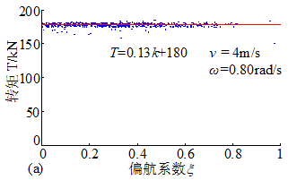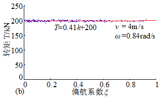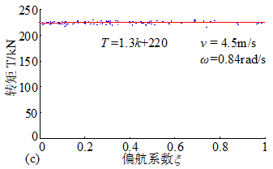

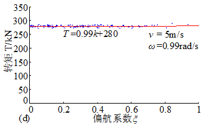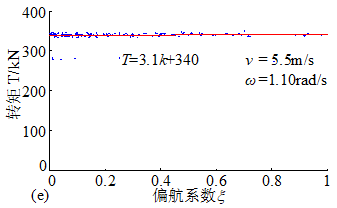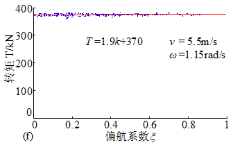

图5.9 偏航系数-风电机组转矩

## 5.2 基于行为特性的偏航系统启动对风控制优化

风电机组偏航系统结构如图5.1所示，其功能就是保持风轮迎风面与风向一致，以便从风中获取最多的能量，同时尽可能在风向随机变化中减少偏航系统启动次数，降低风电机组运行时偏航系统故障率。应用SCADA系统记录的风电机组历史运行数据，首先，分析中国南方某山地风电场的风资源特性和其中24台2MW直驱式风电机组的偏航行为特性；然后，在分析偏航系统运行相关数据的基础上，提出在额定风速以下风速区域采用优化的风速分段偏航启动对风控制策略；最后，SCADA数据仿真实验结果表明，优化后的偏航启动对风控制策略可以在发电量无明显降低的前提下大幅减少偏航次数，有望提高风电场的综合经济效益\[18\]。

### 5.2.1 山地风场风电机组偏航行为分析

> 1\. 风资源特性分析

使用风向玫瑰图描述风电场的风向分布特征。利用SCADA系统以10分钟时间分辨率记录的1号风电机组数据绘制了风电场风向玫瑰图，如图5.10所示。该组风向玫瑰图使用16个方位来描述风向，其中N、E、S、W分别代表正北，正东、正南和正西。由图可知，该风电场春季出现次数最多的风向为WNW，其次是SW；夏季出现次数最多的风向与春季相同，但频率更大，而SW的频率有所减小；秋季和夏季的风向分布情况基本类似；冬季风向与以上三个季节相比发生了较大的变化，出现次数最多的风向变为了SW，此外，WNW和SE两个风向的出现次数也较多。

以SCADA系统以时间分辨率1秒记录的数据为基础，依据IEC61400-1-2019标准计算湍流强度。由于风速大于额定风速11.0m/s时样本量不够大，缺乏统计意义，因而选择风速低于额定风速的阶段进行计算，图5.11给出了风速与湍流强度之间的关系。由图可知，当风电场风速小于3m/s时，湍流强度随着风速的增加由0.88快速下降到0.40；风速位于区间（3.0m/s,8.7m/s）时，湍流强度随着风速的增加由0.40缓慢下降到0.22；风速位于区间（8.7m/s,11.0 m/s）时，湍流强度随着风速的增加而有所回升，最终湍流强度不再随着风速的增强而改变，稳定在0.31左右。不同的风速区间湍流强度差别明显。

> 2\. 偏航系统动作次数分析

利用SCADA系统以时间分辨率10分钟记录全部机组的数据统计风电场各风电机组的日偏航次数，如图5.12所示。由图中可以看出，偏航次数最少的风电机组平均日偏航次数为188次/天，偏航次数最多的风电机组平均日偏航次数为633次/天。各风电机组日偏航次数差异明显，风电场各风电机组日偏航次数平均约400次/天。山地风电场由于地形和风况更为复杂，偏航十分频繁。

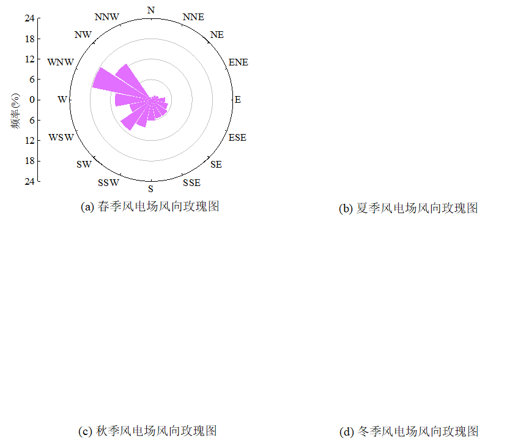

图5.10 风电场风向玫瑰图

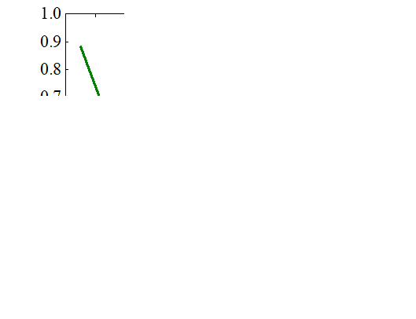

图5.11 风速与湍流强度的关系曲线

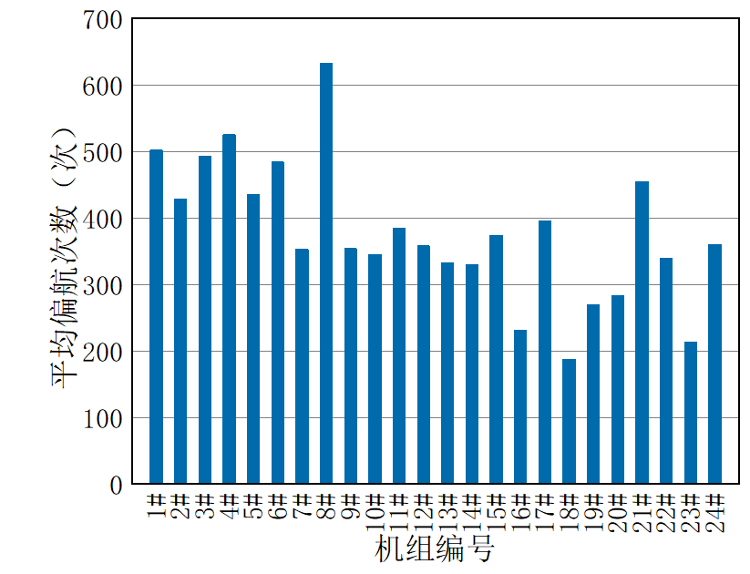

图5.12 风电机组日偏航运行次数统计

> 3\. 风电机组输出特性分析

风电机组偏航误差角与输出功率之间存在复杂的多对多关系，直接分析多有不便，有必要选择一种单值化数据处理方法来揭示它们之间的相互影响。分箱方法是风电机组数据挖掘、性能评估中常用的一种单值化处理方法，其有效性已被大量研究证实。

获取SCADA系统以时间分辨率10分钟记录1号机组的数据，使用分箱方法计算风电机组在不同偏航误差角*δ*下的输出功率*P*，如图5.13所示。当风速小于切入风速3.0m/s时风电机组处于停机状态，风速大于额定风速11.0m/s时样本量不够大，缺乏统计学意义。因此，图中仅计算了风速位于3~11m/s范围时不同偏航误差角下的输出功率。图5.13(a)给出了整个风速分析区间偏航误差角对输出功率的影响曲线。由图可知，当风速位于区间\[3.0m/s, 6.0m/s\]与区间\[8.0m/s, 11.0m/s\]时，相同风速输入，风电机组偏航误差角在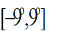范围内时输出功率之间差异小，最大差值42kW，最小差值0.4kW。当风速位于区间\[6.0m/s, 8.0m/s\]时，相同风速输入，偏航误差角在此范围内时输出功率之间差异更大一些，最大差值132kW，最小差值26kW。为便于展示差别，图5.13(b)单独给出了其中包含不同偏航误差角下输出功率相差较大的风速段\[6.0m/s, 8.0m/s\]偏航误差角对输出功率的影响曲线。不同风速区间风电机组偏航误差角对输出功率的影响有明显差别。从图可见，不同的风速区间内偏航误差角对输出功率的影响并不一致。这是因为虽然理论上在相同的风速下偏航误差角越小风电机组的输出功率将越大，但是，现实中风向是一个动态变化的三维量，风电场通常采用的风向测量装置风向标只能获取水平面内的二维风向，且响应速度无法完整的反应风向动态变化过程，并且不同风速区间风资源具有不同的三维动态特性。

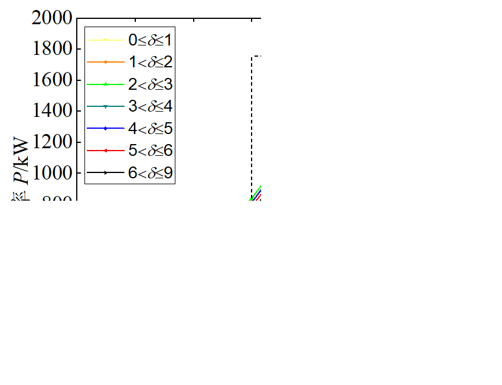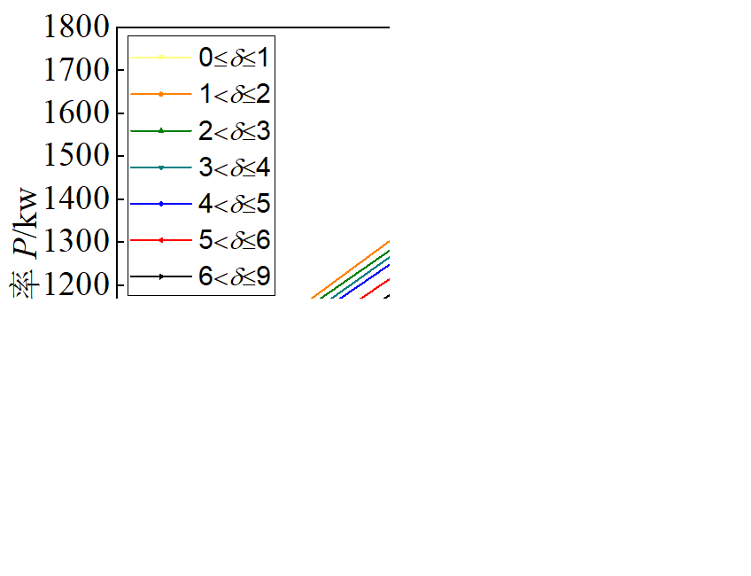

\(a\) 风速区间\[3m/s,11m/s\] (b) 风速区间 \[6m/s, 9m/s\]

图5.13 不同风速下偏航误差角$`\delta`$与功率*P*的关系

### 5.2.2 偏航系统控制策略优化

由上分析可知，目标山地风电场频繁偏航的问题较为突出，且不同风电机组个体的偏航次数差异明显。这说明该风电场目前应用的偏航启动对风控制策略适用性较差，有必要对该风电场偏航启动对风控制策略进行优化；而且，不同风速区间的湍流强度和风电机组偏航误差角对输出功率的影响存在差异，适宜采用风速分段的偏航启动对风控制策略。因此，首先根据湍流强度特性和风电机组输出特性对低于额定风速的风速区间进行划分，然后以发电量最大化和偏航次数最小化为目标，采用NSGA-II算法依据SCADA历史数据寻找各风速子区间内的最优控制参数。

> 1\. 风速子区间划分

目标风电场风电机组运行时风速主要集中在风速区间\[3.0m/s,11.0m/s\]，这也是上节中湍流强度特性和风电机组输出特性的分析风速范围。因此，仍继续选择风速区间\[3.0m/s,11.0m/s\]进行分段。根据不同风速区间湍流强度和风电机组偏航误差角对输出功率影响的差异划分了以下3个风速子区间：风速区间\[3.0m/s, 6.0m/s\]，湍流强度较大，且同一风速下偏航误差角对风电机组输出功率影响较小；风速区间\[6.0m/s, 8.0m/s\]，湍流强度较小，且同一风速下偏航误差角对输出功率影响较大；风速区间\[8.0m/s, 11.0m/s\]，与区间\[6.0m/s, 8.0m/s\]相比，湍流强度整体小幅增大，且同一风速下偏航误差角对输出功率影响较小。

偏航启动控制参数有2个：允许偏航误差角和延迟时间阈值。因此，优化参数可以表示为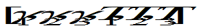，其中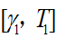为第1风速子区间的控制参数，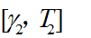为第2风速子区间的控制参数，为第3风速子区间的控制参数。在设计变量约束范围时，考虑到山地风电场地形复杂、风电机组所在位置处风向变化跨度大，变量的搜索范围均设置为\[0°, 60°\]，变量的搜索范围均设置为\[0s, 360s\]。

> 2\. 优化目标函数

偏航启动控制参数优化的目的是为每个风速子区间寻找最优的控制参数，使风电机组在保证发电量的前提下不会造成频繁偏航，从而提高风电场的综合经济效益。这里，以发电量最大化和偏航次数最小化作为优化目标，并建立了相应的目标函数。

1）偏航次数

偏航次数计算公式如下：

 (5.9)

式中，表示监测数据样本中满足偏航启动条件且当前状态为非偏航时间点的样本个数。

2）发电量

发电量计算公式如下：

 (5.10)

当风速小于切入风速3m/s时，风电机组处于停机状态，功率为0。当风速大于额定风速11m/s时，机组进入恒功率区，偏航功率为2000kW的额定功率。因此，只需在切入风速到额定风速之间建立偏航功率计算模型。

首先，依据风电机组动量理论得到风电机组功率计算方法：

 (5.11)

风电机组实际运行中存在着风剪切效应和塔影效应，SCADA系统记录的风速数据为轮毂高度处的风速，其不能代表整个风轮面的风速，因而将上式化为关于风轮转速的函数。如式所示：

 (5.12)

当风速低于额定风速时，为了捕获最大风能，风能利用系数恒定在最大值，叶尖速比保持在最佳叶尖速比，引入系数*k*：

 (5.13)

式（5.12）功率计算公式变为

 (5.14)

考虑到风电机组实际运行中数据测量误差和发电机转换效率等因素，功率模型需要加上额外的功率补偿，变为

 （5.15）

式（5.15）中参数*b*需要依据风电场的具体情况取值，式（5.15）中的参数*k*虽然可进行理论计算，但是在实际风电场中，计算*k*所需的参数很难精确测定。

这里，采用最小二乘法对偏航功率模型中参数*k*、*b*进行计算。考虑到参数*k*是影响功率模型计算精度的重要因素，利用SCADA系统中五个月以时间分辨率1s记录的数据，分别识别了不同风速下的*k*值，如图5.14所示。由图可知，虽然全目标风速段内*k*值大小差别明显，但在风速区间 \[3.0m/s, 7.0m/s)和风速区间 \[7.0m/s, 11.0m/s)内*k*值较为接近。因此，将风速划分为\[3.0m/s, 7.0m/s)和\[7.0m/s, 11.0m/s)2个子区间，并在每个区间对*k*和*b*分别进行辨识。额定风速以下风速区域的偏航功率模型如下：

 （5.16）

式中，*k*1、*k*2、*b*1、*b*2为常数。

图5.14 不同风速下的*k*值分布

> 3\. 多目标优化算法

NSGA-II是一种改进的遗传算法，可以同时优化多个目标。该算法使用快速非支配排序算子来降低计算复杂度，使用拥挤算子和比较算子来确保帕累托（Pareto）解集的均匀分布。与其他方法相比，NSGA-II收敛速度快，性能优越，已在许多领域得到应用。此处选择采用NSGA-II算法对各风速子区间的控制参数进行了优化，NSGA-II算法流程如图5.15所示。以SCADA系统某一天内以时间分辨率1s记录的数据为基础，首先，种群初始化生成初始父代种群，根据目标函数计算种群中所有个体的发电量和偏航次数；然后，按照目标函数值对个体进行快速非支配排序，再通过遗传算法的选择、交叉和变异3个基本操作产生第一代子代种群，同时计算该种群中每个个体的发电量和偏航次数；接着，将父代种群和子代种群合并，在进行排序和拥挤度计算后利用选择算子产生新的父代种群；最后，根据基本的遗传操作继续生成新的子代种群，并重复上述步骤，直至进化达到最大代数后停止。

图5.15 NSGA-II 算法流程图

> 4\. TOPSIS算法

利用NSGA-II算法求解多目标优化问题时，可以得到具有最优解集的帕累托前沿，即非支配解；然后根据评估对象与理想目标的接近程度对有限数量的评估对象进行排序，从帕累托前沿中选择一个单一的最优解。逼近理想解排序法(technique for order preference by similarity to ideal solution, TOPSIS)又称优劣解距离法，是一种常用的综合评价方法，其排序解决方案的规则是将这些方案与最佳方案和最差方案进行比较，如果其中一个方案最接近最优解，也远离最劣解，那么它就是所有方案中的最佳方案。TOPSIS方法的主要步骤如下：

（1）构建Pareto前沿解矩阵：

 ,  （5.17）

式中，表示第个方案的发电量；表示第方案的偏航次数；为方案的个数。

（2）对中的极小型指标偏航次数进行正向化处理，得到矩阵：

,  （5.18）

（3）对正向化矩阵进行标准化处理，获得标准化矩阵：

 （5.19）

（4）计算每个方案到正理想解和负理想解的距离，定义正理想解和负理想解为

 （5.20）

 （5.21）

则第个方案与正理想解的距离和与负理想解的距离分别为

 （5.22）

 （5.23）

式中，和分别为评价过程中考虑风电机组发电量和偏航次数这两个指标的权重，应根据风电机组实际的运行状况取值，且。

（5）计算每个方案的得分：

 （5.24）

（6）根据得分进行排名，选择得分最高的方案为最终优化方案。

> 5\. 确定控制参数最优解流程

偏航对风控制参数优化流程如图5.16所示，主要包括如下步骤：步骤1，分析风的湍流特性和风电机组的输出特性，根据不同风速区间湍流强度和风电机组偏航误差角对输出功率影响的差异性将额定风速以下风速区域划分了多个风速子区间。步骤2，首先确定每个风速子区间的优化变量；其次根据风电场实际情况对每个变量的上、下限进行约束；接着以发电量最大化和偏航次数最小化作为优化目标建立相应的目标函数；并选择具有良好优化性能的NSGA-II算法进行优化。步骤3，依据TOPSIS方法计算每个方案的得分，选择得分最高的方案相对应的那组控制参数作为最优控制参数。

图5.16 偏航系统启动对风控制策略优化流程图

### 5.2.3 数据仿真实验与结果分析

> 1\. 数据仿真方法

首先，以SCADA系统以时间分辨率1s记录的风向数据为基础，采用NSGA-II算法对偏航启动控制参数进行了优化。优化参数为，其中、、分别为第1、第2和第3风速子区间的控制参数。优化过程中，优化目标中偏航运行次数、发电量、偏航误差角由下式分别进行更新：

 （5.25）

式中，是时刻的风向值；是时刻的风向值；是时刻偏航误差角；是满足偏航启动条件时间点的偏航误差角；为偏航速度，这里取值为0.6(°)/s。

在使用NSGA-II算法过程中经过大量尝试发现，遗传代数的最大值设定为 30时，优化过程的收敛速度很快。在优化算法执行过程中，使用了随机抽取的正常状态下一天SCADA系统以时间分辨率1s记录的数据。在获得帕累托前沿后，采用TOPSIS方法确定最终优化结果时，根据研究对象的具体情况，对两个优化目标设置权重分别为：发电量权重取值0.7，偏航次数权重取值0.3。为进行优化方案的应用效果评价，获得优化参数后，需仿真计算风电机组的偏航次数、发电量，并与原有偏航启动控制策略进行对比。 上述过程均是在个人计算机（操作系统：Window10, 16GB RAM, iIntel i7-8700 u）上采用MATLAB 2020b软件平台实现的。

> 2\. 超参数调优

NSGA-II 算法的超参数会影响其性能，因此有必要在使用 NSGA-II 算法之前找到合理的超参数，全因子实验是确定算法超参数的一种非常耗时的方法。这里使用了田口方法(Taguchi Methods)，这是一种在多种技术中优化试验的系统方法。该方法使用正交阵列来组织测试结果，从而减少所需的测试次数。此外，田口还确定了每个超参数水平对算法性能主要影响的相对重要性\[19\]。需要将目标函数的值变化为扩展的另一个值，这种变化就是信噪比（SN）。其中三个比率被认为是标准比率，得到了广泛应用。采用“数值越大越好”的方式计算信噪比，即信噪比最高的超参数代表性能越好。信噪比表示为

 （5.26）

式中，为每组超参数下优化结果中综合得分最高方案的得分。

由于过多的优化变量和数据样本也会导致测试过程过于耗时，不易实施，为进一步缩短试验时间，在田口方法的基础上，利用 SCADA 系统记录的时间分辨率为 1s 的 70000组数据对某一风速子区间的偏航系统启动控制参数进行优化。算法超参数及其选取值见表5.1，实验规格见表5.2。根据测试结果，首先依据式（5.26）计算每组参数测试结果的SN，然后计算每个超参数在不同水平下的SN平均值，如[图5.1](file:///E:\\2023风电SCADA专著编写\\风电SCADA数据分析与智能建模%20-初稿0505王宪改.docx#t5)7所示。可以看出，种群大小第一水平的SN平均值大于其他两个水平，而交叉系数和变异系数第二水平的SN平均值大于其他两个水平。因此，算法的超参数（种群大小、交叉系数和变异系数）分别设置为50、0.8和0.2（这也对应表5.2中的第二组超参数）

表5.1 NSGA-II超参数水平

<table>
<colgroup>
<col style="width: 31%" />
<col style="width: 24%" />
<col style="width: 24%" />
<col style="width: 20%" />
</colgroup>
<thead>
<tr>
<th rowspan="2" style="text-align: center;">超参数</th>
<th colspan="3" style="text-align: center;">水平</th>
</tr>
<tr>
<th style="text-align: center;">1</th>
<th style="text-align: center;">2</th>
<th style="text-align: center;">3</th>
</tr>
</thead>
<tbody>
<tr>
<td style="text-align: center;">种群大小</td>
<td style="text-align: center;">50</td>
<td style="text-align: center;">100</td>
<td style="text-align: center;">150</td>
</tr>
<tr>
<td style="text-align: center;">交叉系数</td>
<td style="text-align: center;">0.7</td>
<td style="text-align: center;">0.8</td>
<td style="text-align: center;">0.9</td>
</tr>
<tr>
<td style="text-align: center;">变异系数</td>
<td style="text-align: center;">0.1</td>
<td style="text-align: center;">0.2</td>
<td style="text-align: center;">0.3</td>
</tr>
</tbody>
</table>

为了评估NSGA-II 算法的性能，利用Hypervolume指标对解集的综合质量进行评价。Hypervolume指标的计算过程如下：

利用线性归一化方法将构建的Pareto前沿解矩阵进行归一化得到矩阵：

 （5.27）

其中：

 （5.28）

 （5.29）

Hypervolume指标计算公式为\[20\]：

 （5.30）

式中，为矩阵中第个方案的目标函数值与参考点构成的面积。HV越大，解集的收敛性和分布性越好。选取的参考点不同，将会得到不同的HV计算结果。当帕累托前沿真值未知时，通常可选择（1, 1）作为参考点。

表5.2 实验设置

| 实验编号 | 种群大小 | 交叉系数 | 变异系数 |
|:--------:|:--------:|:--------:|:--------:|
|    1     |    1     |    1     |    1     |
|    2     |    1     |    2     |    2     |
|    3     |    1     |    3     |    3     |
|    4     |    2     |    1     |    2     |
|    5     |    2     |    2     |    3     |
|    6     |    2     |    3     |    1     |
|    7     |    3     |    1     |    3     |
|    8     |    3     |    2     |    1     |
|    9     |    3     |    3     |    2     |

图5.17 NSGA-II超参数在不同水平上的SN平均值

此外，此处还使用了Spacing指标评价了解集的均匀性，Spacing指标的计算公式为\[20\]

 （5.31）

式中， 是第个方案与其他方案目标函数值绝对差值之和的最小值：

 （5.32）

式中，是解集归一化矩阵 F 中第 *i* 个方案的第 *m* 个目标函数值。*S*越小，解集的均匀性越好。

使用表5.2中方案2的实验设置，解集的HV和*S*分别为0.8704、0.03182。可以看出，该方法优化得到的最优解集具有良好的收敛性和均匀性。

> 3\. 控制参数优化结果

优化完成后获得的帕累托前沿如图5.18所示，这里提出的风速分段偏航启动对风策略中各风速子区间的控制参数优化结果如表5.3所示，表中还给出了原始偏航控制策略的控制参数。相对于原控制参数设置，偏航控制参数优化结果是：在低风速\[3.0m/s,6.0m/s\]段，

图5.18 多目标优化的Pareto前沿

加大偏航允许误差角，超常规加大延迟时间；在中风速\[6.0m/s, 8.0m/s\]段，减小偏航允许误差角，加大延迟时间；在高风速\[8.0m/s, 11.0m/s\]段，保持偏航允许误差角不变，大大加长延迟时间。这也说明原偏航允许误差角适合于高风速段，而对于低风速段偏小，对于中风速段偏大；原延迟时间严重偏短，风速由高到低，延迟时间偏短严重程度越高。

表5.3 两种策略的控制参数

<table>
<colgroup>
<col style="width: 26%" />
<col style="width: 24%" />
<col style="width: 26%" />
<col style="width: 22%" />
</colgroup>
<thead>
<tr>
<th style="text-align: center;">控制方案</th>
<th style="text-align: center;">风速范围</th>
<th style="text-align: center;">偏航允许误差角/(°)</th>
<th style="text-align: center;">延迟时间/s</th>
</tr>
</thead>
<tbody>
<tr>
<td style="text-align: center;">优化前</td>
<td style="text-align: center;">[3m/s, 11m/s]</td>
<td style="text-align: center;">15</td>
<td style="text-align: center;">35</td>
</tr>
<tr>
<td rowspan="3" style="text-align: center;">优化后</td>
<td style="text-align: center;">[3m/s, 6m/s]</td>
<td style="text-align: center;">23</td>
<td style="text-align: center;">259</td>
</tr>
<tr>
<td style="text-align: center;">[6m/s, 8m/s]</td>
<td style="text-align: center;">9</td>
<td style="text-align: center;">71</td>
</tr>
<tr>
<td style="text-align: center;">[8m/s, 11m/s]</td>
<td style="text-align: center;">15</td>
<td style="text-align: center;">193</td>
</tr>
</tbody>
</table>

> 4\. 优化效果评价

以SCADA系统中四个月以时间分辨率1s记录的数据为基础，依次选取4天的时间序列数据来仿真计算偏航启动控制参数优化前后的偏航次数和输出功率。图5.19给出了4个时间段的湍流风速，图5.20和图5.21给出了控制策略优化前后的偏航误差角对比图和偏航次数统计图。由图可知，在低于额定风速的风速区域，采用优化的偏航启动对风控制策略，偏航次数明显减小，风速位于区间\[3.0m/s, 6.0m/s\]的风电机组偏航误差角整体增大，风速位于6m/s以上的偏航误差角无明显变化。偏航误差角的增大会导致风电机组输出功率降低，从而影响发电量。然而，风速越低偏航误差角大小对发电量的影响越小。因此，偏航启动对风控制策略优化后对发电量的影响较小。利用SCADA系统中五个月以时间分辨率1s记录的数据仿真计算偏航启动控制参数优化前后的偏航次数和发电量，计算结果如表5.4所示。由表中可知，偏航启动对风控制策略优化后，偏航次数大幅下降，降幅高达82.9%，发电量降幅仅为3.5%。

图5.19 湍流风速

图5.20 两种策略的偏航误差角

图5.21 两种策略的偏航运行次数统计

表5.4 两种策略的运行结果长时间尺度比较

<table>
<colgroup>
<col style="width: 25%" />
<col style="width: 31%" />
<col style="width: 43%" />
</colgroup>
<thead>
<tr>
<th style="text-align: center;">控制方案</th>
<th style="text-align: center;">
发电量

/(Mw·h)
</th>
<th style="text-align: center;">偏航次数</th>
</tr>
</thead>
<tbody>
<tr>
<td style="text-align: center;">优化前</td>
<td style="text-align: center;">88.72</td>
<td style="text-align: center;">86048</td>
</tr>
<tr>
<td style="text-align: center;">优化后</td>
<td style="text-align: center;">85.57</td>
<td style="text-align: center;">14726</td>
</tr>
</tbody>
</table>

由于山地风场地形复杂，风资源状态较平地风场更为复杂，因偏航系统频繁动作导致的风电机组故障频频发生，造成了风电机组全生命周期内经济效益的大幅降低。这里提出的风速分段偏航启动对风控制优化策略，以牺牲小部分发电量为代价大幅降低偏航次数，从而确保偏航系统在整个生命周期内可以继续运行更长时间。对于因频繁偏航严重影响机组可靠运行或偏航系统已经带病运行的风电机组，这种优化策略是一个代替原始偏航启动对风控制策略的更好方案，可以实现偏航系统的容错控制，有望提升风电机组的综合经济效益。

## 5.3 计及偏航效应的机舱振动特性分析

风电机组通过叶片将吸收的风能转换为机械能，发电机负责将机械能转换为电能。同时作用在叶片上的风载荷通过轮毂、发电机传递至机舱，并最终作用在塔架上，从而导致各结构件的振动。SCADA系统记录了机舱的前后方向振动、侧向振动。对于某2MW直驱式风电机组，风轮直径96m，轮毂高度80m，利用ANSYS软件进行模态分析，*x*方向为前后方向，*y*方向也称为侧向，得到塔架1~5阶模态频率为0.47Hz、0.47Hz、4.68Hz、4.68Hz、8.50 Hz相应振型。对于某个确定的风电机组来说，影响其振动特性主要因素是风速、风向、转速、变桨距和偏航等。振动行为对风电机组运行安全至关重要，一般而言，一旦出现振动异常（如机舱振动加速度大于1.5g）就要立即停机。

在分析机舱振动时，除了风速*v*外、风轮转速*ω*、偏航、风速变化率、转速变化率、桨距角及其变化速率、风向及其变化率等因素均可能对其振动产生影响。在SCADA系统中，检测的风电机组运行参数只有风速、风向、风轮转速、桨距角等，并且只考虑了风电机组转速在大于7 r/min的情况。为了获得这些状态参数变化速率，定义

 (5.33)

### 5.3.1 风速对机舱振动影响

作用在风轮上的气流是风轮旋转的动力，也是产生气动载荷以及决定风轮转速大小的决定因素，作用在叶素上的载荷与风速平方相关。图5.22为SCADA系统测得的风电机组机舱上风速与其前后方向以及侧向振动之间关系图。由于风的时变性，风电机组承受的载荷也是时刻变化的。

> \(a\) 风速与机舱前后方向振动关系 (b) 风速与机舱侧向振动关系

图5.22 风速与机舱前后方向及侧向振动关系

从图5.22(a)中可看出，对应于某一点风速值，机舱振动加速度值在一定范围内变化；图中振动加速度最大值约为-0.64m/s2(符号代表振动方向)，最大值出现在风速2.60m/s时，此时对应的风轮转速为7~8r/min，风轮转动频率为0.35~0.40Hz，与塔架一阶(二阶)固有频率接近。不难看出，低风速段(小于6m/s)出现的机舱振动加速度变化范围整体上大于高风速段的机舱振动加速度，如4m/s时机舱振动加速度变化范围为\[-0.45m/s2, 0.45m/s2\]，而10 m/s时机舱振动加速度变化范围为\[-0.25m/s2, 0.25m/s2\]。

对比图5.22(a)和(b)可知，在风电机组前后方向和侧向具有相似的机舱振动加速度范围变化规律，但图5.22(a)中振动加速度的最大值要比图5.22(b)中的大，这是因为在相同风速条件下，前后方向的气动载荷一般要大于侧向气动载荷。

图5.23所示为风速变化率与机舱振动关系，图5.23(a)为风速变化率与前后方向振动关系，图5.23(b)为风速变化率与侧向振动关系。不难看出，测试到的振动最大值出现在风速变化率为零附近，这说明对于所测振动过程，风速变化率并不是影响机舱振动的主导因素。将测得的机舱前后方向和侧向振动加速度看成两个随机变量，用()()表示，采用Pearson(皮尔逊)相关性计算方法可得前后方向和侧向机舱振动加速度线性相关系数为

> \(a\) 风速变化率与机舱前后方向振动关系 (b) 风速变化率与机舱侧向振动关系

图5.23 风速变化率与机舱前后方向及侧向振动关系

 (5.34)

式中，；。

上述结果表明机舱两个方向振动并不相关。为了进一步研究风速与振动之间的关系，对不同风速条件下的振动分布特征进行分析。该风电机组设计的额定风速为11m/s，将风速划分为3段，分别为\[4m/s, 9m/s\]，\[9m/s, 12m/s\]和\[12m/s, +)。采用核密度估计方法，选择Gaussian核函数，经过试算确定窗宽为20，得到不同风速条件下机舱振动加速度核密度估计图(图5.24a)和分布函数图(图5.24b)。

> \(a\) 核密度估计图 (b) 分布函数图

图5.24 不同风速条件下机舱振动加速度核密度估计和分布函数

从图5.24可见，在相同风速条件下，机舱前后、侧向振动加速度密度曲线和分布函数曲线较一致，不同风速段测得的密度和分布函数不同，在振动加速度为零处具有最大概率密度值。

### 5.3.2 风轮转速对机舱振动影响

由于目前大型风电机组多采用变速运行，在额定风速以下时，主要是通过调节发电机电磁转矩控制风轮转速以跟踪风速变化，实现最大限度风能捕获。在高于额定风速时，受到各部件物理性能的限制，需限制功率输出，这既可通过控制发电机转矩调节转速来改变风轮的叶尖速比实现，也可调整桨距角改变风轮气动力矩实现。对于直驱式风电机组，风轮与发电机之间无增速齿轮箱，直接相连，因此风轮转速与发电机转速可视为一致。

图5.25为SCADA系统测得的风电机组风轮转速与机舱前后方向和侧向振动关系。从图中可看出，在风轮转速较低时\[7r/min, 9r/min\]，由于风轮运转频率与塔架一阶(二阶)固有频率接近，机舱振动加速度变化幅度较大。在前后方向机舱最大振动范围为-0.6~0.6m/s2，在侧向机舱最大振动范围为-0.5~0.5m/s2，并且机舱前后方向振动加速度范围略大于侧向振动加速度。这表明在风轮转速与塔架固有频率接近时测得的机舱振动加速度最大。

图5.26为风轮转速变化率与机舱振动关系。图5.26(a)为风轮转速变化率与机舱前后方向振动关系，图5.26(b)为风轮转速变化率与机舱侧向振动关系。在正常工作情况下，风电机组风轮转速变化率较小，只有在起动或停机时才会出现大的转速变化率。因此，图5.26中除极少数点外，绝大部分的横坐标都在\[-0.1rad/s2, 0.1rad/s2\]范围内，而且不管是前后方向还是侧向振动，其最大值均在转速变化率为零时出现。

> \(a\) 风轮转速与机舱前后方向振动关系 (b) 风轮转速与机舱侧向振动关系

图5.25 风轮转速与机舱前后方向及侧向振动关系

> \(a\) 风轮转速变化率与机舱前后方向振动关系 (b) 风轮转速变化率与机舱侧向振动关系

图5.26 风轮转速变化率与机舱前后方向及侧向振动关系

将转速划分为\[7r/min, 8r/min\]和\[8r/min, +)两个阶段分析其振动分布特征。选择Gaussian核函数，窗宽设为20，得到不同转速条件下机舱振动加速度核密度估计图(图5.27a)和分布函数图(图5.27b)。与图5.24中曲线分布类似，在振动加速度为零处具有最大概率密度，不同转速条件下振动分布具有一定差异。

> \(a\) 核密度估计图 (b) 分布函数图

图5.27 不同转速条件下机舱振动加速度核密度估计和分布函数

### 5.3.3 变桨偏航对机舱振动影响

变桨距控制是现代大型风电机组控制风能吸收的基本方法，通过变桨距机构动作调节桨距角，在额定风速以上可有效调节风电机组吸收功率。然而，叶片桨距角的变化也会导致作用在叶片上的载荷变化。图5.28为桨距角与机舱振动加速度关系，测得的振动加速度最大值出现在桨距角为0.25°附近，此时风速大多小于额定风速，转速分布在较低范围内，相当部分与塔架固有频率接近。

> \(a\) 桨距角与机舱前后方向振动关系 (b) 桨距角与机舱侧向振动关系

图5.28 桨距角与机舱前后方向及侧向振动关系

从图5.29所示的桨距角变化率与机舱振动关系可看出，振动加速度最大值并不是出现桨距角变化率最大时，而是出现在零值附近。这是因为尽管变桨距虽然会带来机舱振动，但振动值不会太大。

> \(a\) 桨距角变化率与机舱前后方向振动关系 (b) 桨距角变化率与机舱侧向振动关系

图5.29 桨距角变化率与机舱振动关系

由于风向的时变性，气流并非总是正对风轮，大多数情况下流过风轮的气流是非对称的。实际运行过程中，通常计算一定时间内平均风向，如果风向与风轮法向之间角度差距太大(如20°)，则启动偏航电机调整风轮角度，使之为正对气流。在这一过程中，偏航力矩和气动载荷同时作用在风电机组上必然影响机舱振动状态。图5.30为一段时间内由风电机组机舱气象站测得的风速时变曲线，采样时间为1s；同时给出了该时段内偏航电机动作次数，在近50h的测试时间内，出现的偏航次数近千次。

图5.30 风速时变曲线和偏航次数

图5.31给出了4组风电机组在偏航与非偏航状态下风速与机舱前后方向振动加速度曲线。从图可见，偏航过程中振动加速度的变化较复杂，可大于非偏航状态下相同风速时的振动加速度，也可小于非偏航状态下相同风速时的振动加速度，这还取决于风电机组其他运行状态参数，如转速、桨距角等因素的综合作用。

图5.31 偏航与非偏航状态下振动特性

### 5.3.4 机舱振动聚类分析

虽然前文分析了机舱振动与风速、风轮转速、变桨距和偏航等参数的关系，但风电机组在实际运行时，这些参数对机舱振动的影响并非独立存在，而是综合作用。因此，有必要借助聚类分析方法研究不同运行状态下机舱振动特征。考虑到聚类分析时计算量较大，因而将数据采样频率由1Hz改为0.1Hz。

采用离差平方和法(Ward)进行系统聚类分析，首先将表5.5中各组数据用向量,,表示，第个向量，分别表示风轮转速、风轮转速变化率、气象站风速变化率等影响因素。从表5.5可看出，各变量取值范围相差较大，为了避免绝对值大的变量削弱绝对值小的变量的作用，采用标准化变换对原始数据进行无量纲处理：

 (5.35)

式中，；；*n*=17600；1,2,…,9。

聚类时先将每组向量各自作为一类，利用Ward方法计算类与类之间的距离，将距离最近的两类合并为一个新类，并计算新类与其他类之间的距离。Ward方法应用了方差分析的思想，同一个类内的离差平方和小，类间离差平方和大。在统计学中，一般用*G*表示类，用不同的下标表示不同的类；在Ward方法中，若(含个元素量)与(含个元素量)聚成新类，则反映类内元素分散程度的类内离差平方和分别为

 (5.36)

式中，重心；；。

与的平方距离为

 (5.37)

如果与相距较近，则合并后所增加的离差平方和较小，反之则较大。

表5.5 状态参数聚类结果

<table>
<colgroup>
<col style="width: 9%" />
<col style="width: 11%" />
<col style="width: 12%" />
<col style="width: 9%" />
<col style="width: 8%" />
<col style="width: 12%" />
<col style="width: 12%" />
<col style="width: 11%" />
<col style="width: 11%" />
</colgroup>
<thead>
<tr>
<th style="text-align: center;">
类别/

数量
</th>
<th style="text-align: center;">
风轮

转速

/(r/min)
</th>
<th style="text-align: center;">
转速变化率

/(10-2rad/s2)
</th>
<th style="text-align: center;">
桨距角/

/(°)
</th>
<th style="text-align: center;">
桨距角

变化率

/((°)/s)
</th>
<th style="text-align: center;">
5秒偏航

对风平均值/(°)
</th>
<th style="text-align: center;">
5秒偏航

对风变化率/((°)/s)
</th>
<th style="text-align: center;">
机舱

气象站

风速/(m/s)
</th>
<th style="text-align: center;">
风速

变化率

/(m/s2)
</th>
</tr>
</thead>
<tbody>
<tr>
<td style="text-align: center;">1/849</td>
<td style="text-align: center;">7.0~13.8</td>
<td style="text-align: center;">-1.9~1.4</td>
<td style="text-align: center;">0.1~0.3</td>
<td style="text-align: center;">0</td>
<td style="text-align: center;">-27.5~53.5</td>
<td style="text-align: center;">0.7~20.8</td>
<td style="text-align: center;">0.6~6.6</td>
<td style="text-align: center;">-0.8~0.5</td>
</tr>
<tr>
<td style="text-align: center;">2/2917</td>
<td style="text-align: center;">7.0~12.4</td>
<td style="text-align: center;">-1.9~1.8</td>
<td style="text-align: center;">0.1~0.3</td>
<td style="text-align: center;">0</td>
<td style="text-align: center;">-13.9~107.7</td>
<td style="text-align: center;">-13.7~10.1</td>
<td style="text-align: center;">0.5~6.7</td>
<td style="text-align: center;">-0.8~1.6</td>
</tr>
<tr>
<td style="text-align: center;">3/775</td>
<td style="text-align: center;">7.0~14.4</td>
<td style="text-align: center;">-1.4~1.3</td>
<td style="text-align: center;">0.1~0.3</td>
<td style="text-align: center;">0</td>
<td style="text-align: center;">-54.2~15.1</td>
<td style="text-align: center;">-27.1~-1.4</td>
<td style="text-align: center;">0.6~6.9</td>
<td style="text-align: center;">-0.8~0.6</td>
</tr>
<tr>
<td style="text-align: center;">4/2847</td>
<td style="text-align: center;">7.0~10.6</td>
<td style="text-align: center;">-1.9~2.1</td>
<td style="text-align: center;">0.1~0.3</td>
<td style="text-align: center;">0</td>
<td style="text-align: center;">-80.1~9.9</td>
<td style="text-align: center;">-5.7~10.7</td>
<td style="text-align: center;">0.8~6.4</td>
<td style="text-align: center;">-0.9~0.8</td>
</tr>
<tr>
<td style="text-align: center;">5/1359</td>
<td style="text-align: center;">10.3~17.3</td>
<td style="text-align: center;">-2.4~3.2</td>
<td style="text-align: center;">0.1~2.2</td>
<td style="text-align: center;">-0.1~0.3</td>
<td style="text-align: center;">-25.1~23.7</td>
<td style="text-align: center;">-4.4~8.9</td>
<td style="text-align: center;">4.6~11</td>
<td style="text-align: center;">-2.1~0.2</td>
</tr>
<tr>
<td style="text-align: center;">6/2233</td>
<td style="text-align: center;">8.6~17.4</td>
<td style="text-align: center;">-3.0~2.9</td>
<td style="text-align: center;">0.0~3.4</td>
<td style="text-align: center;">-0.3~0.2</td>
<td style="text-align: center;">-28.6~23.4</td>
<td style="text-align: center;">-7.0~6.0</td>
<td style="text-align: center;">4.8~13.1</td>
<td style="text-align: center;">-1.3~3.3</td>
</tr>
<tr>
<td style="text-align: center;">7/6242</td>
<td style="text-align: center;">7.2~15.7</td>
<td style="text-align: center;">-2.1~2.5</td>
<td style="text-align: center;">0.1~0.3</td>
<td style="text-align: center;">0</td>
<td style="text-align: center;">-43.7~31.2</td>
<td style="text-align: center;">-7.5~7.2</td>
<td style="text-align: center;">3.3~8.4</td>
<td style="text-align: center;">-1.1~2.0</td>
</tr>
<tr>
<td style="text-align: center;">8/85</td>
<td style="text-align: center;">16.4~17.7</td>
<td style="text-align: center;">-2.8~3.4</td>
<td style="text-align: center;">0.4~8.4</td>
<td style="text-align: center;">0.2~1.6</td>
<td style="text-align: center;">-16~15.5</td>
<td style="text-align: center;">-5.7~3.4</td>
<td style="text-align: center;">8.2~13.5</td>
<td style="text-align: center;">-1.5~2.5</td>
</tr>
<tr>
<td style="text-align: center;">9/292</td>
<td style="text-align: center;">
15.9~17.7

7.7
</td>
<td style="text-align: center;">
-3.2~2.1

-0.6
</td>
<td style="text-align: center;">
0.4~7.8

4.7
</td>
<td style="text-align: center;">
-0.8~0.3

-0.8
</td>
<td style="text-align: center;">
-19.4~21.4

4.9
</td>
<td style="text-align: center;">
-4.9~6.1

-9.4
</td>
<td style="text-align: center;">
7.2~14

4.4
</td>
<td style="text-align: center;">
-3.2~3.0

-0.7
</td>
</tr>
<tr>
<td style="text-align: center;">10/1</td>
<td style="text-align: center;">13.4</td>
<td style="text-align: center;">1.4×10-2</td>
<td style="text-align: center;">0.2</td>
<td style="text-align: center;">0.2</td>
<td style="text-align: center;">10.2</td>
<td style="text-align: center;">10.20</td>
<td style="text-align: center;">6.2</td>
<td style="text-align: center;">6.2</td>
</tr>
</tbody>
</table>

表5.5为得到的状态参数聚类结果，共划分为10类。从表中可看出，风电机组运行过程中测得的多组参数按照相似程度较好地进行了归类。需要指出的是，第9类共有292组数据，除其中有一组转速为7.7r/min外，其余各组均在15.9~17.7r/min范围内变化。第10类只有一组参数，其中转速变化速率为1.4rad/s2，与实际情况不符合，应是数据出现异常所造成的。表5.6给出了对应于各类状态参数的机舱振动情况。

结合表5.5、表5.6可看出，1~4类振动范围要大于5~9类。与5~9类状态参数相比，1~4类具有风轮转速、转速变化率、风速及其变化率较小，偏航对风及其变化率较大等特点。虽然风轮转速变化率、风速变化率加大会加剧风电机组振动，但1~4类中转速较低，风轮运转频率与塔架一阶(二阶)固有频率接近的几率更大，由此对振动产生更大的影响。此外，1~4类中偏航对风变化率较大，风电机组动态气动载荷变化大，也有一定影响。在9类振动状态中，第7类占比最大，超过三分之一，也即最为常见；第2、4类占比次之，超过16%。图5.32为风电机组状态参数聚类结果，图中用表示状态参数类别。

表5.6 不同运行状态下机舱振动

| 类别 | *x*方向振动值/(m/s2) | *y*方向振动值/(m/s2) | 数量 | 占总数量百分比/% |
|:--:|:--:|:--:|:--:|:--:|
| 1 | -0.47~0.39 | -0.42~0.30 | 849 | 4.82 |
| 2 | -0.39~0.46 | -0.45~0.46 | 2917 | 16.54 |
| 3 | -0.32~0.45 | -0.34~0.30 | 775 | 4.40 |
| 4 | -0.42~0.41 | -0.32~0.36 | 2847 | 16.18 |
| 5 | -0.14~0.25 | -0.17~0.19 | 1359 | 7.72 |
| 6 | -0.19~0.32 | -0.20~0.25 | 2233 | 12.69 |
| 7 | -0.25~0.24 | -0.27~0.28 | 6242 | 35.47 |
| 8 | -0.14~0.21 | -0.16~0.17 | 85 | 0.48 |
| 9 | -0.21~0.31 | -0.17~0.26 | 293 | 1.66 |
| 10 | 0.07 | 0.04 | 1 | — |

图5.32 风电机组状态参数聚类结果

## 5.4 参考文献

1.  Dai L, Zhou Q, Zhang Y, et al. Analysis of wind turbine blades aeroelastic performance under yaw conditions\[J\]. Journal of Wind Engineering and Industrial Aerodynamics, 2017, 171: 273-287.

2.  Gebraad P, Thomas J J, Ning A, et al. Maximization of the annual energy production of wind power plants by optimization of layout and yaw‐based wake control\[J\]. Wind Energy, 2017, 20(1): 97-107.

3.  Girsang I P, Dhupia J S. Pitch controller for wind turbine load mitigation through consideration of yaw misalignment\[J\]. Mechatronics, 2015, 32: 44-58.

4.  Qiu Y X, Wang X D, Kang S, et al. Predictions of unsteady HAWT aerodynamics in yawing and pitching using the free vortex method\[J\]. Renewable Energy, 2014, 70: 93-106.

5.  Torabi A, Tarsaii E, Mashhadi S K M. Fuzzy controller used in yaw system of wind turbine noisy\[J\]. Journal of mathematics and computer science, 2014, 8: 105-112.

6.  Hoghooghi H, Chokani N, Abhari R S. A novel optimised nacelle to alleviate wind turbine unsteady loads\[J\]. Journal of Wind Engineering and Industrial Aerodynamics, 2021, 219: 104817.

7.  Ke S, Yu W, Wang T, et al. Aerodynamic performance and wind-induced effect of large-scale wind turbine system under yaw and wind-rain combination action\[J\]. Renewable Energy, 2019, 136: 235-253.

8.  Leite G N P, Araújo A M, Rosas P A C. Prognostic techniques applied to maintenance of wind turbines: A concise and specific review\[J\]. Renewable and Sustainable Energy Reviews, 2018, 81: 1917-1925.

9.  Liu Y, Liu S, Zhang L, et al. Optimization of the yaw control error of wind turbine\[J\]. Frontiers in Energy Research, 2021, 9: 626681.

10. 卢晓光, 岳红轩, 吴鹏, 等. 大型风机偏航状态力学分析及偏航控制策略研究\[J\]. 可再生能源, 2014, 32(7): 973-977.

11. Ma H, Ge M, Wu G, et al. Formulas of the optimized yaw angles for cooperative control of wind farms with aligned turbines to maximize the power production\[J\]. Applied Energy, 2021, 303: 117691.

12. Yang J, Fang L, Song D, et al. Review of control strategy of large horizontal-axis wind turbines yaw system. Wind Energy, 2021, 24: 97-115.

13. Zhang L, Yan Q. A method for yaw error alignment of wind turbine based on LiDAR\[J\]. IEEE Access , 2020, 8: 25052-25059.

14. Dai J, He T, Li M, et al. Performance study of multi-source driving yaw system for aiding yaw control of wind turbines\[J\]. Renewable Energy, 2021, 163: 154-171.

15. 戴巨川, 袁贤松, 刘德顺, 等. 基于SCADA系统的大型直驱式风电机组机舱振动分析\[J\]. 太阳能学报, 2015, 36(12): 2895-2905.

16. 高峰, 凌新梅, 刘强. 基于SCADA数据的风电机组偏航控制参数优化\[J\]. 太阳能学报. 2019, 40(6): 1739-1746.

17. Dai J, Yang X, Hu W, et al. Effect investigation of yaw on wind turbine performance based on SCADA data\[J\]. Energy, 2018, 149: 684-696.

18. Han J, Wang X, Yang X, et al. Yaw system restart strategy optimization of wind turbines in mountain wind farms based on operational data mining and multi-objective optimization\[J\]. Engineering Applications of Artiffcial Intelligence, 2023, 126: 107036.

19. Aghaie S, Karimi B. Location-allocation-routing for emergency shelters based on geographical information system (ArcGIS) by NSGA-II (case study: earthquake occurrence in Tehran (District-1). Socio-Economic Planning Sciences, 2022, 84, 101420

20. Zitzler E, Thiele L, Laumanns M, et al. Performance assessment of multiobjective optimizers: An analysis and review\[J\]. IEEE Transactions on evolutionary computation, 2003, 7(2): 117-132.
