# 第6章 风电机组运行状态SCADA数据分析

风电机组运行状态直接影响风电场发电量和维护成本，因而风电机组状态识别、故障诊断与预警一直是风电机组领域研究重点。特别是，随着近年来世界风电产业迅速发展，风电机组单机容量不断增加，装机区位也在向更加偏远陆地、海洋地区发展，维护困难引发风电场运行效率降低、运行成本增加越来越明显。基于SCADA数据分析研究风电机组运行状态，既不需要额外的安装空间也不会带来额外的投资成本，自然就成为了风电机组状态识别、故障诊断与预警研究和开发的热点。应用风电SCADA 数据进行运行状态识别分析原理是：基于风电机组SCADA 数据，应用数理统计方法对某个或者某些重要的SCADA 数据特征进行分析对比，识别风电机组及其部件是否异常或者出现故障等，或者应用智能算法从SCADA 数据中提取某个或者某些特征来，根据特征变化情况评估风电机组及其部件运行状态\[1-11\]。在风电SCADA 数据中，输出功率是风电机组最为重要的性能指标，包含从风能到电功率输出全能量转换过程的丰富信息，因此许多方法都是通过风电机组功率数据来分析评估风电机组的运行状态和发现异常问题\[12-19\]。这些方法首先利用风电机组制造商直接提供和风电机组实测数据构建一个基准功率曲线，然后应用风电SCADA数据生成的实际功率曲线，通过实际功率曲线相对于基准功率曲线的偏差来评估风电机组运行状态。风电机组服役期间，其物理实体随着时间的推移而老化，其可靠性和性能随着时间的推移而劣化或者退化，都是不可避免。老化效应、劣化效应虽然不是故障，其对风电机组运行状态影响不是短期或者瞬时的，而是一个较为长期的积累过程，可以视为风电机组长时间尺度的运行状态变化，海量的SCADA历史数据对于风电机组老化、劣化效应分析尤其具有优势\[20-22\]。

本章介绍基于风电SCADA 数据，应用数理统计方法分析评估风电机组及其部件运行状态和老化效应。

## 6.1 基于参数关系的运行状态识别

### 6.1.1 风电机组运行状态建模

> 1\. SCADA数据参数关系

大型风电机组SCADA系统收集存储的数据对应着风电机组及其相关部件的运行参数，这些数据参数之间存在着物理力学关系。根据风电机组从吸收风能到电能输出的能量流特点，可以将SCADA参数相对于风电机组及其部件分为输入参数和输出参数，并建立各参数之间的两两对应关系。例如，风速与功率关系，对应整个发风电机组，其中风速是输入参数，功率是输出参数；风速与转速关系，对应风轮子系统，其中风速是输入参数，转速是输出参数；转速与功率关系，对应发电子系统，其中转速是输入参数，功率是输出参数。对于变桨子系统，输入参数为风速，输出参数为变桨电机电流。

这些参数关系主要受风电机组两方面因素影响：一方面是风电机组及其部件的结构参数，如叶片翼型、风轮直径等；另一方面是风电机组及其部件的运行工况、控制模式与参数，如低于额定风速时的最大功率跟踪控制模式以及高于额定风速时的恒功率因素控制模式及其设定参数。风电机组运行状态参数关系就是机组的运行规律，正常运行过程中这些参数关系是稳定的，一旦风电机组及其部件结构和控制发生异常或者故障，这些参数关系就会发生异常变化。例如，变桨子系统的输入参数为风速，其作为风轮子系统的一环，通过改变输出参数变桨电机驱动电流控制叶片桨距角从而影响风电机组转速，进而对风轮子系统后续子系统的参数关系产生影响。因此一旦变桨距系统运行出现异常，首先体现为变桨距子系统的输入输出参数关系即风速与变桨电机电流的关系出现异常，继而会造成风轮子系统的输入输出参数关系即风速与轮毂转速的关系出现异常影响风轮子系统对风能的捕获，最终导致风速与风电机组输出功率的关系出现异常\[12\]。

> 2\. 输入与输出参数关系数据拟合建模

风电机组运行过程中，运行输入与输出参数之间存在连续的函数关系。由于实际风电机组SCADA数据之间存在的函数关系非常复杂，为了便于研究各参数之间的关系，在保证精度的前提下，可以采用多项式来近似表达。对于SCADA系统中两个参数数据*x*, *y*，其函数关系可以表示为如下多项式：

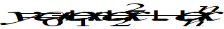 (6.1)

式中，*y*、 *x*分别为输出参数和输入参数；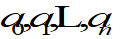为取决于*y*、*x*所涉及的子系统结构和控制模式的系数，可根据最小二乘拟合方法求得；*n*为多项式拟合阶次。

虽然拟合阶次越高、其拟合精度越高，但*n*的取值并非越高越好，过高的拟合阶次一方面引起计算量的增加，另一方面由于数值稳定性问题可能甚至导致拟合结果更差。以风速与变桨驱动电流为例，分别用1至5阶多项式对其原始散点进行拟合，并计算不同拟合阶次下的均方根误差RMSE结果如图6.1所示。由图中可以看出，虽然随着多项式阶数越高，拟合精度越高，但精度提高程度越来越小：3阶相对于1阶，精度提高了5.5%；5阶相对于3阶，精度提高不到3%。综合考虑计算资源消耗，对于风速与变桨电机电流关系，3阶多项式即可以获得良好的拟合精度。

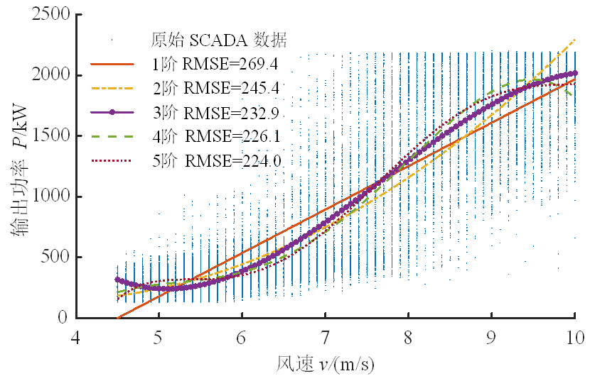

图6.1 风速与变桨电机电流不同拟合阶次对比

风电机组运行输入与输出参数关系建模实际上就是对风电机组运行规律的数学描述。当某个风电机组运行正常时，尽管可能还受到环境等因素的干扰，但运行模型不变，模型参数是基本一定的。机组不同，运行模型不同，参数取值不同。当风电机组及其子系统结构和控制模式发生变化时，如零部件破坏、控制失灵等，将会发生变化，这也意味着风电机组运行模型发生了变化、状态出现了异常。

### 6.1.2 风电机组运行状态识别

> 1\. 滑动窗口模型

风电机组处于最大风能捕获状态的运行时间最长，分布数据最多，因此选择风速处于切入风速与额定风速范围内数据，也避免由于变桨引发的非线性影响。风电机组SCADA系统所记录的是按时间顺序排列的数据序列，通过剔除数据中的空值以及停机阶段的数据，得到数据集*D*。

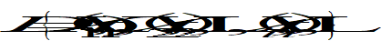 (6.2)

式中，*Xi*为*ti*时刻记录的数据集合(*i*=1,2,3, …)，数据集合就是来自于安装在风电机组相关部位的传感器和控制器在该时刻的参数值或者指令值，SCADA数据采样频率*τ*为1/(*ti*-*ti*-1)。

定义

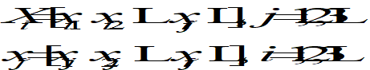 (6.3)

式中，*xij*为*Xi*中第*j*个风电机组状态参数(*j*=1,2,3,…)，如风速、转速和功率等。

随着风电机组运行，SCADA系统记录的风电机组每一时刻运行参数形成一个不断增长的数据流。为了实现在线实时评估风电机组运行状态，采用基于时间的滑动窗口模型来处理数据流，通过实时更新窗口内的SCADA数据可以实现状态在线识别，如图6.2所示。设数据记录频率为*τ*，定义窗口所包含数据长度*h*，时间长度为*hτ*；增量*q*，时间增量为*qτ*。这样，*tk *(*k*\>*h*)时刻待处理的SCADA数据为从时刻*tk*-*h*到*tk*所记录的数据矩阵，即滑动窗口数据*Dk*。

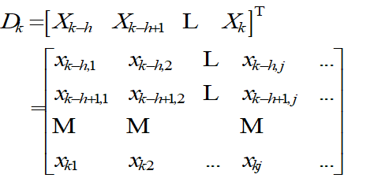 (6.4)

式中，*k*的取值与所定义的窗口宽度*h*和增量*q*有关，*k*=*h*+*nq*，*n*为时间步数，且*n*=1, 2, …。

当*tk*时刻数据处理完毕，窗口两端沿时间递增方向同时移动*q*，待处理的数据矩阵变化为*Dk*+*q*。

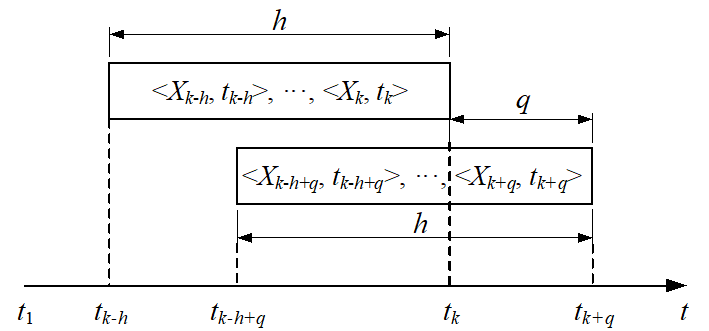

图6.2 滑动窗口模型

改变图6.2中的窗口宽度*h*可调整窗口内数据规模，改变增量*q*可调整窗口内数据更新频率。窗口宽度*h*对应的数据规模必须保证这些数据之间的关系能够准确和稳定描述机组运行状态关系，而增量*q*对应更新频率必须保证有足够的计算处理时间获得这些数据之间隐含的风电机组状态参数关系。一般地，窗口宽度*h*越大，对应的数据规模越大，数据处理获得的关系模型越准确和稳定，但是数据处理所需要的时间也将越长；当增量*q*越大时，更新频率将越小，且两个状态相隔时间(周期)越长，使得状态识别的实时性越差。

> 2\. 运行状态指标

在风电机组运行过程中，每一个窗口时间段各个参数关系都是变化的。为了度量运行过程中状态参数关系的变化量，这里以风电机组正常运行阶段中一段时间内的SCADA数据，建立起一系列输入与输出参数关系作为参照。然后，基于前述滑动窗口模型，对SCADA数据进行实时处理。滑动窗口随时间递增顺序逐步推移，采用式(6.1)分别对每个窗口内待分析的状态参数进行数据拟合处理，将得到不同时刻风电机组系统及其子系统输入与输出参数之间的函数关系。

设风电机组系统及其子系统正常运行时输入与输出运行参数*xi*、*xj*函数关系为

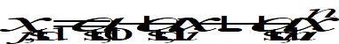 (6.5)

设*tk*时刻输入与输出运行参数函数关系变为

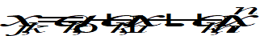 (6.6)

定义风电机组*tk*时刻基于该运行参数*xi*、*xj*关系的运行状态指标*C*(*k*)为

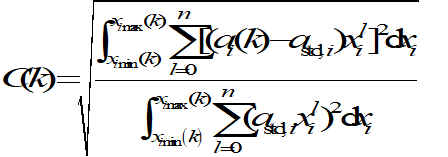 (6.7)

式中，*x*min、*x*max为窗口数据中某个参数的最小值和最大值。

当考虑风电机组在最大风能捕获区域运行时，风速参数的最小值和最大值可以视为切入风速和额定风速。相对于某个参数关系，运行状态指标的数学意义就是窗口时间段风电机组及其子系统运行状态参数相对于其正常值的变化量与正常值的比值的均方根平均值。运行状态指标指是一个无量纲指标，指标值越大，说明风电机组运行状态偏离正常越大；反之，指标值越小，偏离正常运行状态值越小。

> 3\. 状态识别与预警方法

风电机组是由风驱动的，而风电机组运行时风速风向具有很强的随机性。在风电机组正常运行时候，一段时间运行工况与另外一段时间运行工况也不可能完全相同，风电机组运行状态出现差异、并在一定范围的变化并不意味着风电机组及其子系统出现了异常，风电机组运行可能仍然属于正常状态。所以，风电机组运行过程中各个时刻的状态是随机的，其运行状态指标是一个随机量，并呈现出一定的概率分布规律。

在风电机组实际正常运行过程中，基于SCADA数据，采用式(6.7)可计算得到一系列符合某种统计分布规律的状态指标值样本。对于风电机组状态指标值而言，密度函数并无先验知识，因此，采用非参数密度估计法中的核密度估计{Buch-Larsen, 2005 \#582}方法；而且，在风电机组变桨距系统运行状态识别与预警过程中，用于建模的历史SCADA数据与实时SCADA数据不可能完全一致，且风电机组的状态与外界环境也不可能存在完全一致的情况，这就意味着状态识别指标的计算结果不可能为零，故选择Gaussian核函数。

设一概率值为*α*。根据状态指标*C*的定义可知*C*恒大于等于0，基于统计学中的区间估计理论，若满足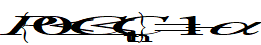，则称区间\[0, *C*th\]是状态指标*C*的置信度为1-*α*的置信区间。显然，风电机组运行状态出现在区间\[0, *C*th\]外的概率为*α*，置信上限*C*th可表示为

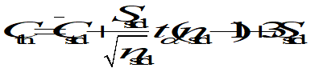 (6.8)

式中，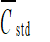为正常运行时状态指标统计均值；*S*std为状态识别指标统计标准差；*n*std为正常运行时状态指标总训练样本数，且有*n*std=(*ld*-*h*)/*q*，*ld*为正常运行时SCADA数据记录时间长度。

当*α*是一个很小的值时，根据小概率原理，风电机组状态的指标*C*大于置信上限*C*th时被认为是几乎不可能出现的状态，即小概率事件。换句话说，以1-*α*为置信度，几乎不可能出现的这个状态属于“不正常”状态。这样*C*th就把风电机组运行状态分为正常*C*在\[0, *C*th\]范围内和异常*C*大于*C*th，这里*C*th为称之为识别异常状态出现的阈值。

图6.3所示为风电机组正常运行下状态指标*C*计算结果的统计直方图与核密度估计图，状态指标*C*的峰值出现在0.043附近。取*α*=0.0005，利用式(6.9)计算可以得到状态指标异常阈值*C*th为0.0823。如果状态指标*C*处于区间\[0, 0.0823\]内时，认为风电机组运行状态是正常的；如果状态指标*C*大于0.0823时，就认为此时风电机组的运行状态出现异常需要引起关注，即必须进行预警。由上可知，*α*越小，风电机组异常状态识别可信度越高，越要引起高度重视；而基于概率理论，区间估计中置信度的选取原则是α应该较小且标准化，同时结合生产实际需要来综合考虑。较小是因为要遵循小概率原理(即小概率事件发生的不可能性)，标准化则是为了检验临界值表的制表方便。在风电机组运行状态识别的实际中，如果选取的*α*太大，虽然提高了报警的灵敏度，但同时也会增加虚警率，易犯统计学中的“拒真”错误；如果选取的*α*太小，会因保留大误差的数据过多，导致无法有效进行预警，易犯统计学中的“存伪”错误。这里在*α*的选择过程中，首先考虑的是控制犯“拒真”错误的概率，其次再设法使犯“存伪”错误的概率达到最小，结合风场的机组实际故障率选取了*α*=0.0005。状态指标是基于一定的输入输出参数关系进行计算的，不同的输入输出参数关系就有不同的状态指标值及其不同的统计分布规律。所以，即使是设定相同的信度标准，基于不同的参数关系来识别风电机组异常状态指标的阈值也将不同。

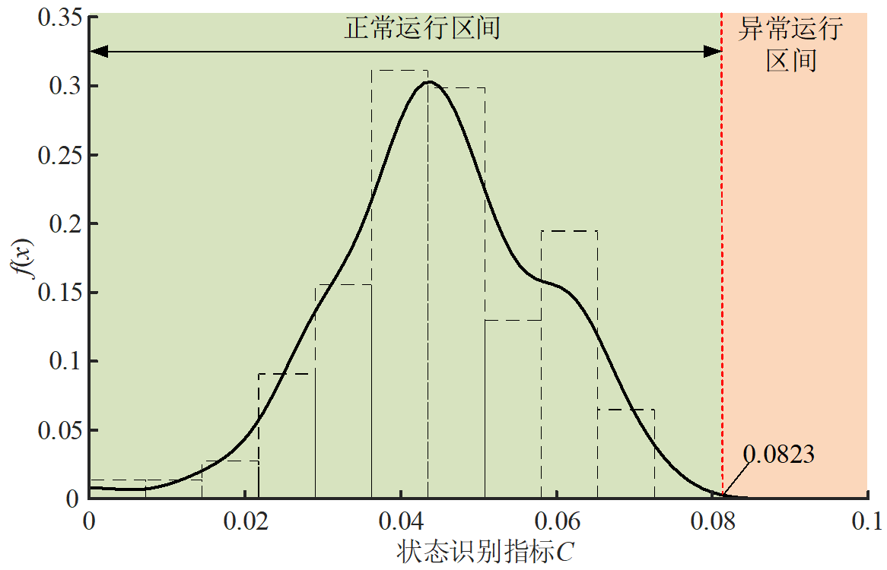

图6.3 状态指标分布直方图和核密度估计图

### 6.1.3 运行状态识别实例分析

> 1\. 计算条件

为验证所提出的异常状态识别方法的有效性，选取某风电场两台同型号2MW直驱式风电机组为研究对象，分别标记为WT1和WT2。提取两台风电机组SCADA系统4天运行数据，记录时间为9月7日00:00~9月10日23:59，采样频率1Hz，其中WT1于9月10日13:00发现偏航系统故障。

> 1\) 滑动窗口模型时间增量*q*的选择

选定窗口宽度*h*=4天，时间增量*q*分别取0.5h、1h、1.5h、2h，提取不同时间段但记录时间长度相同的两段数据，不同时间段的状态指标变化情况如图6.4所示。从图可见，窗口增量对状态指标没有明显影响。

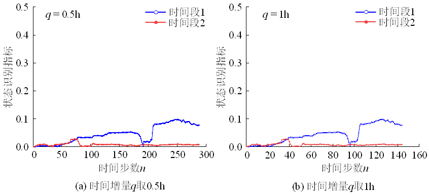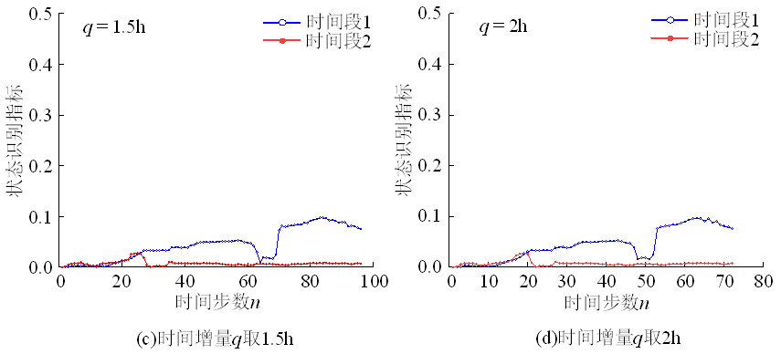

图6.4 时间增量对状态识别指标的影响

滑动窗口模型中的时间增量反映了窗口内数据更新的频率。选定窗口宽度*h*=4天，时间增量*q*分别取0.5、1、1.5、2小时，使用风电场监控室常用的计算机配置，不同时间段风电机组的状态识别指标计算耗时如图6.5所示。

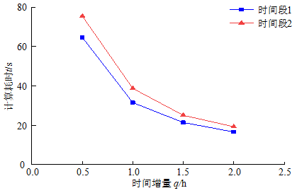

图6.5 不同时间增量计算耗时

由图6.5可知，随着时间增量由0.5h变化至2h，时间段1分析耗时分别为64.6s、31.5s、21.4s、16.6s，时间段2分析耗时分别为75.4s、38.7s、25.1s、19.3s。时间增量从0.5h增加至1h，两组数据分析耗时共减少了69.8s，时间增量从1.5h增加至2h，两组数据分析耗时共减少了10.6s。实际计算时，时间增量越小，会造成计算的时间步数增加，分析耗时越长，但此时窗口内数据更新快，状态识别的实时性越强，但对设备计算能力要求也越高；时间增量越大，相应计算的时间步数减小，算法的运算效率增加，但此时窗口内数据更新慢，状态识别的实时性越弱。因此，需要根据运算平台的性能以及对状态识别的实时性要求选择合适的时间增量，这里所用时间增量为1小时。

> 2\) 滑动窗口模型窗口宽度*h*的选择

滑动窗口模型的窗宽取值决定了在线求解参数关系模型的数据规模大小，样本数据越大，拟合得到的参数关系模型结果越准确，样本数据过少，则会造成拟合得到的参数关系模型与实际偏差较大，数据规模大小直接影响计算结果的准确性。因此，从准确性来看，窗口内的样本数据集规模越大越好。但是数据规模的大小又受到计算速度的限制，数据规模越大，单次迭代过程中所处理的数据量就越多，消耗的计算机资源也就越多。对于风电SCADA数据这类受随机性影响较强的数据，目前还没有较好的方法来确定窗口宽度，不同风场、不同型号风电机组理想的窗宽可能都不一样。本节采用试算法来确定窗口宽度，选定时间增量*q*为1h，窗口宽度分别取3~12天，对风电机组检修完成后正常运行过程中风速与功率状态识别指标进行计算，结果如图6.6所示。

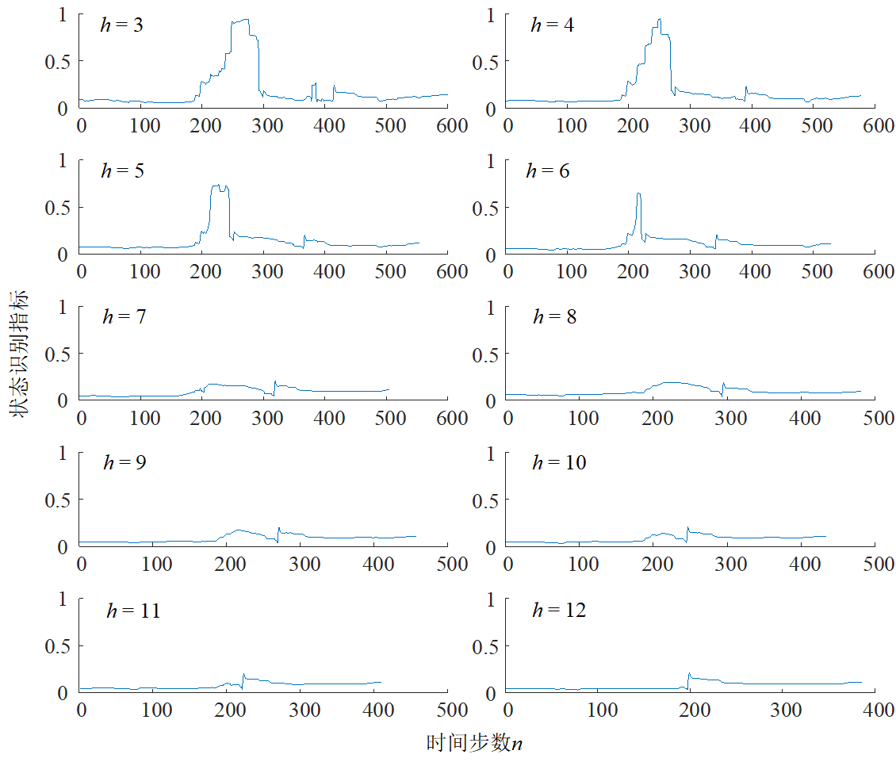

图6.6 窗口宽度对状态识别指标的影响

风电机组状态指标值是评估其运行状态的基础。由于风速的较强的随机性，即使在风电机组处于正常运行阶段，状态指标必然会有所波动。但是，具有优良识别性能的状态指标应该满足如下条件：风电机组正常运行时，状态指标应该稳定在一个较小区间内波动；反之，当风电机组发生异常时，状态指标应该有明显变化并且保持持续趋势。分析图6.6可知，当窗口宽度分别取3~6天时，风电机组在正常运行状态阶段的状态指标就有较大的波动，说明缺乏辨识度，状态指标无效，甚至可能出现运行状态评估误诊、误报。当窗口宽度大于7天时，状态指标风电机组正常运行状态阶段值小且稳定。由上述分析可知，窗口宽度选择过小，一方面造成数据的拟合精度降低，另一方面，也是更重要的是，由于时间较短窗口内的数据可能无法涵盖风电机组运行的所有工况，数据拟合建立起来的关系模型不能代表风电机组正常运行输入与输出参数关系，这些都可能导致状态指标无效。状态指标精度和稳定性随着数据窗口宽度增加而增加，但数据处理所需要的时间也会增加，即时效性变差。所以，窗口宽度选择过大，可能导致状态指标识别时效性降低，甚至无法实现在线识别。图6.7为风电机组在不同窗宽条件下，状态识别指标的方差。从图中可以看出，随着窗宽取值不断增大，状态识别指标的方差变得逐渐减小。而当窗宽取值大于7天以后，方差基本稳定。这说明对于该组数据，窗宽大于7天以后，样本数据集就基本涵盖了这段时间风电机组的全部工作状态，继续增加窗口内的数据除了增加数据量之外，对实验结果的影响已经不明显。就一般风电场监控室计算机配置而言，数据窗口宽度选择为7天。

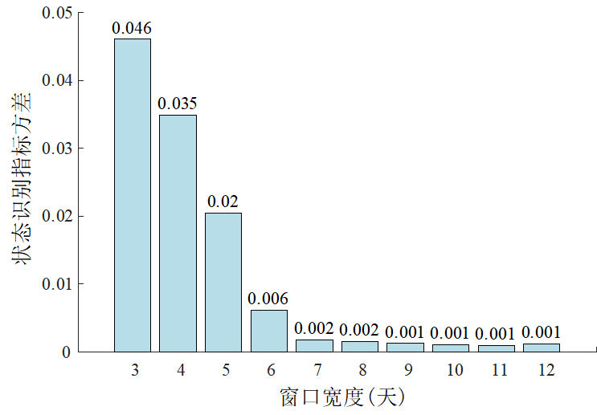

图6.7 不同窗口宽度下状态识别指标方差变化规律

为了验证基于SCADA数据关系的风电机组运行状态识别方法，选择的一些具体做法是：选取风电机组风速、转速、输电功率、变桨电机电流、机舱振动加速度为运行状态参数；滑动窗口宽度为24h，时间增量1h；为排除风电机组变桨以及启动阶段对状态识别结果的不利影响，选取发现故障之前风速在2.2~10m/s区间内SCADA数据进行分析。考虑到风速与功率之间存在3次方关系，为了简便，这些输入输出参数关系的多项式拟合阶次为3阶。选择Gaussian核函数，核密度估计窗宽为20，置信度为99.95%。

> 2\. 风速与功率关系预警分析

风电机组风速与功率关系反映的是风电机组整个系统运行状态，是风电机组SCADA数据参数之间关系中最重要的关系，也是众多基于SCADA数据进行风电机组运行状态分析研究的主要对象。根据提出的基于SCADA参数关系风电机组运行状态识别方法，对两台风电机组SCADA数据进行处理，由计算条件可以求得WT1风速与功率状态识别指标的阈值为0.0823，求得WT2风速与功率状态识别指标的阈值为0.0930，处理结果如图6.8和图6.9所示，为了全面展示状态指标变化过程，图中状态指标是从故障发生二天前开始的。

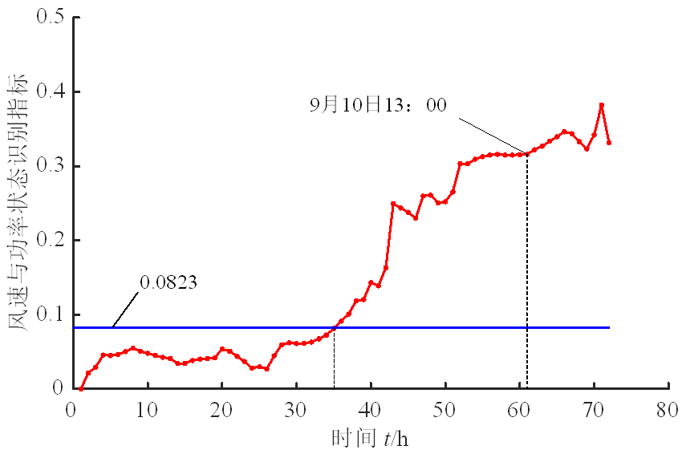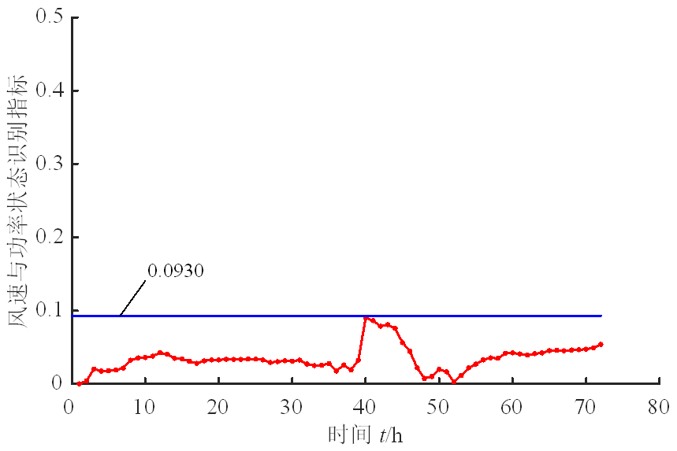

\(a\) WT1风速与功率状态指标变化 (b) WT2风速与功率状态指标变化

图6.8 风速与功率状态指标识别结果

从图6.8(a)可见，WT1在时间为35小时状态指标开始超出阈值，出现异常状态，触发预警；随后，状态指标不断增加，持续触发预警。从图6.8 (b)可见，WT2状态指标一直没有超出阈值，没有出现异常状态，没有触发预警。图6.9(a)和(b)展示了WT1、WT2在不同时间阶段节点风电机组风速与输出功率关系运行状态曲线，由图可见，WT1在9日00:00时运行曲线虽然有偏差但仍然属于正常，在10日00：00时运行曲线发生严重偏差出现异常，并越来越偏离正常运行曲线，直至10日23:59；WT2在整个运行阶段运行曲线虽然有偏离但仍然属于正常范围。

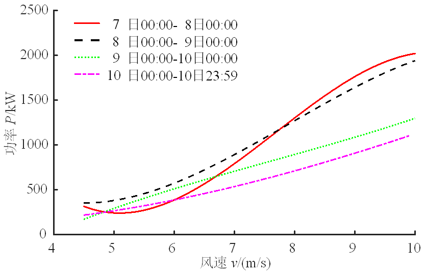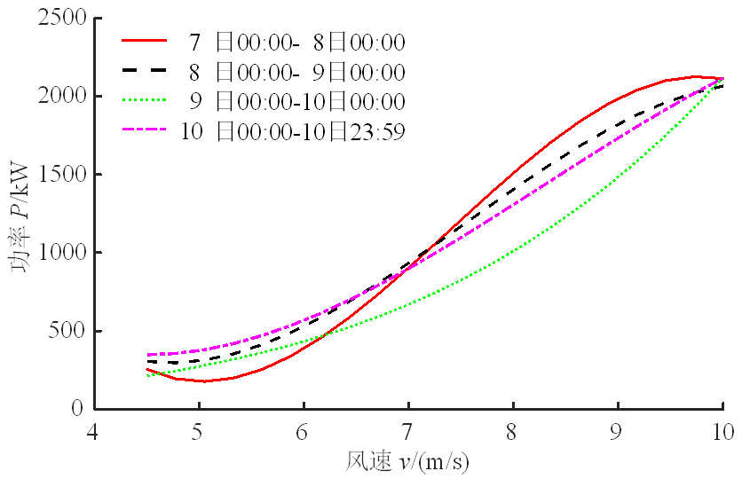

\(a\) WT1 (b) WT2

图6.9 不同时间段风速与功率关系曲线

综合以上分析可知：一是基于SCADA数据的风电机组运行状态识别方法可以有效识别风电机组运行异常状态。同风场两台同型号的风电机组数据分析表明，WT1出现异常，而WT2没有异常，这与实际运行状态相符合；而且，根据风电机组风速与输出功率关系，该方法识别异常状态时间在35h，实际运行发现故障时间是61h，预警提前了26h。从运行状态异常到出现故障状态是一个由量变到质变过程，状态指标越来越大，持续触发预警，必须引起高度重视，这说明该方法能够识别出这个量变到质变的过程。二是同风场同型号的风电机组有着基本相同的运行规律。一方面，虽然两台同类型风电机组的结构和性能参数可能因为设计制造随机性而不尽相同，但两者的正常运行参数关系曲线相近，通过计算得出WT1、WT2两者风速与功率正常运行曲线之间存在的差异指标为0.0308，均小于WT1、WT2阈值，即在允许范围之内；另一方面，虽然阈值因训练样本数等不同而存在差异，但状态指标大小及其变化规律相近，如果将没有发生异常的WT2正常关系模型和阈值用于发生了异常的WT1检测，WT1异常状态也可以被识别出来。这也证实了前面所提的风电机组正常运行拟合模型主要与风电机组结构和控制模式有关的分析，同时也说明可以运用同风场同类风电机组SCADA数据来建立该类风电机组正常运行状态数学模型，然后比较分析、识别单个风电机组运行状态。

> 3\. 参数关系分层次预警分析

风电机组风速与功率关系是最高一层运行关系，对应风电机组整体系统；风速与转速关系、转速与功率关系是其下一层次关系，分别对应风轮子系统和发电子系统。如此这般，就可以根据能量传递和耗散关系，将SCADA参数之间的两两关系形成一个层次结构，这个关系结构又与风电机组组成部件形成对应。根据本节提出的风电机组运行状态识别方法，这里以WT1为例，分析风电机组风速与转速关系、转速与功率关系，基于SCADA数据，计算获得风速与转速状态指标识别阈值为0.0298，转速与功率状态指标识别阈值为0.0435，处理结果如图6.10和图6.11所示。

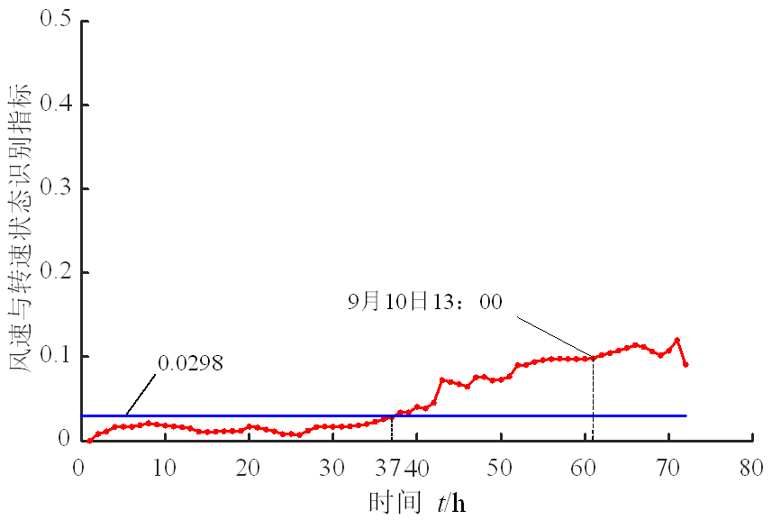 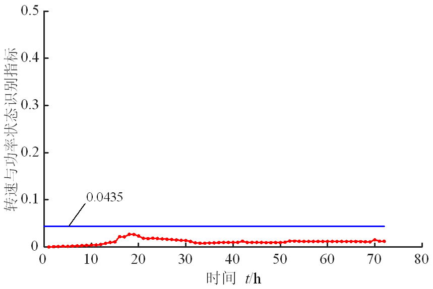

\(a\) 风速与转速关系指标变化 (b) 转速与功率关系指标变化

图6.10 WT1风速与转速关系和转速与功率关系状态识别指标对比

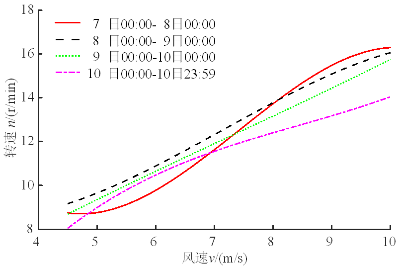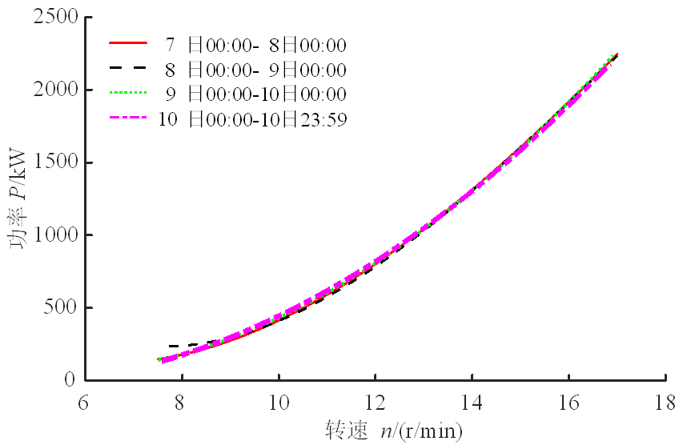

\(a\) 不同时间段内风速与转速关系 (b) 不同时间段转速与功率关系

图6.11 WT1不同时间段风速与转速关系和转速与功率关系

观察WT1风电机组风速与风轮转速关系和风轮转速与输出功率关系识别结果。从图6.10(a)来看，WT1风电机组风速与风轮(发电机)转速关系状态指标在37h开始超出阈值，出现异常状态，触发预警；随后，状态指标不断增加，持续触发预警。实际运行发现故障时间是61h，预警提前了24h。从图6.11(a)展示的在不同时间阶段风电机组风速与风轮(发电机)转速关系曲线可见，WT1在9日00:00时运行曲线虽然有偏差但仍然属于正常，在10日00:00时运行曲线发生严重偏差属于异常，直至10日23:59，这与前面所述的风电机组风速与输电功率关系变化规律图5.8(a)一致。就WT1风电机组风轮转速与输出功率关系而言，从图6.10 (b)和图6.11(b)可见，WT1在运行过程中状态指标有波动但未超出阈值，WT1风电机组风轮转速与输出功率关系曲线在不同时间阶段几乎没有变化。这是因为WT1发生了偏航系统故障，从而引发风速与风轮转速关系异常，进而导致风速与输出功率关系运行发生异常，而风轮转速和功率关系与偏航子系统运行状态无关，故风轮转速与功率关系就未发生异常现象。

继续观察WT1风电机组风速与变桨电机电流、风速与机舱振动加速度关系状态指标变化情况，这两个关系都是风速与转速关系的下一层次关系。基于SCADA数据，可以获得WT1风速与变桨电机电流关系状态指标的阈值为0.0331、风速与机舱振动加速度(*X*、*Y*方向)关系状态指标的阈值分别为0.0144和0.0062，如图6.12所示。从图可见，WT1风速与变桨电机电流状态识别指标、风速与机舱振动加速度(*X*、*Y*方向)状态识别指标都在35h左右超出阈值，触发预警；随后，状态指标不断增加，持续触发预警。这是因为WT1发生了偏航系统故障，影响了风轮对风，从而导致风速与变桨电机电流关系和风速与机舱振动加速度(*X*、*Y*方向)关系异常。

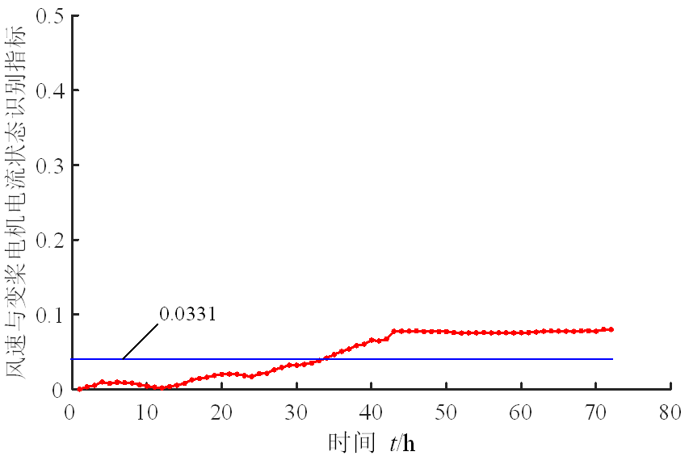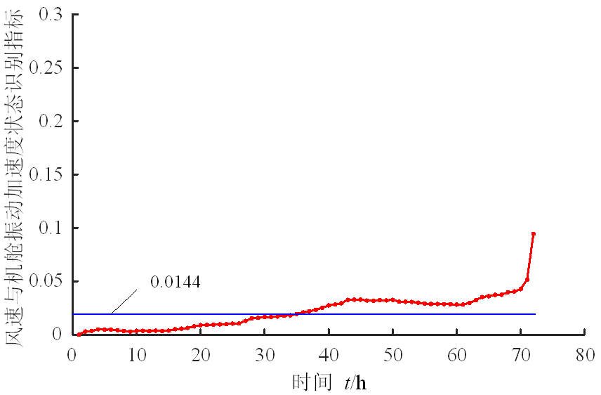

\(a\) WT1风速与变桨电机电流关系状态指标 (b) WT1风速与机舱振动加速度关系状态指标(*X*方向)

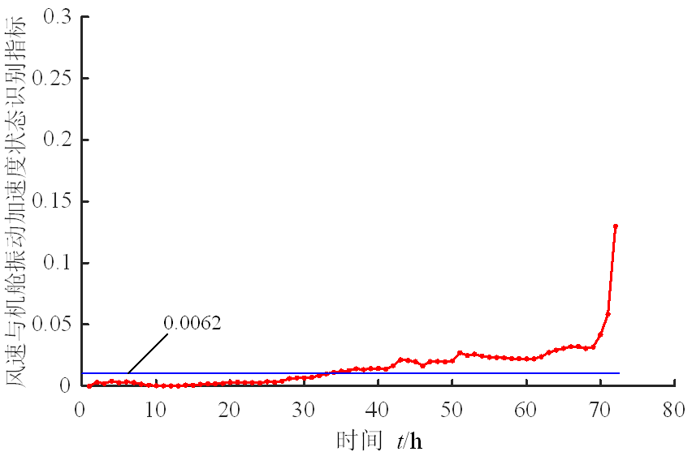

\(c\) WT1风速与机舱振动加速度关系状态指标(*Y*方向)

图6.12 WT1风电机组风速与变桨电机电流关系、风速与机舱振动加速度关系状态识别结果

由上分析可知，由于风电机组SCADA数据参数之间关系反映了风电机组及其部件的运行状态，通过对这些关系分析和识别，不但可以对风电机组运行状态实现异常识别和早期预警，而且还能获得出现异常的部件方面信息，这有利于采取针对性措施对风电机组实施故障处理和维护。这主要表现在如下三个方面：①依据SCADA参数关系形成的层次结构，由上而下追溯出现异常的参数关系，直至底层，从而获得与出现异常关系相对应的部件信息，而无需对没有出现异常的参数关系进行追溯处理，这可以避免对所有的SCADA数据参数关系都进行数据处理和识别分析引起的庞大计算量。②在风电机组运行状态在线识别与预警系统设计中，可以采取基于SCADA数据的风电机组风速与功率关系对整个风电机组运行状态进行在线识别与预警，运行异常部件识别则可以采用并行计算或者离线方式进行，这有利于SCADA系统计算能力的合理配置。③合理配置风电机组SCADA系统传感器分布和信息采集，使SCADA数据形成的参数关系与风电机组部件输入输出相对应，有利于更加有效地发现异常的位置和部件。例如，增设偏航电机输出扭矩传感器、获得电机输出扭矩数据，或许就可以直接判断出偏航系统运行异常。

## 6.2 基于概率面积准则的功率特性在线评估

### 6.2.1 功率特性分析与数据处理

> 1\. 功率曲线

风电机组功率曲线描述了来流风速与输出功率之间的关系，是反映风电机组性能的重要指标。根据风电机组运行特点，功率曲线可以分为四个区域，如图6.13所示。在区域A，风速低于切入速度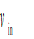，风电机组不运行。在区域B，风速超过切入速度 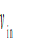小于额定风速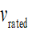，区间表示为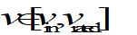 ，将其称为最大风能跟踪区(maximum wind power tracking region，MWPTR)。根据贝茨定律，理论最大风能利用系数称为贝茨理论极限值，约为0.593。为了产生最大功率，应用各种控制策略，使得风电机组尽可能地接近贝茨极限曲线。在区域C，风速超过额定风速，小于切出速度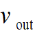，区间表示为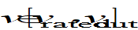，风电机组保持额定功率，称为额定功率输出区(rated power output region，RPOR)。在风速大于切出风速的区域D，桨距角调整为90°，风电机组停止转动。

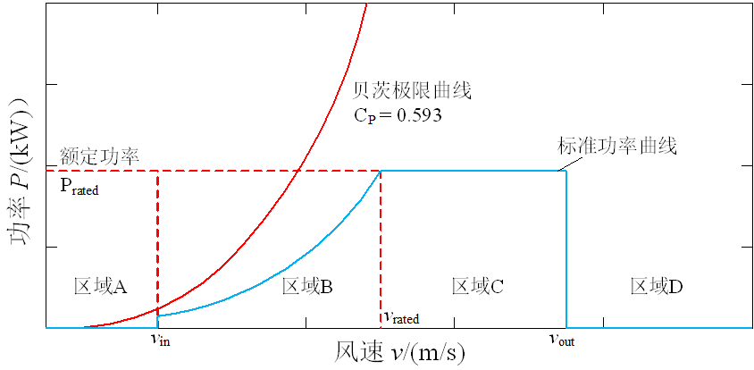

图6.13 风电机组风速-功率曲线

某风电机组风速功率散点如图6.14所示，展示了实际评估数据与基准数据之间存在明显的偏差，这种偏差主要源于风电机组性能退化、风力资源变化和设备故障等多方面因素。因此，通过量化功率曲线偏差，分析其变化趋势，可以实现对风电机组性的评估分析。基于风速功率偏差分析的风电机组性能评估，需要在MWPTR和RPOR中有一套完整的基准数据集，用于确定风电机组的变化趋势。风速与功率在MWPTR和RPOR中，具有不同的控制关系。因此，评估方法必须考虑不同风速区域的这种差异。其中，MWPTR的控制目标是实现最大的风能捕获，而RPOR的控制目标是在保持稳定输出功率的同时实现尽可能多的输出功率。所以，提出的评估方法必须具备以下特点：评价结果能准确表明实际评估数据与基准数据之间的变化；该方法具有鲁棒性，不受异常值的影响；方法评估结果易于工程人员理解；可获得一个稳定的功率性能变化趋势，这个趋势可以用于预测分析。本节提出一种SCADA数据分析的发电性能评估方法，为评估风电机组整体性能和制定维护计划提供有用工具。

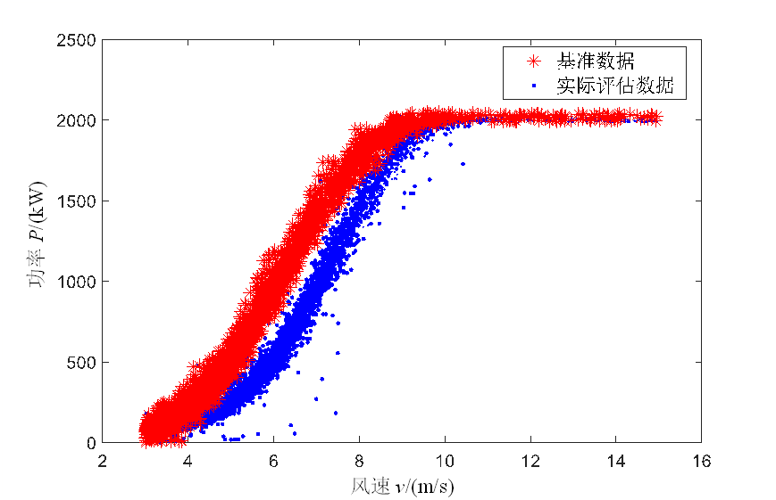

图6.14 实际评估数据与基准数据

> 2\. 基准数据选择与数据预处理

基准数据来源于实际风电机组的运行数据，它们代表了风电机组的最佳运行状态。在基准数据选择时既要考虑风资源，也要考虑风电机组的运行状况。最好选择风资源丰富时期的风电运行数据，以确保获得该区域从切入风速到额定风速的完整评估信息。同时考虑操作和维护有关的信息(如：维修报告和停机时间)，判断风电机组是否最佳运行状态。通过理论分析和现场验证，对这些预选基准数据进行综合分析，得到整个风电场的最优风速功率数据，将其作为基准数据。

根据风电机组的运行原理，SCADA数据预处理步骤如下：

(1)滤除功率*P*=0的数据；

(2)剔除风速小于0或等于0的数据；

(3)通过控制指令值(如风电机组功率限值、发电机功率限值等)过滤限功率数据；

(4)根据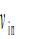、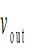和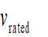，确定MWPTR和RPOR中的风速和功率数据，其中，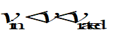对应于MWPTR，而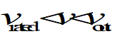 对应于RPOR。

风电机组SCADA数据包括传感器异常和结冰等大量异常数据，可以采用数理统计和智能算法进行剔除。

### 6.2.2 基于概率面积准则的运行状态评估

> 1\. MWPTR中的运行健康值

根据切入切出风速区间，将MWPTR等分为*t*个区间，第*i*个风速区间可表示为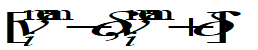，其中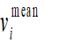为区间中点，为区间半径。评估风速功率数据可表示为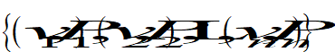，其中在第*i*个风速区间内的点表示为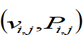，第一个下标表示区间数，第二个下标表示区间内的样本点数。基准风速功率数据可以表示为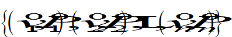，对应第*i*个区间内的点集为 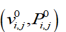。第*i*个区间风速功率数据的经验累积分布函数\[23\] (empirical cumulative distribution function，ECDF)可表示为

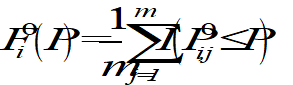 (6.9)

 (6.10)

式中，*I*是指标函数；为基准数据的经验累积分布函数；为基准数据在第*i*个区间内数目；评估数据的经验累积分布函数；为评估数据在第*i*区间内数目；为基准数据和评估数据的面积偏差 \[23\]，可表示为

 (6.11)

式中，为功率在第*i*个区间内的均值。为了解释两条ECDF之间的面积偏差，绘制评估ECDF和基准ECDF于图6.15中，两条ECDF曲线存在一个交点，概率面积为两条ECDF曲线之间的面积，可以用式(6.11)中的积分法计算。评估ECDF与基准ECDF也可能没有接触点，也就是实际的ECDF要么是高于、要么是低于基准ECDF，概率面积也可由式(6.11)计算，该方法称为概率面积准则(probabilistic area metric，PAM)。

图6.15 概率分布面积法PAM示意

在计算*t*区间的偏差后，应用标准功率曲线来吻合总体变化。假设标准功率曲线可以表示为，其中为风速，*P*为功率，为标准功率曲线函数。第*i*个速度区间均值点的功率应为

 (6.12)

式中，为第*i*个风速区间的平均值；为标准功率曲线的功率。

在 *i*区间内，权重值计算公式为

 (6.13)

采用健康状态值（health value，HV）来表示风电机组发电性能， MWPTR中的HV定义为

 (6.14)

在MWPTR中，风电机组的控制目标是跟踪最大功率输出，表示实际功率数据与基准数据的一致性关系。接近于为零值的HV表示风电机组接近最优功率性能；相反，较高的HV代表风电机组较差的性能状况，其原因可能是设备故障、老化、风资源变化等。

> 2\. RPOR中的运行健康值

RPOR中的理论功率曲线是一条等于额定功率的水平线。定义 RPOR 中的数据集为，风速和功率数据可表示为 。将RPOR中的基准数据定义为，风速和功率数据可表示为。RPOR中风电机组运行健康状况值HV可通过以下方式计算：

 (6.15)

其中

 (6.16)

 (6.17)

式中，是 RPOR的健康状态值。风电机组较小的意味着良好的性能状态；相反，越大表示风电机组性能状态越差。

> 3\. 计算流程图

风电机组基于PAM的发电性能评估流程图，如图6.16所示，确定时间窗口长度*T*和滑动步长Δ*T*是其中最为重要的环节，如图6.17所示。窗口长度 *T* 与所考虑的风电场的数据质量有关，这些数据的大小与本节使用的基准数据相近；滑动步长Δ*T*是根据评估要求确定。以10min的SCADA数据为例， *T* 为20天，风速和功率数据为2280天。如果设置Δ*T*为一天内获得的数据，则需要收集144个数据点。但由于数据丢失、停机数据和数据异常等原因，实际*T*小于2280个，Δ*T*小于144个。因此，为避免数据不足的影响，需要依据预处理后的数据量来确定*T*和Δ*T*。因此，相应的评估结果并不是相等时间间隔的结果。

图6.16 性能评估方法流程图

对风电机组SCADA数据进行预处理后，将基准数据和实际数据分为MWPTR和RPOR两部分。应用所提出的方法对MWPTR和RPOR中的风速和功率数据分别进行评估。风电机组的和的值可由式（6.14）和式（6.15）计算。在对***R***区域的性能进行评估后，通过步长 Δ*T*滑动窗口获得新的评估数据。评估数据的更新方法如图6.17所示。通过相同的计算过程，可以得到不同时间窗的HV。对于长时间的SCADA数据，可以获取两个时间序列，定义为和。随后，通过对HV时间序列的分析，就可以更好地开展性能评估、劣化分析和预警、故障检测等。

图6.17 时间窗口更新方法

### 6.2.3 功率特性评估结果分析

> 1\. MWPTR结果分析

风电SCADA数据来自一个山地风电场，该风电场有24台2MW直驱式风电机组。切入风速为3m/s，切出风速为25m/s，额定风速为11m/s。通过对风电场所有风电机组运行情况的分析表明，T01号风电机组在服役期间的维护活动较少，性能相对稳定。通过与其他风电机组的对比分析，参考风力资源和维护记录，选择T01风电机组某年度6~7月的数据作为基准数据。时间窗口*T*的长度为4320(30天)，滑动步长Δ*T*为432(3天)。

T01风电机组的HV曲线如图6.18所示，HV越大，相应发电性能越差。此外，如果两个运行状况值在水平轴上相距较远，则可能是出现停机时间。从图可以看出，在日期A之前，HV在0.4 ~ 0.5之间；在日期A和日期C之间的时间间隔内，HV变化剧烈；在日期C和期间D，风电机组运行稳定，仅在非常短的间隔内波动，停机时间很少，与实际维护记录一致。为了弄清HV是否能真实反映基准数据与实际数据的差异，这里绘制了日期A、B、C的风速和功率数据，如图6.19所示。从图6.19(a)可以看出，日期A和日期C之间的偏差非常明显，而B点表示从日期A到日期C的过渡。因此，采用本节方法计算获得的HV可以准确地量化发电性能的变化。更重要的是，能够客观地呈现HV的逐渐变化，进一步的趋势分析将对风电机组的运行和维护活动具有重要指导意义。

图6.18 T01号风电机组应用PAM获得的在最大风能利用区 (MWPTR)状态值

> \(a\) 日期A和日期C (b) 日期B和日期C

图6.19 T01号风电机组日期A、B、C状态值比较

选取T01和T07风电机组作为研究对象，将本节PAM方法与文献\[21\]中的PC2-Dev方法进行对比分析，如图6.20和图6.21所示，其中两条线分别代表使用PC2-Dev方法和PAM方法获得的结果。从图6.20可以看出，两条HV曲线很好地反映了实际功率曲线的变化趋势；同时，两条曲线的拐点几乎同时出现。而且，在图6.21中，连续三年两条HV曲线也表现出类似的趋势。但需要注意，连续八个月PAM法得到的HV曲线随时间变化不大，而PC2-Dev法得到的HV曲线波动较大，差异明显。为了分析原因，选取PC2-Dev方法中变化最大的两点，分别命名为Date A和Date B，并绘制它们的数据和相应的基准数据，如图6.22所示。图6.22(a)显示了日期A和日期B的数据以及基准数据。图6.22(b)显示了日期A和B的数据；重叠部分如图6.22(c)所示，其他部分颜色深浅不同，如图6.22(d)所示。根据图6.22的观察，日期 A和B数据与基准数据非常相似，都包含大量重叠的信息。因此，可以推断，由此产生的曲线的大波动来自于少量的非重叠数据。通过分析图6.22(d)中不重叠的数据可以看出，日期A的数据主要位于风速区间\[3.0m/s,7.0m/s\]，日期B的数据主要位于风速区间\[7.0m/s, 11.0m/s\] ，风速区间\[7.0m/s, 11.0m/s\] 的功率大于区间\[3.0m/s, 7.0m/s\]的功率。从图6.22可以看出，日期A和日期B的数据接近基准数据，相应的健康值应该是相似的。PAM法计算的HV与实际情况吻合较好，采用PC2-Dev方法获得的结果表现出相反的方式。之所以会有这样的发现，是因为PC2-Dev方法应用了主成分分析，将风速和功率降维，根据实际测量功率与基准功率数据的方差计算出HV。在这种情况下，日期B的方差大于日期A的方差。在某些情况下，PC2-Dev方法可能会计算出异常的HV。由此可见，基于方差的方法不能反映整个数据信息。PAM方法可以避免这一缺陷，因为数据的ECDF被应用于量化数据集之间的变化，其中包含比数据方差更多的信息。以上讨论表明，PC2-Dev方法虽然是评估风电机组功率曲线的有效方法，但在某些情况下可能会产生误报，而PAM方法可以获得更好的结果。

图6.20 T01号风电机组性能评估结果对比

图6.21 T07号风电机组性能评估结果对比

(a)日期A和B的基准技术和实际数据

(b)日期A和B的数据

(c)日期A和B的重叠数据

(d)日期A和B的非重叠数据

图6.22 T07号风电机组日期A和B比较分析

> 2\. RPOR结果分析

以T22号风电机组连续两年的额定功率数据为研究对象。由于山地风电场湍流较强，对额定功率实际数据进行预处理，绘制出功率的时间序列，如图6.23所示。RPOR中的数据量小于3000，功率区间为\[1900kW, 2040kW\] 。可以看出，数据在垂直方向上波动很大。而在虚线框区域，数据表现稳定，中心值略高于额定功率值2000kW。风电机组在恒功率区域运行时，其输出功率理论上应在额定功率值附近稳定波动。然而，运营方希望在安全水平下产生更多的电力，从而获得更多的收益，这要求风电机组在输出功率值略大于额定功率的情况下稳定运行。因此，选择虚线框内的数据作为基准数据。基准数据中有308个风力发电点，这些数据来源于一个连续的时间间隔；选择时间窗口*T*的大小为288，考虑到数据规模不大，为了获得持续的变化趋势，将时间窗口Δ*T*设置为36。

图6.23 T22风电机组额定功率输出区(RPOR)的功率时间序列曲线

应用PAM方法计算的结果如图6.24所示，其中虚线表示HV曲线。HV值越大，说明实际数据与基准数据的偏差越大。两个点相距较远，时间跨度很大，表示额定功率数据不足。相邻的点密集，表明有足够的数据可用。从HV曲线中选择峰值点，标记为日期 A~H，并使用虚线连接它们。从日期A到日期B，HV曲线呈下降趋势，从日期B到日期C，HV曲线呈上升趋势。原因是，虽然随着使用时间的增加，风电机组的性能自然会下降，但可以通过维修和维护来提高。从日期C到日期H，表现出与前一个类似的明显变化。曲线趋势表明，日期B和日期F不符合最优运行状态；相反，日期H是曲线上最小的点，同时也是性能最好的点。分析表明，利用PAM方法得到的健康状态值变化趋势与风电机组维护及其预期的理论性能变化趋势一致。

图6.24 T22风电机组应用 PAM在额定功率输出区 (RPOR)获得的状态值曲线

为了观察PAM方法对实际数据与基准数据之偏差的敏感性，这里计算基准数据在极值点*A*、*B*、*E*、*F*和*G*的功率均值和方差，结果如表6.1所示，并按所列的HV值大小依次绘制相应的功率序列，如图6.25所示。从图6.25(a)可以看出，基准数据的均值为2013 kW，标准差为3.6 kW，整个数据点范围运行稳定。从图6.25(b)可以看出，点*F*的HV值略低于基准数据，标准差为10.65 kW，部分功率点的值小于2000 kW。*B*是最小点，略大于*F*，其HV值为7.071，因为其标准差大于点*F*。图6.25(c)表明值小于2000 kW的点数少于图5.25(b)。点*G*、点*A*、点*E*为最大值点，其平均值小于额定功率和基准平均值，且方差较大，变化趋势如图6.25(d)~(f)所示。以上分析表明，利用PAM方法计算的HV值可以很好地反映实际数据与基准数据之间的偏差，以及数据集的均值和方差。综上所述，PAM方法是一种计算风电机组性能变化趋势和进行预测分析的有效方法。

图6.25 T22风电机组不同时期功率时间序列（虚线为平均值，黑线为额定功率）

表6.1 T22风电机组不同日期的状态参数

<table>
<colgroup>
<col style="width: 25%" />
<col style="width: 25%" />
<col style="width: 25%" />
<col style="width: 25%" />
</colgroup>
<thead>
<tr>
<th style="text-align: center;"><blockquote>

数据点

</blockquote></th>
<th style="text-align: center;"><blockquote>

健康值

</blockquote></th>
<th style="text-align: center;"><blockquote>

平均值/kW

</blockquote></th>
<th style="text-align: center;"><blockquote>

标准差/kW

</blockquote></th>
</tr>
</thead>
<tbody>
<tr>
<td style="text-align: center;"><blockquote>

基准数据

</blockquote></td>
<td style="text-align: center;"><blockquote>

0

</blockquote></td>
<td style="text-align: center;"><blockquote>

2013

</blockquote></td>
<td style="text-align: center;"><blockquote>

3.6

</blockquote></td>
</tr>
<tr>
<td style="text-align: center;"><blockquote>

F

</blockquote></td>
<td style="text-align: center;"><blockquote>

5.21

</blockquote></td>
<td style="text-align: center;"><blockquote>

2015

</blockquote></td>
<td style="text-align: center;"><blockquote>

10.65

</blockquote></td>
</tr>
<tr>
<td style="text-align: center;"><blockquote>

B

</blockquote></td>
<td style="text-align: center;"><blockquote>

7.071

</blockquote></td>
<td style="text-align: center;"><blockquote>

2012

</blockquote></td>
<td style="text-align: center;"><blockquote>

13.97

</blockquote></td>
</tr>
<tr>
<td style="text-align: center;"><blockquote>

G

</blockquote></td>
<td style="text-align: center;"><blockquote>

18.92

</blockquote></td>
<td style="text-align: center;"><blockquote>

1994

</blockquote></td>
<td style="text-align: center;"><blockquote>

15.75

</blockquote></td>
</tr>
<tr>
<td style="text-align: center;"><blockquote>

A

</blockquote></td>
<td style="text-align: center;"><blockquote>

21.74

</blockquote></td>
<td style="text-align: center;"><blockquote>

1992

</blockquote></td>
<td style="text-align: center;"><blockquote>

19.39

</blockquote></td>
</tr>
<tr>
<td style="text-align: center;"><blockquote>

E

</blockquote></td>
<td style="text-align: center;"><blockquote>

31.66

</blockquote></td>
<td style="text-align: center;"><blockquote>

1981

</blockquote></td>
<td style="text-align: center;"><blockquote>

16.84

</blockquote></td>
</tr>
</tbody>
</table>

> 3\. 评估结果潜在功用分析

利用PAM方法可以获得多台风电机组的长期HV曲线，以便用于风电机组性能的监测和优化，图6.26给出了T01和T07风电机组连续三年使用PAM方法的性能变化曲线。由图可以看出，T01风电机组在经过维修以后，风电机组转向了更好的状态。风电机组性能上的这种变化可以用HV的差异来量化。例如，两个不同日期的健康值相差0.4，这意味着实际数据与基准数据之间的偏差达到40%。从T07的HV曲线可以看出，该风电机组性能波动较大，与基准数据偏差较大。修复后，风电机组性能得到改善。因此，PAM方法可以有效地用于诊断给定的风电机组是否在最优状态下运行，或者风电场中的其他风电机组是否在最优状态下运行。

图6.26 两种风电机组比较

风电机组是一个复杂的机电系统，其性能随着时间而呈现退化趋势。以图6.26中T07的HV曲线为例，当最大和最小点相连时，其HV曲线趋势与风电机组可维护性密切相关。换句话说，虽然系统长期运行后性能有所下降，但经过维修后是可以恢复，制定风电机组维护计划，对于保持风电机组性能非常重要。将图6.24中的峰值点连接起来，可以发现修复前后健康状态值的变化趋势比较明显。更重要的是，通过HV可以量化系统的退化程度。图6.24中*E*点的健康状态值较大，说明风电机组性能状态较差，经过一系列的维护活动后，HV持续稳定的降低，最终达到较理想的*F*点。

风电机组状态预警对风电场的操作和维护人员尤为重要，PAM方法也是一种有效的预警工具。采用PAM方法计算T22号风电机组连续两年MWPTR和RPOR的HV曲线，MWPTR的HV对应于实际测量数据与基准数据的偏差，若设定偏差为0.05作为告警阈值，则选择比最小值大0.05的点作为预警点，由此绘制出HV曲线和预警线，如图6.27(a)所示，其中HV曲线的最小功率点分别标记为日期A、B、C。日期A之后的HV曲线增长率大于0.1；日期B的HV远大于日期A，日期B之后的HV曲线增长率超过0.05；日期C的HV小于日期B，但大于日期A，后者的后期增长速率超过0.1。分析表明，T22的HV曲线变化较大，换句话说，风电机组的性能是不稳定的。所以，如果在HV = 0.05的阈值线上检测到退化趋势，就进行有效的维护活动，则可以避免退化趋势的加剧。同样，当最小功率点超过0.1时，维修人员就应深入调查其原因。在本节考虑的风电场中，风电机组功率限值为2067.6kW，基准数据的平均功率约为2013kW，二者之差为54.6kW，为RPOR区域的理论偏差值。在RPOR中设置阈值为10kW，选择HV曲线的最小功率，绘制出HV = 10的警戒线，如图6.27(b)所示。可以看出，在*A*点的HV曲线以大于10kW的跨度逐渐增大后，到B点的HV曲线逐渐减小，*B*点之后的连续增幅超过20kW，达到全局最大值，*C*点之后的HV曲线增幅超过10kW。因此，利用PAM方法确定风电机组HV曲线，设置合理阈值就可以实现风电机组性能状态预警。

(a) T22风电机组在 MWPT中的健康值曲线

(b) T22风电机组在PROR中的健康值曲线

图6.27 基于健康状态值HV曲线的风电机组预警

## 6.3 风电机组性能劣化评价

### 6.3.1 性能劣化评价指标及内涵

由于采样频率较低，SCADA数据不适合对风电机组进行瞬态或者高频动态过程实现监测，从而使其在风电机组运行状态监测特别是早期故障诊断领域应用受到局限。但是这种低采样频率的SCADA数据的长期积累构成的大数据规模，又为风电机组时间老化导致的性能下降评估分析带来了机遇。导致风电机组性能劣化的因素多而复杂，如随着服役时间的增长，叶片的开裂、破损将导致叶片翼型升力系数降低，风电机组气动性能下降；发电机永磁体的退磁将导致电机机电耦合性能的降低，影响发电机输出功率；机械结构件的磨损、松动将导致风电机组结构刚度、阻尼的改变，影响风电机组的振动特性；能量传输效率降低则会引起发热量增加等。通过分析SCADA数据特征，本节提出风电机组性能劣化程度的四个评价指标：功率波动特性变化、风能利用系数变化、机舱振动特性变化、温度变化，开展风电机组性能劣化评价方法研究。

> 1\. 功率波动特性变化

输出功率稳定(功率波动小)是风电机组追求的主要性能指标之一。功率稳定包含两层含义，一是相同服役条件下（风速、风向、温度和湿度）输出功率基本一致；二是外部条件变化时输出功率变化不大，这主要指额定风速以上的情况。影响功率变化的因素有风速变化、转速变化、桨距角变化以及空气密度变化等，由第一章式(1.1)扩展可得

 (6.18)

式（6.18）中风速变化、空气密度变化为不可控量，转速与桨距角为可控量。此外，风能利用系数本身随服役时间的变化也会影响功率变化。

由上可知，在不同的运行和天气条件下，功率波动量是不同的。因此，为了保证评估的可靠性，用于评估功率波动的方法应较少依赖或独立于风电机组的天气和运行状况。为了尽量满足这一要求，这里选取风速大于额定风速时的功率波动进行研究。这是因为风电机组的变桨距角控制系统只有在风速高于额定风速时才开始工作，当风速低于额定风速时，风电机组的变桨距角控制系统将不会工作。在这种情况下，通过变桨距角控制，即使风力条件发生变化，风电机组的输出功率也被约束在额定功率附近，即保持转速恒定（即∆*ω*→0），调节桨距角*β* ，如图6.28所示。因此，功率波动特性的变化在一定程度上反映了风电机组本身物理性能（能量捕获与传输）、系统控制性能的劣化。

图6.28 风速大于额定风速时风电机组功率控制结构

> 2\. 风能利用系数变化

风能利用系数*Cp* 是衡量风电机组风能利用率的基本指标，不考虑式(6.18)中相关参量的波动，有

 (6.19)

将风能利用系数变化作为风电机组性能劣化指标主要是因为在内部控制策略不变的条件下，风能利用系数变化源于风轮气动特性的变化(如叶片表面粗糙、破损、开裂引起气动性能劣化)和永磁发电机退磁引起的功率捕获及能量传输性能的劣化。基于叶素-动量理论，风电机组气动特性(升力系数、阻力系数)与功率捕获之间的物理关系可用下式近似表示：

 (6.20)

式中，*r*为叶片上叶素到叶根的距离；d*r*为叶素厚度。由该式不难看出对同一风速若叶片上翼型升力系数、阻力系数和诱导速度系数等发生变化将会对功率捕获产生直接影响，从而改变风电机组风能利用系数。

另外，发电机在风电机组中属于能量转换部件，负责将机械能转换为电能。本节中SCADA数据来自永磁同步直驱式风电机组，发电机转子采用永磁体，功率与磁场之间的物理关系为

 (6.21)

该模型将参考系定为转子上的*d-q*旋转坐标系，其*d*轴定向于转子磁极轴线，*q*轴超前*d*轴90°（电角度）。

> 3．机舱振动特性变化

通常风电机组上振动传感器安装在机舱内，可以直接测量机舱的振动。在外部服役环境基本相同的情况下，性能稳定的风电机组振动特性（如最大振动加速度值）不会出现显著差异，而在风电机组性能劣化以后，振动特性差异也必然变大。影响风电机组振动特性的因素包括服役过程载荷变化和自身结构参数的变化（如结构刚度和阻尼）。作用在风电机组上的载荷主要来自空气动力，根据叶素-动量理论，作用在叶片上一点的轴向力为

 (6.22)

在外力作用下机舱动力学模型可以简化为一个质量-弹簧-阻尼系统，如图6.29所示。系统动力学方程为

 (6.23)

式中，*FN*表示所有叶片合成后的推力。随着服役时间的增加，系统结构刚度和阻尼将发生变化，方程中的刚度、阻尼不是定值，机舱的振动特性将随之出现变化，故将机舱振动作为风电机组包括塔筒等结构件性能老化指标。

图6.29 风电机组机舱动力学模型

> 4．关键部件温度变化

风电机组能量转换与传输过程中因机械旋转件摩擦、发电机机电耦合、电气功率器件开关动作等会带来部分能量损失，主要以热能的形式散发出去。图6.30给出了风电机组中从风轮至电网的能量转换与传输结构。在风电机组内部，包含了机械能、电能和热能。机械能的载体是旋转运动的机械件(风轮、转轴)，电能的载体为电子。图中能量流界面①和②处为机械能的传输，在界面②处机械能传递至发电机，然后在发电机内部通过机电耦合和电磁耦合效应转换为电能。在界面③处，发电机输出电能传递至变流器，在界面④处变流器输出电能传递至电网。能量传输损失转换为热能，因而风电机组关键部件温度波动特性能够反应风电机组能量转换与传输性能。

图6.30 风电机组能量转换与传输

主轴承是风电机组的关键部件之一，风电机组SCADA系统会对其温度进行监测。除了存在缺陷外，轴承温度还受外部载荷、润滑油质量、轴承部件状况、轴电流、环境温度等因素的影响。在风电机组运行过程中，由于老化原因，润滑油的物理性质和轴承部件的磨损状态都会发生变化，而外部疲劳载荷和轴电流会加速这种变化。当老化效应变得明显时，轴承不能再有效地运行。并且，在轴承运行过程中会产生更多的能量损失，其中一部分将以热形式，即温度的形式存在。因此，当老化效应变得显著时，主轴承的温度将在一定程度上升高，故将轴承温度作为评价风电机组主轴承性能老化的指标。

### 6.3.2 评价指标量化与评价模式

> 1\. 评价指标量化方法

为了识别风电机组运行状态，定量描述风电机组性能劣化程度，基于SCADA数据分别对上述性能劣化评价指标提出具体的量化形式。

> 1\) 功率波动特性变化

功率波动特性变化描述的基本思想是以额定风速以上发电机输出功率波动大小为衡量指标。

采样区间选取。选取额定风速以上一段连续的时间作为一次采样区间(采集点数为*n*)，该区间内数据应保证无停机、发电机输出功率为0、空值等异常值。一次采样区间数据集可表示为

 (6.24)

式中，为连续采样长度，。

定义功率波动为

 (6.25)

事实上，功率波动的定义可以有多种选择，除按上述“极值差”确定外，也可以用标准差的形式（）。

若选择总采样区间数为*N*，则有,,,系列区间存在（需要说明的是，,,在时间上不一定具备连续性），对应的功率波动值有,,,。

采集点数*n*取值时，为了消除风轮-发电机系统惯性对功率波动的影响，数据窗口时间*nT*要大于系统机械时间常数。

最后，进行功率波动单值处理，即采用核密度分析方法，选用Gaussian型核函数进行计算，取核密度曲线峰值所对应∆*P*作为风能利用系数最终值∆*PT*，如图6.31所示。

图6.31 风能利用系数核密度估计示意图

定义为功率波动指标，其表达式如下：

 (6.26)

式中，为功率波动基值。

> 2\) 风能利用系数变化

风电机组在不同运行工况下，风能利用系数差别较大，如第三章中图3.17所示。图中，阶段3为最大风能利用区或称最大风能跟踪阶段（MPPT），该阶段风能利用系数*CP*最大且恒定，反映了风电机组对风能的最大利用效率，能较好的体现风电机组性能特性。基于SCADA数据，该阶段的风能利用系数也可以计算得到，因此，选择图3.17中阶段3风能利用系数的变化来定量描述风能利用系数变化特征。

风能利用系数变化量化步骤如下：

\(1\) 采样区间选取。考虑到风的随机性变化，以风轮转速为判断依据提取处于图3.17中阶段3的SCADA数据（风速*v、*转速和发电机输出功率*P*等）。一次采样区间数据集为

 (6.27)

式中，为连续采样长度，。

为了保证计算结果的准确性，需要足够的样本区间数，若选择的总采样区间数为*N*，则有,,,系列区间存在，且,,在时间上不一定具备连续性。

\(2\) 基于样本区间的风能利用系数计算。考虑到风轮-发电机惯性影响，风能利用系数定义为一段时间\[\]内风电机组输出功率积分对输入风电机组的风能积分的比值。对应某个样本区间（），风电机组风能利用系数为

 (6.28)

其中，空气流动密度与测试时刻风场的温度、湿度和大气压强有关。

由于SCADA数据是离散的，将式(6.28)改写为离散形式：

 (6.29)

式中，；为样本区间内的采样点数。

\(3\) 基于核密度估计的风能利用系数确定。分别对各样本区间（,,,）进行计算，计算结果为,,…,。由于计算结果有多个值，需要进行单值化处理，取核密度曲线峰值所对应*CP*值为测试时间段的最大风能利用系数。

最后，定义为风能利用系数变化指标，其表达式为

 (6.30)

式中，为风能利用系数基值（如取正常运行某年数据）；为当前风能利用系数计算值。

显然，值越大，表明风能利用系数缩减得越显著，或者说风能性能劣化得越明显。

> 3\) 机舱振动幅度变化

SCADA数据中记录了机舱沿风轮轴向和与其垂直的侧向振动加速度数据，分别用和表示。机舱振动幅度变化量化步骤如下：

\(1\) 采样数据筛选。选取在额定风速下的风电机组机舱振动数据为

 (6.31)

式中，（额定风速）。

若选择的总样本数为*N*，则有,,,存在，,,在时间上不一定具备连续性。

\(2\) 机舱加速度合成及取值。由两个方向的机舱加速度和可以得到合成加速度为

 (6.32)

与,,,相对应，由式（6.32）有,,存在。采用第二章中式（2.17）所示核密度分析方法，取核密度曲线峰值所对应的值为测试时间段的加速度值。

\(3\) 振动幅度变化指标定义。定义为振动幅度变化指标，其表达式为

 (6.33)

式中，为功率波动基值。

4\) 温度变化描述

以直驱式风电机组为例，一般主轴承上对称布置了温度传感器，用于监测主轴承的运行温度，分别用和表示。温度变化量化步骤如下：

\(1\) 采样数据筛选。选取在额定风速下的主轴承温度值：

 (6.34)

式中，（额定风速）。

若选择的总样本数为*N*，则有,,系列数据存在，,,在时间上不一定具备连续性。

\(2\) 通过算术平均方法确定主轴承温度，有

 (6.35)

与,,,对应有,,,存在。

\(3\) 温度变化指标定义。采用核密度分析方法，取核密度曲线峰值所对应的值为测试时间段的温度值。定义为温度变化指标，其表达式为

 (6.36)

式中，为功率波动基值。

> 2\. 评价模式分析

根据得到的四个性能评价指标，可以采用下述三种模式进行风电机组性能劣化评价。

\(1\) 单值比对法：对得到的四个指标值进行逐一比较，以此判断出风电机组的劣化程度。

\(2\) 直接相加法：一方面，单值比较法不能直接判断风电机组的综合性能劣化程度；另一方面，通过前述方法处理，各指标值在同一数量级中。因此，将各指标值相加得到一个综合量化值，根据此值大小对风电机组性能劣化程度进行评价，即

 (6.37)

式中，为风电机组性能综合劣化指标。

\(3\) 加权平均法：直接相加法虽然能够得到风电机组性能劣化程度的单一判断值，但是未考虑到各指标值权重的影响，为此，提出加权平均法对各指标值进行处理如下：

 (6.38)

式中，为功率波动权值；为风能利用系数权值；为振动幅度变化权值；为温度变化权值。

在现实中，如何确定式（6.38）中四个权重因子的合理值是一个难题。为了解决这个问题，可采用专家评分法，即由经验丰富的专家分别打分，并进行归一化处理，评分结果列于表6.2。

表6.2 四项老化评估准则的加权因子

| 权重 |  |  |  |  |
|:--:|:--:|:--:|:--:|:--:|
| 专家1 | 0.2 | 0.5 | 0.2 | 0.1 |
| 专家2 | 0.1 | 0.4 | 0.2 | 0.3 |
| 专家3 | 0.1 | 0.5 | 0.2 | 0.2 |
| 专家4 | 0.1 | 0.5 | 0.1 | 0.3 |
| 平均值 | 0.125 | 0.475 | 0.175 | 0.225 |

### 6.3.3 性能劣化评价实例分析

> 1\. 性能劣化特性计算分析流程

以某山地风电场2011年安装的2MW直驱式风电机组为例，设计风电机组性能劣化评估计算与分析流程如图6.32所示。在分析过程中，提取了该风电机组两个月份采集的SCADA数据，其采样频率为1Hz。图6.33(a)和(b)分别显示了某一段时间内的风速及相应功率数据。在考察功率波动时，风速应基本相同，以确保在“基本相同”的控制和运行条件下进行估计，从而获得更可靠的估计。

图6.32 风电机组性能劣化评估计算与分析流程

\(a\) 风速 (b) 功率波动

图6.33 一个采样区间内风速与功率波动

> 2．单台机组历史状态纵向比较

对同一台风电机组在不同历史时期的评价指标进行计算分析，可以获得该台机组随服役时间增加表现出的状态劣化程度变化情况。选取单台风电机组（WT1）分别在不同年度两个月份的功率波动数据进行对比分析，数据选择的依据是风速基本一致。按照图6.32中的分析流程，得到该风电机组连续两个年度功率波动的频率分布及核密度估计图，如图6.34(a)和(b)所示。从图中可以得到上一年度功率波动∆*P*=14.5kW，下一年度功率波动∆*P*=13kW，若取上一年度功率波动为基值∆*PB*，则得到功率波动指标*δ*P=0.897。

根据温度、湿度和大气压数据可计算风电场实际空气密度，第一年度数据选取时段的空气密度为，第二年度数据选取时段的空气密度为，由此得到风电机组两个年度风能利用系数频率直方图及核密度估计图，如图6.34(c)和(d)所示。从图中可以看出，虽然选择的是最大风能利用区数据进行分析，其风能利用系数理论上为恒定值（最大风能利用系数），但实际风能利用系数计算值并不是一个定值，而是在一定范围内变化。从两个图中可以得到风能利用系数第一年度值为0.345，第二年度值为0.317。以风电机组在第一年度的风能利用系数为基值，则第二年度的风能利用系数变化指标为1.089。

图6.34(e)和(f)分别为风电机组两个年度在额定风速附近的机舱振动加速度频率直方图和核密度估计图。根据书中提出的计算方法，可得第一年度风电机组在额定风速附近时机舱振动加速度为，第二年度机舱振动加速度为。以风电机组在第一年度的机舱振动加速度为基值，则第二年度的振动加速度变化指标为0.842。

图6.34(g)和(h)分别为风电机组在功率满发条件下两个年度主轴承温度频率直方图和核密度估计图，在提取SCADA数据时考虑的环境温度为。从图中可以得到第一年度主轴承温度*T*为，第二年度主轴承温度*T*为，以风电机组第一年度的主轴承温度为基值，则第二年度振动加速度变化指标为1.006。

图6.34 指标频率分布及核密度估计(WT1)

根据上述分析，可将四个评价指标在两个年度的计算值进行整理，并全部归一化为1，指标越大表示性能劣化越严重。四个指标中风能利用系数、温度指标值大于1，而功率波动与振动指标小于1，这是因为数据扰动的影响难以完全消除。各个指标变化趋势并不相同，如果采用单值比对，虽然有利于对不同性能指标的了解，但难以给出整体的性能劣化描述。采用加权平均的方法将各个指标进行综合，可得综合劣化指标为1.002。这说明第二年度相对第一年度风电机组性能劣化很微弱，这是因为风电机组设计寿命20年，服役时间增加1年并未出现明显的性能劣化趋势。当然，将单值比对和加权平均法综合运用，能够更有效地判断风电机组性能劣化状态。

> 3\. 多台机组运行状态横向比较

服役年限相同的同批次同型号风电机组理论上性能特性应该是一致的，但现实中由于个体差异，随服役年限增加表现出的性能劣化状态必然不同。对同一风电场多台风电机组性能劣化指标进行对比分析有助于厘清风电机组之间个体差异并发现性能异常的机组。与上面提到的风电机组数据相对应，这里计算同时段另外3台风电机组（分别定义为WT2、WT3、WT4）性能劣化指标。按照与WT1相同的计算方法，得到相应下一年度性能劣化指标频率分布及核密度估计，如图6.35所示。

图6.35 WT2、WT3、WT4风电机组性能劣化指标频率分布及核密度估计

在目前的风电场运行和维护实际中，风电机组性能劣化问题还没有引起太大的关注，因为正在运行的大多数风电机组都处于中青年阶段。然而，随着服役年龄的增长，风电机组性能劣化问题将会不可避免地出现，会导致频繁出现故障和异常状态等可靠性问题，从而增加停机时间，增加风电机组的运行和维护成本。特别需要指出，早期安装运行的风电机组已经开始进入了服役寿命末期，收集整理这些风电机组全生命周期SCADA数据，对于全面系统研究风电机组老化特性、性能劣化问题又是至关重要的。

## 6.4 参考文献

1.  Yang W, Tavner P J, Crabtree C J, et al. Wind turbine condition monitoring: Technical and commercial challenges\[J\]. Wind Energy, 2014, 17(5): 973-693.

2.  Hameed Z, Hong Y S, Cho Y M, et al. Condition monitoring and fault detection of wind turbines and related algorithms: A review\[J\]. Renewable and Sustainable Energy Reviews, 2009, 13(1): 1-39.

3.  Stetco A, Dinmohammadi F, Zhao X, et al. Machine learning methods for wind turbine condition monitoring: A review\[J\]. Renewable Energy, 2019, 133: 620-635.

4.  Kusiak A, Li W. The prediction and diagnosis of wind turbine faults\[J\]. Renewable Energy, 2011, 36(1): 16-23.

5.  Zhang Z, Kusiak A. Monitoring wind turbine vibration based on SCADA data\[J\]. ASME Journal of Solar Energy Engineering, 2012, 134(2): 021004.

6.  Zaher A, Mcarthur S, Infield D, et al. Online wind turbine fault detection through automated SCADA data analysis\[J\]. Wind Energy, 2009, 12(6): 574-593.

7.  Li J, Lei X, Li H, et al. Normal behavior models for the condition assessment of wind turbine generator systems\[J\]. Electric Power Components and Systems, 2014, 42(11): 1201-1212.

8.  Yan Y, Li J, Gao W. Condition parameter modeling for anomaly detection in wind turbines\[J\]. Energies, 2014, 7(5): 3104-3120.

9.  Schlechtingen M, Santos I F, Achiche S. Wind turbine condition monitoring based on SCADA data using normal behavior models, Part 1: System description\[J\]. Applied Soft Computing, 2013, 13(1): 259-270.

10. Yang W, Court R, Jiang J. Wind turbine condition monitoring by the approach of SCADA data analysis\[J\]. Renewable Energy, 2013, 53: 365-376

11. Zhang F, Wen Z, Liu D, et al. Calculation and analysis of wind turbine health monitoring indicators based on the relationships with SCADA data\[J\]. Applied Sciences, 2020, 10: 410.

12. 张帆, 刘德顺, 戴巨川, 等. 一种基于 SCADA 参数关系的风电机组运行状态识别方法\[J\]. 机械工程学报, 2019, 55(4) : 1-9.

13. Taslimi-Renani E, Modiri-Delshad M, Elias M F M, et al. Development of an enhanced parametric model for wind turbine power curve\[J\]. Applied Energy, 2016, 177: 544-552.

14. Cambron P, Lepvrier R, Masson C, et al. Power curve monitoring using weighted moving average control charts\[J\]. Renewable Energy, 2016, 94: 126-135.

15. Long H, Wang L, Zhang Z, et al. Data-driven wind turbine power generation performance monitoring\[J\]. IEEE Transactions on Industrial Electronics, 2015, 62(10): 6627-6635.

16. Gill S, Stephen B, Galloway S. Wind turbine condition assessment through power curve copula modeling\[J\]. IEEE Transactions on Sustainable Energy, 2011, 3(1): 94-101.

17. Marvuglia A, Messineo A. Monitoring of wind farms’ power curves using machine learning techniques\[J\]. Applied Energy, 2012, 98: 574-583.

18. Lapira E, Brisset D, Ardakani H D, et al. Wind turbine performance assessment using multi-regime modeling approach\[J\]. Renewable Energy, 2012, 45: 86-95.

19. Xiao Z, Zhao Q, Yang X, et al. A power performance online assessment method of a wind turbine based on the probabilistic area metric\[J\]. Applied Sciences, 2020, 10(9): 3268.

20. Staffell I, Green R. How does wind farm performance decline with age?\[J\]. Renewable energy, 2014, 66: 775-786.

21. Jia X, Jin C, Buzza M, et al. Wind turbine performance degradation assessment based on a novel similarity metric for machine performance curves\[J\]. Renewable Energy, 2016, 99: 1191-1201.

22. Dai J, Yang W, Cao J, et al. Ageing assessment of a wind turbine over time by interpreting wind farm SCADA data\[J\]. Renewable energy, 2018, 116: 199-208.

23. Mahmoud H M. Sorting: A Distribution Theory\[M\]. Hoboken: John Wiley & Sons, 2011.
