# 第7章 风电机组 SCADA 数据智能识别

聚类、分类是数据挖掘的重要任务, 也是两类常用的智能算法与模型。前者是自动寻找并建立分组规则, 通过判断数据样本之间的相似性, 把相似数据样本划分在一个簇中, 属于无监督的智能学习方法; 后者是从数据样本中选出已经分好类的训练集, 并建立一个分类模型, 再将该模型用于对没有分类的数据样本进行分类, 属于有监督的智能学习方法。在风电 SCADA 数据分析中, 异常数据筛选、风电机组及其部件运行工况识别和故障诊断经常采用聚类、分类算法, 所谓异常数据和正常数据、异常状态和正常状态, 从数据建模与分析角度而言是相同的, 这里统称为数据智能识别。在异常数据筛选方面, 提出基于密度分布的聚类算法、随机森林等智能模型应用于识别异常数据[1-3]; 在风电机组故障数据识别方面, 应用神经网络算法、模拟退火遗传算法、支持向量机等智能模型进行故障数据识别[4-9]; 在风电机组运行工况数据识别方面,采用支持向量机方法、 $K$ -means 聚类算法、时间序列分割算法等智能模型识别复杂的运行工况数据[9-12]。

本章提出基于密度的聚类方法、随机森林决策树模型、基于随机行走改进的麻雀搜索算法优化联想神经网络模型、自动分割聚类识别方法, 并应用于风电 SCADA 数据分析中异常数据筛选、数据异常与数据工况识别。

## 7.1 基于 DBSCAN 聚类法的异常数据样本识别

### 7.1.1 DBSCAN 算法的相关概念

基于密度的聚类方法 (density-based spatial clustering of applications with noise, DBSCAN) 是一种基于密度的空间聚类算法, 是一种无监督的智能学习方法。这类密度聚类算法一般假定类别可以通过样本分布的紧密程度决定。同一类别的样本, 它们之间是紧密相连的, 也就是说, 在该类别任意样本周围不远处一定有同类别的样本存在。通过将紧密相连的样本划为一类, 这样就得到了一个聚类类别。通过将所有各组紧密相连的样本划为各个不同的类别, 就得到了最终的所有聚类类别结果。应用 DBSCAN 算法识别异常样本、噪声数据的思路是: 对于数据簇中的每一个数据点, 在给定的半径范围内都至少包括给定数目的点, 将具有足够高密度的数据区域划为一类，而将那些没有进入簇类的数据(即孤立点)就被视为异常样本剔除。以下简要介绍 DBSCAN 算法的基本概念。

(1) $r$ 邻域:给定对象半径为 $r$ 的区域内称为该对象的邻域，如图 7.1(a)所示。

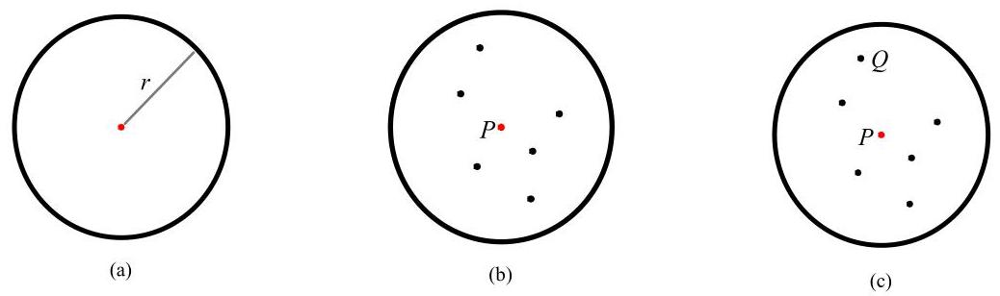

图 7.1 DBSCAN 算法概念

(2)核心点:如果给定对象 $r$ 邻域内的样本点数大于等于邻域密度阈值(MP)，则称该对象为核心对象。例如,假设 $\mathrm{{MP}} = 6$ ,则图中的点 $P$ 则为核心点,如图 7.1(b)所示。

(3)直接密度可达:若点 $Q$ 在核心点 $P$ 的 $r$ 邻域内，则称 $Q$ 是从 $P$ 出发可以直接密度可达 (通俗理解, $P$ 和 $Q$ 是直系亲属),如图 7.1(c)所示。例如,图中点 $Q$ 在核心点 $P$ 的 $r$ 邻域内,则 $P$ 和 $Q$ 为直接密度可达。当然,圈内的其他 5 个点与 $P$ 也是直接密度可达的。

(4)密度可达:若存在 ${P}_{1},{P}_{2},\cdots ,{P}_{m}$ 是一列核心点， ${P}_{i + 1}$ 是从 ${P}_{i}$ 出发关于 $r$ 和 MP 直接密度可达的 (即 ${P}_{2}$ 在 ${P}_{1}$ 的圈内, ${P}_{3}$ 在 ${P}_{2}$ 的圈内, ${P}_{4}$ 在 ${P}_{3}$ 的圈内,以此类推, ${P}_{m}$ 在 ${P}_{m - 1}$ 的圈内),则称点 ${P}_{m}$ 是从 ${P}_{1}$ 出发关于 $r$ 和 MP 密度可达的,如图 7.2 所示。

(5)密度相连:如果样本集中存在点 $O$ ，使得点 ${P}_{m}$ 、 ${Q}_{m}$ 是从 $O$ 出发关于 $r$ 和 MP 密度可达的,那么点 ${P}_{m}\text{ 、 }{Q}_{m}$ 是关于 $r$ 和 MP 密度相连的,如图 7.2 所示。

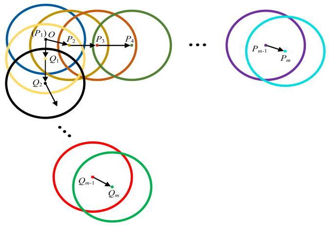

图 7.2 密度相连

从上可知, 邻域半径和邻域密度阈值是 DBSCAN 聚类中二个关键参数。基于邻域半径和邻域密度阈值, 由样本点的密度可达关系, 以最大密度相连的样本集合称为聚类, 而归类不到任何一个类簇的孤立点, 就视为异常样本或者噪声样本点。

SCADA 数据包括传感器异常和结冰等大量异常数据, 采用 DBSCAN 聚类方法进行识别, 它通过设置密度阈值来识别聚类。根据文献[13], 将 MP 设为 4 , 邻域半径计算如下:

$$
r = {\left( \frac{V \times  \mathrm{{MP}} \times  \gamma \left( {{0.5} \times  n + 1}\right) }{m\sqrt{{\pi }^{n}}}\right) }^{\frac{1}{n}} \tag{7.1}
$$

式中, $m$ 为实验数据集目标个数; $n$ 为实验空间维数; $\gamma \left( \text{ . }\right) {\text{ 为 }\text{ 阶 }\text{ 乘 }\text{ 函 }\text{ 数 }};V$ 是 $m$ 个目标形成的实验空间体积, 即

$$
V = \mathop{\prod }\limits_{{i = 1}}^{n}\left\{  {\max \left( {x}_{i}\right)  - \min \left( {x}_{i}\right) }\right\} \tag{7.2}
$$

这里, $\max \left( \text{ . }\right) {\text{ 为 }\text{ 最 }\text{ 大 }\text{ 价 }\text{ 值 }\text{ 函 }\text{ 数 }};\min \left( \text{ . }\right) {\text{ 为 }\text{ 是 }\text{ 最 }\text{ 小 }\text{ 价 }\text{ 值 }\text{ 函 }\text{ 数 }};{x}_{i}$ 是 $m$ -by- $n$ 实验数据矩阵中第 $i$ 列数据。

### 7.1.2 风电机组实例分析

图 7.3(a)为某年度一风电机组全年的风速-功率散点图, 剔除停机数据再利用 DBSCAN 聚类处理后得到的数据如图 7.3(b)所示。图 7.4(a) 为该年度风电机组全年的风速-转速散点图, 图 7.5(a)为 2 年后风电机组全年的风速-转速散点图。分别利用 DBSCAN 聚类处理得到前后两年该风电机组的风速-转速散点数据，如图 7.4(b)和 7.5(b)所示。

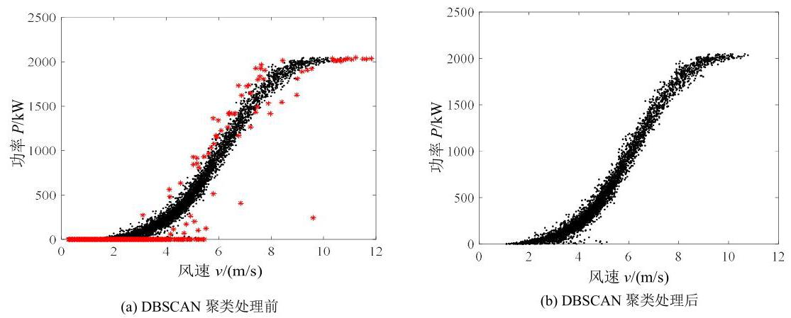

图 7.3 DBSCAN 聚类分析的风速-功率散点

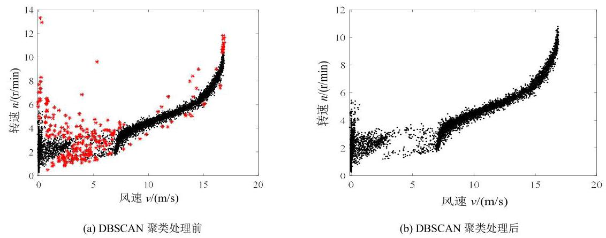

图 7.4 第一年 DBSCAN 聚类分析的风速-转速散点

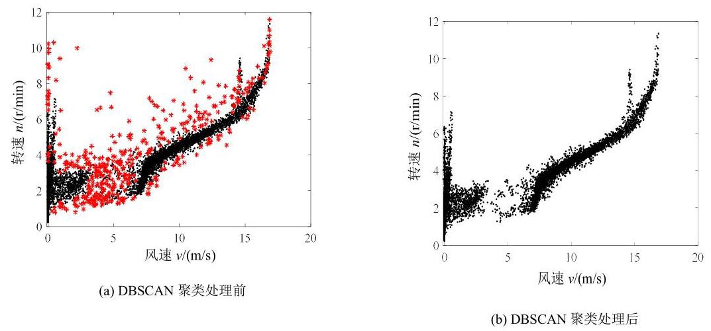

图 7.5 两年后 DBSCAN 聚类分析的风速-转速散点

## 7.2 基于随机森林的异常数据样本识别

### 7.2.1 随机森林算法的相关概念

随机森林(random forest, RF)是一种以决策树和投票(装袋)式算法结合的集成学习算法， 可用于数据组合分类，还可用于回归算法模型的构建，是一种有监督的智能学习方法。随机森林是一个包含多个决策树的分类器, 可使用已知的正常数据样本和异常数据样本进行训练构建一个集成学习模型, 模型能对未知数据样本进行正常或者异常识别。对于某些含有大量特征数据的样本识别, 随机森林能够很好地学习, 且对数据样本的分类效果很好。基于随机森林 RF 的异常数据样本识别原理, 就是直接应用经过正常数据样本和异常数据样本训练而成的随机森林集成学习模型识别出异常数据样本予以剔除。以下介绍随机森林算法的基本概念。

决策树:一般是将特征分为两类，持续决策分类而呈树形结构，如图 7.6 所示。决策树也是一种基本的分类器，也是一种有监督的学习分类方法。

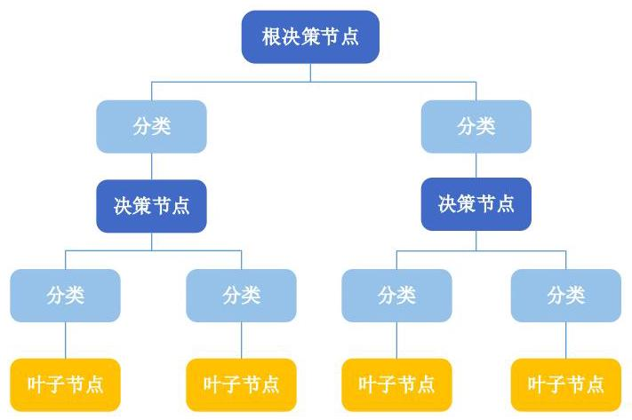

图 7.6 决策树

分类器:给定一个样本的数据，判定这个样本属于哪个类别的算法。

分裂:在决策树的训练过程中，需要一次次的将训练数据集分裂成两个子数据集，这个过程就称为分裂。

特征:在分类问题中，输入到分类器中的数据称为特征。

待选特征:在决策树的构建过程中，需要按照一定的次序从全部的特征中选取特征。待选特征就是在目前的步骤之前还没有被选择的特征的集合。

分裂特征:按照待选特征的定义，每一次选取的特征就是分裂特征，因为选出的这些特征将数据集分成了一个个不相交的部分，所以称为分裂特征。

随机森林指的是利用多棵决策树对样本进行训练并预测的一种分类器, 在其训练构建中实行样本数据的随机性选取和待选特征的随机选取, 并且其输出的类别是由个别树输出的类别的众数而定。

随机森林是一种由数据驱动的非参数分类方法, 在高维数据的分类问题上有较好的并行性和可扩展性。随机森林对于噪声和异常值由较好的容忍性, 解决了决策树过拟合问题。

### 7.2.2 随机森林分类法识别流程

随机森林是利用自助采样对数据集进行抽样，并对每一个样本集计算训练一个决策树， 每颗决策树都会对数据有一个分类结果，最终随机森林分类的结果由多个决策树分类后进行投票得出，如图 7.7 所示。

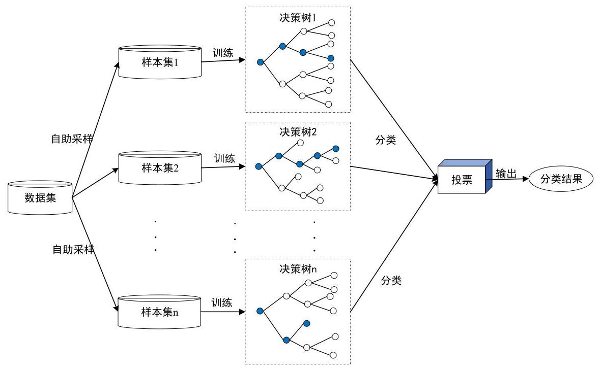

图 7.7 随机森林分类识别示意图

决策树利用特征测试条件基于不纯性指标, 将数据集分割成较小的数据集。不纯性是通过对实例的每个属性上的类别标签进行相关计算得出, 对它影响最大的属性被选为分割数据的基准属性, 并作为树的节点。基尼指数作为选择节点分裂特征的指标, 基尼指数越小, 集合中被选中的样本分错的概率越小,即纯度越高。假定样本集合为 $D$ ,随机从集合 $D$ 中抽取两个样本，其类别不一致的概率为基尼指数，表示为

$$
\operatorname{Gini}\left( D\right)  = \mathop{\sum }\limits_{{k = 1}}^{K}{p}_{k}\left( {1 - {p}_{k}}\right) \tag{7.3}
$$

式中, ${p}_{k}$ 表示选中的样本属于 $k$ 类别的概率, $\left( {1 - {p}_{k}}\right)$ 表示被分错的概率。如果用数据集 $D$ 中参数特征 $a$ 对数据集 $D$ 进行划分,则参数 $a$ 的基尼指数表示为

$$
\operatorname{Gini}\left( {D, a}\right)  = \mathop{\sum }\limits_{{i = 1}}^{l}\frac{\left| {D}_{i}\right| }{\left| D\right| }\operatorname{Gini}\left( {D}_{i}\right) \tag{7.4}
$$

式中, ${D}_{i}$ 表示样本集中 $D$ 根据特征 $a$ 划分的样本子集。从所有 $\operatorname{Gini}\left( {P,{a}_{j}}\right)$ ( ${a}_{j}$ 表示数据集中第 $j$ 个参数特征) 筛选出最小的划分,这个划分点就是样本集合 $D$ 的最优划分点。由此, 决策树集成随机森林的步骤如下:

(1)采用自助采样法方法从原始训练集中，有放回的随机采样 $n$ 个新的采样集，并构建 $n$ 个分类决策树。每次未被抽到的样本组成袋外数据,可以用于对决策树的性能进行评估, 计算模型的预测错误率, 称为袋外数据误差。同时利用袋外数据可以对决策树的强度和决策树之间的相关性进行估计, 进而得到随机森林泛化误差的估计。

(2)如果有 $M$ 个特征，则在每一棵树的每个节点处随机抽取 ${m}_{try}$ 个特征 $\left( {{m}_{try}, M}\right)$ ，然后在该节点处, 计算每个特征的基尼指数, 并按照最小原则, 选择一个基尼指数最小的特征对该节点进行节点分裂, 从而对数据集进行了分割。

(3)在构建模型过程中，对样本集进行了随机抽样；而且，对每一个样本集的特征也进行了随机选择，每棵树最大限度生长，不做剪枝。

(4)决策树组合在一起构成随机森林，用随机森林对待分类数据进行分类，预测结果由决策树的投票决定。

随机森林智能识别异常数据样本是一个二分类问题，通常根据混淆矩阵来评价识别模型的分类性能优劣, 其中混淆矩阵是样本的真实标签和预测标签之间的关系矩阵, 如下表 7.1 所示。TP 代表正确的预测了该样本，且样本预测值是正样本；TN 代表正确的预测了该样本， 且样本预测值是负样本; FP 代表真实样本是负样本, 被预测成正样本; FN 代表真实样本是正样本，被预测成负样本。

表 7.1 混淆矩阵

<table><tr><td rowspan="2">实际情况</td><td colspan="2">预测结果</td></tr><tr><td>正例</td><td>反例</td></tr><tr><td>正例</td><td>TP</td><td>FN</td></tr></table>

根据混淆矩阵中四种预测结果之间的数量关系，可以计算获得正常数据样本被预测正确的概率、异常数据样本被预测错误的概率和所有被预测的样本预测正确的概率。前两者用来分析评价建模过程, 后者作为评价模型的性能指标, 一般称之为识别准确率。识别准确率用于评估随机森林模型的识别性能，数值越大，说明模型分类性能越好。在构建随机森林模型的过程中，决策树的个数、树的最大深度、树的根节点划分方法、随机选择的最大特征数等参数需要人工选择，这些称之为超参数的参数对模型识别性能有重要的影响，需要对这些超参数进行调节和优化, 以便获得最优的超参数组合、性能优良的随机森林识别模型。

### 7.2.3 风电机组实例分析

1. 数据样本集与模型构建

选取某风电场 2MW 直驱风电机组 SCADA 数据，数据集中的每个数据元组为 10 分钟平均值数据, 时间尺度为两年。功率是风电机组最关键的特性, 既可以作为判断风电机组正常运行的条件，也可以作为判断数据样本是否正常的条件，以便构造数据样本集。

随机森林识别模型构建中需要大量的具有正常或者异常数据样本标签的原始样本集，而且要求样本集中正常或者异常样本数量是平衡, 以便获得性能优良的识别模型。原始样本集包括正常数据样本和异常数据样本, 它们可以通过如下两个途径获得: 一是根据现场实际运行状态，在 SCADA 数据样本标注出正常和异常样本；二是根据类似于前面拉依达准则、 DBSCAN 聚类识别方法, 标注出正常数据样本和异常数据。这里, 以功率作为判断数据样本是否正常的关键指标,基于 SCADA 数据分布,将功率数据在 $\left( {\mu  - {3\sigma },\mu  + {3\sigma }}\right)$ 外的数据样本称之为异常数据样本，而将功率数据在 $\left( {\mu  - {0.5\sigma },\mu  + {1.5\sigma }}\right)$ 内的数据样本作为正常数据样本。一般来说, 就数据样本总量而言, 风电机组 SCADA 系统原始样本集中异常数据样本远少于正常数据样本，这里采用欠采样方法对不平衡的数据样本集进行欠采样预处理，从大多数正常数据样本中选择最具代表性的样本进行训练，尽可能减少随机欠采样带来的信息丢失问题。 最后, 形成一个平衡的样本数据集, 作为随机森林训练的数据学习, 如图 7.8 所示。由图可以看出，经过欠采样方法处理后样本数据集中正常类别数据数量与异常类别数据数量比达到平衡。

在应用平衡数据集训练和构建随机森林模型过程中, 将数据集划分为两部分, 数据集中 80%的数据作为训练集提供模型学习，数据集中 20%的数据作为测试集提供模型测试并用来评估模型的精度。在构建随机森林模型的过程中, 主要对影响随机森林精度较大的 4 个超参数做优化, 分别为决策树的个数、树的最大深度、树的根节点划分方法、随机选择的最大特征数参数进行人工选择。综合考虑数据集大小、模型运行时间成本以及模型精度，通过对比分析, 当决策树的个数为 80 、树深度为 10 时, 模型识别准确率达到最高 98.44%, 并且模型泛化能力较好。

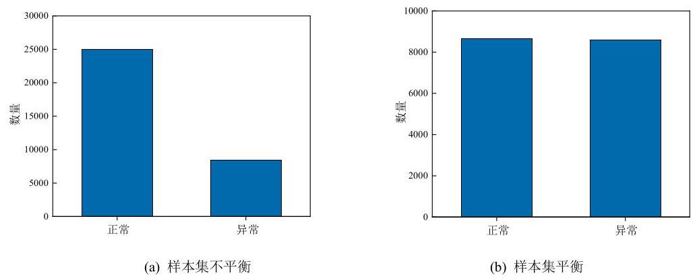

图 7.8 样本欠采样处理

3. 识别结果分析

为了方便比较, 首先应用 DBSCAN 方法, 对原始 SCADA 数据进行低密度数据处理, 得到风电机组风速和功率数据散点图, 如图 7.9(a)所示。从图可见, DBSCAN 方法不能够识别出高密度的限功率数据和停机数据。然后, 应用随机森林识别模型, 选取风速、功率特征及其相关的发电机转速、转矩、频率、桨距角和环境温度等特征数据, 对风电机组 SCADA 数据进行智能识别得到正常数据集, 如图 7.9(b)所示, 从图可以看出得到了较为满意的识别效果, 能够识别出 DBSCAN 方法不能识别出的高密度限功率数据和停机数据。

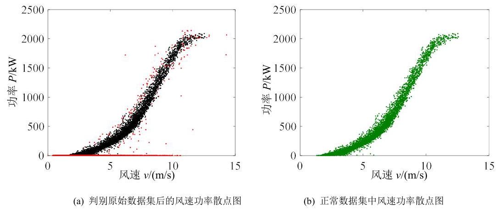

图 7.9 DBSCAN 和 RF 两种模型识别结果

风电机组部件温度是 SCADA 数据中重要组成部分, 影响因素较多而且机理非常复杂。 以主轴承温度、发电机定子温度数据为例, 将原始数据集和筛选后的正常数据集进行对比分析, 如图 7.8 所示。根据风电机组工作机理, 当风速大于切入风速时, 风电机组处于发电状态, 随着风速的增加, 风轮机械能增大, 发电机转矩增大, 运行频率增加, 进而主轴承温度和发电机定子温度也随之增加, 在风速-温度的散点图上应呈现出这种趋势性, 图 7.10(a)和 (b)分别为数据筛选前 SCADA 系统原始数据集中一年的主轴承温度和发电机定子温度的散点图。从图可以看出，在温度主数据带下方，当风速大于切入风速 $3\mathrm{\;m}/\mathrm{s}$ 时，存在着多条横向的温度数据, 这是因为在这一年中, 存在着风速高于切入风速, 风电机组不发电或因故障停机的情况，属于异常数据。这里，采用随机森林 RF 分类识别方法剔除异常数据样本后获得的正常数据集中主轴承温度和发电机定子温度数据散点, 如图 7.10(c)和(d)所示。从图可以看出, 由于一年四季中温度的差异, 主轴承和发电机定子的正常温度主数据带在上下方向上具有一定的宽度, 同时由于一年之中, 中风速段的风出现概率要多于高风速段的风出现概率, 随着风速增加, 主数据带上下方向上宽度变小; 当风速高于切入风速, 随着风速的增加, 温度数据也呈现出增加的趋势性。这些都表明了随机森林 RF 分类方法对于风电机组温度数据有着优良的数据识别筛选效果。

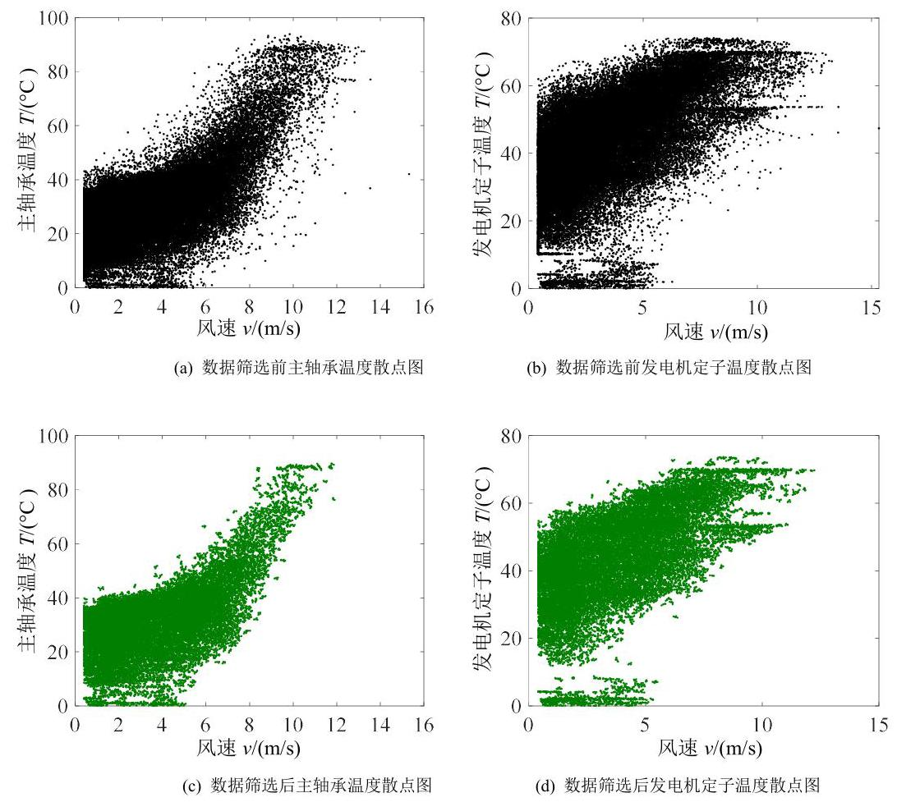

图 7.10 风电机组温度数据随机森林 RF 数据识别筛选效果

## 7.3 基于 RWSSA-AANN 的风电机组风速异常数据识别

风电 SCADA 数据来源于风电机组不同位置的传感器，其运行状态异常不但直接影响到数据正确性和质量, 而且会对风电机组正常运行产生负面影响, 甚至危及设备和人员的安全。 开展基于 SCADA 异常数据识别, 对风电机组正常运行和 SCADA 数据处理具有重要意义。 统计表明, 风电机组部件故障中传感器故障超过 14%, 而与传感器相关的系统故障也超过 40%。一般来说, 风电机组本体运行状态异常、风电机组传感器运行状态异常都将导致 SCADA 数据异常。若果风电机组本体运行状态正常, 其传感器运行状态识别与 SCADA 异常数据识别就成为了同一个问题。本节以风电机组风速计及其 SCADA 风速数据为例, 采用动态时间规整算法 (dynamic time warping, DTW) 选择一组风速强相关的风电机组作为机群; 然后建立基于随机行走改进的麻雀搜索算法进行自动优化联想神经网络(random walk improved sparrow search algorithm-autoassociative artificial neural networks, RWSSA-AANN) 模型, 机群中的风电机组台数即为模型的输入节点数, 模型的输入为各风电机组的实际风速, 模型的输出为风速的预测值, 利用模型识别风电机组风速计异常状态及其引起的风速异常数据样本。

### 7.3.1 风电场的风电机组分类

#### 7.3.1.1 风速相关性评价

DTW 是一种衡量两个时间序列之间的相似度的算法, 通过把时间序列进行延伸和缩短, 来计算两个时间序列性之间的相似性。如图 7.11 所示, 实线代表时间序列, 虚线表示两个时间序列之间的相似点。设两个时间序列分别为 $X$ 和 $Y$ ,其长度分别为 $\left| X\right|$ 和 $\left| Y\right|$ ,略径定义为 $W$ 。归整路径的形式 $W = {W}_{1},{W}_{2},\cdots ,{W}_{K}$ ,其中 $\operatorname{Max}\left( {\left| X\right| ,\left| Y\right| }\right)  \leq  K \leq  \left| X\right|  + \left| Y\right|$ 。 ${W}_{k}$ 的形式为 $\left( {i, j}\right)$ ,其中 $i$ 表示的是 $X$ 中的 $i$ 坐标， $i = 1,2,\cdots ,\left| X\right| , j$ 表示的是 $Y$ 中的 $j$ 坐标， $j = 1,2,\cdots ,\left| Y\right|$ 。归整路径 $W$ 必须从 ${W}_{1} = \left( {1,1}\right)$ 开始,到 ${W}_{K} = \left( {\left| X\right| ,\left| Y\right| }\right)$ 结尾,以保证 $X$ 和 $Y$ 中的每个坐标都在 $W$ 中出现,并且 $W\left( {i, j}\right)$ 的 $i$ 和 $j$ 必须是单调增加的,使图 7.11 中的虚线不会相交。通过 DTW 计算这些相似点之间的距离和，它来衡量两个时间序列之间的相似性。

距离最短的归整路径表达式如式 (7.5) 所示,表示当前格点距离 $\operatorname{Dist}\left( {i, j}\right)$ ,也就是点 $i$ 和 $j$ 的欧式距离 (相似性) 与可以到达该点的最小的邻近元素的累积距离之和,用符号 $L$ 表示:

$$
W\left( {i, j}\right)  = \operatorname{Dist}\left( {i, j}\right)  + \min \left\lbrack  {W\left( {i - 1, j}\right) , W\left( {i, j - 1}\right) , W\left( {i - 1, j - 1}\right) }\right\rbrack \tag{7.5}
$$

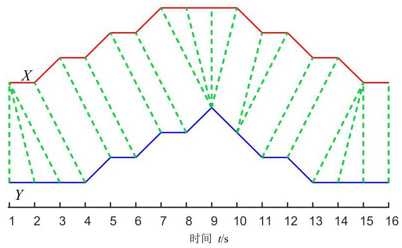

图 7.11 两个时间序列之间的相似性

#### 7.3.1.2 风电机组群确定

数据来源为某风电公司提供的 23 台风电机组的 SCADA 风速数据, 风速测量采用转杯式机械旋转风速仪,其测量范围为 0~50m/s，精确度为 $\pm  2\%$ 测量值，分辨率为<0.02 m/s。数据记录了该风场 10000 组正常数据。把每台风电机组的风速看成是一个时间序列, 通过计算风电机组风速之间的 $L$ 值得到风电机组群。把 1 号风电机组的风速作为基准序列 $X$ ,其他风电机组的风速作为序列 $Y$ ,分别计算 $X$ 和 $Y$ 之间 $L$ 的平均值, $L$ 越小表示相似性越高, $L$ 的平均值如表 7.2 所示。

表 ${7.2L}$ 平均值

<table><tr><td>编号</td><td>2 号</td><td>3 号</td><td>4 号</td><td>5 号</td><td>6 号</td><td>7 号</td><td>8 号</td><td>9 号</td></tr><tr><td>\(L\)</td><td>0.516</td><td>0.750</td><td>0.345</td><td>0.452</td><td>0.670</td><td>0.945</td><td>1.402</td><td>0.963</td></tr><tr><td>编号</td><td>10 号</td><td>11 号</td><td>12 号</td><td>13 号</td><td>14 号</td><td>15 号</td><td>16 号</td><td>17 号</td></tr><tr><td>\(L\)</td><td>0.885</td><td>1.095</td><td>1.108</td><td>1.049</td><td>1.256</td><td>1.318</td><td>1.226</td><td>2.077</td></tr><tr><td>编号</td><td>18 号</td><td>19 号</td><td>20 号</td><td>21 号</td><td>22 号</td><td>23 号</td><td></td><td></td></tr><tr><td>\(L\)</td><td>1.729</td><td>1.244</td><td>1.698</td><td>1.255</td><td>2.001</td><td>1.473</td><td></td><td></td></tr></table>

从表 7.2 中可以看出，1 号与 2、3、4、5、6、7、9、10 号风电机组 $L$ 值相对较小，因此对这几台风电机组进一步分析，表 3.2 为所选各风电机组之间 $L$ 的平均值。从表 7.3 中把 $L$ 的平均值为 0.8 的范围内 1 号、 2 号、 3 号、 4 号、 5 号、 6 号风电机组作为一个风电机组群。

表 7.3 各风电机组之间的 $L$ 平均值

<table id="cross-table-2"><tr><td rowspan="2">编号</td><td colspan="11">\(L\) 平均值</td></tr><tr><td colspan="2">1</td><td colspan="2">2</td><td>3</td><td>4</td><td>5</td><td>6</td><td>7</td><td>9</td><td>10</td></tr><tr><td>1</td><td colspan="2">0</td><td colspan="2">0.516</td><td>0.750</td><td>0.345</td><td>0.452</td><td>0.670</td><td>0.945</td><td>0.963</td><td>0.885</td></tr><tr><td>2</td><td colspan="2">0.516</td><td colspan="2">0</td><td>0.761</td><td>0.466</td><td>0.558</td><td>0.677</td><td>1.091</td><td>0.922</td><td>0.869</td></tr><tr><td>3</td><td colspan="2">0.750</td><td colspan="2">0.761</td><td>0</td><td>0.753</td><td>0.745</td><td>0.675</td><td>0.736</td><td>0.990</td><td>1.031</td></tr><tr><td>4</td><td colspan="2">0.345</td><td colspan="2">0.466</td><td>0.753</td><td>0</td><td>0.466</td><td>0.641</td><td>1.001</td><td>0.885</td><td>0.868</td></tr><tr><td>5</td><td colspan="2">0.452</td><td colspan="2">0.558</td><td>0.745</td><td>0.466</td><td>0</td><td>0.721</td><td>1.146</td><td>0.939</td><td>0.856</td></tr><tr><td>6</td><td colspan="2">0.670</td><td colspan="2">0.677</td><td>0.675</td><td>0.641</td><td>0.721</td><td>0</td><td>0.810</td><td>0.869</td><td>0.837</td></tr><tr><td>7</td><td colspan="2">0.945</td><td colspan="2">1.097</td><td>0.736</td><td>1.001</td><td>1.146</td><td>0.810</td><td>0</td><td>1.016</td><td>1.136</td></tr><tr><td colspan="2">9</td><td colspan="2">0.963</td><td>0.922</td><td>0.990</td><td>0.885</td><td>0.939</td><td>0.869</td><td>1.016</td><td>0</td><td>0.656</td></tr><tr><td colspan="2">10</td><td colspan="2">0.885</td><td>0.869</td><td>1.031</td><td>0.868</td><td>0.856</td><td>0.837</td><td>1.136</td><td>0.656</td><td>0</td></tr></table>

### 7.3.2 RWSSA-AANN 建模

自联想神经网络模型(autoassociative artificial neural networks, AANN)虽然在风电机组传感器故障诊断领域应用较少，但在其他领域的传感器故障诊断上得到广泛应用。但采用未优化的 AANN 模型会出现局部最优问题, 需要对 AANN 模型参数进行优化, 提升其性能。而麻雀搜索算法 (sparrow search algorithm, SSA) 可以提高 AANN 网络性能, 因为 SSA 在准确性, 收敛速度, 稳定性和鲁棒性等方面表现较好, 同时在高维运算时, 能很好的提高其正确率, 减少误差。在麻雀算法搜索之后用随机游走 (random walk, RW) 来改进, 通过改进麻雀的最优位置，实现随机游走对最优麻雀进行扰动，提高其搜索性。在随机游走开始迭代阶段, 其边界点相对较大, 有助于改善麻雀算法的全局寻优能力, 在迭代多次后, 游走边界缩小了，可以改善算法的最优位置局部搜索性，提高预测模型的性能，增加了准确度。

#### 7.3.2.1 AANN 模型

自联想神经网络由五层组成，主要包括输入层、映射层、瓶颈层、解映层和输出层。其模型如图 7.12 所示。AANN 模型的特点是输入数据与输出数据为近似值, 且维数相同, 映射层和解映层采用非线性传递函数 (S 型) 来进行映射。映射层、解映层和瓶颈层的节点数通过不停的尝试确定, 评价指标可以是运行时间、误差值等。其工作过程描述为, 输入数据经过映射层, 映射到高维度空间中, 然后通过瓶颈层进行压缩, 瓶颈层的节点数是希望尽可能的少, 再通过解映层进行解映, 并通过重建数据从原始空间维度输出来。

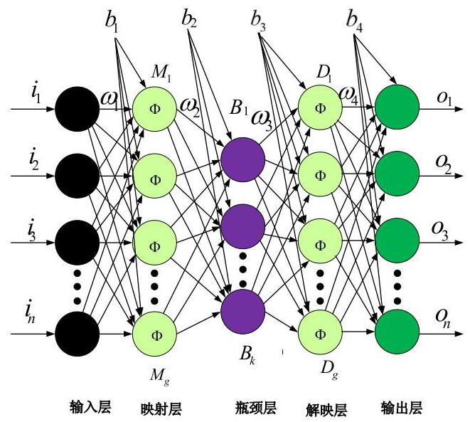

图 7.12 AANN 模型结构图

图 7.12 中, ${\omega }_{i}\left( {i = 1,2,3,4}\right)$ 表示各层之间的网络权值, ${b}_{j}\left( {j = 1,2,3,4}\right)$ 表示为各层的偏置参数。 可以得到每一层的输出向量表达式:

$$
{O}_{e} = {f}^{4}\left( {{\omega }_{4} \times  \mathop{\sum }\limits_{{a = 1}}^{g}{D}_{a}}\right)  + {b}_{4} \tag{7.6}
$$

$$
{D}_{a} = {f}^{3}\left( {{\omega }_{3} \times  \mathop{\sum }\limits_{{x = 1}}^{k}{B}_{x}}\right)  + {b}_{3} \tag{7.7}
$$

$$
{B}_{x} = {f}^{2}\left( {{\omega }_{2} \times  \mathop{\sum }\limits_{{a = 1}}^{g}{M}_{a}}\right)  + {b}_{2} \tag{7.8}
$$

$$
{M}_{a} = {f}^{1}\left( {{\omega }_{1} \times  \mathop{\sum }\limits_{{z = 1}}^{n}{i}_{z}}\right)  + {b}_{1} \tag{7.9}
$$

根据式 (7.6) 又式 (7.9) 可以得到 AANN 网络得到输出与输入的表达式:

$$
{O}_{n} = {f}^{4}\left\{  {{\omega }_{4} \times  \mathop{\sum }\limits_{{a = 1}}^{g}{f}^{3}\left\{  {{\omega }_{3} \times  \mathop{\sum }\limits_{{x = 1}}^{k}{f}^{2}\left\lbrack  {{\omega }_{2} \times  \mathop{\sum }\limits_{{a = 1}}^{g}\left( {{f}^{1}\left( {{\omega }_{1} \times  \mathop{\sum }\limits_{{z = 1}}^{n}{i}_{z}}\right)  + {b}_{1}}\right) }\right\rbrack   + {b}_{2}}\right\}   + {b}_{3}}\right\}   + {b}_{4} \tag{7.10}
$$

式中, ${f}^{1}\text{ 、 }{f}^{2}\text{ 、 }{f}^{3}\text{ 、 }{f}^{4}$ 分别为映射层、瓶颈层、解映层和输出层的传递函数; ${O}_{e}$ 表示的输出值, $e = 1,2,\cdots , n;{i}_{z}$ 表示为输入值。

${f}^{1}$ 和 ${f}^{3}$ 分别为映射层、解映层的传递函数,采用 logsig 函数,其表达式为

$$
{f}^{1}\left( x\right)  = \frac{1}{1 + {\mathrm{e}}^{-x}} \tag{7.11}
$$

${f}^{2}$ 为瓶颈层的传递函数,采用tansig函数,其表达式为

$$
{f}^{2}\left( x\right)  = \frac{1}{1 + {\mathrm{e}}^{-{2x}}} - 1 \tag{7.12}
$$

${f}^{4}$ 为输出层的传递函数，采用purelin函数，其表达式为

$$
{f}^{4}\left( x\right)  = x \tag{7.13}
$$

#### 7.3.2.2 SSA 模型

麻雀通常是群居的鸟类，它的能力主要是捕食和繁殖下一代，而这两种行为类似于捕食者和繁殖者, 麻雀算法建立模型的规则如下所述。设麻雀的位置矩阵表示为[14]

$$
M = \left\lbrack  \begin{matrix} {m}_{1,1} & {m}_{1,2} & \mathrm{\;L} & {m}_{1, j} \\  {m}_{2,1} & {m}_{2,2} & \mathrm{\;L} & {m}_{2, j} \\  \mathrm{\;M} & \mathrm{\;M} & & \mathrm{\;M} \\  {m}_{j,1} & {m}_{j,2} & \mathrm{\;L} & {m}_{j, j} \end{matrix}\right\rbrack \tag{7.14}
$$

式中, $i$ 是麻雀的数量; $j$ 是待优化变量的维数。

所有麻雀的适应度值可以表示为如下形式:

$$
{F}_{M} = \left\lbrack  \begin{matrix} f\left( {{m}_{1,1}\;{m}_{1,2}\;\text{ L }\;{m}_{1, j}}\right) \\  f\left( {{m}_{2,1}\;{m}_{2,2}\;\text{ L }\;{m}_{2, j}}\right) \\  \text{ M }\;\text{ M } \\  f\left( {{m}_{i,1}\;{m}_{i,2}\;\text{ L }\;{m}_{i, j}}\right)  \end{matrix}\right\rbrack \tag{7.15}
$$

式中, $f$ 表示适应度值。

在每次迭代的过程中, 发现者的位置更新表达式为

$$
{M}_{a, b}^{t + 1} = \left\{  \begin{array}{ll} {M}_{a, b}^{t}\exp \left( \frac{-a}{\rho  \cdot  n}\right) , & {P}_{2} < T \\  {M}_{a, b}^{t} + {Q\xi }, & {P}_{2} \geq  T \end{array}\right. \tag{7.16}
$$

式中, $t$ 表示当前迭代位置, $b = 1,2,\cdots , j;{M}_{a, b}^{t}$ 表示在迭代位置处于 $t$ 时第 $a$ 个麻雀所在第 $b$ 维; $\rho$ 是一个 $\left\lbrack  {0,1}\right\rbrack$ 范围之内的随机数; ${P}_{2}$ 表示警报值,它的范围是 $\left\lbrack  {0,1}\right\rbrack  ;T$ 是表示安全阈值, 其范围为 $\left\lbrack  {{0.5},1}\right\rbrack  ;n$ 为当前迭代次数; $Q$ 是服从正态分布的随机数; $\xi$ 表示 $1 \times  j$ 的矩阵。

当 ${P}_{2} < T$ 表示麻雀群周边没有威胁者,捕食者可以进入大范围的搜索模式; 当 ${P}_{2} \geq  T$ 时表示周边有威胁者，所有麻雀都需要迅速飞到其他安全区域去。搜寻者位置更新的表达式为

$$
{M}_{a, b}^{t + 1} = \left\{  \begin{matrix} Q\exp \left( \frac{{M}_{w}^{t} - {M}_{a, b}^{t}}{{a}^{2}}\right) , & a > \frac{i}{2} \\  {M}_{q}^{t + 1} + \left| {{M}_{a, b}^{t} - {M}_{q}^{t + 1}}\right| {A}^{ + }L, & a \leq  \frac{i}{2} \end{matrix}\right. \tag{7.17}
$$

式中, ${M}_{w}^{t}$ 是表示该群麻雀中最不理想的位置; ${M}_{q}^{t}$ 是捕食者占据的最佳位置; ${A}^{ + } = {A}^{\mathrm{T}}{\left( A{A}^{\mathrm{T}}\right) }^{-1}$ , $A$ 为一个 $1 \times  j$ 的矩阵，动态分配为 -1 或 1。

当 $a > i/2$ 时,表明适应性较差的第 $a$ 个搜寻者最有可能被饿死。在进行训练时,把整个种群中10%~20%的麻雀定义为警惕性高的麻雀，并且自动生成它们的初始位置，即

$$
{M}_{a, b}^{t + 1} = \left\{  \begin{array}{ll} {M}_{\text{ best }}^{t} + \zeta \left| {{M}_{a, b}^{t} - {M}_{\text{ best }}^{t}}\right| , & {f}_{a} > {f}_{g} \\  {M}_{a, b}^{t} + k\left( \frac{\left| {M}_{a, b}^{t} - {M}_{w}^{t}\right| }{\left( {{f}_{a} - {f}_{w}}\right)  + \varepsilon }\right) , & {f}_{a} = {f}_{g} \end{array}\right. \tag{7.18}
$$

式中, ${M}_{\text{ best }}^{t}$ 是群体的中心位置,代表着最佳值; $\zeta$ 是一个参数,表示控制步长的大小; $k$ 的值是任意得到的,其范围在 $\left\lbrack  {-1,1}\right\rbrack  ;{f}_{a}$ 是当前麻雀的适应度值; ${f}_{g}$ 和 ${f}_{w}$ 是当前麻雀的最佳适应度值和最差适应度值。

当 ${f}_{a} = {f}_{w}$ 时,若不加 $\varepsilon$ 值,则会使得整个分母为 0,因此为了防止这种情况的出现,在分母中加一个非常小的值。 ${f}_{a} > {f}_{g}$ 表示目前这只麻雀离群体的位置有点远,基本上处于群体的边缘外部; ${f}_{a} = {f}_{g}$ 表示位置中心的麻雀意识到有危险,要向其他地方靠近。

#### 7.3.2.3 RW 模型

随机游动过程的数学表达式为

$$
M\left( t\right)  = \left\lbrack  {0,\operatorname{cussum}\left( {{2r}\left( {t}_{1}\right)  - 1}\right) ,\mathrm{L},\operatorname{cussum}\left( {{2r}\left( {t}_{n}\right)  - 1}\right) }\right\rbrack \tag{7.19}
$$

式中, $M\left( t\right)$ 是随机游动步长的集合; cussum 是计算出的累积总和; $t$ 是随机行走步数; $r\left( t\right)$ 是一个随机函数，表达式如下:

$$
r\left( t\right)  = \left\{  \begin{array}{ll} 1, & \text{ rand } > {0.5} \\  0, & \text{ rand } \leq  {0.5} \end{array}\right. \tag{7.20}
$$

式中, $\operatorname{rand} \in  \left\lbrack  {0,1}\right\rbrack$ 。

由于可行区域中存在边界, 式 (7.19) 不能直接用于更新麻雀的位置。为了确保在可行区域内的随机行走, 需要由下式对其进行归一化:

$$
{M}_{i}^{t} = \frac{\left( {{M}_{i}^{t} - {E}_{i}}\right)  \times  \left( {{N}_{i}^{t} - {J}_{i}^{t}}\right) }{\left( {H}_{i} - {E}_{i}\right) } + {J}_{i}^{t} \tag{7.21}
$$

式中, ${E}_{i}$ 是第 $i$ 维变量随机游动的最小值; ${H}_{i}$ 是第 $i$ 维变量随机游动的最大值; ${J}_{i}^{t}$ 是第 $t$ 次迭代中第 $i$ 维变量的最小值; ${N}_{i}^{t}$ 是第 $t$ 次迭代中 $i$ 维变量的最大值。

#### 7.3.2.4 RWSSA-AANN 建模流程

AANN 是前馈神经网络，它通过大量的数据进行训练而成。训练过程中误差函数自动调整隐含层各节点传递函数的权值和偏置参数，而权值和偏置参数的取值关系到整个网络性能, 其值是随机产生的, 因此每次的结果都不一样。采用随机游走改进的麻雀搜索算法 (random walk improved sparrow search algorithm, RWSSA) 优化 AANN 权重和偏移参数, 然后对网络进行训练，将大大提高神经网络的性能，避免局部最优问题。RWSSA 在精度、 收敛速度、稳定性和鲁棒性方面优于遗传算法(genetic algorithm, GA)、粒子群优化算法 (particle swarm optimization algorithm, PSO) 等。

通过设置 AANN 模型参数, 采用 RWSSA 寻找出 AANN 神经网络的最优权值和偏置参数, 并应用到已经建好的 AANN 网络中去, 得到 RWSSA-AANN 模型, 模型建立流程如下。

(1)数据处理。选取风电机组正常运行的 SCADA 历史数据，并进行标准化处理，将风速归化到[0,1]区间, 以消除模型训练过程中每个数据之间绝对值差异的影响。

(2)设置 AANN 网络结构。输入输出层的节点数为风电机组群数 6。隐藏层节点数不同对训练结果影响很大, 其值根据不同节点训练结果的 MSE 值、运行时间和降噪水平 (reduce noise level, RNL) 来确定, 其中, MSE 值的计算表达式如下:

$$
\operatorname{MSE} = \frac{1}{m \times  n}\mathop{\sum }\limits_{{i = 1}}^{m}\mathop{\sum }\limits_{{j = 1}}^{n}{\left( {p}_{i}^{j} - {o}_{i}^{j}\right) }^{2} \tag{7.22}
$$

式中, $m$ 为训练 (或测试) 样本数量; $n$ 为训练 (或测试) 的输入维数; ${o}_{i}^{j}$ 表示第 $j$ 个训练 /测试样本的第 $i$ 个网络目标输入值; ${p}_{i}^{j}$ 是第 $j$ 个训练/测试样本的第 $i$ 个网络预测输出值, 二者的值越小, 模型的精度就越高。

降噪水平 RNL 如下计算:

$$
\mathrm{{RNL}} = \left( {1 - \frac{{\sigma }_{O}^{2}}{{\sigma }_{I}^{2}}}\right)  \times  {100}\% \tag{7.23}
$$

式中, ${\sigma }_{O}^{2}$ 是输出值的平均噪声方差; ${\sigma }_{I}^{2}$ 是输入值的平均噪音方差。

使用列文伯格-马夸尔特 (Levenberg-Marquardt) 算法作为训练方法, 将目标设置为 0.00001,时间设置为 ${100}\mathrm{\;s}$ ,学习率设置为 0.01。将 $R$ 设为输入层节点的数量,将 ${S}_{1}$ 设为映射层节点的数量,将 ${S}_{2}$ 设为瓶颈层节点的数量, ${S}_{3}$ 为解映层节点个数, $T$ 为输出层节点个数, 模型结构为 $R - {S}_{1} - {S}_{2} - {S}_{3} - T$ ,不同网络结构的训练结果如表 7.4 所示,综合分析选用模型结构为 6-23-5-23-6。

表 7.4 不同网络结构的训练结果

<table><tr><td>结构</td><td>MSE/ \({\left( \mathrm{m}/\mathrm{s}\right) }^{2}\)</td><td>Time/s</td><td>RNL</td></tr><tr><td>6-17-4-17-6</td><td>\({9.490} \times  {10}^{-7}\)</td><td>187.229</td><td>32.62%</td></tr><tr><td>6-15-3-15-6</td><td>\({9.764} \times  {10}^{-7}\)</td><td>191.332</td><td>28.34%</td></tr><tr><td>6-23-5-23-6</td><td>\({9.602} \times  {10}^{-7}\)</td><td>35.329</td><td>36.44%</td></tr><tr><td>6-19-5-19-6</td><td>\({9.658} \times  {10}^{-7}\)</td><td>55.0419</td><td>35.08%</td></tr><tr><td>6-19-4-19-6</td><td>\({9.618} \times  {10}^{-7}\)</td><td>46.001</td><td>33.72%</td></tr></table>

(3)定义 RWSSA 算法的维数 $k$ 。搜索空间维数由下式计算:

$$
k = R \times  {S}_{1} + {S}_{1} \times  {S}_{2} + {S}_{2} \times  {S}_{3} + {S}_{3} \times  T + {S}_{1} + {S}_{2} + {S}_{3} + T \tag{7.24}
$$

把模型结构参数代入式 (7.24) ，可以算得维数为 563。

(4)设置 RWSSA 的参数。根据多次实验选取迭代次数为 30 次；种群规模为 50 只； 捕食者的比例为 20%；安全阈值 ${T}_{1}$ 取 0.8；设意识到危险的麻雀数量为种群的 20%。

(5)确定 RWSSA 适应值。使用设置的参数，迭代计算 RWSSA 算法，并在每次迭代和排序结束时更新最佳适应值。

(6)位置更新。更新捕食者麻雀位置，更新加入麻雀位置，更新警戒者麻雀位置，计算适应度值并利用随机游走更新麻雀位置。

(7)最优解生成。是否满足停止条件，满足条件得到最优适应度值及全局最优位置集， 得到最优权值和阈值。若果不满足条件，重复执行第 6 步。

(8)优化 AANN 网络。把取得的最优权值和阈值赋予给式 (7.10) ，提高 AANN 模型的预测精度。

### 7.3.3 风速计故障识别

#### 7.3.3.1 故障阈值设定

AANN 模型的输入参数为风电机组群中 6 台风电机组的风速。假设 ${i}_{1} \sim  {i}_{6}$ 表示 6 个风速仪的实际数据输入， ${o}_{1} \sim  {o}_{6}$ 表示模型的 6 个预测输出，当输入无故障时，按照 AANN 模型的特点, 得到的输出数据与输入数据相等, 即误差平方和 (sum squares error, SSE) 理想值为 0 , 如式(7.21)所示, 但因为误差等因素的存在 SSE 只能接近于 0 。通过数据筛选得到 13000 组数据分成 12000 个训练数据和 1000 个测试数据, 当模型训练好之后, 利用测试数据进行测试, 然后把每次检测得到的 SSE 值组成一个序列, 这样得到全部 1000 组数据的 SSE 值。 由于 AANN 模型内部的非正交特性, 当某一个输入值异常时, 会影响到整个模型的输出值, 算出的 SSE 值也会变化较大。

$$
{SSE} = {\left( i - o\right) }^{\mathrm{T}}\left( {i - o}\right)  = \mathop{\sum }\limits_{{j = 1}}^{6}{\left( {i}_{j} - {o}_{j}\right) }^{2} \tag{7.25}
$$

式中, $i$ 为输入 AANN 模型的值; $o$ 为 AANN 的输出值; $j$ 为模型输入参数个数。判断风速仪的状态是根据得到的 SSE 序列值和阈值的关系来确定的，阈值的选取可以根据检测时间、 可靠性、灵敏性等来确定，根据训练结果求得 SSE 值，取 95%置信限下对应值作为故障判别阈值，值为 0.3373 。当 SSE 序列中值超过阈值时，判断状态异常。

#### 7.3.3.2 模拟故障设定与识别

通过模拟故障诊断，可以有效验证模型是否能够检测到设定的运行状态，并根据检测和故障设置判断模型是否满足要求。只有当模型能够有效地检测模拟故障时, 模型才能检测实际 SCADA 数据并获得正确的结果。

模拟风速仪异常状态是在正常的 1000 组测试数据中注入故障数据, 通过 RWSSA-AANN 模型来实现识别。模拟故障类型主要有固定偏差故障、失效故障和漂移故障。

图 7.13 为风电机组发生固定偏差故障图, 故障设置为 3 号风电机组第 600~720 个数的时间段加入幅值为 0.8m/s 的偏差。如图 7.13(c)所示, 3 号风电机组风速仪发生了偏差故障, 从 600 个数据也就是 5 月 30 日 17 点 15 分出现偏差故障, 对于偏差故障能快速检测出来, 无故障风电机组风速仪的 SSE 值除少数点外基本在检测阈值以下。

图 7.14 为风电机组发生失效故障图, 故障设置为 4 号风电机组第 200~350 个数的时间段风速缓慢降到 $2\mathrm{\;m}/\mathrm{s}$ 。从图 7.14(d)看出 4 号风电机组风速仪发生故障，在第 203 个数据即 5 月 27 号 23 点 05 分左右, 其故障被检测出来。而其他无故障风速仪的 SSE 值除几个点外基本保持在检测阈值以下。

图 7.15 为风电机组发生漂移故障, 故障设置是在 5 号风电机组第 400~580 个数的时间段注入增益为 0.02 的漂移。图 7.15(e)中曲线可以看出为风速仪漂移故障, 在 5 号风电机组风速仪在第 400 个点，即 5 月 29 号 7 点 55 分开始出现单个漂移故障，由于漂移变化很小， 在第 414 个数据其故障幅度达到最小检测值时被检测出来, 即 5 月 29 号 10 点 15 分左右, 而其他无故障传感器的 SSE 值基本保持在检测阈值以下。

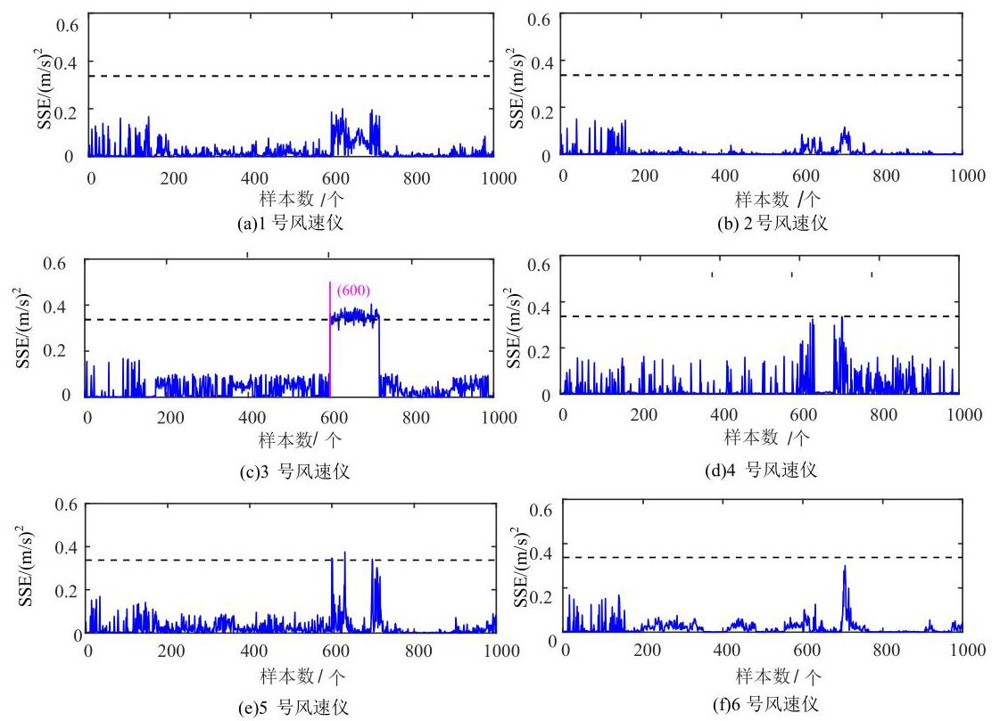

图 7.13 风电机组风速仪发生固定偏差故障图

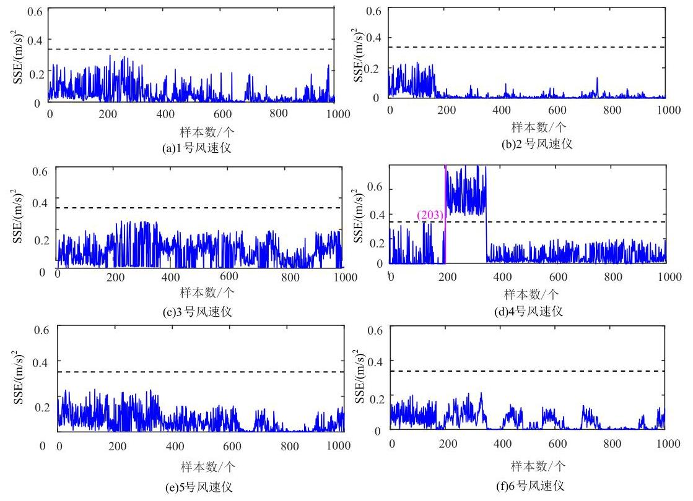

图 7.14 风电机组风速仪发生失效故障

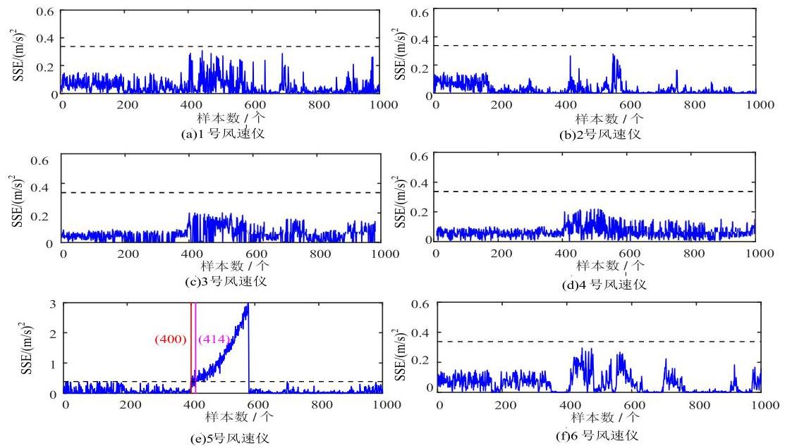

图 7.15 风电机组风速仪发生漂移故障

### 7.3.4 风电机组实例分析

#### 7.3.4.1 数据准备

实际数据由某风电公司提供，包括共五年的 10 分钟数据。因此，每年对应的每台风电机组的数据由 52560 组数据组成。但由于某些原因, 并非每年的数据都有 52560 组, 中间某些时间间隔的数据出现了缺失。为了保证测试的可靠性, 基于缺失值前后的数据, 使用拉格朗日插值法来补充缺失数据。

#### 7.3.4.2 风速计故障数据识别

利用训练好的模型识别处理过的数据, 当识别出故障状态时, 充分利用无故障风电机组风速仪风速、功率关系等进行验证识别结果正确与否。

利用模型识别 1~6 号风电机组风速仪失效故障，其结果如图 7.16 所示。在图 7.16(a)中， 1 号风电机组风速仪在第 25304 个数。图 7.16(e)中曲线显示 5 号风电机组风速仪在第 25339 个数。从对应的实际风速曲线可以明显的看出上述时间段, 风速仪发生了失效故障。由于运行过程中, 各种因素对风速仪的影响, 其他无故障风速仪有少数点超过了阈值, 可以不作处理。

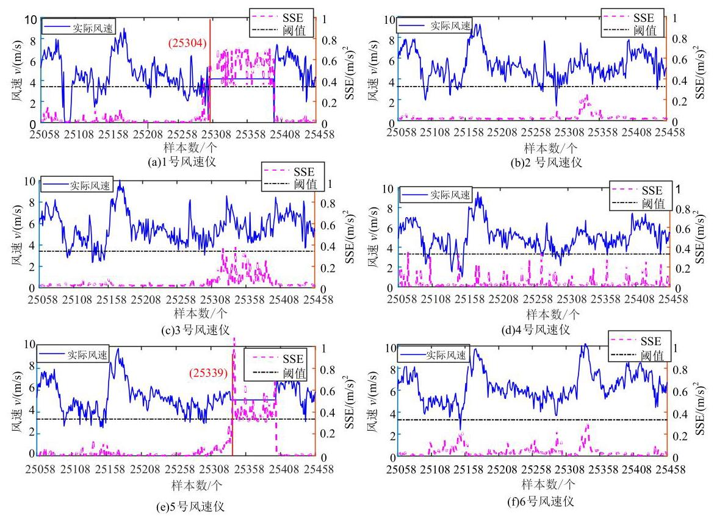

图 7.16 风电机组风速仪失效状态图

图 7.17 为某年度 $1 \sim  6$ 号风电机组风速仪状态识别图。如图 7.17(e)所示,3 号风电机组风速仪在第 42459 个点, 识别出发生故障, 通过曲线可以近似认为是固定偏差故障。图 7.17(g) 为对应的 3 号风电机组功率曲线图, 理论功率为风速通过三次样条插值法拟合而成的功率, 图 7.17(g)看出该时段理论功率持续大于实际功率, 而其他 5 台未发生故障的风电机组功率曲线图, 同时段实际功率是大于理论功率的。

图 7.18 为其他年度 $1 \sim  6$ 号风电机组风速仪状态识别图。如图 7.18(e)所示,3 号风电机组风速仪在第 16035 个点,识别出发生故障,通过曲线可以近似认为是漂移故障。图 7.18(g) 为对应的 3 号风电机组功率曲线图, 持续出现理论功率大于实际功率的情况, 与其他 5 台风电机组同时段的情况不同。在图 7.18(g)中, 实际功率与理论功率的差值与图 7.18(e)中 3 号风电机组的风速 SSE 值基本符合风速与功率的拟合值关系。

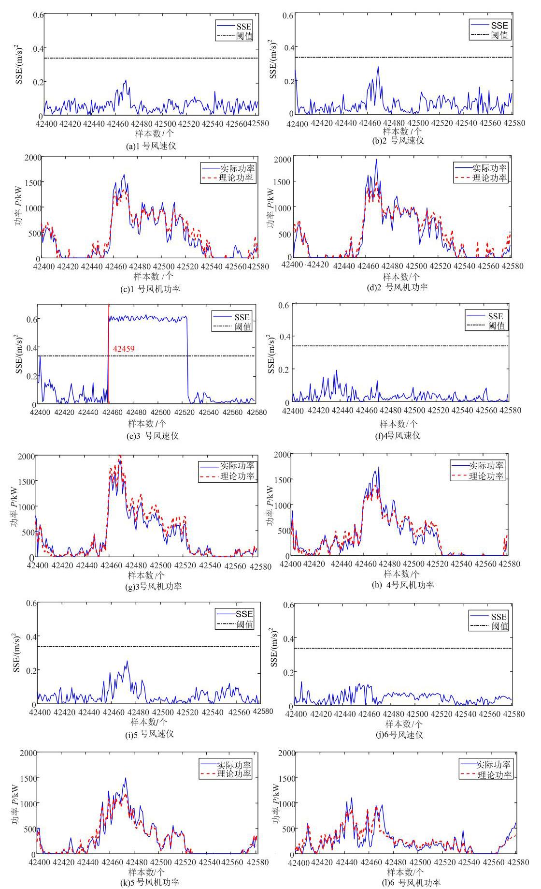

图 7.17 某年度风电机组风速仪状态图

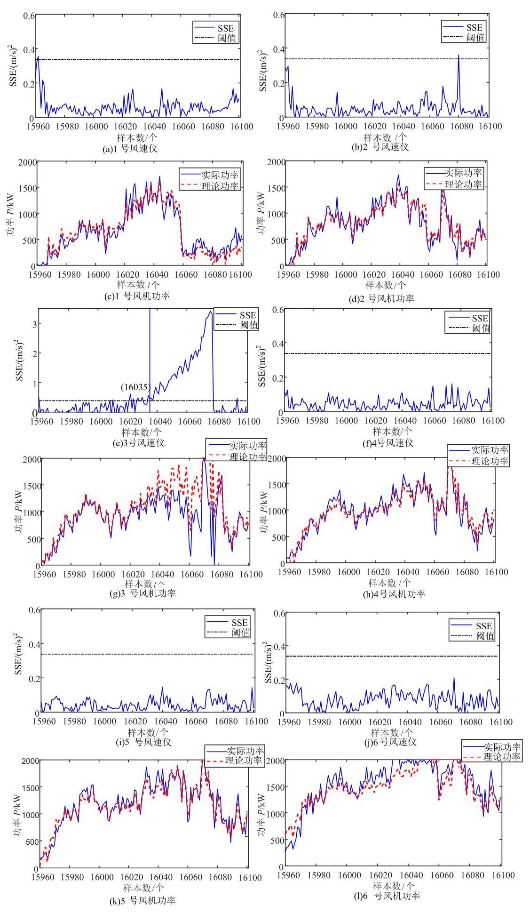

图 7.18 不同年度风电机组风速仪状态图

#### 7.3.4.3 三种方法比较分析

为了分析评价 RWSSA-AANN 模型的精度和准确性, 采用 AANN、GA-AANN、PCA 和 RWSSA-AANN 三种模型进行对比, 得到每一种模型的 MSE 值, 如表 7.5 所示。结果表明, RWSSA-AANN 模型的 MSE 值都小于 AANN、GA-AANN 和 PCA 模型。RWSSA-AANN 模型精度高、误差小, 有利于提高风电机组风速仪故障数据识别的准确性。

表 7.5 三种模型 MSE 值比较

<table><tr><td rowspan="2">算法模型</td><td colspan="2">MSE(m/s) \({}^{2}\)</td></tr><tr><td>2014/NO4</td><td>2016/NO3</td></tr><tr><td>AANN</td><td>0.0254</td><td>\({1.28} \times  {10}^{-4}\)</td></tr><tr><td>GA-AANN</td><td>0.055</td><td>\({7.07} \times  {10}^{-5}\)</td></tr><tr><td>PCA</td><td>0.056</td><td>\({1.47} \times  {10}^{-4}\)</td></tr><tr><td>RWSSA-AANN</td><td>0.0048</td><td>\({5.51} \times  {10}^{-5}\)</td></tr></table>

## 7.4 基于 TICC 算法的风电机组 SCADA 数据工况识别

面对复杂多变的风资源环境，风电机组设计了多种运行工况以便最大限度获取风能和减少损伤。风电机组不同的工况有着不同的控制模式和运行机制, SCADA 数据是表征风电机组运行参数和状态变化的数值。准确识别 SCADA 数据所处的风电机组工况, 是深入理解风电机组运行规律、评估风电机组运行状态的前提。针对风电机组高维 SCADA 时序数据的工况识别问题, 提出一种基于 Toplize 逆协方差聚类 (toplize inverse covariance clustering, TICC) 的风电机组运行工况自动分割聚类识别方法。首先, 从 SCADA 数据中选取风速、轮毂转速和桨距角等少量特定参数作为初始分割聚类对象, 分析特定参数的运行规律, 确定风电机组正常运行的六种工况。然后，选取一段特定参数的历史数据，利用 TICC 算法进行离线聚类分割, 获得聚类的最优特征参数; 将最优特征参数作为 TICC 算法的输入, 对新的特定参数时间序列数据进行聚类。最后根据特定参数时间序列的聚类结果, 对未进行分割的 SCADA 时序数据进行聚类处理、实现数据工况识别。

### 7.4.1 风电机组运行工况分析

由风力发电机的运行控制规律可知, 理论风速和功率、风速和轮毂转速 (发电机转速与轮毂转速运行规律一致，可等效替代)、风速和桨距角存在一定的函数关系。以某 2MW 双馈式风电机组为例,切入风速为 $3\mathrm{\;m}/\mathrm{s}$ ,切出风速为 ${25}\mathrm{\;m}/\mathrm{s}$ ,额定风速为 ${12}\mathrm{\;m}/\mathrm{s}$ ,它的理论运行控制曲线如图 7.19 所示。风速 $3 \sim  5\mathrm{m}/\mathrm{s}$ 区间为启动区,风电机组以设定的初始转速运行, 开始进行并网发电。随着风速的增加，转速不断增加，该阶段主要为了控制追踪风能系数最优曲线的工作点,捕获最大风能,将其称为最大风能追踪区。在风速为 $9\mathrm{\;m}/\mathrm{s}$ 时,由于风电机组的旋转部件受到机械强度的限制, 发电机达到额定转速, 以后直到达到最大功率点 12 $\mathrm{m}/\mathrm{s}$ ,转速将保持不变,桨距角继续增大,该区域为恒转速区。在最大风能追踪区与恒转速区, 存在一个短暂的过渡区域, 主要为降低转速的增速, 使得风电机组运行状态平稳, 该区域称为恒转速过渡区。风速达到额定转速 ${12}\mathrm{\;m}/\mathrm{s}$ 时,风速继续增大,桨距角不断增加,发电机转速继续维持额定转速不变, 功率保持在额定功率, 直至风速超过切出风速, 该区域称为恒功率区。在恒功率区与恒转速区之间存在一个过渡区域, 主要保证风电机组在运行状态转化时, 减少风轮的机械应力和输出功率的波动, 减少功率变化对传动链的瞬态冲击。根据上面的分析,综合风速-功率,风速-转速和风速-桨距角的控制规律 (不同 MW 级风电机组的理论运行规律一致)，将风电机组的运行规律分为 I~VI 六个工况，具体的名称和特征汇于表 7.6，各个区域对应的风速区间标注于图 7.19。最大风能追踪区、恒转速区和恒功率区是风电机组主要运行区域，但启动区、恒转速过渡区和恒功率过渡区为风电机组运行状态转化过渡区域，对风电机组机械应力和输出功率波动、传动链运行平稳性都有重要的影响。区分六个运行工况的特点，并以此准确匹配 SCADA 时间序列对应的数据段，对于深入了解风电机组运行机制和控制原理、准确开展风电机组状态评估和故障诊断具有重要作用。

表 7.6 运行状态分类说明表

<table><tr><td>编号</td><td>区域名称</td><td>特征描述</td></tr><tr><td>I</td><td>启动区</td><td>功率增加、最小转速、桨距角不变</td></tr><tr><td>II</td><td>最大风能追踪区</td><td>功率增加、转速直线上升, 桨距角不变</td></tr><tr><td>III</td><td>恒转速过渡区</td><td>功率增加、转速增速放缓、桨距角不变</td></tr><tr><td>IV</td><td>恒转速区</td><td>功率增加，额定转速、桨距角不变</td></tr><tr><td>V</td><td>恒功率过渡区</td><td>功率增速放缓、额定转速、桨距角增加</td></tr><tr><td>VI</td><td>恒功率区</td><td>额定功率、额定转速, 桨距角增加</td></tr></table>

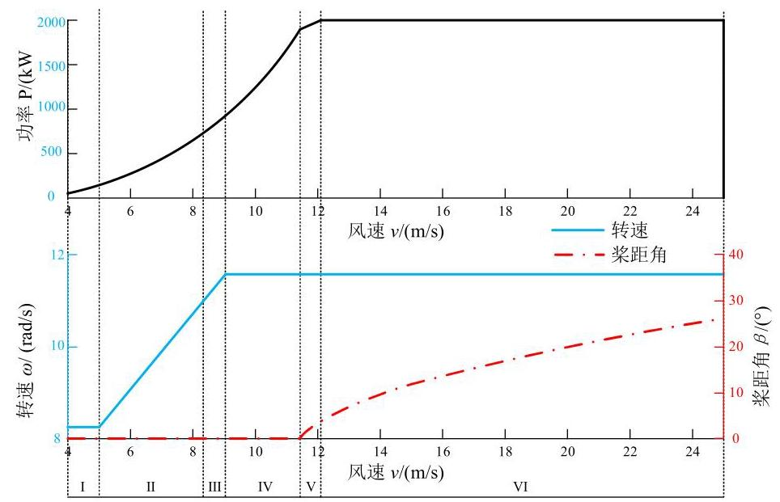

图 7.19 风电机组风速与转速、桨距角和功率的理论曲线

### 7.4.2 高维时序数据在线分割聚类算法

从 SCADA 数据中, 选取其中的风速、风向、功率、轮毂转速、振动、定子温度等 6 个关键参数, 将其时间序列绘制于图 7.20。从曲线的趋势可以看出, 一些参数的特征和模式类似, 如功率和转速; 而有些完全不同, 如振动和定子温度。对包含上百个参数的 SCADA 数据进行实时处理, 对算法和硬件都有很高要求。通过对风电机组运行规律分析, 可以将 SCADA 数据分为三类:第一类是环境参数，如风速、风向、环境温度和气压等；第二类是与输出能量转换过程相关的控制参数, 如功率、电压和电流等; 第三类是反映风电机组运行状态的体征参数，例如部件温度、振动等。环境参数和控制参数决定风电机组运行工况，体征参数是风电机组运行状态的一种体现。

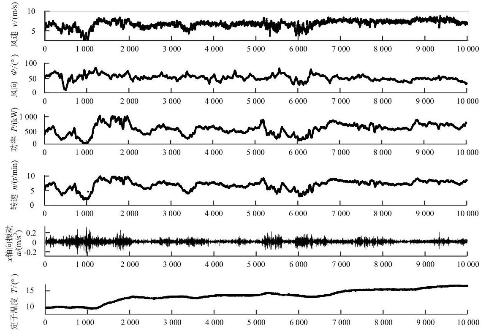

图 7.20 SCADA 系统中 6 组时间序列数据

1. Toplize 逆协方差聚类算法

Toplize 逆协方差聚类算法将多维时间信号的每个维度的时间戳组合成多个时间段, 考虑连续时间窗口内数据的维度和时间关系, 将每个时间段定义为可重复的状态。图 7.21 为时序分割示意图，纵坐标代表不同的传感器或者信道，横坐标为时间，窗口代表连续的时间段。

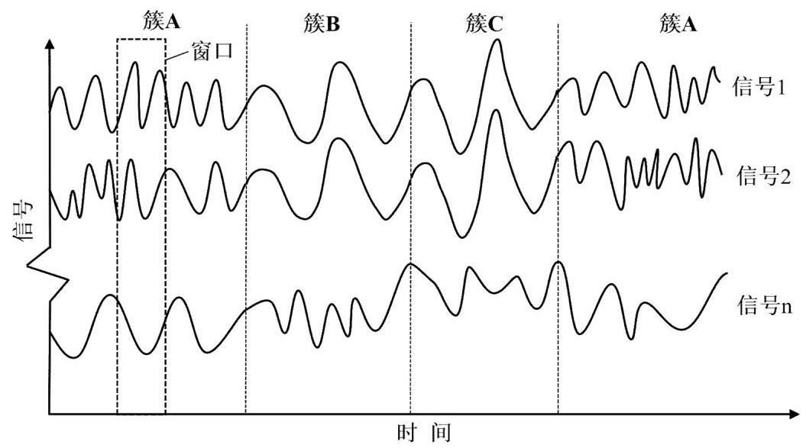

图 7.21 时序分割示意图

TICC 算法中的每个簇由相关网络或马尔可夫随机场 (markov random field, MRF) 定义, 描述每个簇内不同时间戳数据的相互联系。TICC 算法主要包括三个步骤: 首先, 将多维时间序列信号分为若干段; 然后, 根据信号段之间的相似性进行聚类; 最后, 得到总体聚类结果。TICC 算法解决的主要问题是如何获得每个聚类中不同变量之间的相互依赖关系, TICC 问题的数学模型具有如下形式[15]:

$$
\mathop{\operatorname{argmin}}\limits_{{\Theta  \in  T}}\mathop{\sum }\limits_{{i = 1}}^{K}\left\lbrack  {{\begin{Vmatrix}{\lambda }_{0}{\Theta }_{i}\end{Vmatrix}}_{1} + \mathop{\sum }\limits_{{{X}_{t} \in  {P}_{i}}}\left( {-\Pi \left( {{X}_{t},{\Theta }_{i}}\right)  + {\beta 1}\left\{  {{X}_{t - 1} \notin  {P}_{i}}\right\}  }\right) }\right\rbrack \tag{7.26}
$$

其中，似然函数展开为

$$
{11}\left( {{X}_{t},{\Theta }_{i}}\right)  =  - \frac{1}{2}{\left( {X}_{t} - {\mu }_{i}\right) }^{\mathrm{T}}{\Theta }_{i}\left( {{X}_{t} - {\mu }_{i}}\right)  + \frac{1}{2}\lg \det {\Theta }_{i} - \frac{n}{2}\lg \left( {2\pi }\right) \tag{7.27}
$$

式中, $\lambda  \in  {R}^{{nw} \times  {nw}}$ 是正则化参数; $n$ 为参数数量; $w$ 为窗口大小; ${\begin{Vmatrix}\lambda \mathrm{o}{\Theta }_{i}\end{Vmatrix}}_{1}$ 为哈达玛乘积的 1 范数惩罚; ${P}_{i}$ 为各个聚类簇的数据集, ${\lambda \lambda }{X}_{t},{\Theta }_{i}$ )是 ${X}_{t}$ 来自聚类 $i$ 的对数似然值; $\beta$ 是加强时间一致性的参数; $1\left\{  {{X}_{t - 1} \notin  {P}_{i}}\right\}$ 为检查相邻点是否被分配给同一聚类的指示函数; ${\mu }_{i}$ 为第 $i$ 类的经验平均值; $T$ 是对称分块 Toplize 矩阵的集合。

方程(7.27)是一个混合的组合连续优化问题,其中有两个重要的变量: 聚类数 $K$ 和逆协方差 $\Theta$ ,这两个变量共同作用,使问题高度非凸。可以通过期望最大化 (expectation maximum, EM)的交替最小化算法来交替分配数据点到簇，然后更新簇参数。应用EM方法，方程(7.27) 的解可以分解为一个聚类分配问题和一个 Toplitz 图形套索问题。

TICC 问题中的聚类分配问题可以描述如下:

$$
\min \mathop{\sum }\limits_{{i = 1}}^{K}\mathop{\sum }\limits_{{{X}_{t} \in  {P}_{i}}} - \Pi \left( {{X}_{t},{\Theta }_{i}}\right)  + {\beta 1}\left\{  {{X}_{t - 1} \notin  {P}_{i}}\right\} \tag{7.28}
$$

这个 TICC 问题的子问题被称为集群分配问题, 方程 (7.28) 运用线性规划, 寻找从时间戳 1 到 $T$ 的成本路径,并求出最短路径。

TICC 问题的另一个子问题, Toplitz 图形套索问题数学表示如下:

$$
\mathop{\sum }\limits_{{{X}_{t} \in  {P}_{i}}} - {11}\left( {{X}_{t},{\Theta }_{i}}\right)  =  - \left| {P}_{i}\right| \left( {\lg \det {\Theta }_{i} + \operatorname{tr}\left( {{S}_{i}{\Theta }_{i}}\right) }\right)  + C \tag{7.29}
$$

由于很难直接解决这个问题, 方程 (7.29) 可以根据每个聚类的逆协方差矩阵的特征转化为如下凸优化问题:

$$
\left. \begin{matrix} \min  - \lg \det {\Theta }_{i} + \operatorname{tr}\left( {{S}_{i}{\Theta }_{i}}\right)  + \frac{1}{\left| {P}_{i}\right| }{\begin{Vmatrix}\lambda  \circ  {\Theta }_{i}\end{Vmatrix}}_{1} \\  \text{ s.t. }{\Theta }_{i} \in  T \end{matrix}\right\} \tag{7.30}
$$

上式可以写成增广拉格朗日函数的形式:

$$
\left. \begin{matrix} \min  - \lg \det \Theta  + \operatorname{tr}\left( {S\Theta }\right)  + \parallel \lambda  \circ  Z{\parallel }_{1} \\  \text{ s.t. }\Theta  = Z, Z \in  T \end{matrix}\right\} \tag{7.31}
$$

这个问题可以通过交替方向乘子法 (alternating direction method of multipliers, ADMM) 来优化解决。TICC 在一个循环中迭代解决集群分配问题和图形套索问题, 更新参数直到获得整体最优解。

#### 7.4.2.2 模型参数的选择原则

在 TICC 算法中, 需要设置的重要模型参数为窗口大小和聚类的数量。TICC 算法不是单独划分每个时间点的数据, 而是在每个时间点组装短的窗口或子序列, 并将它们连接成一个维度的向量, 这个向量的长度为信号输入的数量乘以窗口大小。Toeplize 约束假设每个簇的结构是恒定的, 但窗口大小仍然是一个相关参数, 窗口大小代表了连续时间点之间的相关性。窗口越大，窗口时间数据越长。窗口大小过大导致很难正确划分出时间段边界上的点, 而且它们在边界上是恒定的假设也可能不成立。因此, 窗口大小一般被认为是相对较小的, 在选择时应综合考虑相关应用领域的经验、观测的粒度和平均预期长度, 可以通过贝叶斯信息量 (Baysian information criterion, BIC) 分速或交叉验证来确定。与许多聚类算法一样, 聚类的数量是 TICC 的另一个重要参数, 具体数值可以通过不同的方式确定: 如果有标记的真实数据集，可以根据真实数据集的标签来确定聚类的数量，或者根据相应领域专家的先验知识来确定聚类的理论数量。如果没有这样的数据, 可以使用 BIC 分数、宏观 F1(marco-F1) 分数或轮廓系数进行选择。一般来说, 聚类数量的确定值往往取决于应用场景本身, 主要是因为除了聚类的准确性之外, 还需要给出数据的可解释性, 通过对理论运行特性曲线的分析, 确定聚类数为 6 。

#### 7.4.2.3 时序数据在线分割聚类算法

风电 SCADA 高维时间序列数据的在线聚类识别流程如图 7.22 所示, 主要包括四个部分:运行规律分析、TICC 方法的离线学习、TICC 方法的在线分割和聚类识别结果的映射。

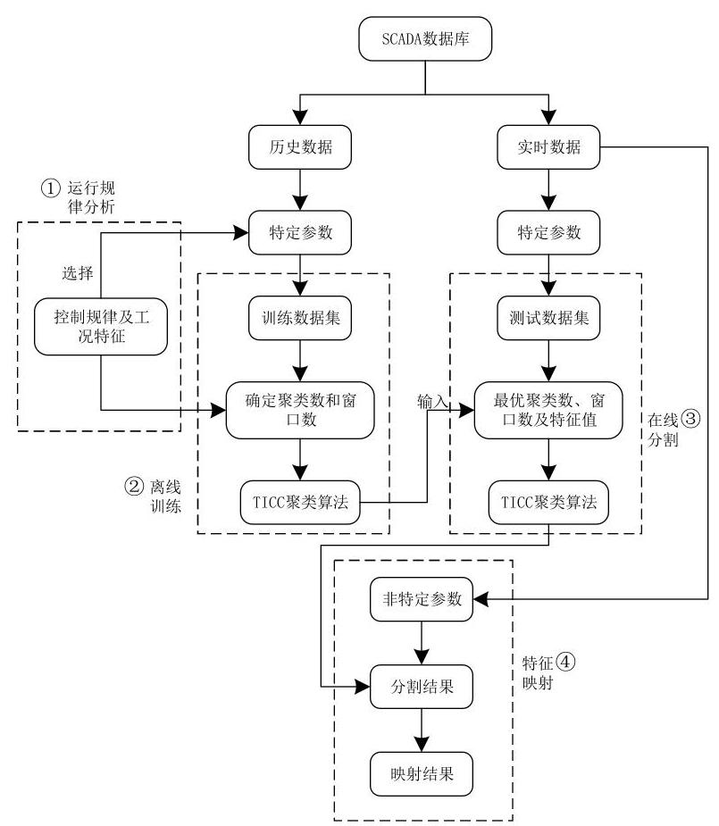

图 7.22 时序分割聚类方法流程图

1) 风电机组运行规律分析

从 SCADA 系统中环境和控制参数数据中选取风速、转速(轮毂转速或发电机转速)、 桨距角和输出功率等参数, 作为分段数据集使用。分段数据集中的一些历史数据被用作 TICC 方法的离线训练的目标数据。对于历史数据集, 选择至少连续数天的秒级数据, 在此期间要求风电机组处于正常运行状态, 能够连续数小时发电, 并且工况良好。对风电机组的风速- 功率、风速-转速和风速-桨距角的理论运行规则进行分析，并与分析要求相结合，确定需要分类的运行状态特征和需要划分的群组数量, 为之后的划分和聚类提供初始参数值。

#### 7.4.2.2 TICC 方法的离线训练

离线训练的目的是为了获得训练数据集下的最佳特征参数, 并在最佳参数下验证离线分割结果。

(1)参数输入与数据堆叠。根据控制规律的特点和工作条件，将聚类数和窗口大小输入训练数据集。基于窗口大小的数据建立原始数据集:

$$
{X}_{\text{ orig }} = \left\lbrack  \begin{matrix} {x}_{1,1} & {x}_{1,2} & \mathrm{\;L} & {x}_{1, n} \\  {x}_{2,1} & {x}_{2,2} & \mathrm{\;L} & {x}_{2, n} \\  \mathrm{\;M} & \mathrm{M} & & \mathrm{M} \\  {x}_{n,1} & {x}_{n,2} & \mathrm{\;L} & {x}_{n, n} \end{matrix}\right\rbrack \tag{7.32}
$$

堆叠后数据集: $X = {\left\lbrack  {X}_{1},{X}_{2},\mathrm{\;L},{X}_{m}\right\rbrack  }^{\mathrm{T}}$ ,其中 ${X}_{i} = \left\lbrack  {{x}_{i - w + 1,1 : n},{x}_{i - w + 2,1 : n},\mathrm{\;L},{x}_{i,1 : n}}\right\rbrack  ,\;i \geq  w, X$ 为 $m \times  {nw}$ 形式的矩阵。

(2)初始化聚类结果。最初的聚类结果是用高斯混合模型对叠加数据进行聚类，并根据如下两式计算数据的原始和叠加均值的结果。

原始均值为

$$
{E}_{o} = \left\lbrack  {\frac{1}{a}\mathop{\sum }\limits_{{i = 1}}^{a}{x}_{i,\left( {w - 1}\right) n},\frac{1}{a}\mathop{\sum }\limits_{{i = 1}}^{a}{x}_{i,\left( {w - 1}\right) n + 1},\mathrm{\;L},\frac{1}{a}\mathop{\sum }\limits_{{i = 1}}^{a}{x}_{i,{wn}}}\right\rbrack \tag{7.33}
$$

堆叠均值为

$$
{E}_{s} = \left\lbrack  {\frac{1}{a}\mathop{\sum }\limits_{{i = 1}}^{a}{x}_{i,1},\frac{1}{a}\mathop{\sum }\limits_{{i = 1}}^{a}{x}_{i,2},\mathrm{\;L},\frac{1}{a}\mathop{\sum }\limits_{{i = 1}}^{a}{x}_{i,{wn}}}\right\rbrack \tag{7.34}
$$

式中, $a$ 表示数据矩阵行数。

(3)模型参数优化。将原始均值、堆叠均值和堆叠数据集等参数作为输入，利用 ADMM 算法进行参数优化,得到每个簇的逆协方差矩阵 ${\Theta }_{i}$ 。目标问题为

$$
\min  - \lg \det \Theta  + \operatorname{tr}\left( {S\Theta }\right)  + \parallel \lambda  \circ  Z{\parallel }_{1} \tag{7.35}
$$

将得到的逆协方差矩阵整形为 Toplize 协方差矩阵形式:

$$
{\Theta }_{i} = \left\lbrack  \begin{matrix} {A}^{\left( 0\right) } & {\left( {A}^{\left( 1\right) }\right) }^{\mathrm{T}} & {\left( {A}^{\left( 2\right) }\right) }^{\mathrm{T}} & \mathrm{L} & {\left( {A}^{\left( w - 1\right) }\right) }^{\mathrm{T}} \\  {A}^{\left( 1\right) } & {A}^{\left( 0\right) } & {\left( {A}^{\left( 1\right) }\right) }^{\mathrm{T}} & 0 & \mathrm{\;M} \\  {A}^{\left( 2\right) } & {A}^{\left( 1\right) } & {A}^{\left( 0\right) } & 0 & \mathrm{\;O} \\  \mathrm{M} & O & O & O & O \\  \mathrm{M} & O & {A}^{\left( 1\right) } & {A}^{\left( 0\right) } & {\left( {A}^{\left( 1\right) }\right) }^{\mathrm{T}} \\  {A}^{\left( w - 1\right) } & \mathrm{L} & {A}^{\left( 2\right) } & {A}^{\left( 1\right) } & {A}^{\left( 0\right) } \end{matrix}\right\rbrack \tag{7.36}
$$

(4)聚类分配更新。通过线性规划来解决最短路径问题，找到一条从时间戳 1 到 T 的成本路径，以便更新聚类分配结果，线性规划方法如图 7.23 所示。

目标问题为

$$
\min \mathop{\sum }\limits_{{i = 1}}^{K}\mathop{\sum }\limits_{{{X}_{t} \in  {P}_{i}}} - {11}\left( {{X}_{t},{\Theta }_{i}}\right)  + {\beta 1}\left\{  {{X}_{t - 1} \notin  {P}_{i}}\right\} \tag{7.37}
$$

(5)迭代终止条件。重复步骤(3)和(4)，直到当前聚类分配的结果与上一次聚类分配的结果相匹配, 或者达到最大迭代次数。原始均值、叠加均值和逆协方差矩阵参数作为最优特征参数被输出。

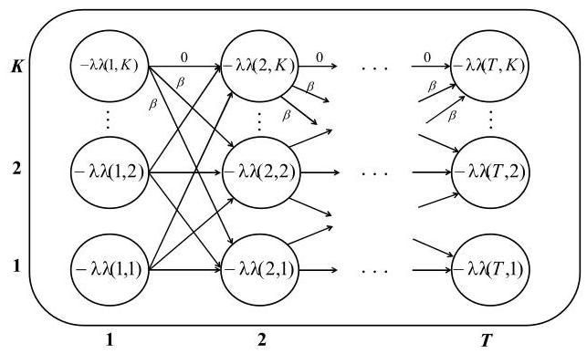

图 7.23 线性规划示意图

3) TICC 方法的在线分割

在线分割是基于离线训练中得到的最优特征参数进行的时序快速分割, 可以大大减少实时使用的时间。以离线训练中步骤 (5) 和 (1) 输出的最优特征参数、簇数和窗口数作为 TICC 方法在线分割的初始输入, 可以直接通过线性规划求解, 得到数据聚类结果。

#### 7.4.2.4 聚类结果映射

在使用 TICC 方法对一部分 SCADA 数据中的特定参数进行分割和聚类后, 可以得到分割后工况的标签和聚类特征。对于没有用 TICC 方法处理过的时间序列数据, 可以用聚类的结果进行特征映射, 实现聚类结果的映射。例如, 在使用 TICC 方法对风速、转速、桨距角和功率的时间序列进行分割和聚类后，可以将结果映射到温度和振动等参数上。

### 7.4.3 风电机组实例分析

#### 7.4.3.1 数据准备

采用某风电场 2.5MW 双馈式风电机组的秒级 SCADA 数据作为研究数据集。基于前面的风电机组控制规律分析，选取其中风速、发电机转速、功率和桨距角四个参数的时间序列数据作为聚类对象。对 SCADA 原始数据集进行空值充填、异常值过滤等预处理, 也不考虑停机、限功率等与理论运行特征曲线不一致的特殊工况。

#### 7.4.3.2 时序分割结果分析

根据风电机组风速-功率、风速-转速和风速-桨距角的分析, 设定聚类数为 6 。通过变参数计算不同窗口数下的宏观 F1 分数, 选取其中最优的一个参数, 最终获得最优的窗口数为 5。应用 TICC 方法对数据进行分割聚类, 将不同聚类簇用不同形状表示。由于时序分割结果用时序图表示比较抽象, 难以直接看出变量之间关联关系, 而风电机组参数间存在着紧密的联系, 为此绘制聚类前后的散点图于图 7.24~图 7.26 中, 不同形状对应的工况标签列于表 7.7 中。

表 7.7 数据聚类识别结果及其工况和标签

<table><tr><td>簇编号</td><td>1</td><td>2</td><td>3</td><td>4</td><td>5</td><td>6</td></tr><tr><td>形状名称</td><td>圆形</td><td>点</td><td>正方形</td><td>菱形</td><td>六角形</td><td>三角形</td></tr><tr><td>形状符号</td><td>0</td><td>-</td><td>口</td><td>♢</td><td>☆</td><td>\(\bigtriangleup\)</td></tr><tr><td>工况</td><td>I</td><td>II</td><td>III</td><td>IV</td><td>V</td><td>VI</td></tr></table>

将图 7.24 与图 7.25、图 7.26 合并观察, 可以分析分割聚类结果的合理性。由于聚类簇直接有重叠, 为了能更加清楚观察某一簇的特点, 单独将其绘制于图 7.27。圆形表示工况 I, 代表风电机组开始启动, 此时风速大于切入风速, 对应功率值较小, 转速并没有大幅变化, 桨距角也没有变化, 图 7.26(a)圆形散点与理论分析特征一致。图 7.24 实点部分功率逐渐增大, 转速开始增大, 桨距角值几乎恒定为零, 通过图 7.27(b)可以看到该簇大致趋势正好与表 7.6 中工况 II 相对应。图 7.25 和图 7.26 的正方形的变化情况似乎与工况 II 的变化情况一致, 与理论工况 III 的情况有所区别, 这是因为理论曲线只是一条线, 而实际采集到的数据具有高分辨率的特点, 将理论曲线中不太明显的斜率变化弱化了, 但通过图 7.27(c)可以看到该簇大致趋势变化情况依然与理论工况 III 相对应。图 7.24 菱形部分的功率依然是增大的, 但图 7.24 菱形部分的转速趋于稳定, 图 7.26 的部分的桨距角由稳定逐渐开始变化, 通过图 7.27(d)可以看到该簇大致趋势与工况 IV 所述情况一致。图 7.24 六角形部分功率趋于稳定, 图 7.25 六角形部分转速稳定, 图 7.26 六角形部分桨距角变化增大, 通过图 7.27 (e) 可以看到该簇大致趋势与工况 V 一致。图 7.24、图 7.25 各自三角形部分代表的功率、转速稳定，图 7.26 三角形部分代表的桨距角持续变化, 风电机组进入恒功率状态, 通过图 7.27 (f) 可以看到该簇大致趋势与工况 VI 情况一致。综合上面的分析可以看出, TICC 算法分割聚类的结果与理论工况分析的特征一致。

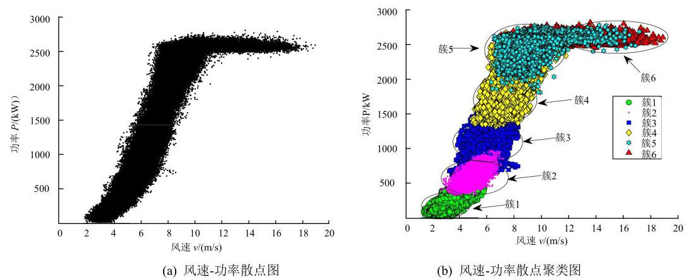

图 7.24 风速-功率聚类前后散点对比结果

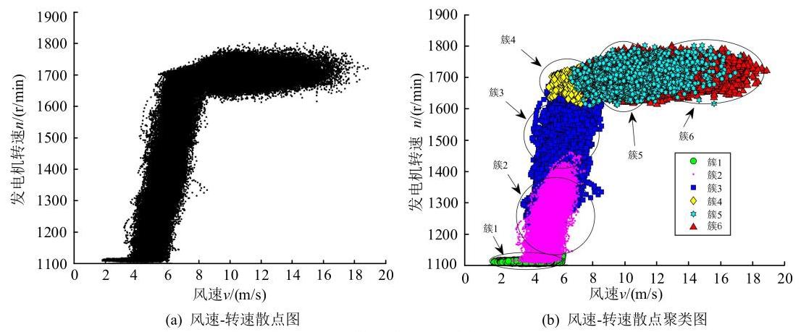

图 7.25 风速-转速聚类前后散点对比结果

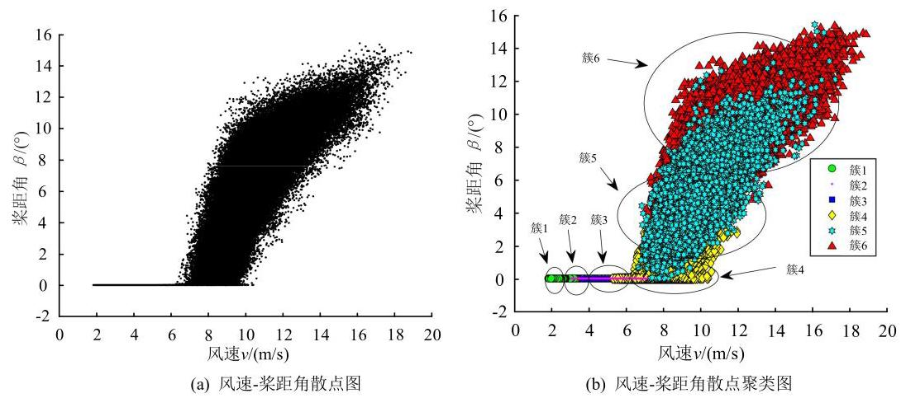

图 7.26 风速-桨距角聚类前后散点对比结果

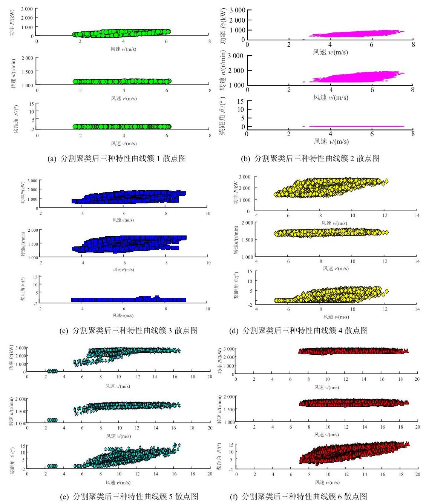

图 7.27 六种工况下风电机组风速与功率、转速、桨距角数据分割聚类结果

#### 7.4.3.3 数据聚类方法对比分析

将 TICC 算法与模糊 $C$ 均值聚类(fuzzy $C$ -means clustering，FCM)算法、高斯混合模型 (gaussian mixture model, GMM) 算法、 $K$ 均值(K-means)算法进行研究，来分析比较各聚类方法在处理多维时序数据聚类问题上的优劣。各聚类算法输入的数据集相同, 聚类数目设置相同，将各算法聚类结果转化为风速-功率散点图形式，如图 7.28-图 7.31 所示。由图 7.28 和图 7.30 可以明显看出, FCM 和 $K$ -means 算法得到的结果只是基于功率参数进行分段阈值划分, 没有考虑风速等其他参数对功率的影响, 不能反映出不同参数之间的联系, 且各簇之间没有交叉覆盖关系，无法反映工况之间的变化关系，这跟理论运行工况的特征不符。 由图 7.29 和图 7.31 可以看出, GMM 算法并不像 FCM 算法和 $K$ -means 算法一样以功率参数为基准进行分段划分, GMM 算法与 TICC 算法的结果都有交叉覆盖关系。但两种算法相比较, GMM 算法结果的各簇之间交叉范围小, 簇 5 与簇 6 之间的过渡不符合表 7.6 所示的工况 $\mathrm{V}$ ,即没有划分出恒功率过渡区,这与理论运行特性并不相符。由于高维时序数据的维度之间以及连续时间段内的数据是有着一定的联系的, 而传统聚类方法无法寻找出这种维度之间、连续之间所内含的关系, 也就因此无法对高维数据进行准确的聚类, 这个问题当维数越高时越明显。例如, $K$ -means 的传统聚类分析算法对低维时序数据进行聚类时,先在时间戳上随机选择 $k$ 个点,将数据根据相似程度进行聚类,然后重新计算聚类质心,再根据新的聚类质心对时间戳上的数据进行相似分析并聚类, 重复两个步骤直到达到精度为止, 计算出最终整个时间戳上数据的聚类结果, 最后对聚类的结果进行解释与评价。但这些传统的时序数据聚类方法在对高维时序数据进行聚类计算时得到的结果会存在精度低、聚类效果差等问题。 而 TICC 算法却充分考虑数据本身和数据之间的相关关系, 由此可以获得理想的聚类结构, 所以，对风电 SCADA 数据进行时间序列聚类的效果要优于其他几种算法。

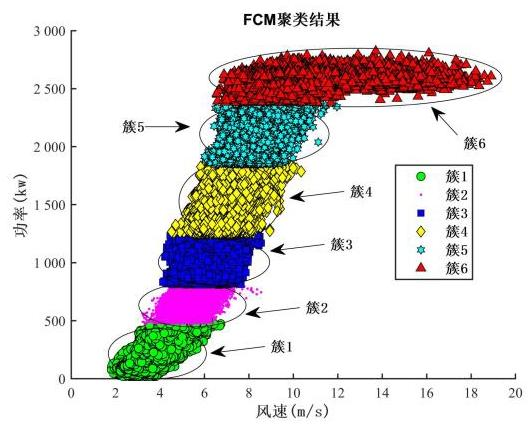

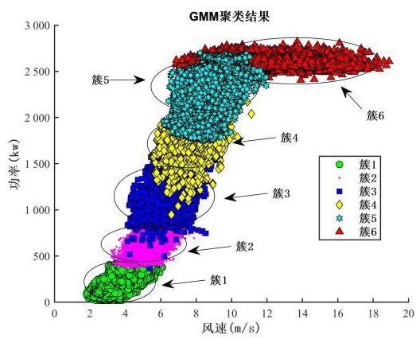

图 7.28 FCM 分割聚类结果图 7.29 GMM 方法分割聚类结果

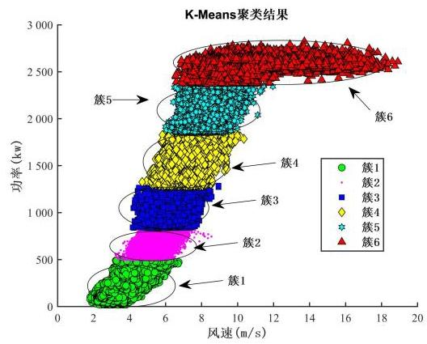

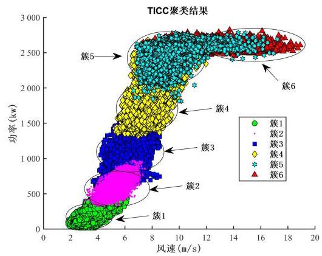

图 7.31 TICC 方法分割聚类结果

图 7.30 K-means 方法分割聚类结果

#### 7.4.3.4 TICC 方法应用

利用 TICC 方法, 遵循运行工况分析、TICC 方法的离线训练、TICC 方法的在线分割和聚类结果映射等步骤, 对某风电场 SCADA 数据 50 个参数进行分割聚类和工况标签。步骤 1 , 从 50 个参数中选取 4 个特征参数作为分割聚类初始对象, 理论分析参数之间的关系和包含的工况特征；步骤 2，从中选取一段时间的数据作为离线数据集，如选择其中 3 天的连续秒级数据对 TICC 方法进行训练; 步骤 3, 将计算得到的 TICC 特征值, 作为在线分割方法的输入, 对新的时序数据进行分割聚类和工况标签化处理; 步骤 4, 将聚类结果映射, 将 4 个完成分割聚类和工况标签化的参数的时序数据基于相同横向时间刻度纵向映射到其他 45 个维度的时间序列。

由于 SCADA 系统环境参数、体征参数和控制参数之间存在着一定的内部联系, 所以将特征参数数据在时间刻度上分割后, 可将分割结果根据时间区间直接映射到纵向的其他维度时间序列。为了说明分割聚类后的映射过程, 将一组分割映射后的风速、功率、轮毂转速、 桨距角、风向、 $x$ 轴振动、 $y$ 轴振动、定子温度和轮毂温度的时序数据绘于图 7.32 中。风速、 功率、轮毂转速和桨距角为利用 TICC 方法进行分割聚类的结果, 其余参数为未分割聚类的数据。将这九组时间序列的横轴统一为时间刻度, 分割结果中各个分割时间段的工况标签, 可以作为其余维度相同时间段的工况标签，避免重复的计算。

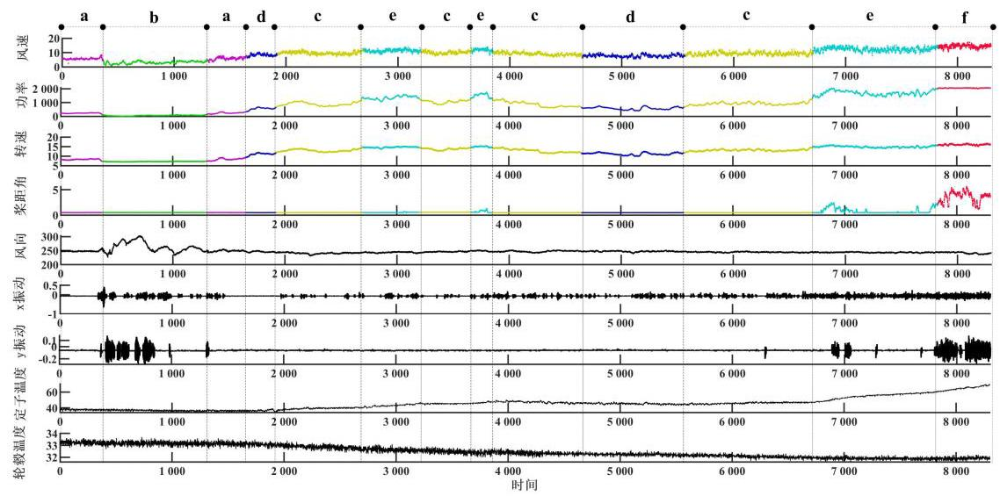

图 7.32 多维 SCADA 时序数据分割聚类结果

图 7.32 为在线分割运行状态映射结果图,其中不同区域用虚线划分,并将其用 $\mathrm{a} \sim  \mathrm{f}$ 字母进行标记。区域 $\mathrm{b}$ 对应于表 7.6 的运行工况 $\mathrm{I}$ ,该运行状态下风电机组启动, $x$ 和 $y$ 方向的振动变化幅度大, 温度变化不明显; 区域 a 对应于运行工况 II, 该状态下转速开始变化增大, $x$ 和 $y$ 方向的振动变化幅度减小,趋于平稳,温度变化不明显; 区域 $\mathrm{d}$ 对应于运行工况 III, $x$ 和 $y$ 方向的振动变化幅度小，温度变化不明显；区域 $\mathrm{c}$ 对应于运行工况 IV, $x$ 和 $y$ 方向的振动变化幅度不明显，定子温度逐渐上升，轮毂温度略微下降；区域 $\mathrm{e}$ 对应于运行工况 $\mathrm{V}$ ， $x$ 和 $y$ 方向的振动变化幅度增大,定子温度增大,轮毂温度略微下降; 区域 $\mathrm{f}$ 对应于运行工况 VI, $x$ 和 $y$ 方向的振动变化幅度明显,定子温度增大并将达到峰值,轮毂温度变化稳定。 通过对 SCADA 数据进行分割聚类, 实现了数据工况特征识别。为了分析该方法的计算效率, 以某风电场三天的秒级 SCADA 数据为例, 选取其中四个参数进行离线聚类耗时需一小时左右才能得到聚类结果, 但若将相同 SCADA 数据用训练好的模型进行在线分割, 同样维度与时间长度的 SCADA 数据只需一两分钟即可完成。由上分析可知, 本节提出的高维时序数据在线分割聚类算法, 充分考虑风电机组的运行规律和特点, 首先通过理论分析将高维问题进行降维, 尽量避免过高的维度, 同时在聚类数目选择时, 分析数据之间的物理关联性, 选择合适的聚类数目; 然后再利用 TICC 方法时采取离线训练和在线计算两个步骤, 这样可以有效保障在线的计算效率; 最后利用了简单的聚类结果映射的方法, 来处理高维分割聚类的问题。通过多个环节优化和缩减时间, TICC 方法避免了高维问题求解需要消耗的大量迭代求解时间，最终达到高维时序数据在线高效处理的目的。

## 7.5 参考文献

[1] 雷萌, 郭鹏, 刘博嵩. 基于自适应 DBSCAN 算法的风电机组异常数据识别研究[J]. 动力工程学报, 2021, 41(10): 859-865.

[2] Zhu A, Xiao Z, Zhao Q. Power data preprocessing method of mountain wind farm based on POT-DBSCAN[J]. Energy Engineering, 2021, 118(3): 549-563.

[3] Zhang L, Kai L, Wang Y, et al. Ice detection model of wind turbine blades based on random forest classifier[J]. Energies, 2018, 11(10): 2548.

[4] Vidal, Y, Pozo F, Tutiven C. Wind turbine multi-fault detection and classification based on SCADA Data[J]. Energies, 2018, 11: 3018.

[5] Pashazaden V, Salmasi F R, Araabi B N. Data driven sensor and actuator fault detection and isolation in wind turbine using classifier fusion[J]. Renewable Energy, 2018, 116:99-106.

[6] Zheng K, Li S B. Prediction of the remaining service life of bearing based on associative neural network[J]. Mechanical Design and Manufacturing, 2020, 11:203-206.

[7] Zhou L, Zhao Q, Wang X, Zhu A. Fault diagnosis and reconstruction of wind turbine anemometer based on RWSSA-AANN[J]. Energies, 2021, 14: 6905.

[8] 周凌, 赵前程, 石照耀, 等. 风电场风电机组机载风速仪状态自确认[J]. 太阳能学报, 2022, 43(11): 172-178

[9] 刘永前, 王飞, 时文刚, 等. 基于支持向量机的风电机组运行工况分类方法[J]. 太阳能学报, 2010, 31(9): 1191-1197.

[10] 董玉亮, 李亚琼, 曹海斌, 等. 基于运行工况辨识的风电机组健康状态实时评价方法[J]. 中国电机工程学报, 2013, 33(11): 88-95.

[11] Hallac D, Nystrup P, Boyd S. Greedy gaussian segmentation of multivariate time series[J]. Advances in Data Analysis and Classification, 2016, 13:727-751.

[12] 肖钊, 邓杰文, 刘晓明, 等. 基于运行规律和 TICC 算法的风电 SCADA 高维时序数据聚类方法[J]. 机械工程学报, 2022, 58(23): 196-207.

[13] Daszykowski M, Walczak B, Massart D L. Looking for natural patterns in data, Part 1: Density-based approach[J]. Chemometrics and Intelligent laboratory systems, 2001, 56(2): 83-92.

[14] Jian K X, Bo S. A novel swarm intelligence optimization approach: sparrow search algorithm[J]. Systems Science & Control Engineering, 2020, 8(1): 22-34.

[15] Hallac D, Vare S, Boyd S, et al. Toeplitz inverse covariance-based clustering of multivariate time series data[C]. Proceedings of the 23rd ACM SIGKDD International Conference on Knowledge Discovery and Data Mining, Halifax, Canada, 2017: 215-223.
