# 第9章 风电机组 SCADA 运行状态智能监测

风电机组运行状态监测是其预测性维护的前提基础, 直接影响风电机组发电效率和运行维护成本, 而基于 SCADA 数据进行风电机组状态监测又是目前最为简便和经济的途径。基于风电 SCADA 数据对风电机组及其部件的运行状态进行智能建模与监测引起了广泛关注 [1-6]，从风电机组主轴承、传动链等部件到风电机组整体，发展了众多的风电机组及其部件运行状态智能监测模型[7-13]；一些融合优化算法、注意力机制的深度学习模型，在风电机组运行状态监测方面表现出了良好的性能和应用效果 ${}^{\left\lbrack  {14} - {20}\right\rbrack  }$ 。由于风电机组异常或者故障时的数据样本相对于正常工作时的数据样本少得多, 特别是叠加风电场运营商和风电机组制造商技术与商业保密缘故, 异常或者故障数据样本更难获取, 风电 SCADA 数据通常是一种不平衡数据集。这样, 一方面, 依据 SCADA 异常或者故障数据构建的风电机组状态识别、故障诊断分类、聚类的智能模型, 因为模型的训练和学习不充分、模型的泛化能力较弱, 导致相关智能模型存在较大的局限性; 另一方面, 依据正常运行的 SCADA 数据进行风电机组运行状态监测大多以智能算法为基础, 学习和训练出反映状态的预测模型, 然后将预测与基准进行比较形成残差, 最后依据残差或者其映射函数、累积分布来评判风电机组运行状态。这些智能监测方法的效果既直接与残差预测精度相关，还与残差映射函数和累积分布相关，其本质上仍然包含着人的智能:因为所谓与众不同的 “异常” 状态，是人们怀疑这些状态并非随机的, 而是产生于完全不同的机制, 即风电机组及其部件出现异常故障。

本章以风电 SCADA 数据和智能预测为基础, 提出基于双注意机制-双长短时记忆 (dual attention-bi-directional long short-term memory, DA-Bi-LSTM) 模型的风电机组主轴承运行状态评估方法、基于 SCADA 数据的萤火虫改进麻雀搜索算法优化深度置信网络(firefly improved sparrow search algorithm-deep belief nets, FISSA-DBN) 的风电机组状态监测方法和基于非线性自回归外源模型 (nonlinear auto-regressive exogenous model, NARX) 网络的风电机组温度参数预测与运行状态监测方法。

## 9.1 基于 DA-Bi-LSTM 的风电机组主轴承运行健康状态评估

在风电机组中, 主轴承是最重要的部件之一, 本节提出一种基于双注意机制与双长短时记忆相结合 (DA-Bi-LSTM) 模型的风电机组主轴承运行状态评估方法。具体来说, 首先, 设计两个注意力计算模块来对不同输入参数和输入参数时间序列的重要特征分别进行计算； 然后, 将提取到的两个特征进行融合, 再利用 Bi-LSTM 模型构建块进行前后特征提取; 最后, 提取的特征用于重建输入数据。DA-Bi-LSTM 模型具有较高的预测精度和状态诊断过程的可解释性 ${}^{\left\lbrack  {18}\right\rbrack  }$ 。

### 9.1.1 主轴承状态参数选择

为了准确监测和评估风电机组主轴承运行健康状况，在最大风能跟踪阶段，考虑的数据参数有 11 个, 即风速、环境温度、主轴承温度、转子转速、输出功率、发电机运行频率、 发电机转矩、发电机定子温度、 5 秒偏航对风平均值、 $X$ 方向振动和 $Y$ 方向振动; 如果在风电机组恒功率阶段, 就需要加上桨距角数据参数, 即采用前述 12 个参数评估风电机组主轴承运行健康状况。以某 2MW 直驱式风电机组为例, 其切入、切出和额定风速分别为 3、25 和 ${11}\mathrm{\;m}/\mathrm{s}$ ，SCADA 系统以 $1\mathrm{\;{Hz}}$ 的频率收集数据并将其存储在 10 分钟的 CSV 文件中。从 3 个月的 SCADA 数据中, 提取最大风能跟踪阶段连续数据, 部分与风电机组主轴承运行状态相关的数据参数的散点图, 如图 9.1 所示。从图可以看出, 发电机定子温度、功率和振动是表征主轴承运行状态的核心参数。主轴承温度随着功率的增大而升高, 但在相同的功率值范围内，温度变化很大。例如，功率在 ${500}\mathrm{\;{kW}}$ 时，主轴承温度变化范围为 ${35}^{ \circ  }\mathrm{C} \sim  {60}^{ \circ  }\mathrm{C}$ 。发电机定子温度变化范围明显不同, 定子温度随着功率的增加而上升, 在功率为 ${500}\mathrm{\;{kW}}$ 时, 定子温度变化区间要小于主轴承温度的变化区间。 5 秒偏航对风平均值在功率为 ${500}\mathrm{\;{kW}}$ 时, 波动范围也很大，但是随着功率的增加而逐渐变小。两个方向的振动值也随着功率的增加振幅减小,但 $X$ 轴向振动表现更为明显,振动的平均值要高于径向; $Y$ 轴向振动表现较弱,振动的平均值要低于 $X$ 轴向。显然,这些参数之间复杂的非线性关系需要强大的非线性拟合模型才能实现。

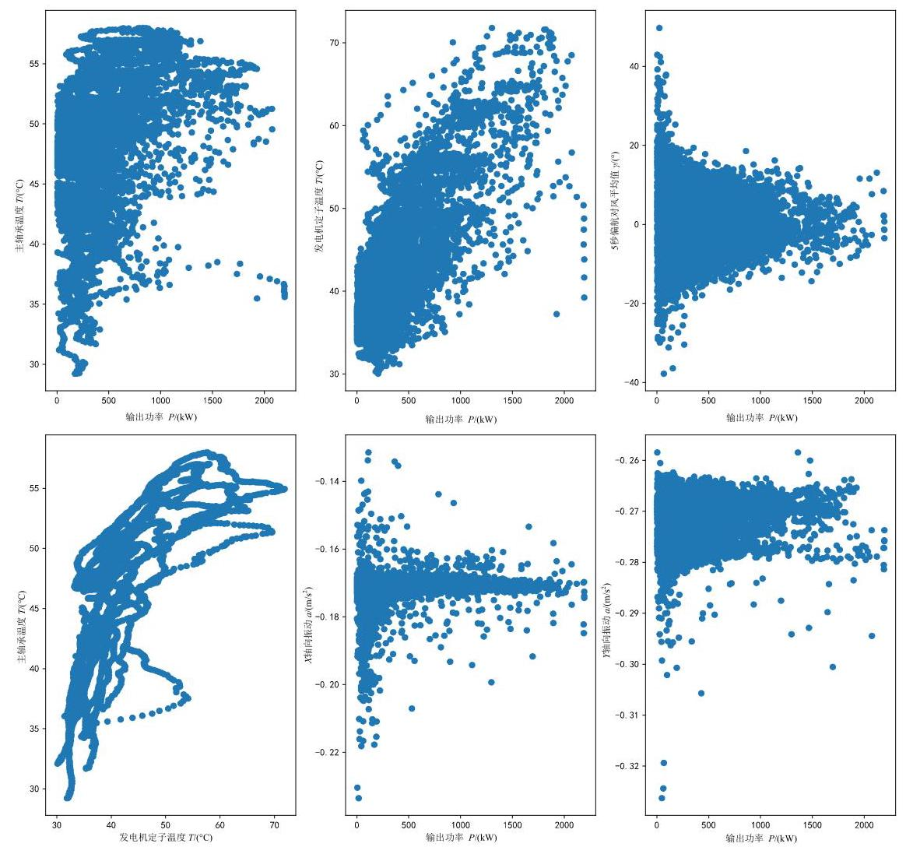

图 9.1 风电机组主轴承相关的部分数据参数散点图

### 9.1.2 DA-Bi-LSTM 模型构建

风电机组主轴承运行健康状态监测 DA-Bi-LSTM 模型的体系结构，如图 9.2 所示。体系结构由六个子模块组成，即输入模块、时序注意力计算模块、参数注意力计算模块、双注意力耦合模块、Bi-LSTM 模块和重构模块。

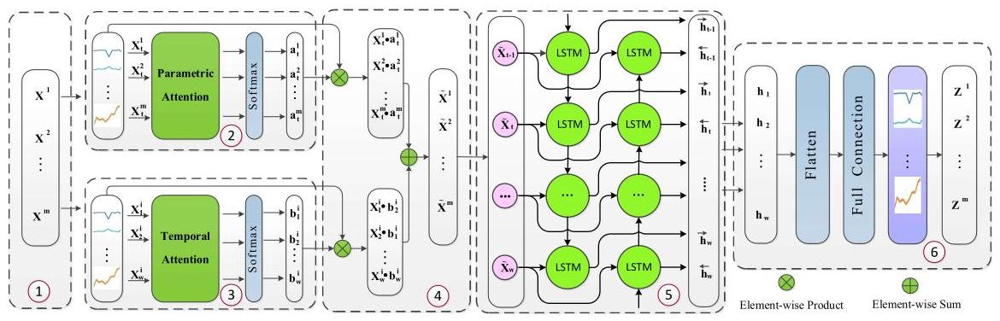

①输入模块，②参数注意力计算模块，③时序注意力计算模块，④双注意力融合模块，⑤Bi-LSTM 模块，⑥重构模块图 9.2 DA-Bi-LSTM 模型框架

#### 9.1.2.1 输入模块

将选取影响风电机组主轴承运行状态的 SCADA 数据参数作为模型输入矩阵 $X$ ，其定义为 $\left( {m, w}\right)$ 形式,其中 $m$ 是变量个数, $w$ 是窗口的长度。这里只讨论风电机组最大风能跟踪阶段, 考虑 SCADA 数据参数有 11 个, 即风速、环境温度、主轴承温度、转速、输出功率、 发电机运行频率、发电机转矩、发电机定子温度、 5 秒偏航对风平均值、 $X$ 方向振动和 $Y$ 方向振动。在恒功率阶段, 需要加上桨距角参数, 即共 12 个数据参数。即最大风能跟踪阶段 $m$ 取 11, $w$ 取 5,恒功率阶段 $m$ 取 ${12}, w$ 也取 5。这样,第 $i$ 时刻的输入向量可以描述为 $X\left( i\right)  = \left\lbrack  {{X}_{i}^{1},{X}_{i}^{2},\mathrm{\;L}{X}_{i}^{m}}\right\rbrack$ ,其中 $i = 1,2,\cdots ,5$ 。

#### 9.1.2.2 参数注意力计算模块

在风电机组主轴承运行状态数据参数的特征提取过程中, 为了区分不同状态参数的重要性, 对不同状态参数赋予不同的权重, 由参数注意力计算模块来计算每个时间步长内状态参数的权重 ${}^{\left\lbrack  {21},{22}\right\rbrack  }$ 。对于给定的输入向量 ${X}_{t} = \left\lbrack  {{X}_{t}^{1},{X}_{t}^{2},\mathrm{\;L},{X}_{t}^{m}}\right\rbrack$ ,运行状态参数注意力权重值可以计算如下:

$$
{p}_{t} = \sigma \left( {{W}_{t} \times  {X}_{t} + {d}_{t}}\right) \tag{9.1}
$$

$$
{a}_{t}^{j} = \exp \left( {p}_{t}^{j}\right) /\mathop{\sum }\limits_{{k = 1}}^{m}\exp \left( {p}_{t}^{k}\right) \tag{9.2}
$$

式中, ${p}_{t}$ 表示 $t$ 时刻的激活值; ${W}_{t}$ 表示权重系数矩阵; ${d}_{t}$ 表示偏置项; $\sigma$ 表示 sigmoid 函数; ${p}_{t}^{j}\text{ 、 }{p}_{t}^{k}$ 分别表示 $t$ 时刻第 $j$ 个状态参数和第 $k$ 个状态参数的权值; ${a}_{t}^{j}$ 是对第 $j$ 个状态参数的归一化注意力权重，是一种熵权的计算方法。

#### 9.1.2.3 时序注意力计算模块

风电机组主轴承运行状态参数值具有明显的时序特征，序列的当前值受其历史值的影响。 然而, 不同历史时刻状态参数值的贡献或影响是不同的, 时序注意力计算模块可以计算每个状态参数在多个连续时间步长上的权重值。对于给定的输入向量 ${X}^{i} = \left\lbrack  {{X}_{1}^{i},{X}_{2}^{i},\mathrm{\;L},{X}_{w}^{i}}\right\rbrack$ ,时序注意力权重分布值可以由下式表示:

$$
{e}_{t} = \sigma \left( {{W}^{i} \times  {X}^{i} + {d}^{i}}\right) \tag{9.3}
$$

$$
{b}_{t}^{i} = \exp \left( {e}_{t}^{i}\right) /\mathop{\sum }\limits_{{k = 1}}^{w}\exp \left( {e}_{t}^{k}\right) \tag{9.4}
$$

式中, ${W}^{i}$ 表示权重系数矩阵; ${d}^{i}$ 表示偏置项; ${e}_{t}^{i}\text{ 、 }{e}_{t}^{k}$ 分别表示 $t$ 时刻第 $i$ 个状态参数和第 $k$ 个状态参数的权值; ${b}_{l}^{i}$ 是第 $i$ 个状态参数的归一化注意力权重。

#### 9.1.2.4 双注意力融合模块

为了融合时序注意力特征值和参数注意力特征值，双重注意力融合模块首先通过元素乘积法分别计算时序注意力和参数注意力，然后求出最终的输入向量:

$$
\bar{X} = {X}_{t} \times  {a}_{t}^{j} + {X}^{i} \times  {b}_{t}^{i} \tag{9.5}
$$

式中， $\widehat{X}$ 为最终的输入向量。

#### 9.1.2.5 Bi-LSTM 模块

双向长短期记忆 (bi-directional long short-term memory, Bi-LSTM) 模型是一种基于长短期记忆 (long short-term memory, LSTM) 的双向递归神经网络, 它考虑输入数据正向和反向的信息,是 LSTM 的一种变体 ${}^{\left\lbrack  {23},{24}\right\rbrack  }$ 。图 9.3 显示了单个 LSTM 单元的结构,其中 ${f}_{t}\text{ 、 }{i}_{t}$ 和 ${o}_{t}$ 分别是遗忘门、输入门和输出门; ${h}_{t - 1}$ 表示前一个单元在 $t - 1$ 时刻的输出, ${h}_{t}$ 表示当前时刻 $t$ 的输出; ${C}_{t - 1}$ 表示前一时刻 $t - 1$ 的细胞状态, ${C}_{t}$ 表示当前时刻 $t$ 的细胞状态; $\sigma$ 和 tanh 是激活函数。这些参数在 $t$ 时刻被更新为

$$
{f}_{t} = \sigma \left( {{W}_{f} \times  {h}_{t - 1} + {W}_{f} \times  {X}_{t} + {d}_{f}}\right) \tag{9.6}
$$

$$
{i}_{t} = \sigma \left( {{W}_{i} \times  {h}_{t - 1} + {W}_{i} \times  {X}_{t} + {d}_{i}}\right) \tag{9.7}
$$

$$
{C}_{t} = \tanh \left( {{W}_{c} \times  {h}_{t - 1} + {W}_{c} \times  {X}_{t} + {d}_{c}}\right) \tag{9.8}
$$

$$
\left. {{C}_{t} = {f}_{t} \times  {C}_{t - 1} + {i}_{t} \times  {C}_{t}}\right) \tag{9.9}
$$

$$
{O}_{t} = \sigma \left( {{W}_{o} \times  {h}_{t - 1} + {W}_{o} \times  {X}_{t} + {d}_{o}}\right) \tag{9.10}
$$

$$
{h}_{t} = {O}_{t} \times  \tanh \left( {C}_{t}\right) \tag{9.11}
$$

式中,天 $t$ 表示输入向量; ${C}_{t}$ 表示当前时间步 $t$ 的候选记忆细胞状态; ${W}_{f}\text{ 、 }{W}_{i}\text{ 、 }{W}_{c}\text{ 、 }{W}_{o}$ 和 ${d}_{f}\text{ 、 }{d}_{i}\text{ 、 }{d}_{c}\text{ 、 }{d}_{o}$ 分别是权重参数及其偏置,这些参数值是在 DA-Bi-LSTM 模型训练过程中通过迭代训练得到。

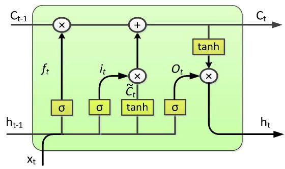

图 9.3 单个 LSTM 单元结构

Bi-LSTM 模型是通过在信息流的相反方向添加一个 LSTM 层来创建的, 这有利于捕获过去和未来的时间依赖性, Bi-LSTM 结构如图 9.4 所示。对于 $k$ 时刻, ${x}_{k}$ 表示融合双注意力的输入向量，被作为正向和反向 LSTM 模型的输入，就可以分别得到正向和反向隐藏层表示向量 ${h}_{k}$ 和 ${h}_{k}$ 。设第 $k$ 个时间点的输出表示 ${h}_{k}$ ,将序列 $\widehat{X} = \left\lbrack  {{\bar{X}}_{1},{\bar{X}}_{2},\cdots ,{\bar{X}}_{t}}\right\rbrack$ 输入到 Bi-LSTM 模型后,就得到模块的最终输出,即 $h = \left\lbrack  {{h}_{1},{h}_{2},\mathrm{\;L},{h}_{t}}\right\rbrack$ ,两个隐藏层组合关系为

$$
{h}_{k} = {h}_{k} + {h}_{k} \tag{9.12}
$$

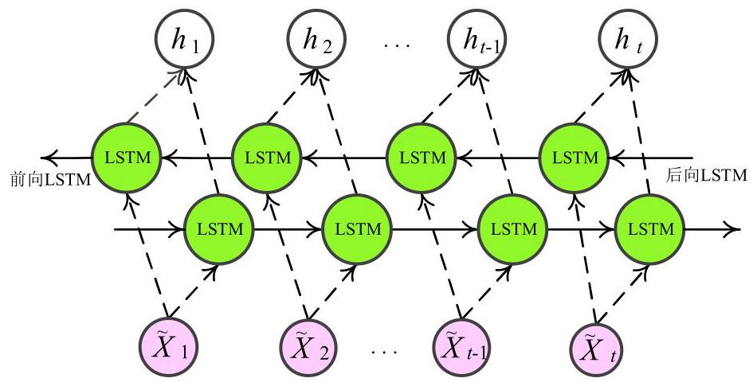

图 9.4 Bi-LSTM 的结构

#### 9.1.2.6 重构模块

重构模块是对提取的特征向量的重建。具体来说,对 Bi-LSTM 的输出向量 $h$ 进行非线性变换,得到与输入向量同维的重构向量 $Z$ 为

$$
Z = \sigma \left( {{W}_{h} \times  h + {d}_{h}}\right) \tag{9.13}
$$

式中, ${W}_{h}$ 为权重系数矩阵; ${d}_{h}$ 为偏置项。

#### 9.1.2.7 基于重构误差的健康状态表征

在正常情况下, 风电机组主轴承本身的状态数据及其相关状态数据将满足动态稳定的内部平衡关系, 数据在一定范围内波动并保持一定的约束特性。如果主轴承发生故障, 动态平衡就会被打破。所以, 风电机组主轴承健康状态识别问题可以描述为非线性模型和重构误差的组合, 即

$$
\left\{  \begin{matrix} Z\left( t\right)  = F\left( {X\left( t\right) }\right) \\  {R}_{e} = \left| {Z\left( t\right)  - X\left( t\right) }\right|  \end{matrix}\right. \tag{9.14}
$$

式中, $t$ 代表采样时间; $X\left( t\right)$ 代表主轴承在 $t$ 时刻的状态参数,它是函数 $F\left( \cdot \right)$ 的输入向量, $X\left( t\right)  = \left\lbrack  {{X}^{1}\left( t\right) ,{X}^{2}\left( t\right) ,\mathrm{L},{X}^{m}\left( t\right) }\right\rbrack   \in  {\mathbf{R}}^{m \times  w};Z\left( t\right)$ 是函数 $F\left( \cdot \right)$ 的输出值,表示 $k$ 时刻主轴承状态参数的重构值, $Z\left( t\right)  = \left\lbrack  {{Z}^{1}\left( t\right) ,{Z}^{2}\left( t\right) ,\mathrm{L},{Z}^{m}\left( t\right) }\right\rbrack   \in  {\mathbf{R}}^{m \times  w};m$ 为表征主轴承运行状态的特征参数个数; $w$ 表示滑动窗口的长度; ${X}^{i}\left( t\right)$ 是含有 $w$ 个实测值的第 $i$ 个状态参数的行向量, ${Z}^{i}\left( t\right)$ 也是含有 $w$ 个预测值的第 $i$ 个状态参数的行向量; $F\left( \cdot \right)$ 表示一系列非线性映射函数,本质上代表风电机组主轴承正常运行时各状态参数应有关系; ${R}_{e}$ 代表风电机组主轴承当前状态与其应有正常状态的差别。因此,主轴承健康状态识别就转化为重构向量 $Z\left( t\right)$ 与输入向量 $X\left( t\right)$ 的残差判别。残差值在既定的范围内波动,即认为主轴承运行状况健康,当残差值超过既定的阈值时, 即认为主轴承运行状况出现异常或故障。

由上可知,重构向量 $Z$ 是对输入参数历史数据信息的特征提炼和综合,反映了输入参数之间历史形成的某种特定关系。从风电机组运行状态预测监测来看，通过对风电机组正常运行状态参数历史数据学习训练，就可以获得正常运行状态的这些参数特定的关系，也就是通常称之为风电机组正常模式。如果当前或者未来运行状态参数数据提炼和综合的重构向量 $Z$ 发生了变化,超过一定的阈值,就可以认为风电机组运行状态出现了异常,这就是基于 DA-Bi-LSTM 模型的风电机组运行状态监测原理。当然, 这种方法监测判别依据是从运行参数数据中提取的一个特征组合, 而不是风电机组运行过程中检测的状态参数, 所谓的重构误差也不是一般风电机组运行状态预测预警方法中某个状态参数预测值和实际值之残差。需要指出, 进行模型比较时, 重构误差同类型才能比较明显预测精度, 而不同类型模型只有比较监测结果。

### 9.1.3 风电机组实例分析

基于图 9.2 的框架, 设计了 DA-Bi-LSTM 模型的算法。其关键过程可描述为: 加载正常情况下不同运行条件下 CSV 文件中的 SCADA 数据; 执行数据清洗和重采样; 选择相关的状态参数变量; 按照给定的比例构造训练、验证和测试数据集; 构建所提出的 DA-Bi-LSTM 模型; 根据超参数给定的范围训练模型; 保存最优模型。

#### 9.1.3.1 数据集构造

为了持续提取 SCADA 数据并生成所提出模型所需的训练样本和测试样本，这里使用滑动窗口方法对原始状态参数数据进行处理，数据重采样频率为 1 分钟，图 9.5 展示了具体构建过程。

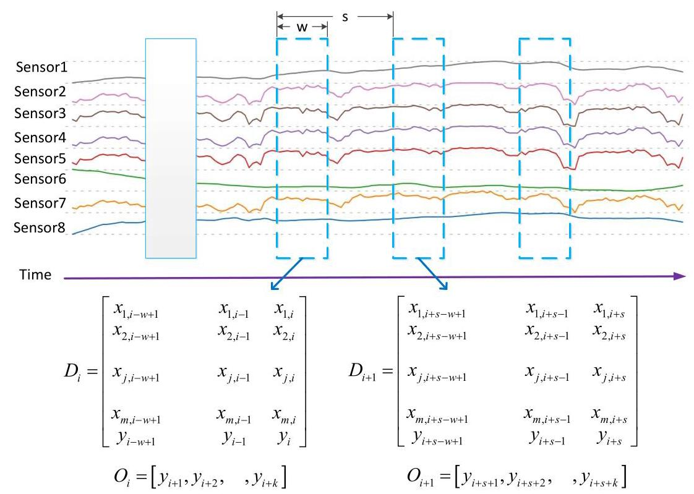

图 9.5 滑动窗口数据集构建

式中, $w$ 代表滑动窗口的宽度; $s$ 代表滑动步长; $i$ 代表某个时间点; $m$ 代表代表主轴承的状态参数个数。对于窗口长度为 $w$ 和输入维度为 $m$ 的每个输入向量,可表示为 $X$ 。

从 3 个月的 SCADA 数据中共收集了 495900 个样本数据。经过数据清洗和重采样后， 数据样本总数为 8265，其中 6612 个样本用于训练，1653 个样本用于测试。

#### 9.1.3.2 DA-Bi-LSTM 模型参数

在 DA-Bi-LSTM 模型构建过程中, 需要确定一些模型参数或者称为超参数。这里构建的一个自编码重构模型, 结构比较简单, 只需要确定学习率和批大小。由于神经网络等智能模型在训练过程中具有一定的随机性, 如权重初始化随机性、正则化随机性、优化随机性等, 因此, 对于给定的相同数据输入, 输出仍然具有一定的差异。为了分析评价模型性能, 一种常见的做法是多次运行模型, 然后应用一些统计方法来分析模型性能, 从而合理选择模型超参数。这里, 采用网格搜索的方法多次运行模型, 以 MAE、MAPE、RMSE 作为模型性能指标, 并兼顾模型运行所耗的时间部分, 综合评价模型性能, 不同超参数搜索结果如表 9.1 所示。

表 9.1 DA-Bi-LSTM 不同超参数的性能指标

<table id="cross-table-4"><tr><td>批大小</td><td colspan="2">学习率</td><td>平均绝对误差 MAE</td><td>平均绝对百分比误差 MAPE</td><td>均方根误差 RMSE</td><td>时间/min</td></tr><tr><td rowspan="7">4</td><td colspan="2">0.001</td><td>1.304±0.836</td><td>0.052±0.397</td><td>3.519±2.322</td><td>\(\{ 8,9\}\)</td></tr><tr><td colspan="2">0.002</td><td>0.864±0.596</td><td>0.056±0.512</td><td>2.319±1.678</td><td>\{7,11\}</td></tr><tr><td colspan="2">0.003</td><td>0.856±0.557</td><td>0.061±0.570</td><td>2.260±1.569</td><td>\{8,14\}</td></tr><tr><td colspan="2">0.004</td><td>0.785±0.524</td><td>0.049±0.450</td><td>2.084±1.470</td><td>\{8,16\}</td></tr><tr><td colspan="2">0.005</td><td>0.899±0.576</td><td>0.056±0.548</td><td>2.352±1.596</td><td>\{11,17\}</td></tr><tr><td colspan="2">0.006</td><td>0.831±0.597</td><td>0.072±0.758</td><td>2.177±1.677</td><td>\{9,20\}</td></tr><tr><td colspan="2">0.007</td><td>0.967±0.620</td><td>0.073±0.715</td><td>2.515±1.719</td><td>\{12,27\}</td></tr><tr></tr><tr><td colspan="2" rowspan="7">8</td><td>0.001</td><td>1.896±1.116</td><td>0.061±0.409</td><td>5.176±3.097</td><td>\{4,5\}</td></tr><tr><td>0.002</td><td>0.968±0.659</td><td>0.048±0.392</td><td>2.594±1.822</td><td>\{6,7\}</td></tr><tr><td>0.003</td><td>0.926±0.604</td><td>0.047±0.399</td><td>2.510±1.702</td><td>\{5,8\}</td></tr><tr><td>0.004</td><td>0.841±0.542</td><td>0.053±0.456</td><td>2.239±1.516</td><td>\{6,9\}</td></tr><tr><td>0.005</td><td>0.823±0.543</td><td>0.056±0.531</td><td>2.197±1.530</td><td>\{7,9\}</td></tr><tr><td>0.006</td><td>0.882±0.619</td><td>0.060±0.582</td><td>2.325±1.722</td><td>\{6,10\}</td></tr><tr><td>0.007</td><td>0.904±0.601</td><td>0.056±0.542</td><td>2.383±1.671</td><td>\{9,12\}</td></tr><tr><td colspan="2" rowspan="7">16</td><td>0.001</td><td>2.556±1.320</td><td>0.073±0.438</td><td>6.974±3.682</td><td>\{2,3\}</td></tr><tr><td>0.002</td><td>1.650±1.015</td><td>0.062±0.481</td><td>4.478±2.802</td><td>\{3,4\}</td></tr><tr><td>0.003</td><td>1.148±0.758</td><td>0.053±0.413</td><td>3.114±2.115</td><td>\{4,5\}</td></tr><tr><td>0.004</td><td>0.936±0.653</td><td>0.052±0.438</td><td>2.519±1.825</td><td>\{4,6\}</td></tr><tr><td>0.005</td><td>0.892±0.605</td><td>0.044±0.351</td><td>2.387±1.682</td><td>\{5,12\}</td></tr><tr><td>0.006</td><td>0.982±0.651</td><td>0.053±0.453</td><td>2.619±1.799</td><td>\{5,9\}</td></tr><tr><td>0.007</td><td>0.975±0.634</td><td>0.060±0.559</td><td>2.587±1.773</td><td>\{6,8\}</td></tr><tr><td colspan="2" rowspan="7">32</td><td>0.001</td><td>3.017±1.558</td><td>0.127±1.102</td><td>8.207±4.373</td><td>\{2,2\}</td></tr><tr><td>0.002</td><td>2.275±1.203</td><td>0.071±0.481</td><td>6.197±3.352</td><td>\{2,3\}</td></tr><tr><td>0.003</td><td>2.002±1.120</td><td>0.076±0.608</td><td>5.439±3.070</td><td>\{2,3\}</td></tr><tr><td>0.004</td><td>1.431±0.858</td><td>0.064±0.534</td><td>3.830±2.366</td><td>\{3,6\}</td></tr><tr><td>0.005</td><td>1.276±0.750</td><td>0.061±0.506</td><td>3.417±2.065</td><td>\{4,6\}</td></tr><tr><td>0.006</td><td>1.303±0.728</td><td>0.064±0.546</td><td>3.471±2.030</td><td>\{5,16\}</td></tr><tr><td>0.007</td><td>1.200±0.745</td><td>0.086±0.844</td><td>3.187±2.047</td><td>\{9,26\}</td></tr><tr><td colspan="2" rowspan="7">64</td><td>0.001</td><td>3.927±2.075</td><td>0.251±2.178</td><td>10.46±5.83</td><td>\{1,2\}</td></tr><tr><td>0.002</td><td>2.925±1.526</td><td>0.106±0.925</td><td>7.986±4.261</td><td>\(\{ 1,2\}\)</td></tr><tr><td>0.003</td><td>2.606±1.318</td><td>0.086±0.693</td><td>7.130±3.717</td><td>\{2,2\}</td></tr><tr><td>0.004</td><td>2.284±1.219</td><td>0.075±0.571</td><td>6.228±3.406</td><td>\{2,3\}</td></tr><tr><td>0.005</td><td>2.094±1.116</td><td>0.076±0.578</td><td>5.678±3.089</td><td>\{2,3\}</td></tr><tr><td>0.006</td><td>2.180±1.137</td><td>0.087±0.770</td><td>5.922±3.188</td><td>\{2,4\}</td></tr><tr><td>0.007</td><td>1.861±0.983</td><td>0.088±0.795</td><td>5.015±2.743</td><td>\{4,4\}</td></tr></table>

从表可以看出, 随着批大小的增加, DA-Bi-LSTM 模型的 MAE、MAPE 和 RMSE 值也增加，模型训练时间呈现逐渐下降的趋势。批大小增加的平均比例，以MAE 计算，为 11.32%、 26.21%、36.78%、42.97%；以 MAPE 计算，为-8.96%、4.37%、38.04%、39.89%；以 RMSE 计算, 为 12.76%、27.04%、36.75%和 43.48%。从表中可以看出, 在批大小一定时, 随着学习率增加, DA-Bi-LSTM 模型的 MAE、MAPE 和 RMSE 值总体上都存在一个由大变小再由小变大的过程, 标准差也类似, 而模型训练时间呈现明显上升趋势。综合模型预测误差和消耗时间, 这里选取批大小为 8 , 学习率为 0.005 。

#### 9.1.3.3 DA-Bi-LSTM 模型性能比较分析

为了分析评价 DA-Bi-LSTM 模型性能, 这里选取 Bi-LSTM、基于时间注意力的 Bi-LSTM (Temporal-Att-Bi-LSTM) 和基于参数注意力的 Bi-LSTM (Parameter-Att-Bi-LSTM) 等模型进行对比分析。比较中, 所有模型都使用相同的输入数据, 但每个输入数据在不同模型中的处理方式不同, 其中, Bi-LSTM 模型没有加入注意力模块, 只考虑时序的前后信息; Temporal-Att-Bi-LSTM 模型同时考虑了时序注意力信息和时序的前后信息， Parameter-Att-Bi-LSTM 模型考虑了参数注意力信息和时序的前后信息, 比较结果如表 9.2 和图 9.6 所示。

表 9.2 不同智能模型的性能指标

<table><tr><td>模型</td><td>MAE</td><td>MAPE</td><td>RMSE</td></tr><tr><td>Bi-LSTM</td><td>1.027±0.752</td><td>0.057±0.533</td><td>2.710±2.086</td></tr><tr><td>Temporal-Att-Bi-LSTM</td><td>0.934±0.642</td><td>0.054±0.508</td><td>2.513±1.836</td></tr><tr><td>Parameter-Att-Bi-LSTM</td><td>1.157±0.784</td><td>0.055±0.417</td><td>3.156±2.374</td></tr><tr><td>DA-Bi-LSTM</td><td>0.823±0.543</td><td>0.056±0.531</td><td>2.197±1.530</td></tr></table>

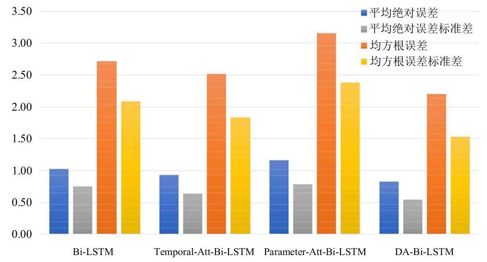

图 9.6 具有标准差分布的不同智能模型性能比较

从表 9.2 和图 9.6 可以看出, 就 MAE 值而言, DA-Bi-LSTM 模型最好, Parameter-Att-Bi-LSTM 模型最差, Temporal-Att-Bi-LSTM 模型较 Bi-LSTM 模型好点; 就 MAPE 值而言, Temporal-Att-Bi-LSTM 模型最好, Bi-LSTM 模型最差, Parameter-Att-Bi-LSTM 模型较 DA-Bi-LSTM 模型好点; 就 RMSE 值而言, DA-Bi-LSTM 模型最好, Parameter-Att-Bi-LSTM 模型最差, Temporal-Att-Bi-LSTM 模型较 Bi-LSTM 模型好点。综合来看, DA-Bi-LSTM 模型表现最好, 其次是 Temporal-Att-Bi-LSTM 模型和 Bi-LSTM 模型, 最差的是 Parameter-Att-Bi-LSTM 模型。DA-Bi-LSTM 模型的 MAE 值和 RMSE 值及其对应的标准差最小, 而且与 Bi-LSTM、Temporal-Att-Bi-LSTM 和 Parameter-Att-Bi-LSTM 模型相比较, 其 MAE 值的均值分别降低约 19.78%、11.79%和 28.84%, MAE 值的标准差分别降低 22.77%、15.31%和 30.67%; 与 Bi-LSTM、Temporal-Att-Bi-LSTM 和 Parame-ter-Att-Bi-LSTM 模型相比较, 其 RMSE 值均值分别降低约 18.92%、12.55% 和 30.37%, RMSE 值的标准差分别降低 26.62%、16.66% 和 35.53%。以上四个模型的 MAPE 值都在 0.055 左右, 区分度不明显, 因为 MAPE 是重构误差与测量值的相对百分比的平均值。

这里, 考虑参数注意力的 Parameter-Att-Bi-LSTM 模型比 Bi-LSTM 模型差, 因为该模型在提取时序前后信息之前，对不同的参数分配了不同的权重，忽略了不重要参数的弱时序信息。Temporal-Att-Bi-LSTM 模型比 Bi-LSTM 模型效果好, 是因为数据本身就为时序数据, 而时序注意力模块进一步凸显了数据在不同时间的重要性。DA-Bi-LSTM 模型表现最好, 是因为它融合了时序注意力信息和参数注意力信息, 重要参数的时序信息, 以及非重要参数的弱时序信息，涵盖的信息更为全面。具体来说，DA-Bi-LSTM 模型强调不同输入参数重要性的提取和参数时序特征的提取, 进一步融合从两方面提取的信息, 最终提取和学习复合信息的时序特征。因此, 它的信息表示和提取能力最强, 效果也是最好的。从上可知, 注意力计算模块大概率有利于提高模型预测精度, 但并不一定就会提高模型预测精度。如果注意力计算模块训练时间太短、数据样本集涵盖的参数关系不全面，不能准确挖掘风电机组主轴承运行状态参数与其相关状态参数之间的时空相关性特征，注意力计算模块可能还会降低模型预测精度。

#### 9.1.3.4 注意力和可解释性分析

DA-Bi-LSTM 模型中的注意力机制模块可以实时给出每个输入样本的各个参数对主轴承运行健康状态预测的动态注意力得分，可以反映不同时间点和不同数据参数对主轴承运行状态的贡献。在注意力分数的热图中，颜色越深，注意力值越高，反之亦然。

这里提取一个样本的参数注意力得分值,如图 9.7 所示,其中横坐标 $X$ 轴代表不同的时间点,纵坐标 $Y$ 轴代表 11 个状态参数,图中数字代表参数注意力的贡献。从图可见,每个状态参数、每个时间点的注意力得分是不同的。两个方向的振动和 5 秒偏航对风平均值等数据参数非常重要,尤其是在 $Y$ 轴向振动对主轴承运行状态贡献最大,温度等其他一些参数的影响程度相对较弱。具体来说, $Y$ 轴向振动的注意力得分最大,平均约占 17.72%,并保持不变; 其次是 5 秒偏航对风平均值、 $X$ 轴向振动、发电机定子平均温度和风速,分别占 13.09%、 12.13%、10.52%和 9.73%；注意力得分最低的是主轴承平均温度和功率，分别为 4.36%和 4.42%。从上可知, 根据实际监测过程中参数变化和参数之间的约束关系, 参数注意力计算模块为这些参数分配不同的注意力分数。

参数注意力得分矩阵

<table><tr><td colspan="6">exactles</td></tr><tr><td>主轴承温度均值 -</td><td>0.0443</td><td>0.0434</td><td>0.0437</td><td>0.0427</td><td>0.0437</td></tr><tr><td>发电机定子温度均值 -</td><td>0.1056</td><td>0.1026</td><td>0.1054</td><td>0.1047</td><td>0.1075</td></tr><tr><td>机舱气象站风速-</td><td>0.0982</td><td>0.098</td><td>0.0969</td><td>0.0978</td><td>0.0955</td></tr><tr><td>测风塔环境温度 -</td><td>0.0562</td><td>0.0512</td><td>0.0501</td><td>0.0503</td><td>0.0515</td></tr><tr><td>轮毂转速 -</td><td>0.058</td><td>0.0541</td><td>0.0545</td><td>0.0562</td><td>0.052</td></tr><tr><td>变频器发电机侧功率-</td><td>0.0408</td><td>0.0404</td><td>0.0456</td><td>0.0435</td><td>0.0508</td></tr><tr><td>发电机运行频率-</td><td>0.0889</td><td>0.0816</td><td>0.0779</td><td>0.0789</td><td>0.0729</td></tr><tr><td>发电机转矩 -</td><td>0.1036</td><td>0.0948</td><td>0.0906</td><td>0.0899</td><td>0.0887</td></tr><tr><td>5秒偏航对风平均值 -</td><td>0.1282</td><td>0.1291</td><td>0.131</td><td>0.133</td><td>0.1331</td></tr><tr><td>\(X\) 轴向振动值 -</td><td>0.1052</td><td>0.1272</td><td>0.1248</td><td>0.1252</td><td>0.1243</td></tr><tr><td>\(Y\) 轴向振动值 -</td><td>0.1709</td><td>0.1776</td><td>0.129克</td><td>0.1273</td><td>0.9862</td></tr><tr><td></td><td>1</td><td>1   2</td><td>3</td><td>4</td><td>5</td></tr></table>

图 9.7 参数注意力得分热图

提取一个样本的时序注意力得分值, 如图 9.8 所示, 其中横坐标代表不同的时间点, 纵坐标代表 11 个状态参数,数字图代表时序注意力得分的贡献。相对于时间 $t$ ,大部分时序注意力分数在 $t - 1$ 和 $t - 3$ 时刻最高,分别约占 20.23% 和 20.14%。最明显的是风速,占 20.6%; 其次是发电机转矩, 占 20.47%; 然后是功率输出和风向 5 秒偏航对风平均值, 分别占 20.35% 和 20.3%。温度参数是一个逐渐变化的量。然而, 各处温度数据参数的时序注意力得分存在明显差异: 主轴承自身温度的注意力得分分布在 20% 左右, 较为均衡, 在 $t - 2$ 和 $t - 4$ 时刻, 占比较大, 呈现中间高、两端低态势; 发电机定子温度参数和外界环境温度参数的变化没有明显的规律性,其注意力得分的标准差最低,为 0.0011。 $X$ 轴向振动数据参数的注意力得分的标准差最大,其次是风速数据参数,分别为 0.008 和 0.0057 。这也说明风速波动大, $X$ 轴向振动大。从上可知, 根据实际监测过程中参数变化的快慢和参数之间的约束关系, 时序注意力计算模块为不同的历史时间点分配不同的注意力分数。

时序注意力得分矩阵

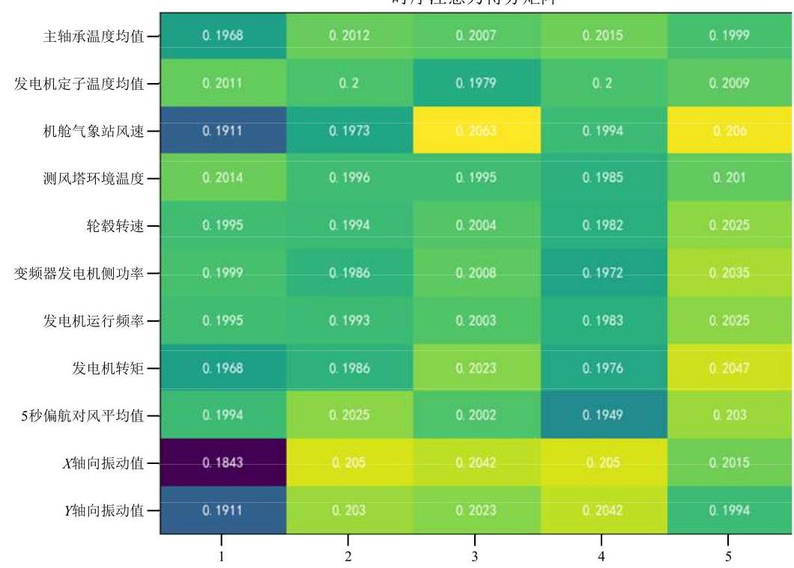

图 9.8 时序注意力得分热图

## 9.2 基于 FISSA-DBN 模型的风电机组运行状态评估

提出一种基于 SCADA 数据的萤火虫改进麻雀搜索算法优化深度置信网络 (firefly improved sparrow search algorithm-deep belief nets, FISSA-DBN) 模型的风电机组状态监测方法。首先, 对 SCADA 数据进行预处理分析, 并利用专家系统和 5.3 节介绍的 Pearson 相关分析选取输入参数和输出参数; 其次, 利用预处理数据集, 建立基于 FISSA-DBN 模型的风电机组运行状态监测新模型, 根据模型预测值和实际输出值之间的重构值误差, 及指数加权移动平均阈值 (exponentially weighted moving average, EWMA) 来判断是否有异常; 最后以华东某风电场实际数据进行实例验证, 验证结果表明所提方法的预警时间比实际记录时间最早可以提前 4 天多，同时与其他方法相比，该方法预警时间提前，模型预测误差更小[15]。

### 9.2.1 风电机组运行状态预测模型

#### 9.2.1.1 深度置信网络

深度置信网络 (deep belief nets, DBN) 作为一种无监督的人工神经网络, 通过堆叠多个受限玻尔兹曼机(restricted Boltzmann machine, RBM)而成。与传统神经网络模型相比， DBN 对数据的训练更为充分, 适用于解决多模态和复杂问题的分类及识别, 因此广泛应用于许多不同的领域。RBM 一共有两层, 上层为隐层, 下层为显层, 其结构如图 9.9 所示。 RBM 堆叠成深度学习网络时, 前一个 RBM 的输出层 (隐层) 作为下一个 RBM 单元的输入层 (显层), 依次堆叠, 便构成基本的 DBN 结构, 最后再添加一层输出层, 就是最终的 DBN 结构。

假设 DBN 模型包含有 $l$ 个隐藏层,其联合概率如下:

$$
p\left( {v,{h}^{1},{h}^{2},\mathrm{\;L},{h}^{l}}\right)  = p\left( {v \mid  {h}^{1}}\right) p\left( {{h}^{1} \mid  {h}^{2}}\right) \mathrm{L}p\left( {{h}^{l - 1} \mid  {h}^{l}}\right) \tag{9.15}
$$

式中, $p\left( {{h}^{j - 1} \mid  {h}^{j}}\right) , j = 2,3,\mathrm{\;L}, l$ 表示隐藏层第 $\left( {j - 1}\right)$ 层和第 $j$ 层之间的条件概率分布。显层神经元与隐藏神经元之间的能量定义如下:

$$
E\left( {v, h;\theta }\right)  =  - \mathop{\sum }\limits_{{i = 1}}^{m}{v}_{i}{b}_{i} - \mathop{\sum }\limits_{{j = 1}}^{n}{c}_{j}{h}_{j} - \mathop{\sum }\limits_{{i = 1}}^{m}\mathop{\sum }\limits_{{j = 1}}^{n}{v}_{i}{h}_{j}{\omega }_{ij} \tag{9.16}
$$

式中, $\theta  = \left\{  {{\omega }_{ij},{b}_{i},{c}_{j}}\right\}$ 表示网络参数; ${\omega }_{ij}$ 是指显层神经元与隐层神经元之间的权重; ${b}_{i}$ 是显层神经元的偏置; ${c}_{j}$ 为隐层神经元的偏置; $m$ 为显层神经元个数; $n$ 为隐层神经元个数。

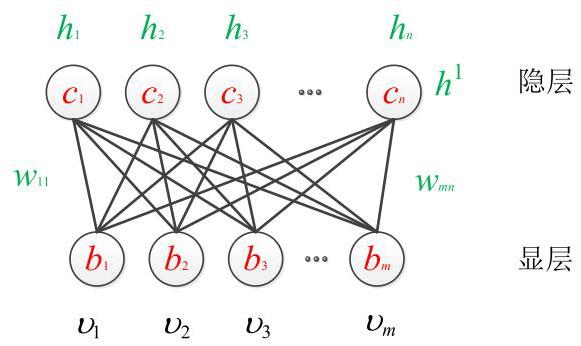

图 9.9 RBM 结构图

DBN 网络模型的输入 $X$ 表示为

$$
X = v = \left\lbrack  {{v}_{1},{v}_{2},{v}_{3},\mathrm{\;L},{v}_{m}}\right\rbrack \tag{9.17}
$$

式中, $X$ 为 SCADA 系统中相关参数集,如风速、发电机电压和发电机电流等,能够反映风电机组的状况或故障特性。

基于上述能量函数，将式 (9.14) 表示为

$$
p\left( {v, h}\right)  = \frac{1}{Z}{\mathrm{e}}^{-E\left( {v, h}\right) } \tag{9.18}
$$

式中, $Z$ 为分配函数,用来调整 ${\mathrm{e}}^{-E\left( {v, h}\right) }$ 的分配值。显层和隐层内部不存在连接,对于网络的显层神经元和隐层神经元的激活函数分别表示为

$$
p\left( {{v}_{i} = 1 \mid  h}\right)  = \sigma \left( {\mathop{\sum }\limits_{{j = 1}}^{n}{\omega }_{i, j}{h}_{j} + {b}_{i}}\right) \tag{9.19}
$$

$$
p\left( {{h}_{j} = 1 \mid  v}\right)  = \sigma \left( {\mathop{\sum }\limits_{{i = 1}}^{m}{\omega }_{i, j}{v}_{i} + {c}_{j}}\right) \tag{9.20}
$$

式中, $\sigma \left( x\right)$ 是 Sigmoid 函数。

通过对比散度学习算法来训练 RBM,寻找最优的权值 ${\omega }_{ij}$ ,不停的更新得到的新权重和偏置, 其更新表达式为

$$
{\omega }_{ij}^{\left( s\right) } \leftarrow  {\omega }_{ij}^{\left( s - 1\right) } + \lambda \left( {p\left( {{h}_{i} \mid  {v}_{i};\theta }\right) {v}_{i} - p\left( {{h}_{i + 1} \mid  {v}_{i + 1};\theta }\right) {v}_{i + 1}}\right) \tag{9.21}
$$

$$
{c}_{i} \leftarrow  {c}_{i - 1} + \lambda \left( {{h}_{i} - {h}_{i + 1}}\right) \tag{9.22}
$$

$$
{b}_{j} \leftarrow  {b}_{j - 1} + \lambda \left( {{v}_{i} - {v}_{i + 1}}\right) \tag{9.23}
$$

式中, $\lambda$ 是学习率; $s$ 表示 RBM 的数量。

#### 9.2.1.2 萤火虫扰动改进麻雀搜寻算法

深度置信网络模型建立过程中，网络参数是随机初始化的，会引起局部最优解的产生。 而采用麻雀搜索算法 (SSA) 对 DBN 网络进行优化, 通过寻求 DBN 网络学习速率和 RBM 各层隐藏神经元数目的最优值, 实现在全局样本空间中获得更高的诊断精度。为了提高搜索性, 利用萤火虫扰动方式进行位置更新, 形成萤火虫改进麻雀搜索算法 (firefly improved sparrow search algorithm, FISSA), 把扰动后的麻雀与扰动前的麻雀进行对比, 如果更优则更新麻雀位置。

萤火虫的相对荧光亮度为

$$
I = {I}_{0} \cdot  {\mathrm{e}}^{-\gamma {r}_{i, j}^{2}} \tag{9.24}
$$

式中, ${I}_{0}$ 为萤火虫的最大荧光亮度,与目标函数值相关,目标函数值越优自身亮度越高; $\gamma$ 为光强吸收系数,荧光会随着距离的增加和传播媒介的吸收逐渐减弱; ${r}_{i, j}$ 为萤火虫 $i$ 与 $j$ 之间的空间距离。

萤火虫的吸引度为

$$
P = {P}_{0} \cdot  {\mathrm{e}}^{-\gamma {r}_{i, j}^{2}} \tag{9.25}
$$

式中, ${P}_{0}$ 为最大吸引度。

萤火虫 i 被吸引向萤火虫 j 移动的位置更新公式如下:

$$
{x}_{i} = {x}_{i} + P \cdot  \left( {{x}_{j} - {x}_{i}}\right)  + q \cdot  \left( {\operatorname{rand} - 1/2}\right) \tag{9.26}
$$

式中, $q \in  \left\lbrack  {0,1}\right\rbrack$ 为步长因子; rand 为 $\left\lbrack  {0,1}\right\rbrack$ 上服从均匀分布的随机数。

采用 FISSA 算法优化 DBN 模型, DBN 模型设置两个隐藏层, 根据式 (9.26) 得到的最佳适应度位置 $x$ 。对 DBN 模型的二个隐藏层神经元数目及学习率进行优化，即:

$$
\left. \begin{array}{l} \min f\left( {\alpha ,\beta ,\lambda }\right)  = x\left( {1,2,3}\right) \\  \text{ s.t. }\;\alpha  \in  x\left( 1\right) \\  \beta  \in  x\left( 2\right) \\  \lambda  \in  x\left( 3\right)  \end{array}\right\} \tag{9.27}
$$

式中, $x\left( k\right) \left( {k = 1,2,3}\right)$ 为优化之后得到的最佳适应度值; $\alpha$ 为 RBM 第一个隐藏层优化之后的神经元数目; $\beta$ 为 RBM 第二个隐藏层优化之后的神经元数目; $\lambda$ 为优化之后得到的学习率。

DBN 的 FISSA 优化流程具体操作流程如下:

(1)设置 FISSA 的参数。根据多次实验选取迭代次数为 10，种群规模为 40 只，捕食者的比例为 20%，安全阈值 $T$ 取 0.8，加入者比例为 30%，意识到危险的麻雀数量为 5 只。

(2)优化参数设置。随机初始化麻雀种群的位置，设置 $\alpha$ 、 $\beta$ 和 $\lambda$ 的参数范围。

(3)计算适应度值。根据目标函数计算麻雀的适应度值，更新捕食者位置，更新加入者位置, 更新警戒者位置, 计算适应度并更新麻雀位置, 并保存最佳位置个体, 表达式如下:

$$
\text{ Best\_pos }\left( t\right)  = {x}_{i} = \text{ Function }\left( {\alpha ,\beta ,\lambda }\right) \tag{9.28}
$$

(4)萤火虫扰动。利用萤火虫扰动更新麻雀位置，计算适应度值并更新麻雀位置，并保存最佳位置个体。

(5)优化结束。根据定义的最大迭代次数，判断是否满足停止条件，满足则退出，输出最佳参数向量; 否则, 返回执行步骤 (2), 重复上述步骤直到得到最优参数。

### 9.2.2 风电机组运行状态检测方法

#### 9.2.2.1 基于 FISSA-DBN 模型的风电机组异常状态阈值

在 FISSA -DBN 模型中, DBN 网络对输入数据进行编码和解码后输出, 输入变量和输出具有相同的物理意义, 通过 FISSA 对 DBN 网络参数调优, 从而使模型更好地拟合输入数据。这里设 FISSA -DBN 模型的预测值与实际值的重构误差 (reconstruction error) 为 ${\delta }_{E}$ ,将其作为风电机组运行状态是否异常的判断依据。重构误差表达式为

$$
{\delta }_{E} = \left| {x\left( i\right)  - \widehat{x}\left( i\right) }\right| \tag{9.29}
$$

式中, $x\left( i\right)$ 为实际值; $\widehat{x}\left( i\right)$ 为预测值。

风电机组正常运行时，SCADA 系统监测变量数据满足稳定的内部关系；当其出现故障时,重构误差趋势会发生明显变化。通过分析 ${\delta }_{E}$ 的变化趋势或突变程度,可以实现对风电机组运行状态监测。采用指数加权移动平均值法设置阈值线, 能检测出均值小漂移, 适合连续监测 ${\delta }_{E}$ 的变化趋势。这里,采用指数加权移动平均 (exponential weighted moving average, EWMA)方法,其控制图的统计量为 ${Z}_{t}$ :

$$
{Z}_{t} = \lambda {\delta }_{Et} + \left( {1 - \lambda }\right) {Z}_{t - 1} \tag{9.30}
$$

式中, $\lambda$ 为权重因子,表示历史 ${\delta }_{E}$ 对当前 EWMA 的影响, $\lambda  \in  (0,1\rbrack$ ,取值为 ${0.2};t$ 为时间; ${\delta }_{Et}$ 为独立的随机变量。EWMA 统计量的均值和方差可通过如下计算得到:

$$
{\mu }_{{Z}_{t}} = {\mu }_{{\delta }_{E}},\;{\sigma }_{{z}_{t}}^{2} = \frac{{\sigma }_{{\delta }_{E}}^{2}}{n}\left( \frac{\lambda }{2 - \lambda }\right) \left\lbrack  {1 - {\left( 1 - \lambda \right) }^{2t}}\right\rbrack \tag{9.31}
$$

式中, ${\mu }_{{\delta }_{E}}$ 为同一类型风电机组对应设备的 ${\delta }_{\mathrm{E}}$ 均值; $n$ 为采样长度; ${\sigma }_{{\delta }_{E}}^{2}$ 为 ${\delta }_{E}$ 标准差的平方。这样, 基于时间的风电机组运行状态监测的 EWMA 控制图的上下限函数分别定义为

$$
{U}_{C}\left( t\right)  = \gamma  \cdot  {\mu }_{{\delta }_{E}} + \kappa {\sigma }_{{\delta }_{E}}\sqrt{\frac{\lambda \lbrack 1 - {\left( 1 - \lambda \right) }^{2t}}{\left( 2 - \lambda \right) }} \tag{9.32}
$$

$$
{U}_{L}\left( t\right)  = \gamma  \cdot  {\mu }_{{\delta }_{E}} - \kappa {\sigma }_{{\delta }_{E}}\sqrt{\frac{\lambda \lbrack 1 - {\left( 1 - \lambda \right) }^{2t}}{\left( 2 - \lambda \right) }} \tag{9.33}
$$

式中, $\gamma$ 为告警系数,经过反复验证取值为 4,表示预测重构误差为均值的 4 倍时会发出故障告警; $\kappa$ 通常设置为 2 或 3,当取 2 时,表示为故障预警阈值的界限; 当取 3 时,表示为故障告警阈值的界限。

从式 (9.32) 和式 (9.33) 可知, ${U}_{c}\left( t\right) \text{ 、 }{U}_{L}\left( t\right)$ 是随时间变化的一组数据,但随着 $t$ 的增加,这二个值趋向于常数,因此阈值线取最后的常数值。当风电机组运行正常或停机时, ${\delta }_{\mathrm{E}}$ 的值维持在 EWMA 阈值线以下，并能长期稳定运行。但是，当 ${\delta }_{\mathrm{E}}$ 的变化趋势超过阈值线时， 并保持在阈值线上, 表示实际值与重构值出现较大偏差, 原有平衡状态发生变化, 风电机组运行状态出现异常。

#### 9.2.2.2 基于 FISSA-DBN 模型的风电机组运行状态监测流程

风电机组输出功率直接反映风电机组全局运行状态, 通常用于风电机组运行状态监测, 这里选择风电机组变频器电网侧有功功率为 FISSA-DBN 模型的输出。影响风电机组功率的数据参数很多, 而且各个状态数据参数会相互关联, 因此要选择合适的输入参数, 避免信息冗余，提高运行状态监测准确度。这里将专家分析和 Pearson 相关系数计算分析相结合，选择风轮转速、变桨电机 3 电流、超速传感器转速监测值、风速、变频器电网侧电流、变频器发电机侧功率、发电机运行频率、发电机电流等 8 个运行状态数据作为输入参数。风电机组状态监测模型输入参数和输出参数 Pearson 相关系数标准为 0.8 ，参数之间相关性如图 9.10 所示。

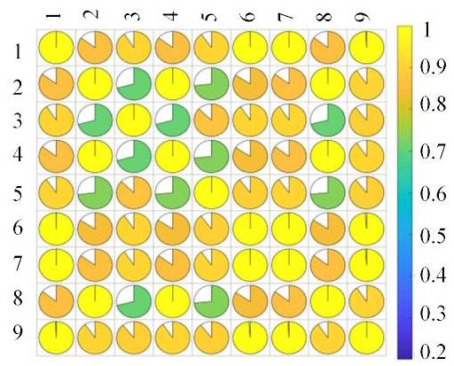

图 9.10 风电机组状态监测模型参数间相关性

基于 FISSA-DBN 模型的风电机组运行状态监测流程如下。

(1)数据选择与预处理:根据风电机组运行记录，从 SCADA 数据中提取风电机组的原始运行数据; 基于专家领域知识, 从原始 SCADA 数据中选取总的预测模型条件参数, 根据风场事故几率进一步处理数据信息，删除原始数据中的错误数据和不必要数据。

(2)数据处理与数据集分割:对选取的数据，进行标准化处理，将值归化到 $\left\lbrack  {0,1}\right\rbrack$ 区间， 利用该数据样本进行预测模型训练或测试。选取每种状态下 20000 组历史正常数据作为样本， 80%的随机数据作为训练数据，20%作为测试数据。

(3)预测模型结构与参数优化:设置麻雀的种群规模、迭代次数、生产者比例和 DBN 结构等相关参数; 通过 FISSA 来优化 RBM 层的学习率和隐藏层神经元数目, 得到 DBN 模型的最优初始向量。

(4)模型训练与异常状态阈值:对预测模型进行训练和测试，得到 EWMA 控制图的上下限阈值。

(5)预测模型应用:将实际 SCADA 数据用监测模型验证，并与实际风电机组运行记录相对比分析。

### 9.2.3 风电机组实例分析

#### 9.2.3.1 数据预处理及参数确定

选取某风电场 2MW 风电机组 SCADA 数据，时间跨度为 5 年，数据采样间隔为 10 分钟。首先, 剔除掉 SCADA 数据中的状态异常数据, 风电机组风速与功率曲线如图 9.11 所示; 然后,将停机状态下功率为零的数据剔除; 最后,选取风速为 ${3.5} \sim  {20}\mathrm{\;m}/\mathrm{s}$ 的 SCADA 数据作为模型训练和测试数据样本集。

对 SCADA 数据进行归一化处理, 并划分为训练样本和测试样本集; 运用 FISSA 算法寻找最佳适应度值,获得模型参数 $\alpha \text{ 、 }\beta \text{ 、 }\lambda$ 的值分别为 ${82}\text{ 、 }{90}\text{ 、 }{0.0668}$ ,利用最优值设置模型参数, 训练好 DBN 模型; 通过训练好的 FISSA-DBN 模型对测试样本集进行统计分析, 得到 EWMA 控制图的上下限值, 阈值线取告警上限值。

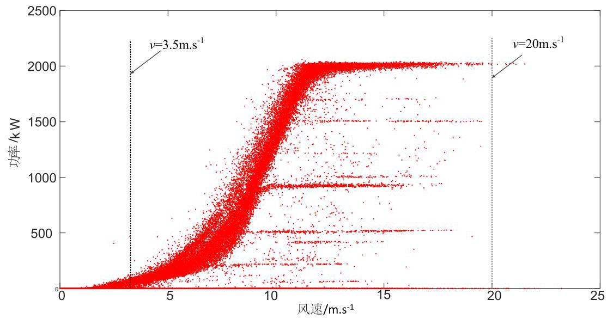

图 9.11 风速与功率曲线图

#### 9.2.3.2 智能预测模型性能对比分析

为分析评价 FISSA-DBN 模型对风电机组运行状态预测性能, 将其与 SSA-DBN、 WOA-DBN 和 DBN 模型进行了对比分析。采用均方根误差 (RMSE) ,平均绝对百分误差 (MAPE) 和平均绝对误差 (MAE) 作为性能评价指标, 对以上 4 种预测模型的性能进行对比分析, 选用数据为三种状态下 4000 组测试数据, 结果如表 9.3 所示。从表中可以看出, 一是参数经过优化后的 DBN 模型预测误差要比未优化的模型 DBN 明显小一些。二是采用 FISSA 优化参数比 SSA、WOA 优化参数的 DBN 模型预测误差要小些。三是 SSA 与 WOA 优化参数的 DBN 模型预测误差相比, 对于风电机组运行, SSA 比 WOA 误差小。这些表明 DBN 模型预测精度与其模型参数优化相关联, 不同的优化算法预测性能可能不同, 就本例而言, FISSA 优化算法效果最好、预测精度最高。

表 9.3 风电机组三种运行状态下各智能模型预测性能

<table><tr><td>监测状态</td><td>模型</td><td>RMSE</td><td>MAPE/%</td><td>MAE</td></tr><tr><td rowspan="4">风电机组   运行状态</td><td>FISSA-DBN</td><td>1.885</td><td>0.0398</td><td>1.215</td></tr><tr><td>SSA-DBN</td><td>1.924</td><td>0.0413</td><td>1.255</td></tr><tr><td>WOA-DBN</td><td>1.931</td><td>0.0454</td><td>1.393</td></tr><tr><td>DBN</td><td>3.407</td><td>0.0825</td><td>2.453</td></tr></table>

#### 9.2.3.3 风电机组运行状态监测

以某风电场 5 号风电机组为例, 经过 FISSA-DBN 模型预测, 风电机组运行状态预测与实际结果如图 9.12 所示,上述 4 种智能模型对应的风电机组状态监测 ${\delta }_{\mathrm{E}}$ 值曲线如图 9.13 所示。从图 9.12 可见, 在 25333 个点之前, FISSA-DBN 模型预测值与实际值吻合较好, 25400 多个点后亦是, 但是中间一段时间模型预测值与实际值差异明显。从图 9.13(a)可见, 在 25333 个点之前, FISSA-DBN 模型 ${\delta }_{E}$ 值在告警阈值上限之下,在此之后, ${\delta }_{E}$ 值持续超过告警阈值上限, 这表明风电机组运行出现异常。与风电机组实际运行情况表明: 该 FISSA-DBN 模型预测结果比实际情况提前 90 分钟。其他三种智能模型情况是: 从图 9.13(b)可见, SSA-DBN 模型虽然在 25333 这个点 ${\delta }_{E}$ 值超过告警阈值上限,但后面曲线回落超过告警阈值上限值不多，容易造成忽视；从图 9.13(c)可见，WOA-DBN 模型在 25333 点时超过告警阈值上限， 但后面曲线回落在告警阈值上限值的下面，从而检测不出实际异常情况；从图 9.13(d)可见， DBN 模型在 25334 点时超过告警阈值上限值, 要比 FISSA-DBN 模型晚 10 分钟预测出来。

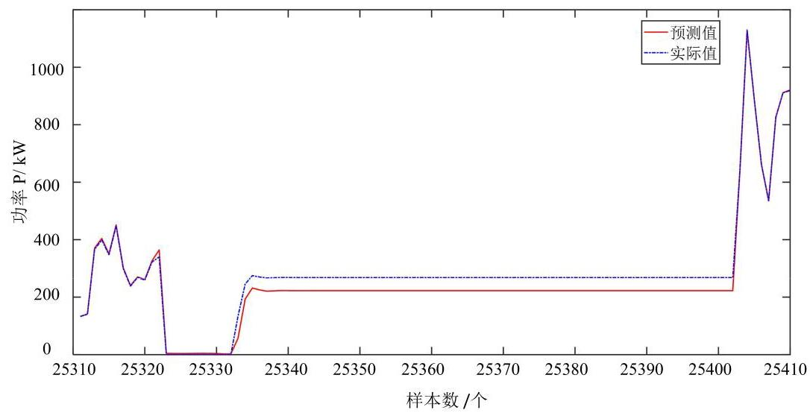

图 9.12 风电机组运行状态预测

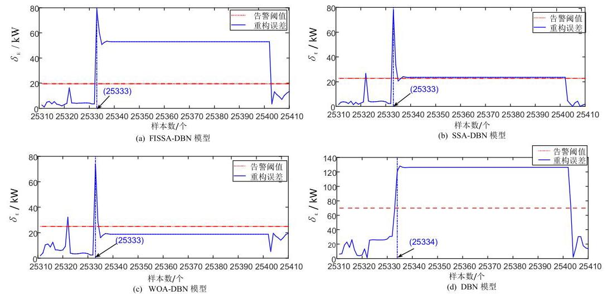

图 9.13 风电机组运行状态监测 ${\delta }_{\mathrm{E}}$ 曲线图

## 9.3 基于 NARX 温度相关分析模型的风电机组运行状态监测

风电机组 SCADA 数据包括环境参数、控制参数、体征参数，其中温度这个体征参数数据是最多的一类参数, 包括风电机组二十多个关键部件、部位温度等数据。风电机组温度数据参数直接和间接反映其运行状态。一方面, 常见的风电机组故障包括转子系统不平衡、机械摩擦磨损、润滑不良和电气元器件损坏等, 这些故障大多会在关键部件、部位温度信号上有所反应; 另一方面, 温度信号是与风电机组运行工况有关联, 某些电气、液压、机械等子系统的故障并不一定会导致温度信号异常, 但是会导致与温度相关的风电机组状态参数异常, 因此, 通过温度相关数据参数变化是分析、监测风电机组运行状态的重要途径。本节提供了一种基于非线性自回归外源模型 (NARX) 网络的风电机组温度参数预测、运行状态监测方法 ${}^{\left\lbrack  {19},{20}\right\rbrack  }$ 。

### 9.3.1 基于 NARX 的温度参数预测建模

#### 9.3.1.1 NARX 神经网络

神经元是 NARX 神经网络的基本处理单元, 其输入和输出的关系为

$$
\text{ Output } = f\left( {\mathop{\sum }\limits_{{i = 1}}^{n}{w}_{i} \times  {x}_{i} + \theta }\right) \tag{9.34}
$$

式中, ${w}_{i}$ 为神经元第 $i$ 个输 ${x}_{i}$ 的权值; $n$ 表示输入特征的数量; $\theta$ 为偏置量; $f\left( \cdot \right)$ 为神经元的激活函数。这里, 使用 sigmoid 型激活函数。

NARX 神经网络称为有外部输入的非线性自回归神经网络, 它属于具有反馈的前向网络, 可以看作有时延输入的 BP 神经网络加上输出到输入的时延反馈连接。NARX 模型定义如下:

$$
Y\left( t\right)  = \mathrm{F}\left\lbrack  {A\left( t\right) , C\left( t\right) }\right\rbrack \tag{9.35}
$$

式中, $Y\left( t\right)$ 为模型 $t$ 时刻的输出; $A\left( t\right)$ 为 $t$ 时刻及之前 $a$ 个时刻的外部输入 (a 为模型的反馈时延长度); $C\left( t\right)$ 为 $t$ 时刻的历史反馈输入。在大多数应用场景中 ${}^{\left\lbrack  {25} - {28}\right\rbrack  }$ ,信号 $A\left( t\right)$ 和 $C\left( t\right)$ 采用相同的延迟时长

$$
A\left( t\right)  = \left\lbrack  {X\left( t\right) , X\left( {t - 1}\right) ,\mathrm{L}, X\left( {t - a}\right) }\right\rbrack \tag{9.36}
$$

$$
C\left( t\right)  = \left\lbrack  {Y\left( {t - 1}\right) , Y\left( {t - 2}\right) ,\mathrm{L}, Y\left( {t - a}\right) }\right\rbrack \tag{9.37}
$$

一个典型的 NARX 神经网络由输入层、隐含层和输出层构成, 如图 9.14 所示。NARX 神经网络的训练过程是基于误差反向传播的, 网络对单个样本的误差函数定义为

$$
e = \frac{\mathop{\sum }\limits_{{k = 1}}^{p}{\left( E\left( {y}_{k}\left( t\right) \right)  - {y}_{k}\left( t\right) \right) }^{2}}{2} \tag{9.38}
$$

式中, $E\left( {{y}_{k}\left( t\right) }\right)$ 为模型第 $k$ 个输出节点的期望输出; ${y}_{k}\left( t\right)$ 表示其实际输出; $p$ 为输出节点的个数。NARX 神经网络的的学习过程就是不断修正各层神经元的连接权值、偏置量, 使得误差函数值最小化的过程。

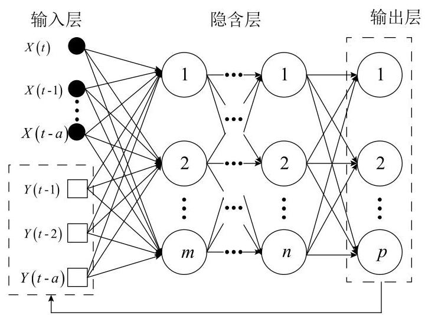

图 9.14 典型的 NARX 神经网络结构

#### 9.3.1.2 基于 NARX 的温度参数建模流程

一个典型的 NARX 神经网络由输入层、隐含层和输出层构成的多输入多输出网络模型。 首先, 根据任务要求, 选择风电机组状态预测的目标参数, 作为模型输出参数。然后, 选择与目标参数相关的风电机组运行状态数据参数, 作为模型输入参数, 输入参数肯定是多个, 输入参数多少影响模型预测精度, 太多或者太少都不利于模型精度和计算效率。选择构建模型的数据集, 数据集规模大小取决于预测目标任务要求, 而当数据集规模一定时, 就取决于数据时间跨度和数据采样频率, 时间跨度要覆盖风电机组的所有发电条件和运行工况, 采样频率尽可能高而获得更多信息，因此依据物理机制综合协调确定；将数据集分解为训练样本、 测试样本和验证样本 3 个子集，一般 70%~80% 为训练集，剩余部分测试集、验证集平分。 选择确定模型参数, 对预测模型进行反复训练和测试, 选择设置最优输入时延、最优输出时延和最优隐藏层。最后, 风电机组运行状态参数预测残差可以用来进行状态评估, 也可以通过转换在残差基础上再定义计算风电机组运行状态健康指标，应用健康指标来评估风电机组运行状态。基于 NARX 的风电机组温度参数预测建模流程, 如图 9.15 所示。

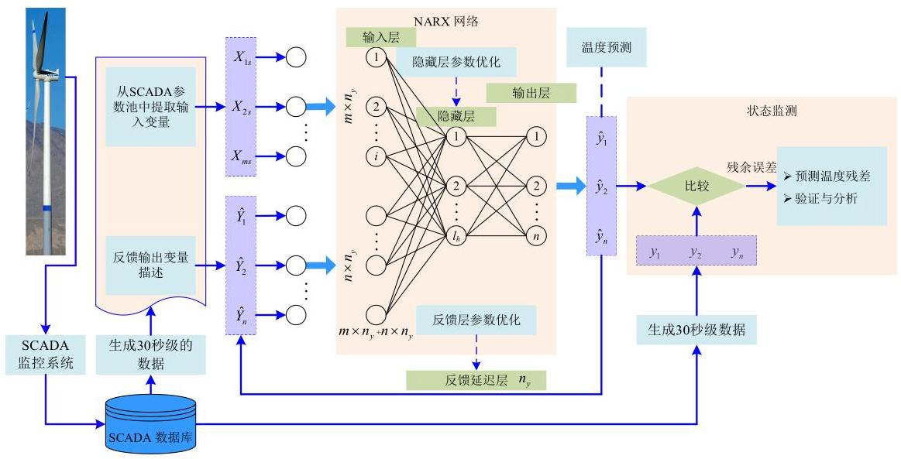

图 9.15 NARX 网络建模过程

### 9.3.2 基于 NARX 的风电机组逆变器温度参数预测

逆变器是风电机组关键电气部件之一, 是由多种电子元件和功率器件等组成的复杂电路。 在发电机侧逆变器中, 实现三相整流, 将交流电压转换为直流电压; 在电网侧逆变器中, 将直流电压转换成与电网电压频率相同的交流电压。逆变器在逆变整流过程中, 逆变柜内大功率电器元件会产生大量的热量, 特别是风轮转速随风速的随机变化, 导致逆变器始终处于运行状态。当风电机组在全风速条件下达到额定功率时, 逆变器产生的热量也最大。虽然, 风电机组逆变器系统通常配备通风和冷却装置，特别是大型风电机组。但当逆变器发生故障、 异常发热时，通风降温装置不足以将逆变器温度降至正常范围，因而导致变频器控制柜内的温度也会出现异常。因此, 采用 NARX 网络模型, 对风电机组逆变器温度参数进行预测和运行状态评估。

1. 逆变器温度预测建模参数选取

风电场通常配备 SCADA 系统, 能够实时采集并记录风电机组及其核心部件的运行数据。 本节考虑的风电机组 SCADA 系统包括传感器数据 55 条，其余 94 条为计算数据、设置参数和状态量,并可以提供每秒采样(采样频率为 $1\mathrm{{Hz}}$ )和每十分钟采样(基于一秒数据的十分钟数据平均值)两种类型的数据。一般情况下，风电机组逆变器的温度传感器安装在逆变柜内(进出风口各一个), 可以较好地反映逆变器的温度状态。然而, 逆变器温度与 SCADA 系统中其他数据参数之间具有不同的相关性。一些参数与逆变器温度的相关性较高, 如功率、电流等, 而另一些参数与逆变器温度的相关性较低。因此, 从如此众多的 SCADA 参数中分析和提取影响逆变器温度相关参数对预测建模就至关重要。

首先, 将风电机组的 55 个 SCADA 参数分为 5 类, 如图 9.16 所示。第一类有 18 组参数, 包括一些与风电机组功率相关的参数, 如轮毂转速、发电机电流、电压等。第二类有 24 组参数, 分别是风电机组主要部件的监测温度和外部环境温度, 如主轴承温度、发电机转子温度等。第三类有 5 个参数, 主要影响逆变器的散热性能。第四类是逆变器运行参数, 主要包括 6 个参数。最后一类是振动参数, 主要用于监测机舱振动。

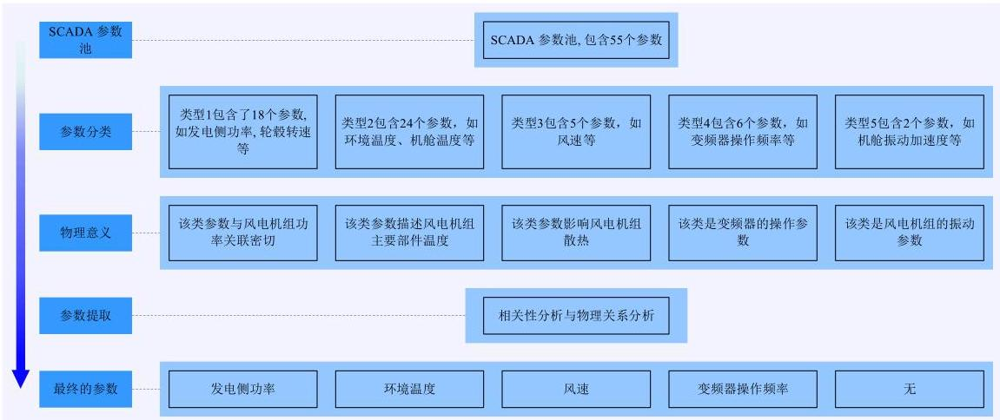

图 9.16 参数选取流程

然后，基于 SCADA 数据，采用式 (5.34) 计算出一些 SCADA 参数之间的相关系数， 如表 9.4 所示。两个参数之间的相关系数值越大, 说明两个参数之间的相关性越强, 据此将参数之间相关程度分为五个等级, 如表 9.5 所示。从表中可以看出, 有近 20 个 SCADA 参数与逆变器温度有较强的相关性, 如风轮转速、风速、功率和逆变器工作频率等; 有些与逆变器温度负相关，如环境温度等。如果同时使用 20 多个参数作为逆变器温度预测模型的输入，不仅增加了预测模型构建的难度，甚至会影响预测模型的准确性。实际上，风轮转速与功率的相关系数接近于 1 , 说明两者基本是线性相关的。因此, 只需考虑功率对逆变器温度的影响。

表 9.4 SCADA 参数相关系数

<table><tr><td></td><td>HS</td><td>WS</td><td>Acc</td><td>\(P\)</td><td>IOF</td><td>...</td><td>AT</td><td>NT</td><td>ITI</td><td>OTI</td></tr><tr><td>HS</td><td>1</td><td>0.862</td><td>0.004</td><td>0.998</td><td>0.989</td><td>...</td><td>-0.713</td><td>0.481</td><td>0.812</td><td>0.803</td></tr><tr><td>WS</td><td>0.862</td><td>1</td><td>0.005</td><td>0.860</td><td>0.002</td><td>...</td><td>-0.608</td><td>0.392</td><td>0.733</td><td>0.727</td></tr><tr><td>Acc</td><td>0.004</td><td>0.005</td><td>1</td><td>0.003</td><td>0.002</td><td>...</td><td>0.015</td><td>-0.001</td><td>0.002</td><td>0.002</td></tr><tr><td>\(P\)</td><td>0.998</td><td>0.860</td><td>0.003</td><td>1</td><td>0.988</td><td>...</td><td>-0.714</td><td>0.483</td><td>0.812</td><td>0.793</td></tr><tr><td>IOF</td><td>0.989</td><td>0.851</td><td>0.002</td><td>0.988</td><td>1</td><td>...</td><td>-0.708</td><td>0.476</td><td>0.810</td><td>0.786</td></tr><tr><td>...</td><td>...</td><td>...</td><td>...</td><td>...</td><td>...</td><td>...</td><td>...</td><td>...</td><td>...</td><td>...</td></tr><tr><td>AT</td><td>-0.713</td><td>-0.608</td><td>0.015</td><td>-0.714</td><td>-0.708</td><td>...</td><td>1</td><td>0.724</td><td>-0.423</td><td>-0.422</td></tr><tr><td>NT</td><td>0.481</td><td>0.392</td><td>-0.001</td><td>0.483</td><td>0.476</td><td>...</td><td>0.724</td><td>1</td><td>0.027</td><td>0.049</td></tr><tr><td>ITI</td><td>0.812</td><td>0.733</td><td>0.002</td><td>0.812</td><td>0.810</td><td>...</td><td>-0.423</td><td>0.027</td><td>1</td><td>0.943</td></tr><tr><td>OTI</td><td>0.803</td><td>0.727</td><td>0.002</td><td>0.793</td><td>0.786</td><td>...</td><td>-0.422</td><td>0.049</td><td>0.943</td><td>1</td></tr></table>

注:HS 轮毂转速；WS 风速；Acc振动加速度; $P$ 功率; IOF变频器操作温度; AT 环境温度; NT 机舱温度; ITI 变频器外部温度; OTI变频器内部温度

表 9.5 两个变量之间的相关系数等级描述

<table><tr><td>相关系数</td><td>\({0.8} \leq  \left| \rho \right|  \leq  1\)</td><td>\({0.6} \leq  \left| \rho \right|  \leq  {0.8}\)</td><td>\({0.4} \leq  \rho  \leq  {0.6}\)</td><td>\({0.2} \leq  \left| \rho \right|  \leq  {0.4}\)</td><td>\(0 \leq  \left| \rho \right|  \leq  {0.2}\)</td></tr><tr><td>相关程度</td><td>非常强相关</td><td>强相关</td><td>相关</td><td>弱相关</td><td>很弱或不相关</td></tr></table>

再次, 对这些参数随时间变化趋势进行相关性及其物理机制分析。图 9.17 显示了风电机组 1.8h 的 SCADA 数据，包括风轮转速、发电机功率、风速、逆变器进口温度、逆变器出口温度、逆变器进口压力、逆变器出口压力、环境温度、机舱温度等。通过对各数据参数进行多项式曲线拟合, 从图中可以更加清楚地看出逆变器温度随风轮转速、发电机功率、风速、逆变器进口压力、逆变器出口压力的变化而发生相应的变化。具体来说, 风轮转速、发电机功率、风速、逆变器进口温度、逆变器出口温度、逆变器进口压力、逆变器出口压力具有相同的变化趋势, 而逆变器进口温度、出口温度随环境温度和机舱温度的变化趋势不同。 这说明逆变器进出口温度的测量值虽然与逆变器实际温度存在差异, 但逆变器进出口温度的测量值具有反映逆变器实际温度的潜力。这样, 最终从 55 个 SCADA 参数中提取出与逆变器温度密切相关的发电机功率、环境温度、风速和逆变器工作频率等 4 个参数。

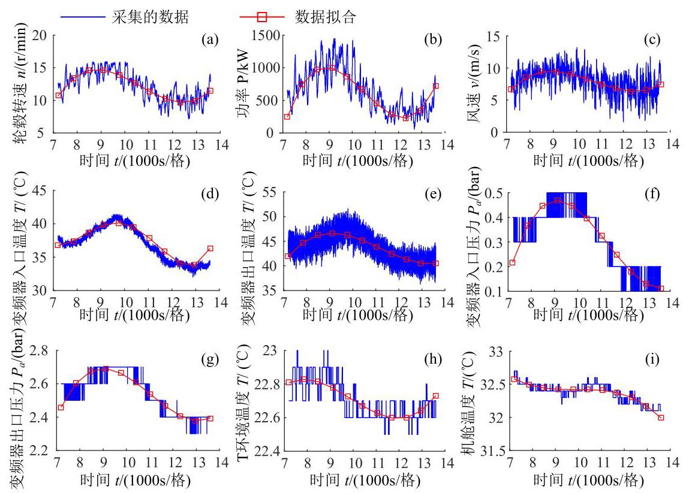

图 9.17 SCADA 系统部分数据曲线

#### 9.3.2.2 逆变器温度 NARX 预测模型

NARX 神经网络的学习训练过程就是不断修正各层神经元的连接权值、偏置量, 使得误差函数值最小化的过程。NARX 神经网络需要设置的网络参数主要包括: 输入层延迟个数、反馈层延迟个数和隐藏层大小。NARX 网络逆变器温度预测模型的性能不但与设置的网络参数有关，还与输入参数、训练数据选择有关。风电机组 SCADA 数据采样频率为 1Hz， 但是在训练模型时并不直接使用 1 秒采样周期的数据。这主要有以下两个原因:①采样频率为 1Hz 数据量太大。一天有 86400 组数据, 直接使用如此大的训练样本来训练 NARX 模型将花费大量时间。②如果减少训练的数据样本，如 20000 组数据，虽然会大大减少模型的训练时间, 但可能无法模拟风电机组逆变器的所有运行情况, 导致预测模型的性能欠佳。如果采用 10 分钟的数据, 一台风电机组一年只有 5.2 万多组数据, 而且, 所有的发电条件基本都会出现。但是, 10 分钟是一个相对较长的尺度, 其数据是 10 分钟内的平均值, 很多有价值的信息可能会被淹没, 不一定能真实反映逆变器的实时状态, 比如, 其中热惯性的影响将非常微弱。所以，这里采用 30 秒级的数据类型，每个数据都是 30 秒内取平均值。由于 NARX 网络具有较强的泛化能力, 个别异常值的影响可以忽略不计。

#### 9.3.2.3 逆变器温度 NARX 温度预测模型性能分析

根据前述步骤进行逆变器温度预测模型构建, 以均方误差(MSE)为评价标准, 发现性能最好的网络是由 36 个延迟和隐藏层中的 32 个神经元定义的网络。选用 40000 组 30 秒SCADA 数据构建模型, 其中数据样本划分如下: 70%为训练集, 15%为测试集, 15%为验证集。图 9.18 显示了使用 NARX 的预测数据和实际数据之间的比较, 用于训练、构建神经网络模型的 40000 组 SCADA 数据如图 9.18(a)和图 9.18(b)所示; 另外专门用于测试模型的 20000 组 SCADA 数据如图 9.18(c)和图 9.18(d)所示。相应地, 逆变器温度预测模型的预测误差结果如图 9.19 所示。此外, 判断预测残差异常值程度的标准是模型标准预测绝对值百分位数, 即在预测模型训练完成后, 将所有训练样本输入到模型中, 统计得出模型预测残差的绝对值百分位数。

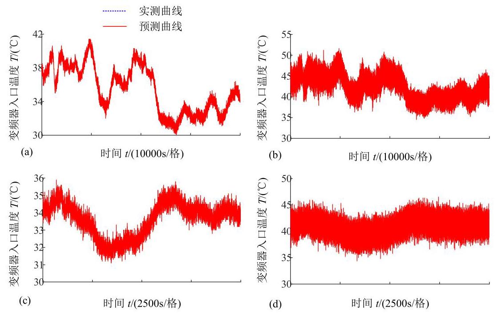

图 9.18 预测数据和实际数据对比

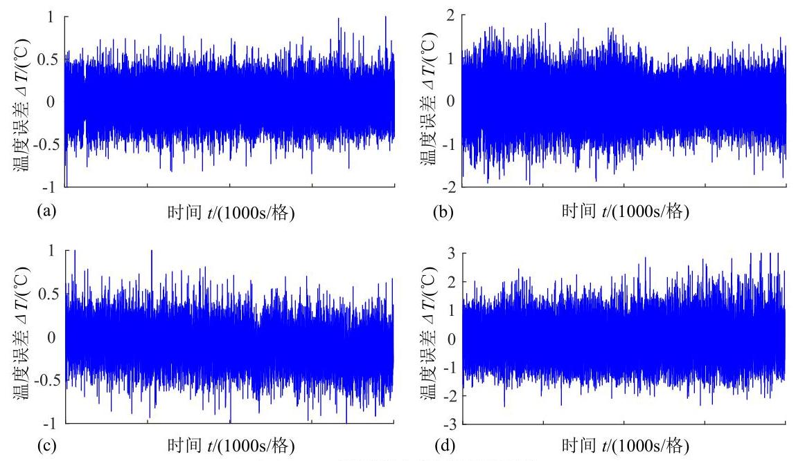

图 9.19 预测数据和实际数据的误差

基于 NARX 网络的逆变器温度预测与实际相吻合, 逆变器入口温度训练和预测误差都在 ${1}^{ \circ  }\mathrm{C}$ 以内,逆变器出口温度训练和预测误差分别在 ${2}^{ \circ  }\mathrm{C}\text{ 、 }{3}^{ \circ  }\mathrm{C}$ 以内。为了验证 NARX 模型在温度预测精度上的良好性能, 将其与反向传播 (back propagation, BP) 神经网络、线性神经网络、非线性投入产出(nonlinear input-output, NIO)神经网络和非线性自回归(nonlinear auto regressive, NAR) 神经网络等模型进行对比分析, 结果如表 9.6 所示。由表可以看出, NARX 模型的训练误差 MSE 和预测误差 MSE 均为最小, 逆变器进出口温度的预测精度最好。

表 9.6 预测模型误差对比

<table><tr><td rowspan="2">模型</td><td colspan="2">训练误差</td><td colspan="2">预测误差</td></tr><tr><td>ITI</td><td>OTI</td><td>ITI</td><td>OTI</td></tr><tr><td>BP 神经网络</td><td>7.6041</td><td>8.7614</td><td>4.3026</td><td>6.3396</td></tr><tr><td>线性神经网络</td><td>2.8852</td><td>4.7990</td><td>3.1875</td><td>5.8860</td></tr><tr><td>NIO 神经网络</td><td>1.3613</td><td>0.8375</td><td>2.6638</td><td>1.3516</td></tr><tr><td>NAR 神经网络</td><td>0.1426</td><td>0.8569</td><td>0.0835</td><td>2.1968</td></tr><tr><td>NARX 神经网络</td><td>0.0328</td><td>0.2096</td><td>0.0468</td><td>0.5855</td></tr></table>

注:ITI 变频器入口温度; OTI 变频器出口温度

### 9.3.3 基于 NARX 的风电机组运行健康状态监测

1. 风电机组温度预测建模参数选取

某山地风电场的 2MW 直驱式风电机组,其风轮直径 ${96}\mathrm{\;m}$ ,切入风速 $3\mathrm{\;m}/\mathrm{s}$ ,额定风速 11m/s，风轮转速 6~17r/min；其 SCADA 系统每 10 分钟记录一次以 1Hz 频率采集的风电机组状态和外部环境参数平均值。风电机组 SCADA 数据中有主轴承温度、机舱温度、轮毂温度、变频柜温度等 19 个温度数据, 其中尤以主轴承温度、机舱温度、轮毂温度等较为关键。由风电机组工作原理可知, 主轴承温度、机舱温度、轮毂温度与风电机组转子系统动平衡状态、相关运动部件润滑状态、摩擦磨损情况等息息相关，是较为关键的温度参数。以风电场 1 号风电机组稳定服役后第一年的 SCAD 系统监测数据为例, 关键温度参数与风电机组主要外部环境和运行状态参数之间关系如图 9.20 所示。由图 9.20(a)~(c)可知, 环境温度对风电机组三个关键温度参数的影响均非常明显, 关键温度参数均随着环境温度的升高呈线性增加, 但同一温度下主轴承温度的分布较其他两个温度参数分散, 表明环境温度以外的因素对主轴承温度的影响更显著。由图 9.20(d)~(f)可知，在低风速区三个关键温度参数分布较为分散; 在高风速区三个关键温度参数在高温区较为集中。这是因为: 在低风速区风电机组没工作或者处于欠功率运行状态, 关键温度参数主要受环境温度影响; 而在高风速区风电机组进入运行状态, 风速对关键温度参数的影响趋于显著; 主轴承作为旋转部件, 高风速区的温度上升趋势更为明显。除上述显而易见的规律以外，风速的提升还会改变风电机组的散热模式和散热速度。由图 ${9.20}\left( \mathrm{\;g}\right)  \sim  \left( \mathrm{l}\right)$ 可知,有功功率和风轮转速对关键温度参数的影响与风速类似,因为这两者本身即与风速具备较强的关联性。由图 ${9.20}\left( \mathrm{\;m}\right)  \sim  \left( \mathrm{o}\right)$ 可知,桨距角在接近 ${0}^{ \circ  }$ 时, 风电机组处于运行状态, 关键温度参数在高温区域较为集中; 其他运行状态下风电机组处于变桨过程或者停机状态, 关键温度参数分布较为均匀。另外, 由图 9.21(a)和(b)可知, 关键温度参数之间也具有明显的相关性。

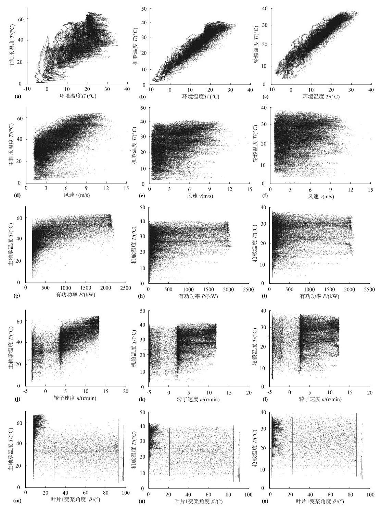

图 9.20 关键温度参数与其他参数相关性分析

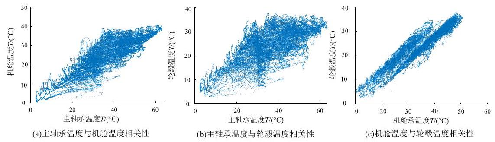

图 9.21 关键温度参数间的相关性分析

总体来看，环境温度对各关键温度参数而言是一个相对独立的影响因素；风速、有功功率、风轮转速和桨距角对关键温度参数有着明显可见的影响, 但是这四个数据参数均与风电机组工作状态有关, 互相之间存在信息冗余。由温度变化的物理机制可知, 风速与桨距角还分别包含了较独立的温度变化影响因素，而三个叶片变桨距系统间的协同性能归属于风电机组健康状态，这一信息只能以模型预测残差的形式体现出来，建模过程难以考虑计入。为了简化模型结构, 并将输入变量间的冗余信息控制在恰当的范围内, 这里选择的模型外部输入变量包括环境温度、风速、有功功率和风轮转速。

#### 9.3.3.2 NARX 预测模型构建

应用 NARX 神经网络, 可分别建立以某个关键温度参数预测值为输出的单输出预测模型, 也可建立同时输出多个关键温度参数预测值的多输出预测模型。这里, 以主轴承温度、 机舱温度、轮毂温度为预测模型输出。考虑到环境温度、风速、有功功率、轮毂转速等风电机组外部环境和运行控制参数对三个关键温度参数均具明显的影响, 而且关键温度参数之间也具有明显的相关性, 建立以主轴承温度、机舱温度、轮毂温度为自回归预测变量, 环境温度、风速、有功功率、轮毂转速为外部输入变量的多输入-多输出 NARX 神经网络预测模型。 这样, 建立一个多输入多输出的 NARX 神经网络预测模型, 不但可以减少模型的数量, 还能将关键温度参数之间的相关性也纳入预测模型, 有望提升模型预测精度。

NARX 模型结构参数直接关系到模型性能。首先, 需确定模型隐含层的层数。根据 Kolmogorov 定理, 一个包含一个隐含层的 BP 神经网络能够实现对任意非线性函数的逼近, 对于大多数问题可取得较好的效果，故这里采用单隐层神经网络。然后，还需要确定模型的反馈时延长度和隐含层节点数。选取 1 号风电机组稳定服役后第一年的 SCADA 数据为样本集, 随机选择样本集的 70%作为训练集、15%作为验证集、15%作为测试集, 采用先确定反馈时延长度 $a$ 后确定隐含层节点数优先策略。将隐含层节点个数固定为 10,反馈时延长度 $a$ 取 1~10 的不同值，测试集预测结果的均方误差与延时长度之间的关系，如图 9.22 所示。由图可知,反馈时延长度 $a$ 取值大于 6 时,预测模型的均方误差基本稳定,故选用 $a$ 值为 6, 即考虑 70 分钟的历史状态对当前状态的影响。将反馈时延长度 $a$ 取值固定为 6,隐含层节点数取 $2 \sim  {12}$ 的不同值，测试集预测结果的均方误差与延时长度之间的关系如图 9.22(b)所示， 由图可知，当隐含层节点数大于 8 时，模型的预测精度基本稳定，故隐含层节点数取值为 8 。

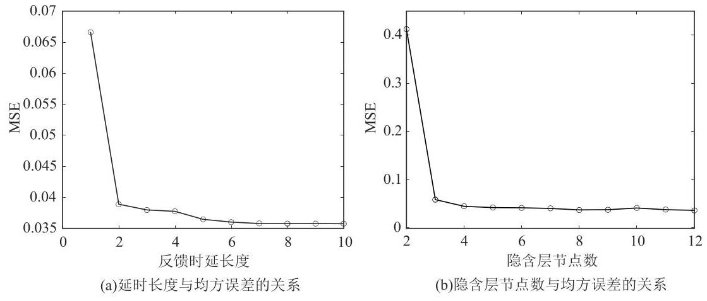

图 9.22 反馈时延长度和隐含层节点数对预测精度的影响

#### 9.3.3.3 风电机组运行状态健康指标

以风电场 1 号风电机组稳定服役后第一年的 SCADA 数据作为训练样本，输入 NARX 模型得到 3 个关键温度参数预测残差均值如图 9.23(a)所示。由图可知, 大部分预测残差数值非常小, 表明 NARX 模型具有较高的预测精度。但图中也有极少数残差数值非常大, 这里就两个残差异常点来观察分析。1 月 22 日 12:55 模型的预测残差为 ${11.6}^{ \circ  }\mathrm{C}$ ,提取与其临近的 SCADA 原始数据如表 9.7 所示。由表可见, 风速在切入风速上下, 风电机组处于启动状态; 除开前面两个时间点即 12:25、12:35 的环境温度出现异常分别达到 ${154.77}^{ \circ  }\mathrm{C}\text{ 、 }{317.37}^{ \circ  }\mathrm{C}$ 外，4 个模型输入数据都未见其他明显异常，特别是 3 个关键温度数据均未见异常。所以， 图中该时刻残差奇异值可能是由于环境温度数据异常造成的, 风电机组仍然处于正常运行状态。3 月 3 日 11:25 模型的预测残差为 ${5.1}^{ \circ  }\mathrm{C}$ ,提取与其临近的 SCADA 数据如表 9.8 所示。 由表可见, 风速在切入风速以下, 风电机组处于停机状态; 但 SCADA 系统记录的轮毂温度由 3 月 3 日 11:15 的 ${18.44}^{ \circ  }\mathrm{C}$ 急剧下降到了 11:25 的 ${0.31}^{ \circ  }\mathrm{C}$ ,并且随后两个 ${0}^{ \circ  }\mathrm{C}$ 。所以,图中该时刻残差奇异值是轮毂温度数据异常造成的, 风电机组仍然处于正常运行状态。由上述分析可知, 预测模型产生残差奇异值的原因也有可能是监测数据异常造成的, 而且, 这些监测数据异常是偶发随机的; 考虑到 SCADA 系统已经自带温度阈值报警功能, 因此不必过多关注残差本身的数值大小，在依据温度预测残差进行风电机组运行状态健康评估时，而应该关注残差值的离群程度。例如, 虽然 1 月 22 日 12:55 预测残差数值上是 3 月 3 日 11:25 预测残差的一倍以上,但由于模型 ${85}\%$ 的预测残差在 $\pm  {0.2}^{ \circ  }\mathrm{C}$ 以内,从离群程度来看,两者差别不大。

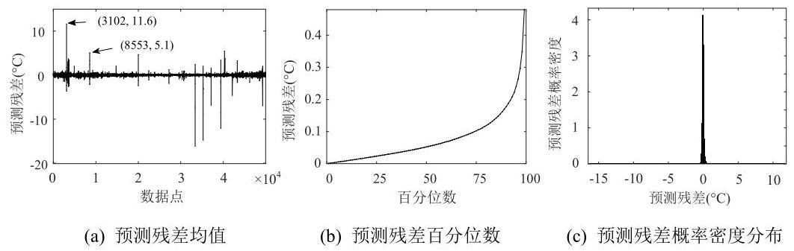

图 9.23 NARX 模型预测残差分析

表 9.7 某年度 1 月 22 日 12:55 附近的 SCADA 数据 (图 9.24(a))

<table><tr><td>时间戳</td><td>风轮转速 /(r/min)</td><td>风速 /(m/s)</td><td>有功功率 /kW</td><td>环境温度 /℃</td><td>主轴承温度 /℃</td><td>轮毂温度 /℃</td><td>机舱温度 /℃</td></tr><tr><td>11:55</td><td>0</td><td>3.39</td><td>0</td><td>7.95</td><td>14.34</td><td>0</td><td>12.7</td></tr><tr><td>12:05</td><td>-0.01</td><td>3.17</td><td>0</td><td>8.17</td><td>14.27</td><td>10.57</td><td>12.85</td></tr><tr><td>12:15</td><td>0</td><td>2.78</td><td>0</td><td>9.18</td><td>14.22</td><td>10.85</td><td>12.82</td></tr><tr><td>12:25</td><td>0.01</td><td>3.15</td><td>0</td><td>154.77</td><td>14.13</td><td>11.33</td><td>12.77</td></tr><tr><td>12:35</td><td>-0.01</td><td>4.42</td><td>0</td><td>317.37</td><td>14.04</td><td>11.21</td><td>12.74</td></tr><tr><td>12:45</td><td>0.01</td><td>5.23</td><td>0</td><td>9.17</td><td>14</td><td>11.24</td><td>12.97</td></tr><tr><td>12:55</td><td>4.29</td><td>3.68</td><td>59</td><td>8.78</td><td>13.94</td><td>11.99</td><td>12.76</td></tr><tr><td>13:05</td><td>8.56</td><td>4.88</td><td>191</td><td>8.79</td><td>14.72</td><td>12.92</td><td>12.59</td></tr><tr><td>13:15</td><td>7.77</td><td>3.64</td><td>125</td><td>8.93</td><td>16.44</td><td>13.25</td><td>12.97</td></tr><tr><td>13:25</td><td>7.74</td><td>4.2</td><td>128</td><td>8.74</td><td>18.23</td><td>13.53</td><td>13.22</td></tr></table>

表 9.8 某年度 3 月 3 日 11:25 附近的的 SCADA 数据 (图 9.24(a))

<table><tr><td>时间戳</td><td>风轮转速 /(r/min)</td><td>风速 /(m/s)</td><td>有功功率 /kW</td><td>环境温度 /℃</td><td>主轴承温度 /℃</td><td>轮毂温度 /℃</td><td>机舱温度 /℃</td></tr><tr><td>10:25</td><td>0</td><td>2.86</td><td>0</td><td>11.37</td><td>28.05</td><td>21.61</td><td>18.61</td></tr><tr><td>10:35</td><td>0</td><td>2.69</td><td>0</td><td>10.89</td><td>27.88</td><td>20.95</td><td>18.31</td></tr><tr><td>10:45</td><td>0.02</td><td>3.7</td><td>0</td><td>10.21</td><td>27.75</td><td>21.32</td><td>18.2</td></tr><tr><td>10:55</td><td>0.02</td><td>4.72</td><td>0</td><td>9.75</td><td>27.61</td><td>21.21</td><td>18.01</td></tr><tr><td>11:05</td><td>0</td><td>1.43</td><td>0</td><td>6.4</td><td>25.1</td><td>18.41</td><td>15.7</td></tr><tr><td>11:15</td><td>0</td><td>2.03</td><td>0</td><td>6.22</td><td>25.01</td><td>18.44</td><td>15.56</td></tr><tr><td>11:25</td><td>0</td><td>2.57</td><td>0</td><td>6.48</td><td>24.84</td><td>0.31</td><td>15.29</td></tr><tr><td>11:45</td><td>0</td><td>2.53</td><td>0</td><td>6.52</td><td>24.58</td><td>0</td><td>15.26</td></tr><tr><td>11:45</td><td>0</td><td>3.78</td><td>0</td><td>6.43</td><td>24.34</td><td>0</td><td>14.96</td></tr><tr><td>11:55</td><td>0</td><td>2.06</td><td>0</td><td>6.77</td><td>24.21</td><td>12.56</td><td>14.84</td></tr></table>

显然, 直接应用预测残差值是否超过设定的阈值来识别风电机组运行状态, 可能会因为存在监测数据偶发异常而出现虚报现象。为此, 这里基于模型预测残差值百分数, 提出一种基于温度相关参数视角的健康指标 (health index from the perspective of temperature-related parameters, HIPT), 其计算方法为

$$
\operatorname{HIPT}\left( t\right)  = \frac{\mathop{\sum }\limits_{{s = t - c}}^{t} - \lg \left( {1 - {0.01}{\mathrm{{OPN}}}_{s}}\right) }{\mathop{\sum }\limits_{{s = t - c}}^{t} - \lg \left( {1 - {0.01}{\mathrm{{PN}}}_{s}}\right) } \tag{9.39}
$$

式中, $\operatorname{HIPT}\left( t\right)$ 为 $t$ 时刻的风电机组运行状态健康指标; 参数 $c$ 为计算该健康指标时考虑的时间窗口长度; ${\mathrm{{PN}}}_{s}$ 为与 $s$ 时刻模型预测残差绝对值最接近(对应的)的标准预测残差绝对值百分位数(小于或者等于 100); ${\mathrm{{OPN}}}_{s}$ 计算方法为

$$
{\mathrm{{OPN}}}_{s} = \left\{  \begin{matrix} {\mathrm{{PN}}}_{s}, & E\left( s\right)  \leq  \mathrm{{AT}} \\  0, & E\left( s\right)  > \mathrm{{AT}} \end{matrix}\right. \tag{9.40}
$$

式中, $E\left( s\right)$ 为模型预测残差绝对值; AT 为残差异常阈值。

$\operatorname{HIPT}\left( t\right)$ 反映的是一定时间窗口内正常预测残差的加权占比，HIPT $\left( t\right)  \leq  1$ 。从式(9.39) 可知,预测残差超过阈值事件越少, $\operatorname{HIPT}\left( t\right)$ 越接近于 1 。这也就是说, $\operatorname{HIPT}\left( t\right)$ 越大,在时间窗口内关键温度参数的预测值和实测值符合程度越高; $\operatorname{HIPT}\left( t\right)$ 越小,在时间窗口内关键温度参数的预测值和实测值符合程度越低。HIPT 既可以用于基于单一参数预测的状态评估, 也可以用于基于多个参数预测的状态评估。

在模型构建过程中, 对模型预测残差的绝对值进行统计, 可以得到预测残差的百分位数和概率密度分布，分别如图 9.23(b)和(c)所示。由于模型的预测残差不服从常见的概率分布模型, 故采用百分位数作为预测残差离群程度的判别标准。从图 9.23(b)可见, 预测残差绝对值 ${0.2}^{ \circ  }\mathrm{C}\left( {\pm {0.2}^{ \circ  }\mathrm{C}}\right)$ 对应的百分位数约为 85。经过综合分析,时间窗口的持续时间 $c$ 和预测残余异常的阈值 AT 分别取值为 287(对应窗口时长为 2 天)和 ${0.5}^{ \circ  }\mathrm{C}$ 时， $\operatorname{HIPT}\left( t\right)$ 能较好地反映了风电机组运行健康状况。

这里提出的方法可以分为离线和在线两个阶段，离线阶段为风电机组状态监测准备预测模型和必要的参数。在在线阶段, 利用被监测风电机组的在线 SCADA 数据对风电机组健康状态进行评估。在这一阶段中, 首先, 利用离线阶段建立的温度参数预测模型对当前温度参数数值进行预测。然后, 将预测值与实际测量值进行对比, 得到预测残差。接着, 将模型在一定时间窗口内的预测残差映射为 HIPT。最后, 通过 HPIT 对风电机组健康状态进行评估。 后续的分析还表明, 为 HIPT 设置低阈值, 即可有效的实现风电机组故障停机预测 (就本研究涉及的风电机组而言, 0.5 是一个有效的 HIPT 低阈值)。

### 9.3.4 风电机组实例分析

首先, 从较大的时间尺度考察风电机组运行健康状态指标及其评估方法的有效性。图 9.24 是 1 号风电机组服役第二年 HIPT 曲线及同时的异常停机记录, 图 9.25 是 1 号风电机组服役第三年 HIPT 及同时的异常停机记录。异常停机事件是以风速大于切入风速但风电机组没有功率输出作为判别条件从 SCAD 数据中筛选得到的。由图 9.24 和图 9.25 可知，1 号风电机组在服役第 2 年年初、第 3 年年初、第 3 年年末都存在较为密集的异常停机点，这三个时间段的风电机组健康指标值也大多位于较低水平(0.5 以下)；而风电机组工作正常时健康指标大多位于较高水平(0.5 以上)。这表明 HIPT 与风电机组的异常停机具有明显的关联性， HIPT 变化整体趋势与风电机组实际的健康状态相符。1 号风电机组在其他时刻还有一些孤立的异常停机点，有些异常停机点对应的 HIPT 明显较低，如服役第二年的 12 月 7 日 2:25 和 12 月 7 日 5:35；也存在一些异常停机点对应的 HIPT 仍位于较高水平，如服役第三年的 5 月 16 日 5:15、5 月 23 日 9:15。这可能是因为，一方面这里 HIPT 只包含了 3 个关键温度异常而不是所有的异常情况; 另一方面并非全部异常停机都是由风电机组运行状态健康问题造成的。

接着, 考察同一风电场 2 号风电机组预测监测情况。图 9.26(a)是模型预测残差序列, 图 9.26(b)是模型标准预测残差绝对值百分位数; 图 9.27 是 2 号风电机组服役第二年 HIPT 及同时的异常停机记录，图 9.28 是 2 号风电机组服役第三年 HIPT 及同时的异常停机记录。 由图 9.26~图 9.28 可知，与 1 号风电机组的情况类似，2 号风电机组 HIPT 与异常停机也具有明显的关联; 2 号风电机组模型标准预测残差绝对值百分位数与 1 号风电机组差别明显, 模型应用于不同风电机组预测精度存在个体差异, 但是, 1 号和 2 号风电机组 HIPT 的分布范围则差别不大, 该健康指标比预测模型本身表现更为稳定。

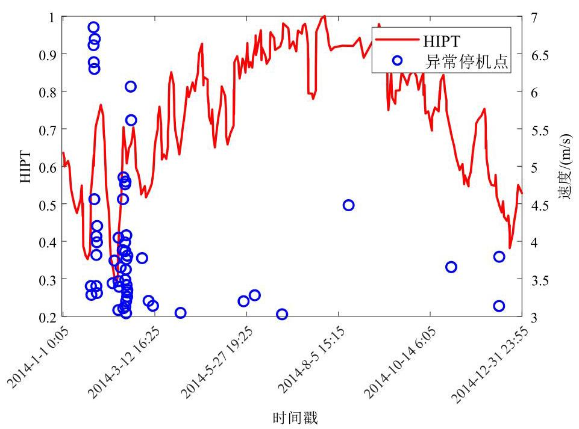

图 9.241 号风电机组服役第二年健康指标与异常停机关联分析

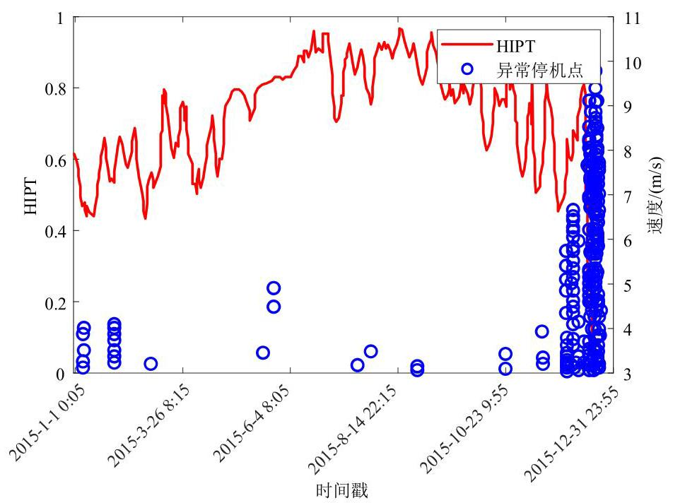

图 9.251 号风电机组服役第三年健康指标与异常停机关联分析

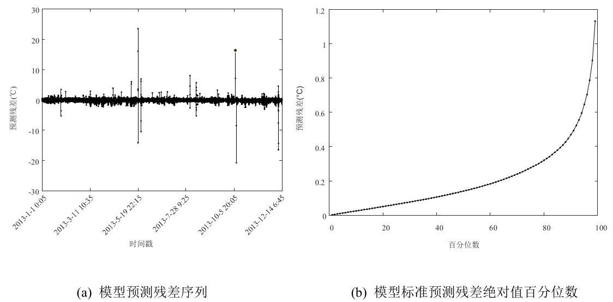

图 9.262 号风电机组预测模型的预测残差与标准预测残差绝对值百分位数

然后, 从较小的时间尺度对风电机组 HIPT 及同时的异常停机事件关联性进行分析。从 1 号和 2 号风电机组服役第二年 HIPT 序列中, 分别随机选择 100 个无异常停机发生的连续样本点, 绘制 HIPT 变化曲线, 如图 9.29 所示。在这两个时间段中, 对应的风电机组均在工作和停机状态之间进行了多次切换, 图中对发生了工况切换的样本点进行了标识。由图可知, 风电机组工况的正常切换不会使风电机组 HIPT 发生突变, 也不会明显的改变 HIPT 的变化趋势。这是可能是因为, 一方面模型的训练样本覆盖了风电机组全部工况, 另一方面 HIPT 对于风电机组工况的正常切换具有良好的适应性。

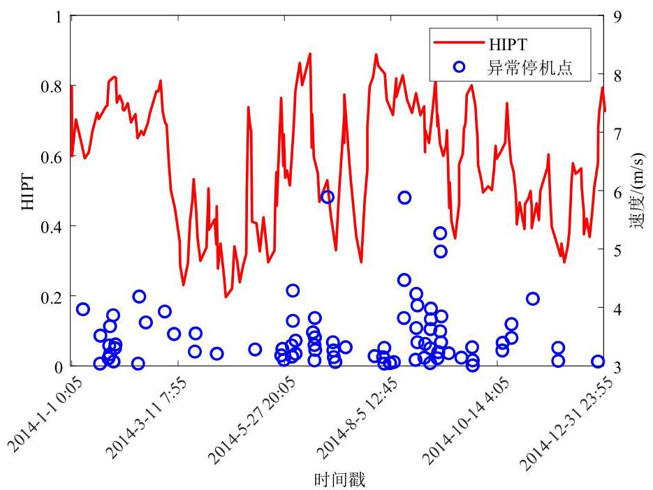

图 9.272 号风电机组服役第二年健康指标与异常停机关联分析

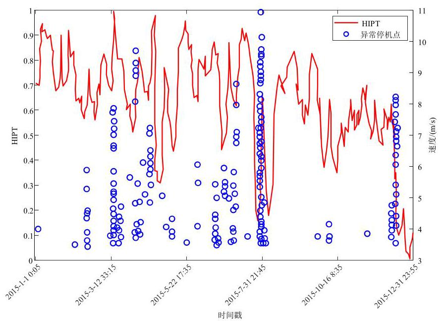

图 9.282 号风电机组服役第三年健康指标与异常停机关联分析

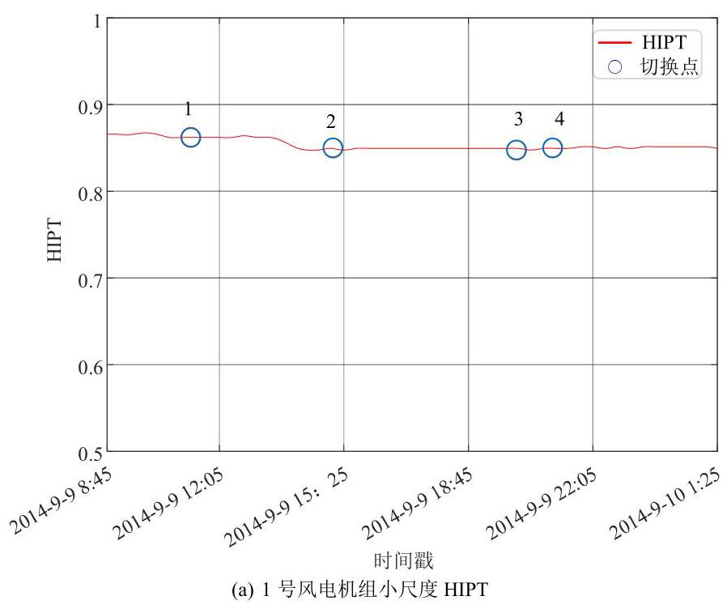

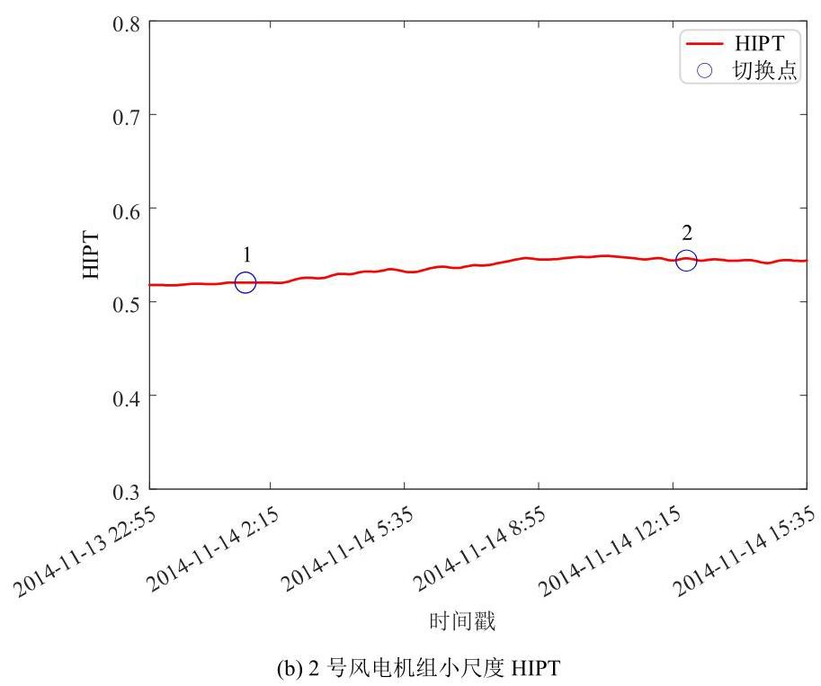

图 9.29 风电机组工况切换时健康指标稳定性分析

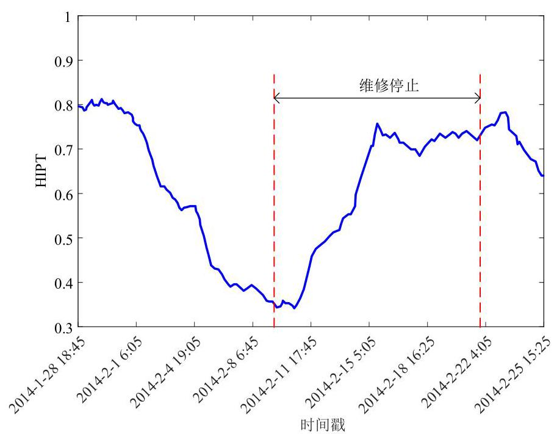

图 9.30 1 号风电机组某次维护前后健康指标变化趋势分析

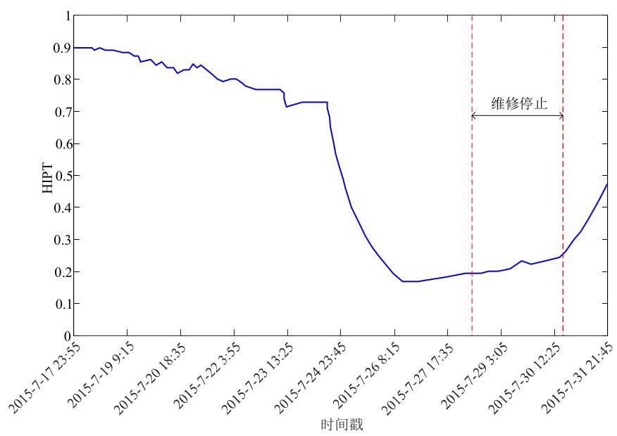

图 9.31 2 号风电机组某次维护前后健康指标变化趋势分析

最后, 聚焦于风电机组维护前后的 HIPT 变化。图 9.30 是 1 号风电机组服役第二年某次维护前后 HIPT 曲线。由图可知, 1 号风电机组处于连续停机状态时间长达 12 天, 且这段时间内有许多时刻具备发电的风速条件。结合 SCADA 系统事件记录可以断定这一时间段内现场运维人员对该风电机组进行了维护。在连续停机开始之前 8 天，风电机组 HIPT 即开始出现持续下降趋势。图 9.31 是 2 号风电机组服役第三年某次维护前后 HIPT 曲线。由图可知, 该风电机组处于连续停机状态为 2 天。与图 9.30 所示情况类似, 结合 SCADA 系统事件记录可以断定这一时间段内现场运维人员对该风电机组进行了维护。在连续停机开始之前 3 天, 该风电机组 HIPT 即开始持续下降。在图 9.30 和图 9.31 所示的实例中, 风电机组 HIPT 的下降明显早于异常停机发生，说明 HIPT 能有效地反映风电机组某些早期状态健康问题， 可为风电机组运行状态预警与随后的科学维护提供依据。

对比以上两个实例可以发现, 风电机组停机维护开始以后, HIPT 的变化趋势有区别。 图 9.30 所示的例子中, 风电机组停机维护开始以后健康指标立即回升, 而图 9.31 所示的例子则不是这样。从风电机组 SCADA 系统事件日志可知, 这是因为, 图 9.30 所示例子的风电机组故障与变桨距系统有关, 停机即使得风电机组的健康问题不再显现; 图 9.31 所示例子的风电机组故障与电气系统有关，停机后风电机组健康问题仍然可由 HIPT 反映。

## 9.4 参考文献

[1] Wang K S, Sharma V S, Zhang Z Y. SCADA data based condition monitoring of wind turbines[J]. Advances in Manufacturing, 2014, 2: 61-69.

[2] Sun P, Jian L, Caisheng W, et al. A generalized model for wind turbine anomaly identification based on SCADA data[J]. Applied Energy, 2016, 168: 550-567.

[3] Tautz-Weinert J, Watson S J. Using SCADA data for wind turbine condition monitoring—A review[J]. IET Renewable Power Generation, 2017, 11(4): 382-394.

[4] Dao P B, Staszewski W J, Barszcz, et al. Condition monitoring and fault detection in wind turbines based on cointegration analysis of SCADA data[J]. Renewable Energy, 2018, 116: 107-122.

[5] Wilkinson M, Darnell B, Van Delft T, et al. Comparison of methods for wind turbine condition monitoring with SCADA data[J]. IET Renewable Power Generation, 2014, 8(4): 390-397.

[6] Schlechtingen M, Santos I F. Comparative analysis of neural network and regression based condition monitoring approaches for wind turbine fault detection[J]. Mechanical Systems and Signal Processing, 2011, 25(5): 1849-1875.

[7] Feng Y, Qiu Y, Crabtree C J, et al. Monitoring wind turbine gearboxes[J]. Wind Energy, 2013, 16(5): 728-740.

[8] Natili F, Daga A P, Castellani F, et al. Multi-scale wind turbine bearings supervision techniques using industrial SCADA and vibration data[J]. Applied Sciences, 2021, 11(15): 6785.

[9] Tutivén C, Vidal Y, Insuasty A, et al. Early fault diagnosis strategy for WT main bearings based on SCADA data and one-class SVM[J]. Energies, 2022, 15(12): 4381.

[10] Beretta M, Julian A, Sepulveda J, et al. An ensemble learning solution for predicitive manintenance of wind turbines main bearing[J]. Sensors, 2021, 21(4): 1512.

[11] Xu Z, Yang P, Zhao Z, et al. Fault diagnosis approach of main drive chain in wind turbine based on data fusion[J]. Applied Sciences, 2021, 11(13): 5804.

[12] Beretta M, Vidal Y, Sepulveda J, et al. Improved ensemble learning for wind turbine main bearing fault diagnosis[J]. Applied Sciences, 2021, 11(16): 7523.

[13] Nejad A R, Keller J, Guo Y, et al. Wind turbine drive trains: State-of-the-art technologies and future development trends[J]. Wind Energy Science, 2022, 7(1): 387-411.

[14] Zhang Y, Zheng H, Liu J, et al. An anomaly identification model for wind turbine state parameters[J]. Journal of cleaner production, 2018, 195: 1214-1227.

[15] 周凌, 赵前程, 朱岸锋, 等. 基于 FISSA-DBN 模型的风电机组运行状态监测[J]. 振动、测试与诊断, 2023, 43(1): 80-87,199.

[16] Zheng Y F, Gao Z H, Shen J, et al. Optimising automatic text classification approach in adaptive online collaborative discussion-A perspective of attention mechanism-based Bi-LSTM[J]. IEEE Transactions on Learning Technologies, 2022, 16(5): 591-602.

[17] Xiang L, Wang P, Yang X, et al. Fault detection of wind turbine based on SCADA data analysis using CNN and LSTM with attention mechanism[J]. Measurement, 2021, 175: 109094.

[18] Xiao X C, Liu J X, Liu D S, et al. A normal behavior-based condition monitoring method for wind turbine main bearing using dual attention mechanism and Bi-LSTM[J]. Energies, 2022, 15(22): 8462.

[19] Wang X, Zhao Q C, Yang X B, et al. Condition monitoring of wind turbines based on analysis of temperature related parameters in supervisory control and data acquisition data[J]. Measurement and Control, 2020, 53(1-2): 164-180.

[20] Ling Q H, Zhang W, Zhao Q C, et al. Investigation of inverter temperature prediction model in wind farm based on SCADA data[J]. Energy Engineering, 2022, 119(1): 287-300.

[21] Bahdanau D, Cho K, Bengio Y. Neural machine translation by jointly learning to align and translate[C]. International Conference on Learning Representations, San Diego, 2015,1-15.

[22] Vaswani A, Shazeer N, Parmar N, et al. Attention is all you need[C]. Advances in Neural Information Processing Systems, Long Beach, 2017,5998-6008.

[23] Hochreiter S, Schmidhuber J. Long short-term memory[J]. Neural Computation, 1997, 9(8): 1735-1780.

[24] Schuster M, Paliwal K K. Bidirectional recurrent neural networks[J]. IEEE Transactions on Signal Processing, 1997, 45(11): 2673-2681.

[25] Spinato F, Tavner P J, Van Bussel G J W, et al. Reliability of wind turbine subassemblies[J]. IET Renewable Power Generation, 2009, 3(4): 387-401.

[26] Pérez J M P, Márquez F P G, Tobias A, et al. Wind turbine reliability analysis[J]. Renewable and Sustainable Energy Reviews, 2013, 23: 463-472.

[27] Sheng S. Report on wind turbine subsystem reliability-a survey of various databases (presentation)[R]. National Renewable Energy Lab.(NREL), Golden, CO (United States), 2013.

[28] Artigao E, Martín-Martínez S, Honrubia-Escribano A, et al. Wind turbine reliability: A comprehensive review towards effective condition monitoring development[J]. Applied energy, 2018, 228: 1569-1583.
