# 第5章 神经网络

## 5.1 神经元模型

神经网络(neural networks) 方面的研究很早就已出现, 今天 “神经网络” 已是一个相当大的、多学科交叉的学科领域. 各相关学科对神经网络的定义多种多样, 本书采用目前使用得最广泛的一种, 即 “神经网络是由具有适应性的简单单元组成的广泛并行互连的网络, 它的组织能够模拟生物神经系统对真实世界物体所作出的交互反应” [Kohonen, 1988]. 我们在机器学习中谈论神经网络时指的是 “神经网络学习”, 或者说, 是机器学习与神经网络这两个学科领域的交叉部分.

---

本书所谈的是 “人工神经网络”, 不是生物学意义上的神经网络.

这是 T. Kohonen 1988 年在 Neural Networks 创刊号上给出的定义.

亦称 bias. 注意不是 “阀值”，虽然其含义的确类似于“阀门”.

---

神经网络中最基本的成分是神经元(neuron)模型, 即上述定义中的 “简单单元”. 在生物神经网络中，每个神经元与其他神经元相连，当它“兴奋”时， 就会向相连的神经元发送化学物质，从而改变这些神经元内的电位；如果某神经元的电位超过了一个 “阈值” (threshold), 那么它就会被激活, 即 “兴奋” 起来，向其他神经元发送化学物质.

1943 年, [McCulloch and Pitts, 1943] 将上述情形抽象为图 5.1 所示的简单模型, 这就是一直沿用至今的 “M-P 神经元模型”. 在这个模型中, 神经元接收到来自 $n$ 个其他神经元传递过来的输入信号,这些输入信号通过带权重的连接(connection)进行传递, 神经元接收到的总输入值将与神经元的阈值进行比较, 然后通过 “激活函数” (activation function) 处理以产生神经元的输出.

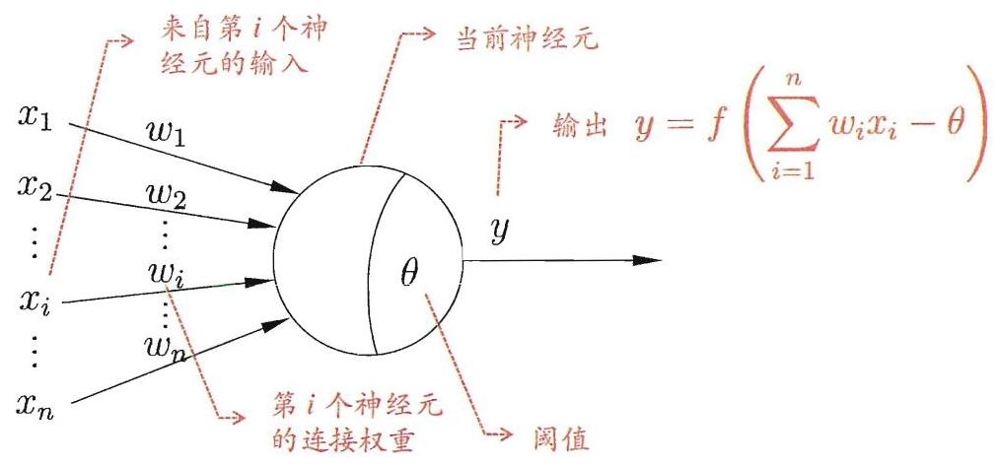

图 5.1 M-P 神经元模型

---

neuron 亦称 unit.

亦称 “响应函数”.

这里的阶跃函数是单位阶跃函数的变体; 对数几率函数则是 Sigmoid 函数的典型代表. 参见 3.3 节.

---

理想中的激活函数是图 5.2(a) 所示的阶跃函数, 它将输入值映射为输出值 “ 0 ” 或 “ 1 ”，显然 “ 1 ” 对应于神经元兴奋， “ 0 ” 对应于神经元抑制. 然而，阶跃函数具有不连续、不光滑等不太好的性质，因此实际常用 Sigmoid 函数作为激活函数. 典型的 Sigmoid 函数如图 5.2(b) 所示, 它把可能在较大范围内变化的输入值挤压到 (0,1) 输出值范围内, 因此有时也称为 “挤压函数" (squashing function).

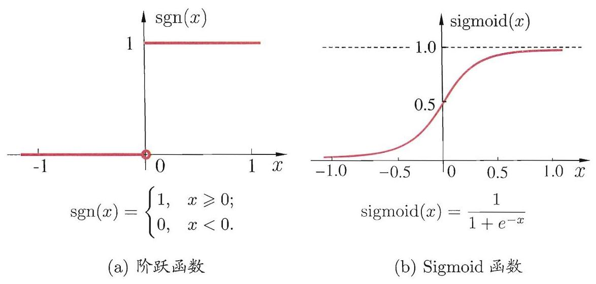

图 5.2 典型的神经元激活函数

把许多个这样的神经元按一定的层次结构连接起来, 就得到了神经网络.

事实上, 从计算机科学的角度看, 我们可以先不考虑神经网络是否真的模拟了生物神经网络, 只需将一个神经网络视为包含了许多参数的数学模型, 这个模型是若干个函数,例如 ${y}_{j} = f\left( {\mathop{\sum }\limits_{i}{w}_{i}{x}_{i} - {\theta }_{j}}\right)$ 相互(嵌套)代入而得. 有效的神经网络学习算法大多以数学证明为支撑.

---

“模拟生物神经网络” 是认知科学家对神经网络所做的一个类比阐释.

例如 10 个神经元两两连接, 则有 100 个参数: 90 个连接权和 10 个阈值.

---

## 5.2 感知机与多层网络

感知机(Perceptron)由两层神经元组成，如图 5.3 所示，输入层接收外界输入信号后传递给输出层, 输出层是 M-P 神经元, 亦称 “阈值逻辑单元" (threshold logic unit).

感知机能容易地实现逻辑与、或、非运算. 注意到 $y = f\left( {\mathop{\sum }\limits_{i}{w}_{i}{x}_{i} - \theta }\right)$ ,假定 $f$ 是图 5.2 中的阶跃函数，有

- “与” $\left( {{x}_{1} \land  {x}_{2}}\right)$ : 令 ${w}_{1} = {w}_{2} = 1,\theta  = 2$ ,则 $y = f\left( {1 \cdot  {x}_{1} + 1 \cdot  {x}_{2} - 2}\right)$ ,仅

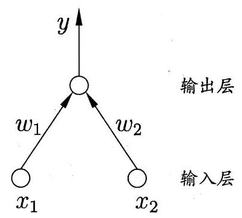

图 5.3 两个输入神经元的感知机网络结构示意图

在 ${x}_{1} = {x}_{2} = 1$ 时, $y = 1$ ;

- “或” $\left( {{x}_{1} \vee  {x}_{2}}\right)$ : 令 ${w}_{1} = {w}_{2} = 1,\theta  = {0.5}$ ,则 $y = f\left( {1 \cdot  {x}_{1} + 1 \cdot  {x}_{2} - {0.5}}\right)$ , 当 ${x}_{1} = 1$ 或 ${x}_{2} = 1$ 时, $y = 1$ ;

- “非” $\left( {\neg {x}_{1}}\right)$ : 令 ${w}_{1} =  - {0.6},{w}_{2} = 0,\theta  =  - {0.5}$ ,则 $y = f( - {0.6} \cdot  {x}_{1} + 0$ . $\left. {{x}_{2} + {0.5}}\right)$ ,当 ${x}_{1} = 1$ 时, $y = 0$ ; 当 ${x}_{1} = 0$ 时, $y = 1$ .

---

${x}_{i}$ 是 $\mathbf{x}$ 对应于第 $i$ 个输入神经元的分量.

---

更一般地,给定训练数据集,权重 ${w}_{i}\left( {i = 1,2,\ldots , n}\right)$ 以及阈值 $\theta$ 可通过学习得到. 阈值 $\theta$ 可看作一个固定输入为 -1.0 的 “哑结点” (dummy node) 所对应的连接权重 ${w}_{n + 1}$ ,这样,权重和阈值的学习就可统一为权重的学习. 感知机学习规则非常简单,对训练样例 $\left( {\mathbf{x}, y}\right)$ ,若当前感知机的输出为 $\widehat{y}$ ,则感知机权重将这样调整:

$$
{w}_{i} \leftarrow  {w}_{i} + \Delta {w}_{i} \tag{5.1}
$$

$$
\Delta {w}_{i} = \eta \left( {y - \widehat{y}}\right) {x}_{i}, \tag{5.2}
$$

---

$\eta$ 通常设置为一个小正数, 例如 0.1 .

---

其中 $\eta  \in  \left( {0,1}\right)$ 称为学习率(learning rate). 从式(5.1) 可看出,若感知机对训练样例 $\left( {\mathbf{x}, y}\right)$ 预测正确,即 $\widehat{y} = y$ ,则感知机不发生变化,否则将根据错误的程度进行权重调整.

---

“非线性可分”意味着用线性超平面无法划分.

---

需注意的是, 感知机只有输出层神经元进行激活函数处理, 即只拥有一层功能神经元(functional neuron)，其学习能力非常有限. 事实上，上述与、或、 非问题都是线性可分(linearly separable)的问题. 可以证明 [Minsky and Papert, 1969], 若两类模式是线性可分的, 即存在一个线性超平面能将它们分开, 如图 5.4(a)-(c) 所示, 则感知机的学习过程一定会收敛(converge) 而求得适当的权向量 $\mathbf{w} = \left( {{w}_{1};{w}_{2};\ldots ;{w}_{n + 1}}\right)$ ; 否则感知机学习过程将会发生振荡 (fluctuation), $\mathbf{w}$ 难以稳定下来，不能求得合适解，例如感知机甚至不能解决如图 5.4(d) 所示的异或这样简单的非线性可分问题.

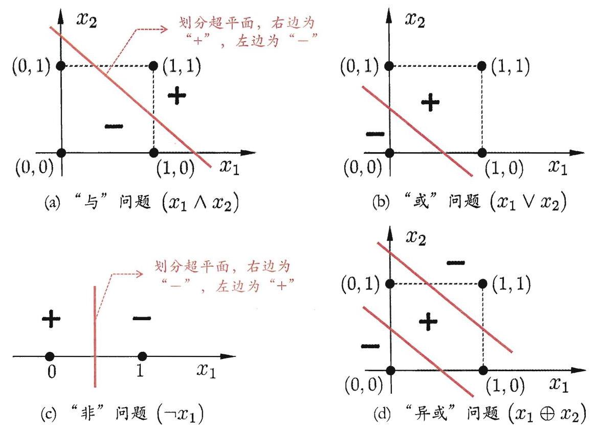

图 5.4 线性可分的 “与” “或” “非” 问题与非线性可分的 “异或” 问题

要解决非线性可分问题, 需考虑使用多层功能神经元. 例如图 5.5 中这个简单的两层感知机就能解决异或问题. 在图 5.5(a)中, 输出层与输入层之间的一层神经元, 被称为隐层或隐含层(hidden layer), 隐含层和输出层神经元都是拥有激活函数的功能神经元.

更一般的, 常见的神经网络是形如图 5.6 所示的层级结构, 每层神经元与下一层神经元全互连, 神经元之间不存在同层连接, 也不存在跨层连接. 这样的神经网络结构通常称为 “多层前馈神经网络” (multi-layer feedforward neural networks), 其中输入层神经元接收外界输入, 隐层与输出层神经元对信号进行加工, 最终结果由输出层神经元输出; 换言之, 输入层神经元仅是接受输入, 不进行函数处理, 隐层与输出层包含功能神经元. 因此, 图 5.6(a) 通常被称为 “两层网络”. 为避免歧义, 本书称其为 “单隐层网络”. 只需包含隐层, 即可称为多层网络. 神经网络的学习过程，就是根据训练数据来调整神经元之间的 “连接权” (connection weight) 以及每个功能神经元的阈值; 换言之, 神经网络 “学” 到的东西, 蕴涵在连接权与阈值中.

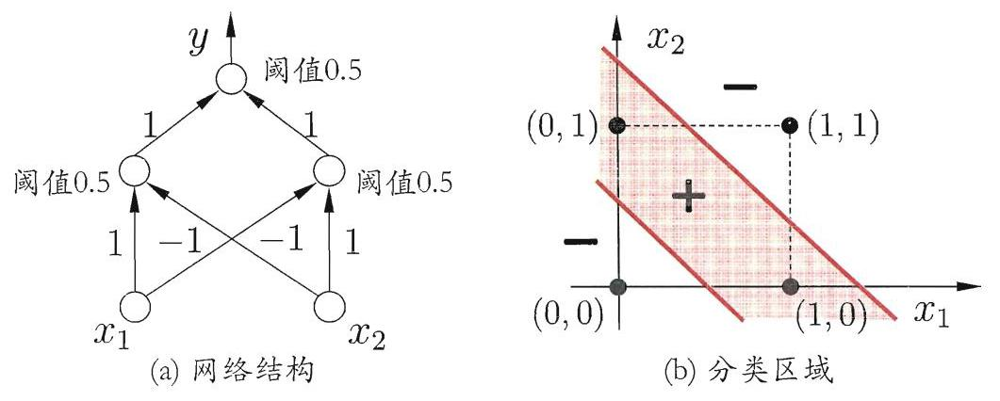

图 5.5 能解决异或问题的两层感知机

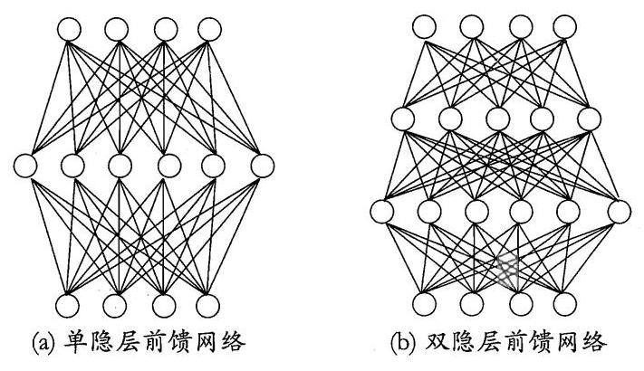

图 5.6 多层前馈神经网络结构示意图

## 5.3 误差逆传播算法

多层网络的学习能力比单层感知机强得多. 欲训练多层网络, 式(5.1)的简单感知机学习规则显然不够了，需要更强大的学习算法. 误差逆传播(error BackPropagation, 简称 BP)算法就是其中最杰出的代表, 它是迄今最成功的神经网络学习算法. 现实任务中使用神经网络时，大多是在使用 BP 算法进行训练. 值得指出的是, BP 算法不仅可用于多层前馈神经网络, 还可用于其他类型的神经网络, 例如训练递归神经网络 [Pineda, 1987]. 但通常说 “BP 网络” 时, 一般是指用 BP 算法训练的多层前馈神经网络.

下面我们来看看 BP 算法究竟是什么样. 给定训练集 $D = \left\{  \left( {{\mathbf{x}}_{1},{\mathbf{y}}_{1}}\right) \right.$ , $\left. {\left( {{\mathbf{x}}_{2},{\mathbf{y}}_{2}}\right) ,\ldots ,\left( {{\mathbf{x}}_{m},{\mathbf{y}}_{m}}\right) }\right\}  ,{\mathbf{x}}_{i} \in  {\mathbb{R}}^{d},{\mathbf{y}}_{i} \in  {\mathbb{R}}^{l}$ ,即输入示例由 $d$ 个属性描述,输出 $l$ 维实值向量. 为便于讨论,图 5.7 给出了一个拥有 $d$ 个输入神经元、 $l$ 个输出神经元、 $q$ 个隐层神经元的多层前馈网络结构,其中输出层第 $j$ 个神经元的阈值用 ${\theta }_{j}$ 表示,隐层第 $h$ 个神经元的阈值用 ${\gamma }_{h}$ 表示. 输入层第 $i$ 个神经元与隐层第 $h$ 个神经元之间的连接权为 ${v}_{ih}$ ，隐层第 $h$ 个神经元与输出层第 $j$ 个神经元之间的连接权为 ${w}_{hj}$ . 记隐层第 $h$ 个神经元接收到的输入为 ${\alpha }_{h} = \mathop{\sum }\limits_{{i = 1}}^{d}{v}_{ih}{x}_{i}$ ,输出层第 $j$ 个神经元接收到的输入为 ${\beta }_{j} = \mathop{\sum }\limits_{{h = 1}}^{q}{w}_{hj}{b}_{h}$ ,其中 ${b}_{h}$ 为隐层第 $h$ 个神经

---

“前馈”并不意味着网络中信号不能向后传，而是指网络拓扑结构上不存在环或回路; 参见 5.5.5 节.

即神经元连接的权重.

亦称 “反向传播算法”

离散属性需先进行处理: 若属性值间存在 “序” 关系则可进行连续化; 否则通常转化为 $k$ 维向量， $k$ 为属性值数. 参见 3.2 节.

---

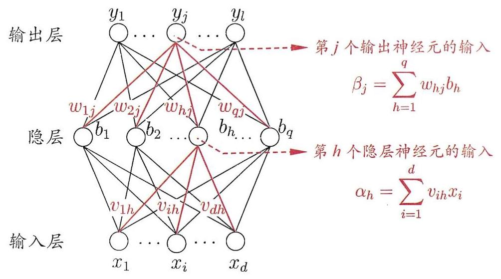

图 5.7 BP 网络及算法中的变量符号

---

实际是对率函数, 参见 3.3 节.

---

元的输出. 假设隐层和输出层神经元都使用图 5.2(b) 中的 Sigmoid 函数.

对训练例 $\left( {{\mathbf{x}}_{k},{\mathbf{y}}_{k}}\right)$ ,假定神经网络的输出为 ${\widehat{\mathbf{y}}}_{k} = \left( {{\widehat{y}}_{1}^{k},{\widehat{y}}_{2}^{k},\ldots ,{\widehat{y}}_{l}^{k}}\right)$ ,即

$$
{\widehat{y}}_{j}^{k} = f\left( {{\beta }_{j} - {\theta }_{j}}\right) , \tag{5.3}
$$

则网络在 $\left( {{\mathbf{x}}_{k},{\mathbf{y}}_{k}}\right)$ 上的均方误差为

$$
{E}_{k} = \frac{1}{2}\mathop{\sum }\limits_{{j = 1}}^{l}{\left( {\widehat{y}}_{j}^{k} - {y}_{j}^{k}\right) }^{2}. \tag{5.4}
$$

---

这里的 $1/2$ 是为了后续求导的便利.

---

图 5.7 的网络中有 $\left( {d + l + 1}\right) q + l$ 个参数需确定: 输入层到隐层的 $d \times  q$ 个权值、隐层到输出层的 $q \times  l$ 个权值、 $q$ 个隐层神经元的阈值、 $l$ 个输出层神经元的阈值. BP 是一个迭代学习算法, 在迭代的每一轮中采用广义的感知机学习规则对参数进行更新估计,即与式(5.1)类似,任意参数 $v$ 的更新估计式为

$$
v \leftarrow  v + {\Delta v} \tag{5.5}
$$

下面我们以图 5.7 中隐层到输出层的连接权 ${w}_{hj}$ 为例来进行推导.

---

梯度下降参见附录 B.4.

---

BP 算法基于梯度下降(gradient descent)策略, 以目标的负梯度方向对参数进行调整. 对式(5.4)的误差 ${E}_{k}$ ,给定学习率 $\eta$ ,有

$$
\Delta {w}_{hj} =  - \eta \frac{\partial {E}_{k}}{\partial {w}_{hj}}. \tag{5.6}
$$

注意到 ${w}_{hj}$ 先影响到第 $j$ 个输出层神经元的输入值 ${\beta }_{j}$ ,再影响到其输出值 ${\widehat{y}}_{j}^{k}$ , 然后影响到 ${E}_{k}$ ,有

$$
\frac{\partial {E}_{k}}{\partial {w}_{hj}} = \frac{\partial {E}_{k}}{\partial {\widehat{y}}_{j}^{k}} \cdot  \frac{\partial {\widehat{y}}_{j}^{k}}{\partial {\beta }_{j}} \cdot  \frac{\partial {\beta }_{j}}{\partial {w}_{hj}}. \tag{5.7}
$$

根据 ${\beta }_{j}$ 的定义，显然有

$$
\frac{\partial {\beta }_{j}}{\partial {w}_{hj}} = {b}_{h}. \tag{5.8}
$$

图 5.2 中的 Sigmoid 函数有一个很好的性质:

$$
{f}^{\prime }\left( x\right)  = f\left( x\right) \left( {1 - f\left( x\right) }\right) , \tag{5.9}
$$

于是根据式(5.4)和(5.3), 有

$$
{g}_{j} =  - \frac{\partial {E}_{k}}{\partial {\widehat{y}}_{j}^{k}} \cdot  \frac{\partial {\widehat{y}}_{j}^{k}}{\partial {\beta }_{j}}
$$

$$
=  - \left( {{\widehat{y}}_{j}^{k} - {y}_{j}^{k}}\right) {f}^{\prime }\left( {{\beta }_{j} - {\theta }_{j}}\right)
$$

$$
= {\widehat{y}}_{j}^{k}\left( {1 - {\widehat{y}}_{j}^{k}}\right) \left( {{y}_{j}^{k} - {\widehat{y}}_{j}^{k}}\right) . \tag{5.10}
$$

将式(5.10)和(5.8)代入式(5.7)，再代入式(5.6)，就得到了BP 算法中关于 ${w}_{hj}$ 的更新公式

$$
\Delta {w}_{hj} = \eta {g}_{j}{b}_{h} \tag{5.11}
$$

类似可得

$$
\Delta {\theta }_{j} =  - \eta {g}_{j}, \tag{5.12}
$$

$$
\Delta {v}_{ih} = \eta {e}_{h}{x}_{i}, \tag{5.13}
$$

$$
\Delta {\gamma }_{h} =  - \eta {e}_{h}, \tag{5.14}
$$

式(5.13)和(5.14)中

$$
{e}_{h} =  - \frac{\partial {E}_{k}}{\partial {b}_{h}} \cdot  \frac{\partial {b}_{h}}{\partial {\alpha }_{h}}
$$

$$
=  - \mathop{\sum }\limits_{{j = 1}}^{l}\frac{\partial {E}_{k}}{\partial {\beta }_{j}} \cdot  \frac{\partial {\beta }_{j}}{\partial {b}_{h}}{f}^{\prime }\left( {{\alpha }_{h} - {\gamma }_{h}}\right)
$$

$$
= \mathop{\sum }\limits_{{j = 1}}^{l}{w}_{hj}{g}_{j}{f}^{\prime }\left( {{\alpha }_{h} - {\gamma }_{h}}\right)
$$

$$
= {b}_{h}\left( {1 - {b}_{h}}\right) \mathop{\sum }\limits_{{j = 1}}^{l}{w}_{hj}{g}_{j}. \tag{5.15}
$$

---

这就是 “链式法则”.

---

学习率 $\eta  \in  \left( {0,1}\right)$ 控制着算法每一轮迭代中的更新步长,若太大则容易振荡, 太小则收敛速度又会过慢. 有时为了做精细调节, 可令式(5.11) 与(5.12) 使用 ${\eta }_{1}$ ，式(5.13) 与(5.14) 使用 ${\eta }_{2}$ ，两者未必相等.

图 5.8 给出了 BP 算法的工作流程. 对每个训练样例, BP 算法执行以下操作: 先将输入示例提供给输入层神经元, 然后逐层将信号前传, 直到产生输出层的结果; 然后计算输出层的误差(第 4-5 行), 再将误差逆向传播至隐层神经元(第 6 行), 最后根据隐层神经元的误差来对连接权和阈值进行调整(第 7 行). 该迭代过程循环进行, 直到达到某些停止条件为止, 例如训练误差已达到一个很小的值. 图 5.9 给出了在 2 个属性、5 个样本的西瓜数据上, 随着训练轮数的增加, 网络参数和分类边界的变化情况. 需注意的是, BP 算法的目标是要最小化训练集 $D$ 上的累积误差

$$
E = \frac{1}{m}\mathop{\sum }\limits_{{k = 1}}^{m}{E}_{k} \tag{5.16}
$$

---

输入: 训练集 $D = {\left\{  \left( {\mathbf{x}}_{k},{\mathbf{y}}_{k}\right) \right\}  }_{k = 1}^{m}$ ;

					学习率 $\eta$ .

过程:

		在 $\left( {0,1}\right)$ 范围内随机初始化网络中所有连接权和阈值

		repeat

				for all $\left( {{\mathbf{x}}_{k},{\mathbf{y}}_{k}}\right)  \in  D$ do

						根据当前参数和式(5.3) 计算当前样本的输出 ${\widehat{\mathbf{y}}}_{k}$ ;

						根据式(5.10) 计算输出层神经元的梯度项 ${g}_{j}$ ；

				根据式(5.15) 计算隐层神经元的梯度项 ${e}_{h}$ ;

						根据式(5.11)-(5.14) 更新连接权 ${w}_{hj},{v}_{ih}$ 与阈值 ${\theta }_{j},{\gamma }_{h}$

				end for

		until 达到停止条件

输出: 连接权与阈值确定的多层前馈神经网络

---

图 5.8 误差逆传播算法

但我们上面介绍的 “标准 BP 算法” 每次仅针对一个训练样例更新连接权和阈值,也就是说,图 5.8 中算法的更新规则是基于单个的 ${E}_{k}$ 推导而得. 如果类似地推导出基于累积误差最小化的更新规则, 就得到了累积误差逆传播(accumulated error backpropagation) 算法. 累积 BP 算法与标准 BP 算法都很常用. 一般来说, 标准 BP 算法每次更新只针对单个样例, 参数更新得非常频繁, 而且对不同样例进行更新的效果可能出现 “抵消” 现象. 因此, 为了达到同样的累积误差极小点, 标准 BP 算法往往需进行更多次数的迭代. 累积 BP 算法直接针对累积误差最小化，它在读取整个训练集 $D$ 一遍后才对参数进行更新， 其参数更新的频率低得多. 但在很多任务中，累积误差下降到一定程度之后，进一步下降会非常缓慢，这时标准 BP 往往会更快获得较好的解，尤其是在训练集 $D$ 非常大时更明显.

---

常设置为 $\eta  = {0.1}$ .

停止条件与缓解 BP 过拟合的策略有关.

---

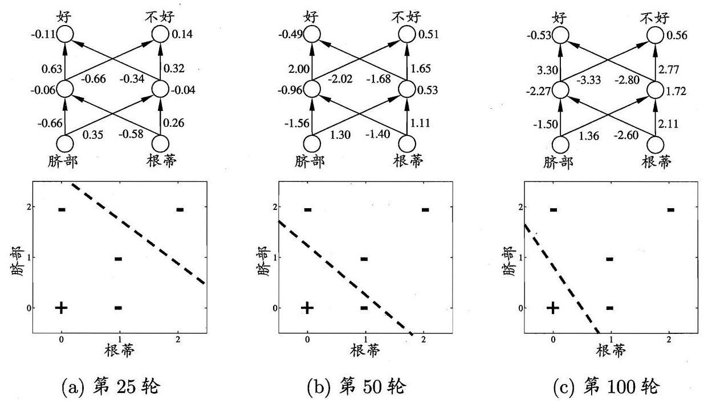

图 5.9 在2个属性、5个样本的西瓜数据上, BP网络参数更新和分类边界的变化情况

[Hornik et al., 1989] 证明, 只需一个包含足够多神经元的隐层, 多层前馈网络就能以任意精度逼近任意复杂度的连续函数. 然而, 如何设置隐层神经元的个数仍是个未决问题, 实际应用中通常靠 “试错法” (trial-by-error)调整.

正是由于其强大的表示能力, BP 神经网络经常遭遇过拟合, 其训练误差持续降低, 但测试误差却可能上升. 有两种策略常用来缓解BP网络的过拟合. 第一种策略是 “早停” (early stopping): 将数据分成训练集和验证集, 训练集用来计算梯度、更新连接权和阈值, 验证集用来估计误差, 若训练集误差降低但验证集误差升高, 则停止训练, 同时返回具有最小验证集误差的连接权和阈值. 第二种策略是 “正则化” (regularization) [Barron, 1991; Girosi et al., 1995], 其基本思想是在误差目标函数中增加一个用于描述网络复杂度的部分，例如连接权与阈值的平方和. 仍令 ${E}_{k}$ 表示第 $k$ 个训练样例上的误差, ${w}_{i}$ 表示连接权和阈值, 则误差目标函数(5.16) 改变为

$$
E = \lambda \frac{1}{m}\mathop{\sum }\limits_{{k = 1}}^{m}{E}_{k} + \left( {1 - \lambda }\right) \mathop{\sum }\limits_{i}{w}_{i}^{2}, \tag{5.17}
$$

---

读取训练集一遍称为进行了“一轮” (one round, 亦称 one epoch)学习.

标准 BP 算法和累积 BP 算法的区别类似于随机梯度下降(stochastic gradient descent, 简称 SGD)与标准梯度下降之间的区别.

引入正则化策略的神经网络与第 6 章的 SVM 已非常相似.

---

其中 $\lambda  \in  \left( {0,1}\right)$ 用于对经验误差与网络复杂度这两项进行折中,常通过交叉验证法来估计.

## 5.4 全局最小与局部极小

若用 $E$ 表示神经网络在训练集上的误差,则它显然是关于连接权 $\mathbf{w}$ 和阈值 $\theta$ 的函数. 此时,神经网络的训练过程可看作一个参数寻优过程,即在参数空间中，寻找一组最优参数使得 $E$ 最小.

我们常会谈到两种 “最优”: “局部极小” (local minimum) 和 “全局最小” (global minimum). 对 ${\mathbf{w}}^{ * }$ 和 ${\theta }^{ * }$ ,若存在 $\epsilon  > 0$ 使得

$$
\forall \left( {\mathbf{w};\theta }\right)  \in  \left\{  {\left( {\mathbf{w};\theta }\right)  \mid  \begin{Vmatrix}{\left( {\mathbf{w};\theta }\right)  - \left( {{\mathbf{w}}^{ * };{\theta }^{ * }}\right) }\end{Vmatrix} \leq  \epsilon }\right\}  ,
$$

都有 $E\left( {\mathbf{w};\theta }\right)  \geq  E\left( {{\mathbf{w}}^{ * };{\theta }^{ * }}\right)$ 成立,则 $\left( {{\mathbf{w}}^{ * };{\theta }^{ * }}\right)$ 为局部极小解; 若对参数空间中的任意 $\left( {\mathbf{w};\theta }\right)$ 都有 $E\left( {\mathbf{w};\theta }\right)  \geq  E\left( {{\mathbf{w}}^{ * },{\theta }^{ * }}\right)$ ,则 $\left( {{\mathbf{w}}^{ * };{\theta }^{ * }}\right)$ 为全局最小解. 直观地看,局部极小解是参数空间中的某个点, 其邻域点的误差函数值均不小于该点的函数值; 全局最小解则是指参数空间中所有点的误差函数值均不小于该点的误差函数值. 两者对应的 $E\left( {{\mathbf{w}}^{ * };{\theta }^{ * }}\right)$ 分别称为误差函数的局部极小值和全局最小值.

显然, 参数空间内梯度为零的点, 只要其误差函数值小于邻点的误差函数值, 就是局部极小点; 可能存在多个局部极小值, 但却只会有一个全局最小值. 也就是说，“全局最小”一定是 “局部极小” ，反之则不成立. 例如，图 5.10 中有两个局部极小, 但只有其中之一是全局最小. 显然,我们在参数寻优过程中是希望找到全局最小.

基于梯度的搜索是使用最为广泛的参数寻优方法. 在此类方法中, 我们从某些初始解出发, 迭代寻找最优参数值. 每次迭代中, 我们先计算误差函数在当前点的梯度, 然后根据梯度确定搜索方向. 例如, 由于负梯度方向是函数值下降最快的方向, 因此梯度下降法就是沿着负梯度方向搜索最优解. 若误差函数在当前点的梯度为零, 则已达到局部极小, 更新量将为零, 这意味着参数的迭代更新将在此停止. 显然, 如果误差函数仅有一个局部极小, 那么此时找到的局部极小就是全局最小; 然而, 如果误差函数具有多个局部极小, 则不能保证找到的解是全局最小. 对后一种情形, 我们称参数寻优陷入了局部极小, 这显然不是我们所希望的.

---

增加连接权与阈值平方和这一项后, 训练过程将会偏好比较小的连接权和阈值, 使网络输出更加 “光滑”, 从而对过拟合有所缓解.

这里的讨论对其他机器学习模型同样适用.

感知机更新规则式 (5.1) 和 BP 更新规则式 (5.11)- (5.14) 都是基于梯度下降.

---

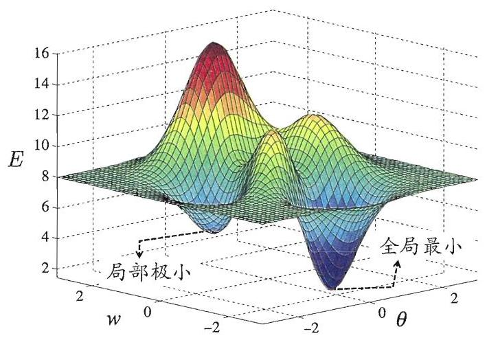

图 5.10 全局最小与局部极小

在现实任务中, 人们常采用以下策略来试图 “跳出” 局部极小, 从而进一步接近全局最小:

- 以多组不同参数值初始化多个神经网络, 按标准方法训练后, 取其中误差最小的解作为最终参数. 这相当于从多个不同的初始点开始搜索, 这样就可能陷入不同的局部极小，从中进行选择有可能获得更接近全局最小的结果.

- 使用 “模拟退火” (simulated annealing) 技术 [Aarts and Korst, 1989]. 模拟退火在每一步都以一定的概率接受比当前解更差的结果, 从而有助于 “跳出” 局部极小. 在每步迭代过程中, 接受 “次优解” 的概率要随着时间的推移而逐渐降低，从而保证算法稳定.

- 使用随机梯度下降. 与标准梯度下降法精确计算梯度不同，随机梯度下降法在计算梯度时加入了随机因素. 于是, 即便陷入局部极小点, 它计算出的梯度仍可能不为零, 这样就有机会跳出局部极小继续搜索.

此外, 遗传算法(genetic algorithms) [Goldberg, 1989] 也常用来训练神经网络以更好地逼近全局最小. 需注意的是, 上述用于跳出局部极小的技术大多是启发式, 理论上尚缺乏保障.

---

但是也会造成“跳出” 全局最小.

---

## 5.5 其他常见神经网络

神经网络模型、算法繁多，本节不能详尽描述，只对特别常见的几种网络稍作简介.

### 5.5.1 RBF网络

RBF(Radial Basis Function, 径向基函数)网络 [Broomhead and Lowe, 1988] 是一种单隐层前馈神经网络, 它使用径向基函数作为隐层神经元激活函数,而输出层则是对隐层神经元输出的线性组合. 假定输入为 $d$ 维向量 $\mathbf{x}$ ,输出为实值，则 RBF 网络可表示为

$$
\varphi \left( \mathbf{x}\right)  = \mathop{\sum }\limits_{{i = 1}}^{q}{w}_{i}\rho \left( {\mathbf{x},{\mathbf{c}}_{i}}\right) , \tag{5.18}
$$

其中 $q$ 为隐层神经元个数, ${\mathbf{c}}_{i}$ 和 ${w}_{i}$ 分别是第 $i$ 个隐层神经元所对应的中心和权重, $\rho \left( {\mathbf{x},{\mathbf{c}}_{i}}\right)$ 是径向基函数,这是某种沿径向对称的标量函数,通常定义为样本 $\mathbf{x}$ 到数据中心 ${\mathbf{c}}_{i}$ 之间欧氏距离的单调函数. 常用的高斯径向基函数形如

$$
\rho \left( {\mathbf{x},{\mathbf{c}}_{i}}\right)  = {e}^{-{\beta }_{i}{\begin{Vmatrix}\mathbf{x} - {\mathbf{c}}_{i}\end{Vmatrix}}^{2}}. \tag{5.19}
$$

[Park and Sandberg, 1991] 证明, 具有足够多隐层神经元的 RBF 网络能以任意精度逼近任意连续函数.

通常采用两步过程来训练 RBF 网络: 第一步,确定神经元中心 ${\mathbf{c}}_{i}$ ,常用的方式包括随机采样、聚类等; 第二步,利用 BP 算法等来确定参数 ${w}_{i}$ 和 ${\beta }_{i}$ .

### 5.5.2 ART网络

竞争型学习 (competitive learning) 是神经网络中一种常用的无监督学习策略, 在使用该策略时, 网络的输出神经元相互竞争, 每一时刻仅有一个竞争获胜的神经元被激活，其他神经元的状态被抑制. 这种机制亦称 “胜者通吃" (winner-take-all)原则.

ART(Adaptive Resonance Theory, 自适应谐振理论)网络 [Carpenter and Grossberg, 1987] 是竞争型学习的重要代表. 该网络由比较层、识别层、识别阈值和重置模块构成. 其中, 比较层负责接收输入样本, 并将其传递给识别层神经元. 识别层每个神经元对应一个模式类, 神经元数目可在训练过程中动态增长以增加新的模式类.

在接收到比较层的输入信号后, 识别层神经元之间相互竞争以产生获胜神经元. 竞争的最简单方式是, 计算输入向量与每个识别层神经元所对应的模式类的代表向量之间的距离, 距离最小者胜. 获胜神经元将向其他识别层神经元发送信号, 抑制其激活. 若输入向量与获胜神经元所对应的代表向量之间的相似度大于识别阈值, 则当前输入样本将被归为该代表向量所属类别, 同时, 网络连接权将会更新，使得以后在接收到相似输入样本时该模式类会计算出更大的相似度, 从而使该获胜神经元有更大可能获胜; 若相似度不大于识别阈值, 则重置模块将在识别层增设一个新的神经元, 其代表向量就设置为当前输入向量.

---

理论上来说可使用多个隐层, 但常见的 RBF 设置是单隐层.

模式类可认为是某类别的“子类”.

---

显然, 识别阈值对ART网络的性能有重要影响. 当识别阈值较高时, 输入样本将会被分成比较多、比较精细的模式类, 而如果识别阈值较低, 则会产生比较少、比较粗略的模式类.

ART比较好地缓解了竞争型学习中的 “可塑性-稳定性窘境” (stability-plasticity dilemma), 可塑性是指神经网络要有学习新知识的能力, 而稳定性则是指神经网络在学习新知识时要保持对旧知识的记忆. 这就使得ART网络具有一个很重要的优点: 可进行增量学习(incremental learning)或在线学习(online learning).

早期的 ART 网络只能处理布尔型输入数据, 此后 ART 发展成了一个算法族, 包括能处理实值输入的 ART2 网络、结合模糊处理的 FuzzyART 网络, 以及可进行监督学习的 ARTMAP 网络等.

### 5.5.3 SOM网络

SOM(Self-Organizing Map, 自组织映射)网络 [Kohonen, 1982] 是一种竞争学习型的无监督神经网络, 它能将高维输入数据映射到低维空间(通常为二维), 同时保持输入数据在高维空间的拓扑结构, 即将高维空间中相似的样本点映射到网络输出层中的邻近神经元.

如图 5.11 所示, SOM 网络中的输出层神经元以矩阵方式排列在二维空间中, 每个神经元都拥有一个权向量, 网络在接收输入向量后, 将会确定输出层获胜神经元, 它决定了该输入向量在低维空间中的位置. SOM 的训练目标就是为每个输出层神经元找到合适的权向量, 以达到保持拓扑结构的目的.

SOM 的训练过程很简单: 在接收到一个训练样本后, 每个输出层神经元会计算该样本与自身携带的权向量之间的距离, 距离最近的神经元成为竞争获胜者, 称为最佳匹配单元(best matching unit). 然后, 最佳匹配单元及其邻近神经元的权向量将被调整，以使得这些权向量与当前输入样本的距离缩小. 这个过程不断迭代, 直至收敛.

---

这就是 “胜者通吃” 原则的体现.

增量学习是指在学得模型后, 再接收到训练样例时, 仅需根据新样例对模型进行更新, 不必重新训练整个模型, 并且先前学得的有效信息不会被 “冲掉”；在线学习是指每获得一个新样本就进行一次模型更新. 显然, 在线学习是增量学习的特例, 而增量学习可视为 “批模式” (batch-mode)的在线学习.

亦称 “自组织特征映射” (Self-Organizing Feature Map)、Kohonen 网络.

---

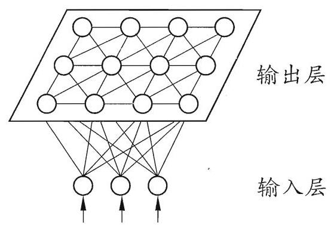

图 5.11 SOM 网络结构

### 5.5.4 级联相关网络

一般的神经网络模型通常假定网络结构是事先固定的, 训练的目的是利用训练样本来确定合适的连接权、阈值等参数. 与此不同, 结构自适应网络则将网络结构也当作学习的目标之一, 并希望能在训练过程中找到最符合数据特点的网络结构. 级联相关(Cascade-Correlation)网络 [Fahlman and Lebiere, 1990] 是结构自适应网络的重要代表.

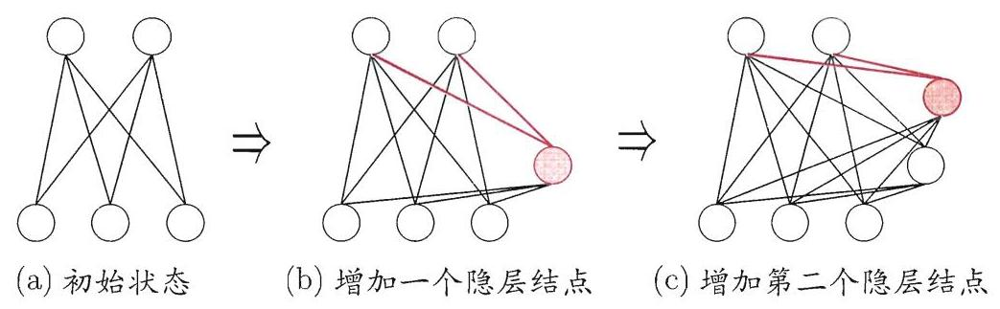

图 5.12 级联相关网络的训练过程. 新的隐结点加入时, 红色连接权通过最大化新结点的输出与网络误差之间的相关性来进行训练.

级联相关网络有两个主要成分: “级联”和“相关”. 级联是指建立层次连接的层级结构. 在开始训练时, 网络只有输入层和输出层, 处于最小拓扑结构; 随着训练的进行, 如图 5.12 所示, 新的隐层神经元逐渐加入, 从而创建起层级结构. 当新的隐层神经元加入时，其输入端连接权值是冻结固定的. 相关是指通过最大化新神经元的输出与网络误差之间的相关性(correlation)来训练相关的参数.

与一般的前馈神经网络相比，级联相关网络无需设置网络层数、隐层神经元数目，且训练速度较快，但其在数据较小时易陷入过拟合.

---

结构自适应神经网络亦称 “构造性” (constructive)神经网络.

5.5.2 节介绍的 ART 网络由于隐层神经元数目可在训练过程中增长, 因此也是一种结构自适应神经网络.

---

### 5.5.5 Elman网络

与前馈神经网络不同, “递归神经网络” (recurrent neural networks)允许网络中出现环形结构, 从而可让一些神经元的输出反馈回来作为输入信号. 这样的结构与信息反馈过程,使得网络在 $t$ 时刻的输出状态不仅与 $t$ 时刻的输入有关,还与 $t - 1$ 时刻的网络状态有关,从而能处理与时间有关的动态变化.

Elman 网络 [Elman, 1990] 是最常用的递归神经网络之一, 其结构如图 5.13 所示, 它的结构与多层前馈网络很相似, 但隐层神经元的输出被反馈回来, 与下一时刻输入层神经元提供的信号一起，作为隐层神经元在下一时刻的输入. 隐层神经元通常采用 Sigmoid 激活函数，而网络的训练则常通过推广的 BP 算法进行 [Pineda, 1987].

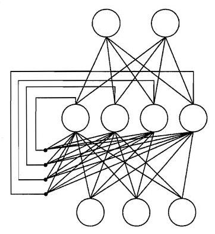

图 5.13 Elman 网络结构

### 5.5.6 Boltzmann机

神经网络中有一类模型是为网络状态定义一个“能量” (energy)，能量最小化时网络达到理想状态，而网络的训练就是在最小化这个能量函数. Boltzmann 机 [Ackley et al., 1985] 就是一种 “基于能量的模型” (energy-based model), 常见结构如图 5.14(a) 所示, 其神经元分为两层: 显层与隐层. 显层用于表示数据的输入与输出, 隐层则被理解为数据的内在表达. Boltzmann 机中的神经元都是布尔型的, 即只能取 0 、1 两种状态, 状态 1 表示激活, 状态 0 表示抑制. 令向量 $\mathbf{s} \in  \{ 0,1{\} }^{n}$ 表示 $n$ 个神经元的状态, ${w}_{ij}$ 表示神经元 $i$ 与 $j$ 之间的连接权， ${\theta }_{i}$ 表示神经元 $i$ 的阈值，则状态向量 $\mathbf{s}$ 所对应的 Boltzmann 机能量定义为

$$
E\left( \mathbf{s}\right)  =  - \mathop{\sum }\limits_{{i = 1}}^{{n - 1}}\mathop{\sum }\limits_{{j = i + 1}}^{n}{w}_{ij}{s}_{i}{s}_{j} - \mathop{\sum }\limits_{{i = 1}}^{n}{\theta }_{i}{s}_{i}. \tag{5.20}
$$

若网络中的神经元以任意不依赖于输入值的顺序进行更新，则网络最终将达到 Boltzmann 分布,此时状态向量 $s$ 出现的概率将仅由其能量与所有可能状态向量的能量确定:

$$
P\left( s\right)  = \frac{{e}^{-E\left( s\right) }}{\mathop{\sum }\limits_{t}{e}^{-E\left( t\right) }}. \tag{5.21}
$$

---

亦称 "recursive neural networks".

从图 5.14(a) 可看出, Boltzmann 机是一种递归神经网络.

Boltzmann 分布亦称 "平衡态" (equilibrium) 或 “平稳分布” (stationary distribution).

---

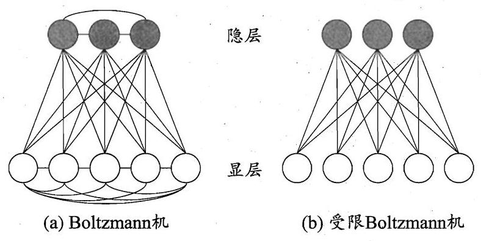

图 5.14 Boltzmann 机与受限 Boltzmann 机

Boltzmann 机的训练过程就是将每个训练样本视为一个状态向量, 使其出现的概率尽可能大. 标准的 Boltzmann 机是一个全连接图, 训练网络的复杂度很高, 这使其难以用于解决现实任务. 现实中常采用受限 Boltzmann 机(Restricted Boltzmann Machine, 简称 RBM). 如图 5.14(b) 所示, 受限 Boltzmann 机仅保留显层与隐层之间的连接, 从而将 Boltzmann 机结构由完全图简化为二部图.

受限 Boltzmann 机常用 “对比散度” (Contrastive Divergence, 简称 CD)算法 [Hinton,2010] 来进行训练. 假定网络中有 $d$ 个显层神经元和 $q$ 个隐层神经元,令 $\mathbf{v}$ 和 $\mathbf{h}$ 分别表示显层与隐层的状态向量,则由于同一层内不存在连接, 有

$$
P\left( {\mathbf{v} \mid  \mathbf{h}}\right)  = \mathop{\prod }\limits_{{i = 1}}^{d}P\left( {{v}_{i} \mid  \mathbf{h}}\right) , \tag{5.22}
$$

$$
P\left( {\mathbf{h} \mid  \mathbf{v}}\right)  = \mathop{\prod }\limits_{{j = 1}}^{q}P\left( {{h}_{j} \mid  \mathbf{v}}\right) . \tag{5.23}
$$

CD 算法对每个训练样本 $\mathbf{v}$ ,先根据式(5.23)计算出隐层神经元状态的概率分布, 然后根据这个概率分布采样得到 $\mathbf{h}$ ; 此后,类似地根据式(5.22)从 $\mathbf{h}$ 产生 ${\mathbf{v}}^{\prime }$ ,再从 ${\mathbf{v}}^{\prime }$ 产生 ${\mathbf{h}}^{\prime }$ ; 连接权的更新公式为

$$
{\Delta w} = \eta \left( {v{h}^{\top } - {v}^{\prime }{h}^{\prime \top }}\right) . \tag{5.24}
$$

---

阈值的更新公式可类似获得.

---

## 5.6 深度学习

理论上来说, 参数越多的模型复杂度越高、 “容量” (capacity)越大, 这意味着它能完成更复杂的学习任务. 但一般情形下, 复杂模型的训练效率低, 易陷入过拟合, 因此难以受到人们青睐. 而随着云计算、大数据时代的到来, 计算能力的大幅提高可缓解训练低效性，训练数据的大幅增加则可降低过拟合风险， 因此, 以 “深度学习” (deep learning) 为代表的复杂模型开始受到人们的关注.

典型的深度学习模型就是很深层的神经网络. 显然, 对神经网络模型, 提高容量的一个简单办法是增加隐层的数目. 隐层多了, 相应的神经元连接权、阈值等参数就会更多. 模型复杂度也可通过单纯增加隐层神经元的数目来实现, 前面我们谈到过, 单隐层的多层前馈网络已具有很强大的学习能力; 但从增加模型复杂度的角度来看, 增加隐层的数目显然比增加隐层神经元的数目更有效, 因为增加隐层数不仅增加了拥有激活函数的神经元数目, 还增加了激活函数嵌套的层数. 然而, 多隐层神经网络难以直接用经典算法(例如标准 BP 算法)进行训练，因为误差在多隐层内逆传播时，往往会 “发散” (diverge)而不能收敛到稳定状态.

无监督逐层训练(unsupervised layer-wise training)是多隐层网络训练的有效手段，其基本思想是每次训练一层隐结点，训练时将上一层隐结点的输出作为输入, 而本层隐结点的输出作为下一层隐结点的输入, 这称为 “预训练" (pre-training); 在预训练全部完成后, 再对整个网络进行 “微调” (fine-tuning)训练. 例如, 在深度信念网络(deep belief network, 简称DBN) [Hinton et al., 2006] 中, 每层都是一个受限 Boltzmann 机, 即整个网络可视为若干个 RBM 堆叠而得. 在使用无监督逐层训练时, 首先训练第一层, 这是关于训练样本的RBM模型, 可按标准的 RBM 训练; 然后, 将第一层预训练好的隐结点视为第二层的输入结点, 对第二层进行预训练; ……各层预训练完成后, 再利用 BP 算法等对整个网络进行训练.

事实上, “预训练+微调” 的做法可视为将大量参数分组, 对每组先找到局部看来比较好的设置, 然后再基于这些局部较优的结果联合起来进行全局寻优. 这样就在利用了模型大量参数所提供的自由度的同时, 有效地节省了训练开销.

另一种节省训练开销的策略是 “权共享” (weight sharing), 即让一组神经元使用相同的连接权. 这个策略在卷积神经网络(Convolutional Neural Network, 简称 CNN) [LeCun and Bengio, 1995; LeCun et al., 1998] 中发挥了重要作用. 以 CNN 进行手写数字识别任务为例 [LeCun et al., 1998], 如图 5.15 所示，网络输入是一个 ${32} \times  {32}$ 的手写数字图像，输出是其识别结果，CNN 复合多个 “卷积层” 和 “采样层” 对输入信号进行加工, 然后在连接层实现与输出目标之间的映射. 每个卷积层都包含多个特征映射(feature map)，每个特征映射是一个由多个神经元构成的 “平面”, 通过一种卷积滤波器提取输入的一种特征. 例如, 图 5.15 中第一个卷积层由 6 个特征映射构成, 每个特征映射是一个 ${28} \times  {28}$ 的神经元阵列,其中每个神经元负责从 $5 \times  5$ 的区域通过卷积滤波器提取局部特征. 采样层亦称为 “汇合” (pooling)层, 其作用是基于局部相关性原理进行亚采样, 从而在减少数据量的同时保留有用信息. 例如图 5.15 中第一个采样层有 6 个 ${14} \times  {14}$ 的特征映射,其中每个神经元与上一层中对应特征映射的 $2 \times  2$ 邻域相连,并据此计算输出. 通过复合卷积层和采样层,图 5.15 中的 CNN 将原始图像映射成 120 维特征向量, 最后通过一个由 84 个神经元构成的连接层和输出层连接完成识别任务. CNN 可用 BP 算法进行训练, 但在训练中, 无论是卷积层还是采样层, 其每一组神经元(即图 5.15 中的每个 “平面” )都是用相同的连接权, 从而大幅减少了需要训练的参数数目.

---

关于学习器容量, 参见第 12 章.

大型深度学习模型中甚至有上百亿个参数.

这里所说的 “多隐层” 是指三个以上隐层；深度学习模型通常有八九层甚至更多隐层.

---

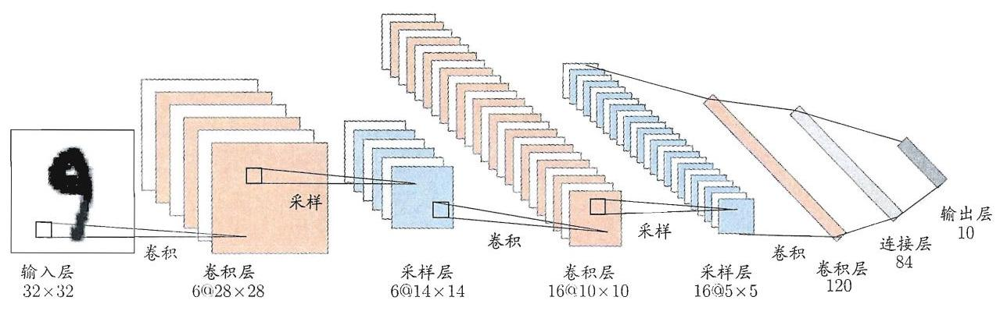

图 5.15 卷积神经网络用于手写数字识别 [LeCun et al., 1998]

我们可以从另一个角度来理解深度学习. 无论是 DBN 还是 CNN, 其多隐层堆叠、每层对上一层的输出进行处理的机制, 可看作是在对输入信号进行逐层加工, 从而把初始的、与输出目标之间联系不太密切的输入表示, 转化成与输出目标联系更密切的表示, 使得原来仅基于最后一层输出映射难以完成的任务成为可能. 换言之, 通过多层处理, 逐渐将初始的 “低层” 特征表示转化为 “高层” 特征表示后, 用 “简单模型” 即可完成复杂的分类等学习任务. 由此可将深度学习理解为进行 “特征学习” (feature learning)或 “表示学习" (representation learning).

以往在机器学习用于现实任务时，描述样本的特征通常需由人类专家来设计, 这称为 “特征工程” (feature engineering). 众所周知, 特征的好坏对泛化性能有至关重要的影响, 人类专家设计出好特征也并非易事; 特征学习则通过机器学习技术自身来产生好特征, 这使机器学习向 “全自动数据分析” 又前进了一步.

---

近来人们在使用 CNN 时常将 Sigmoid 激活函数替换为修正线性函数

$$
f\left( x\right)  = \left\{  \begin{array}{ll} 0, & \text{ if }x < 0, \\  x, & \text{ otherwise, } \end{array}\right.
$$

这样的神经元称为 Re-LU(Rectified Linear Unit); 此外, 汇合层的操作常采用“最大”或“平均”， 这更接近于集成学习中的一些操作, 参见 8.4 节.

若将网络中前若干层处理都看作是在进行特征表示, 只把最后一层处理看作是在进行 “分类”, 则分类使用的就是一个简单模型.

---

## 5.7 阅读材料

[Haykin, 1998] 是很好的神经网络教科书, [Bishop, 1995] 则偏重于机器学习和模式识别. 神经网络领域的主流学术期刊有 Neural Computation、Neural Networks、 IEEE Transactions on Neural Networks and Learning Systems; 主要国际学术会议有国际神经信息处理系统会议(NIPS) 和国际神经网络联合会议(IJCNN), 区域性国际会议主要有欧洲神经网络会议(ICANN)和亚太神经网络会议(ICONIP).

M-P神经元模型使用最为广泛, 但还有一些神经元模型也受到关注, 如考虑了电位脉冲发放时间而不仅是累积电位的脉冲神经元(spiking neuron)模型 [Gerstner and Kistler, 2002].

BP 算法由 [Werbos, 1974] 首先提出, 此后 [Rumelhart et al., 1986a, b] 重新发明. BP 算法实质是 LMS (Least Mean Square) 算法的推广. LMS 试图使网络的输出均方误差最小化，可用于神经元激活函数可微的感知机学习；将 LMS 推广到由非线性可微神经元组成的多层前馈网络, 就得到 BP 算法, 因此 BP 算法亦称广义 $\delta$ 规则 [Chauvin and Rumelhart,1995].

[MacKay, 1992] 在贝叶斯框架下提出了自动确定神经网络正则化参数的方法. [Gori and Tesi, 1992] 对 BP 网络的局部极小问题进行了详细讨论. [Yao, 1999] 综述了利用以遗传算法为代表的演化计算(evolutionary computation)技术来生成神经网络的研究工作. 对 BP 算法的改进有大量研究，例如为了提速， 可在训练过程中自适应缩小学习率，即先使用较大的学习率然后逐步缩小，更多 “窍门” (trick) 可参阅 [Reed and Marks, 1998; Orr and Müller, 1998].

关于 RBF 网络训练过程可参阅 [Schwenker et al., 2001]. [Carpenter and Grossberg, 1991] 介绍了 ART 族算法. SOM 网络在聚类、高维数据可视化、 图像分割等方面有广泛应用, 可参阅 [Kohonen, 2001]. [Bengio et al., 2013] 综述了深度学习方面的研究进展.

神经网络是一种难解释的 “黑箱模型”, 但已有一些工作尝试改善神经网络的可解释性, 主要途径是从神经网络中抽取易于理解的符号规则, 可参阅 [Tickle et al., 1998; Zhou, 2004].

---

2012 年前的名称是 IEEE Transactions on Neural Networks.

近来 NIPS 更偏重于机器学习.

LMS 亦称 Widrow-Hoff 规则或 $\delta$ 规则.

---

## 习题

5.1 试述将线性函数 $f\left( \mathbf{x}\right)  = {\mathbf{w}}^{\mathrm{T}}\mathbf{x}$ 用作神经元激活函数的缺陷.

5.2 试述使用图 5.2(b) 激活函数的神经元与对率回归的联系.

5.3 对于图 5.7 中的 ${v}_{ih}$ ,试推导出 BP 算法中的更新公式(5.13).

5.4 试述式(5.6)中学习率的取值对神经网络训练的影响.

西瓜数据集 3.0 见 p.84 的表 4.3.

5.5 试编程实现标准 BP 算法和累积 BP 算法, 在西瓜数据集 3.0 上分别用这两个算法训练一个单隐层网络, 并进行比较.

5.6 试设计一个 BP 改进算法, 能通过动态调整学习率显著提升收敛速度. 编程实现该算法, 并选择两个 UCI 数据集与标准 BP 算法进行实验比较. UCI 数据集见

http://archive.ics.uci.edu/ml/.

5.7 根据式(5.18)和(5.19)，试构造一个能解决异或问题的单层 RBF 神经网络.

西瓜数据集 ${3.0\alpha }$ 见 p. 89 的表 4.5.

5.8 从网上下载或自己编程实现 SOM 网络,并观察其在西瓜数据集 ${3.0\alpha }$ 上产生的结果.

5.9* 试推导用于 Elman 网络的 BP 算法.

MNIST 数据集见 http://yann.lecun.com/ exdb/mnist/.

5.10 从网上下载或自己编程实现一个卷积神经网络, 并在手写字符识别数据 MNIST 上进行实验测试.

## 参考文献

Aarts, E. and J. Korst. (1989). Simulated Annealing and Boltzmann Machines: A Stochastic Approach to Combinatorial Optimization and Neural Computing. John Wiley & Sons, New York, NY.

Ackley, D. H., G. E. Hinton, and T. J. Sejnowski. (1985). "A learning algorithm for Boltzmann machines." Cognitive Science, 9(1):147-169.

Barron, A. R. (1991). "Complexity regularization with application to artificial neural networks." In Nonparametric Functional Estimation and Related Topics; NATO ASI Series Volume 335 (G. Roussas, ed.), 561-576, Kluwer, Amsterdam, The Netherlands.

Bengio, Y., A. Courville, and P. Vincent. (2013). "Representation learning: A review and new perspectives." IEEE Transactions on Pattern Analysis and Machine Intelligence, 35(8):1798-1828.

Bishop, C. M. (1995). Neural Networks for Pattern Recognition. Oxford University Press, New York, NY.

Broomhead, D. S. and D. Lowe. (1988). "Multivariate functional interpolation and adaptive networks." Complex Systems, 2(3):321-355.

Carpenter, G. A. and S. Grossberg. (1987). "A massively parallel architecture for a self-organizing neural pattern recognition machine." Computer Vision, Graphics, and Image Processing, 37(1):54-115.

Carpenter, G. A. and S. Grossberg, eds. (1991). Pattern Recognition by Self-Organizing Neural Networks. MIT Press, Cambridge, MA.

Chauvin, Y. and D. E. Rumelhart, eds. (1995). Backpropagation: Theory, Architecture, and Applications. Lawrence Erlbaum Associates, Hillsdale, NJ.

Elman, J. L. (1990). "Finding structure in time." Cognitive Science, 14(2): 179-211.

Fahlman, S. E. and C. Lebiere. (1990). "The cascade-correlation learning architecture." Technical Report CMU-CS-90-100, School of Computer Sciences, Carnergie Mellon University, Pittsburgh, PA.

Gerstner, W. and W. Kistler. (2002). Spiking Neuron Models: Single Neurons, Populations, Plasticity. Cambridge University Press, Cambridge, UK.

Girosi, F., M. Jones, and T. Poggio. (1995). "Regularization theory and neural networks architectures." Neural Computation, 7(2):219-269.

Goldberg, D. E. (1989). Genetic Algorithms in Search, Optimizaiton and Machine Learning. Addison-Wesley, Boston, MA.

Gori, M. and A. Tesi. (1992). "On the problem of local minima in backpropa-gation." IEEE Transactions on Pattern Analysis and Machine Intelligence, 14(1):76-86.

Haykin, S. (1998). Neural Networks: A Comprehensive Foundation, 2nd edition. Prentice-Hall, Upper Saddle River, NJ.

Hinton, G. (2010). "A practical guide to training restricted Boltzmann machines." Technical Report UTML TR 2010-003, Department of Computer Science, University of Toronto.

Hinton, G., S. Osindero, and Y.-W. Teh. (2006). "A fast learning algorithm for deep belief nets." Neural Computation, 18(7):1527-1554.

Hornik, K., M. Stinchcombe, and H. White. (1989). "Multilayer feedforward networks are universal approximators." Neural Networks, 2(5):359-366.

Kohonen, T. (1982). "Self-organized formation of topologically correct feature maps." Biological Cybernetics, 43(1):59-69.

Kohonen, T. (1988). "An introduction to neural computing." Neural Networks, 1(1):3-16.

Kohonen, T. (2001). Self-Organizing Maps, 3rd edition. Springer, Berlin.

LeCun, Y. and Y. Bengio. (1995). "Convolutional networks for images, speech, and time-series." In The Handbook of Brain Theory and Neural Networks (M. A. Arbib, ed.), MIT Press, Cambridge, MA.

LeCun, Y., L. Bottou, Y. Bengio, and P. Haffner. (1998). "Gradient-based learning applied to document recognition." Proceedings of the IEEE, 86(11): 2278-2324.

MacKay, D. J. C. (1992). "A practical Bayesian framework for backpropagation networks." Neural Computation, 4(3):448-472.

McCulloch, W. S. and W. Pitts. (1943). "A logical calculus of the ideas immanent in nervous activity." Bulletin of Mathematical Biophysics, 5(4):115- 133.

Minsky, M. and S. Papert. (1969). Perceptrons. MIT Press, Cambridge, MA.

Orr, G. B. and K.-R. Müller, eds. (1998). Neural Networks: Tricks of the Trade. Springer, London, UK.

Park, J. and I. W. Sandberg. (1991). "Universal approximation using radial-basis-function networks." Neural Computation, 3(2):246-257.

Pineda, F. J. (1987). "Generalization of Back-Propagation to recurrent neural networks." Physical Review Letters, 59(19):2229-2232.

Reed, R. D. and R. J. Marks. (1998). Neural Smithing: Supervised Learning in Feedforward Artificial Neural Networks. MIT Press, Cambridge, MA.

Rumelhart, D. E., G. E. Hinton, and R. J. Williams. (1986a). "Learning internal representations by error propagation." In Parallel Distributed Processing: Explorations in the Microstructure of Cognition (D. E. Rumelhart and J. L. McClelland, eds.), volume 1, 318-362, MIT Press, Cambridge, MA.

Rumelhart, D. E., G. E. Hinton, and R. J. Williams. (1986b). "Learning representations by backpropagating errors." Nature, 323(9):318-362.

Schwenker, F., H.A. Kestler, and G. Palm. (2001). "Three learning phases for radial-basis-function networks." Neural Networks, 14(4-5):439-458.

Tickle, A. B., R. Andrews, M. Golea, and J. Diederich. (1998). "The truth will come to light: Directions and challenges in extracting the knowledge embedded within trained artificial neural networks." IEEE Transactions on Neural Networks, 9(6):1057-1067.

Werbos, P. (1974). Beyond regression: New tools for prediction and analysis in the behavior science. Ph.D. thesis, Harvard University, Cambridge, MA.

Yao, X. (1999). "Evolving artificial neural networks." Proceedings of the IEEE, 87(9):1423-1447.

Zhou, Z.-H. (2004). "Rule extraction: Using neural networks or for neural networks?" Journal of Computer Science and Technology, 19(2):249-253.

---

闵斯基于 1969 年获图灵奖.

此书中有不少关于神经网络的真知灼见，但其重要论断所导致的后果, 对神经网络乃至人工智能整体的研究产生了极为残酷的影响，因此在神经网络重又兴起后，该书受到很多批判. 1988 年再版时, 闵斯基专门增加了一章以作辩护.

---

## 休息一会儿

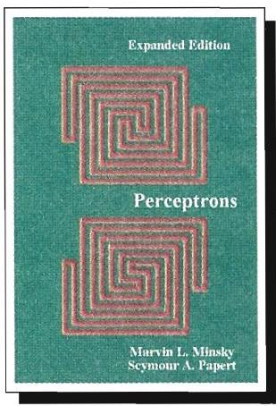

## 小故事: 神经网络的几起几落

二十世纪四十年代 M-P 神经元模型、Hebb 学习律出现后，五十年代出现了以感知机、Adaline 为代表的一系列成果, 这是神经网络发展的第一个高潮期. 不幸的是, MIT 计算机科学研究的奠基人马文·闵斯基 (Marvin Minsky, 1927- ) 与 Seymour Papert 在 1969 年出版了 《感知机》一书，书中指出，单层神经网络无法解决非线性问题，而多层网络的训练算法尚看不到希望. 这个论断直接使神经网络研究进入了“冰河期”，美国和苏联均停止了对神经网络研究的资助，全球该领域研究人员纷纷转行，仅剩极少数人坚持下来. 哈佛大学的 Paul Werbos 在 1974 年发明 BP 算法时, 正值神经网络冰河期, 因此未受到应有的重视.

1983 年, 加州理工学院的物理学家 John Hopfield 利用神经网络, 在旅行商问题这个 NP 完全问题的求解上获得当时最好结果, 引起了轰动. 稍后, UCSD 的 David Rumelhart 与 James McClelland 领导的 PDP 小组出版了《并行分布处理:认知微结构的探索》一书，Rumelhart 等人重新发明了 BP 算法，由于当时正处于 Hopfield 带来的兴奋之中，BP 算法迅速走红. 这掀起了神经网络的第二次高潮. 二十世纪九十年代中期，随着统计学习理论和支持向量机的兴起, 神经网络学习的理论性质不够清楚、试错性强、在使用中充斥大量 “窍门” (trick)的弱点更为明显，于是神经网络研究又进入低谷，NIPS 会议甚至多年不接受以神经网络为主题的论文.

2010 年前后，随着计算能力的迅猛提升和大数据的涌现，神经网络研究在 “深度学习”的名义下又重新崛起，先是在 ImageNet 等若干竞赛上以大优势夺冠，此后谷歌、百度、脸书等公司纷纷投入巨资进行研发，神经网络迎来了第三次高潮.
