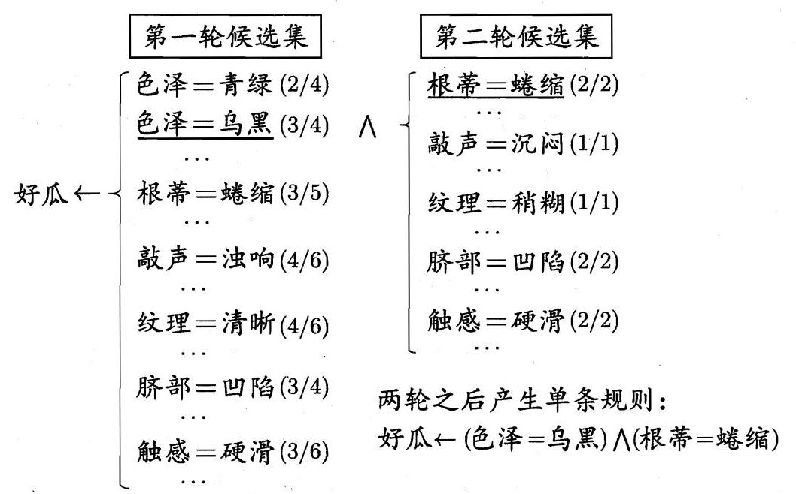
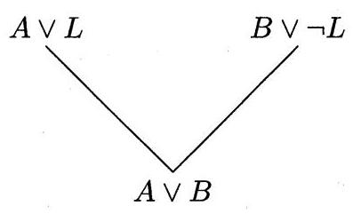
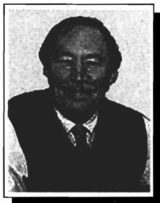

# 第15章 规则学习

## 15.1 基本概念

机器学习中的 “规则” (rule)通常是指语义明确、能描述数据分布所隐含的客观规律或领域概念、可写成 “若……，则……”形式的逻辑规则 [Fürnkranz et al., 2012]. “规则学习” (rule learning)是从训练数据中学习出一组能用于对未见示例进行判别的规则.

形式化地看, 一条规则形如.

$$
\oplus   \leftarrow  {\mathbf{f}}_{1} \land  {\mathbf{f}}_{2} \land  \cdots  \land  {\mathbf{f}}_{L} \tag{15.1}
$$

其中逻辑蕴含符号 “ ← ” 右边部分称为 “规则体” (body), 表示该条规则的前提, 左边部分称为 “规则头” (head), 表示该条规则的结果. 规则体是由逻辑文字(literal) ${\mathbf{f}}_{k}$ 组成的合取式(conjunction),其中合取符号 “ $\land$ ” 用来表示 “并且”. 每个文字 ${\mathbf{f}}_{k}$ 都是对示例属性进行检验的布尔表达式,例如 “(色泽=乌黑)”或 “ $\neg$ (根蒂=硬挺)”. $L$ 是规则体中逻辑文字的个数,称为规则的长度. 规则头的 “ $\oplus$ ” 同样是逻辑文字,一般用来表示规则所判定的目标类别或概念, 例如 “好瓜”. 这样的逻辑规则也被称为 “if-then 规则”.

与神经网络、支持向量机这样的 “黑箱模型” 相比, 规则学习具有更好的可解释性, 能使用户更直观地对判别过程有所了解. 另一方面, 数理逻辑具有极强的表达能力，绝大多数人类知识都能通过数理逻辑进行简洁的刻画和表达. 例如 “父亲的父亲是爷爷” 这样的知识不易用函数式描述, 而用一阶逻辑则可方便地写为 “爷爷 $\left( {X, Y}\right)  \leftarrow$ 父亲 $\left( {X, Z}\right)  \land$ 父亲 $\left( {Z, Y}\right)$ ”,因此,规则学习能更自然地在学习过程中引入领域知识. 此外, 逻辑规则的抽象描述能力在处理一些高度复杂的 AI 任务时具有显著的优势, 例如在问答系统中有时可能遇到非常多、甚至无穷种可能的答案, 此时若能基于逻辑规则进行抽象表述或者推理, 则将带来极大的便利.

假定我们从西瓜数据集学得规则集合 $\mathcal{R}$ :

规则1: 好瓜 $\leftarrow$ (根蒂 $=$ 蜷缩) $\land$ (脐部 $=$ 凹陷);

---

所有预测模型在广义上都可称为一个或一组 “规则”，但规则学习中的“规则”是狭义的，事实上约定俗成地省略了 “逻辑”二字.

在数理逻辑中 “文字” 专指原子公式 (atom)及其否定.

---

规则2: 「好瓜 ← (纹理=模糊). 规则 1 的长度为 2 , 它通过判断两个逻辑文字的赋值(valuation)来对示例进行判别. 符合该规则的样本(例如西瓜数据集 2.0 中的样本 1)称为被该规则 “覆盖” (cover). 需注意的是，被规则 1 覆盖的样本是好瓜，但没被规则 1 覆盖的未必不是好瓜; 只有被规则 2 这样以 “ ¬ 好瓜” 为头的规则覆盖的才不是好瓜.

显然, 规则集合中的每条规则都可看作一个子模型, 规则集合是这些子模型的一个集成. 当同一个示例被判别结果不同的多条规则覆盖时, 称发生了 “冲突” (conflict), 解决冲突的办法称为 “冲突消解” (conflict resolution). 常用的冲突消解策略有投票法、排序法、元规则法等. 投票法是将判别相同的规则数最多的结果作为最终结果. 排序法是在规则集合上定义一个顺序, 在发生冲突时使用排序最前的规则; 相应的规则学习过程称为 “带序规则” (ordered rule)学习或 “优先级规则” (priority rule) 学习. 元规则法是根据领域知识事先设定一些 “元规则” (meta-rule), 即关于规则的规则, 例如 “发生冲突时使用长度最小的规则”, 然后根据元规则的指导来使用规则集.

此外, 从训练集学得的规则集合也许不能覆盖所有可能的未见示例, 例如前述规则集合 $\mathcal{R}$ 无法对 “根蒂=蜷缩”、“脐部=稍凹” 且 “纹理=清晰” 的示例进行判别; 这种情况在属性数目很多时常出现. 因此, 规则学习算法通常会设置一条 “默认规则” (default rule), 由它来处理规则集合未覆盖的样本; 例如为 $\mathcal{R}$ 增加一条默认规则: “未被规则 1,2 覆盖的都不是好瓜”.

从形式语言表达能力而言, 规则可分为两类: “命题规则” (propositional rule)和 “一阶规则” (first-order rule). 前者是由 “原子命题” (propositional atom) 和逻辑连接词 “与” $\left( \land \right)$ 、“或” $\left( \vee \right)$ 、“非” $\left( \neg \right)$ 和“蕴含” $\left(  \leftarrow  \right)$ 构成的简单陈述句; 例如规则集 $\mathcal{R}$ 就是一个命题规则集,“根蒂=蜷缩” “脐部=凹陷”都是原子命题. 后者的基本成分是能描述事物的属性或关系的 “原子公式” (atomic formula),例如表达父子关系的谓词(predicate) “父亲 $\left( {X, Y}\right)$ ” 就是原子公式,再如表示加一操作 “ $\sigma \left( X\right)  = X + 1$ ” 的函数 “ $\sigma \left( X\right)$ ” 也是原子公式. 如果进一步用谓词 “自然数 $\left( X\right)$ ” 表示 $X$ 是自然数， “ $\forall X$ ” 表示 “对于任意 $X$ 成立”, “ $\exists Y$ ” 表示 “存在 $Y$ 使之成立”, 那么 “所有自然数加 1 都是自然数” 就可写作 “ $\forall X\exists Y\left( {\text{ 自然数 }\left( Y\right)  \leftarrow  \text{ 自然数 }\left( X\right)  \land  \left( {Y = \sigma \left( X\right) }\right) }\right)$ ”,或更简洁的 “ $\forall X\left( {\text{ 自然数 }\left( {\sigma \left( X\right) }\right)  \leftarrow  \text{ 自然数 }\left( X\right) }\right)$ ”. 这样的规则就是一阶规则,其中 $X$ 和 $Y$ 称为逻辑变量，“ $\forall$ ” “ $\exists$ ” 分别表示 “任意” 和 “存在”,用于限定变量的取值范围，称为 “量词” (quantifier). 显然，一阶规则能表达复杂的关系, 因此也被称为 “关系型规则” (relational rule). 以西瓜数据为例, 若我们简单地把属性当作谓词来定义示例与属性值之间的关系,则命题规则集 $\mathcal{R}$ 可改写为一阶规则集 ${\mathcal{R}}^{\prime }$ :

---

西瓜数据集 2.0 见 p.76 表 4.1.

集成学习参见第 8 章.

亦称 “缺省规则”, 可认为是一种特殊的元规则.

---

规则 1: 好瓜( $X$ ) ← 根蒂( $X$ ,蜷缩) ∧ 脐部( $X$ ,凹陷) ;

规则 2: 「好瓜(X) ← 纹理(X，模糊).

显然, 从形式语言系统的角度来看, 命题规则是一阶规则的特例, 因此一阶规则的学习比命题规则要复杂得多.

## 15.2 序贯覆盖

规则学习的目标是产生一个能覆盖尽可能多的样例的规则集. 最直接的做法是 “序贯覆盖” (sequential covering)，即逐条归纳:在训练集上每学到一条规则, 就将该规则覆盖的训练样例去除, 然后以剩下的训练样例组成训练集重复上述过程. 由于每次只处理一部分数据，因此也被称为 “分治" (separate-and-conquer)策略.

我们以命题规则学习为例来考察序贯覆盖法. 命题规则的规则体是对样例属性值进行评估的布尔函数，如 “色泽=青绿” “含糖率 $\leq  {0.2}$ ” 等，规则头是样例类别. 序贯覆盖法的关键是如何从训练集学出单条规则. 显然, 对规则学习目标 $\oplus$ ,产生一条规则就是寻找最优的一组逻辑文字来构成规则体, 这是一个搜索问题. 形式化地说, 给定正例集合与反例集合, 学习任务是基于候选文字集合 $\mathcal{F} = \left\{  {\mathbf{f}}_{k}\right\}$ 来生成最优规则 $\mathbf{r}$ . 在命题规则学习中,候选文字是形如 “ $R$ (属性 ${i}_{i}$ ,属性值 ${}_{i, j}$ )” 的布尔表达式,其中属性 ${}_{i}$ 表示样例第 $i$ 个属性, 属性值 ${}_{i, j}$ 表示 属性 ${}_{i}$ 的第 $j$ 个候选值, $R\left( {x, y}\right)$ 则是判断 $x\text{ 、 }y$ 是否满足关系 $R$ 的二元布尔函数.

最简单的做法是从空规则 “ $\oplus   \leftarrow$ ” 开始,将正例类别作为规则头,再逐个遍历训练集中的每个属性及取值, 尝试将其作为逻辑文字增加到规则体中, 若能使当前规则体仅覆盖正例, 则由此产生一条规则, 然后去除已被覆盖的正例并基于剩余样本尝试生成下一条规则.

以西瓜数据集 2.0 训练集为例, 首先根据第 1 个样例生成文字 “好瓜” 和 “色泽《青绿” 加入规则, 得到

$$
\text{ 好瓜 } \leftarrow  \text{ (色泽 } = \text{ 青绿). }
$$

这条规则覆盖样例 1,6,10 和 17,其中有两个正例和两个反例, 不符合 “当前规则仅覆盖正例” 的条件. 于是，我们尝试将该命题替换为基于属性 “色泽” 形成的其他原子命题，例如 “色泽 $=$ 乌黑”；然而在这个数据集上，这样的操作不能产生符合条件的规则. 于是我们回到 “色泽 $=$ 青绿”，尝试增加一个基于其他属性的原子命题，例如 “根蒂=蜷缩”:

---

p.80 表 4.2 上半部分.

---

好瓜 ← (色泽=青绿) ∧ (根蒂=蜷缩).

该规则仍覆盖了反例 17. 于是我们将第二个命题替换为基于该属性形成的其他原子命题，例如 “根蒂=稍蜷”:

好瓜 ← (色泽=青绿) ∧ (根蒂=稍蜷).

这条规则不覆盖任何反例, 虽然它仅覆盖一个正例, 但已满足 “当前规则仅覆盖正例” 的条件. 因此我们保留这条规则并去除它覆盖的样例 6 , 然后将剩下的 9 个样例用作训练集. 如此继续, 我们将得到:

规则 1: 好瓜 ← (色泽=青绿) ∧ (根蒂=稍蜷);

规则 2: 好瓜 $\leftarrow$ (色泽=青绿) $\land$ (敲声=浊响);

规则 3: 好瓜 $\leftarrow$ (色泽=乌黑) $\land$ (根蒂=蜷缩);

规则 4: 好瓜 $\leftarrow$ (色泽=乌黑) $\land$ (纹理=稍糊).

这个规则集覆盖了所有正例, 未覆盖任何反例, 这就是序贯覆盖法学得的结果.

上面这种基于穷尽搜索的做法在属性和候选值较多时会由于组合爆炸而不可行. 现实任务中一般有两种策略来产生规则:第一种是“自顶向下" (top-down)，即从比较一般的规则开始，逐渐添加新文字以缩小规则覆盖范围，直到满足预定条件为止；亦称为“生成-测试”(generate-then-test)法, 是规则逐渐 “特化” (specialization)的过程. 第二种策略是 “自底向上” (bottom-up), 即从比较特殊的规则开始, 逐渐删除文字以扩大规则覆盖范围, 直到满足条件为止; 亦称为 “数据驱动” (data-driven)法, 是规则逐渐 “泛化" (generalization)的过程. 第一种策略是覆盖范围从大往小搜索规则, 第二种策略则相反; 前者通常更容易产生泛化性能较好的规则, 而后者则更适合于训练样本较少的情形, 此外, 前者对噪声的鲁棒性比后者要强得多. 因此, 在命题规则学习中通常使用第一种策略, 而第二种策略在一阶规则学习这类假设空间非常复杂的任务上使用较多.

---

为简便起见, 本章后续部分不考虑否定形式的逻辑文字，即仅以 f 为候选文字, 不考虑 「f.

例如不含任何属性的空规则, 它覆盖所有样例, 就是一条比较一般的规则.

例如直接以某样例的属性取值形成规则, 该规则仅覆盖此样例, 就是一条比较特殊的规则.

---

下面以西瓜数据集 2.0 训练集为例来展示自顶向下的规则生成方法. 首先从空规则 “好瓜 ←” 开始, 逐一将 “属性=取值” 作为原子命题加入空规则进行考察. 假定基于训练集准确率来评估规则的优劣, $n/m$ 表示加入某命题后新规则在训练集上的准确率,其中 $m$ 为覆盖的样例总数, $n$ 为覆盖的正例数. 如图 15.1 所示，经过第一轮评估，“色泽=乌黑”和“脐部=凹陷” 都达到了最高准确率 $3/4$ .

图 15.1 在西瓜数据集 2.0 训练集上“自顶向下”生成单条规则

---

西瓜数据集 2.0 训练集见 p.80 表 4.2 上半部分.

---

将属性次序最靠前的逻辑文字 “色泽=乌黑” 加入空规则, 得到

好瓜 ← (色泽=乌黑).

然后, 对上面这条规则覆盖的样例, 通过第二轮评估可发现, 将图 15.1 中的五个逻辑文字加入规则后都能达到 100% 准确率, 我们将覆盖样例最多、且属性次序最靠前的逻辑文字 “根蒂=蜷缩” 加入规则，于是得到结果

好瓜 ← (色泽=乌黑) ∧ (根蒂=蜷缩).

规则生成过程中涉及一个评估规则优劣的标准, 在上面的例子中使用的标准是: 先考虑规则准确率, 准确率相同时考虑覆盖样例数, 再相同时考虑属性次序. 现实应用中可根据具体任务情况设计适当的标准.

此外, 在上面的例子中每次仅考虑一个 “最优” 文字, 这通常过于贪心, 易陷入局部最优. 为缓解这个问题, 可采用一些相对温和的做法, 例如采用 “集束搜索” (beam search),即每轮保留最优的 $b$ 个逻辑文字,在下一轮均用于构建候选集,再把候选集中最优的 $b$ 个留待再下一轮使用. 图 15.1 中若采用 $b = 2$ 的集束搜索,则第一轮将保留准确率为 $3/4$ 的两个逻辑文字,在第二轮评估后就能获得下面这条规则,其准确率仍为 100%,但是覆盖了 3 个正例:

好瓜 ← (脐部=凹陷) ∧ (根蒂=蜷缩).

由于序贯覆盖法简单有效, 几乎所有规则学习算法都以它为基本框架. 它能方便地推广到多分类问题上,只需将每类分别处理即可: 当学习关于第 $c$ 类的规则时,将所有属于类别 $c$ 的样本作为正例,其他类别的样本作为反例.

## 15.3 剪枝优化

规则生成本质上是一个贪心搜索过程, 需有一定的机制来缓解过拟合的风险, 最常见的做法是剪枝(pruning). 与决策树相似, 剪枝可发生在规则生长过程中，即 “预剪枝”，也可发生在规则产生后，即 “后剪枝” . 通常是基于某种性能度量指标来评估增/删逻辑文字前后的规则性能, 或增/删规则前后的规则集性能, 从而判断是否要进行剪枝.

剪枝还可借助统计显著性检验来进行. 例如 CN2 算法 [Clark and Niblett, 1989] 在预剪枝时, 假设用规则集进行预测必须显著优于直接基于训练样例集后验概率分布进行预测. 为便于计算, CN2 使用了似然率统计量(Likelihood Ratio Statistics,简称 LRS). 令 ${m}_{ + },{m}_{ - }$ 分别表示训练样例集中的正、反例数目, ${\widehat{m}}_{ + },{\widehat{m}}_{ - }$ 分别表示规则(集)覆盖的正、反例数目,则有

$$
{LRS} = 2 \cdot  \left( {{\widehat{m}}_{ + }{\log }_{2}\frac{\left( \frac{{\widehat{m}}_{ + }}{{\widehat{m}}_{ + } + {\widehat{m}}_{ - }}\right) }{\left( \frac{{m}_{ + }}{{m}_{ + } + {m}_{ - }}\right) } + {\widehat{m}}_{ - }{\log }_{2}\frac{\left( \frac{{\widehat{m}}_{ - }}{{\widehat{m}}_{ + } + {\widehat{m}}_{ - }}\right) }{\left( \frac{{m}_{ - }}{{m}_{ + } + {m}_{ - }}\right) }}\right) , \tag{15.2}
$$

这实际上是一种信息量指标，衡量了规则(集)覆盖样例的分布与训练集经验分布的差别: LRS 越大, 说明采用规则(集)进行预测与直接使用训练集正、反例比率进行猜测的差别越大; LRS 越小, 说明规则(集)的效果越可能仅是偶然现象. 在数据量比较大的现实任务中, 通常设置为在 LRS 很大(例如 0.99)时 CN2 算法才停止规则(集)生长.

---

决策树剪枝参见 4.3 节.

统计显著性检验参见 2.4 节.

---

后剪枝最常用的策略是 “减错剪枝” (Reduced Error Pruning, 简称 REP) [Brunk and Pazzani, 1991], 其基本做法是: 将样例集划分为训练集和验证集, 从训练集上学得规则集 $\mathcal{R}$ 后进行多轮剪枝,在每一轮穷举所有可能的剪枝操作, 包括删除规则中某个文字、删除规则结尾文字、删除规则尾部多个文字、 删除整条规则等, 然后用验证集对剪枝产生的所有候选规则集进行评估, 保留最好的那个规则集进行下一轮剪枝, 如此继续, 直到无法通过剪枝提高验证集上的性能为止.

REP 剪枝通常很有效 [Brunk and Pazzani,1991],但其复杂度是 $O\left( {m}^{4}\right)$ , $m$ 为训练样例数目. IREP (Incremental REP) [Fürnkranz and Widmer,1994] 将复杂度降到 $O\left( {m{\log }^{2}m}\right)$ ,其做法是: 在生成每条规则前,先将当前样例集划分为训练集和验证集,在训练集上生成一条规则 $\mathbf{r}$ ,立即在验证集上对其进行REP剪枝,得到规则 ${\mathbf{r}}^{\prime }$ ; 将 ${\mathbf{r}}^{\prime }$ 覆盖的样例去除,在更新后的样例集上重复上述过程. 显然, REP 是针对规则集进行剪枝, 而 IREP 仅对单条规则进行剪枝, 因此后者比前者更高效.

若将剪枝机制与其他一些后处理手段结合起来对规则集进行优化，则往往能获得更好的效果. 以著名的规则学习算法 RIPPER [Cohen, 1995] 为例, 其泛化性能超过很多决策树算法, 而且学习速度也比大多数决策树算法更快, 奥妙就在于将剪枝与后处理优化相结合.

RIPPER 算法描述如图 15.2 所示. 它先使用 IREP* 剪枝机制生成规则集 $\mathcal{R}$ . IREP* [Cohen,1995] 是 IREP 的改进,主要是以 $\frac{{\widehat{m}}_{ + } + \left( {{m}_{ - } - {\widehat{m}}_{ - }}\right) }{{m}_{ + } + {m}_{ - }}$ 取代了 IREP 使用的准确率作为规则性能度量指标, 在剪枝时删除规则尾部的多个文字, 并在最终得到规则集之后再进行一次 IREP 剪枝. RIPPER 中的后处理机

---

输入: 训练样例集 $D$ ;

					重复次数 $k$ .

过程:

		$\mathcal{R} = \operatorname{IREP*}\left( D\right)$

		$i = 0$ ;

		repeat

				${\mathcal{R}}^{\prime } = \operatorname{PostOpt}\left( \mathcal{R}\right)$

				${D}_{i} = \operatorname{NotCovered}\left( {{\mathcal{R}}^{\prime }, D}\right)$

				${\mathcal{R}}_{i} = \operatorname{IREP*}\left( {D}_{i}\right)$

				$\mathcal{R} = {\mathcal{R}}^{\prime } \cup  {\mathcal{R}}_{i}$

				$i = i + 1$

		until $i = k$

输出: 规则集 $\mathcal{R}$

---

图 15.2 RIPPER 算法

基于 IREP* 生成规则集. 制是为了在剪枝的基础上进一步提升性能. 对 $\mathcal{R}$ 中的每条规则 ${\mathbf{r}}_{i}$ , RIPPER 为它产生两个变体:

---

规则学习中常称为 “生长集” (growing set) 和 “剪枝集” (pruning set).

RIPPER 全称 Repeated Incremental Pruning to Produce Error Reduction, WEKA 中的实现称为 JRIP.

图 15.2 中重复次数取值 $k$ 时亦称 RIPPER $k$ ,例如 RIPPER5 意味着 $k = 5$ .

---

- ${\mathbf{r}}_{i}^{\prime }$ : 基于 ${\mathbf{r}}_{i}$ 覆盖的样例,用 IREP* 重新生成一条规则 ${\mathbf{r}}_{i}^{\prime }$ ,该规则称为替换规则(replacement rule);

- ${\mathbf{r}}_{i}^{\prime \prime }$ : 对 ${\mathbf{r}}_{i}$ 增加文字进行特化,然后再用 IREP* 剪枝生成一条规则 ${\mathbf{r}}_{i}^{\prime \prime }$ ,该规则称为修订规则(revised rule).

接下来,把 ${\mathbf{r}}_{i}^{\prime }$ 和 ${\mathbf{r}}_{i}^{\prime \prime }$ 分别与 $\mathcal{R}$ 中除 ${\mathbf{r}}_{i}$ 之外的规则放在一起,组成规则集 ${\mathcal{R}}^{\prime }$ 和 ${\mathcal{R}}^{\prime \prime }$ ,将它们与 $\mathcal{R}$ 一起进行比较,选择最优的规则集保留下来. 这就是图 15.2 中算法第 4 行所做的操作.

为什么 RIPPER 的优化策略会有效呢? 原因很简单: 最初生成 $\mathcal{R}$ 的时候, 规则是按序生成的, 每条规则都没有对其后产生的规则加以考虑, 这样的贪心算法本质常导致算法陷入局部最优; RIPPER 的后处理优化过程将 $\mathcal{R}$ 中的所有规则放在一起重新加以优化, 恰是通过全局的考虑来缓解贪心算法的局部性, 从而往往能得到更好的效果 [Fürnkranz et al., 2012].

## 15.4 一阶规则学习

受限于命题逻辑表达能力, 命题规则学习难以处理对象之间的 “关系” (relation), 而关系信息在很多任务中非常重要. 例如, 我们在现实世界挑选西瓜时, 通常很难把水果摊上所有西瓜的特征用属性值描述出来, 因为我们很难判断:色泽看起来多深才叫 “色泽青绿”？敲起来声音多低才叫 “敲声沉闷”? 比较现实的做法是将西瓜进行相互比较, 例如, “瓜 1 的颜色比瓜 2 更深, 并且瓜 1 的根蒂比瓜 2 更蜷”, 因此 “瓜 1 比瓜 2 更好”. 然而, 这已超越了命题逻辑的表达能力，需用一阶逻辑表示，并且要使用一阶规则学习.

对西瓜数据, 我们不妨定义:

- 色泽深度: 乌黑 > 青绿 > 浅白;

- 根蒂蜷度:蜷缩 > 稍蜷 > 硬挺;

- 敲声沉度: 沉闷 > 浊响 > 清脆;

- 纹理清晰度: 清晰 > 稍糊 > 模糊;

- 脐部凹陷度: 凹陷 > 稍凹 > 平坦;

- 触感硬度: 硬滑 $>$ 软粘.

---

括号内数字对应于 p.80 表 4.2 中的样例编号.

---

分隔线上半部分为背景知识, 下半部分为样例.

---

这样的规则亦称为一阶逻辑子句(clause).

---

表 15.1 西瓜数据集 5.0

<table><tr><td>色泽更深(2, 1)   色泽更深(2, 16)   ...</td><td>色泽更深(2,6)   色泽更深(2,17)   ...</td><td>色泽更深(2,10)   色泽更深(3,1)   ...</td><td>色泽更深(2,14)   色泽更深(3,6)</td></tr><tr><td>色泽更深(15, 16)   根蒂更蜷(1,6)</td><td>色泽更深(15,17)   根蒂更蜷(1,7)   ...</td><td>色泽更深(17,14)   根蒂更蜷(1,10)   ...</td><td>...   色泽更深(17, 16)   根蒂更蜷(1,14)</td></tr><tr><td>...   根蒂更蜷(17,7)   敲声更沉(2,1)</td><td>根蒂更蜷(17,10)   敲声更沉(2,3)</td><td>根蒂更蜷(17,14)   敲声更沉(2,6)</td><td>...   根蒂更蜷(17,15)   敲声更沉(2,7)</td></tr><tr><td>...   敲声更沉(17, 7)   纹理更清(1,7)   ...</td><td>...   敲声更沉(17, 10)   纹理更清(1,14)   ...</td><td>...   敲声更沉(17, 15)   纹理更清(1, 16)   ...</td><td>...   敲声更沉(17, 16)   纹理更清(1,17)   ...</td></tr><tr><td>纹理更清(15,14)   脐部更凹(1,6)</td><td>纹理更清(15,16)   脐部更凹(1,7)</td><td>纹理更清(15,17)   脐部更凹(1,10)</td><td>纹理更清(17, 16)   脐部更凹(1, 15)</td></tr><tr><td>...   脐部更凹(15,10)   触感更硬(1,6)   ...</td><td>...   脐部更凹(15,16)   触感更硬 $\left( {1,7}\right)$   ...</td><td>...   脐部更凹(17, 10)   触感更硬 $\left( {1,{10}}\right)$   ...</td><td>...   脐部更凹(17, 16)   触感更硬(1, 15)   ...</td></tr><tr><td>触感更硬(17, 6)</td><td>触感更硬(17,7)</td><td>触感更硬 $\left( {{17},{10}}\right)$</td><td>触感更硬(17, 15)</td></tr><tr><td>更好(1, 10)   ...</td><td>更好(1,14)</td><td>更好 $\left( {1,{15}}\right)$</td><td>更好(1, 16)</td></tr><tr><td>更好(7, 14)</td><td>...   更好(7,15)</td><td>...   更好(7, 16)</td><td>...   更好(7, 17)</td></tr><tr><td>$\neg$ 更好 (10,1)</td><td>$\neg$ 更好 $\left( {{10},2}\right)$</td><td>$\neg$ 更好 (10,3)</td><td>$\neg$ 更好 $\left( {{10},6}\right)$</td></tr><tr><td>...   $\neg$ 更好 (17,2)</td><td>...   ¬更好(17,3)</td><td>...   $\neg$ 更好 (17,6)</td><td>...   $\neg$ 更好 $\left( {{17},7}\right)$</td></tr></table>

于是, 西瓜数据集 2.0 训练集就转化为表 15.1 的西瓜数据集 5.0 . 这样的数据直接描述了样例间的关系, 称为 “关系数据” (relational data), 其中由原样本属性转化而来的 “色泽更深” “根蒂更蜷” 等原子公式称为 “背景知识” (background knowledge), 而由样本类别转化而来的关于 “更好” “-真好” 的原子公式称为关系数据样例(examples). 从西瓜数据集 5.0 可学出这样的一阶规则:

$\left( {\forall X,\forall Y}\right) \left( {\text{ 更好 }\left( {X, Y}\right)  \leftarrow  \text{ 根蒂更蜷 }\left( {X, Y}\right)  \land  \text{ 脐部更凹 }\left( {X, Y}\right) }\right)$ .

显然, 一阶规则仍是式(15.1)的形式, 但其规则头、规则体都是一阶逻辑表达式,“更好 $\left( {\cdot , \cdot  }\right)$ ”、“根蒂更蜷 $\left( {\cdot , \cdot  }\right)$ ”、“脐部更凹 $\left( {\cdot , \cdot  }\right)$ ”是关系描述所对应的谓词,个体对象 “瓜 1”、“瓜 2”被逻辑变量 “ $X$ ”、“ $Y$ ” 替换. 全称量词 “ $\forall$ ” 表示该规则对所有个体对象都成立; 通常,在一阶规则中所有出现的变量都被全称量词限定, 因此下面我们在不影响理解的情况下将省略量词部分. 一阶规则有强大的表达能力，例如它能简洁地表达递归概念，如

更好 $\left( {X, Y}\right)  \leftarrow$ 更好 $\left( {X, Z}\right)  \land$ 更好 $\left( {Z, Y}\right)$ .

一阶规则学习能容易地引入领域知识, 这是它相对于命题规则学习的另一大优势. 在命题规则学习乃至一般的统计学习中, 若欲引入领域知识, 通常有两种做法: 在现有属性的基础上基于领域知识构造出新属性, 或基于领域知识设计某种函数机制(例如正则化)来对假设空间加以约束. 然而, 现实任务中并非所有的领域知识都能容易地通过属性重构和函数约束来表达. 例如, 假定获得了包含某未知元素的化合物 $X$ ,欲通过试验来发现它与已知化合物 $Y$ 的反应方程式. 我们可多次重复试验，测出每次结果中化合物的组分含量. 虽然我们对反应中的未知元素性质一无所知, 但知道一些普遍成立的化学原理, 例如金属原子一般产生离子键、氢原子之间一般都是共价键等, 并且也了解已知元素间可能发生的反应. 有了这些领域知识,重复几次试验后就不难学出 $X$ 和 $Y$ 的反应方程式,还可能推测出 $X$ 的性质、甚至发现新的分子和元素. 类似这样的领域知识充斥在日常生活与各类任务中, 但在基于命题表示的学习中加以利用却非常困难.

FOIL (First-Order Inductive Learner) [Quinlan, 1990] 是著名的一阶规则学习算法, 它遵循序贯覆盖框架且采用自顶向下的规则归纳策略, 与 15.2 节中的命题规则学习过程很相似. 但由于逻辑变量的存在, FOIL 在规则生成时需考虑不同的变量组合. 例如在西瓜数据集 5.0 上,对 “更好 $\left( {X, Y}\right)$ ” 这个概念,最初的空规则是

$$
\text{ 更好 }\left( {X, Y}\right)  \leftarrow  \text{ . }
$$

接下来要考虑数据中所有其他谓词以及各种变量搭配作为候选文字. 新加入的文字应包含至少一个已出现的变量, 否则没有任何实质意义. 在这个例子中考虑下列候选文字:

色泽更深 $\left( {X, Y}\right)$ ,色泽更深 $\left( {Y, X}\right)$ ,色泽更深 $\left( {X, Z}\right)$ ,色泽更深 $\left( {Z, X}\right)$ ,

色泽更深 $\left( {Y, Z}\right)$ ,色泽更深 $\left( {Z, Y}\right)$ ,色泽更深 $\left( {X, X}\right)$ ,色泽更深 $\left( {Y, Y}\right)$ ,

根蒂更蜷( $X, Y$ ),

敲声更沉 $\left( {X, Y}\right)$ , FOIL 使用 “FOIL 增益” (FOIL gain)来选择文字:

$$
{\mathrm{F}}_{ - }\mathrm{{Gain}} = {\widehat{m}}_{ + } \times  \left( {{\log }_{2}\frac{{\widehat{m}}_{ + }}{{\widehat{m}}_{ + } + {\widehat{m}}_{ - }} - {\log }_{2}\frac{{m}_{ + }}{{m}_{ + } + {m}_{ - }}}\right) , \tag{15.3}
$$

---

统计学习一般是基于 “属性-值”表示，这与命题逻辑表示等价；此类学习可统称为 “基于命题表示的学习”.

---

其中， ${\widehat{m}}_{ + }$ ， ${\widehat{m}}_{ - }$ 分别为增加候选文字后新规则所覆盖的正、反例数； ${m}_{ + }$ ， ${m}_{ - }$ 为原规则覆盖的正、反例数. FOIL 增益与决策树使用的信息增益不同, 它仅考虑正例的信息量, 并且用新规则覆盖的正例数作为权重. 这是由于关系数据中正例数往往远少于反例数，因此通常对正例应赋予更多的关注.

在西瓜数据集 5.0 的例子中，只需给初始的空规则体加入 “色泽更深 $\left( {X, Y}\right)$ ” 或 “脐部更凹 $\left( {X, Y}\right)$ ”,新规则就能覆盖 16 个正例和 2 个反例,所对应的 FOIL 增益为候选最大值 ${16} \times  \left( {{\log }_{2}\frac{16}{18} - {\log }_{2}\frac{25}{50}}\right)  = {13.28}$ . 假定前者被选中,则得到

更好 $\left( {X, Y}\right)  \leftarrow$ 色泽更深 $\left( {X, Y}\right)$ .

该规则仍覆盖 2 个反例: “更好 $\left( {{15},1}\right)$ ” 与 “更好 $\left( {{15},6}\right)$ ”. 于是, FOIL 像命题规则学习那样继续增加规则体长度, 最终生成合适的单条规则加入规则集. 此后, FOIL 使用后剪枝对规则集进行优化.

若允许将目标谓词作为候选文字加入规则体，则 FOIL 能学出递归规则； 若允许将否定形式的文字 $\neg \mathbf{f}$ 作为候选，则往往能得到更简洁的规则集.

FOIL 可大致看作命题规则学习与归纳逻辑程序设计之间的过渡, 其自顶向下的规则生成过程不能支持函数和逻辑表达式嵌套, 因此规则表达能力仍有不足; 但它是把命题规则学习过程通过变量替换等操作直接转化为一阶规则学习, 因此比一般归纳逻辑程序设计技术更高效.

## 15.5 归纳逻辑程序设计

归纳逻辑程序设计 (Inductive Logic Programming, 简称 ILP) 在一阶规则学习中引入了函数和逻辑表达式嵌套. 一方面, 这使得机器学习系统具备了更为强大的表达能力; 另一方面, ILP 可看作用机器学习技术来解决基于背景知识的逻辑程序 (logic program) 归纳, 其学得的 “规则” 可被 PROLOG 等逻辑程序设计语言直接使用.

然而, 函数和逻辑表达式嵌套的引入也带来了计算上的巨大挑战. 例如,给定一元谓词 $P$ 和一元函数 $f$ ,它们能组成的文字有 $P\left( X\right) , P\left( {f\left( X\right) }\right)$ ,

决策树的信息增益参见 4.2.1 节.

这实质上与类别不平衡性有关，参见 3.6 节. $P\left( {f\left( {f\left( X\right) }\right) }\right)$ 等无穷多个,这就使得规则学习过程中可能的候选原子公式有无穷多个. 若仍采用命题逻辑规则或 FOIL 学习那样自顶向下的规则生成过程, 则在增加规则长度时将因无法列举所有候选文字而失败. 实际困难还不止这些, 例如计算 FOIL 增益需对规则覆盖的全部正反例计数, 而在引入函数和逻辑表达式嵌套之后这也变得不可行.

### 15.5.1 最小一般泛化

归纳逻辑程序设计采用自底向上的规则生成策略, 直接将一个或多个正例所对应的具体事实(grounded fact)作为初始规则, 再对规则逐步进行泛化以增加其对样例的覆盖率. 泛化操作可以是将规则中的常量替换为逻辑变量, 也可以是删除规则体中的某个文字.

---

这里的数字是瓜的编号.

---

以西瓜数据集 5.0 为例,为简便起见,暂且假定 “更好 $\left( {X, Y}\right)$ ” 仅决定于 $\left( {X, Y}\right)$ 取值相同的关系,正例 “更好 $\left( {1,{10}}\right)$ ” 和 “更好 $\left( {1,{15}}\right)$ ” 所对应的初始规则分别为

更好 $\left( {1,{10}}\right)  \leftarrow$ 根蒂更蜷 $\left( {1,{10}}\right)  \land$ 声音更沉 $\left( {1,{10}}\right)  \land$ 脐部更凹 $\left( {1,{10}}\right)$

$\land$ 触感更硬 $\left( {1,{10}}\right)$ ;

更好 $\left( {1,{15}}\right)  \leftarrow$ 根蒂更蜷 $\left( {1,{15}}\right)  \land$ 脐部更凹 $\left( {1,{15}}\right)  \land$ 触感更硬 $\left( {1,{15}}\right)$ .

显然, 这两条规则只对应了特殊的关系数据样例, 难以具有泛化能力. 因此, 我们希望把这样的 “特殊” 规则转变为更 “一般” 的规则. 为达到这个目的, 最基础的技术是 “最小一般泛化” (Least General Generalization, 简称 LGG) [Plotkin, 1970].

给定一阶公式 ${\mathbf{r}}_{1}$ 和 ${\mathbf{r}}_{2}$ , LGG 先找出涉及相同谓词的文字,然后对文字中每个位置的常量逐一进行考察, 若常量在两个文字中相同则保持不变, 记为 $\operatorname{LGG}\left( {t, t}\right)  = t$ ; 否则将它们替换为同一个新变量,并将该替换应用于公式的所有其他位置: 假定这两个不同的常量分别为 $s, t$ ,新变量为 $V$ ,则记为 $\operatorname{LGG}\left( {s, t}\right)  = V$ ,并在以后所有出现 $\operatorname{LGG}\left( {s, t}\right)$ 的位置用 $V$ 来代替. 例如对上面例子中的两条规则,先比较 “更好 $\left( {1,{10}}\right)$ ” 和 “更好 $\left( {1,{15}}\right)$ ”,由于文字中常量 " 10" ≠ " 15"，因此将它们都替换为 $Y$ ，并在 ${\mathbf{r}}_{1}$ 和 ${\mathbf{r}}_{2}$ 中将其余位置上成对出现的 “ 10 ” 和 “ 15 ” 都替换为 $Y$ ,得到

更好 $\left( {1, Y}\right)  \leftarrow$ 根蒂更蜷 $\left( {1, Y}\right)  \land$ 声音更沉 $\left( {1,{10}}\right)  \land$ 脐部更凹 $\left( {1, Y}\right)$

$\land$ 触感更硬 $\left( {1, Y}\right)$ ; 更好 $\left( {1, Y}\right)  \leftarrow$ 根蒂更蜷 $\left( {1, Y}\right)  \land$ 脐部更凹 $\left( {1, Y}\right)  \land$ 触感更硬 $\left( {1, Y}\right)$ .

然后，LGG忽略 ${\mathbf{r}}_{1}$ 和 ${\mathbf{r}}_{2}$ 中不含共同谓词的文字，因为若 LGG 包含某条公式所没有的谓词, 则 LGG 无法特化为那条公式. 容易看出, 在这个例子中需忽略 “声音更沉 $\left( {1,{10}}\right)$ ” 这个文字,于是得到的 LGG 为

$$
\text{ 更好 }\left( {1, Y}\right)  \leftarrow  \text{ 根蒂更蜷 }\left( {1, Y}\right)  \land  \text{ 脐部更凹 }\left( {1, Y}\right)  \land  \text{ 触感更硬 }\left( {1, Y}\right) \text{ . } \tag{15.4}
$$

式(15.4)仅能判断瓜 1 是否比其他瓜更好. 为了提升其泛化能力, 假定另有一条关于瓜 2 的初始规则

更好 $\left( {2,{10}}\right)  \leftarrow$ 颜色更深 $\left( {2,{10}}\right)  \land$ 根蒂更蜷 $\left( {2,{10}}\right)  \land$ 敲声更沉 $\left( {2,{10}}\right)$

$\land$ 脐部更凹 $\left( {2,{10}}\right)  \land$ 触感更硬 $\left( {2,{10}}\right)$ ,(15.5)

于是可求取式 (15.4) 与 (15.5) 的 LGG. 注意到文字 “更好 (2,10)” 和 “更好 $\left( {1, Y}\right)$ ” 的对应位置同时出现了常量 “ 10 ” 与变量 “ $Y$ ”,于是可令 $\operatorname{LGG}\left( {{10}, Y}\right)  = {Y}_{2}$ ,并将所有 “ 10 ” 与 “ $Y$ ” 成对出现的位置均替换为 ${Y}_{2}$ . 最后,令 $\operatorname{LGG}\left( {2,1}\right)  = X$ 并删去谓词不同的文字,就得到如下这条不包含常量的一般规则:

更好 $\left( {X,{Y}_{2}}\right)  \leftarrow$ 根蒂更蜷 $\left( {X,{Y}_{2}}\right)  \land$ 脐部更凹 $\left( {X,{Y}_{2}}\right)  \land$ 触感更硬 $\left( {X,{Y}_{2}}\right)$ .

上面的例子中仅考虑了肯定文字，未使用 “-” 符号. 实际上 LGG 还能进行更复杂的泛化操作. 此外,上面还假定 “更好 $\left( {X, Y}\right)$ ” 的初始规则仅包含变量同为 $\left( {X, Y}\right)$ 的关系,而背景知识中往往包含其他一些有用的关系,因此许多 ILP 系统采用了不同的初始规则选择方法. 最常用的是 RLGG (Relative Least General Generalization) [Plotkin, 1971], 它在计算 LGG 时考虑所有的背景知识,将样例 $e$ 的初始规则定义为 $e \leftarrow  K$ ,其中 $K$ 是背景知识中所有原子的合取.

容易证明, LGG 是能特化为 ${\mathbf{r}}_{1}$ 和 ${\mathbf{r}}_{2}$ 的所有一阶公式中最特殊的一个: 不存在既能特化为 ${\mathbf{r}}_{1}$ 和 ${\mathbf{r}}_{2}$ ,也能泛化为它们的 LGG 的一阶公式 ${\mathbf{r}}^{\prime }$ .

在归纳逻辑程序设计中，获得 LGG 之后，可将其看作单条规则加入规则集, 最后再用前几节介绍的技术进一步优化, 例如对规则集进行后剪枝等.

### 15.5.2 逆归结

在逻辑学中，“演绎” (deduction)与“归纳” (induction)是人类认识世界的两种基本方式. 大致来说, 演绎是从一般性规律出发来探讨具体事物, 而归纳则是从个别事物出发概括出一般性规律. 一般数学定理证明是演绎实践的代表, 而机器学习显然是属于归纳的范畴. 1965 年, 逻辑学家 J. A. Robinson 提出, 一阶谓词演算中的演绎推理能用一条十分简洁的规则描述, 这就是数理逻辑中著名的归结原理(resolution principle) [Robinson, 1965]. 二十多年后, 计算机科学家 S. Muggleton 和 W. Buntine 针对归纳推理提出了 “逆归结” (inverse resolution) [Muggleton and Buntine, 1988], 这对归纳逻辑程序设计的发展起到了重要作用.

---

参阅 [Lavrač and Dze-roski, 1993] 第 3 章.

---

基于归结原理, 我们可将貌似复杂的逻辑规则与背景知识联系起来化繁为简; 而基于逆归结, 我们可基于背景知识来发明新的概念和关系. 下面我们先以较为简单的命题演算为例, 来看看归结、逆归结是怎么回事.

假定两个逻辑表达式 ${C}_{1}$ 和 ${C}_{2}$ 成立,且分别包含了互补项 ${L}_{1}$ 与 ${L}_{2}$ ; 不失一般性,令 $L = {L}_{1} = \neg {L}_{2},{C}_{1} = A \vee  L,{C}_{2} = B \vee  \neg L$ . 归结原理告诉我们,通过演绎推理能消去 $L$ 而得到 “归结项” $C = A \vee  B$ . 若定义析合范式的删除操作

$$
\left( {A \vee  B}\right)  - \{ B\}  = A, \tag{15.6}
$$

则归结过程可表述为

$$
C = \left( {{C}_{1}-\{ L\} }\right)  \vee  \left( {{C}_{2}-\{ \neg L\} }\right) , \tag{15.7}
$$

简记为

$$
C = {C}_{1} \cdot  {C}_{2}. \tag{15.8}
$$

图 15.3 给出了归结原理的一个直观例示.

图 15.3 归结原理例示

与上面的过程相反,逆归结研究的是在已知 $C$ 和某个 ${C}_{i}$ 的情况下如何得到 ${C}_{j}\left( {i \neq  j}\right)$ . 假定已知 $C$ 和 ${C}_{1}$ 求 ${C}_{2}$ ,则由式(15.7),该过程可表述为

$$
{C}_{2} = \left( {C - \left( {{C}_{1}-\{ L\} }\right) }\right)  \vee  \{ \neg L\} . \tag{15.9}
$$

---

十九世纪英国政治经济学家和哲学家 W. S. Jevons 通过数理方法论证, 最早明确指出归纳是演绎的逆过程.

---

在逻辑推理实践中如何实现逆归结呢? [Muggleton, 1995] 定义了四种完备的逆归结操作. 若以规则形式 $p \leftarrow  q$ 等价地表达 $p \vee  \neg q$ ,并假定用小写字母表示逻辑文字、大写字母表示合取式组成的逻辑子句，则这四种操作是:

吸收(absorption):

$$
\frac{p \leftarrow  A \land  B\;q \leftarrow  A}{p \leftarrow  q \land  B\;q \leftarrow  A} \tag{15.10}
$$

辨识(identification) :

$$
\frac{p \leftarrow  A \land  B\;p \leftarrow  A \land  q}{q \leftarrow  B\;p \leftarrow  A \land  q}. \tag{15.11}
$$

内构(intra-construction) :

$$
\frac{p \leftarrow  A \land  B\;p \leftarrow  A \land  C}{q \leftarrow  B\;p \leftarrow  A \land  q\;q \leftarrow  C}. \tag{15.12}
$$

互构(inter-construction) :

$$
\frac{p \leftarrow  A \land  B\;q \leftarrow  A \land  C}{p \leftarrow  r \land  B\;r \leftarrow  A\;q \leftarrow  r \land  C}. \tag{15.13}
$$

这里我们用 $\frac{X}{Y}$ 表示 $X$ 蕴含 $Y$ ,在数理逻辑里写作 $X \vdash  Y$ . 上述规则中, $X$ 的子句或是 $Y$ 的归结项,或是 $Y$ 的某个子句的等价项; 而 $Y$ 中出现的新逻辑文字则可看作通过归纳学到的新命题.

---

读作 “ $X$ 推出 $Y$ ”

---

归结、逆归结都能容易地扩展为一阶逻辑形式; 与命题逻辑的主要不同之处是，一阶逻辑的归结、逆归结通常需进行合一置换操作.

“置换” (substitution)是用某些项来替换逻辑表达式中的变量. 例如用 $\theta  = \{ 1/X,2/Y\}$ 置换 “ $C =$ 色泽更深 $\left( {X, Y}\right)  \land$ 敲声更沉 $\left( {X, Y}\right)$ ” 可得到 “ ${C}^{\prime } = {C\theta } =$ 色泽更深 $\left( {1,2}\right)  \land$ 敲声更沉 $\left( {1,2}\right)$ ”,其中 $\{ X, Y\}$ 称为 $\theta$ 的作用域(domain). 与代数中的置换类似, 一阶逻辑中也有 “复合置换” 和 “逆置换”. 例如先用 $\theta  = \{ Y/X\}$ 将 $X$ 替换为 $Y$ ,再用 $\lambda  = \{ 1/Y\}$ 将 $Y$ 替换为 1,这样的复合操作记为 $\theta  \circ  \lambda ;\theta$ 的逆置换则记为 ${\theta }^{-1} = \{ X/Y\}$ .

“合一” (unification)是用一种变量置换令两个或多个逻辑表达式相等. 例如对 “ $A =$ 色泽更深 $\left( {1, X}\right)$ ” 和 “ $B =$ 色泽更深 $\left( {Y,2}\right)$ ”,可用 $\theta  = \; \{ 2/X,1/Y\}$ 使 “ ${A\theta } = {B\theta } =$ 色泽更深 $\left( {1,2}\right)$ ”; 此时称 $A$ 和 $B$ 是 “可合一的” (unifiable),称 $\theta$ 为 $A$ 和 $B$ 的 “合一化子” (unifier). 若 $\delta$ 是一组一阶逻辑表达式 $W$ 的合一化子,且对 $W$ 的任意合一化子 $\theta$ 均存在相应的置换 $\lambda$ 使 $\theta  = \delta  \circ  \lambda$ ,则称 $\delta$ 为 $W$ 的 “最一般合一置换” 或 “最一般合一化子” (most general unifier, 简记为 MGU), 这是归纳逻辑程序中最重要的概念之一. 例如 “色泽更深 $\left( {1, Y}\right)$ ” 和 “色泽更深 $\left( {X, Y}\right)$ ” 能被 ${\theta }_{1} = \{ 1/X\} ,{\theta }_{2} = \{ 1/X,2/Y\}$ , ${\theta }_{3} = \{ 1/Z, Z/X\}$ 合一,但仅有 ${\theta }_{1}$ 是它们的 MGU.

一阶逻辑进行归结时,需利用合一操作来搜索互补项 ${L}_{1}$ 和 ${L}_{2}$ . 对两个一阶逻辑表达式 ${C}_{1} = A \vee  {L}_{1}$ 和 ${C}_{2} = B \vee  {L}_{2}$ ,若存在合一化子 $\theta$ 使 ${L}_{1}\theta  = \neg {L}_{2}\theta$ , 则可对其进行归结:

$$
C = \left( {{C}_{1} - \left\{  {L}_{1}\right\}  }\right) \theta  \vee  \left( {{C}_{2} - \left\{  {L}_{2}\right\}  }\right) \theta . \tag{15.14}
$$

类似的, 可利用合一化子对式(15.9) 进行扩展得到一阶逻辑的逆归结. 基于式(15.8),定义 ${C}_{1} = C/{C}_{2}$ 和 ${C}_{2} = C/{C}_{1}$ 为 “归结商” (resolution quotient), 于是,逆归结的目标就是在已知 $C$ 和 ${C}_{1}$ 时求出归结商 ${C}_{2}$ . 对某个 ${L}_{1} \in  {C}_{1}$ ,假定 ${\phi }_{1}$ 是一个置换,它能使

$$
\left( {{C}_{1} - \left\{  {L}_{1}\right\}  }\right) {\phi }_{1} \vdash  C, \tag{15.15}
$$

这里 ${\phi }_{1}$ 的作用域是 ${C}_{1}$ 中所有变量,记为 $\operatorname{vars}\left( {C}_{1}\right)$ ,其作用是使 ${C}_{1} - \left\{  {L}_{1}\right\}$ 与 $C$ 中的对应文字能合一. 令 ${\phi }_{2}$ 为作用域是 $\operatorname{vars}\left( {L}_{1}\right)  - \operatorname{vars}\left( {{C}_{1} - \left\{  {L}_{1}\right\}  }\right)$ 的置换， ${L}_{2}$ 为归结商 ${C}_{2}$ 中将被消去的文字， ${\theta }_{2}$ 是以 $\operatorname{vars}\left( {L}_{2}\right)$ 为作用域的置换， ${\phi }_{2}$ 与 ${\phi }_{1}$ 共同作用于 ${L}_{1}$ ,使得 $\neg {L}_{1}{\phi }_{1} \circ  {\phi }_{2} = {L}_{2}{\theta }_{2}$ ,于是 ${\phi }_{1} \circ  {\phi }_{2} \circ  {\theta }_{2}$ 为 $\neg {L}_{1}$ 与 ${L}_{2}$ 的 MGU. 将前两步的复合置换 ${\phi }_{1} \circ  {\phi }_{2}$ 记为 ${\theta }_{1}$ ,用 ${\theta }_{2}^{-1}$ 表示 ${\theta }_{2}$ 的逆置换,则有 $\left( {\neg {L}_{1}{\theta }_{1}}\right) {\theta }_{2}^{-1} = {L}_{2}$ . 于是,类似于式(15.9),一阶逆归结是

$$
{C}_{2} = \left( {C - \left( {{C}_{1} - \left\{  {L}_{1}\right\}  }\right) {\theta }_{1} \vee  \left\{  {\neg {L}_{1}{\theta }_{1}}\right\}  }\right) {\theta }_{2}^{-1}. \tag{15.16}
$$

在一阶情形下 ${L}_{1}\text{ 、 }{L}_{2}\text{ 、 }{\theta }_{1}$ 和 ${\theta }_{2}$ 的选择通常都不唯一,这时需通过一些其他的判断标准来取舍，例如覆盖率、准确率、信息熵等.

以西瓜数据集 5.0 为例, 假定我们通过一些步骤已得到规则

$$
{C}_{1} = \text{ 更好 }\left( {1, X}\right)  \leftarrow  \text{ 根蒂更蜷 }\left( {1, X}\right)  \land  \text{ 纹理更清 }\left( {1, X}\right) \text{ ; }
$$

${C}_{2} =$ 更好 $\left( {1, Y}\right)  \leftarrow$ 根蒂更蜷 $\left( {1, Y}\right)  \land$ 敲声更沉 $\left( {1, Y}\right)$ .

容易看出它们是 “ $p \leftarrow  A \land  B$ ” 和 “ $p \leftarrow  A \land  C$ ” 的形式,于是可使用内构操作式(15.12) 来进行逆归结. 由于 ${C}_{1},{C}_{2}$ 中的谓词都是二元的,为保持新规则描述信息的完整性,我们创造一个新的二元谓词 $q\left( {M, N}\right)$ ,并根据式(15.12) 得到

$$
{C}^{\prime } = \text{ 更好 }\left( {1, Z}\right)  \leftarrow  \text{ 根蒂更蜷 }\left( {1, Z}\right)  \land  q\left( {M, N}\right) \text{ , }
$$

式(15.12) 中横线下方的另两项分别是 ${C}_{1}/{C}^{\prime }$ 和 ${C}_{2}/{C}^{\prime }$ 的归结商. 对 ${C}_{1}/{C}^{\prime }$ , 容易发现 ${C}^{\prime }$ 中通过归结消去 ${L}_{1}$ 的选择可以有 “ $\neg$ 根蒂更蜷 $\left( {1, Z}\right)$ ” 和 " $\neg q\left( {M, N}\right)$ ". $q$ 是新发明的谓词,迟早需学习一条新规则 “ $q\left( {M, N}\right)  \leftarrow$ ?” 来定义它; 根据奥卡姆剃刀原则, 同等描述能力下学得的规则越少越好,因此我们将 $\neg q\left( {M, N}\right)$ 作为 ${L}_{1}$ . 由式(15.16),存在解: ${L}_{2} = q\left( {1, S}\right)$ , ${\phi }_{1} = \{ X/Z\} ,{\phi }_{2} = \{ 1/M, X/N\} ,{\theta }_{2} = \{ X/S\}$ . 通过简单的演算即可求出归结商为 “ $q\left( {1, S}\right)  \leftarrow$ 纹理更清 $\left( {1, S}\right)$ ”. 类似地可求出 ${C}_{2}/{C}^{\prime }$ 的归结商 " $q\left( {1, T}\right)  \leftarrow$ 敲声更沉 $\left( {1, T}\right)$ ".

---

对 $C = A \vee  B$ ,有 $A \vdash  C$ 与 $\exists B\left( {C = A \vee  B}\right)$ 等价.

---

逆归结的一大特点是能自动发明新谓词, 这些新谓词可能对应于样例属性和背景知识中不存在的新知识, 对知识发现与精化有重要意义. 但自动发明的新谓词究竟对应于什么语义，例如 “ $q$ ” 意味着 “更新鲜”？“更甜”？“更多日晒”? ······这只能通过使用者对任务领域的进一步理解才能明确.

上面的例子中我们只介绍了如何基于两条规则进行逆归结. 在现实任务中, ILP 系统通常先自底向上生成一组规则, 然后再结合最小一般泛化与逆归结做进一步学习.

## 15.6 阅读材料

规则学习是 “符号主义学习” (symbolism learning) 的主要代表, 是最早开始研究的机器学习技术之一 [Michalski, 1983]. [Fürnkranz et al., 2012] 对规则学习做了比较全面的总结.

序贯覆盖是规则学习的基本框架, 最早在 [Michalski, 1969] 的 AQ 中被提出, AQ 后来发展成一个算法族, 其中比较著名的有 AQ15 [Michalski et al., 1986]、AQ17-HCI [Wnek and Michalski, 1994] 等. 受计算能力的制约, 早期 AQ 在学习时只能随机挑选一对正反例作为种子开始训练, 样例选择的随机性导致 AQ 学习效果不稳定. PRISM [Cendrowska, 1987] 解决了这个问题, 该算法最早采用自顶向下搜索, 并显示出规则学习与决策树学习相比的优点: 决策树试图将样本空间划分为不重叠的等价类, 而规则学习并不强求这一点, 因此后者学得的模型能有更低的复杂度. 虽然 PRISM 的性能不如 AQ, 因此在当时反响不大, 但今天来看, 它是规则学习领域发展的重要一步.

CN2 [Clark and Niblett, 1989] 采用集束搜索, 是最早考虑过拟合问题的规则学习算法. [Fürnkranz, 1994] 显示出后剪枝在缓解规则学习过拟合中的优势. RIPPER [Cohen, 1995] 是命题规则学习技术的高峰, 它融合了该领域的许多技巧, 使规则学习在与决策树学习的长期竞争中首次占据上风, 作者主页上的 C 语言 RIPPER 版本至今仍代表着命题规则学习的最高水平.

关系学习的研究一般认为始于 [Winston, 1970]; 由于命题规则学习很难完成此类任务, 一阶规则学习开始得以发展. FOIL 通过变量替换等操作把命题规则学习转化为一阶规则学习, 该技术至今仍有使用, 例如 2010 年卡耐基梅隆大学开展的 “永动语言学习” (Never-Ending Language Learning, 简称 NELL)计划即采用 FOIL 来学习自然语言中的语义关系 [Carlson et al., 2010]. 很多文献将所有的一阶规则学习方法都划入归纳逻辑程序设计的范畴, 本书则是作了更为严格的限定.

---

奥卡姆剃刀原则参见 1.4 节.

AQ 是 Algorithm Quasi-optimal 的缩写.

决策树的每个叶结点对应一个等价类.

WEKA 中有 PRISM 的实现.

RIPPER 达到了比 C4.5 决策树既快又好的效果.

---

[Muggleton, 1991] 提出了 “归纳逻辑程序设计” (ILP) 这个术语, 在 GOLEM [Muggleton and Feng, 1990] 中克服了许多从命题逻辑过渡到一阶逻辑学习的困难, 并确立了自底向上归纳的 ILP 框架. 最小一般泛化 (LGG) 最早由 [Plotkin, 1970] 提出, GOLEM 则使用了 RLGG. PROGOL [Muggleton, 1995] 将逆归结改进为逆蕴含(inverse entailment)并取得了更好效果. 新谓词发明方面近年有一些新进展 [Muggleton and Lin, 2013]. 由于 ILP 学得的规则几乎能直接被 PROLOG 等逻辑程序解释器调用, 而 PROLOG 在专家系统中常被使用, 因此 ILP 成为连接机器学习与知识工程的重要桥梁. PROGOL [Muggleton, 1995] 和 ALEPH [Srinivasan, 1999] 是应用广泛的 ILP 系统, 其基本思想已在本章关于 ILP 的部分有所体现. Datalog [Ceri et al., 1989] 则对数据库领域产生了很大影响，例如甚至影响了 SQL 1999 标准和 IBM DB2. ILP 方面的重要读物有 [Muggleton, 1992; Lavrač and Dzeroski, 1993], 并且有专门的国际归纳逻辑程序设计会议 (ILP).

ILP 复杂度很高, 虽在生物数据挖掘和自然语言处理等任务中取得一些成功 [Bratko and Muggleton, 1995], 但问题规模稍大就难以处理, 因此, 这方面的研究在统计学习兴起后受到一定抑制. 近年来随着机器学习技术进入更多应用领域，在富含结构信息和领域知识的任务中，逻辑表达的重要性逐渐凸显出来, 因此出现了一些将规则学习与统计学习相结合的努力, 例如试图在归纳逻辑程序设计中引入概率模型的“概率归纳逻辑程序设计” (probabilistic ILP) [De Raedt et al., 2008]、给贝叶斯网中的结点赋予逻辑意义的“关系贝叶斯网” (relational Bayesian network) [Jaeger, 2002] 等. 事实上, 将关系学习与统计学习相结合是机器学习发展的一大趋势, 而概率归纳逻辑程序设计是其中的重要代表, 其他重要代表还有概率关系模型 [Friedman et al., 1999]、贝叶斯逻辑程序(Bayesian Logic Program) [Kersting et al., 2000]、马尔可夫逻辑网(Markov logic network) [Richardson and Domingos, 2006] 等, 统称为 “统计关系学习" (statistical relational learning) [Getoor and Taskar, 2007].

---

知识工程与专家系统参见 1.5 节.

---

## 习题

西瓜数据集 2.0 见 p.76 表 4.1.

对西瓜数据集 2.0，允许使用否定形式的文字，试基于自顶向下的策略学出命题规则集.

5.2 对西瓜数据集 2.0 , 在学习过程中可通过删去文字、将常量替换为变量来进行规则泛化, 试基于自底向上的策略学出命题规则集.

3 从网上下载或自己编程实现 RIPPER 算法, 并在西瓜数据集 2.0 上学出规则集.

西瓜数据集 ${2.0\alpha }$ 见 p.86 表 4.4.

15.4 规则学习也能对缺失数据进行学习. 试模仿决策树的缺失值处理方法, 基于序贯覆盖在西瓜数据集 ${2.0\alpha }$ 上学出命题规则集.

15.5 从网上下载或自己编程实现 RIPPER 算法, 允许使用否定形式的文字, 在西瓜数据集 5.0 上学出一阶规则集.

对西瓜数据集 5.0,试利用归纳逻辑程序学习概念 “更坏 $\left( {X, Y}\right)$ ”.

5.7 试证明: 对于一阶公式 ${\mathbf{r}}_{1}$ 和 ${\mathbf{r}}_{2}$ ,不存在既能特化为 ${\mathbf{r}}_{1}$ 和 ${\mathbf{r}}_{2}$ 、也能泛化为它们的 LGG 的一阶公式 ${\mathbf{r}}^{\prime }$ .

15.8 试生成一个西瓜数据集 5.0 的 LGG 集合.

在 $S$ 无法合一时输出 “无解”.

15.9* 一阶原子公式是一种递归定义的公式,形如 $P\left( {{t}_{1},{t}_{2},\ldots ,{t}_{n}}\right)$ ,其中 $P$ 是谓词或函数符号, ${t}_{i}$ 称为 “项”,可以是逻辑常量、变量或者其他原子公式. 对一阶原子公式 ${E}_{i}$ 的集合 $S = \left\{  {{E}_{1},{E}_{2},\ldots ,{E}_{n}}\right\}$ ,试设计一个算法求解其 MGU.

$\mathbf{{15.10}^{ * }}$ 基于序贯覆盖的规则学习算法在学习下一条规则前,会将已被当前规则集所覆盖的样例从训练集中删去. 这种贪心策略使得后续学习过程仅需关心以往未覆盖的样例, 在判定规则覆盖率时不需考虑前后规则间的相关性; 但该策略使得后续学习过程所能参考的样例越来越少. 试设计一种不删除样例的规则学习算法.

## 参考文献

Bratko, I. and S. Muggleton. (1995). "Applications of inductive logic programming." Communicantions of the ACM, 38(11):65-70.

Brunk, C. A. and M. J. Pazzani. (1991). "An investigation of noise-tolerant relational concept learning algorithms." In Proceedings of the 8th International Workshop on Machine Learning (IWML), 389-393, Evanston, IL.

Carlson, A., J. Betteridge, B. Kisiel, B. Settles, E. R. Hruschka, and T. M. Mitchell. (2010). "Toward an architecture for never-ending language learning." In Proceedings of the 24th AAAI Conference on Artificial Intelligence (AAAI), 1306-1313, Atlanta, GA.

Cendrowska, J. (1987). "PRISM: An algorithm for inducing modular rules." International Journal of Man-Machine Studies, 27(4):349-370.

Ceri, S., G. Gottlob, and L. Tanca. (1989). "What you always wanted to know about Datalog (and never dared to ask)." IEEE Transactions on Knowledge and Data Engineering, 1(1):146-166.

Clark, P. and T. Niblett. (1989). "The CN2 induction algorithm." Machine Learning, 3(4):261-283.

Cohen, W. W. (1995). "Fast effective rule induction." In Proceedings of the 12th International Conference on Machine Learning (ICML), 115-123, Tahoe, CA.

De Raedt, L., P. Frasconi, K. Kersting, and S. Muggleton, eds. (2008). Probabilistic Inductive Logic Programming: Theory and Applications. Springer, Berlin.

Friedman, N., L. Getoor, D. Koller, and A Pfeffer. (1999). "Learning probabilistic relational models." In Proceedings of the 16th International Joint Conference on Artificial Intelligence (IJCAI), 1300-1307, Stockholm, Sweden.

Fürnkranz, J. (1994). "Top-down pruning in relational learning." In Proceedings of the 11th European Conference on Artificial Intelligence (ECAI), 453- 457, Amsterdam, The Netherlands.

Fürnkranz, J., D. Gamberger, and N. Lavrač. (2012). Foundations of Rule Learning. Springer, Berlin.

Fürnkranz, J. and G. Widmer. (1994). "Incremental reduced error pruning." In Proceedings of the 11th International Conference on Machine Learning (ICML), 70-77, New Brunswick, NJ.

Getoor, L. and B. Taskar. (2007). Introduction to Statistical Relational Learning. MIT Press, Cambridge, MA.

Jaeger, M. (2002). "Relational Bayesian networks: A survey." Electronic Transactions on Artificial Intelligence, 6:Article 15.

Kersting, K., L. De Raedt, and S. Kramer. (2000). "Interpreting Bayesian logic programs." In Proceedings of the AAAI'2000 Workshop on Learning Statistical Models from Relational Data, 29-35, Austin, TX.

Lavrač, N. and S. Dzeroski. (1993). Inductive Logic Programming: Techniques and Applications. Ellis Horwood, New York, NY.

Michalski, R. S. (1969). "On the quasi-minimal solution of the general covering problem." In Proceedings of the 5th International Symposium on Information Processing (FCIP), volume A3, 125-128, Bled, Yugoslavia.

Michalski, R. S. (1983). "A theory and methodology of inductive learning." In Machine Learning: An Artificial Intelligence Approach (R. S. Michalski, J. Carbonell, and T. Mitchell, eds.), 111-161, Tioga, Palo Alto, CA.

Michalski, R. S., I. Mozetic, J. Hong, and N. Lavrač. (1986). "The multi-purpose incremental learning system AQ15 and its testing application to three medical domains." In Proceedings of the 5th National Conference on Artificial Intelligence (AAAI), 1041-1045, Philadelphia, PA.

Muggleton, S. (1991). "Inductive logic programming." New Generation Computing, 8(4):295-318.

Muggleton, S., ed. (1992). Inductive Logic Programming. Academic Press, London, UK.

Muggleton, S. (1995). "Inverse entailment and Progol." New Generation Computing, 13(3-4):245-286.

Muggleton, S. and W. Buntine. (1988). "Machine invention of first order predicates by inverting resolution." In Proceedings of the 5th International Workshop on Machine Learning (IWML), 339-352, Ann Arbor, MI.

Muggleton, S. and C. Feng. (1990). "Efficient induction of logic programs." In Proceedings of the 1st International Workshop on Algorithmic Learning Theory (ALT), 368-381, Tokyo, Japan.

Muggleton, S. and D. Lin. (2013). "Meta-interpretive learning of higher-order dyadic datalog: Predicate invention revisited." In Proceedings of the 23rd International Joint Conference on Artificial Intelligence (IJCAI), 1551-1557, Beijing, China.

Plotkin, G. D. (1970). "A note on inductive generalization." In Machine Intelligence 5 (B. Meltzer and D. Mitchie, eds.), 153-165, Edinburgh University Press, Edinburgh, Scotland.

Plotkin, G. D. (1971). "A further note on inductive generalization." In Machine Intelligence 6 (B. Meltzer and D. Mitchie, eds.), 107-124, Edinburgh University Press, Edinburgh, Scotland.

Quinlan, J. R. (1990). "Learning logical definitions from relations." Machine Learning, 5(3):239-266.

Richardson, M. and P. Domingos. (2006). "Markov logic networks." Machine Learning, 62(1-2):107-136.

Robinson, J. A. (1965). "A machine-oriented logic based on the resolution principle." Journal of the ACM, 12(1):23-41.

Srinivasan, A.(1999). "The Aleph manual." http://www.cs.ox.ac.uk/activities/ machlearn/Aleph/aleph.html.

Winston, P. H. (1970). Learning structural descriptions from examples. Ph.D. thesis, Department of Electrical Engineering, MIT, Cambridge, MA.

Wnek, J. and R. S. Michalski. (1994). "Hypothesis-driven constructive induction in AQ17-HCI: A method and experiments." Machine Learning, 2(14): 139-168.

休息一会儿

## 小故事:机器学习先驱雷萨德·迈克尔斯基

AQ 系列算法是规则学习研究早期的重要成果, 主要发明人是机器学习先驱、美籍波兰裔科学家雷萨德·迈克尔斯基 (Ryszard S. Michalski, 1937—2007).

迈克尔斯基出生在波兰卡鲁兹, 1969 年在波兰获得计算机科学博士学位，同年在南斯拉夫布莱德(Bled，现属斯

参见 1.5 节. 洛文尼亚)举行的 FCIP 会议上发表了 AQ. 1970 年他前往美国 UIUC 任教, 此后在美国进一步发展了 AQ 系列算法. 迈克尔斯基是机器学习领域的主要奠基人之一. 1980 年他与 J. G. Carbonell、T. Mitchell 一起在卡耐基梅隆大学组织了第一次机器学习研讨会，1983、1985 年又组织了第二、三次，这个系列研讨会后来发展成国际机器学习会议 (ICML); 1983 年，迈克尔斯基作为第一主编出版了《机器学习:一种人工智能途径》这本机器学习史上里程碑性质的著作； 1986 年 Machine Learning 创刊, 迈克尔斯基是最初的三位编辑之一. 1988 年他将研究组迁到乔治梅森大学, 使该校成为机器学习早期发展的一个重镇.

---

卡鲁兹(Kalusz)在历史上先后属于波兰、俄罗斯、德国、乌克兰等国.

---

<table><tr><td></td><td></td><td></td><td></td><td></td><td></td><td></td><td></td></tr><tr><td></td><td></td><td></td><td></td><td></td><td></td><td></td><td></td></tr><tr><td></td><td></td><td></td><td></td><td></td><td></td><td></td><td></td></tr><tr><td></td><td></td><td></td><td></td><td></td><td></td><td></td><td></td></tr><tr><td></td><td></td><td></td><td></td><td></td><td></td><td></td><td></td></tr><tr><td></td><td></td><td></td><td></td><td></td><td></td><td></td><td></td></tr><tr><td></td><td></td><td></td><td></td><td></td><td></td><td></td><td></td></tr><tr><td></td><td></td><td></td><td></td><td></td><td></td><td></td><td></td></tr><tr><td></td><td></td><td></td><td></td><td></td><td></td><td></td><td></td></tr><tr><td></td><td></td><td></td><td></td><td></td><td></td><td></td><td></td></tr><tr><td></td><td></td><td></td><td></td><td></td><td></td><td></td><td></td></tr><tr><td></td><td></td><td></td><td></td><td></td><td></td><td></td><td></td></tr></table>
